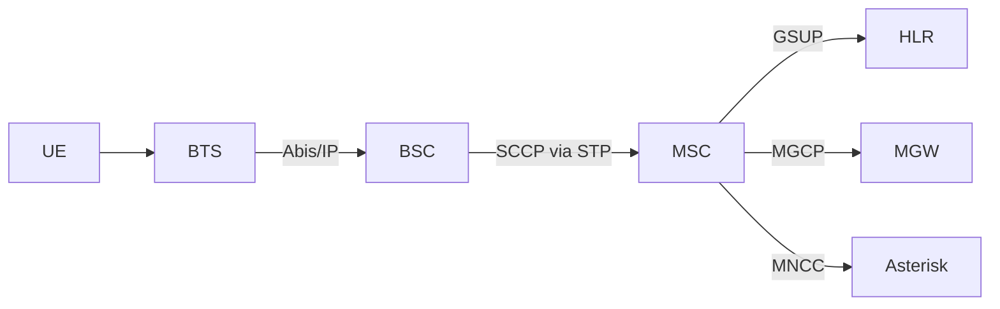
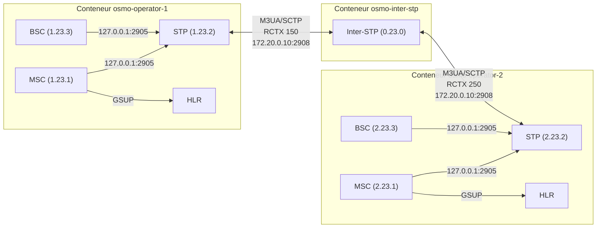
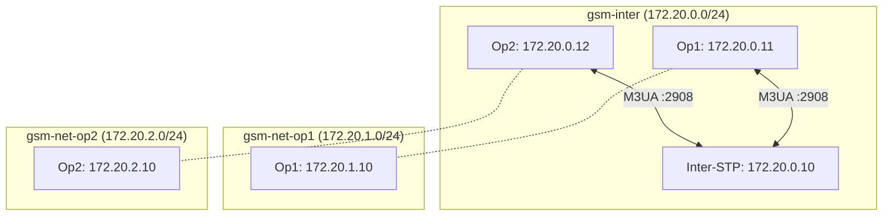
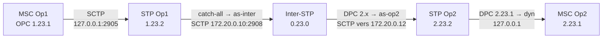
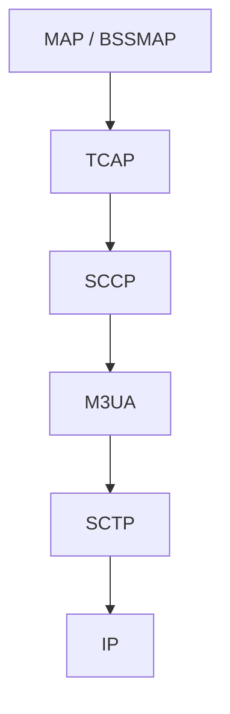
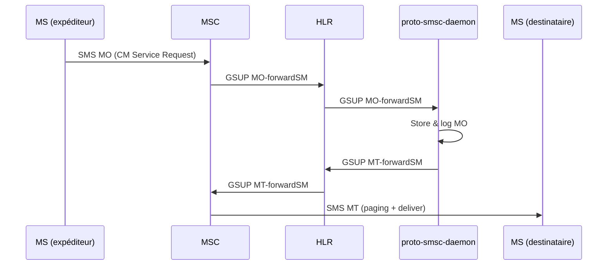
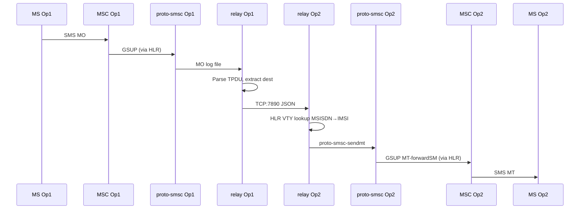
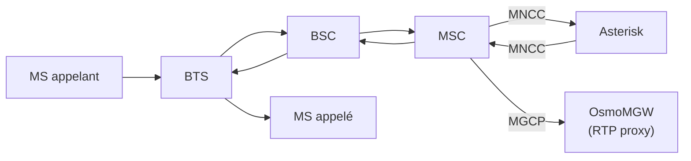
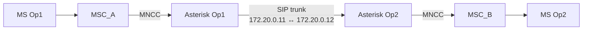

# osmo_egprs — Architecture Multi-PLMN SS7/IP

Documentation d'architecture du projet **osmo_egprs** : simulation multi-opérateur GSM complète avec interconnexion SS7 sur IP, entièrement conteneurisée via Docker.

Ce projet réalise ce qui s'apparente à un « DHCP pour SS7 » — l'automatisation complète d'une configuration SS7 inter-opérateurs habituellement réalisée à la main, reproductible d'un simple `build.sh && start.sh`.

---

## 1. Architecture d'un PLMN (Osmocom)

Chaque opérateur simulé repose sur la stack Osmocom standard, avec tous les composants dans un seul conteneur Docker. Le MSC communique en GSUP avec le HLR pour la gestion des abonnés, et en SCCP via le STP local pour la signalisation SS7. Le BSC gère l'accès radio et se connecte au MSC via le STP.



Tous ces composants tournent dans le même conteneur et communiquent via `127.0.0.1`. Le STP local sert de hub de signalisation intra-PLMN : BSC et MSC s'y connectent en M3UA/SCTP.

---

## 2. Interconnexion Multi-PLMN

L'architecture centrale du projet. Deux opérateurs distincts, chacun avec son propre core network dans un conteneur dédié, reliés par un Inter-STP central (hub SS7) qui route la signalisation M3UA/SCCP entre eux.



Le cœur du travail de debug a porté sur deux problèmes : les routes **PROHIB** causées par des RCTX incohérents entre STP et inter-STP, et les **race conditions Docker** où l'interface réseau privée (`172.20.N.10`) n'existait pas encore au moment du bind des services — résolu en passant toute la communication intra-conteneur sur `127.0.0.1`.

---

## 3. Topologie réseau Docker

Chaque conteneur opérateur est rattaché à deux réseaux Docker : le backbone d'interconnexion partagé, et un réseau privé par opérateur.

### 3.1 Réseaux

| Réseau Docker | Plage | Rôle |
|---------------|-------|------|
| `gsm-inter` | `172.20.0.0/24` | Backbone interop (trafic M3UA inter-STP) |
| `gsm-net-op1` | `172.20.1.0/24` | Réseau privé opérateur 1 (GSMTAP, GPRS) |
| `gsm-net-op2` | `172.20.2.0/24` | Réseau privé opérateur 2 |

### 3.2 Adresses IP

| Composant | IP backbone (`gsm-inter`) | IP privée (`gsm-net-opN`) |
|-----------|--------------------------|--------------------------|
| Inter-STP | `172.20.0.10` | — |
| Conteneur Op1 | `172.20.0.11` | `172.20.1.10` |
| Conteneur Op2 | `172.20.0.12` | `172.20.2.10` |

### 3.3 Communication intra-conteneur

BSC, MSC, HLR, STP, MGW et BTS tournent tous dans le même conteneur. Ils communiquent exclusivement via `127.0.0.1` :

```
BSC ──(127.0.0.1:2905)──► STP local
MSC ──(127.0.0.1:2905)──► STP local
MSC ──(127.0.0.2:4222)──► HLR
MSC ──(127.0.0.1:2427)──► MGW
```

Le STP écoute sur `0.0.0.0:2905` pour accepter les connexions locales immédiatement, sans dépendre de l'ordre d'attachement des interfaces réseau Docker. C'est le fix clé de la race condition : le réseau privé `172.20.N.10` est attaché par `docker network connect` **après** le démarrage du conteneur, donc les services ne peuvent pas bind dessus au lancement.

### 3.4 Communication inter-conteneur

Seul le lien STP↔Inter-STP traverse le réseau Docker :

```
STP Op1 (172.20.0.11) ──SCTP──► Inter-STP (172.20.0.10:2908)
STP Op2 (172.20.0.12) ──SCTP──► Inter-STP (172.20.0.10:2908)
```



---

## 4. Signalisation SS7

### 4.1 Point codes

Chaque élément du réseau SS7 possède un point code unique au format ITU 14-bit (structure 3.8.3 : `zone.network.node`, max `7.255.7`).

| Nœud | Point Code | Conteneur |
|------|-----------|-----------|
| Inter-STP | `0.23.0` | `osmo-inter-stp` |
| MSC Op1 | `1.23.1` | `osmo-operator-1` |
| STP Op1 | `1.23.2` | `osmo-operator-1` |
| BSC Op1 | `1.23.3` | `osmo-operator-1` |
| MSC Op2 | `2.23.1` | `osmo-operator-2` |
| STP Op2 | `2.23.2` | `osmo-operator-2` |
| BSC Op2 | `2.23.3` | `osmo-operator-2` |

Convention : le premier champ (`zone`) identifie l'opérateur, `23` est arbitraire dans le champ `network`, et le troisième champ distingue MSC (1), STP (2), BSC (3).

### 4.2 Associations M3UA (AS/ASP)

Chaque lien M3UA entre deux nœuds SS7 est matérialisé par un **ASP** (association SCTP physique) regroupé dans un **AS** (entité logique de routage). L'AS porte un **RCTX** (Routing Context) qui doit correspondre des deux côtés du lien.

#### RCTX — Routing Contexts

Les RCTX sont dérivés de l'identifiant opérateur pour garantir l'unicité :

| RCTX | Formule | Usage |
|------|---------|-------|
| `110` | `1×100+10` | MSC Op1 → STP Op1 |
| `120` | `1×100+20` | STP Op1 (enregistrement local) |
| `130` | `1×100+30` | BSC Op1 → STP Op1 |
| **`150`** | `1×100+50` | **STP Op1 → Inter-STP** |
| `210` | `2×100+10` | MSC Op2 → STP Op2 |
| `220` | `2×100+20` | STP Op2 (enregistrement local) |
| `230` | `2×100+30` | BSC Op2 → STP Op2 |
| **`250`** | `2×100+50` | **STP Op2 → Inter-STP** |

Le RCTX inter-STP (`N×100+50`) est le plus critique : il doit être identique dans la config du STP opérateur (`routing-key 150 1.23.2` dans `osmo-stp.cfg`) et dans la config de l'Inter-STP (`routing-key 150 1.23.2` dans `osmo-stp-interop.cfg`). Un mismatch = PROHIB.

#### Topologie des ASP

**STP opérateur** (ex: Op1, `osmo-stp.cfg` résolu) :

```
cs7 instance 0
 point-code 1.23.2

 ! BSC et MSC se connectent ici dynamiquement
 listen m3ua 2905
  local-ip 0.0.0.0
  accept-asp-connections dynamic-permitted

 ! Lien vers l'inter-STP (client SCTP)
 asp asp-to-inter 2908 2910 m3ua
  remote-ip 172.20.0.10
  local-ip 172.20.0.11
  role asp
  sctp-role client

 as as-inter m3ua
  asp asp-to-inter
  routing-key 150 1.23.2
```

Le `dynamic-permitted` sur le listener local signifie que le STP accepte les ASP entrants (BSC, MSC) sans les pré-déclarer : il crée automatiquement les AS et les routes d'après les routing-keys annoncées par les clients. Cela évite de dupliquer la configuration des point codes.

**Inter-STP** (`osmo-stp-interop.cfg` généré par `create_interop.sh`) :

```
cs7 instance 0
 point-code 0.23.0

 listen m3ua 2908
  local-ip 172.20.0.10
  accept-asp-connections dynamic-permitted

 as as-op1 m3ua
  routing-key 150 1.23.2

 as as-op2 m3ua
  routing-key 250 2.23.2
```

L'Inter-STP est purement un routeur de signalisation : il ne traite aucun message MAP/SCCP, il relaie les paquets M3UA entre opérateurs en fonction du point code de destination.

**MSC** (ex: Op1, `osmo-msc.cfg` résolu) :

```
cs7 instance 0
 point-code 1.23.1

 asp asp-to-stp 2905 2906 m3ua
  remote-ip 127.0.0.1
  local-ip  127.0.0.1
  role asp
  sctp-role client

 as as-msc m3ua
  asp asp-to-stp
  routing-key 110 1.23.1
```

**BSC** (ex: Op1, `osmo-bsc.cfg` résolu) :

```
cs7 instance 0
 point-code 1.23.3

 asp asp-to-stp 2905 2907 m3ua
  remote-ip 127.0.0.1
  local-ip  127.0.0.1
  role asp
  sctp-role client

 as as-bsc m3ua
  asp asp-to-stp
  routing-key 130 1.23.3
```

### 4.3 Table de routage SS7

La route-table associe chaque point code de destination (DPC) à l'AS qui permet de l'atteindre. C'est l'équivalent MTP3 d'une table de routage IP.

**STP opérateur** — utilise une route catch-all :

```
route-table system
 update route 0.0.0 0.0.0 linkset as-inter
```

Les routes locales (vers BSC `1.23.3` et MSC `1.23.1`) sont créées **dynamiquement** par `accept-asp-connections dynamic-permitted` quand le BSC et le MSC se connectent. La catch-all `0.0.0/0` envoie tout le reste vers l'Inter-STP — c'est l'équivalent d'une default route IP.

Sortie `show cs7 instance 0 route` attendue sur le STP Op1 :

```
Destination            Linkset Name        Linkset  Route
1.23.1/14              as-dyn-asp…         avail    avail   dyn    ← MSC (dynamique)
1.23.3/14              as-dyn-asp…         avail    avail   dyn    ← BSC (dynamique)
0.0.0/0                as-inter            avail    avail          ← catch-all
```

**Inter-STP** — routes explicites par opérateur :

```
route-table system
 ! Op1
 update route 1.23.1 7.255.7 linkset as-op1
 update route 1.23.2 7.255.7 linkset as-op1
 update route 1.23.3 7.255.7 linkset as-op1
 ! Op2
 update route 2.23.1 7.255.7 linkset as-op2
 update route 2.23.2 7.255.7 linkset as-op2
 update route 2.23.3 7.255.7 linkset as-op2
```

Le masque `7.255.7` est le match exact en ITU 14-bit (3.8.3) — équivalent d'un `/32` en IP. Chaque point code de chaque opérateur est routé vers l'AS correspondant.

### 4.4 Chemin complet d'un message SS7

Un message SCCP traversant les deux opérateurs (ex: MAP/BSSAP) :



Quand une route affiche **PROHIB**, c'est que l'AS correspondant n'a pas d'ASP en état Active — causes typiques :
- RCTX mismatch entre les deux côtés du lien
- Le nœud distant n'est pas encore démarré (race condition)
- L'IP `local-ip` ne correspond à aucune interface existante

### 4.5 Ports SCTP utilisés

| Lien | Port local | Port distant | Protocole |
|------|-----------|-------------|-----------|
| MSC → STP local | 2906 | 2905 | M3UA |
| BSC → STP local | 2907 | 2905 | M3UA |
| STP → Inter-STP | 2910 | 2908 | M3UA |

Chaque composant utilise un port source SCTP différent (2906, 2907, 2910) pour éviter les conflits dans le même conteneur.

---

## 5. Stack protocolaire



Dans notre setup, M3UA remplace MTP3 natif — c'est du Sigtran (SS7 over IP). Le STP ne voit que des paquets M3UA/SCCP : il route sur le DPC sans interpréter le contenu MAP.

---

## 6. SMS

### 6.1 SMS intra-opérateur

Le MSC a l'option `sms-over-gsup` activée : le SMSC interne est désactivé, et tous les messages SM-RP sont redirigés vers le HLR via GSUP. Le HLR route ensuite vers `proto-smsc-daemon` (issu du projet gsup-smsc-proto de FreeCalypso), connecté en GSUP au HLR.



### 6.2 SMS inter-opérateur

Le `proto-smsc-daemon` est purement local (stockage fichier, socket UNIX). Pour le SMS inter-opérateur, un daemon `sms-interop-relay.py` fait le pont TCP entre les conteneurs :



Le relay parse le TPDU SMS-SUBMIT (GSM 03.40) pour extraire le numéro de destination, consulte la table de routage `sms-routing.conf` (longest-prefix match), et envoie le SMS au relay de l'opérateur distant via TCP port 7890.

---

## 7. Voix

### 7.1 Appels intra-opérateur

Les appels vocaux transitent par Asterisk via l'interface MNCC du MSC. Le flux media (RTP) est géré par OsmoMGW.



### 7.2 Appels inter-opérateur

Les appels inter-opérateur utilisent un trunk SIP entre les deux instances Asterisk :



Le dialplan Asterisk (`extensions.conf`) route les appels selon le préfixe : numéros commençant par `1` → Op1, par `2` → Op2. Les appels vers un autre opérateur passent par le contexte `[interop_out]` qui utilise le trunk SIP.

---

## 8. Automatisation et reproductibilité

### 8.1 Template engine

Toutes les configs Osmocom utilisent des placeholders (`__PC_MSC__`, `__OPERATOR_ID__`, etc.) résolus par un seul passage de `sed` dans `apply_config_templates()` de `start.sh`. Les valeurs sont dérivées de l'identifiant opérateur :

| Placeholder | Formule | Exemple Op1 |
|------------|---------|-------------|
| `__PC_MSC__` | `N.23.1` | `1.23.1` |
| `__PC_STP__` | `N.23.2` | `1.23.2` |
| `__PC_BSC__` | `N.23.3` | `1.23.3` |
| `__RCTX_MSC__` | `N×100+10` | `110` |
| `__RCTX_BSC__` | `N×100+30` | `130` |
| `__RCTX_INTER__` | `N×100+50` | `150` |
| `__ARFCN__` | `512+N×2` | `514` |
| `__INTER_LOCAL_IP__` | `172.20.0.(10+N)` | `172.20.0.11` |
| `__CONTAINER_IP__` | `172.20.N.10` | `172.20.1.10` |

### 8.2 Génération inter-STP

`create_interop.sh` génère dynamiquement `osmo-stp-interop.cfg` pour N opérateurs. Pour chaque opérateur, il crée un AS avec le RCTX correspondant et les routes vers les trois point codes (MSC, STP, BSC).

### 8.3 Séquence de démarrage

```
./start.sh
 ├── build images Docker
 ├── créer réseau gsm-inter
 ├── create_interop.sh → osmo-stp-interop.cfg
 ├── lancer osmo-inter-stp (doit écouter AVANT les opérateurs)
 ├── pour chaque opérateur :
 │    ├── apply_config_templates (un seul sed)
 │    ├── docker run sur gsm-inter
 │    ├── docker network connect gsm-net-opN
 │    └── services démarrent via run.sh + tmux
 ├── ouvrir Wireshark sur le bridge Docker
 └── ouvrir xterms par opérateur
```

L'ordre est critique : l'Inter-STP doit écouter sur le port 2908 **avant** que les STPs opérateurs tentent de s'y connecter, sinon les ASP échouent et les routes restent PROHIB.

---

## 9. Utilisation du lab

### 9.1 Démarrage et arrêt

```bash
sudo ./start.sh          # Lance tout (choix bridge/host)
sudo ./start.sh stop     # Arrête tous les conteneurs
```

### 9.2 Accès aux conteneurs

```bash
# Opérateur 1 — session tmux avec tous les composants
sudo docker exec -ti osmo-operator-1 tmux attach

# Opérateur 2
sudo docker exec -ti osmo-operator-2 tmux attach

# Inter-STP
sudo docker exec -ti osmo-inter-stp tmux attach -t stp
```

### 9.3 Navigation tmux

| Raccourci | Action |
|-----------|--------|
| `Ctrl-b 0` | Fenêtre 0 (STP) |
| `Ctrl-b 1` | Fenêtre 1 (MSC) |
| `Ctrl-b 2` | Fenêtre 2 (HLR) |
| `Ctrl-b 3` | Fenêtre 3 (BSC) |
| `Ctrl-b 4` | Fenêtre 4 (BTS) |
| `Ctrl-b w` | Liste des fenêtres |
| `Ctrl-b d` | Détacher (quitter sans fermer) |

### 9.4 Interfaces VTY (telnet)

Chaque composant Osmocom expose une interface VTY. Se connecter depuis le conteneur :

```bash
sudo docker exec -ti osmo-operator-1 telnet 127.0.0.1 4239
```

**Ports VTY :**

| Port | Composant |
|------|-----------|
| `4239` | OsmoSTP |
| `4242` | OsmoBSC |
| `4243` | OsmoMGW |
| `4254` | OsmoMSC |
| `4258` | OsmoHLR |

### 9.5 Commandes VTY essentielles

L'interface VTY fonctionne comme un CLI Cisco. Le `?` affiche les options disponibles à tout moment.

**Diagnostic SS7 (sur le STP, port 4239) :**

```
OsmoSTP> show cs7 instance 0 asp          # État des ASP (ACTIVE/DOWN)
OsmoSTP> show cs7 instance 0 as all       # État des AS
OsmoSTP> show cs7 instance 0 route        # Table de routage — PROHIB ?
OsmoSTP> show cs7 instance 0 sccp users   # Utilisateurs SCCP enregistrés
```

Sortie saine du STP Op1 :

```
Destination            Linkset Name        Linkset  Route
1.23.1/14        acces as-dyn-…            avail    avail   dyn    ← MSC
1.23.3/14        acces as-dyn-…            avail    avail   dyn    ← BSC
0.0.0/0          acces as-inter            avail    avail          ← inter-STP
```

**Abonnés (sur le MSC, port 4254) :**

```
OsmoMSC> show subscriber all
```

**HLR (port 4258) :**

```
OsmoHLR# subscriber imsi 001010000000001 show
OsmoHLR# subscriber msisdn 10000 show
```

**Envoi SMS (depuis le MSC, port 4254) :**

```
OsmoMSC# subscriber msisdn 10000 sms sender msisdn 10001 send Bonjour
```

### 9.6 Wireshark

Wireshark est lancé automatiquement sur le bridge Docker avec le filtre `sctp or udp port 4729`. Le port UDP 4729 capture le GSMTAP (trafic radio décodé). Le filtre `sctp` capture tout le trafic M3UA inter-conteneurs.

Filtres Wireshark utiles :

```
m3ua                          # Trafic M3UA uniquement
sccp                          # Messages SCCP
gsm_map                       # Messages MAP
gsmtap                        # Trafic radio (Um)
sctp.srcport == 2908          # Trafic vers/depuis l'inter-STP
```

---

## 10. Diagnostic — Résoudre les PROHIB

Quand `show cs7 instance 0 route` affiche PROHIB, suivre cette checklist :

```bash
# 1. L'inter-STP tourne-t-il ?
sudo docker ps | grep inter-stp

# 2. Le STP voit-il l'inter-STP ? (ASP en état ACTIVE)
sudo docker exec -ti osmo-operator-1 telnet 127.0.0.1 4239
OsmoSTP> show cs7 instance 0 asp
# → asp-to-inter doit être ACTIVE

# 3. L'inter-STP voit-il les opérateurs ?
sudo docker exec -ti osmo-inter-stp telnet 127.0.0.1 4239
OsmoSTP> show cs7 instance 0 asp
# → les ASP dynamiques doivent être ACTIVE

# 4. Les routes locales (BSC/MSC) existent-elles ?
OsmoSTP> show cs7 instance 0 route
# → 1.23.1/14 et 1.23.3/14 doivent apparaître comme "dyn"
# Si absentes : BSC/MSC ne se sont pas connectés au STP

# 5. Ping entre conteneurs
sudo docker exec osmo-operator-1 ping -c1 172.20.0.10
# → doit répondre (connectivité backbone)

# 6. Redémarrage si race condition
sudo docker restart osmo-operator-1
```

| Symptôme | Cause probable | Fix |
|----------|---------------|-----|
| Routes 0.0.0/0 PROHIB | Inter-STP pas démarré ou IP incorrecte | Vérifier `__INTER_STP_IP__` et `__INTER_LOCAL_IP__` |
| Pas de routes dynamiques | BSC/MSC ne se connectent pas au STP | Vérifier que les ASP utilisent `127.0.0.1` |
| RCTX mismatch dans les logs | RCTX différent entre STP et inter-STP | Vérifier `__RCTX_INTER__` = `N×100+50` des deux côtés |
| ASP DOWN sur inter-STP | Race condition Docker | `docker restart` du conteneur opérateur |

---

## 11. Extensions possibles

**srsRAN (LTE)** — coexistence 2G/4G avec un eNodeB virtuel, partageant le même HLR/HSS.

**VoWiFi / IMS** — passerelle SIP via Asterisk pour l'accès WiFi, pont vers le core GSM.

**RAN virtuel QEMU** — émulation du SoC TI Calypso (OsmocomBB) pour un lab 100% virtualisé du baseband au core, sans hardware physique. Le travail d'émulation QEMU du Calypso (UART, contrôleur d'interruptions, périphériques) a été réalisé en parallèle de ce projet.

**Monitoring** — Prometheus/Grafana pour les métriques M3UA, dashboards de taux MAP, visualisation des connexions SCCP.

---

*Projet osmo_egprs — plateforme pédagogique télécom multi-PLMN, multi-technologies, entièrement conteneurisée.*
