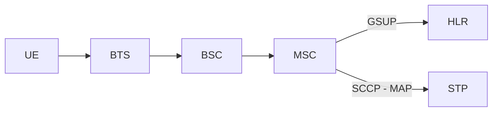
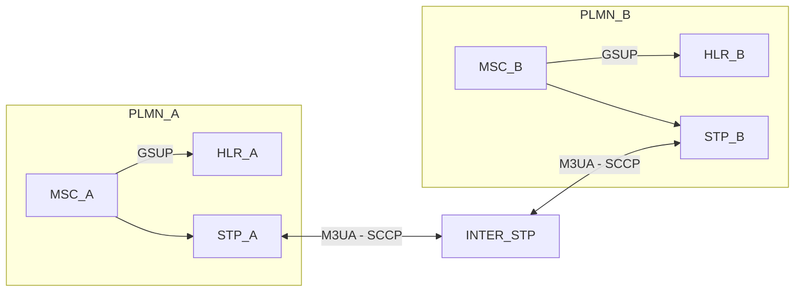
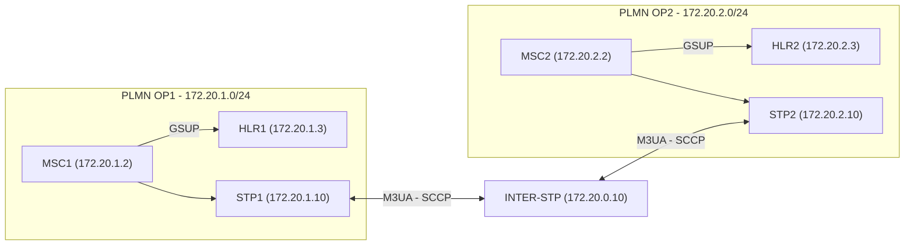
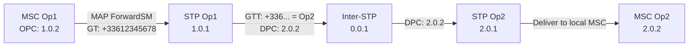
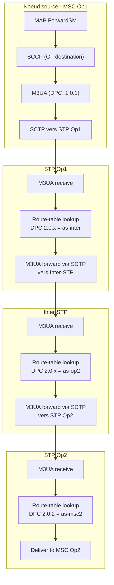
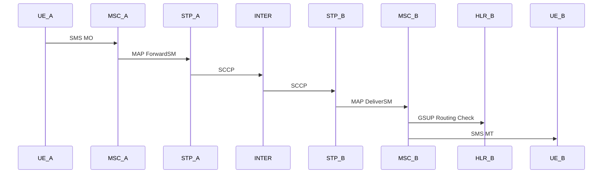
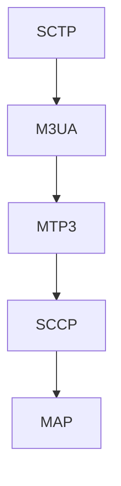
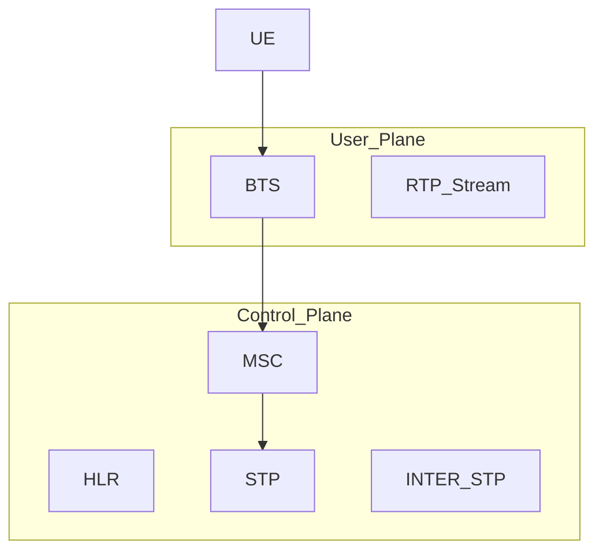
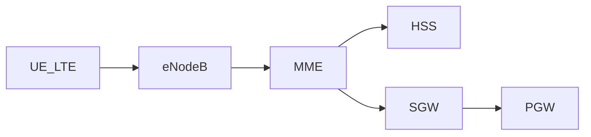
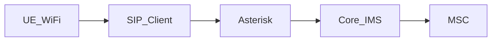

# osmo_egprs — Architecture Multi-PLMN SS7/IP

Documentation d'architecture du projet **osmo_egprs** : simulation multi-opérateur GSM complète avec interconnexion SS7 sur IP, entièrement conteneurisée via Docker.

Ce projet réalise ce qui s'apparente à un « DHCP pour SS7 » — l'automatisation complète d'une configuration SS7 inter-opérateurs habituellement réalisée à la main, reproductible d'un simple `build.sh && start.sh`.

---

## 1. Architecture d'un PLMN simple (Osmocom)

Chaque opérateur simulé repose sur la stack Osmocom standard : le MSC communique en GSUP avec le HLR pour la gestion des abonnés, et en SCCP/MAP via le STP pour la signalisation SS7.



La séparation est nette : GSUP reste interne au PLMN, SS7 sert à l'interconnexion externe.

---

## 2. Interconnexion Multi-PLMN

L'architecture centrale du projet. Deux opérateurs distincts, chacun avec son propre core network, reliés par un STP intermédiaire (Inter-STP) qui route la signalisation M3UA/SCCP entre les deux.



Nous avons réussi à atteindre les états ASP/AS Active avec un routage M3UA/SCCP fonctionnel entre opérateurs — le cœur du travail de debug a porté sur les statuts "PROHIB" des routes et les race conditions Docker affectant la connectivité STP.

---

## 3. Plan d'adressage IP

Nous avons mis en place une séparation réseau claire entre le trafic interne PLMN et le backbone d'interconnexion.

| Réseau | Plage | Rôle |
|--------|-------|------|
| Backbone interop | `172.20.0.0/24` | Interconnexion SS7 entre opérateurs |
| PLMN Opérateur 1 | `172.20.1.0/24` | Réseau interne Op1 |
| PLMN Opérateur 2 | `172.20.2.0/24` | Réseau interne Op2 |

Adresses clés sur le backbone :

| Composant | IP |
|-----------|-----|
| Inter-STP | `172.20.0.10` |
| STP Op1 | `172.20.1.10` |
| STP Op2 | `172.20.2.10` |



Tout est isolé dans `172.20.x.x` — aucun trafic ne sort du lab.

---

## 4. Tables de routage SS7

Le routage SS7 repose sur trois couches : les **point codes** identifient chaque nœud, les **AS/ASP M3UA** définissent les associations SCTP entre nœuds, et la **route-table** dirige les messages vers le bon AS en fonction du point code de destination (DPC).

### 4.1 Point Codes

Chaque élément du réseau SS7 possède un point code unique qui l'identifie dans le plan de signalisation.

| Nœud | Point Code | Rôle |
|------|-----------|------|
| STP Op1 | `1.0.1` | Signal Transfer Point opérateur 1 |
| MSC Op1 | `1.0.2` | Mobile Switching Center opérateur 1 |
| STP Op2 | `2.0.1` | Signal Transfer Point opérateur 2 |
| MSC Op2 | `2.0.2` | Mobile Switching Center opérateur 2 |
| Inter-STP | `0.0.1` | STP d'interconnexion inter-opérateur |

Les point codes sont au format ITU `zone.network.node`. Chaque opérateur a sa propre zone (1.x.x et 2.x.x), l'Inter-STP est dans la zone neutre 0.x.x.

### 4.2 Associations M3UA (AS/ASP)

Chaque lien entre deux nœuds SS7 est modélisé par un **ASP** (association SCTP physique) regroupé dans un **AS** (entité logique). L'ASP transporte les messages, l'AS permet le routage.

**STP Op1** — voit son MSC local et l'Inter-STP :

```
cs7 instance 0
 asp asp-msc1 2905 2905 m3ua
  remote-ip 172.20.1.2
 as as-msc1 m3ua
  asp asp-msc1
  routing-key 1 1.0.2
 asp asp-inter 2905 2905 m3ua
  remote-ip 172.20.0.10
 as as-inter m3ua
  asp asp-inter
  routing-key 2 0.0.1
```

**Inter-STP** — voit les deux STP opérateurs :

```
cs7 instance 0
 asp asp-stp1 2905 2905 m3ua
  remote-ip 172.20.1.10
 as as-op1 m3ua
  asp asp-stp1
  routing-key 1 1.0.1
 asp asp-stp2 2905 2905 m3ua
  remote-ip 172.20.2.10
 as as-op2 m3ua
  asp asp-stp2
  routing-key 2 2.0.1
```

**STP Op2** — symétrique de Op1 :

```
cs7 instance 0
 asp asp-msc2 2905 2905 m3ua
  remote-ip 172.20.2.2
 as as-msc2 m3ua
  asp asp-msc2
  routing-key 1 2.0.2
 asp asp-inter 2905 2905 m3ua
  remote-ip 172.20.0.10
 as as-inter m3ua
  asp asp-inter
  routing-key 2 0.0.1
```

Quand tous les ASP passent en état **Active**, les AS deviennent opérationnels et le routage peut commencer. C'est sur cette étape que le gros du debug a porté : les race conditions Docker faisaient que les ASP tentaient de se connecter avant que le nœud distant soit prêt, causant des états **PROHIB** persistants sur les routes.

### 4.3 Route-table

La route-table est le cœur du routage SS7 : elle associe chaque point code de destination (DPC) à l'AS qui permet de l'atteindre. C'est la table de routage au sens classique, mais au niveau MTP3.

**STP Op1 :**

| DPC | Via AS | Explication |
|-----|--------|-------------|
| `1.0.2` | `as-msc1` | MSC local, directement connecté |
| `0.0.1` | `as-inter` | Inter-STP, pour sortir du PLMN |
| `2.0.1` | `as-inter` | STP Op2, via l'Inter-STP |
| `2.0.2` | `as-inter` | MSC Op2, via l'Inter-STP |

```
cs7 instance 0
 route-table system
  update route 1.0.2 1.0.2 linkset as-msc1
  update route 0.0.1 0.0.1 linkset as-inter
  update route 2.0.1 2.0.2 linkset as-inter
```

La dernière ligne utilise un **range** `2.0.1 2.0.2` : tout point code entre 2.0.1 et 2.0.2 passe par l'Inter-STP. C'est l'équivalent d'une route par défaut vers l'autre opérateur.

**Inter-STP :**

| DPC | Via AS | Explication |
|-----|--------|-------------|
| `1.0.1` - `1.0.2` | `as-op1` | Tout le réseau Op1 |
| `2.0.1` - `2.0.2` | `as-op2` | Tout le réseau Op2 |

```
cs7 instance 0
 route-table system
  update route 1.0.1 1.0.2 linkset as-op1
  update route 2.0.1 2.0.2 linkset as-op2
```

L'Inter-STP est purement un routeur de signalisation : il ne traite aucun message MAP, il se contente de relayer les paquets SCCP entre les deux opérateurs en fonction du DPC.

**STP Op2 :** symétrique de Op1.

| DPC | Via AS | Explication |
|-----|--------|-------------|
| `2.0.2` | `as-msc2` | MSC local |
| `0.0.1` | `as-inter` | Inter-STP |
| `1.0.1` | `as-inter` | STP Op1, via l'Inter-STP |
| `1.0.2` | `as-inter` | MSC Op1, via l'Inter-STP |

```
cs7 instance 0
 route-table system
  update route 2.0.2 2.0.2 linkset as-msc2
  update route 0.0.1 0.0.1 linkset as-inter
  update route 1.0.1 1.0.2 linkset as-inter
```

### 4.4 Routage SCCP / Global Title

Au-dessus de MTP3, le routage SCCP utilise les **Global Titles** (GT) pour adresser les messages MAP. Un GT est typiquement un numéro E.164 (le MSISDN de l'abonné) ou un GT de service (pour le HLR, le SMSC, etc.).

Quand le MSC de l'opérateur A envoie un MAP ForwardSM vers un abonné de l'opérateur B, le STP examine le GT de destination pour déterminer vers quel point code router le message SCCP. C'est la **Global Title Translation** (GTT).



Le STP Op1 voit que le préfixe GT `+336...` appartient à Op2, traduit en DPC `2.0.2`, et envoie via l'Inter-STP. L'automatisation de cette GTT dans notre setup est ce qui rend l'ensemble fonctionnel sans intervention manuelle.

### 4.5 Chemin complet d'un message

Pour résumer, un message MAP traversant les deux opérateurs passe par ces couches à chaque hop :



Quand une route affiche **PROHIB**, c'est que l'AS correspondant n'a pas d'ASP Active — le nœud distant est injoignable. C'est exactement le problème que nous avons résolu en gérant l'ordre de démarrage des conteneurs Docker.

---

## 5. Flux SMS Inter-Opérateur

L'un des objectifs principaux du projet : l'interopérabilité SMS entre opérateurs via `gsup-smsc-proto`. Le SMS traverse toute la chaîne de signalisation SS7 pour atteindre le réseau destinataire.



---

## 6. Stack protocolaire SS7/IP

La pile de protocoles utilisée pour l'interconnexion, de la couche transport SCTP jusqu'à MAP.



---

## 7. Séparation Plan de Contrôle / Plan Utilisateur



Le plan de contrôle (signalisation, gestion abonnés) est entièrement séparé du plan utilisateur (voix RTP, données). Cette séparation est fidèle à l'architecture des réseaux réels.

---

## 8. Bridge GSM → SIP

Extension possible de l'architecture : passerelle vers le monde IP via Asterisk et Linphone, permettant la translation Circuit Switched → IP.


---

## 9. Extensions possibles

### Intégration srsRAN (LTE)

L'architecture peut s'étendre au LTE avec srsRAN pour simuler la coexistence 2G/4G.



### VoWiFi / IMS simplifié via Asterisk



### RAN virtuel via QEMU

Nous avons par ailleurs travaillé sur l'émulation QEMU du SoC TI Calypso pour exécuter le firmware OsmocomBB sans hardware physique — ouvrant la voie à un lab 100% virtualisé, du baseband au core network.

---

## 10. Capacités du lab

### Observer

Attach inter-PLMN, routage SMS, flux MAP, requêtes GSUP subscriber, translation SIP ↔ GSM. Le logging GSMTAP permet l'analyse dans Wireshark.

### Tester

Filtrage STP, whitelist Global Title, limitation TCAP rate, séparation réseau interne/externe.

### Mesurer

Latence M3UA, impact congestion, charge CPU, effets de boucle routing-key.

### Simuler

Roaming inter-PLMN, défaillance STP, perte HLR, fallback 2G.

---

## 11. Reproductibilité

L'ensemble du setup est reproductible de zéro :

```
./build.sh    # Construit tous les conteneurs
./start.sh    # Lance l'architecture complète
```

Les scripts gèrent l'orchestration Docker, les dépendances de démarrage, la configuration SS7 automatisée, et le logging GSMTAP — transformant une configuration habituellement manuelle et fragile en un déploiement déterministe.

---

## 12. Utilisation du lab

### 12.1 Accès aux conteneurs

Après `./start.sh`, chaque conteneur tourne avec un multiplexeur tmux. On y accède via `docker exec` :

```bash
# Opérateur 1
sudo docker exec -ti osmo-operator-1 tmux attach

# Opérateur 2
sudo docker exec -ti osmo-operator-2 tmux attach

# Interconnexion (Inter-STP)
sudo docker exec -ti osmo-interop tmux attach
```

### 12.2 Navigation tmux

Chaque conteneur ouvre plusieurs panneaux tmux, un par composant Osmocom. La navigation se fait avec le préfixe `Ctrl-b` suivi du numéro de fenêtre :

| Raccourci | Action |
|-----------|--------|
| `Ctrl-b 0` | Fenêtre 0 (typiquement le STP) |
| `Ctrl-b 1` | Fenêtre 1 (typiquement le MSC) |
| `Ctrl-b 2` | Fenêtre 2 (typiquement le HLR) |
| `Ctrl-b 3` | Fenêtre 3 (typiquement le BSC) |
| `Ctrl-b 4` | Fenêtre 4 (typiquement le BTS) |
| `Ctrl-b n` | Fenêtre suivante |
| `Ctrl-b p` | Fenêtre précédente |
| `Ctrl-b w` | Liste de toutes les fenêtres |
| `Ctrl-b d` | Détacher la session (quitter sans fermer) |

Les numéros de fenêtre peuvent varier selon la configuration du conteneur. Utiliser `Ctrl-b w` pour voir la liste complète avec les noms des composants.

### 12.3 Interfaces VTY (telnet)

Chaque composant Osmocom expose une interface VTY sur un port telnet local. On s'y connecte depuis l'intérieur du conteneur :

```bash
# Depuis le host, entrer dans le conteneur puis telnet
sudo docker exec -ti osmo-operator-1 telnet 127.0.0.1 4242
```

**Ports VTY — Opérateur 1 et 2 :**

| Port | Composant | Description |
|------|-----------|-------------|
| `4242` | OsmoSTP | Signal Transfer Point |
| `4247` | OsmoMSC | Mobile Switching Center |
| `4249` | OsmoBSC | Base Station Controller |
| `4254` | OsmoBTS | Base Transceiver Station |
| `4258` | OsmoHLR | Home Location Register |
| `4263` | OsmoMGW | Media Gateway |

**Ports VTY — Interconnexion (osmo-interop) :**

| Port | Composant | Description |
|------|-----------|-------------|
| `4242` | OsmoSTP | Inter-STP (routeur de signalisation) |

Exemples d'accès rapide :

```bash
# STP opérateur 1
sudo docker exec -ti osmo-operator-1 telnet 127.0.0.1 4242

# MSC opérateur 1
sudo docker exec -ti osmo-operator-1 telnet 127.0.0.1 4247

# HLR opérateur 2
sudo docker exec -ti osmo-operator-2 telnet 127.0.0.1 4258

# Inter-STP
sudo docker exec -ti osmo-interop telnet 127.0.0.1 4242
```

### 12.4 Commandes VTY de base

L'interface VTY Osmocom fonctionne comme un CLI Cisco. Voici les commandes essentielles, utilisables sur n'importe quel composant.

**Navigation générale :**

```
OsmoMSC> help                  # Liste toutes les commandes disponibles
OsmoMSC> ?                     # Idem, raccourci
OsmoMSC> list                  # Liste toutes les commandes avec leur syntaxe
OsmoMSC> show version          # Version du composant
OsmoMSC> enable                # Passer en mode privilégié (comme "enable" sur Cisco)
OsmoMSC# configure terminal    # Entrer en mode configuration
OsmoMSC(config)# exit          # Remonter d'un niveau
```

Le `?` peut aussi être utilisé en milieu de commande pour voir les options possibles :

```
OsmoMSC> show ?                # Affiche tout ce qu'on peut "show"
OsmoMSC> show cs7 ?            # Affiche les sous-commandes cs7
```

**Commandes SS7 (sur le STP ou tout composant avec cs7) :**

```
OsmoSTP> show cs7 instance 0 users         # Composants connectés à cette instance SS7
OsmoSTP> show cs7 instance 0 asp            # État des ASP (associations SCTP)
OsmoSTP> show cs7 instance 0 as all         # État des AS (Application Servers)
OsmoSTP> show cs7 instance 0 sccp users     # Utilisateurs SCCP enregistrés
OsmoSTP> show cs7 instance 0 routes         # Table de routage SS7 — CRUCIAL pour le debug
```

La commande `show cs7 instance 0 routes` est la plus importante pour le debug : c'est elle qui montre si les routes sont en état **ACTIVE** ou **PROHIB**. Une route PROHIB signifie que l'AS correspondant n'a pas d'ASP connecté — le nœud distant est injoignable.

Exemple de sortie saine :

```
Destination        Mask               Linkset      Priority
1.0.2              1.0.2              as-msc1      0        ACTIVE
0.0.1              0.0.1              as-inter     0        ACTIVE
2.0.1              2.0.2              as-inter     0        ACTIVE
```

Exemple de sortie en erreur (nœud distant pas encore démarré) :

```
Destination        Mask               Linkset      Priority
1.0.2              1.0.2              as-msc1      0        ACTIVE
0.0.1              0.0.1              as-inter     0        PROHIB
2.0.1              2.0.2              as-inter     0        PROHIB
```

**Commandes subscriber (sur le HLR, port 4258) :**

```
OsmoHLR> enable
OsmoHLR# subscriber imsi 001010000000001 show    # Afficher un abonné par IMSI
OsmoHLR# subscriber msisdn 20000 show            # Afficher un abonné par MSISDN
OsmoHLR# subscriber imsi 001010000000001 show     # Détails complets (état, services)
```

**Commandes subscriber (sur le MSC, port 4247) :**

```
OsmoMSC> show subscriber all                     # Tous les abonnés attachés
OsmoMSC> subscriber msisdn 20000 show             # Détails d'un abonné
```

### 12.5 Envoyer un SMS

L'envoi de SMS se fait depuis l'interface VTY du MSC (port `4247`). La syntaxe :

```
OsmoMSC# sms <subscriber_id> send <msisdn_destinataire> <texte>
```

Exemple concret — envoyer "test" depuis l'abonné 1 vers le MSISDN 20000 :

```bash
# Se connecter au MSC de l'opérateur 1
sudo docker exec -ti osmo-operator-1 telnet 127.0.0.1 4247

# Dans le VTY :
OsmoMSC> enable
OsmoMSC# subscriber msisdn 10000 sms send 20000 test
```

Pour un SMS inter-opérateur (Op1 → Op2), le message traverse toute la chaîne SS7 décrite en section 4 et 5 : MSC Op1 → STP Op1 → Inter-STP → STP Op2 → MSC Op2.

On peut observer le transit du SMS en temps réel avec GSMTAP dans Wireshark, ou en regardant les logs dans les fenêtres tmux des différents composants.

### 12.6 Commandes de debug utiles

Quand quelque chose ne marche pas, voici la checklist de diagnostic :

```bash
# 1. Vérifier que tous les conteneurs tournent
sudo docker ps

# 2. Vérifier les routes SS7 sur chaque STP
sudo docker exec -ti osmo-operator-1 telnet 127.0.0.1 4242
OsmoSTP> show cs7 instance 0 routes
# → Toutes les routes doivent être ACTIVE

# 3. Vérifier les ASP
OsmoSTP> show cs7 instance 0 asp
# → Tous les ASP doivent être en état "active"

# 4. Vérifier les AS
OsmoSTP> show cs7 instance 0 as all
# → Tous les AS doivent être "active"

# 5. Vérifier que l'abonné est attaché (sur le MSC)
sudo docker exec -ti osmo-operator-1 telnet 127.0.0.1 4247
OsmoMSC> show subscriber all
# → L'abonné doit apparaître avec un état "attached"

# 6. Vérifier le HLR
sudo docker exec -ti osmo-operator-1 telnet 127.0.0.1 4258
OsmoHLR# subscriber msisdn 10000 show
```

Si les routes sont en PROHIB, c'est généralement un problème d'ordre de démarrage. Un `docker restart` du conteneur concerné suffit souvent à rétablir la connectivité, le temps que les ASP renégocient.

---

## Évolutions envisagées

Monitoring centralisé (Prometheus), dashboards MAP rate, visualisation SCCP calls, scripts de failover STP, et simulation d'anomalies de trafic pour tester la résilience.

---

*Projet osmo_egprs — plateforme pédagogique télécom multi-PLMN, multi-technologies, entièrement conteneurisée.*
