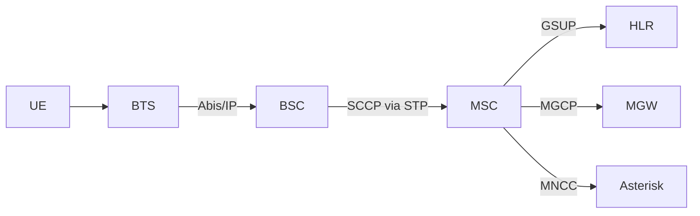
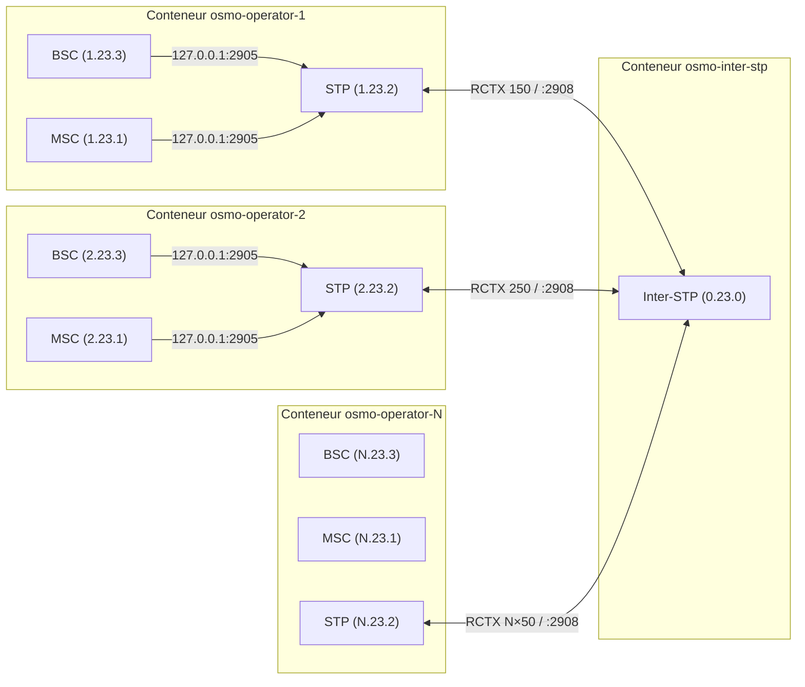
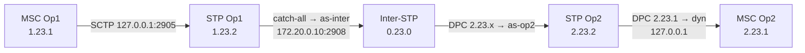
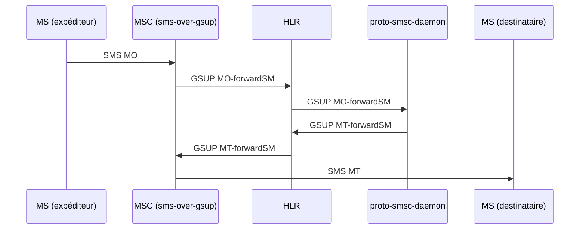
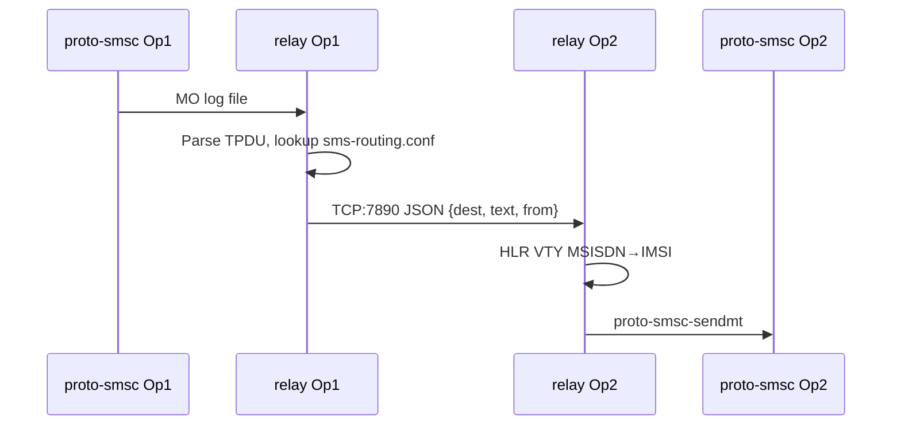
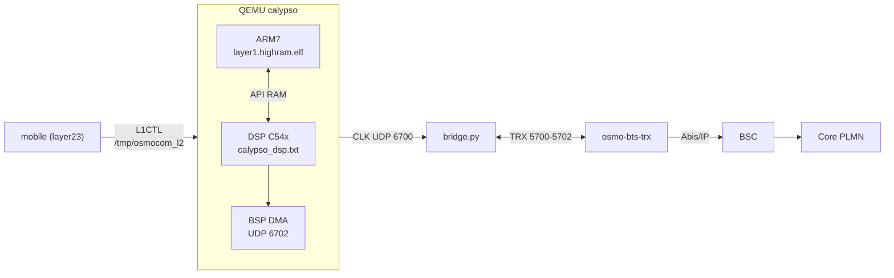

::: {.sk-filter}
<input id="sk-filter" type="text" placeholder="filtrer les fichiers (ex: dsp, .c, shunt)..." autocomplete="off">
:::

::: {.callout-note appearance="simple" icon=false}
**Bundle plat du depot** - doc, tests, headers, sources, python, shell.
Scope `.` - git `heads/main@1e293bc` - genere 2026-08-04T23:20:10+02:00
- exclusions `subprojects|build|pc-bios|tests/functional|tests/qtest|tests/unit|tests/migration|tests/qemu-iotests|node_modules|\.git|\.pytest_cache` - troncature 512 ko/fichier.
:::


# 1 - Documentation {#sec-1}

::: {.section-count}
**3 fichiers**
:::

## `environment/README.md` {#f-environment-readme-md}

::: {.file-meta}
[.md]{.tag} 85 lignes - 3,7KB
:::

````{.markdown .numberLines filename="environment/README.md"}
# `environment/` — la configuration, par domaine

`calypso.env` mélangeait 312 variables : chemins d'installation, cadences du modèle, sondes de
mesure et contournements, sans distinction. Ce répertoire les sépare **par ce qu'elles font**,
pour qu'on sache ce qu'on a le droit de toucher.

| Fichier | Domaine | Touchez-y ? |
|---|---|---|
| `paths.env` | où sont les dépendances sur **votre** machine | **oui**, c'est le premier à régler |
| `modes.env` | les profils prêts à l'emploi (le mode qui campe, le mode natif…) | **oui**, choisissez-en un |
| `bsp.env` | BSP / DMA / DARAM / feed I-Q / horloge TDMA | si vous savez ce que vous faites |
| `dsp.env` | cœur c54x : interruptions, IMR, cadence d'exécution | idem |
| `fbsb.env` | FB / FBSB / corrélateur / démodulateur | idem |
| `shunt.env` | canaux shunt DL/UL, injections | idem |
| `rf.env` | TPU / TSP / RF / AFC | idem |
| `debug.env` | sondes et traces — **sans effet** sur l'émulation | **oui**, librement |
| `fixes.env` | le sas `CALYPSO_FIXES` : correctifs en attente de validation | temporairement |
| `crutches.env` | **les béquilles** — contournements de branches non implémentées | **non**, sauf pour diagnostiquer |

## Trois choses à savoir avant de modifier quoi que ce soit

**1. La vérité est le manifeste, pas la ligne de commande.**
```bash
grep "calypso-manifest" /root/qemu.log
```
Certaines variables en reposent d'autres silencieusement : `CALYPSO_NATIVE_HELPED=1` allume aussi
`FB_CORR_ENTRY`, `FB_ENERGY` et `FB_IQ_*`. Retirer l'une d'elles de la ligne de commande ne la
supprime pas — elle revient à son défaut.

**2. `=0` ne coupe pas tout.** Quatre idiomes de gate coexistent :

| Idiome | Actif quand | Comment couper |
|---|---|---|
| `getenv("X") ? 1 : 0` | la variable **existe**, même à `0` | **`unset X`** |
| `atoi(...) > 0` | valeur > 0 | `X=0` |
| `*e == '1'` | exactement `"1"` | toute autre valeur |
| défaut ON + `X_OFF` | par défaut | poser `X_OFF` |

**3. `:=` contre `=`.** Dans ces fichiers, `: "${VAR:=valeur}"` laisse la ligne de commande gagner ;
`VAR=valeur` la **verrouille**. N'utilisez `=` que pour ce qui ne doit jamais être surchargé.

## Référence complète

Les 312 variables, avec défaut, effet mesuré, mode, idiome, catégorie et dépendances :
`../hw/arm/calypso/doc/VARIABLES_ENVIRONNEMENT.md`.


## Comment ça se charge

Tout passe par `load.env`, sourcé par `start-clean.sh` :

```bash
set -a ; . ./environment/load.env ; set +a
```

L'ordre compte. Tous les fichiers utilisent `:=` (« si pas déjà défini »), donc **le premier qui
pose une valeur gagne** :

1. la **ligne de commande** — `VAR=x ./run.sh` gagne toujours ;
2. `modes.env` — le profil choisi ;
3. les fichiers par domaine — les défauts ;
4. `calypso.env` — l'ancien monolithe, conservé le temps de la migration. Il n'utilise que `:=`,
   donc il ne peut rien écraser : il ne fournit que ce qui n'a pas encore été réparti. À vider
   progressivement.

## Les fichiers hérités

`calypso.env`, `calypso_hack.env`, `calypso_native*.env`, `calypso_shunt_*.env`, `calypso_wire.env`
datent d'avant ce découpage. Ils sont conservés — on ne détruit pas ce qui marche — mais la
configuration nouvelle vit dans les fichiers par domaine.

## Ce que contient chaque domaine

| Fichier | Variables | dont béquilles |
|---|---|---|
| `bsp.env` | 52 | 10 |
| `dsp.env` | 52 | 15 |
| `fbsb.env` | 52 | 25 |
| `shunt.env` | 58 | 34 |
| `armdsp.env` | 47 | 16 |
| `opcodes.env` | 50 | 16 |

**116 béquilles sur 311 variables** — plus d'un tiers du projet est du contournement. Chacune est
annotée à son site de lecture dans le code (`grep -rn "@BEQUILLE" hw/arm/calypso/`), avec ce
qu'elle masque et la condition qui la rendrait inutile.

````

## `README.md` {#f-readme-md}

::: {.file-meta}
[.md]{.tag} 530 lignes - 18KB
:::

````{.markdown .numberLines filename="README.md"}
# osmo-nitb-for-calypso — Architecture Multi-PLMN SS7/IP

Documentation d'architecture du projet **osmo-nitb-for-calypso** : simulation multi-opérateur GSM complète avec interconnexion SS7 sur IP, entièrement conteneurisée via Docker.

Ce projet réalise ce qui s'apparente à un « DHCP pour SS7 » — l'automatisation complète d'une configuration SS7 inter-opérateurs habituellement réalisée à la main, reproductible d'un simple `tools/make-docker-image.sh && start.sh`.

**Support N opérateurs** : le démarrage en mode bridge accepte de 1 à 9 opérateurs sans modifier aucune configuration. Tous les fichiers (pjsip, dialplan, SMS routing, inter-STP) sont générés dynamiquement selon N.

---

## 1. Architecture d'un PLMN (Osmocom)

Chaque opérateur simulé repose sur la stack Osmocom standard, tous les composants dans un seul conteneur Docker.



Tous ces composants tournent dans le même conteneur et communiquent via `127.0.0.1`. Le STP local sert de hub de signalisation intra-PLMN.

---

## 2. Interconnexion Multi-PLMN

L'architecture centrale du projet. N opérateurs distincts, chacun avec son core network dans un conteneur dédié, reliés par un Inter-STP central qui route la signalisation M3UA/SCCP entre eux.



---

## 3. Topologie réseau Docker

### 3.1 Réseaux

| Réseau Docker | Plage | Rôle |
|---------------|-------|------|
| `gsm-inter` | `172.20.0.0/24` | Backbone interop (M3UA inter-STP) |
| `gsm-net-opN` | `172.20.N.0/24` | Réseau privé opérateur N (GSMTAP, GPRS) |

### 3.2 Adresses IP

| Composant | IP backbone (`gsm-inter`) | IP privée (`gsm-net-opN`) |
|-----------|--------------------------|--------------------------|
| Inter-STP | `172.20.0.10` | — |
| Conteneur OpN | `172.20.0.(10+N)` | `172.20.N.10` |

**Formule générale** : opérateur N → backbone `172.20.0.(10+N)`, privé `172.20.N.10`

### 3.3 Communication intra-conteneur

Tous les composants communiquent via `127.0.0.1` (fix de la race condition Docker) :

```
BSC ──(127.0.0.1:2905)──► STP local
MSC ──(127.0.0.1:2905)──► STP local
MSC ──(127.0.0.2:4222)──► HLR
MSC ──(127.0.0.1:2427)──► MGW
```

Le STP écoute sur `127.0.0.1:2905` immédiatement, sans dépendre de l'interface réseau Docker (attachée après démarrage du container via `docker network connect`).

### 3.4 Communication inter-conteneur

Uniquement le lien STP↔Inter-STP traverse le réseau Docker :

```
STP OpN (172.20.0.(10+N)) ──SCTP──► Inter-STP (172.20.0.10:2908)
```

---

## 4. Signalisation SS7

### 4.1 Point codes

Format ITU 14-bit (3.8.3 : `zone.network.node`)

| Nœud | Point Code | Formule |
|------|-----------|---------|
| Inter-STP | `0.23.0` | fixe |
| MSC OpN | `N.23.1` | zone=N |
| STP OpN | `N.23.2` | zone=N |
| BSC OpN | `N.23.3` | zone=N |

### 4.2 Routing Contexts (RCTX)

| RCTX | Formule | Usage |
|------|---------|-------|
| `N×100+10` | `rctx_msc` | MSC OpN → STP OpN |
| `N×100+20` | `rctx_stp` | STP OpN (registration) |
| `N×100+30` | `rctx_bsc` | BSC OpN → STP OpN |
| **`N×100+50`** | **`rctx_inter`** | **STP OpN → Inter-STP** |

Le RCTX inter (`N×100+50`) est le plus critique : il doit correspondre dans `osmo-stp.cfg` (STP opérateur) et être cohérent avec la connexion vers l'inter-STP.

### 4.3 Configuration inter-STP (générée)

L'inter-STP utilise des **AS sans routing-key** (catch-all par opérateur). Le routage se fait uniquement sur le DPC :

```
cs7 instance 0
 point-code 0.23.0
 listen m3ua 2908
  accept-asp-connections dynamic-permitted

 as as-opN m3ua
  traffic-mode override     ← PAS de routing-key

 route-table system
  update route N.23.1 7.255.7 linkset as-opN
  update route N.23.2 7.255.7 linkset as-opN
  update route N.23.3 7.255.7 linkset as-opN
```

### 4.4 Chemin complet d'un message SS7



---

## 5. Génération dynamique — N opérateurs

Toutes les configurations dépendant de N sont **générées au démarrage**. Aucun fichier template ne contient de valeur hardcodée pour un nombre spécifique d'opérateurs.

### 5.1 Template engine (placeholders)

`apply_config_templates()` dans `start.sh` résout en **1 seul passage `sed`** :

| Placeholder | Formule | Exemple N=2 |
|------------|---------|-------------|
| `__PC_MSC__` | `N.23.1` | `2.23.1` |
| `__PC_STP__` | `N.23.2` | `2.23.2` |
| `__PC_BSC__` | `N.23.3` | `2.23.3` |
| `__RCTX_MSC__` | `N×100+10` | `210` |
| `__RCTX_BSC__` | `N×100+30` | `230` |
| `__RCTX_INTER__` | `N×100+50` | `250` |
| `__ARFCN__` | `512+N×2` | `516` |
| `__INTER_LOCAL_IP__` | `172.20.0.(10+N)` | `172.20.0.12` |
| `__CONTAINER_IP__` | `172.20.N.10` | `172.20.2.10` |

### 5.2 Sections générées (dépendent de N total)

Après la substitution sed, `start.sh` **appende** à chaque opérateur :

| Section | Fichier | Contenu |
|---------|---------|---------|
| Trunks PJSIP | `pjsip.conf` | N-1 blocs `[interop_trunk_opX]` |
| Dialplan sortant | `extensions.conf` | Contexte `[interop_out]` avec N-1 extensions |
| Routage SMS | `sms-routing.conf` | Table complète pour N opérateurs |
| Config inter-STP | `osmo-stp-interop.cfg` | N AS + N×3 routes SS7 |

### 5.3 Séquence de démarrage

```
./start.sh  [bridge mode]
 ├── Saisie N opérateurs + MCC/MNC/nom par opérateur
 ├── Création réseau gsm-inter (172.20.0.0/24)
 ├── create_interop.sh N → osmo-stp-interop.cfg
 ├── Lancement osmo-inter-stp (doit écouter :2908 AVANT les opérateurs)
 └── Pour chaque opérateur N :
      ├── apply_config_templates (sed + génération sections dynamiques)
      ├── docker run sur gsm-inter @ 172.20.0.(10+N)
      ├── docker network connect gsm-net-opN @ 172.20.N.10
      └── Services via run.sh + tmux
```

L'ordre est critique : l'Inter-STP doit écouter avant que les STPs opérateurs tentent de s'y connecter.

---

## 6. SMS

### 6.1 SMS intra-opérateur



### 6.2 SMS inter-opérateur

`sms-interop-relay.py` surveille le log MO de `proto-smsc-daemon`, parse le TPDU GSM 03.40, consulte `sms-routing.conf` (longest-prefix match), et transfère via TCP port 7890 au relay de l'opérateur cible.



---

## 7. Voix

### 7.1 Intra-opérateur

```
MS → BTS → BSC → MSC → MNCC → Asterisk → MNCC → MSC → BSC → BTS → MS
                              ↕ MGCP
                            OsmoMGW (RTP)
```

### 7.2 Inter-opérateur

```
MS(OpX) → MSC(OpX) → MNCC → Asterisk(OpX)
              ─── SIP trunk 172.20.0.(10+X) ↔ 172.20.0.(10+Y) ───
                               Asterisk(OpY) → MNCC → MSC(OpY) → MS(OpY)
```

Le dialplan `[interop_out]` route automatiquement sur le premier chiffre du numéro composé (convention : chiffre N = opérateur N). Pour 3 opérateurs, Op1 a des trunks vers Op2 et Op3, etc.

---

## 8. Utilisation du lab

### 8.1 Démarrage et arrêt

```bash
sudo ./tools/make-docker-image.sh          # Build l'image Docker (1 fois)
sudo ./start.sh          # Lance tout (choisir bridge, saisir N opérateurs)
sudo ./start.sh stop     # Arrête tous les containers

sudo ./provision_hlr.sh  # Provisionne les abonnés de test dans les HLR
```

Trois modes PHY pour le côté MS, sélectionnés via `PHY_MODE` à l'intérieur du
container avant d'invoquer `run.sh` :

| `PHY_MODE` | Pile | Usage |
|------------|------|-------|
| `faketrx` (défaut) | `fake_trx` → `trxcon` → `mobile` | Multi-MS, rapide, pas de DSP |
| `virtphy` | `osmo-bts-virtual` ↔ `virtphy` ↔ `mobile` | Multi-MS via multicast UDP |
| `qemu` | `osmo-bts-trx` ↔ `bridge.py` ↔ QEMU Calypso ↔ `mobile` | Baseband émulé (ARM7+DSP), 1 MS |

Voir §11 pour le mode QEMU.

### 8.2 Accès aux containers

```bash
# Opérateur N — tmux avec STP/MSC/HLR/BSC/BTS/SMSC
sudo docker exec -ti osmo-operator-1 tmux attach
sudo docker exec -ti osmo-operator-2 tmux attach
sudo docker exec -ti osmo-operator-N tmux attach

# Inter-STP
sudo docker exec -ti osmo-inter-stp tmux attach -t stp
```

### 8.3 Navigation tmux

| Raccourci | Fenêtre |
|-----------|---------|
| `Ctrl-b 0` | faketrx |
| `Ctrl-b 1` | MS1 (trxcon + mobile) |
| `Ctrl-b 2` | Asterisk |
| `Ctrl-b 3` | SMSC (proto-smsc-daemon + relay) |
| `Ctrl-b w` | Liste toutes les fenêtres |
| `Ctrl-b d` | Détacher |

### 8.4 Interfaces VTY (telnet depuis le container)

| Port | Composant |
|------|-----------|
| `4239` | OsmoSTP |
| `4242` | OsmoBSC |
| `4243` | OsmoMGW |
| `4254` | OsmoMSC |
| `4258` | OsmoHLR |

### 8.5 Commandes VTY essentielles

```
# Sur STP (4239) — diagnostic SS7
OsmoSTP> show cs7 instance 0 asp          # État ASP (ACTIVE/DOWN)
OsmoSTP> show cs7 instance 0 as all       # État AS
OsmoSTP> show cs7 instance 0 route        # Table de routage — PROHIB ?

# Sortie saine STP OpN :
# N.23.1/14   as-dyn-…  avail  avail  dyn   ← MSC (dynamique)
# N.23.3/14   as-dyn-…  avail  avail  dyn   ← BSC (dynamique)
# 0.0.0/0     as-inter  avail  avail        ← catch-all inter-STP

# Sur MSC (4254)
OsmoMSC# subscriber msisdn 10001 sms sender msisdn 10002 send Bonjour
OsmoMSC# show subscriber all

# Sur HLR (4258)
OsmoHLR# subscriber imsi 001010000000001 show
OsmoHLR# show gsup-clients
```

### 8.6 Wireshark

Lancé automatiquement sur le bridge Docker avec filtre `sctp or udp port 4729`.

```
m3ua                      # Trafic M3UA uniquement
sccp                      # Messages SCCP
gsm_map                   # Messages MAP
gsmtap                    # Trafic radio (Um)
sctp.srcport == 2908      # Trafic vers/depuis l'inter-STP
```

---

## 9. Diagnostic — Résoudre les PROHIB

```bash
# 1. L'inter-STP tourne-t-il ?
sudo docker ps | grep inter-stp

# 2. L'ASP vers l'inter-STP est-il ACTIVE ?
sudo docker exec osmo-operator-1 sh -c \
  'echo "show cs7 instance 0 asp" | telnet 127.0.0.1 4239 2>/dev/null'

# 3. L'inter-STP voit-il les opérateurs ?
sudo docker exec osmo-inter-stp sh -c \
  'echo "show cs7 instance 0 asp" | telnet 127.0.0.1 4239 2>/dev/null'

# 4. Les routes locales (BSC/MSC) existent-elles ?
sudo docker exec osmo-operator-1 sh -c \
  'echo "show cs7 instance 0 route" | telnet 127.0.0.1 4239 2>/dev/null'

# 5. Connectivité backbone
sudo docker exec osmo-operator-1 ping -c1 172.20.0.10

# 6. Race condition → redémarrer l'opérateur
sudo docker restart osmo-operator-1
```

| Symptôme | Cause probable | Fix |
|----------|---------------|-----|
| Route 0.0.0/0 PROHIB | Inter-STP pas démarré ou IP incorrecte | Vérifier `INTER_STP_IP` et backbone IP |
| Pas de routes dynamiques | MSC/BSC ne se connectent pas au STP | Vérifier que les ASP pointent sur `127.0.0.1` |
| ASP DOWN sur inter-STP | Race condition Docker | `docker restart` de l'opérateur |

---

## 10. Plan de numérotation

Convention par défaut (modifiable) :

| Numéro | Usage |
|--------|-------|
| `N0001`…`N9999` | Abonnés GSM opérateur N |
| `100` | Linphone A (softphone local) |
| `200` | Linphone B (softphone local) |
| `600` | Echo test |
| `9XXXXX` | Sortie inter-op depuis softphone (9 + numéro complet) |

Le premier chiffre d'un numéro NXXXX identifie l'opérateur. Le dialplan `[gsm_in]` détecte automatiquement si la destination est locale ou inter-op.

---

## 11. RAN virtuel QEMU (PHY_MODE=qemu)

Le projet intègre [bbaranoff/qemu](https://github.com/bbaranoff/qemu) — un fork
de QEMU avec une machine `calypso` qui émule le SoC GSM TI Calypso (ARM7TDMI +
DSP TMS320C54x). Cela permet d'exécuter le **vrai firmware** OsmocomBB
`layer1.highram.elf` au-dessus d'un baseband virtualisé, sans aucun hardware.

### 11.1 Architecture



- **ARM7** exécute le firmware osmocom-bb compilé dans le conteneur.
- **DSP C54x** charge le ROM Calypso réel (`calypso_dsp.txt`, dumpé d'un téléphone).
- **`bridge.py`** (Python) relaie les bursts entre `osmo-bts-trx` (UDP 5700-5702)
  et la BSP du DSP (UDP 6702). QEMU est maître d'horloge TDMA et envoie des
  ticks sur UDP 6700 ; bridge synthétise des `IND CLOCK` à cadence wall-clock
  pour le BTS, en piochant le FN de QEMU.
- **`mobile`** se connecte au socket L1CTL `/tmp/osmocom_l2` publié par QEMU
  via la PTY série du firmware (sercomm DLCI 5).

### 11.2 Composants ajoutés au conteneur

| Composant | Path container | Source |
|-----------|---------------|--------|
| `qemu-system-arm` (machine `calypso`) | `/usr/local/bin/qemu-system-arm` | bbaranoff/qemu |
| Firmware Calypso layer1 | `${GSM_ROOT}/firmware/board/compal_e88/layer1.highram.elf` | osmocom-bb (build container) |
| ROM DSP | `${GSM_ROOT}/calypso_dsp.txt` | bbaranoff/qemu (symlink) |
| Bridge BTS↔BSP | `${OQC_ROOT}/bridge.py` | bbaranoff/qemu |
| `transceiver` (BTS soft-SDR Calypso) | `/usr/local/bin/transceiver` | osmocom-bb branche jolly/testing |
| `ccch_scan`, `bcch_scan`, `cell_log` | `/usr/local/bin/` | osmocom-bb branche fixeria/burst_ind |

Le Dockerfile installe le toolchain ARM (`gcc-arm-none-eabi`) avant la build
osmocom-bb pour produire le `.elf`. La build complète prend ~15-20 min selon
la machine.

### 11.3 Lancement

```bash
sudo ./tools/make-docker-image.sh
sudo ./start.sh        # mode opérateur unique (single)
docker exec -ti osmo-operator-1 bash
# dans le container :
PHY_MODE=qemu /root/run.sh
```

`run.sh` orchestre la séquence : `osmo-bts-trx` → QEMU (PTY+monitor) →
attente du socket `/tmp/osmocom_l2` → `bridge.py` → attente des ticks QEMU
sur UDP 6700 → `mobile`. Tout est lancé dans des fenêtres tmux distinctes.

| Variable | Défaut | Rôle |
|----------|--------|------|
| `QEMU_BIN` | `${GSM_ROOT}/qemu/build/qemu-system-arm` | Binaire QEMU |
| `QEMU_FW` | `${GSM_ROOT}/firmware/board/compal_e88/layer1.highram.elf` | Firmware ARM |
| `QEMU_DSP_ROM` | `${GSM_ROOT}/calypso_dsp.txt` | ROM DSP C54x |
| `QEMU_BRIDGE` | `${OQC_ROOT}/bridge.py` | Script bridge BTS↔BSP |
| `QEMU_L1CTL_SOCK` | `/tmp/osmocom_l2` | Socket L1CTL publié par QEMU |
| `QEMU_MON_SOCK` | `/tmp/qemu-calypso-mon.sock` | Monitor QEMU (HMP) |

`PHY_MODE=qemu` force `N_MS=1` : le bridge utilise des ports UDP fixes (un seul
Calypso émulé par conteneur). Pour faire tourner plusieurs MS virtuels, lancer
plusieurs conteneurs (un par opérateur, chacun avec son bridge).

### 11.4 Diagnostic

```bash
# tmux : fenêtres qemu / bridge / bts / ue_g1
docker exec -ti osmo-operator-1 tmux -S /tmp/osmocom_tmux attach -t osmocom

# Monitor QEMU (HMP)
docker exec -ti osmo-operator-1 socat - unix-connect:/tmp/qemu-calypso-mon.sock

# Logs
/var/log/osmocom/qemu.log     # Émulation ARM/DSP, BSP, MVPD, IRQ
/var/log/osmocom/bridge.log   # Ticks QEMU, IND CLOCK, DL/UL bursts
/var/log/osmocom/run.sh.log   # Orchestration
```

| Symptôme | Cause probable | Diagnostic |
|----------|---------------|------------|
| `bridge: timeout — vérifier que QEMU émet sur UDP 6700` | QEMU n'a pas démarré le TPU/DSP | `grep TINT0 /var/log/osmocom/qemu.log` |
| Mobile `FBSB result=255` (no cell) | DSP ne détecte pas le FB — voir `qemu/SESSION_STATUS.md` (bug IMR=0x0000 connu) | `grep "IMR change" /var/log/osmocom/qemu.log \| wc -l` |
| `osmo-bts-trx: PC clock skew too high` | bridge cesse d'envoyer `IND CLOCK` | redémarrer bridge.py |
| Socket `/tmp/osmocom_l2` jamais créé | Firmware ne boote pas | `head -50 /var/log/osmocom/qemu.log` (chercher MVPD/PROM0) |

L'intégration QEMU est en développement actif côté DSP (voir
`bbaranoff/qemu/CLAUDE.md` pour le statut courant des bugs C54x).

---

## 12. Autres extensions

**srsRAN (LTE)** — coexistence 2G/4G avec eNodeB virtuel, HLR/HSS partagé.

**VoWiFi / IMS** — passerelle SIP via Asterisk pour l'accès WiFi, pont vers le core GSM.

**Monitoring** — Prometheus/Grafana pour métriques M3UA, dashboards MAP, visualisation SCCP.

---

*Projet osmo-nitb-for-calypso — plateforme pédagogique télécom multi-PLMN, entièrement conteneurisée, support N opérateurs.*

````

## `services/README.md` {#f-services-readme-md}

::: {.file-meta}
[.md]{.tag} 20 lignes - 687B
:::

````{.markdown .numberLines filename="services/README.md"}
# `services/` — unités systemd

Les unités du projet, rassemblées ici plutôt que dispersées entre la racine et
`scripts/`. Elles sont installées par le `Dockerfile` (image) et par `build-iso.sh`
(support bootable) ; l'installation native ne les active pas.

| Unité | Rôle |
|---|---|
| `osmo-bts-trx.service` | station de base, transceiver TRX |
| `osmo-egprs-web.service` | console web d'exploitation |

Les unités sous `contrib/systemd/` appartiennent à QEMU en amont et ne relèvent
pas de ce dossier.

Installer à la main :

```bash
sudo cp services/osmo-bts-trx.service /etc/systemd/system/
sudo systemctl daemon-reload && sudo systemctl enable --now osmo-bts-trx
```

````


# 2 - Tests {#sec-2}

::: {.section-count}
**0 fichiers**
:::


# 3 - Headers {#sec-3}

::: {.section-count}
**0 fichiers**
:::


# 4 - Sources {#sec-4}

::: {.section-count}
**0 fichiers**
:::


# 5 - Python {#sec-5}

::: {.section-count}
**9 fichiers**
:::

## `fft-web/fft_web.py` {#f-fft-web-fft-web-py}

::: {.file-meta}
[.py]{.tag} 197 lignes - 11KB
:::

```{.python .numberLines filename="fft-web/fft_web.py"}
#!/usr/bin/env python3
# fft_web.py — 2 FFT (MS + BTS) sur UNE page, serveur web autonome (port 8081).
#
# Reprend la logique de tools/fft.sh / tools/fft2.sh (PSD Welch sur l'I/Q fc32) mais :
#   - NATIF : lit directement les sources de l'hôte, pas de docker exec.
#   - HEADLESS : pas de matplotlib/X. numpy calcule la PSD → JSON → le navigateur dessine (canvas).
#   - LIVE FIFO : le spectre BTS lit /tmp/iq_fft.fifo EN CONTINU (le tap FFT
#     dédié du relay DL osmo-trx) au lieu du ring record.cfile (128 Mo) qui
#     FIGEAIT une fois plein. La FIFO est ouverte O_RDWR|O_NONBLOCK (comme
#     grgsm_fft_live.py) : pas d'EOF, le write non-bloquant du relay trouve
#     toujours un lecteur, et on ne perturbe pas la boucle relay / le camping.
#
#   - MS  = dsp_iq.cfile  (entrée DSP Calypso ; fichier qui grandit, pas le ring → pas de freeze)
#   - BTS = iq_fft.fifo   (DL relay osmo-trx, LIVE)
#   Chaque source accepte indifféremment un .cfile (lecture tail) OU un .fifo
#   (lecture live) : auto-détecté. Override par env CFILE_MS / CFILE_BTS.
#
# Lancement :  python3 /opt/GSM/osmo-nitb-for-calypso/fft-web/fft_web.py
#   FFT_WEB_PORT=8081 RATE=1083333 NSAMP=262144 NFFT=4096 ...  (overridables par env)
import os, json, stat, threading
from http.server import BaseHTTPRequestHandler, ThreadingHTTPServer
from urllib.parse import urlparse, parse_qs
import numpy as np

# --- racine de l'installation, resolue sans chemin en dur --------------------
# GSM_ROOT si l'environnement le pose (c'est le cas quand on passe par run.sh),
# sinon le parent du depot : les deux depots vivent cote a cote.
import os as _os
GSM_ROOT = _os.environ.get(
    "GSM_ROOT",
    _os.path.dirname(_os.path.dirname(_os.path.abspath(__file__))))


PORT  = int(os.environ.get('FFT_WEB_PORT', '8081'))
RATE  = float(os.environ.get('RATE', '1083333'))   # 4 SPS natif = 26e6/24 (= Fs du relay/FIFO)
NSAMP = int(os.environ.get('NSAMP', '262144'))     # complex samples gardés (tail / fenêtre live)
NFFT  = int(os.environ.get('NFFT', '4096'))        # résolution FFT (segment Welch)
# Cadence d'affichage : 40 ms = 25 img/s. Le navigateur poll /psd à cet intervalle
# (2 fetch ms+bts par tick → ~50 req/s). On borne le nb de segments Welch par
# requête (NSEG_MAX) pour que le calcul tienne la cadence (NFFT*NSEG_MAX FFT/req).
REFRESH_MS = int(os.environ.get('REFRESH_MS', '40'))
NSEG_MAX   = int(os.environ.get('NSEG_MAX', '16'))

SRC = {
    'ms':  {'path': os.environ.get('CFILE_MS',  '/dev/shm/dsp_iq.cfile'),
            'arfcn': os.environ.get('ARFCN_MS', '514'),  'label': 'MS — Calypso DSP (dsp_iq.cfile)'},
    'bts': {'path': os.environ.get('CFILE_BTS', '/tmp/iq_fft.fifo'),
            'arfcn': os.environ.get('ARFCN_BTS', '514'), 'label': 'BTS — DL relay LIVE (iq_fft.fifo)'},
}

# ── État live par source FIFO : fd O_RDWR|O_NONBLOCK + buffer roulant ────────
_state = {}                                        # src -> {'fd':int, 'buf':bytearray}
_locks = {k: threading.Lock() for k in SRC}
MAXB   = NSAMP * 8                                 # octets gardés (complex64 = 8 o/échantillon)

def _is_fifo(path):
    try:
        return stat.S_ISFIFO(os.stat(path).st_mode)
    except OSError:
        return path.endswith('.fifo')              # pas encore créé : on se fie au suffixe

def read_live_iq(src, path):
    """Draine la FIFO en non-bloquant et renvoie les NSAMP derniers échantillons
    (le plus frais). O_RDWR => jamais d'EOF, jamais de blocage du relay."""
    st = _state.get(src)
    if st is None:
        if not os.path.exists(path):
            os.mkfifo(path, 0o666)
        fd = os.open(path, os.O_RDWR | os.O_NONBLOCK)
        st = {'fd': fd, 'buf': bytearray()}
        _state[src] = st
    fd, buf = st['fd'], st['buf']
    while True:
        try:
            c = os.read(fd, 1 << 16)
        except BlockingIOError:
            break
        if not c:
            break
        buf += c
        if len(buf) > MAXB:
            del buf[:-MAXB]                         # borne la RAM, garde le frais
    if len(buf) > MAXB:
        del buf[:-MAXB]
    n = (len(buf) // 8) * 8
    if n < NFFT * 8:
        return np.array([], dtype=np.complex64)
    return np.frombuffer(bytes(buf[-n:]), dtype=np.complex64)

def read_tail_iq(path, nsamp):
    sz = os.path.getsize(path)
    nbytes = min(sz - (sz % 8), nsamp * 8)         # complex64 = 8 octets/échantillon
    with open(path, 'rb') as f:
        if sz > nbytes:
            f.seek(sz - nbytes)
        raw = f.read(nbytes)
    return np.frombuffer(raw, dtype=np.complex64)

def welch_psd(iq, nfft, rate):
    if iq.size < nfft:
        return None, None
    win = np.hanning(nfft).astype(np.float32)
    nseg = min(iq.size // nfft, NSEG_MAX)          # borne le coût pour tenir 25 img/s
    iq = iq[-nseg*nfft:]                            # garde les segments les plus frais
    acc = np.zeros(nfft, dtype=np.float64)
    for i in range(nseg):
        seg = iq[i*nfft:(i+1)*nfft] * win
        acc += np.abs(np.fft.fftshift(np.fft.fft(seg)))**2
    acc /= nseg
    psd_db = 10.0*np.log10(acc + 1e-12)
    freqs = np.fft.fftshift(np.fft.fftfreq(nfft, 1.0/rate)) / 1e3   # kHz
    return freqs, psd_db

def psd_json(src):
    s = SRC[src]
    path = s['path']
    try:
        with _locks[src]:
            iq = read_live_iq(src, path) if _is_fifo(path) else read_tail_iq(path, NSAMP)
        f, p = welch_psd(iq, NFFT, RATE)
        if f is None:
            return {'error': "flux pas encore prêt (pas assez d'échantillons)", 'label': s['label']}
        step = max(1, len(f)//1024)                # sous-échantillonne pour le transport
        return {'label': s['label'], 'arfcn': s['arfcn'], 'rate': RATE,
                'freqs': [round(x, 1) for x in f[::step].tolist()],
                'psd':   [round(x, 2) for x in p[::step].tolist()]}
    except FileNotFoundError:
        return {'error': 'source absente (%s) — lance la stack' % path, 'label': s['label']}
    except Exception as e:
        return {'error': str(e), 'label': s['label']}

PAGE = """<!doctype html><html><head><meta charset=utf-8><title>Calypso FFT — MS & BTS</title>
<style>body{background:#0b0f14;color:#cdd6e0;font-family:monospace;margin:0;padding:12px}
h1{font-size:15px;color:#2aa198;margin:0 0 10px} .row{display:flex;gap:12px;flex-wrap:wrap}
.card{flex:1;min-width:380px;background:#0e151c;border:1px solid #1d2a33;border-radius:8px;padding:8px}
.t{font-size:12px;color:#b58900;margin-bottom:4px} canvas{width:100%;background:#060a0e;border-radius:4px;display:block}
.psd{height:200px} .wf{height:150px;margin-top:6px;image-rendering:pixelated}
.err{color:#dc322f;font-size:12px;min-height:14px}</style></head><body>
<h1>\U0001F4E1 Calypso I/Q FFT — MS vs BTS <span id=st style="color:#586e75;font-size:11px"></span></h1>
<div class=row>
 <div class=card><div class=t id=t-ms>MS</div><canvas id=c-ms class=psd></canvas><canvas id=w-ms class=wf></canvas><div class=err id=e-ms></div></div>
 <div class=card><div class=t id=t-bts>BTS</div><canvas id=c-bts class=psd></canvas><canvas id=w-bts class=wf></canvas><div class=err id=e-bts></div></div>
</div>
<script>
function cmap(v){v=Math.max(0,Math.min(1,v));var h=(1-v)*240,l=0.12+0.5*v,a=1*Math.min(l,1-l);
 var f=function(n){var k=(n+h/30)%12;return Math.round(255*(l-a*Math.max(-1,Math.min(k-3,9-k,1))));};
 return [f(0),f(8),f(4)];}
function drawPsd(src,d){var c=document.getElementById('c-'+src),x=c.getContext('2d');
 var W=c.width=c.clientWidth*2,H=c.height=c.clientHeight*2;x.clearRect(0,0,W,H);
 var p=d.psd,n=p.length;if(!n)return;var mn=Math.min.apply(null,p),mx=Math.max.apply(null,p),rg=(mx-mn)||1;
 x.strokeStyle='#16222b';x.lineWidth=1;for(var g=0;g<=4;g++){var yy=H*g/4;x.beginPath();x.moveTo(0,yy);x.lineTo(W,yy);x.stroke();}
 x.beginPath();x.moveTo(W/2,0);x.lineTo(W/2,H);x.strokeStyle='#243845';x.stroke();
 x.strokeStyle='#2aa198';x.lineWidth=2;x.beginPath();
 for(var i=0;i<n;i++){var xx=W*i/(n-1),yy=H-(p[i]-mn)/rg*H*0.9-H*0.05;i?x.lineTo(xx,yy):x.moveTo(xx,yy);}
 x.stroke();}
function drawWf(src,d){var c=document.getElementById('w-'+src),x=c.getContext('2d');
 var p=d.psd,n=p.length;if(!n)return;
 if(c.width!==n){c.width=n;c.height=160;x.fillStyle='#060a0e';x.fillRect(0,0,n,c.height);}
 x.drawImage(c,0,-1);                       // scroll vers le haut d'1px
 var mn=Math.min.apply(null,p),mx=Math.max.apply(null,p),rg=(mx-mn)||1;
 var row=x.createImageData(n,1);
 for(var i=0;i<n;i++){var col=cmap((p[i]-mn)/rg),o=i*4;row.data[o]=col[0];row.data[o+1]=col[1];row.data[o+2]=col[2];row.data[o+3]=255;}
 x.putImageData(row,0,c.height-1);}         // nouvelle ligne en bas
function draw(src,d){var e=document.getElementById('e-'+src),tt=document.getElementById('t-'+src);
 if(d.error){e.textContent=d.error;tt.textContent=d.label||'';return;} e.textContent='';
 tt.textContent=d.label+'  •  ARFCN '+d.arfcn+'  •  Fs '+(d.rate/1e6).toFixed(3)+' MHz';
 drawPsd(src,d);drawWf(src,d);}
function tick(){['ms','bts'].forEach(function(s){
  fetch('/psd?src='+s+'&t='+Date.now()).then(function(r){return r.json();}).then(function(d){draw(s,d);}).catch(function(){});});
 document.getElementById('st').textContent='— '+new Date().toLocaleTimeString();}
tick();setInterval(tick,__REFRESH_MS__);
</script></body></html>"""

class Handler(BaseHTTPRequestHandler):
    def log_message(self, *a):
        pass
    def do_GET(self):
        u = urlparse(self.path)
        if u.path == '/psd':
            q = parse_qs(u.query); src = q.get('src', ['ms'])[0]
            if src not in SRC:
                src = 'ms'
            body = json.dumps(psd_json(src)).encode()
            self.send_response(200)
            self.send_header('Content-Type', 'application/json')
            self.send_header('Cache-Control', 'no-store')
            self.send_header('Content-Length', str(len(body)))
            self.end_headers(); self.wfile.write(body); return
        body = PAGE.replace('__REFRESH_MS__', str(REFRESH_MS)).encode('utf-8')
        self.send_response(200)
        self.send_header('Content-Type', 'text/html; charset=utf-8')
        self.send_header('Content-Length', str(len(body)))
        self.end_headers(); self.wfile.write(body)

if __name__ == '__main__':
    print('FFT web on :%d  MS=%s  BTS=%s' % (PORT, SRC['ms']['path'], SRC['bts']['path']))
    ThreadingHTTPServer(('0.0.0.0', PORT), Handler).serve_forever()

```

## `opt-gsm/grgsm_fft_live.py` {#f-opt-gsm-grgsm-fft-live-py}

::: {.file-meta}
[.py]{.tag} 62 lignes - 2,8KB
:::

```{.python .numberLines filename="opt-gsm/grgsm_fft_live.py"}
#!/usr/bin/env python3
# grgsm_fft_live.py — FFT EN DIRECT (spectre ASCII). Lit le FIFO live
# (defaut /tmp/iq_asciifft.fifo, fc32 4 SPS) que qemu pousse trame-par-trame,
# OU un cfile fichier (seek-tail) en fallback. Marque le pic FCCH.
#
# FIFO : ouvert O_RDWR|O_NONBLOCK -> open non-bloquant + pas d'EOF (on garde un
# write-end) => le write non-bloquant de qemu trouve toujours un lecteur. A
# chaque tour on DRAINE le backlog et on ne garde que les N derniers samples
# (le plus frais), donc pas de lag qui s'accumule.
import numpy as np, time, os, stat
CFILE=os.environ.get("CFILE","/tmp/iq_asciifft.fifo")
FS=float(os.environ.get("FS","1083333"))    # 4 SPS relay (FIFO). cfile BSP 1 SPS=270833
N=int(os.environ.get("NFFT","4096"))
COLS=70
FCCH=1625000.0/24                            # +67708 Hz

def _is_fifo(p):
    try: return stat.S_ISFIFO(os.stat(p).st_mode)
    except OSError: return False

fifo_fd=None
if _is_fifo(CFILE) or CFILE.endswith(".fifo"):
    if not os.path.exists(CFILE): os.mkfifo(CFILE,0o666)
    fifo_fd=os.open(CFILE, os.O_RDWR|os.O_NONBLOCK)

def _read_iq():
    if fifo_fd is not None:
        buf=b""
        while True:
            try: c=os.read(fifo_fd, 1<<16)
            except BlockingIOError: break
            if not c: break
            buf+=c
            if len(buf) > N*8*4: buf=buf[-(N*8):]     # garde le frais, borne la RAM
        buf=buf[-(N*8):]
        if len(buf) < N*8: return np.array([],dtype=np.complex64)
        return np.frombuffer(buf[:(len(buf)//8)*8], dtype=np.complex64)
    try: sz=os.path.getsize(CFILE)
    except OSError: sz=0
    if sz < N*8: return np.array([],dtype=np.complex64)
    with open(CFILE,"rb") as f:
        f.seek(max(0,(sz//8-N)*8)); return np.frombuffer(f.read(N*8),dtype=np.complex64)

while True:
    iq=_read_iq()
    os.system("clear")
    print("== FFT LIVE %s (%s, fs=%.0f, N=%d) ==  FCCH attendu %+.0f Hz"%(
        CFILE, "FIFO" if fifo_fd is not None else "file", FS, N, FCCH))
    if len(iq) < N:
        print("\n  pas (encore) de donnees -> qemu ecrit-il le FIFO ? (relance ./run.sh)")
        time.sleep(1); continue
    sp=np.abs(np.fft.fftshift(np.fft.fft(iq*np.hanning(len(iq)))))
    fr=np.fft.fftshift(np.fft.fftfreq(len(iq),1/FS))
    pk=fr[np.argmax(sp)]; mag=np.abs(iq)
    print("  ampl moy=%.5f max=%.4f | PIC %+.0f Hz | dphi std=%.2f (GMSK~1.57)\n"%(
        mag.mean(),mag.max(),pk,np.std(np.angle(iq[1:]*np.conj(iq[:-1])))))
    B=24; step=len(sp)//B; spb=np.array([sp[i*step:(i+1)*step].max() for i in range(B)])
    frb=np.array([fr[i*step] for i in range(B)]); m=spb.max()+1e-9
    for i in range(B):
        bar=int(COLS*spb[i]/m); tag=" <-FCCH" if abs(frb[i]-FCCH)<FS/B else ""
        print("%+7.0f|%s%s"%(frb[i],"#"*bar,tag))
    time.sleep(0.5)

```

## `opt-gsm/record_drain.py` {#f-opt-gsm-record-drain-py}

::: {.file-meta}
[.py]{.tag} 53 lignes - 2,4KB
:::

```{.python .numberLines filename="opt-gsm/record_drain.py"}
#!/usr/bin/env python3
# record_drain.py — draine le FIFO live iq_record.fifo -> record.cfile en RING
# (128 MB, fseek wrap), HORS du hot-path qemu. C'est l'EXTERNALISATION du ring
# cfile que qemu ecrivait avant dans son hot-path DL (= ce qui causait les
# underruns). Ici qemu ne fait qu'un write() non-bloquant vers le FIFO ; ce
# process (independant) absorbe le flux et l'ecrit sur disque a son rythme.
# grgsm_decode -c relit record.cfile offline comme avant => SI preserve.
#
# Ouverture du FIFO en O_RDWR : ne bloque pas a l'ouverture ET ne voit jamais
# d'EOF (on garde nous-memes un write-end), donc qemu (O_WRONLY|O_NONBLOCK)
# trouve toujours un lecteur => son open reussit et le flux coule.
#
# FRAICHEUR (fix freeze FFT) : le ring rembobine en seek(0), donc la tete
# d'ecriture `w` est au MILIEU du fichier, pas a la fin -> un lecteur qui fait
# `tail -c` voit du frais une seule fois par cycle (~15s) = FIGE. On PUBLIE donc
# l'offset d'ecriture courant dans <record.cfile>.off (+ la taille du ring dans
# <record.cfile>.ring) pour que la FFT lise la fenetre fraiche finissant a `w`.
import os, sys

FIFO = os.environ.get("CALYPSO_RECORD_FIFO", "/tmp/iq_record.fifo")
OUT  = os.environ.get("CALYPSO_RECORD_FILE", "/tmp/record.cfile")
RING = int(os.environ.get("CALYPSO_RECORD_RING", str(128 << 20)))   # 128 MB
OFF  = OUT + ".off"      # offset d'ecriture courant (octets, ascii)
RNG  = OUT + ".ring"     # taille du ring (octets, ascii) -> modulo pour la FFT

if not os.path.exists(FIFO):
    os.mkfifo(FIFO, 0o666)

fd = os.open(FIFO, os.O_RDWR)            # O_RDWR : pas de blocage / pas d'EOF
out = open(OUT, "wb", buffering=1 << 20)
w = 0
with open(RNG, "w") as f: f.write(str(RING))
sys.stderr.write("[record-drain] %s -> %s (ring %d MB, offset -> %s)\n"
                 % (FIFO, OUT, RING >> 20, OFF))
sys.stderr.flush()
_pub = 0
while True:
    b = os.read(fd, 1 << 16)            # 64 KB
    if not b:
        continue
    out.write(b)
    w += len(b)
    if w >= RING:                        # RING : rembobine (grgsm relit depuis 0)
        out.seek(0); w = 0
    out.flush()
    # publie l'offset frais (throttle ~ tous les 256 KB pour limiter les writes)
    _pub += len(b)
    if _pub >= (1 << 18):
        _pub = 0
        try:
            with open(OFF, "w") as f: f.write(str(w))
        except OSError:
            pass

```

## `opt-gsm/si_bridge.py` {#f-opt-gsm-si-bridge-py}

::: {.file-meta}
[.py]{.tag} 247 lignes - 13KB
:::

```{.python .numberLines filename="opt-gsm/si_bridge.py"}
#!/usr/bin/env python3
# Bridge : grgsm_decode -v (DECODE le vrai SI du flux continu) -> parse les
# lignes SI (PD=0x06) -> GSMTAP 16B + L2 -> 4730 (shunt feed_si -> DATA_IND ->
# mobile). Le SCH reel (patch grgsm) -> UDP 4731 (feed_sb).
#
# GESTION DU FN (corrige le bug "GSMTAP frame_number=0") :
#   - le FN reel vient des lignes SCHBSIC <bsic> <fn> <toa> (horloge fiable),
#     ou d'un "FN: <n>" explicite si grgsm -v en imprime un.
#   - on l'ecrit dans le champ frame_number du GSMTAP envoye a feed_si.
#   - rappel 51-multiframe BCCH non-combine TS0 DL (FN % 51) :
#       0,10,20,30,40 = FCCH | 1,11,21,31,41 = SCH | 2-5 = BCCH
#       6-9,12-19,22-29,32-39,42-49 = CCCH (PCH/AGCH) | 50 = idle
#     -> 31 = position SCH, 32 = debut d'un bloc CCCH, 51 = longueur multiframe.
import subprocess, socket, struct, re, sys, os, threading, time

ARFCN = int(os.environ.get("CALYPSO_CCCH_ARFCN", "514"))
CF = sys.argv[1] if len(sys.argv) > 1 else "/tmp/iq_grgsm.fifo"
s = socket.socket(socket.AF_INET, socket.SOCK_DGRAM)

SI = {0x1b:"SI3",0x1a:"SI2",0x1c:"SI4",0x19:"SI1",0x1d:"SI2bis",0x1e:"SI2ter",0x06:"RR"}  # NB: 0x21 = PAGING (pas SI13=0x00)
# CCCH/AGCH downlink (PORTE 3a) : l'IMM ASSIGN doit etre forwarde au mobile, pas
# seulement les SI. gr-gsm le decode (06 3f) mais si_bridge ne forwardait que les SI.
CCCH = {0x3f:"IMM-ASSIGN", 0x39:"IMM-ASSIGN-EXT", 0x3a:"IMM-ASSIGN-REJ"}
# Paging Request (PCH) : type1=0x21 (== GSM48_MT_RR_PAG_REQ_1, PAS SI13), type2=0x22, type3=0x24.
PAGING = {0x21:"PAG-REQ-1", 0x22:"PAG-REQ-2", 0x24:"PAG-REQ-3"}
GSMTAP_BCCH = 0x01
GSMTAP_AGCH = 0x04
GSMTAP_SDCCH4 = 0x07
GSMTAP_SACCH  = 0x07 | 0x80   # SDCCH/4 + ACCH = SACCH dediee SS0 (SI5/SI6 reels)

def fn51_role(fn):
    m = fn % 51
    if m in (0,10,20,30,40): return "FCCH"
    if m in (1,11,21,31,41): return "SCH"
    if m in (2,3,4,5):       return "BCCH"
    if m == 50:              return "idle"
    return "CCCH"

def gsmtap(fn, chan, l2):
    # v2, hdr_len=4 (16B), type=UM(1), ts=0, arfcn, signal_dbm=0 (RIEN d'injecte),
    # snr=0, frame_number=fn (REEL, decode), sub_type=chan, antenna=0, sub_slot=0, res=0
    hdr = struct.pack(">BBBBHbbIBBBB", 2, 4, 0x01, 0, ARFCN & 0xffff,
                      0, 0, fn & 0xffffffff, chan, 0, 0, 0)
    return hdr + l2

n = 0; nsch = 0; nsd = 0; nsa = 0; last_fn = 0; last_sd_fn = -1; last_sa_fn = -1

def handle_line(line):
    global n, nsch, nsd, nsa, last_fn, last_sd_fn, last_sa_fn
    # --- SCH reel : "SCHBSIC <bsic> <fn> <toa>" -> 4731 + horloge FN ---
    msch = re.search(r"SCHBSIC\s+(\d+)\s+(\d+)\s+(-?\d+)", line)
    if msch:
        bsic, fn, toa = int(msch.group(1)), int(msch.group(2)), int(msch.group(3))
        last_fn = fn
        s.sendto(b"SCH1" + struct.pack("<iii", bsic, fn, toa), ("127.0.0.1", 4731))
        nsch += 1
        if nsch <= 10 or nsch % 100 == 0:
            print("[si-bridge] SCH -> 4731 : BSIC=%d (ncc=%d bcc=%d) FN=%d (%%51=%d %s) TOA=%d  #%d"
                  % (bsic,(bsic>>3)&7,bsic&7,fn,fn%51,fn51_role(fn),toa,nsch), flush=True)
        return
    # --- FN explicite eventuel dans la ligne -v ---
    mfn = re.search(r"\bFN[:=]?\s*(\d+)", line)
    if mfn: last_fn = int(mfn.group(1))
    # --- ligne SI hexa ---
    lstr = line.strip()
    m = re.search(r":\s+([0-9a-fA-F][0-9a-fA-F ]+)$", lstr)
    if not m: return
    try: by = bytes(int(x,16) for x in m.group(1).split())
    except: return
    if len(by) >= 3 and by[1] == 0x06 and (by[2] in SI or by[2] in CCCH or by[2] in PAGING):
        mline_fn = re.match(r"^\s*(\d+)\b", lstr)
        si_fn = int(mline_fn.group(1)) if mline_fn else last_fn
        L2 = (by[:23] + b"\x2b"*23)[:23]
        # IMM ASSIGN (AGCH) ET Paging Request (PCH) -> meme chemin AGCH/PCH cote shunt
        # (feed_agch -> bloc CCCH -> firmware chan_nr=0x90 -> gsm48_rr_rx_pch_agch qui
        # dispatch IMM-ASS vs PAGING par msg type). SI -> BCCH.
        is_ccch = (by[2] in CCCH) or (by[2] in PAGING)
        chan = GSMTAP_AGCH if is_ccch else GSMTAP_BCCH
        s.sendto(gsmtap(si_fn, chan, L2), ("127.0.0.1", 4730))
        n += 1
        name = CCCH.get(by[2]) or PAGING.get(by[2]) or SI.get(by[2])
        if is_ccch or n <= 20 or n % 50 == 0:
            print("[si-bridge] %s (mt=0x%02x) FN=%d (%%51=%d %s) -> %s (4730)  #%d"
                  % (name, by[2], si_fn, si_fn%51, fn51_role(si_fn),
                     "feed_agch/PCH" if is_ccch else "feed_si", n), flush=True)
    # --- SDCCH/4 SS0 DL (#2) : LAPDm (UA/AUTH), pas du RR -> gate fn%51 in {22-25} ---
    mfn_sd = re.match(r"^\s*(\d+)\b", lstr)
    sd_fn = int(mfn_sd.group(1)) if mfn_sd else last_fn
    if len(by) >= 3 and (sd_fn % 51) in (22, 23, 24, 25):
        L2 = (by[:23] + b"\x2b"*23)[:23]
        # DEDUP PAR FN (corrige) : gr-gsm peut re-decoder le MEME bloc on-air (meme FN)
        # -> il faut sauter ce doublon (re-decode). MAIS la BTS RE-EMET legitimement le
        # MEME contenu (UA byte-identique) sur un FN DIFFERENT en reponse a une
        # retransmission SABM T200 du mobile : ce re-UA DOIT etre forwarde sinon le
        # mobile ne confirme jamais (UA rate -> boucle SABM -> "SABM not expected in
        # timer recovery"). L'ancien dedup-par-contenu (L2 != last_sd_l2) DROPPAIT ce
        # re-UA legitime. On dedup donc par FN decode (sd_fn) : grgsm emet chaque FN
        # on-air UNE seule fois (FN monotone, verifie) -> dedup-par-FN supprime le
        # re-decode (meme FN) ET forwarde le re-envoi BTS (FN distinct, meme contenu).
        # On saute toujours le bourrage LAPDm (UI c=0x03).
        ctrl = by[1] if len(by) > 1 else 0
        is_fill = (ctrl == 0x03)
        if (not is_fill) and sd_fn != last_sd_fn:
            last_sd_fn = sd_fn
            s.sendto(gsmtap(sd_fn, GSMTAP_SDCCH4, L2), ("127.0.0.1", 4730))
            nsd += 1
            if nsd <= 20 or nsd % 50 == 0:
                print("[si-bridge] SDCCH/4 SS0 DL (a0=0x%02x c=0x%02x) FN=%d (%%51=%d) -> feed_sdcch (4730)  #%d [new]"
                      % (by[0], ctrl, sd_fn, sd_fn%51, nsd), flush=True)
    # --- SACCH (SDCCH/4 SS0) DL : SI5(0x1d)/SI6(0x1e) REELS -> feed_sacch ---
    # Slots SACCH SS0 (combine CCCH+SDCCH/4) : fn%51 in {42-45}. grgsm donne le
    # bloc 23o = [L1 hdr 2][LAPDm: 03 03 len 06 mt L3...]. On detecte le RR header
    # "06 1d"/"06 1e" et on forwarde le bloc TEL QUEL au shunt (sub_type 0x87 =
    # SDCCH4|ACCH) -> feed_sacch REEL, remplace la fabrication SI3->SI6.
    if len(by) >= 8 and (sd_fn % 51) in (42, 43, 44, 45):
        mt_sa = None
        for off in range(2, min(9, len(by) - 1)):
            if by[off] == 0x06 and by[off + 1] in (0x1d, 0x1e):
                mt_sa = by[off + 1]; break
        if mt_sa is not None and sd_fn != last_sa_fn:
            last_sa_fn = sd_fn
            L2 = (by[:23] + b"\x2b" * 23)[:23]
            s.sendto(gsmtap(sd_fn, GSMTAP_SACCH, L2), ("127.0.0.1", 4730))
            nsa += 1
            if nsa <= 20 or nsa % 50 == 0:
                print("[si-bridge] SACCH SI%d (mt=0x%02x) FN=%d (%%51=%d) -> feed_sacch REEL (4730)  #%d"
                      % (5 if mt_sa == 0x1d else 6, mt_sa, sd_fn, sd_fn % 51, nsa), flush=True)

# === STAGE 3 : DECHIFFREMENT DL — DEUX grgsm QUI SE DELEGUENT ================
# PROBLEME resolu : tuer grgsm pour le relancer avec -k au CIPHER MODE retirait
# le lecteur de la FIFO -> l'ipc-device se figeait (DL FIFO plein -> osmo-trx
# SETPOWER no-response -> feed_iq gele -> pas de LU accept).
# SOLUTION (design B) : on ne tue JAMAIS le grgsm CLAIR. Deux process tournent
# en parallele, chacun sur SA FIFO (les deux alimentees par l'ipc-device relay) :
#   - grgsm CLAIR  sur CF (iq_grgsm.fifo)  : decode etablissement/ID/AUTH(RAND)/
#     CIPHER MODE COMMAND. Ne sort QUE des trames CRC-valides -> se tait tout seul
#     sur le dedie une fois le DL chiffre.
#   - grgsm CHIFFRE sur CIPH_CF (-e -k)    : spawne des qu'un Kc apparait (fenetre
#     RAND->cipher : il a le temps de locker FCCH/SCH AVANT que le DL passe chiffre),
#     decode le dedie chiffre (LU ACCEPT...). Tue seulement au release (Kc efface).
# Les deux sorties sont fusionnees par handle_line (sous lock) : le CRC de grgsm
# fait le tri, le dedup par FN evite les doublons. ZERO trou de lecteur sur la
# FIFO clair -> l'ipc-device ne gele plus. Le churn (spawn/kill) du grgsm chiffre
# est inoffensif grace au writer ipc-device non-bloquant (relay_fifo_writer).
CIPH_CF = os.environ.get("CALYPSO_CIPH_FIFO", "/tmp/iq_grgsm_ciph.fifo")
_hl_lock = threading.Lock()

# grgsm_decode HARDCODE le port GSMTAP UDP 4729 (socket_pdu UDP_SERVER+CLIENT, pas
# d'option). Deux instances -> "bind: Address already in use" -> le 2e crash
# (silencieux car stderr=DEVNULL) -> jamais de decode chiffre. On lit le STDOUT
# (-v), pas le 4729 -> on patche une COPIE pour le grgsm chiffre sur un port libre
# (4799). Genere au demarrage -> reproductible, survit au reclone du conteneur.
import shutil
def make_ciph_binary():
    src = shutil.which("grgsm_decode")
    if not src:
        return "grgsm_decode"
    dst = "/tmp/grgsm_decode_ciph"
    try:
        with open(src) as f:
            code = f.read()
        code = code.replace('"4729"', '"4799"')   # port GSMTAP unique (pas de conflit avec le clair)
        with open(dst, "w") as f:
            f.write(code)
        os.chmod(dst, 0o755)
        print("[si-bridge] grgsm chiffre patche -> %s (GSMTAP 4729->4799)" % dst, flush=True)
        return dst
    except Exception as e:
        print("[si-bridge] patch grgsm chiffre echoue (%s) -> fallback partage 4729" % e, flush=True)
        return src
GRGSM_CIPH = make_ciph_binary()

def spawn_grgsm(fifo, algo=0, kc_hex=None, binary="grgsm_decode", errlog=None):
    cmd = [binary, "-m", "BCCH_SDCCH4", "-t", "0", "-a", str(ARFCN),
           "-c", fifo, "-s", "1083333", "-v"]
    if kc_hex and algo in (1, 2, 3):
        cmd += ["-e", str(algo), "-k", kc_hex]
    err = open(errlog, "w") if errlog else subprocess.DEVNULL
    return subprocess.Popen(cmd, stdout=subprocess.PIPE, stderr=err, text=True)

def reader_loop(proc, tag):
    # log brut par grgsm (diagnostic decipher) : /root/grgsm_clair.raw / _ciph.raw
    try: raw = open("/root/grgsm_%s.raw" % tag, "w")
    except Exception: raw = None
    for line in proc.stdout:
        if raw:
            try: raw.write(line); raw.flush()
            except Exception: pass
        with _hl_lock:
            handle_line(line)
    if raw:
        try: raw.close()
        except Exception: pass
    print("[si-bridge] grgsm %s termine (n=%d nsch=%d nsd=%d nsa=%d)"
          % (tag, n, nsch, nsd, nsa), flush=True)

def read_kc():
    try:
        with open("/dev/shm/calypso_kc", "rb") as f:
            b = f.read(32)
    except OSError:
        return (0, 0, None)
    if len(b) < 14:
        return (0, 0, None)
    seq = int.from_bytes(b[0:4], "little")
    if seq == 0:
        return (0, 0, None)
    return (seq, b[4], b[6:14].hex())

# --- grgsm CLAIR : toujours vivant (watchdog respawn si crash), JAMAIS tue au cipher ---
clear = {"proc": None}
def ensure_clear():
    p = clear["proc"]
    if p is None or p.poll() is not None:
        clear["proc"] = spawn_grgsm(CF)
        threading.Thread(target=reader_loop, args=(clear["proc"], "clair"),
                         daemon=True).start()
        print("[si-bridge] grgsm CLAIR spawn sur %s (jamais tue au cipher)" % CF, flush=True)

ensure_clear()

# --- grgsm CHIFFRE : spawne/tue selon le Kc, TOUJOURS sur CIPH_CF (jamais sur CF) ---
ciph = {"applied": (0, None), "proc": None}
while True:
    time.sleep(0.5)
    ensure_clear()                     # watchdog du grgsm clair
    seq, algo, kc = read_kc()
    want = (algo, kc) if (seq and algo in (1, 2, 3)) else (0, None)
    if want == ciph["applied"]:
        continue
    # etat Kc change -> on (re)cycle UNIQUEMENT le grgsm chiffre (sur CIPH_CF)
    p = ciph["proc"]
    if p is not None:
        try: p.kill(); p.wait(timeout=2)
        except Exception: pass
        ciph["proc"] = None
    ciph["applied"] = want
    if want[0]:
        np = spawn_grgsm(CIPH_CF, algo=want[0], kc_hex=want[1], binary=GRGSM_CIPH,
                         errlog="/root/grgsm_ciph.err")
        ciph["proc"] = np
        threading.Thread(target=reader_loop, args=(np, "chiffre"),
                         daemon=True).start()
        print("[si-bridge] grgsm CHIFFRE spawn sur %s : A5/%d kc=%s (decipher DL)"
              % (CIPH_CF, want[0], want[1]), flush=True)
    else:
        print("[si-bridge] Kc efface -> grgsm chiffre arrete (clair seul)", flush=True)

```

## `scripts/l1ctl_bridge.py` {#f-scripts-l1ctl-bridge-py}

::: {.file-meta}
[.py]{.tag} 309 lignes - 14KB
:::

```{.python .numberLines filename="scripts/l1ctl_bridge.py"}
#!/usr/bin/env python3
"""
l1ctl_bridge.py — Pure sercomm ↔ UDP bridge.

The bridge is a translator/forwarder:
  mobile ←L1CTL→ bridge ←sercomm/UART→ firmware ARM (L1 processing)
  BTS ←TRXD/TRXC/CLK→ bridge (built-in TRX server)

The firmware ARM does ALL L1 processing. The bridge just forwards.
Bursts from BTS arrive via TRXD → bridge sends to firmware via sercomm (new DLCI).
TX bursts from firmware arrive via sercomm → bridge sends to BTS via TRXD.
"""

import errno, fcntl, os, select, signal, socket, struct, sys, termios, threading, time

# ═══════════════════════════════════════════════════════════════════════════════
# Constants
# ═══════════════════════════════════════════════════════════════════════════════

GSM_HYPERFRAME = 2715648
GSM_FRAME_US   = 4615.0
L1CTL_SOCK     = "/tmp/osmocom_l2"
SERCOMM_FLAG   = 0x7E; SERCOMM_ESCAPE = 0x7D; SERCOMM_XOR = 0x20
DLCI_L1CTL     = 5
DLCI_BURST     = 6   # New DLCI for burst data (firmware ↔ bridge)

# ═══════════════════════════════════════════════════════════════════════════════
# Helpers
# ═══════════════════════════════════════════════════════════════════════════════

def udp_bind_connect(bind_port, dst_addr, dst_port):
    s = socket.socket(socket.AF_INET, socket.SOCK_DGRAM)
    s.setsockopt(socket.SOL_SOCKET, socket.SO_REUSEADDR, 1)
    s.bind(("127.0.0.1", bind_port))
    s.connect((dst_addr, dst_port))
    s.setblocking(False); return s

def sercomm_wrap(dlci, payload):
    out = bytearray([SERCOMM_FLAG])
    for b in bytes([dlci, 0x03]) + payload:
        if b in (SERCOMM_FLAG, SERCOMM_ESCAPE):
            out.append(SERCOMM_ESCAPE); out.append(b ^ SERCOMM_XOR)
        else: out.append(b)
    out.append(SERCOMM_FLAG); return bytes(out)

class SercommParser:
    def __init__(self): self.buf = bytearray()
    def feed(self, data):
        self.buf.extend(data); frames = []
        while True:
            try: s = self.buf.index(SERCOMM_FLAG)
            except ValueError: self.buf.clear(); break
            if s > 0: del self.buf[:s]
            try: e = self.buf.index(SERCOMM_FLAG, 1)
            except ValueError: break
            raw = bytes(self.buf[1:e]); del self.buf[:e+1]
            if not raw: continue
            out = bytearray(); i = 0
            while i < len(raw):
                if raw[i] == SERCOMM_ESCAPE: i += 1; out.append(raw[i] ^ SERCOMM_XOR) if i < len(raw) else None
                else: out.append(raw[i])
                i += 1
            if len(out) >= 2: frames.append((out[0], bytes(out[2:])))
        return frames

class LPReader:
    def __init__(self): self.buf = bytearray()
    def feed(self, data):
        self.buf.extend(data); msgs = []
        while len(self.buf) >= 2:
            ml = struct.unpack(">H", self.buf[:2])[0]
            if len(self.buf) < 2 + ml: break
            msgs.append(bytes(self.buf[2:2+ml])); del self.buf[:2+ml]
        return msgs


# ═══════════════════════════════════════════════════════════════════════════════
# BTS TRX Server — built-in virtual TRX for the BTS
# ═══════════════════════════════════════════════════════════════════════════════

class BTSTrx:
    """Virtual TRX for the BTS. Provides CLK, TRXC, TRXD."""

    def __init__(self, bts_base=5700):
        self.bts_base = bts_base
        self.clk_sock = socket.socket(socket.AF_INET, socket.SOCK_DGRAM)
        self.clk_sock.setsockopt(socket.SOL_SOCKET, socket.SO_REUSEADDR, 1)
        self.clk_sock.bind(("127.0.0.1", bts_base)); self.clk_sock.setblocking(False)

        self.trxc_sock = socket.socket(socket.AF_INET, socket.SOCK_DGRAM)
        self.trxc_sock.setsockopt(socket.SOL_SOCKET, socket.SO_REUSEADDR, 1)
        self.trxc_sock.bind(("127.0.0.1", bts_base + 1)); self.trxc_sock.setblocking(False)

        self.trxd_sock = socket.socket(socket.AF_INET, socket.SOCK_DGRAM)
        self.trxd_sock.setsockopt(socket.SOL_SOCKET, socket.SO_REUSEADDR, 1)
        self.trxd_sock.bind(("127.0.0.1", bts_base + 2)); self.trxd_sock.setblocking(False)

        self.bts_trxd_addr = None
        self.clk_fn = 0
        self.running = False
        self.stats = {"dl": 0, "ul": 0}

        self._stop = threading.Event()
        self._clk_thread = threading.Thread(target=self._clock_run, daemon=True)
        self._clk_thread.start()
        print(f"bts-trx: listening on {bts_base}-{bts_base+2}", flush=True)

    def _clock_run(self):
        tick_ns = int(GSM_FRAME_US * 1000)
        t_next = time.monotonic_ns()
        while not self._stop.is_set():
            t_next += tick_ns
            dt = t_next - time.monotonic_ns()
            if dt > 0: time.sleep(dt / 1e9)
            elif dt < -tick_ns * 10: t_next = time.monotonic_ns()
            self.clk_fn = (self.clk_fn + 1) % GSM_HYPERFRAME
            if self.clk_fn % 102 == 0:
                try: self.clk_sock.sendto(f"IND CLOCK {self.clk_fn}\0".encode(),
                                           ("127.0.0.1", self.bts_base + 100))
                except: pass

    def handle_trxc(self):
        try: data, addr = self.trxc_sock.recvfrom(256)
        except: return
        cmd = data.strip(b'\x00').decode(errors='replace')
        parts = cmd.split()
        if len(parts) < 2 or parts[0] != "CMD": return
        verb = parts[1]
        params = " ".join(parts[2:])
        if verb != "SETPOWER":
            print(f"  [TRXC] {cmd}", flush=True)

        if verb == "POWERON":
            self.running = True; rsp = "RSP POWERON 0"
        elif verb == "POWEROFF":
            self.running = False; rsp = "RSP POWEROFF 0"
        elif verb == "SETFORMAT":
            rsp = "RSP SETFORMAT 0"
        elif params:
            rsp = f"RSP {verb} 0 {params}"
        else:
            rsp = f"RSP {verb} 0"
        self.trxc_sock.sendto(rsp.encode(), addr)

    def recv_dl_burst(self):
        """Receive DL burst from BTS. Returns raw TRXD packet or None."""
        try: data, addr = self.trxd_sock.recvfrom(512)
        except: return None
        self.bts_trxd_addr = addr
        self.stats["dl"] += 1
        return data

    def send_ul_burst(self, data):
        """Send UL burst to BTS. Data is raw TRXD packet."""
        if not self.bts_trxd_addr: return
        self.trxd_sock.sendto(data, self.bts_trxd_addr)
        self.stats["ul"] += 1

    def sockets(self):
        return [self.trxc_sock, self.trxd_sock]

    def close(self):
        self._stop.set()
        for s in [self.clk_sock, self.trxc_sock, self.trxd_sock]:
            try: s.close()
            except: pass


# ═══════════════════════════════════════════════════════════════════════════════
# Main — pure forwarder
# ═══════════════════════════════════════════════════════════════════════════════

def send_to_mobile(client, payload):
    if client:
        try: client.sendall(struct.pack(">H", len(payload)) + payload); return True
        except: return False
    return False

def main():
    if len(sys.argv) < 2:
        print(f"Usage: {sys.argv[0]} <uart-sock> [l1ctl-sock] [bts-base]"); sys.exit(1)

    pty_path = sys.argv[1]
    global L1CTL_SOCK
    if len(sys.argv) > 2 and not sys.argv[2].startswith("-"):
        L1CTL_SOCK = sys.argv[2]
    nums = [a for a in sys.argv[2:] if a.isdigit()]
    bts_base = int(nums[0]) if len(nums) > 0 else 5700

    try: os.unlink(L1CTL_SOCK)
    except FileNotFoundError: pass

    # QEMU UART
    import stat as stat_mod
    qemu_sock = None
    if os.path.exists(pty_path) and stat_mod.S_ISSOCK(os.stat(pty_path).st_mode):
        qemu_sock = socket.socket(socket.AF_UNIX, socket.SOCK_STREAM)
        qemu_sock.connect(pty_path); qemu_sock.setblocking(False)
        pty_fd = qemu_sock.fileno()
    else:
        pty_fd = os.open(pty_path, os.O_RDWR | os.O_NOCTTY)
        attrs = termios.tcgetattr(pty_fd)
        attrs[0] = attrs[1] = attrs[3] = 0
        attrs[2] = termios.CS8 | termios.CLOCAL | termios.CREAD
        attrs[4] = attrs[5] = termios.B115200
        attrs[6][termios.VMIN] = 1; attrs[6][termios.VTIME] = 0
        termios.tcsetattr(pty_fd, termios.TCSANOW, attrs)
        fl = fcntl.fcntl(pty_fd, fcntl.F_GETFL)
        fcntl.fcntl(pty_fd, fcntl.F_SETFL, fl | os.O_NONBLOCK)

    # L1CTL server
    srv = socket.socket(socket.AF_UNIX, socket.SOCK_STREAM)
    srv.bind(L1CTL_SOCK); srv.listen(1); srv.setblocking(False)

    # BTS TRX server
    trx = BTSTrx(bts_base)

    print(f"bridge: uart={pty_path} l1ctl={L1CTL_SOCK} bts={bts_base}", flush=True)
    print(f"  sercomm DLCI {DLCI_L1CTL}=L1CTL, DLCI {DLCI_BURST}=bursts", flush=True)

    parser = SercommParser(); lp = LPReader()
    client = None; running = True
    stats = {"l1ctl_tx": 0, "l1ctl_rx": 0, "burst_dl": 0, "burst_ul": 0}

    def shutdown(s, f): nonlocal running; running = False
    signal.signal(signal.SIGINT, shutdown); signal.signal(signal.SIGTERM, shutdown)

    try:
        while running:
            rlist = [srv, pty_fd] + trx.sockets()
            if client: rlist.append(client)
            try: readable, _, _ = select.select(rlist, [], [], 0.5)
            except (OSError, ValueError): break

            # ── Accept mobile ──
            if srv in readable:
                conn, _ = srv.accept(); conn.setblocking(False)
                if client:
                    try: client.close()
                    except: pass
                client = conn; lp = LPReader()
                print("mobile connected", flush=True)

            # ── L1CTL: mobile → firmware (pure forward via sercomm) ──
            if client and client in readable:
                try: raw = client.recv(4096)
                except BlockingIOError: raw = b""
                if not raw:
                    print("mobile disconnected", flush=True)
                    try: client.close()
                    except: pass
                    client = None
                else:
                    for payload in lp.feed(raw):
                        stats["l1ctl_tx"] += 1
                        frame = sercomm_wrap(DLCI_L1CTL, payload)
                        try: os.write(pty_fd, frame)
                        except OSError: pass
                        if stats["l1ctl_tx"] <= 10:
                            mt = payload[0] if payload else 0
                            print(f"  [L1CTL→fw] type=0x{mt:02x} len={len(payload)}", flush=True)

            # ── UART: firmware → mobile/bridge ──
            if pty_fd in readable:
                try: raw = os.read(pty_fd, 4096)
                except OSError as e:
                    if e.errno in (errno.EAGAIN, errno.EWOULDBLOCK): raw = b""
                    else: raise
                if raw:
                    for dlci, payload in parser.feed(raw):
                        if dlci == DLCI_L1CTL and client:
                            # L1CTL from firmware → mobile
                            stats["l1ctl_rx"] += 1
                            send_to_mobile(client, payload)
                        elif dlci == DLCI_BURST:
                            # TX burst from firmware → BTS
                            trx.send_ul_burst(payload)
                            stats["burst_ul"] += 1

            # ── BTS TRXC ──
            if trx.trxc_sock in readable:
                trx.handle_trxc()

            # ── BTS TRXD: DL burst → firmware via sercomm (TS0, 1 per multiframe) ──
            if trx.trxd_sock in readable:
                data = trx.recv_dl_burst()
                if data and len(data) >= 6 and client:
                    tn = data[0] & 0x07
                    fn = struct.unpack(">I", data[1:5])[0]
                    mf = fn % 51
                    # Forward FCCH(0,10,20,30,40), SCH(1,11,21,31,41), BCCH(2-5), CCCH(6-9)
                    if tn == 0 and mf <= 9:
                        frame = sercomm_wrap(DLCI_BURST, data)
                        try: os.write(pty_fd, frame)
                        except OSError: pass
                        stats["burst_dl"] += 1

    finally:
        if client: client.close()
        srv.close(); trx.close()
        if qemu_sock: qemu_sock.close()
        else: os.close(pty_fd)
        try: os.unlink(L1CTL_SOCK)
        except: pass
        print(f"done l1ctl={stats['l1ctl_tx']}/{stats['l1ctl_rx']} "
              f"burst={stats['burst_dl']}/{stats['burst_ul']}", flush=True)

if __name__ == "__main__":
    main()

```

## `scripts/sms-interop-relay.py` {#f-scripts-sms-interop-relay-py}

::: {.file-meta}
[.py]{.tag} 758 lignes - 30KB
:::

```{.python .numberLines filename="scripts/sms-interop-relay.py"}
#!/usr/bin/env python3
"""
sms-interop-relay.py — Relay SMS inter-opérateur via proto-smsc-proto

Fixes par rapport à la version précédente :
  - Retry HLR VTY lookup avec backoff (race condition au démarrage)
  - Retry TCP relay send (3 tentatives avec délai)
  - Timeout TCP configurable (connect_timeout dans sms-routing.conf)
  - Support N opérateurs distants (pas de limite hardcodée)
  - Meilleure gestion des erreurs TPDU
  - Log structuré avec contexte opérateur
"""

import os
import sys
import json
import time
import socket
import struct
import select
import signal
import logging
import argparse
import threading
import subprocess
from pathlib import Path
from typing import Optional, Dict, Tuple

# ═══════════════════════════════════════════════════════════════════════════════
# Configuration
# ═══════════════════════════════════════════════════════════════════════════════

RELAY_TCP_PORT = 7890
MO_LOG_POLL_INTERVAL = 0.5
HLR_VTY_HOST = "127.0.0.1"
HLR_VTY_PORT = 4258
SENDMT_SOCKET = "/tmp/sendmt_socket"

# Retry config
HLR_LOOKUP_RETRIES = 3
HLR_LOOKUP_DELAY = 2.0
RELAY_SEND_RETRIES = 3
RELAY_SEND_DELAY = 3.0
RELAY_CONNECT_TIMEOUT = 10

logging.basicConfig(
    level=logging.INFO,
    format='%(asctime)s [RELAY-OP%(operator_id)s] %(levelname)s %(message)s',
    datefmt='%Y-%m-%dT%H:%M:%S'
)

# ═══════════════════════════════════════════════════════════════════════════════
# TPDU Parser
# ═══════════════════════════════════════════════════════════════════════════════

def decode_bcd_number(hex_bytes: bytes, num_digits: int) -> str:
    number = ""
    for byte in hex_bytes:
        lo = byte & 0x0F
        hi = (byte >> 4) & 0x0F
        if lo <= 9:
            number += str(lo)
        if hi <= 9 and len(number) < num_digits:
            number += str(hi)
    return number[:num_digits]


def parse_sms_submit_tpdu(hex_str: str) -> Optional[Dict]:
    try:
        data = bytes.fromhex(hex_str.strip())
    except ValueError:
        return None
    if len(data) < 4:
        return None

    first_octet = data[0]
    mti = first_octet & 0x03
    if mti != 0x01:
        return None

    vpf = (first_octet >> 3) & 0x03
    mr = data[1]
    da_len = data[2]
    da_toa = data[3]
    da_bytes = (da_len + 1) // 2

    if len(data) < 4 + da_bytes:
        return None

    da_digits = decode_bcd_number(data[4:4 + da_bytes], da_len)
    ton = (da_toa >> 4) & 0x07
    prefix = "+" if ton == 1 else ""

    offset = 4 + da_bytes
    result = {
        "mti": "SMS-SUBMIT",
        "mr": mr,
        "da_number": f"{prefix}{da_digits}",
        "da_ton": ton,
        "da_npi": da_toa & 0x0F,
        "da_raw": da_digits,
    }

    if offset < len(data):
        result["tp_pid"] = data[offset]; offset += 1
    if offset < len(data):
        result["tp_dcs"] = data[offset]; offset += 1

    if vpf == 2 and offset < len(data): offset += 1
    elif vpf == 3 and offset + 7 <= len(data): offset += 7
    elif vpf == 1 and offset + 7 <= len(data): offset += 7

    if offset < len(data):
        udl = data[offset]; result["tp_udl"] = udl; offset += 1
        dcs = result.get("tp_dcs", 0)
        if dcs == 0x00 and offset < len(data):
            result["user_data_hex"] = data[offset:].hex()

    return result


# ═══════════════════════════════════════════════════════════════════════════════
# MO SMS Log Parser
# ═══════════════════════════════════════════════════════════════════════════════

class MOLogEntry:
    def __init__(self):
        self.timestamp = ""
        self.imsi = ""
        self.sm_rp_mr = ""
        self.sm_rp_da = ""
        self.sm_rp_oa = ""
        self.sm_rp_oa_number = ""
        self.sm_rp_ui_len = 0
        self.tpdu_hex = ""
        self.parsed_tpdu = None

    @property
    def destination_number(self) -> str:
        if self.parsed_tpdu:
            return self.parsed_tpdu.get("da_raw", "")
        return ""

    @property
    def sender_number(self) -> str:
        return self.sm_rp_oa_number

    def __repr__(self):
        return f"MOLogEntry(from={self.sender_number}, to={self.destination_number}, imsi={self.imsi})"


def parse_mo_log_block(lines: list) -> Optional[MOLogEntry]:
    entry = MOLogEntry()
    for line in lines:
        line = line.strip()
        if not line: continue
        if line.endswith("Rx MO SM"):
            entry.timestamp = line.replace(" Rx MO SM", "")
        elif line.startswith("IMSI:"):
            entry.imsi = line.split(":", 1)[1].strip()
        elif line.startswith("SM-RP-MR:"):
            entry.sm_rp_mr = line.split(":", 1)[1].strip()
        elif line.startswith("SM-RP-DA:"):
            entry.sm_rp_da = line.split(":", 1)[1].strip()
        elif line.startswith("SM-RP-OA:"):
            parts = line.split()
            entry.sm_rp_oa = line.split(":", 1)[1].strip()
            if parts:
                entry.sm_rp_oa_number = parts[-1]
        elif line.startswith("SM-RP-UI:"):
            try:
                entry.sm_rp_ui_len = int(line.split(":")[1].strip().split()[0])
            except (ValueError, IndexError):
                pass
        elif all(c in "0123456789abcdefABCDEF" for c in line) and len(line) >= 4:
            entry.tpdu_hex = line
            entry.parsed_tpdu = parse_sms_submit_tpdu(line)

    if entry.imsi and entry.tpdu_hex:
        return entry
    return None


# ═══════════════════════════════════════════════════════════════════════════════
# Routing Table — support N opérateurs
# ═══════════════════════════════════════════════════════════════════════════════

class RoutingTable:
    def __init__(self, config_path: str):
        self.operators: Dict[str, str] = {}
        self.routes: list = []
        self.local_operator_id = "1"
        self.connect_timeout = RELAY_CONNECT_TIMEOUT
        self.retry_count = RELAY_SEND_RETRIES
        self.retry_delay = RELAY_SEND_DELAY
        self._load(config_path)

    def _load(self, path: str):
        section = None
        try:
            with open(path, 'r') as f:
                for line in f:
                    line = line.strip()
                    if not line or line.startswith('#'): continue
                    if line.startswith('[') and line.endswith(']'):
                        section = line[1:-1].lower(); continue
                    if '=' not in line: continue
                    key, val = line.split('=', 1)
                    key = key.strip()
                    val = val.split('#')[0].strip()

                    if section == 'operators':
                        self.operators[key] = val
                    elif section == 'routes':
                        self.routes.append((key, val))
                    elif section == 'local':
                        if key == 'operator_id': self.local_operator_id = val
                    elif section == 'relay':
                        if key == 'connect_timeout':
                            self.connect_timeout = int(val)
                        elif key == 'retry_count':
                            self.retry_count = int(val)
                        elif key == 'retry_delay':
                            self.retry_delay = int(val)

            self.routes.sort(key=lambda x: len(x[0]), reverse=True)
        except FileNotFoundError:
            logging.warning(f"Routing config not found: {path}, using defaults")

    def lookup(self, msisdn: str) -> Optional[str]:
        clean = msisdn.lstrip('+')
        for prefix, op_id in self.routes:
            if clean.startswith(prefix):
                return op_id
        return None

    def is_local(self, msisdn: str) -> bool:
        op = self.lookup(msisdn)
        return op == self.local_operator_id or op is None

    def get_operator_ip(self, op_id: str) -> Optional[str]:
        return self.operators.get(op_id)


# ═══════════════════════════════════════════════════════════════════════════════
# HLR VTY — MSISDN → IMSI avec retry
# ═══════════════════════════════════════════════════════════════════════════════

def hlr_msisdn_to_imsi(msisdn: str,
                       hlr_host: str = HLR_VTY_HOST,
                       hlr_port: int = HLR_VTY_PORT,
                       retries: int = HLR_LOOKUP_RETRIES,
                       delay: float = HLR_LOOKUP_DELAY) -> Optional[str]:
    """Lookup MSISDN→IMSI via HLR VTY with retry on failure."""
    clean = msisdn.lstrip('+')

    for attempt in range(retries):
        try:
            s = socket.socket(socket.AF_INET, socket.SOCK_STREAM)
            s.settimeout(5)
            s.connect((hlr_host, hlr_port))

            def recv_until_prompt(timeout=3):
                data = b""
                deadline = time.time() + timeout
                while time.time() < deadline:
                    try:
                        chunk = s.recv(4096)
                        if not chunk: break
                        data += chunk
                        decoded = data.decode("ascii", errors="replace")
                        lines = decoded.strip().splitlines()
                        if lines:
                            last = lines[-1].strip()
                            if last.endswith(">") or last.endswith("#"):
                                break
                    except socket.timeout:
                        break
                return data.decode("ascii", errors="replace")

            recv_until_prompt()
            s.sendall(b"enable\r\n")
            recv_until_prompt()

            cmd = f"show subscriber msisdn {clean}\r\n"
            s.sendall(cmd.encode())
            response = recv_until_prompt()
            s.close()

            for line in response.splitlines():
                stripped = line.strip()
                if stripped.startswith("IMSI:"):
                    imsi = stripped.split(":", 1)[1].strip()
                    if imsi.isdigit():
                        logging.info(f"HLR match: MSISDN {clean} → IMSI {imsi}")
                        return imsi

            # IMSI not found (not a connection error) — don't retry
            logging.warning(f"MSISDN {clean} not found in HLR (attempt {attempt+1})")
            if attempt < retries - 1:
                time.sleep(delay)
            continue

        except (ConnectionRefusedError, socket.timeout, OSError) as e:
            logging.warning(f"HLR VTY connection failed (attempt {attempt+1}/{retries}): {e}")
            try: s.close()
            except: pass
            if attempt < retries - 1:
                time.sleep(delay)
            continue
        except Exception as e:
            logging.error(f"HLR VTY unexpected error: {e}")
            try: s.close()
            except: pass
            if attempt < retries - 1:
                time.sleep(delay)

    logging.error(f"HLR lookup failed for MSISDN {clean} after {retries} attempts")
    return None


# ═══════════════════════════════════════════════════════════════════════════════
# MT SMS Injection (local)
# ═══════════════════════════════════════════════════════════════════════════════

def inject_mt_sms(dest_imsi: str, message_text: str, from_number: str,
                  sc_address: str, sendmt_socket: str = SENDMT_SOCKET) -> bool:
    # Wait for socket if not present yet (race at startup)
    for _ in range(5):
        if os.path.exists(sendmt_socket):
            break
        logging.warning(f"sendmt socket {sendmt_socket} not found, waiting 2s...")
        time.sleep(2)

    if not os.path.exists(sendmt_socket):
        logging.error(f"sendmt socket {sendmt_socket} still missing after wait")
        return False

    try:
        # Escape single quotes in message
        safe_msg = message_text.replace("'", "'\\''")
        cmd = (
            f"sms-encode-text '{safe_msg}' "
            f"| gen-sms-deliver-pdu {from_number} "
            f"| proto-smsc-sendmt {sc_address} {dest_imsi} {sendmt_socket}"
        )
        result = subprocess.run(cmd, shell=True, capture_output=True, text=True, timeout=10)
        if result.returncode == 0:
            logging.info(f"MT SMS injected: IMSI={dest_imsi}")
            return True
        else:
            logging.error(f"MT SMS injection failed (rc={result.returncode}): {result.stderr}")
            return False
    except Exception as e:
        logging.error(f"MT SMS injection error: {e}")
        return False


# ═══════════════════════════════════════════════════════════════════════════════
# TCP Relay Server
# ═══════════════════════════════════════════════════════════════════════════════

class RelayServer(threading.Thread):
    def __init__(self, port: int, operator_id: str, sc_address: str):
        super().__init__(daemon=True)
        self.port = port
        self.operator_id = operator_id
        self.sc_address = sc_address
        self.running = True

    def run(self):
        server = socket.socket(socket.AF_INET, socket.SOCK_STREAM)
        server.setsockopt(socket.SOL_SOCKET, socket.SO_REUSEADDR, 1)
        server.bind(('0.0.0.0', self.port))
        server.listen(5)
        server.settimeout(1.0)
        logging.info(f"Relay server listening on port {self.port}")

        while self.running:
            try:
                conn, addr = server.accept()
                threading.Thread(target=self._handle_client, args=(conn, addr), daemon=True).start()
            except socket.timeout:
                continue
            except Exception as e:
                logging.error(f"Server error: {e}")
        server.close()

    def _handle_client(self, conn: socket.socket, addr: tuple):
        try:
            conn.settimeout(10)
            data = b""
            while True:
                chunk = conn.recv(4096)
                if not chunk: break
                data += chunk
                if b'\n' in data: break

            if not data:
                conn.close(); return

            msg = json.loads(data.decode('utf-8').strip())
            if msg.get("type") == "mt_sms":
                self._handle_mt_sms(msg, conn)
            else:
                response = {"status": "error", "reason": "unknown message type"}
                conn.sendall((json.dumps(response) + '\n').encode())
        except Exception as e:
            logging.error(f"Client handler error from {addr}: {e}")
        finally:
            conn.close()

    def _handle_mt_sms(self, msg: dict, conn: socket.socket):
        dest_msisdn = msg.get("dest_msisdn", "")
        from_number = msg.get("from_number", "")
        message_text = msg.get("message_text", "")

        logging.info(f"Incoming interop MT: {from_number} → {dest_msisdn}")

        # Resolve with retries
        dest_imsi = hlr_msisdn_to_imsi(dest_msisdn)
        if not dest_imsi:
            response = {"status": "error", "reason": f"MSISDN {dest_msisdn} not found in HLR"}
            conn.sendall((json.dumps(response) + '\n').encode())
            return

        success = inject_mt_sms(
            dest_imsi=dest_imsi,
            message_text=message_text,
            from_number=from_number,
            sc_address=self.sc_address
        )

        response = {
            "status": "ok" if success else "error",
            "dest_imsi": dest_imsi,
            "reason": "" if success else "injection failed"
        }
        conn.sendall((json.dumps(response) + '\n').encode())


# ═══════════════════════════════════════════════════════════════════════════════
# TCP Relay Client — avec retry
# ═══════════════════════════════════════════════════════════════════════════════

def send_interop_mt(target_ip: str, target_port: int, dest_msisdn: str,
                    from_number: str, message_text: str, sc_address: str,
                    sender_imsi: str = "",
                    retries: int = RELAY_SEND_RETRIES,
                    delay: float = RELAY_SEND_DELAY,
                    connect_timeout: int = RELAY_CONNECT_TIMEOUT) -> bool:
    """Send interop MT SMS with retry on TCP failure."""
    msg = {
        "type": "mt_sms",
        "dest_msisdn": dest_msisdn,
        "from_number": from_number,
        "message_text": message_text,
        "sc_address": sc_address,
        "sender_imsi": sender_imsi,
    }

    for attempt in range(retries):
        try:
            s = socket.socket(socket.AF_INET, socket.SOCK_STREAM)
            s.settimeout(connect_timeout)
            s.connect((target_ip, target_port))
            s.sendall((json.dumps(msg) + '\n').encode())

            data = b""
            while True:
                chunk = s.recv(4096)
                if not chunk: break
                data += chunk
                if b'\n' in data: break
            s.close()

            if data:
                response = json.loads(data.decode('utf-8').strip())
                if response.get("status") == "ok":
                    logging.info(f"Interop MT delivered: {from_number} → {dest_msisdn}")
                    return True
                else:
                    logging.error(f"Interop MT rejected: {response.get('reason')}")
                    # Don't retry if the remote explicitly rejected
                    return False
            else:
                logging.warning(f"Empty response from relay (attempt {attempt+1})")

        except (ConnectionRefusedError, socket.timeout, OSError) as e:
            logging.warning(f"Relay send to {target_ip}:{target_port} failed "
                          f"(attempt {attempt+1}/{retries}): {e}")
            try: s.close()
            except: pass

        if attempt < retries - 1:
            logging.info(f"Retrying in {delay}s...")
            time.sleep(delay)

    logging.error(f"Interop send failed after {retries} attempts to {target_ip}")
    return False


# ═══════════════════════════════════════════════════════════════════════════════
# GSM 7-bit Decoder
# ═══════════════════════════════════════════════════════════════════════════════

GSM7_BASIC = (
    "@£$¥èéùìòÇ\nØø\rÅå"
    "Δ_ΦΓΛΩΠΨΣΘΞ\x1bÆæßÉ"
    " !\"#¤%&'()*+,-./"
    "0123456789:;<=>?"
    "¡ABCDEFGHIJKLMNO"
    "PQRSTUVWXYZÄÖÑܧ"
    "¿abcdefghijklmno"
    "pqrstuvwxyzäöñüà"
)

def decode_gsm7(data: bytes, num_chars: int) -> str:
    chars = []
    for i in range(num_chars):
        byte_offset = (i * 7) // 8
        bit_offset = (i * 7) % 8
        if byte_offset >= len(data): break
        val = (data[byte_offset] >> bit_offset) & 0x7F
        if bit_offset > 1 and byte_offset + 1 < len(data):
            val = ((data[byte_offset] >> bit_offset) |
                   (data[byte_offset + 1] << (8 - bit_offset))) & 0x7F
        if val < len(GSM7_BASIC):
            chars.append(GSM7_BASIC[val])
        else:
            chars.append('?')
    return ''.join(chars)


def extract_text_from_tpdu(tpdu_hex: str) -> str:
    parsed = parse_sms_submit_tpdu(tpdu_hex)
    if not parsed: return ""
    dcs = parsed.get("tp_dcs", 0)
    udl = parsed.get("tp_udl", 0)
    ud_hex = parsed.get("user_data_hex", "")
    if dcs == 0x00 and ud_hex:
        try:
            return decode_gsm7(bytes.fromhex(ud_hex), udl)
        except: pass
    return ""


def extract_text_via_sms_decode(tpdu_hex: str) -> str:
    try:
        result = subprocess.run(
            ['sms-pdu-decode', '-n'],
            input=tpdu_hex + '\n',
            capture_output=True, text=True, timeout=5
        )
        if result.returncode == 0:
            lines = result.stdout.strip().split('\n')
            text_lines = []
            found_length = False
            for line in lines:
                if found_length and line.strip():
                    text_lines.append(line)
                if line.strip().startswith('Length:'):
                    found_length = True
            if text_lines:
                return '\n'.join(text_lines).strip()
    except (FileNotFoundError, subprocess.TimeoutExpired):
        pass
    return extract_text_from_tpdu(tpdu_hex)


# ═══════════════════════════════════════════════════════════════════════════════
# MO Log Watcher
# ═══════════════════════════════════════════════════════════════════════════════

class MOLogWatcher(threading.Thread):
    def __init__(self, log_path: str, routing: RoutingTable,
                 operator_id: str, sc_address: str):
        super().__init__(daemon=True)
        self.log_path = log_path
        self.routing = routing
        self.operator_id = operator_id
        self.sc_address = sc_address
        self.running = True
        self._position = 0

    def run(self):
        logging.info(f"Watching MO log: {self.log_path}")
        while self.running and not Path(self.log_path).exists():
            time.sleep(2)
        if not self.running: return

        with open(self.log_path, 'r') as f:
            f.seek(0, 2)
            self._position = f.tell()

        logging.info(f"MO log watcher started (pos={self._position})")
        while self.running:
            try:
                self._check_new_entries()
            except Exception as e:
                logging.error(f"MO watcher error: {e}")
            time.sleep(MO_LOG_POLL_INTERVAL)

    def _check_new_entries(self):
        try:
            with open(self.log_path, 'r') as f:
                f.seek(self._position)
                new_data = f.read()
                self._position = f.tell()
        except FileNotFoundError:
            return
        if not new_data: return

        blocks = []
        current_block = []
        for line in new_data.split('\n'):
            if "Rx MO SM" in line and current_block:
                blocks.append(current_block)
                current_block = [line]
            else:
                current_block.append(line)
        if current_block:
            blocks.append(current_block)

        for block in blocks:
            entry = parse_mo_log_block(block)
            if entry:
                self._route_mo_sms(entry)

    def _route_mo_sms(self, entry: MOLogEntry):
        dest = entry.destination_number
        sender = entry.sender_number
        if not dest:
            logging.warning(f"MO SMS without parsable destination: {entry}")
            return

        logging.info(f"MO SMS: {sender} → {dest} (from IMSI {entry.imsi})")
        target_op = self.routing.lookup(dest)

        if target_op is None:
            logging.warning(f"No route for destination {dest}")
            return

        if target_op == self.operator_id:
            logging.info(f"Local delivery for {dest}")
            self._deliver_local(entry, dest)
            return

        target_ip = self.routing.get_operator_ip(target_op)
        if not target_ip:
            logging.error(f"No IP for operator {target_op}")
            return

        logging.info(f"Interop route: {dest} → Op{target_op} ({target_ip})")

        message_text = extract_text_via_sms_decode(entry.tpdu_hex)
        if not message_text:
            message_text = extract_text_from_tpdu(entry.tpdu_hex)
        if not message_text:
            logging.warning(f"Could not decode text from TPDU: {entry.tpdu_hex[:40]}...")
            message_text = "[undecoded]"

        success = send_interop_mt(
            target_ip=target_ip,
            target_port=RELAY_TCP_PORT,
            dest_msisdn=dest,
            from_number=sender,
            message_text=message_text,
            sc_address=self.sc_address,
            sender_imsi=entry.imsi,
            retries=self.routing.retry_count,
            delay=self.routing.retry_delay,
            connect_timeout=self.routing.connect_timeout,
        )

        if success:
            logging.info(f"✓ Interop SMS: {sender} → {dest} (Op{target_op})")
        else:
            logging.error(f"✗ Interop SMS failed: {sender} → {dest} (Op{target_op})")

    def _deliver_local(self, entry: MOLogEntry, dest_msisdn: str):
        dest_imsi = hlr_msisdn_to_imsi(dest_msisdn)
        if not dest_imsi:
            logging.warning(f"Local MSISDN {dest_msisdn} not found in HLR")
            return

        message_text = extract_text_via_sms_decode(entry.tpdu_hex)
        if not message_text:
            message_text = extract_text_from_tpdu(entry.tpdu_hex)
        if not message_text:
            message_text = "[undecoded]"

        inject_mt_sms(
            dest_imsi=dest_imsi,
            message_text=message_text,
            from_number=entry.sender_number,
            sc_address=self.sc_address
        )


# ═══════════════════════════════════════════════════════════════════════════════
# Main
# ═══════════════════════════════════════════════════════════════════════════════

def main():
    parser = argparse.ArgumentParser(description='SMS Interop Relay')
    parser.add_argument('--config', '-c', default='/etc/osmocom/sms-routing.conf')
    parser.add_argument('--port', '-p', type=int, default=RELAY_TCP_PORT)
    parser.add_argument('--mo-log')
    parser.add_argument('--operator-id', default=os.environ.get('OPERATOR_ID', '1'))
    args = parser.parse_args()

    op_id = args.operator_id
    sc_address = f"1999001{op_id}444"
    mo_log = args.mo_log or f"/var/log/osmocom/mo-sms-op{op_id}.log"

    old_factory = logging.getLogRecordFactory()
    def record_factory(*a, **kw):
        record = old_factory(*a, **kw)
        record.operator_id = op_id
        return record
    logging.setLogRecordFactory(record_factory)

    logging.info(f"SMS Interop Relay starting")
    logging.info(f"  Operator   : {op_id}")
    logging.info(f"  SC-address : {sc_address}")
    logging.info(f"  MO log     : {mo_log}")
    logging.info(f"  TCP port   : {args.port}")

    routing = RoutingTable(args.config)
    routing.local_operator_id = op_id

    logging.info(f"  Operators  : {routing.operators}")
    logging.info(f"  Routes     : {len(routing.routes)} entries")
    logging.info(f"  Retry      : {routing.retry_count}x, delay={routing.retry_delay}s, timeout={routing.connect_timeout}s")

    server = RelayServer(port=args.port, operator_id=op_id, sc_address=sc_address)
    server.start()

    watcher = MOLogWatcher(log_path=mo_log, routing=routing, operator_id=op_id, sc_address=sc_address)
    watcher.start()

    def signal_handler(sig, frame):
        logging.info("Shutting down...")
        watcher.running = False
        server.running = False
        sys.exit(0)

    signal.signal(signal.SIGINT, signal_handler)
    signal.signal(signal.SIGTERM, signal_handler)

    logging.info("Relay running. Ctrl+C to stop.")
    while True:
        time.sleep(1)


if __name__ == '__main__':
    main()

```

## `tools/grgsm_relay_decode.py` {#f-tools-grgsm-relay-decode-py}

::: {.file-meta}
[.py]{.tag} 70 lignes - 3,1KB
:::

```{.python .numberLines filename="tools/grgsm_relay_decode.py"}
#!/usr/bin/env python3
# -*- coding: utf-8 -*-
#
# tools/grgsm_relay_decode.py — décodeur gr-gsm sur l'I/Q CONTINU relayée (mode
# full-grgsm). Lit l'I/Q du BTS relayée par calypso-ipc-device (UDP 5810,
# fc32), la passe dans le receiver gr-gsm complet (gsm.receiver : FCCH/SCH
# sync + démod GMSK), décode le BCCH/CCCH, et envoie le L2 en GSMTAP au
# listener du shunt (4730) → feed_si → a_cd → le mobile (sur osmocon) campe.
#
# C'est un DÉCODEUR (pas un transceiver) : pas besoin de trxcon. La chaîne
# est celle de grgsm_decode mais avec une source UDP au lieu d'un fichier.
#
#   udp_source(5810, fc32) → lpf → gsm.receiver(osr) → C0 bursts →
#       gsm_bcch_ccch_demapper → control_channels_decoder → GSMTAP(4730)
#
# osr DOIT matcher le SPS d'osmo-trx (tx-sps=1 → osr=1). Si la sync n'accroche
# pas à osr=1, passer osmo-trx en SPS=4 et CALYPSO_TRX_OSR=4.
import os, sys

from gnuradio import gr, network, filter
from gnuradio.filter import firdes
from gnuradio.fft import window
from gnuradio import gsm

# OSR = oversampling vu par gsm.receiver. Il a besoin de ~4 pour locker la
# FCCH/SCH et la récupération de timing GMSK. L'I/Q relayée est à 1 SPS
# (osmo-trx tx-sps=1) → on RESAMPLE 1→OSR dans le flowgraph (pas de chirurgie
# device, pas de SPS=4 côté osmo-trx).
OSR        = int(os.environ.get("CALYPSO_TRX_OSR", "4"))
IN_SPS     = int(os.environ.get("CALYPSO_TRX_IN_SPS", "1"))   # SPS du relais (osmo-trx)
SYM_RATE   = 1625000.0 / 6.0                       # 270833.33 Hz
SAMP_RATE  = SYM_RATE * OSR                         # rate après resampling
RX_PORT    = int(os.environ.get("CALYPSO_TRX_IQ_RX_PORT", "5810"))
GSMTAP_HOST = os.environ.get("GSMTAP_HOST", "127.0.0.1")
GSMTAP_PORT = int(os.environ.get("CALYPSO_SHUNT_GSMTAP_PORT", "4730"))
TS         = int(os.environ.get("TS", "0"))

tb = gr.top_block("grgsm relay decode")

# Source : I/Q continu relayé (fc32, 625 samples/datagram = 5000 o). src_zeros
# → flux continu si pas de data (le receiver ne stalle pas).
src = network.udp_source(gr.sizeof_gr_complex, 1, RX_PORT,
                         0, 5000, False, True, False)

# Resampling 1→OSR (IN_SPS→OSR) : donne à gsm.receiver les ~4 SPS qu'il attend.
resamp = filter.rational_resampler_ccc(interpolation=OSR, decimation=IN_SPS)

lpf = filter.fir_filter_ccf(1, firdes.low_pass(
    1, SAMP_RATE, 125e3, 5e3, window.WIN_HAMMING, 6.76))

rx  = gsm.receiver(OSR, [0], [])              # cell_allocation [0], tseq []
dm  = gsm.gsm_bcch_ccch_demapper(TS)
dec = gsm.control_channels_decoder()
snk = network.socket_pdu("UDP_CLIENT", GSMTAP_HOST, str(GSMTAP_PORT), 10000)

tb.connect((src, 0), (resamp, 0))
tb.connect((resamp, 0), (lpf, 0))
tb.connect((lpf, 0), (rx, 0))
tb.msg_connect((rx, 'C0'), (dm, 'bursts'))
tb.msg_connect((dm, 'bursts'), (dec, 'bursts'))
tb.msg_connect((dec, 'msgs'), (snk, 'pdus'))

print("[grgsm-relay-decode] I/Q udp:%d (osr=%d, %.0f Hz) -> GSMTAP %s:%d -> feed_si"
      % (RX_PORT, OSR, SAMP_RATE, GSMTAP_HOST, GSMTAP_PORT), flush=True)

tb.start()
try:
    tb.wait()
except KeyboardInterrupt:
    tb.stop(); tb.wait()

```

## `tools/qemu_bcch_grgsm.py` {#f-tools-qemu-bcch-grgsm-py}

::: {.file-meta}
[.py]{.tag} 171 lignes - 8,0KB
:::

```{.python .numberLines filename="tools/qemu_bcch_grgsm.py"}
#!/usr/bin/env python3
"""
tools/qemu_bcch_grgsm.py — pont gr-gsm : I/Q DL du BTS (tee qemu) → bursts → demapper
+ decoder gr-gsm → GSMTAP → le shunt qemu (4730) → a_cd → le mobile campe.

ZÉRO hack : le VRAI signal du BTS, démodulé et décodé par la chaîne gr-gsm
officielle (gsm_bcch_ccch_demapper + control_channels_decoder, le même code
que grgsm_decode).

Chaîne :
  UDP I/Q (tee BSP qemu, port 6703)  ──parse TRXD (8 hdr + 148 cs16)──>
    ──GMSK demod différentiel (1 SPS)──>  148 bits durs
    ──gsmtap_hdr(UM_BURST) + 148 octets──>  post au demapper gr-gsm
    ──gsm_bcch_ccch_demapper (assemble 4 bursts du 51-MF)──>
    ──control_channels_decoder (deinterleave+Viterbi+FIRE)──>  GSMTAP L2
    ──network.socket_pdu(UDP_CLIENT 127.0.0.1:4730)──>  shunt feed_si → a_cd

Le démod produit les 148 bits du burst complet (3 tail | 57 | 1 | 26 train |
1 | 57 | 3 tail) ; le decoder gr-gsm extrait/corrige tout seul. Si décode jamais
(le decoder est silencieux sur CRC fail), inverser BIT_SIGN.

Usage : source /root/.env/bin/activate ; python tools/qemu_bcch_grgsm.py
Env   : IQ_TEE_PORT(6703) GSMTAP_HOST/PORT(127.0.0.1/4730) ARFCN(514)
        TS(0) BIT_SIGN(1)
"""
import os, socket, struct
import numpy as np
from gnuradio import gr, gsm, network

IQ_TEE_PORT = int(os.environ.get("IQ_TEE_PORT", "6703"))
GSMTAP_HOST = os.environ.get("GSMTAP_HOST", "127.0.0.1")
GSMTAP_PORT = int(os.environ.get("GSMTAP_PORT", "4730"))
ARFCN       = int(os.environ.get("ARFCN", "514"))
TS          = int(os.environ.get("TS", "0"))
BIT_SIGN    = int(os.environ.get("BIT_SIGN", "1"))

# --- gsmtap.h (gr-gsm) ---
GSMTAP_VERSION       = 0x02
GSMTAP_TYPE_UM_BURST = 0x03
GSMTAP_BURST_NORMAL  = 0x06
BURST_SIZE           = 148

# Les 8 training sequences GSM (26 bits) — pour valider le démod live.
ALL_TSC = [
    "00100101110000100010010111", "00101101110111100010110111",
    "01000011101110100100001110", "01000111101101000100011110",
    "00011010111001000001101011", "01001110101100000100111010",
    "10100111110110001010011111", "11101111000100101110111100",
]
dbg_tsc = [0]   # compteur de bursts BCCH instrumentés (mutable)
# [2026-08-04] Manquait : le bloc de dump I/Q plus bas (udp_loop) faisait
# dbg_dump.append(...) sans que la liste existe -> NameError a la PREMIERE
# rafale BCCH (fn%51 dans 2..5), donc pont demarre puis mort aussitot.
dbg_dump = []   # bursts BCCH bruts en attente de vidage (mutable)

def demod_burst(iq):
    """iq : np.complex (>=148) -> string de 148 bits durs '0'/'1', ou None.

    Démod GMSK validé bout-en-bout sur capture réelle (26/26 TSC, FIRE CRC ok) :
      - dérotation -pi/2 par sample  (y = s * exp(-j pi/2 k))
      - slicer sur imag(y)>0
      - inversion de polarité (BIT_SIGN=1 -> invert ; -1 -> non)
      - décalage gauche d'1 bit : le burst osmo-trx arrive avec TSC@62,
        gr-gsm attend TSC@61 (3 tail|57|1|26 TSC@61..86|1|57|3 tail).
    """
    if len(iq) < BURST_SIZE:
        return None
    s = iq[:BURST_SIZE].astype(np.complex64)
    k = np.arange(BURST_SIZE)
    y = s * np.exp(-1j * np.pi / 2.0 * k)  # dérotation -pi/2
    bits = (y.imag > 0).astype(int)
    if BIT_SIGN > 0:
        bits = 1 - bits                    # polarité (capture réelle: inversée)
    bits = np.concatenate([bits[1:], [bits[-1]]])  # shift -1 -> TSC@61
    return "".join(str(b) for b in bits)

def decode_block(fns, datas):
    """Run one-shot : burst_source(4 bursts BCCH) -> demapper -> decoder ->
    socket_pdu(GSMTAP 4730). gr-gsm officiel, pas de _post. fns/datas = listes
    parallèles (frame numbers + strings de 148 bits)."""
    tb  = gr.top_block("bcch block")
    src = gsm.burst_source(fns, [TS] * len(fns), datas)
    src.set_arfcn(ARFCN)
    dm  = gsm.gsm_bcch_ccch_demapper(TS)
    dec = gsm.control_channels_decoder()
    snk = network.socket_pdu("UDP_CLIENT", GSMTAP_HOST, str(GSMTAP_PORT), 10000)
    tb.msg_connect((src, "out"), (dm, "bursts"))
    tb.msg_connect((dm, "bursts"), (dec, "bursts"))
    tb.msg_connect((dec, "msgs"), (snk, "pdus"))
    tb.start()
    tb.wait()                              # burst_source émet puis poste 'done'

def udp_loop():
    rx = socket.socket(socket.AF_INET, socket.SOCK_DGRAM)
    rx.setsockopt(socket.SOL_SOCKET, socket.SO_REUSEADDR, 1)
    rx.bind(("0.0.0.0", IQ_TEE_PORT))
    print(f"[grgsm] I/Q in udp:{IQ_TEE_PORT} -> GSMTAP {GSMTAP_HOST}:{GSMTAP_PORT} "
          f"arfcn={ARFCN} ts={TS}", flush=True)
    # On NE filtre PAS par mf : on nourrit le demapper avec un 51-multiframe
    # COMPLET (toutes positions). Le demapper gr-gsm mappe lui-même BCCH/CCCH
    # selon fn%51 et extrait SI1/2/3/4 à la vraie position planifiée (TC).
    # (Le démod produit du bruit aux positions FCCH/SCH, que le demapper ignore.)
    # On décode par FENÊTRE de WINDOW_MF multiframes (pas 1 seul) : le demapper
    # gr-gsm a besoin d'un run CONTIGU de plusieurs 51-multiframes pour locker
    # son compteur TC et extraire les blocs BCCH. 1 multiframe isolé → 0 décode
    # (régression). 12 mf couvrent un cycle TC complet (0..7) → SI1/2/3/4 inclus.
    WINDOW_MF = int(os.environ.get("WINDOW_MF", "12"))
    cur_mf  = None                         # index multiframe courant (fn//51)
    fns, datas = [], []
    mf_count = 0
    npkt = nfed = ndec = 0
    while True:
        pkt, _ = rx.recvfrom(4096)
        npkt += 1
        if len(pkt) < 8 + BURST_SIZE * 4:
            if npkt <= 3:
                print(f"[grgsm] paquet court len={len(pkt)} (attendu>={8+BURST_SIZE*4})", flush=True)
            continue
        fn  = struct.unpack(">I", pkt[1:5])[0]
        raw = np.frombuffer(pkt[8:8 + BURST_SIZE * 4], dtype="<i2").astype(np.float32)
        bits = demod_burst(raw[0::2] + 1j * raw[1::2])
        if bits is None:
            continue
        nfed += 1
        if nfed <= 5 or nfed % 1000 == 0:
            print(f"[grgsm] burst #{nfed} fn={fn} mf={fn%51} pwr={np.mean(np.abs(raw)):.0f}", flush=True)
        # DEBUG : valide le démod sur les bursts BCCH live (TSC7 @61). Si le
        # match n'est pas ~26/26, le démod est faux sur le signal courant →
        # explique 0 GSMTAP. Compare aussi les 8 TSC pour repérer un décalage.
        if (fn % 51) in (2, 3, 4, 5) and dbg_tsc[0] < 24:
            dbg_tsc[0] += 1
            mid = bits[61:87]
            best = max((sum(a == b for a, b in zip(mid, t)), i)
                       for i, t in enumerate(ALL_TSC))
            print(f"[grgsm][TSC] fn={fn} mf={fn%51} best TSC{best[1]}={best[0]}/26 "
                  f"(TSC7={sum(a==b for a,b in zip(mid, ALL_TSC[7]))}/26) mid={mid}", flush=True)
            # DUMP I/Q brut des bursts BCCH pour brute-force offline du démod.
            dbg_dump.append((int(fn), raw.copy()))
            if len(dbg_dump) >= 8:
                import numpy as _np
                d = {}
                for i, (f, r) in enumerate(dbg_dump):
                    d[f"b{i}_iq"] = r.astype(_np.int16); d[f"b{i}_fn"] = f
                _np.savez("/opt/GSM/live_bursts.npz", **d)
                print(f"[grgsm][DUMP] 8 bursts BCCH live -> /opt/GSM/live_bursts.npz", flush=True)
                dbg_dump.clear()
        mfi = fn // 51
        if cur_mf is None:
            cur_mf = mfi
        if mfi != cur_mf:                  # nouvelle frontière de multiframe
            mf_count += 1
            cur_mf = mfi
            if mf_count >= WINDOW_MF and fns:   # assez de contexte -> décode le lot
                ndec += 1
                try:
                    decode_block(fns, datas)    # demapper -> GSMTAP (SI) si CRC ok
                    if ndec <= 5 or ndec % 20 == 0:
                        print(f"[grgsm] décode #{ndec} ({len(fns)} bursts / {mf_count} mf, "
                              f"fn {fns[0]}..{fns[-1]})", flush=True)
                except Exception as e:
                    print(f"[grgsm] decode_block err: {e}", flush=True)
                fns, datas = [], []
                mf_count = 0
        fns.append(fn)
        datas.append(bits)

def main():
    udp_loop()

if __name__ == "__main__":
    main()

```

## `tools/si.py` {#f-tools-si-py}

::: {.file-meta}
[.py]{.tag} 36 lignes - 2,1KB
:::

```{.python .numberLines filename="tools/si.py"}
#!/usr/bin/env python3
# Bridge : grgsm_decode -v (qui DECODE le vrai SI du cfile continu) -> parse les
# lignes SI (PD=0x06) -> GSMTAP 16B + L2 -> 4730 (shunt feed_si -> DATA_IND -> mobile).
import subprocess, socket, struct, re, sys
GSMTAP = struct.pack(">BBBBHbbIBBBB", 2,4,0x01,0,0,0,0,0,0x01,0,0,0)  # 16B, type UM, BCCH
s = socket.socket(socket.AF_INET, socket.SOCK_DGRAM)
CF = sys.argv[1] if len(sys.argv)>1 else "/tmp/iq_grgsm.fifo"
p = subprocess.Popen(["grgsm_decode","-m","BCCH","-t","0","-a","514","-c",CF,"-s","1083333","-v"],
                     stdout=subprocess.PIPE, stderr=subprocess.DEVNULL, text=True)
SI={0x1b:"SI3",0x1a:"SI2",0x1c:"SI4",0x21:"SI13",0x19:"SI1",0x1d:"SI2bis",0x1e:"SI2ter",0x06:"RR"}
n=0; nsch=0
for line in p.stdout:
    # SCH REEL : le receiver gr-gsm patche imprime "SCHBSIC <bsic> <fn> <toa>" sur
    # stdout (le port measurements est avale par le CLI grgsm_decode). On le
    # forwarde au shunt en UDP 4731 {magic 'SCH1', int32 bsic, int32 fn, int32 toa}
    # -> feed_sb -> shunt_dispatch_sb (BSIC reel; TOA reel si hors CALYPSO_CANNED).
    msch = re.search(r"SCHBSIC\s+(\d+)\s+(\d+)\s+(-?\d+)", line)
    if msch:
        bsic, fn, toa = int(msch.group(1)), int(msch.group(2)), int(msch.group(3))
        s.sendto(b"SCH1" + struct.pack("<iii", bsic, fn, toa), ("127.0.0.1", 4731))
        nsch += 1
        if nsch<=10 or nsch%100==0:
            print("[si-bridge] SCH -> shunt 4731 : BSIC=%d (ncc=%d bcc=%d) FN=%d TOA=%d  #%d"
                  %(bsic,(bsic>>3)&7,bsic&7,fn,toa,nsch),flush=True)
        continue
    m = re.search(r":\s+([0-9a-fA-F][0-9a-fA-F ]+)$", line.strip())
    if not m: continue
    try: by = bytes(int(x,16) for x in m.group(1).split())
    except: continue
    if len(by) >= 3 and by[1]==0x06 and by[2] in SI:   # RR PD + SI type
        L2 = (by[:23] + b"\x2b"*23)[:23]
        s.sendto(GSMTAP + L2, ("127.0.0.1",4730))
        n+=1
        if n<=20 or n%50==0:
            print("[si-bridge] %s (mt=0x%02x) -> feed_si (4730)  #%d"%(SI[by[2]],by[2],n),flush=True)
print("[si-bridge] fini, %d SI transmis"%n,flush=True)

```


# 6 - Shell {#sec-6}

::: {.section-count}
**87 fichiers**
:::

## `checks/global_check.sh` {#f-checks-global-check-sh}

::: {.file-meta}
[.sh]{.tag} 553 lignes - 22KB
:::

```{.bash .numberLines filename="checks/global_check.sh"}
#!/bin/bash
# global_check.sh — Vérification complète de tous les composants Osmocom
#
# Vérifie pour chaque opérateur :
#   - STP (4239) : ASP, AS, routes
#   - HLR (4258) : connexions GSUP, abonnés
#   - MSC (4254) : ASP, SCCP, subscribers
#   - BSC (4242) : ASP, SCCP, BTS, OML/RSL
#   - BTS (4241) : état des transceivers, LCHAN
#   - PCU (4240) : BTS, TBF, MS (si GPRS actif)
#   - SGSN (4245) : MM context, PDP context (si GPRS)
#   - GGSN (4260) : PDP context, APN (si GPRS)
#   - MGW (4243) : endpoints MGCP
#   - SIP connector (4255) : état (si présent)
#   - Services : SMS relay, MNCC socket, Asterisk
#
# Usage :
#   sudo ./global_check.sh [--verbose] [--quick] [--op N]

set -u

# ── Couleurs ──────────────────────────────────────────────────────────────────
GREEN='\033[0;32m'
CYAN='\033[0;36m'
YELLOW='\033[1;33m'
RED='\033[0;31m'
BOLD='\033[1m'
NC='\033[0m'

# ── Configuration ─────────────────────────────────────────────────────────────
VERBOSE=0
QUICK=0
SPECIFIC_OP=""

for arg in "$@"; do
    case "$arg" in
        --verbose|-v) VERBOSE=1 ;;
        --quick|-q)   QUICK=1 ;;
        --op=*)       SPECIFIC_OP="${arg#*=}" ;;
    esac
done

PASS=0
FAIL=0
WARN=0
SKIP=0

# ── Helpers ───────────────────────────────────────────────────────────────────
ok()   { echo -e "  ${GREEN}✓${NC} $*"; PASS=$((PASS+1)); }
fail() { echo -e "  ${RED}✗${NC} $*"; FAIL=$((FAIL+1)); }
warn() { echo -e "  ${YELLOW}⚠${NC} $*"; WARN=$((WARN+1)); }
skip() { echo -e "  ${YELLOW}—${NC} $*"; SKIP=$((SKIP+1)); }
info() { [[ $VERBOSE -eq 1 ]] && echo -e "    ${CYAN}│${NC} $*"; }

banner() {
    echo ""
    echo -e "${BOLD}$*${NC}"
    echo -e "$(printf '─%.0s' {1..70})"
}

section() {
    echo -e "\n  ${CYAN}${BOLD}$*${NC}"
}

# ── Fonction VTY ──────────────────────────────────────────────────────────────
vty_cmd() {
    local container="$1"
    local port="$2"
    local cmd="$3"
    local timeout="${4:-2}"

    # Test de connectivité rapide
    if ! docker exec "$container" bash -c "echo >/dev/tcp/127.0.0.1/${port}" 2>/dev/null; then
        return 1
    fi

    # Construire le script VTY
    local vty_script
    vty_script="enable
${cmd}
end
"

    # Envoyer via nc ou telnet
    local raw_output
    raw_output=$(docker exec "$container" bash -c "
        VTY_SCRIPT=\$(cat << 'VTYEOF'
${vty_script}
VTYEOF
)
        if command -v nc >/dev/null 2>&1; then
            ( sleep 0.5; printf '%s' \"\$VTY_SCRIPT\"; sleep ${timeout} ) \
                | nc -q1 127.0.0.1 ${port} 2>/dev/null || true
        else
            ( sleep 0.5; printf '%s' \"\$VTY_SCRIPT\"; sleep ${timeout} ) \
                | telnet 127.0.0.1 ${port} 2>/dev/null || true
        fi
    " 2>/dev/null || true)

    # Filtrer les lignes de bannière/prompt
    local clean_output
    clean_output=$(echo "$raw_output" \
        | grep -vE \
            "^(Trying|Connected|Escape|Welcome|OsmoSTP|OsmoHLR|OsmoMSC|\
OsmoBSC|OsmoBTS|OsmoMGW|OsmoPCU|OsmoSGSN|OsmoGGSN|OsmoSIP|\
VTY server|Use.*help|Press.*tab|[A-Za-z0-9_-]+[#>] |\
Enter password|% Unknown|% Command incomplete|% Error|\
Connection closed|Free Software lives)" \
        | sed 's/\r//' \
        | grep -v '^[[:space:]]*$' || true)

    echo "$clean_output"
    return 0
}

# ── Vérification rapide de disponibilité VTY ──────────────────────────────────
vty_available() {
    local container="$1"
    local port="$2"
    if docker exec "$container" bash -c "echo >/dev/tcp/127.0.0.1/${port}" 2>/dev/null; then
        return 0
    else
        return 1
    fi
}

# ── Détection containers ──────────────────────────────────────────────────────
if [ -n "$SPECIFIC_OP" ]; then
    OP_CONTAINERS=("osmo-operator-${SPECIFIC_OP}")
    # Vérifier que le container existe
    if ! docker ps --format '{{.Names}}' | grep -q "osmo-operator-${SPECIFIC_OP}"; then
        echo -e "${RED}Container osmo-operator-${SPECIFIC_OP} non trouvé${NC}"
        exit 1
    fi
else
    mapfile -t OP_CONTAINERS < <(
        docker ps --format '{{.Names}}' \
            | grep -E '^osmo-operator-[0-9]+$' \
            | sort -t '-' -k 3 -n
    )
fi

N_OPS=${#OP_CONTAINERS[@]}

echo ""
echo -e "${CYAN}╔══════════════════════════════════════════════════════════╗${NC}"
echo -e "${CYAN}║     Global Health Check — $(date '+%Y-%m-%d %H:%M:%S')            ║${NC}"
echo -e "${CYAN}║     ${N_OPS} opérateur(s) à vérifier                              ║${NC}"
echo -e "${CYAN}╚══════════════════════════════════════════════════════════╝${NC}"

if [ "$N_OPS" -eq 0 ]; then
    echo -e "${RED}Aucun opérateur trouvé${NC}"
    exit 1
fi

# ══════════════════════════════════════════════════════════════════════════════
# Pour chaque opérateur
# ══════════════════════════════════════════════════════════════════════════════
for container in "${OP_CONTAINERS[@]}"; do
    op_id="${container##*-}"
    banner "OPÉRATEUR ${op_id} (${container})"

    # =========================================================================
    # 1. STP (port 4239)
    # =========================================================================
    section "STP (Signalisation)"

    if ! vty_available "$container" 4239; then
        fail "STP VTY (4239) inaccessible — service DOWN"
    else
        # ASP locaux
        asp_out=$(vty_cmd "$container" 4239 "show cs7 instance 0 asp")
        n_asp=$(echo "$asp_out" | grep -c 'ASP_ACTIVE' || true)
        
        if [ "$n_asp" -ge 2 ]; then
            ok "ASP actifs : ${n_asp} (MSC+BSC ok)"
        elif [ "$n_asp" -eq 1 ]; then
            warn "ASP actifs : 1 seul (manque MSC ou BSC)"
        else
            fail "ASP actifs : aucun"
        fi

        # AS locaux
        as_out=$(vty_cmd "$container" 4239 "show cs7 instance 0 as all")
        n_as=$(echo "$as_out" | grep -c 'AS_ACTIVE' || true)
        
        if [ "$n_as" -ge 2 ]; then
            ok "AS actifs : ${n_as}"
        else
            warn "AS actifs : ${n_as}"
        fi

        # Routes (pas de PROHIB)
        route_out=$(vty_cmd "$container" 4239 "show cs7 instance 0 route")
        n_prohib=$(echo "$route_out" | grep -ciE 'prohib' || true)
        
        if [ "$n_prohib" -eq 0 ]; then
            ok "Routes : aucun PROHIB"
        else
            fail "Routes : ${n_prohib} PROHIB détectés"
        fi

        # Route par défaut vers inter-STP
        has_default=$(echo "$route_out" | grep -cE '0\.0\.0/0.*avail' || true)
        if [ "$has_default" -gt 0 ]; then
            ok "Route par défaut → inter-STP : présente"
        else
            warn "Route par défaut → inter-STP : absente"
        fi
    fi

    # =========================================================================
    # 2. HLR (port 4258)
    # =========================================================================
    section "HLR (Abonnés)"

    if ! vty_available "$container" 4258; then
        fail "HLR VTY (4258) inaccessible — service DOWN"
    else
        # Connexions GSUP
        gsup_out=$(vty_cmd "$container" 4258 "show gsup-connections")
        vlr_conn=$(echo "$gsup_out" | grep -c "VLR" || true)
        smsc_conn=$(echo "$gsup_out" | grep -c "SMSC" || true)

        [ "$vlr_conn" -gt 0 ] && ok "GSUP : VLR connecté" || fail "GSUP : VLR absent"
        [ "$smsc_conn" -gt 0 ] && ok "GSUP : SMSC connecté" || warn "GSUP : SMSC absent"

        # Nombre d'abonnés
        sub_out=$(vty_cmd "$container" 4258 "show subscriber count")
        sub_count=$(echo "$sub_out" | grep -oE '[0-9]+' | head -1)
        info "Abonnés dans HLR : ${sub_count:-0}"
    fi

    # =========================================================================
    # 3. MSC (port 4254)
    # =========================================================================
    section "MSC (Commutation)"

    if ! vty_available "$container" 4254; then
        fail "MSC VTY (4254) inaccessible — service DOWN"
    else
        # ASP vers STP
        msc_asp=$(vty_cmd "$container" 4254 "show cs7 instance 0 asp")
        msc_active=$(echo "$msc_asp" | grep -c 'ASP_ACTIVE' || true)
        [ "$msc_active" -gt 0 ] && ok "MSC→STP : ASP_ACTIVE" || fail "MSC→STP : pas de ASP actif"

        # SCCP
        msc_sccp=$(vty_cmd "$container" 4254 "show cs7 instance 0 sccp users")
        if echo "$msc_sccp" | grep -qE 'SSN 254'; then
            ok "SCCP SSN 254 (MSC-A) enregistré"
        else
            fail "SCCP SSN 254 absent"
        fi

        # Subscribers VLR
        vlr_out=$(vty_cmd "$container" 4254 "show subscriber count")
        vlr_count=$(echo "$vlr_out" | grep -oE '[0-9]+' | head -1 || echo "0")
        info "Subscribers dans VLR : ${vlr_count}"
    fi

    # =========================================================================
    # 4. BSC (port 4242)
    # =========================================================================
    section "BSC (Contrôleur BTS)"

    if ! vty_available "$container" 4242; then
        fail "BSC VTY (4242) inaccessible — service DOWN"
    else
        # ASP vers STP
        bsc_asp=$(vty_cmd "$container" 4242 "show cs7 instance 0 asp")
        bsc_active=$(echo "$bsc_asp" | grep -c 'ASP_ACTIVE' || true)
        [ "$bsc_active" -gt 0 ] && ok "BSC→STP : ASP_ACTIVE" || fail "BSC→STP : pas de ASP actif"

        # SCCP
        bsc_sccp=$(vty_cmd "$container" 4242 "show cs7 instance 0 sccp users")
        echo "$bsc_sccp" | grep -qE 'SSN 254' && ok "SCCP SSN 254 (BSC) enregistré" || fail "SCCP SSN 254 absent"

        # BTS 0 état
        bts_out=$(vty_cmd "$container" 4242 "show bts 0")
        
        if echo "$bts_out" | grep -qE "Oper 'Enabled'.*Avail 'OK'"; then
            ok "BTS 0 : Enabled / OK"
        elif echo "$bts_out" | grep -qE "Oper 'Enabled'"; then
            warn "BTS 0 : Enabled mais Avail != OK"
        else
            fail "BTS 0 : pas Enabled"
        fi

        # OML dans show bts 0
        oml_up=$(echo "$bts_out" | grep -c 'OML Link state: connected' || true)
        [ "$oml_up" -gt 0 ] && ok "OML : connecté" || fail "OML : déconnecté"

        # RSL : vérifier dans show trx 0 0 (pas dans show bts 0)
        trx_out=$(vty_cmd "$container" 4242 "show trx 0 0")
        rsl_up=$(echo "$trx_out" | grep -c 'RSL State: connected' || true)
        
        if [ "$rsl_up" -gt 0 ]; then
            ok "RSL : connecté (TRX 0)"
        else
            # Fallback : vérifier si c'est mentionné ailleurs
            rsl_alt=$(echo "$bts_out" | grep -c 'RSL' || true)
            if [ "$rsl_alt" -gt 0 ]; then
                warn "RSL : statut ambigu (vérifier manuellement)"
            else
                fail "RSL : déconnecté"
            fi
        fi

        # Nombre de BTS
        n_bts=$(vty_cmd "$container" 4242 "show bts all" | grep -c '^bts' || true)
        info "BTS configurées : ${n_bts}"
    fi

    # =========================================================================
    # 5. BTS (Station de base)
    # =========================================================================
    section "BTS (Station de base)"

    if ! vty_available "$container" 4242; then
        skip "BSC VTY (4242) inaccessible — impossible de vérifier les BTS"
    else
        # Vérifier BTS 0 directement
        bts0_out=$(vty_cmd "$container" 4242 "show bts 0")
        
        if [ -z "$bts0_out" ]; then
            fail "Impossible d'obtenir les informations de BTS 0"
        else
            # Vérifier que la BTS existe (présence du nom)
            if echo "$bts0_out" | grep -q "BTS 0 is of osmo-bts type"; then
                ok "BTS 0 : configurée"
                
                # État opérationnel
                if echo "$bts0_out" | grep -q "Oper 'Enabled'.*Avail 'OK'"; then
                    ok "BTS 0 : opérationnelle (Enabled/OK)"
                elif echo "$bts0_out" | grep -q "Oper 'Enabled'"; then
                    warn "BTS 0 : Enabled mais Avail != OK"
                else
                    fail "BTS 0 : pas Enabled"
                fi
                
                # OML
                if echo "$bts0_out" | grep -q "OML Link state: connected"; then
                    ok "OML : connecté"
                else
                    fail "OML : déconnecté"
                fi
                
                # RSL (présent dans les statistiques en bas)
                if echo "$bts0_out" | grep -q "Number of RSL links connected.* 1"; then
                    ok "RSL : connecté"
                elif echo "$bts0_out" | grep -q "Number of RSL links connected.* [1-9]"; then
                    ok "RSL : connecté (${BASH_REMATCH[1]})"
                else
                    # Vérifier via TRX
                    trx0_out=$(vty_cmd "$container" 4242 "show trx 0 0" 2>/dev/null)
                    if echo "$trx0_out" | grep -q "RSL State: connected"; then
                        ok "RSL : connecté (TRX 0)"
                    else
                        fail "RSL : déconnecté"
                    fi
                fi
                
                # ARFCN
                arfcn=$(echo "$bts0_out" | grep -oE 'ARFCNs: [0-9]+' | head -1)
                [ -n "$arfcn" ] && info "$arfcn"
                
                # Uptime
                uptime=$(echo "$bts0_out" | grep "Seconds of uptime" | grep -oE '[0-9]+ s')
                [ -n "$uptime" ] && info "Uptime : ${uptime}"
                
                # Vérifier s'il y a d'autres BTS
                n_bts=$(vty_cmd "$container" 4242 "show bts all" | grep -c '^bts' || true)
                if [ "$n_bts" -gt 1 ]; then
                    ok "BTS multiples : ${n_bts} (BTS 0 OK)"
                fi
            else
                fail "BTS 0 non trouvée dans la configuration"
            fi
        fi
    fi
    # =========================================================================
    # 6. PCU (port 4240) — GPRS
    # =========================================================================
    section "PCU (Contrôleur paquets)"

    if ! vty_available "$container" 4240; then
        skip "PCU VTY (4240) — non disponible (GPRS peut-être désactivé)"
    else
        # BTS
        pcu_bts=$(vty_cmd "$container" 4240 "show bts all")
        if [ -n "$pcu_bts" ]; then
            ok "PCU : connecté aux BTS"
        else
            warn "PCU : aucune BTS"
        fi

        # TBF
        tbf_out=$(vty_cmd "$container" 4240 "show tbf all")
        tbf_count=$(echo "$tbf_out" | grep -c 'TBF' || true)
        info "TBF actifs : ${tbf_count}"
    fi

    # =========================================================================
    # 7. SGSN (port 4245) — Core paquets
    # =========================================================================
    section "SGSN (Serving GPRS)"

    if ! vty_available "$container" 4245; then
        skip "SGSN VTY (4245) — non disponible (GPRS peut-être désactivé)"
    else
        # MM context
        mm_out=$(vty_cmd "$container" 4245 "show mm-context all")
        mm_count=$(echo "$mm_out" | grep -c 'IMSI' || true)
        info "MM contexts : ${mm_count}"

        # PDP context
        pdp_out=$(vty_cmd "$container" 4245 "show pdp-context all")
        pdp_count=$(echo "$pdp_out" | grep -c 'PDP' || true)
        info "PDP contexts : ${pdp_count}"

        # NS entities
        ns_out=$(vty_cmd "$container" 4245 "show ns entities")
        ns_count=$(echo "$ns_out" | grep -c 'NSVC' || true)
        [ "$ns_count" -gt 0 ] && ok "NS entities : ${ns_count}" || warn "NS entities : 0"
    fi

    # =========================================================================
    # 8. GGSN (port 4260) — Gateway GPRS
    # =========================================================================
    section "GGSN (Gateway GPRS)"

    if ! vty_available "$container" 4260; then
        skip "GGSN VTY (4260) — non disponible (GPRS peut-être désactivé)"
    else
        # PDP contexts
        ggsn_pdp=$(vty_cmd "$container" 4260 "show pdp-context all")
        ggsn_count=$(echo "$ggsn_pdp" | grep -c 'PDP' || true)
        info "PDP contexts GGSN : ${ggsn_count}"

        # APN
        apn_out=$(vty_cmd "$container" 4260 "show apn all")
        apn_count=$(echo "$apn_out" | grep -c 'APN' || true)
        [ "$apn_count" -gt 0 ] && ok "APN configurés : ${apn_count}" || warn "APN configurés : 0"
    fi

    # =========================================================================
    # 9. MGW (port 4243) — Media Gateway
    # =========================================================================
    section "MGW (Media Gateway)"

    if ! vty_available "$container" 4243; then
        fail "MGW VTY (4243) inaccessible"
    else
        # Endpoints
        ep_out=$(vty_cmd "$container" 4243 "show mgcp endpoint all")
        ep_count=$(echo "$ep_out" | grep -c 'Endpoint' || true)
        info "Endpoints MGCP : ${ep_count}"

        # Connexions actives
        conn_out=$(vty_cmd "$container" 4243 "show mgcp stats")
        if echo "$conn_out" | grep -qE "active calls.*[1-9]"; then
            ok "MGW : appels actifs"
        else
            info "MGW : aucun appel actif"
        fi
    fi

    # =========================================================================
    # 10. SIP connector (port 4255)
    # =========================================================================
    section "SIP connector (Voix)"

    if ! vty_available "$container" 4255; then
        skip "SIP connector VTY (4255) — non disponible"
    else
        ok "SIP connector : accessible"
        # Pas beaucoup de commandes show utiles dans osmo-sip-connector
    fi

    # =========================================================================
    # 11. Services
    # =========================================================================
    section "Services"

    # MNCC socket
    if docker exec "$container" test -S /tmp/msc_mncc 2>/dev/null; then
        ok "MNCC socket présent (MSC ↔ SIP connector)"
    else
        fail "MNCC socket absent — voix impossible"
    fi

    # SMS relay
    sms_port=$(docker exec "$container" ss -tlnp 2>/dev/null | grep -c ':7890' || true)
    if [ "$sms_port" -gt 0 ]; then
        ok "SMS relay : écoute sur port 7890"
    else
        warn "SMS relay : non détecté"
    fi

    # Asterisk
    if docker exec "$container" pgrep asterisk >/dev/null 2>&1; then
        ok "Asterisk : en cours d'exécution"
        
        # Vérification rapide Asterisk
        ast_out=$(docker exec "$container" asterisk -rx "core show channels" 2>/dev/null || true)
        channels=$(echo "$ast_out" | grep -c "active channels" || true)
        info "Asterisk : ${channels} canaux actifs"
    else
        warn "Asterisk : non détecté"
    fi

    # Vérification des processus clés
    section "Processus"

    for proc in osmo-stp osmo-hlr osmo-msc osmo-bsc osmo-bts-trx osmo-mgw osmo-sip-connector; do
        if docker exec "$container" pgrep "$proc" >/dev/null 2>&1; then
            ok "$proc : en cours"
        else
            # Certains processus peuvent ne pas être présents selon configuration
            skip "$proc : non trouvé"
        fi
    done

    echo ""
done

# ══════════════════════════════════════════════════════════════════════════════
# RÉSUMÉ GLOBAL
# ══════════════════════════════════════════════════════════════════════════════
echo ""
echo -e "$(printf '═%.0s' {1..70})"
echo -e "  ${BOLD}RÉSUMÉ GLOBAL${NC}"
echo -e "$(printf '═%.0s' {1..70})"

TOTAL=$((PASS + FAIL + WARN + SKIP))

echo -e "  ${GREEN}✓ PASS : ${PASS}${NC}"
echo -e "  ${RED}✗ FAIL : ${FAIL}${NC}"
echo -e "  ${YELLOW}⚠ WARN : ${WARN}${NC}"
echo -e "  ${YELLOW}— SKIP : ${SKIP}${NC}"
echo -e "$(printf '─%.0s' {1..70})"

if [ "$FAIL" -eq 0 ] && [ "$WARN" -eq 0 ]; then
    echo -e "  ${GREEN}${BOLD}TOUT EST OK${NC}  —  Tous les composants fonctionnent"
elif [ "$FAIL" -eq 0 ]; then
    echo -e "  ${YELLOW}${BOLD}FONCTIONNEL AVEC AVERTISSEMENTS${NC}  —  Vérifier les warnings"
else
    echo -e "  ${RED}${BOLD}PROBLÈMES DÉTECTÉS${NC}  —  ${FAIL} test(s) en échec"
fi
echo -e "$(printf '═%.0s' {1..70})"
echo ""

exit "$FAIL"

```

## `checks/operator_summary.sh` {#f-checks-operator-summary-sh}

::: {.file-meta}
[.sh]{.tag} 327 lignes - 13KB
:::

```{.bash .numberLines filename="checks/operator_summary.sh"}
#!/bin/bash
# op-summary.sh — Affiche un résumé des caractéristiques principales de chaque opérateur
#
# Utilise les données du vty-debug-dump pour extraire les informations clés
#
# Usage :
#   sudo ./op-summary.sh [--dump /chemin/vers/dump.txt] [--live]

set -euo pipefail

# ── Couleurs ──────────────────────────────────────────────────────────────────
GREEN='\033[0;32m'
CYAN='\033[0;36m'
YELLOW='\033[1;33m'
RED='\033[0;31m'
BOLD='\033[1m'
NC='\033[0m'

# ── Configuration ─────────────────────────────────────────────────────────────
DUMP_FILE=""
LIVE_MODE=0

for arg in "$@"; do
    case "$arg in
        --dump=*) DUMP_FILE="${arg#*=}" ;;
        --live)   LIVE_MODE=1 ;;
        --help|-h)
            echo "Usage: $0 [--dump=/chemin/dump.txt] [--live]"
            echo "  --dump : Utilise un fichier de dump existant"
            echo "  --live : Génère un dump live avant l'analyse"
            exit 0
            ;;
    esac
done

# ── Helper d'affichage ────────────────────────────────────────────────────────
print_header() {
    echo ""
    echo -e "${BOLD}$1${NC}"
    echo -e "$(printf '─%.0s' {1..70})"
}

print_row() {
    printf "  %-20s : %s\n" "$1" "$2"
}

print_section() {
    echo -e "\n  ${CYAN}${BOLD}$1${NC}"
}

# ── Extraction de données depuis le dump ──────────────────────────────────────
extract_value() {
    local container="$1"
    local pattern="$2"
    local default="${3:-?}"
    
    grep -A20 "\[.*\] port=.* container=${container}" "$DUMP_FILE" \
        | grep -E "$pattern" \
        | head -1 \
        | sed -E 's/^[[:space:]]+//' \
        || echo "$default"
}

extract_count() {
    local container="$1"
    local section="$2"
    local pattern="$3"
    
    grep -A50 "\[.*\] port=.* container=${container}.*$section" "$DUMP_FILE" \
        | grep -E "$pattern" \
        | wc -l \
        | tr -d ' '
}

extract_subscriber_count() {
    local container="$1"
    local count
    
    count=$(grep -A20 "\[OsmoHLR\]" "$DUMP_FILE" \
        | grep -A5 "container=${container}" \
        | grep -E "subscriber count.*[0-9]+" \
        | grep -oE '[0-9]+' \
        | head -1)
    
    echo "${count:-0}"
}

extract_bts_info() {
    local container="$1"
    local bts_id="$2"
    
    local bts_block
    bts_block=$(grep -A50 "\[OsmoBSC\]" "$DUMP_FILE" \
        | grep -A30 "container=${container}" \
        | grep -A20 "bts ${bts_id}" \
        | sed -n '/bts [0-9]/,/^$/p')
    
    local oper=$(echo "$bts_block" | grep -c "Oper 'Enabled'" || true)
    local avail=$(echo "$bts_block" | grep -c "Avail 'OK'" || true)
    local oml=$(echo "$bts_block" | grep -c "OML Link state: connected" || true)
    local rsl=$(echo "$bts_block" | grep -c "RSL State: connected" || true)
    
    if [ "$oper" -gt 0 ] && [ "$avail" -gt 0 ]; then
        echo "OK"
    elif [ "$oper" -gt 0 ]; then
        echo "Enabled"
    else
        echo "Down"
    fi
    
    # Retourne aussi OML/RSL pour info
    [ "$oml" -gt 0 ] && OML_OK=1 || OML_OK=0
    [ "$rsl" -gt 0 ] && RSL_OK=1 || RSL_OK=0
}

extract_asp_state() {
    local container="$1"
    local component="$2"  # STP, MSC, BSC
    
    local asp_block
    if [ "$component" = "STP" ]; then
        asp_block=$(grep -A30 "\[OsmoSTP\]" "$DUMP_FILE" \
            | grep -A20 "container=${container}")
    elif [ "$component" = "MSC" ]; then
        asp_block=$(grep -A30 "\[OsmoMSC\]" "$DUMP_FILE" \
            | grep -A20 "container=${container}")
    elif [ "$component" = "BSC" ]; then
        asp_block=$(grep -A30 "\[OsmoBSC\]" "$DUMP_FILE" \
            | grep -A20 "container=${container}")
    fi
    
    echo "$asp_block" | grep -c "ASP_ACTIVE" || true
}

# ── Génération d'un dump live si demandé ──────────────────────────────────────
if [ "$LIVE_MODE" -eq 1 ]; then
    echo -e "${CYAN}Génération d'un dump live...${NC}"
    TEMP_DUMP="/tmp/vty-live-$$.txt"
    ./vty-debug-dump.sh --out "$TEMP_DUMP" > /dev/null
    DUMP_FILE="$TEMP_DUMP"
    echo -e "${GREEN}✓ Dump généré : $DUMP_FILE${NC}"
fi

if [ -z "$DUMP_FILE" ] || [ ! -f "$DUMP_FILE" ]; then
    echo -e "${RED}Erreur : fichier de dump non spécifié ou introuvable${NC}"
    echo "Utilisez --dump=/chemin/vers/dump.txt ou --live pour générer un dump"
    exit 1
fi

# ── Détection des containers dans le dump ─────────────────────────────────────
mapfile -t CONTAINERS < <(
    grep -E "container=osmo-operator-[0-9]+" "$DUMP_FILE" \
        | sed -E 's/.*container=([^ ]+).*/\1/' \
        | sort -u
)

INTER_STP=$(grep -E "container=osmo-inter-stp" "$DUMP_FILE" \
    | sed -E 's/.*container=([^ ]+).*/\1/' \
    | head -1 || true)

N_OPS=${#CONTAINERS[@]}

# ── En-tête ───────────────────────────────────────────────────────────────────
echo ""
echo -e "${CYAN}╔══════════════════════════════════════════════════════════╗${NC}"
echo -e "${CYAN}║     Résumé Opérateurs — $(date '+%Y-%m-%d %H:%M')              ║${NC}"
echo -e "${CYAN}║     ${N_OPS} opérateur(s) trouvé(s)                             ║${NC}"
echo -e "${CYAN}╚══════════════════════════════════════════════════════════╝${NC}"

# ── Inter-STP ─────────────────────────────────────────────────────────────────
if [ -n "$INTER_STP" ]; then
    print_header "INTER-STP HUB (${INTER_STP})"
    
    asp_count=$(extract_asp_state "$INTER_STP" "STP")
    print_row "ASP actifs" "$asp_count"
    
    # Routes
    routes=$(grep -A50 "\[OsmoSTP-hub\]" "$DUMP_FILE" \
        | grep -A30 "container=${INTER_STP}" \
        | grep -E '^[0-9]+\.[0-9]+\.[0-9]+/[0-9]+' \
        | wc -l)
    print_row "Routes configurées" "$routes"
    
    # AS
    as_count=$(grep -A50 "\[OsmoSTP-hub\]" "$DUMP_FILE" \
        | grep -A30 "container=${INTER_STP}" \
        | grep -c "AS_ACTIVE" || true)
    print_row "AS actifs" "$as_count"
fi

# ── Boucle sur les opérateurs ─────────────────────────────────────────────────
for container in "${CONTAINERS[@]}"; do
    op_id=$(echo "$container" | grep -oE '[0-9]+$')
    
    print_header "OPÉRATEUR ${op_id} (${container})"
    
    # ── STP local ────────────────────────────────────────────────────────
    print_section "SS7"
    
    # ASP actifs dans STP
    stp_asp=$(extract_asp_state "$container" "STP")
    print_row "ASP actifs (STP)" "$stp_asp"
    
    # Routes
    routes=$(grep -A50 "\[OsmoSTP\]" "$DUMP_FILE" \
        | grep -A30 "container=${container}" \
        | grep -E '^[0-9]+\.[0-9]+\.[0-9]+/[0-9]+' \
        | wc -l)
    print_row "Routes configurées" "$routes"
    
    # ── MSC ───────────────────────────────────────────────────────────────
    print_section "MSC"
    
    msc_asp=$(extract_asp_state "$container" "MSC")
    print_row "ASP actif" "$([ "$msc_asp" -gt 0 ] && echo "✓" || echo "✗")"
    
    # Subscribers VLR
    vlr_count=$(grep -A30 "\[OsmoMSC\]" "$DUMP_FILE" \
        | grep -A20 "container=${container}" \
        | grep -E "subscriber count.*[0-9]+" \
        | grep -oE '[0-9]+' \
        | head -1)
    print_row "Subscribers VLR" "${vlr_count:-0}"
    
    # Transactions
    trans=$(grep -A30 "\[OsmoMSC\]" "$DUMP_FILE" \
        | grep -A10 "container=${container}" \
        | grep -c "transaction" || true)
    print_row "Transactions" "$trans"
    
    # ── BSC ───────────────────────────────────────────────────────────────
    print_section "BSC"
    
    bsc_asp=$(extract_asp_state "$container" "BSC")
    print_row "ASP actif" "$([ "$bsc_asp" -gt 0 ] && echo "✓" || echo "✗")"
    
    # BTS 0 état
    OML_OK=0
    RSL_OK=0
    bts_state=$(extract_bts_info "$container" 0)
    print_row "BTS 0 état" "$bts_state"
    print_row "  ├─ OML" "$([ "$OML_OK" -eq 1 ] && echo "✓ connecté" || echo "✗ déconnecté")"
    print_row "  └─ RSL" "$([ "$RSL_OK" -eq 1 ] && echo "✓ connecté" || echo "✗ déconnecté")"
    
    # Nombre de BTS total
    n_bts=$(grep -A50 "\[OsmoBSC\]" "$DUMP_FILE" \
        | grep -A30 "container=${container}" \
        | grep -c "^ bts [0-9]" || true)
    print_row "BTS totales" "$n_bts"
    
    # ── HLR ───────────────────────────────────────────────────────────────
    print_section "HLR"
    
    subs_count=$(extract_subscriber_count "$container")
    print_row "Abonnés" "$subs_count"
    
    # Connexions GSUP
    gsup=$(grep -A20 "\[OsmoHLR\]" "$DUMP_FILE" \
        | grep -A10 "container=${container}" \
        | grep -c "GSUP" || true)
    print_row "Connexions GSUP" "$gsup"
    
    # ── BTS (si disponible) ───────────────────────────────────────────────
    print_section "BTS (phy)"
    
    # LCHAN actifs
    lchan=$(grep -A30 "\[OsmoBTS\]" "$DUMP_FILE" \
        | grep -A10 "container=${container}" \
        | grep -c "lchan" || true)
    print_row "LCHAN" "$lchan"
    
    # ── SGSN/GGSN (si GPRS actif) ─────────────────────────────────────────
    print_section "GPRS"
    
    # NS entities
    ns=$(grep -A30 "\[OsmoSGSN\]" "$DUMP_FILE" \
        | grep -A10 "container=${container}" \
        | grep -c "NS entity" || true)
    print_row "NS entities" "$ns"
    
    # PDP contexts
    pdp=$(grep -A30 "\[OsmoGGSN\]" "$DUMP_FILE" \
        | grep -A10 "container=${container}" \
        | grep -c "PDP context" || true)
    print_row "PDP contexts" "$pdp"
    
    # ── Services auxiliaires ─────────────────────────────────────────────
    print_section "Services"
    
    # SIP connector
    sip_logs=$(grep -A10 "\[OsmoSIPconn\]" "$DUMP_FILE" \
        | grep -c "container=${container}" || true)
    print_row "SIP connector" "$([ "$sip_logs" -gt 0 ] && echo "✓ actif" || echo "?")"
    
    # SMS relay port
    sms=$(grep -A10 "\[.*\]" "$DUMP_FILE" \
        | grep -A5 "container=${container}" \
        | grep -c "port 7890" || true)
    print_row "SMS relay" "$([ "$sms" -gt 0 ] && echo "✓ actif" || echo "?")"
    
    # ── Statistiques rapides ─────────────────────────────────────────────
    print_section "Statistiques"
    
    # Appels actifs
    calls=$(grep -A20 "\[OsmoMSC\]" "$DUMP_FILE" \
        | grep -A10 "container=${container}" \
        | grep -c "call-leg" || true)
    print_row "Appels actifs" "$calls"
    
    # Paging
    paging=$(grep -A20 "\[OsmoBSC\]" "$DUMP_FILE" \
        | grep -A10 "container=${container}" \
        | grep -c "paging" || true)
    print_row "Paging actifs" "$paging"
    
done

# ── Nettoyage ─────────────────────────────────────────────────────────────────
if [ "$LIVE_MODE" -eq 1 ] && [ -n "$TEMP_DUMP" ]; then
    rm -f "$TEMP_DUMP"
fi

echo ""
echo -e "${GREEN}╔══════════════════════════════════════════════════════════╗${NC}"
echo -e "${GREEN}║  Analyse terminée — Dump utilisé : ${DUMP_FILE}${NC}"
echo -e "${GREEN}╚══════════════════════════════════════════════════════════╝${NC}"
echo ""

```

## `checks/ss7_check.sh` {#f-checks-ss7-check-sh}

::: {.file-meta}
[.sh]{.tag} 355 lignes - 16KB
:::

```{.bash .numberLines filename="checks/ss7_check.sh"}
#!/bin/bash
# ss7_check.sh — Vérification SS7 pour architecture Inter-STP central
#
# Architecture cible :
#   - Inter-STP (0.23.0) central
#   - Chaque opérateur a STP local (N.23.2) avec route par défaut vers inter-STP
#   - Routes dynamiques apprises via M3UA
#
# Ce qui est vérifié :
#   1. Inter-STP : AS actifs pour chaque opérateur
#   2. Inter-STP : ASP connectés
#   3. Inter-STP : pas de PROHIB
#   4. Chaque opérateur : ASP actif vers inter-STP
#   5. Chaque opérateur : routes locales (MSC/BSC) actives
#   6. Chaque opérateur : route par défaut (0.0.0/0) vers inter-STP
#   7. Matrice de connectivité basique
#
# Usage :
#   sudo ./ss7_check.sh [--verbose] [--quick]

set -u

# ── Couleurs ──────────────────────────────────────────────────────────────────
GREEN='\033[0;32m'
CYAN='\033[0;36m'
YELLOW='\033[1;33m'
RED='\033[0;31m'
BOLD='\033[1m'
NC='\033[0m'

# ── Configuration ─────────────────────────────────────────────────────────────
VERBOSE=0
QUICK=0

for arg in "$@"; do
    case "$arg" in
        --verbose|-v) VERBOSE=1 ;;
        --quick|-q)   QUICK=1 ;;
    esac
done

INTER_STP="osmo-inter-stp"
PASS=0
FAIL=0
WARN=0
SKIP=0

# ── Helpers ───────────────────────────────────────────────────────────────────
ok()   { echo -e "  ${GREEN}✓${NC} $*"; PASS=$((PASS+1)); }
fail() { echo -e "  ${RED}✗${NC} $*"; FAIL=$((FAIL+1)); }
warn() { echo -e "  ${YELLOW}⚠${NC} $*"; WARN=$((WARN+1)); }
skip() { echo -e "  ${YELLOW}—${NC} $*"; SKIP=$((SKIP+1)); }
info() { [[ $VERBOSE -eq 1 ]] && echo -e "    ${CYAN}│${NC} $*"; }

banner() {
    echo ""
    echo -e "${BOLD}$*${NC}"
    echo -e "$(printf '─%.0s' {1..60})"
}

# ── Fonction VTY ──────────────────────────────────────────────────────────────
vty_cmd() {
    local container="$1"
    local port="$2"
    local cmd="$3"

    # Test de connectivité rapide
    if ! docker exec "$container" bash -c "echo >/dev/tcp/127.0.0.1/${port}" 2>/dev/null; then
        return 1
    fi

    # Construire le script VTY
    local vty_script
    vty_script="enable
${cmd}
end
"

    # Envoyer via nc ou telnet
    local raw_output
    raw_output=$(docker exec "$container" bash -c "
        VTY_SCRIPT=\$(cat << 'VTYEOF'
${vty_script}
VTYEOF
)
        if command -v nc >/dev/null 2>&1; then
            ( sleep 1; printf '%s' \"\$VTY_SCRIPT\"; sleep 1.5 ) \
                | nc -q1 127.0.0.1 ${port} 2>/dev/null || true
        else
            ( sleep 1; printf '%s' \"\$VTY_SCRIPT\"; sleep 1.5 ) \
                | telnet 127.0.0.1 ${port} 2>/dev/null || true
        fi
    " 2>/dev/null || true)

    # Filtrer les lignes de bannière/prompt
    local clean_output
    clean_output=$(echo "$raw_output" \
        | grep -vE \
            "^(Trying|Connected|Escape|Welcome|OsmoSTP|OsmoHLR|OsmoMSC|\
OsmoBSC|OsmoBTS|OsmoMGW|OsmoPCU|OsmoSGSN|OsmoGGSN|OsmoSIP|\
VTY server|Use.*help|Press.*tab|[A-Za-z0-9_-]+[#>] |\
Enter password|% Unknown|% Command incomplete|% Error|\
Connection closed|Free Software lives)" \
        | sed 's/\r//' \
        | grep -v '^[[:space:]]*$' || true)

    echo "$clean_output"
    return 0
}

# ── Vérification rapide de disponibilité VTY ──────────────────────────────────
vty_available() {
    local container="$1"
    local port="$2"
    if docker exec "$container" bash -c "echo >/dev/tcp/127.0.0.1/${port}" 2>/dev/null; then
        return 0
    else
        return 1
    fi
}

# ── Détection containers ──────────────────────────────────────────────────────
mapfile -t OP_CONTAINERS < <(
    docker ps --format '{{.Names}}' \
        | grep -E '^osmo-operator-[0-9]+$' \
        | sort -t '-' -k 3 -n
)

HAS_INTER_STP=0
if docker ps --format '{{.Names}}' | grep -qx "$INTER_STP"; then
    HAS_INTER_STP=1
fi

N_OPS=${#OP_CONTAINERS[@]}

echo ""
echo -e "${CYAN}╔══════════════════════════════════════════════════════════╗${NC}"
echo -e "${CYAN}║          SS7 Health Check — $(date '+%H:%M:%S')                     ║${NC}"
echo -e "${CYAN}║          ${N_OPS} opérateur(s)  inter-stp=${HAS_INTER_STP}                  ║${NC}"
echo -e "${CYAN}╚══════════════════════════════════════════════════════════╝${NC}"

if [ "$N_OPS" -eq 0 ] && [ "$HAS_INTER_STP" -eq 0 ]; then
    echo -e "${RED}Aucun container trouvé${NC}"
    exit 1
fi

# ══════════════════════════════════════════════════════════════════════════════
# CHECK 1 : Inter-STP (hub central)
# ══════════════════════════════════════════════════════════════════════════════
if [ "$HAS_INTER_STP" -eq 1 ]; then
    banner "INTER-STP (hub SS7) — 0.23.0"

    if ! vty_available "$INTER_STP" 4239; then
        fail "VTY inter-STP (4239) inaccessible"
    else
        ok "VTY accessible"

        # Vérifier que l'inter-STP voit tous les opérateurs comme AS
        as_output=$(vty_cmd "$INTER_STP" 4239 "show cs7 instance 0 as all")
        n_as_total=$(echo "$as_output" | grep -cE 'as-op[0-9]+' || true)
        n_as_active=$(echo "$as_output" | grep -cE 'AS_ACTIVE' || true)

        if [ "$n_as_active" -eq "$N_OPS" ]; then
            ok "AS : ${n_as_active}/${N_OPS} actifs (tous)"
        elif [ "$n_as_active" -gt 0 ]; then
            warn "AS : ${n_as_active}/${N_OPS} actifs"
        else
            fail "AS : aucun actif"
        fi

        # Vérifier les ASP connectés
        asp_output=$(vty_cmd "$INTER_STP" 4239 "show cs7 instance 0 asp")
        n_asp_active=$(echo "$asp_output" | grep -cE 'ASP_ACTIVE' || true)

        if [ "$n_asp_active" -eq "$N_OPS" ]; then
            ok "ASP : ${n_asp_active}/${N_OPS} connectés (tous)"
        else
            warn "ASP : ${n_asp_active}/${N_OPS} connectés"
        fi

        # Vérifier l'absence de PROHIB (routes bloquées)
        route_output=$(vty_cmd "$INTER_STP" 4239 "show cs7 instance 0 route")
        n_prohib=$(echo "$route_output" | grep -ciE 'prohib' || true)

        if [ "$n_prohib" -eq 0 ]; then
            ok "Routes : aucun PROHIB"
        else
            fail "Routes : ${n_prohib} PROHIB détectées"
        fi
    fi
else
    banner "INTER-STP"
    skip "Container ${INTER_STP} absent"
fi

# ══════════════════════════════════════════════════════════════════════════════
# CHECK 2 : Chaque opérateur
# ══════════════════════════════════════════════════════════════════════════════
for container in "${OP_CONTAINERS[@]}"; do
    op_id="${container##*-}"
    banner "OPÉRATEUR ${op_id} (${container}) — STP ${op_id}.23.2"

    # ── STP local (4239) ─────────────────────────────────────────────────
    echo -e "  ${BOLD}STP local :${NC}"
    if ! vty_available "$container" 4239; then
        fail "STP VTY (4239) inaccessible"
    else
        # Vérifier la connexion vers l'inter-STP
        as_out=$(vty_cmd "$container" 4239 "show cs7 instance 0 as all")
        inter_state=$(echo "$as_out" | grep -oP 'as-inter\s+\K(AS_\w+)' || echo "ABSENT")

        if [[ "$inter_state" == "AS_ACTIVE" ]]; then
            ok "as-inter → hub : ACTIVE"
        elif [[ "$inter_state" == "ABSENT" ]] && [ "$HAS_INTER_STP" -eq 1 ]; then
            fail "as-inter absent (pas de connexion au hub)"
        else
            warn "as-inter : ${inter_state}"
        fi

        # Vérifier les ASP locaux (MSC/BSC)
        asp_out=$(vty_cmd "$container" 4239 "show cs7 instance 0 asp")
        n_asp_ok=$(echo "$asp_out" | grep -cE 'ASP_ACTIVE' || true)

        if [ "$n_asp_ok" -ge 2 ]; then
            ok "ASP locaux : au moins 2 actifs (MSC+BSC)"
        elif [ "$n_asp_ok" -eq 1 ]; then
            warn "ASP locaux : 1 seul actif (manque MSC ou BSC)"
        else
            fail "ASP locaux : aucun actif"
        fi

        # Vérifier la route par défaut vers l'inter-STP (élément clé)
        route_out=$(vty_cmd "$container" 4239 "show cs7 instance 0 route")
        has_default=$(echo "$route_out" | grep -cE '0\.0\.0/0.*avail' || true)

        if [ "$has_default" -gt 0 ] && [ "$HAS_INTER_STP" -eq 1 ]; then
            ok "Route par défaut → inter-STP : présente et avail"
        elif [ "$HAS_INTER_STP" -eq 1 ]; then
            fail "Route par défaut → inter-STP absente ou non avail"
        fi

        # Vérifier l'absence de PROHIB
        n_prohib=$(echo "$route_out" | grep -ciE 'prohib' || true)
        if [ "$n_prohib" -gt 0 ]; then
            fail "Routes PROHIB détectées : ${n_prohib}"
        fi

        # Compter les routes dynamiques (juste pour info)
        n_dyn=$(echo "$route_out" | grep -c 'dyn' || true)
        info "Routes dynamiques apprises : ${n_dyn} (normal: devrait augmenter avec le nombre d'opérateurs)"
    fi

    # En mode quick, on passe au prochain opérateur
    if [ "$QUICK" -eq 1 ]; then
        continue
    fi

    # ── MSC (4254) ───────────────────────────────────────────────────────
    echo -e "  ${BOLD}MSC :${NC}"
    if ! vty_available "$container" 4254; then
        fail "MSC VTY (4254) inaccessible"
    else
        msc_asp=$(vty_cmd "$container" 4254 "show cs7 instance 0 asp")
        msc_active=$(echo "$msc_asp" | grep -cE 'ASP_ACTIVE' || true)
        [ "$msc_active" -gt 0 ] && ok "MSC→STP : ASP_ACTIVE" || fail "MSC→STP : pas de ASP actif"

        # SCCP
        msc_sccp=$(vty_cmd "$container" 4254 "show cs7 instance 0 sccp users")
        echo "$msc_sccp" | grep -qE 'SSN 254' && ok "SCCP SSN 254 (MSC-A) enregistré" || fail "SCCP SSN 254 absent"
    fi

    # ── BSC (4242) ───────────────────────────────────────────────────────
    echo -e "  ${BOLD}BSC :${NC}"
    if ! vty_available "$container" 4242; then
        fail "BSC VTY (4242) inaccessible"
    else
        bsc_asp=$(vty_cmd "$container" 4242 "show cs7 instance 0 asp")
        bsc_active=$(echo "$bsc_asp" | grep -cE 'ASP_ACTIVE' || true)
        [ "$bsc_active" -gt 0 ] && ok "BSC→STP : ASP_ACTIVE" || fail "BSC→STP : pas de ASP actif"

        # SCCP
        bsc_sccp=$(vty_cmd "$container" 4242 "show cs7 instance 0 sccp users")
        echo "$bsc_sccp" | grep -qE 'SSN 254' && ok "SCCP SSN 254 (BSC) enregistré" || fail "SCCP SSN 254 absent"

        # BTS state (optionnel)
        bsc_bts=$(vty_cmd "$container" 4242 "show bts 0" 2>/dev/null || echo "")
        if echo "$bsc_bts" | grep -qE "Oper 'Enabled'.*Avail 'OK'"; then
            ok "BTS 0 : OK"
        fi
    fi

    # ── HLR (4258) ───────────────────────────────────────────────────────
    echo -e "  ${BOLD}HLR :${NC}"
    if ! vty_available "$container" 4258; then
        fail "HLR VTY (4258) inaccessible"
    else
        hlr_gsup=$(vty_cmd "$container" 4258 "show gsup-connections")
        vlr_conn=$(echo "$hlr_gsup" | grep -cE "VLR" || true)
        [ "$vlr_conn" -gt 0 ] && ok "GSUP : VLR connecté" || fail "GSUP : VLR absent"
    fi
done

# ══════════════════════════════════════════════════════════════════════════════
# CHECK 3 : Matrice de connectivité simple
# ══════════════════════════════════════════════════════════════════════════════
if [ "$HAS_INTER_STP" -eq 1 ] && [ "$N_OPS" -gt 1 ]; then
    banner "MATRICE DE CONNECTIVITÉ (via inter-STP)"

    printf "  %-8s" ""
    for j in $(seq 1 "$N_OPS"); do printf "  Op%-3s" "$j"; done
    echo ""

    for container in "${OP_CONTAINERS[@]}"; do
        src_id="${container##*-}"
        printf "  Op%-5s" "${src_id}"

        # On ne teste que la connectivité de base : l'opérateur a-t-il une route par défaut ?
        route_out=$(vty_cmd "$container" 4239 "show cs7 instance 0 route" 2>/dev/null || echo "")
        has_default=$(echo "$route_out" | grep -cE '0\.0\.0/0.*avail' || true)

        for j in $(seq 1 "$N_OPS"); do
            if [ "$j" -eq "$src_id" ]; then
                printf "  ${CYAN}%-5s${NC}" "self"
            elif [ "$has_default" -gt 0 ]; then
                # Si route par défaut, on suppose que la connectivité est possible via l'inter-STP
                printf "  ${GREEN}%-5s${NC}" "via"
            else
                printf "  ${RED}%-5s${NC}" "FAIL"
                FAIL=$((FAIL+1))
            fi
        done
        echo ""
    done
    echo ""
    echo "  Note: 'via' signifie que l'opérateur a une route par défaut vers l'inter-STP"
    echo "  Les routes dynamiques spécifiques sont apprises au fur et à mesure"
fi

# ══════════════════════════════════════════════════════════════════════════════
# RÉSUMÉ
# ══════════════════════════════════════════════════════════════════════════════
echo ""
echo -e "$(printf '═%.0s' {1..60})"

if [ "$FAIL" -eq 0 ]; then
    echo -e "  ${GREEN}${BOLD}SS7 OK${NC}  —  ${GREEN}${PASS} pass${NC}  ${YELLOW}${WARN} warn${NC}  ${SKIP} skip"
elif [ "$FAIL" -le 3 ]; then
    echo -e "  ${YELLOW}${BOLD}SS7 DÉGRADÉ${NC}  —  ${GREEN}${PASS} pass${NC}  ${RED}${FAIL} fail${NC}  ${YELLOW}${WARN} warn${NC}  ${SKIP} skip"
else
    echo -e "  ${RED}${BOLD}SS7 KO${NC}  —  ${GREEN}${PASS} pass${NC}  ${RED}${FAIL} fail${NC}  ${YELLOW}${WARN} warn${NC}  ${SKIP} skip"
fi
echo -e "$(printf '═%.0s' {1..60})"
echo ""

exit "$FAIL"

```

## `checks/vty-debug-dump.sh` {#f-checks-vty-debug-dump-sh}

::: {.file-meta}
[.sh]{.tag} 390 lignes - 13KB
:::

```{.bash .numberLines filename="checks/vty-debug-dump.sh"}
#!/bin/bash
# vty-debug-dump.sh
#
# Parcourt tous les VTY Osmocom de chaque container osmo-operator-N
# ET du container osmo-inter-stp, active le niveau de log DEBUG,
# exécute les commandes "show" pertinentes, et consolide dans un log.
#
# VTY couverts par container opérateur :
#   OsmoSTP          4239
#   OsmoHLR          4258
#   OsmoMGW          4243
#   OsmoMSC          4254
#   OsmoBSC          4242
#   OsmoBTS          4241
#   OsmoPCU          4240
#   OsmoSGSN         4245
#   OsmoGGSN         4260
#   OsmoSIP-conn     4255
#
# VTY du container osmo-inter-stp :
#   OsmoSTP (hub)    4239
#
# Usage :
#   sudo ./vty-debug-dump.sh [--out /chemin/log.txt]

set -euo pipefail
GREEN='\033[0;32m'; CYAN='\033[0;36m'; YELLOW='\033[1;33m'; RED='\033[0;31m'; NC='\033[0m'

OUTFILE="${OUTFILE:-/tmp/vty-debug-dump.txt}"
[[ "${1:-}" == "--out" && -n "${2:-}" ]] && OUTFILE="$2"

INTER_STP_CONTAINER="osmo-inter-stp"

# ── Tables VTY : deux jeux (opérateur / inter-stp) ───────────────────────────
declare -A OP_VTY_NAME OP_VTY_SHOW
declare -A ISTP_VTY_NAME ISTP_VTY_SHOW

register_op_vty() {
    local port="$1" name="$2" show_cmds="$3"
    OP_VTY_NAME[$port]="$name"
    OP_VTY_SHOW[$port]="$show_cmds"
}

register_istp_vty() {
    local port="$1" name="$2" show_cmds="$3"
    ISTP_VTY_NAME[$port]="$name"
    ISTP_VTY_SHOW[$port]="$show_cmds"
}

# ── Commandes show opérateur — enrichies ──────────────────────────────────────

register_op_vty 4239 "OsmoSTP" "\
show cs7 instance 0 users|\
show cs7 instance 0 as all|\
show cs7 instance 0 asp|\
show cs7 instance 0 route|\
show cs7 instance 0 sccp users|\
show cs7 instance 0 sccp connections|\
show cs7 instance 0 sccp timers|\
show logging level|\
show talloc-context all brief"

register_op_vty 4258 "OsmoHLR" "\
show subscriber all|\
show subscriber count|\
show gsup-connections|\
show logging level|\
show talloc-context all brief"

register_op_vty 4243 "OsmoMGW" "\
show mgcp stats|\
show mgcp active|\
show mgcp endpoint Name trunk-0|\
show logging level|\
show talloc-context all brief"

register_op_vty 4254 "OsmoMSC" "\
show network|\
show subscriber all|\
show subscriber count|\
show transaction all|\
show call-legs|\
show connection|\
show sgs-connections|\
show cs7 instance 0 users|\
show cs7 instance 0 asp|\
show cs7 instance 0 as all|\
show cs7 instance 0 sccp users|\
show cs7 instance 0 sccp connections|\
show logging level|\
show stats|\
show talloc-context all brief"

register_op_vty 4242 "OsmoBSC" "\
show network|\
show bts all|\
show bts 0|\
show trx 0 0|\
show timeslot all|\
show lchan all|\
show lchan summary|\
show paging all|\
show paging-group all|\
show conns|\
show cs7 instance 0 users|\
show cs7 instance 0 asp|\
show cs7 instance 0 as all|\
show cs7 instance 0 sccp users|\
show cs7 instance 0 sccp connections|\
show logging level|\
show stats|\
show talloc-context all brief"

register_op_vty 4241 "OsmoBTS" "\
show bts 0|\
show trx 0 0|\
show ts all|\
show lchan all|\
show lchan summary|\
show phy 0 inst all|\
show logging level|\
show talloc-context all brief"

register_op_vty 4240 "OsmoPCU" "\
show bts all|\
show tbf all|\
show ms all|\
show logging level|\
show talloc-context all brief"

register_op_vty 4245 "OsmoSGSN" "\
show sgsn|\
show mm-context all|\
show pdp-context all|\
show subscriber cache|\
show ns|\
show ns stats|\
show ns entities|\
show bssgp|\
show logging level|\
show stats|\
show talloc-context all brief"

register_op_vty 4260 "OsmoGGSN" "\
show ggsn|\
show pdp-context all|\
show apn all|\
show logging level|\
show talloc-context all brief"

register_op_vty 4255 "OsmoSIPconn" "\
show logging level|\
show talloc-context all brief"

OP_VTY_PORTS=(4239 4258 4243 4254 4242 4241 4240 4245 4260 4255)

# ── Commandes show inter-STP — balayage instances 0..9 ────────────────────────
# L'inter-STP hub peut avoir N instances CS7 (une par lien opérateur).

ISTP_SHOW_CMDS="show cs7 instance 0 users|\
show cs7 instance 0 as all|\
show cs7 instance 0 as all active|\
show cs7 instance 0 asp|\
show cs7 instance 0 route|\
show cs7 instance 0 sccp users|\
show cs7 instance 0 sccp connections|\
show cs7 instance 0 sccp timers|\
show cs7 instance 1 users|\
show cs7 instance 1 as all|\
show cs7 instance 1 asp|\
show cs7 instance 1 route|\
show cs7 instance 1 sccp users|\
show cs7 instance 1 sccp connections|\
show cs7 instance 2 users|\
show cs7 instance 2 as all|\
show cs7 instance 2 asp|\
show cs7 instance 2 route|\
show cs7 instance 2 sccp users|\
show cs7 instance 2 sccp connections|\
show cs7 instance 3 users|\
show cs7 instance 3 as all|\
show cs7 instance 3 asp|\
show cs7 instance 3 route|\
show cs7 instance 4 as all|\
show cs7 instance 4 asp|\
show cs7 instance 4 route|\
show cs7 instance 5 as all|\
show cs7 instance 5 asp|\
show cs7 instance 5 route|\
show cs7 instance 6 as all|\
show cs7 instance 6 asp|\
show cs7 instance 6 route|\
show cs7 instance 7 as all|\
show cs7 instance 7 asp|\
show cs7 instance 7 route|\
show cs7 instance 8 as all|\
show cs7 instance 8 asp|\
show cs7 instance 8 route|\
show cs7 instance 9 as all|\
show cs7 instance 9 asp|\
show cs7 instance 9 route|\
show logging level|\
show stats|\
show talloc-context all brief"

register_istp_vty 4239 "OsmoSTP-hub" "$ISTP_SHOW_CMDS"

ISTP_VTY_PORTS=(4239)

# ── Détection des containers ──────────────────────────────────────────────────
mapfile -t OP_CONTAINERS < <(
    docker ps --format '{{.Names}}' \
        | grep -E '^osmo-operator-[0-9]+$' \
        | sort -t '-' -k 3 -n
)

HAS_INTER_STP=0
if docker ps --format '{{.Names}}' | grep -qx "$INTER_STP_CONTAINER"; then
    HAS_INTER_STP=1
fi

if [ ${#OP_CONTAINERS[@]} -eq 0 ] && [ "$HAS_INTER_STP" -eq 0 ]; then
    echo -e "${RED}Aucun container osmo-operator-N ni ${INTER_STP_CONTAINER} trouvé.${NC}"
    echo -e "  Containers actifs : $(docker ps --format '{{.Names}}' | tr '\n' ' ')"
    exit 1
fi

N_OPS=${#OP_CONTAINERS[@]}
echo -e "${GREEN}=== VTY Debug Dump — ${N_OPS} opérateur(s) + inter-stp=${HAS_INTER_STP} → ${OUTFILE} ===${NC}"
echo ""

# ── Vider / initialiser le fichier de sortie ─────────────────────────────────
: > "$OUTFILE"
log() { echo -e "$*" | tee -a "$OUTFILE"; }
logsep() {
    local title="$1"
    log ""
    log "$(printf '═%.0s' {1..72})"
    log "  ${title}"
    log "$(printf '═%.0s' {1..72})"
}
logsubsep() {
    local title="$1"
    log ""
    log "  $(printf '─%.0s' {1..68})"
    log "  ${title}"
    log "  $(printf '─%.0s' {1..68})"
}

log "VTY DEBUG DUMP — $(date '+%Y-%m-%d %H:%M:%S')"
log "Opérateurs : ${N_OPS}   Containers : ${OP_CONTAINERS[*]:-aucun}"
log "Inter-STP  : $([ "$HAS_INTER_STP" -eq 1 ] && echo 'présent' || echo 'absent')"

# ── Interroger un VTY dans un container ──────────────────────────────────────
# $1=container  $2=port  $3=nom  $4=show_commands
query_vty() {
    local container="$1"
    local port="$2"
    local name="$3"
    local show_str="$4"

    # Test de connectivité rapide
    if ! docker exec "$container" bash -c \
            "echo >/dev/tcp/127.0.0.1/${port}" 2>/dev/null; then
        echo -e "  ${YELLOW}[SKIP]${NC} ${name} (port ${port}) — non disponible"
        log "  [SKIP] ${name} port ${port} — non disponible"
        return 1
    fi

    echo -ne "  ${CYAN}${name}${NC} (${port}) … "

    # Construire le script VTY
    local vty_script
    vty_script="$(printf 'enable\nlogging level all debug\nlogging filter all 1\n')"
    IFS='|' read -ra SHOW_CMDS <<< "$show_str"
    for cmd in "${SHOW_CMDS[@]}"; do
        vty_script+="${cmd}"$'\n'
    done
    vty_script+=$'end\n'

    # Envoyer via nc ou telnet — sleep augmenté pour gros jeux de commandes
    local raw_output
    raw_output=$(docker exec "$container" bash -c "
        VTY_SCRIPT=\$(cat << 'VTYEOF'
${vty_script}
VTYEOF
)
        if command -v nc >/dev/null 2>&1; then
            ( sleep 0.5; printf '%s' \"\$VTY_SCRIPT\"; sleep 2 ) \
                | nc -q2 127.0.0.1 ${port} 2>/dev/null || true
        else
            ( sleep 0.5; printf '%s' \"\$VTY_SCRIPT\"; sleep 2.5 ) \
                | telnet 127.0.0.1 ${port} 2>/dev/null || true
        fi
    " 2>/dev/null || true)

    # Filtrer bannière/prompt VTY
    local clean_output
    clean_output=$(echo "$raw_output" \
        | grep -vE \
            "^(Trying|Connected|Escape|Welcome|OsmoSTP|OsmoHLR|OsmoMSC|\
OsmoBSC|OsmoBTS|OsmoMGW|OsmoPCU|OsmoSGSN|OsmoGGSN|OsmoSIP|\
VTY server|Use.*help|Press.*tab|[A-Za-z0-9_-]+[#>] |\
Enter password|% Unknown|% Command incomplete|% Error|\
Connection closed)" \
        | sed 's/\r//' \
        | grep -v '^[[:space:]]*$' || true)

    local n_lines
    n_lines=$(echo "$clean_output" | wc -l)
    echo -e "${GREEN}${n_lines} lignes${NC}"

    {
        echo ""
        echo "  [${name}] port=${port}  container=${container}"
        echo "  Commandes show : $(echo "$show_str" | tr '|' ', ')"
        echo ""
        echo "$clean_output" | sed 's/^/    /'
    } >> "$OUTFILE"

    return 0
}

# ── Boucle principale : containers opérateur ──────────────────────────────────
TOTAL_OK=0
TOTAL_SKIP=0

for container in "${OP_CONTAINERS[@]}"; do
    logsep "Container : ${container}  —  $(date '+%H:%M:%S')"
    echo -e "${GREEN}--- ${container} ---${NC}"

    for port in "${OP_VTY_PORTS[@]}"; do
        logsubsep "${OP_VTY_NAME[$port]} (port ${port})"
        if query_vty "$container" "$port" \
                "${OP_VTY_NAME[$port]}" "${OP_VTY_SHOW[$port]}"; then
            TOTAL_OK=$(( TOTAL_OK + 1 ))
        else
            TOTAL_SKIP=$(( TOTAL_SKIP + 1 ))
        fi
    done
    echo ""
done

# ── Inter-STP ─────────────────────────────────────────────────────────────────
if [ "$HAS_INTER_STP" -eq 1 ]; then
    logsep "Container : ${INTER_STP_CONTAINER} (hub SS7)  —  $(date '+%H:%M:%S')"
    echo -e "${GREEN}--- ${INTER_STP_CONTAINER} ---${NC}"

    for port in "${ISTP_VTY_PORTS[@]}"; do
        logsubsep "${ISTP_VTY_NAME[$port]} (port ${port})"
        if query_vty "$INTER_STP_CONTAINER" "$port" \
                "${ISTP_VTY_NAME[$port]}" "${ISTP_VTY_SHOW[$port]}"; then
            TOTAL_OK=$(( TOTAL_OK + 1 ))
        else
            TOTAL_SKIP=$(( TOTAL_SKIP + 1 ))
        fi
    done
    echo ""
else
    log ""
    log "  [INFO] Container ${INTER_STP_CONTAINER} absent — skipped"
fi

# ── Résumé ────────────────────────────────────────────────────────────────────
logsep "RÉSUMÉ — $(date '+%Y-%m-%d %H:%M:%S')"
log "  VTY interrogés        : ${TOTAL_OK}"
log "  VTY non disponibles   : ${TOTAL_SKIP}"
log "  Opérateurs            : ${N_OPS}"
log "  Inter-STP             : $([ "$HAS_INTER_STP" -eq 1 ] && echo 'oui' || echo 'non')"
log "  Fichier               : ${OUTFILE}"
log "  Taille                : $(wc -c < "$OUTFILE") octets  /  $(wc -l < "$OUTFILE") lignes"

echo ""
echo -e "${GREEN}╔══════════════════════════════════════════════════════════╗${NC}"
echo -e "${GREEN}║  Dump complet → ${OUTFILE}${NC}"
echo -e "${GREEN}╚══════════════════════════════════════════════════════════╝${NC}"
echo ""
echo -e "  ${CYAN}Consulter :${NC}  less ${OUTFILE}"
echo -e "  ${CYAN}Filtrer   :${NC}  grep -A5 'OsmoBSC' ${OUTFILE}"
echo -e "  ${CYAN}SS7 hub   :${NC}  grep -A10 'OsmoSTP-hub' ${OUTFILE}"
echo -e "  ${CYAN}Routes    :${NC}  grep -A20 'show cs7.*route' ${OUTFILE}"
echo -e "  ${CYAN}ASP état  :${NC}  grep -iE 'asp|active|inactive|down' ${OUTFILE}"
echo -e "  ${CYAN}SCCP      :${NC}  grep -A10 'sccp' ${OUTFILE}"
echo -e "  ${CYAN}Erreurs   :${NC}  grep -iE 'error|fail|warn|prohib|timeout|refused' ${OUTFILE}"

# Copie locale si lancé depuis l'hôte
if [ -w "$(pwd)" ]; then
    cp "$OUTFILE" "$(pwd)/vty-debug-dump-$(date '+%Y%m%d-%H%M%S').txt" 2>/dev/null && \
        echo -e "  ${CYAN}Copie locale :${NC} $(pwd)/vty-debug-dump-$(date '+%Y%m%d-%H%M%S').txt" || true
fi

```

## `full_qmd.sh` {#f-full-qmd-sh}

::: {.file-meta}
[.sh]{.tag} 549 lignes - 19KB
:::

```{.bash .numberLines filename="full_qmd.sh"}
#!/bin/bash
# full_qmd.sh - Bundle du depot en Quarto : doc + tests + .h + .c + .py + .sh,
# chaque fichier dans un bloc code type, theme "sketchy".
#
# DEUX MODES
#   MODE=single (defaut) : un seul .qmd. Simple, mais Deno/Quarto casse
#                          ("Maximum call stack size exceeded") au-dela de
#                          ~1-2 Mo, surtout avec embed-resources.
#   MODE=site            : projet Quarto multi-pages (recommande au-dela de 1 Mo).
#                          Sections decoupees en pages de SPLIT_KB max,
#                          recherche plein-texte integree, index global.
#
# Usage :
#   MODE=site ./full_qmd.sh              # -> ./calypso-qmd/ puis quarto render
#   ./full_qmd.sh                        # -> ./calypso-full.qmd
#   ./full_qmd.sh out.qmd                # custom output (mode single)
#   SCOPE=hw/arm/calypso ./full_qmd.sh   # only this subdir
#   EXCLUDE='build|pc-bios' ./full_qmd.sh
#   MAX_KB=256 ./full_qmd.sh             # troncature par fichier
#   SPLIT_KB=300 MODE=site ./full_qmd.sh # taille max d'une page
#   EMBED=true ./full_qmd.sh             # html self-contained (risque de crash)
#   RENDER_MERMAID=0 ./full_qmd.sh       # .mmd en code au lieu de diagramme
#   RENDER=1 ./full_qmd.sh               # enchaine quarto render

set -uo pipefail

case "${1:-}" in -h|--help) sed -n '2,30p' "$0"; exit 0;; esac

MODE="${MODE:-single}"
OUT="${1:-./calypso-full.qmd}"
OUTDIR="${OUTDIR:-./calypso-qmd}"
SCOPE="${SCOPE:-.}"
TITLE="${TITLE:-Calypso QEMU}"
SUBTITLE="${SUBTITLE:-Full source bundle - DSP C54x / osmocom-bb / SHUNT_LEGIT}"
MAX_KB="${MAX_KB:-512}"
SPLIT_KB="${SPLIT_KB:-400}"
RENDER_MERMAID="${RENDER_MERMAID:-1}"
EMBED="${EMBED:-false}"
RENDER="${RENDER:-0}"
EXCLUDE_RE="${EXCLUDE:-subprojects|build|pc-bios|tests/functional|tests/qtest|tests/unit|tests/migration|tests/qemu-iotests|node_modules|\.git|\.pytest_cache}"

if [ -d "$OUT" ]; then OUT="${OUT%/}/calypso-full.qmd"; fi

HERE="$(cd "$(dirname "$0")" && pwd)"
cd "$HERE"

MAXB=$(( MAX_KB * 1024 ))
SPLITB=$(( SPLIT_KB * 1024 ))
TMPD="$(mktemp -d)"
trap 'rm -rf "$TMPD"' EXIT

GITREV="$(git rev-parse --short HEAD 2>/dev/null || echo 'n/a')"
GITBRANCH="$(git rev-parse --abbrev-ref HEAD 2>/dev/null || echo 'n/a')"
NOW="$(date -Iseconds)"

# --- cible + auto-exclusion -------------------------------------------------
SELF_FIXED=""      # fichier a exclure du scan (mode single)
SELF_PREFIX=""     # prefixe de dossier a exclure (mode site)

if [ "$MODE" = "site" ]; then
    mkdir -p "$OUTDIR" || { echo "ERROR: mkdir '$OUTDIR'" >&2; exit 1; }
    OUTDIR="$(cd "$OUTDIR" && pwd)"
    SELF_PREFIX="${OUTDIR#"$HERE"/}/"
    DEST=""
else
    : > "$OUT" || { echo "ERROR: cannot write '$OUT'" >&2; exit 1; }
    OUT_ABS="$(cd "$(dirname "$OUT")" 2>/dev/null && pwd)/$(basename "$OUT")"
    SELF_FIXED="${OUT_ABS#"$HERE"/}"
    DEST="$OUT"
fi

echo "=== full_qmd.sh ==="
echo "Mode     : $MODE"
echo "Scope    : $SCOPE"
echo "Output   : $([ "$MODE" = site ] && echo "$OUTDIR/" || echo "$OUT")"
echo "Exclude  : $EXCLUDE_RE"
echo "Max/file : ${MAX_KB} ko$([ "$MODE" = site ] && echo " | page: ${SPLIT_KB} ko")"
echo

# ------------------------------------------------------------------ helpers --

_lang_for() {
    case "${1##*.}" in
        c|h)        echo c ;;
        cpp|cc|cxx) echo cpp ;;
        py)         echo python ;;
        sh|bash)    echo bash ;;
        md|qmd)     echo markdown ;;
        mmd)        echo mermaid ;;
        *)          echo default ;;
    esac
}

_fence_for() {
    local maxrun n
    maxrun=$(grep -oE '^`{3,}' "$1" 2>/dev/null | awk '{ if (length($0) > m) m = length($0) } END { print m+0 }')
    n=3; [ "${maxrun:-0}" -ge 3 ] && n=$(( maxrun + 1 ))
    printf '%*s' "$n" '' | tr ' ' '`'
}

_anchor_for() {
    printf 'f-%s' "$(printf '%s' "$1" | tr 'A-Z' 'a-z' | sed 's/[^a-z0-9]\+/-/g; s/^-//; s/-$//')"
}

_human() {
    if command -v numfmt >/dev/null 2>&1; then numfmt --to=iec --suffix=B "$1"; else echo "$1 B"; fi
}

_self_filter() {
    { if [ -n "$SELF_FIXED" ]; then grep -vxF "$SELF_FIXED"; else cat; fi; } \
  | { if [ -n "$SELF_PREFIX" ]; then grep -vF "$SELF_PREFIX"; else cat; fi; }
}

_find_into() {
    local excl="$1"; shift
    local args=() p first=1
    for p in "$@"; do
        if [ "$first" -eq 1 ]; then args+=( -name "$p" ); first=0
        else args+=( -o -name "$p" ); fi
    done
    find "$SCOPE" -type f \( "${args[@]}" \) 2>/dev/null \
        | grep -vE "$EXCLUDE_RE" \
        | { if [ -n "$excl" ]; then grep -vE "$excl"; else cat; fi; } \
        | sed 's|^\./||' \
        | _self_filter \
        | sort > "$TMPD/list"
    wc -l < "$TMPD/list"
}

# ------------------------------------------------------- emission d'un fichier

_add() {
    local f="$1" lang fence size nlines anchor ext eff
    ext="${f##*.}"
    lang="$(_lang_for "$f")"
    size=$(wc -c < "$f" 2>/dev/null || echo 0)
    nlines=$(wc -l < "$f" 2>/dev/null || echo 0)
    anchor="$(_anchor_for "$f")"

    {
        printf '\n## `%s` {#%s}\n\n' "$f" "$anchor"
        printf '::: {.file-meta}\n[.%s]{.tag} %s lignes - %s\n:::\n\n' "$ext" "$nlines" "$(_human "$size")"
    } >> "$DEST"

    if [ "$size" -eq 0 ]; then
        printf '::: {.callout-note appearance="simple"}\nFichier vide.\n:::\n' >> "$DEST"
        eff=0
    elif ! grep -Iq . "$f" 2>/dev/null; then
        printf '::: {.callout-warning appearance="simple"}\nFichier binaire - contenu omis.\n:::\n' >> "$DEST"
        eff=0
    else
        fence="$(_fence_for "$f")"
        if [ "$lang" = "mermaid" ] && [ "$RENDER_MERMAID" = "1" ]; then
            printf '%s{mermaid}\n' "$fence" >> "$DEST"
        else
            printf '%s{.%s .numberLines filename="%s"}\n' "$fence" "$lang" "$f" >> "$DEST"
        fi
        if [ "$size" -gt "$MAXB" ]; then
            head -c "$MAXB" "$f" >> "$DEST"
            printf '\n\n... [TRONQUE a %s ko - %s au total] ...\n' "$MAX_KB" "$(_human "$size")" >> "$DEST"
            eff=$MAXB
        else
            cat "$f" >> "$DEST"
            eff=$size
        fi
        printf '\n%s\n' "$fence" >> "$DEST"
    fi

    # manifest : section | page | fichier | ancre | lignes | taille
    printf '%s\t%s\t%s\t%s\t%s\t%s\n' \
        "$SECNUM" "$(basename "${DEST%.qmd}")" "$f" "$anchor" "$nlines" "$(_human "$size")" \
        >> "$TMPD/manifest"

    PAGE_BYTES=$(( PAGE_BYTES + eff + 400 ))
}

# ------------------------------------------------------------- mode site : page

_new_page() {
    local base
    base="$(printf 'sec%s-%02d' "$SECNUM" "$PART")"
    DEST="$OUTDIR/$base.qmd"
    printf '%s\t%s\t%s\t%s\n' "$SECNUM" "$SECTITLE" "$base.qmd" "partie $PART" >> "$TMPD/pages"
    cat > "$DEST" <<EOF
---
title: "$SECTITLE$([ "$PART" -gt 1 ] && printf ' - partie %s' "$PART")"
---

EOF
    PAGE_BYTES=0
}

# ----------------------------------------------------------------- une section

_section() {
    SECNUM="$1"; SECTITLE="$2"
    local extra_excl="$3" n f fsize
    shift 3
    n=$(_find_into "$extra_excl" "$@")
    echo "Section $SECNUM : $n files"

    if [ "$MODE" = "site" ]; then
        PART=1; _new_page
        while IFS= read -r f; do
            [ -n "$f" ] || continue
            fsize=$(wc -c < "$f" 2>/dev/null || echo 0)
            [ "$fsize" -gt "$MAXB" ] && fsize=$MAXB
            if [ "$PAGE_BYTES" -gt 0 ] && [ $(( PAGE_BYTES + fsize )) -gt "$SPLITB" ]; then
                PART=$(( PART + 1 )); _new_page
            fi
            _add "$f"
        done < "$TMPD/list"
    else
        {
            printf '\n\n# %s {#sec-%s}\n\n' "$SECTITLE" "$SECNUM"
            printf '::: {.section-count}\n**%s fichiers**\n:::\n' "$n"
        } >> "$DEST"
        PAGE_BYTES=0
        while IFS= read -r f; do
            [ -n "$f" ] && _add "$f"
        done < "$TMPD/list"
    fi
}

# --------------------------------------------------------------------- le CSS

_write_css() {
    cat > "$1" <<'SKETCHYCSS'
@import url('https://fonts.googleapis.com/css2?family=Caveat:wght@600;700&family=Architects+Daughter&family=JetBrains+Mono:wght@400;700&display=swap');

:root{
  --sk-ink:#20242e;
  --sk-paper:#fffdf6;
  --sk-red:#e4572e;
  --sk-teal:#17968a;
  --sk-yellow:#ffd469;
  --sk-rough:255px 12px 225px 15px / 15px 225px 15px 255px;
  --sk-rough2:15px 225px 15px 255px / 255px 15px 225px 15px;
}

body{
  background-color:var(--sk-paper);
  background-image:
    linear-gradient(rgba(32,36,46,.05) 1px, transparent 1px),
    linear-gradient(90deg, rgba(32,36,46,.05) 1px, transparent 1px);
  background-size:28px 28px;
  font-family:'Architects Daughter','Neucha',ui-rounded,system-ui,sans-serif;
  color:var(--sk-ink);
}

h1.title{
  font-family:'Caveat',cursive; font-size:3.6rem; line-height:1.05;
  display:inline-block; padding:.1em .5em; transform:rotate(-1.1deg);
  background:var(--sk-yellow); border:3px solid var(--sk-ink);
  border-radius:var(--sk-rough); box-shadow:6px 6px 0 var(--sk-ink);
}
.subtitle{ font-size:1.2rem; opacity:.75; transform:rotate(.4deg); display:inline-block; }

h1:not(.title){
  font-family:'Caveat',cursive; font-size:2.9rem; margin-top:3.2rem;
  border-bottom:4px solid var(--sk-ink); border-radius:var(--sk-rough2);
  padding-bottom:.15em; transform:rotate(-.35deg);
}
h2{
  font-family:'JetBrains Mono',monospace; font-size:1.05rem; font-weight:700;
  margin-top:2.6rem; padding:.35em .7em; display:inline-block;
  background:#fff; border:2.5px dashed var(--sk-ink);
  border-radius:var(--sk-rough); box-shadow:3px 3px 0 rgba(23,150,138,.35);
}
h2 code{ background:none; color:var(--sk-ink); padding:0; font-size:1em; }

div.sourceCode, pre:not(.sourceCode){
  border:2.5px solid var(--sk-ink);
  border-radius:var(--sk-rough);
  box-shadow:5px 5px 0 rgba(32,36,46,.9), 10px 10px 0 rgba(228,87,46,.18);
  background:#fffef9 !important;
  transform:rotate(-.12deg);
}
code, pre, code span{ font-family:'JetBrains Mono',ui-monospace,monospace !important; }
div.sourceCode{ max-height:70vh; overflow:auto; }
code.sourceCode > span > a:first-child::before{ color:rgba(32,36,46,.28); }

.code-with-filename .code-with-filename-file{
  font-family:'Caveat',cursive !important; font-size:1.2rem; font-weight:700;
  background:var(--sk-yellow) !important; color:var(--sk-ink) !important;
  border:2.5px solid var(--sk-ink); border-bottom:none;
  border-radius:12px 110px 6px 6px / 40px 8px 6px 6px;
  transform:rotate(-.5deg); display:inline-block; padding:.15em .9em;
}
.code-with-filename .code-with-filename-file pre{ border:none; box-shadow:none; background:none; }

.file-meta{ font-size:.9rem; opacity:.8; margin:.1rem 0 .8rem .2rem; }
.file-meta .tag{
  background:var(--sk-teal); color:#fff; padding:.05em .55em; margin-right:.5em;
  border-radius:var(--sk-rough2); font-family:'JetBrains Mono',monospace; font-size:.8rem;
}
.section-count{
  display:inline-block; padding:.1em .8em; background:#fff;
  border:2px solid var(--sk-red); color:var(--sk-red);
  border-radius:var(--sk-rough2); transform:rotate(.7deg); margin-bottom:1rem;
}
.bundle-index table{ font-family:'JetBrains Mono',monospace; font-size:.82rem; width:100%; }
.bundle-index{
  border:2.5px solid var(--sk-ink); border-radius:var(--sk-rough);
  padding:.6rem 1rem; background:#fff; box-shadow:5px 5px 0 rgba(23,150,138,.3);
}
.bundle-index a{ text-decoration:none; }
.bundle-index tr:hover{ background:rgba(255,212,105,.35); }

#TOC, nav[role=doc-toc]{ font-family:'JetBrains Mono',monospace; font-size:.78rem; }
#TOC a.active, nav[role=doc-toc] a.active{ background:var(--sk-yellow); border-radius:var(--sk-rough2); }
#quarto-sidebar{ font-family:'JetBrains Mono',monospace; font-size:.85rem; }

.sk-filter{ position:sticky; top:0; z-index:50; padding:.4rem 0 .8rem; background:var(--sk-paper); }
.sk-filter input{
  width:100%; font-family:'Caveat',cursive; font-size:1.4rem; padding:.25em .8em;
  background:#fff; border:2.5px solid var(--sk-ink); border-radius:var(--sk-rough);
  box-shadow:4px 4px 0 rgba(228,87,46,.35); outline:none;
}
.sk-filter input:focus{ box-shadow:4px 4px 0 var(--sk-teal); }

a{ color:var(--sk-red); text-decoration-style:wavy; text-decoration-thickness:1px; }
blockquote{ border-left:4px solid var(--sk-teal); }
SKETCHYCSS
}

_write_filter_js() {
    cat > "$1" <<'FILTERJS'
<script>
document.addEventListener('DOMContentLoaded', function () {
  var box = document.getElementById('sk-filter');
  if (!box) return;
  var rows = Array.from(document.querySelectorAll('.bundle-index tbody tr'));
  var toc  = Array.from(document.querySelectorAll('#TOC a, nav[role=doc-toc] a'));
  box.addEventListener('input', function () {
    var q = box.value.trim().toLowerCase();
    rows.forEach(function (r) {
      r.style.display = (!q || r.textContent.toLowerCase().includes(q)) ? '' : 'none';
    });
    toc.forEach(function (a) {
      var li = a.closest('li') || a;
      li.style.display = (!q || a.textContent.toLowerCase().includes(q)) ? '' : 'none';
    });
  });
});
</script>
FILTERJS
}

: > "$TMPD/manifest"
: > "$TMPD/pages"

# =========================================================== MODE SINGLE ======

if [ "$MODE" != "site" ]; then

cat >> "$OUT" <<EOF
---
title: "$TITLE"
subtitle: "$SUBTITLE"
date: "$NOW"
date-format: "YYYY-MM-DD HH:mm"
lang: fr
format:
  html:
    theme: [sketchy]
    css: sketchy.css
    toc: true
    toc-depth: 2
    toc-location: left
    toc-title: "Fichiers"
    toc-expand: 1
    number-sections: false
    anchor-sections: true
    smooth-scroll: true
    code-copy: true
    code-overflow: scroll
    code-block-bg: true
    highlight-style: arrow
    embed-resources: $EMBED
    include-after-body: sk-filter.html
    grid:
      sidebar-width: 340px
      body-width: 1150px
      margin-width: 140px
    mermaid:
      theme: neutral
---

::: {.sk-filter}
<input id="sk-filter" type="text" placeholder="filtrer les fichiers (ex: dsp, .c, shunt)..." autocomplete="off">
:::

::: {.callout-note appearance="simple" icon=false}
**Bundle plat du depot** - doc, tests, headers, sources, python, shell.
Scope \`$SCOPE\` - git \`$GITBRANCH@$GITREV\` - genere $NOW
- exclusions \`$EXCLUDE_RE\` - troncature ${MAX_KB} ko/fichier.
:::
EOF

_write_css "$(dirname "$OUT")/sketchy.css"
_write_filter_js "$(dirname "$OUT")/sk-filter.html"

fi

# ============================================================= MODE SITE ======

if [ "$MODE" = "site" ]; then
    _write_css "$OUTDIR/sketchy.css"
    _write_filter_js "$OUTDIR/sk-filter.html"
fi

# ------------------------------------------------------------------ sections

_section 1 "1 - Documentation" ''                                   '*.md' '*.mmd' '*.qmd'
_section 2 "2 - Tests"         ''                                   'test_*.py' 'conftest.py'
_section 3 "3 - Headers"       ''                                   '*.h'
_section 4 "4 - Sources"       ''                                   '*.c' '*.cpp'
_section 5 "5 - Python"        '/tests/|test_.*\.py$|conftest\.py$' '*.py'
_section 6 "6 - Shell"         ''                                   '*.sh' '*.bash'

# ------------------------------------------------------- index + config site --

if [ "$MODE" = "site" ]; then

    # index.qmd : table globale, liens inter-pages
    {
        cat <<EOF
---
title: "$TITLE"
subtitle: "$SUBTITLE"
date: "$NOW"
date-format: "YYYY-MM-DD HH:mm"
---

::: {.callout-note appearance="simple" icon=false}
**Bundle du depot** - doc, tests, headers, sources, python, shell.
Scope \`$SCOPE\` - git \`$GITBRANCH@$GITREV\` - genere $NOW
- exclusions \`$EXCLUDE_RE\` - troncature ${MAX_KB} ko/fichier - pages de ${SPLIT_KB} ko max.
:::

::: {.sk-filter}
<input id="sk-filter" type="text" placeholder="filtrer les fichiers (ex: dsp, .c, shunt)..." autocomplete="off">
:::
EOF
        cursec=""
        while IFS=$'\t' read -r sec page f anchor nlines size; do
            if [ "$sec" != "$cursec" ]; then
                [ -n "$cursec" ] && printf '\n:::\n'
                title="$(awk -F'\t' -v s="$sec" '$1==s {print $2; exit}' "$TMPD/pages")"
                printf '\n# %s\n\n::: {.bundle-index}\n\n' "$title"
                printf '| Fichier | Lignes | Taille |\n|:---|---:|---:|\n'
                cursec="$sec"
            fi
            printf '| [`%s`](%s.html#%s) | %s | %s |\n' "$f" "$page" "$anchor" "$nlines" "$size"
        done < "$TMPD/manifest"
        printf '\n:::\n'
    } > "$OUTDIR/index.qmd"

    # _quarto.yml
    {
        cat <<EOF
project:
  type: website
  output-dir: _site

website:
  title: "$TITLE"
  search:
    location: sidebar
    type: textbox
  sidebar:
    style: floating
    collapse-level: 1
    contents:
      - text: "Index"
        href: index.qmd
EOF
        cursec=""
        while IFS=$'\t' read -r sec title page part; do
            if [ "$sec" != "$cursec" ]; then
                printf '      - section: "%s"\n        contents:\n' "$title"
                cursec="$sec"
            fi
            printf '          - href: %s\n            text: "%s"\n' "$page" "$part"
        done < "$TMPD/pages"

        cat <<EOF

format:
  html:
    theme: [sketchy]
    css: sketchy.css
    toc: true
    toc-depth: 2
    toc-location: right
    toc-title: "Fichiers"
    number-sections: false
    anchor-sections: true
    smooth-scroll: true
    code-copy: true
    code-overflow: scroll
    code-block-bg: true
    highlight-style: arrow
    embed-resources: false
    include-after-body: sk-filter.html
    mermaid:
      theme: neutral
EOF
    } > "$OUTDIR/_quarto.yml"
fi

# -------------------------------------------------------------------- footer

if [ "$MODE" != "site" ]; then
cat >> "$OUT" <<EOF

# Fin du bundle

::: {.section-count}
genere $NOW - \`$(basename "$0")\`
:::
EOF
fi

echo
echo "=== DONE ==="
if [ "$MODE" = "site" ]; then
    echo "Output : $OUTDIR/  ($(ls "$OUTDIR"/*.qmd | wc -l) pages, $(du -sh "$OUTDIR" | cut -f1))"
    echo "Rendu  : (cd \"$OUTDIR\" && quarto render)"
    echo "Preview: (cd \"$OUTDIR\" && quarto preview)"
else
    echo "Output : $OUT ($(du -h "$OUT" | cut -f1), $(wc -l < "$OUT") lignes)"
    echo "         + sketchy.css + sk-filter.html a cote"
    echo "Rendu  : quarto render \"$OUT\""
    if [ "$(wc -c < "$OUT")" -gt 1500000 ]; then
        echo
        echo "!! $(du -h "$OUT" | cut -f1) dans un seul document : Deno risque de casser"
        echo "   (RangeError: Maximum call stack size exceeded). Utilise MODE=site."
    fi
fi

if [ "$RENDER" = "1" ]; then
    if command -v quarto >/dev/null 2>&1; then
        if [ "$MODE" = "site" ]; then (cd "$OUTDIR" && quarto render); else quarto render "$OUT"; fi
    else
        echo "quarto introuvable dans le PATH - rendu ignore." >&2
    fi
fi

```

## `generate_configs.sh` {#f-generate-configs-sh}

::: {.file-meta}
[.sh]{.tag} 327 lignes - 17KB
:::

```{.bash .numberLines filename="generate_configs.sh"}
#!/usr/bin/env bash
# =============================================================================
#  generate_configs.sh — le SEUL endroit où la configuration du réseau est
#                        décidée, et le seul qui sait substituer les gabarits.
# =============================================================================
#
#  POURQUOI CE FICHIER EXISTE
#  --------------------------
#  La mécanique est inchangée : les fichiers de `configs/` contiennent des
#  marqueurs `__MCC__`, `__ARFCN__`, `__KI__`… qu'une fonction remplace au
#  démarrage. Ce qui change, c'est qu'il n'y a plus DEUX implémentations de
#  cette fonction — `start.sh` en portait une copie de 132 lignes et
#  `lib/gabarits.sh` une autre de 70, identiques au formatage près, qui
#  dérivaient donc en silence. Elles vivent ici, une fois.
#
#  Et surtout : les valeurs n'étaient calculées NULLE PART de façon visible.
#  ARFCN, BSIC, IMSI, IMEI, Ki étaient des formules enfouies au milieu de la
#  substitution (`arfcn=$(( 512 + op_id * 2 ))`). Pour changer l'ARFCN il
#  fallait trouver et éditer la formule. Désormais ces formules ne sont plus
#  que des DÉFAUTS : `globals.conf`, à la racine, les expose toutes et gagne.
#
#  DEUX USAGES
#  -----------
#    ./generate_configs.sh [--force] [--show] [CLE=VALEUR ...]
#         écrit/complète globals.conf à la racine, puis affiche l'effectif.
#         Sans --force, un globals.conf existant n'est JAMAIS écrasé : c'est
#         ton fichier, on ne réécrit pas par-dessus tes réglages.
#
#    . ./generate_configs.sh
#         charge globals.conf et définit apply_config_templates().
#         C'est ce que font start.sh (hôte) et lib/gabarits.sh.
#
#  QUI APPELLE QUOI
#  ----------------
#    start.sh          -> exécute ce script (génère globals.conf) puis le source
#    start-direct.sh   -> source globals.conf (docker : la conf est déjà là)
#    lib/gabarits.sh   -> source ce script pour apply_config_templates()
#
#  MULTI-OPÉRATEUR
#  ---------------
#  En mode `virtual` (N_OPERATORS > 1) chaque opérateur a besoin de valeurs
#  DISTINCTES. Une valeur posée dans globals.conf s'applique alors à TOUS —
#  ce qui est presque toujours faux pour ARFCN, LAC, IMSI… Laisse-les vides
#  (le défaut) pour garder la dérivation par opérateur, et ne fixe que ce que
#  tu veux vraiment figer. Le script te prévient si tu figes un champ
#  per-opérateur avec N_OPERATORS > 1.
#
#  SPDX-License-Identifier: GPL-2.0-or-later
# =============================================================================

_GC_HERE="$(cd "$(dirname "${BASH_SOURCE[0]}")" && pwd)"
_GC_FILE="$_GC_HERE/globals.conf"

# ── Les réglages exposés, avec leur défaut historique ────────────────────────
# Format : CLE|VALEUR-PAR-DEFAUT|PER-OP|COMMENTAIRE
#   PER-OP=1 -> la valeur est normalement dérivée du numéro d'opérateur ;
#               la figer n'a de sens qu'avec un seul opérateur.
_gc_table() {
cat <<'TABLE'
#SECTION|Identité du réseau
MCC|001|0|Mobile Country Code (3 chiffres)
MNC|01|0|Mobile Network Code (2 chiffres)
OP_NAME|OsmoQEMU|0|Nom court et long du réseau
#SECTION|Sécurité et carte SIM
ENCRYPTION|a5 0|0|Chiffrement : « a5 0 » (aucun), « a5 1 », « a5 0 1 3 »…
SIM_ALGO|comp128|0|Algorithme d'authentification (comp128, xor…)
KI||1|Ki de la SIM, 16 octets hexa espacés
IMSI||1|IMSI du mobile
IMEI||1|IMEI du mobile
#SECTION|Radio
ARFCN||1|Canal radio (à accorder avec BAND)
BAND|DCS1800|0|Bande : GSM900, DCS1800, PCS1900, GSM850
BSIC||1|Base Station Identity Code, 0..63
LAC||1|Location Area Code
CELL_ID||1|Cell identity
IPA_UNIT_ID||1|Identifiant IPA du BTS
MS_MAX_POWER|15|0|Puissance max autorisée au mobile (0..15)
RXLEV_ACCESS_MIN|0|0|Niveau reçu minimal pour accéder à la cellule
CELL_RESEL_HYST|4|0|Hystérésis de resélection de cellule (dB)
T3109|5|0|Timer T3109 du BSC (s) — libération de canal
#SECTION|GPRS
BVCI||1|BSSGP Virtual Connection Id
NSEI||1|Network Service Entity Id
NSVCI||1|NS Virtual Connection Id
APN|internet|0|Nom du point d'accès
#SECTION|Services
SMS_SC||1|Numéro du centre SMS
#SECTION|Dimensionnement
MS_COUNT|2|0|Nombre de mobiles simulés
N_OPERATORS|1|0|Nombre d'opérateurs (mode « virtual »)
HOST_IP|127.0.0.1|0|Adresse de l'hôte vue par la pile
TABLE
}

# ── Écriture de globals.conf ─────────────────────────────────────────────────
_gc_write() {
    local force=$1
    if [ -f "$_GC_FILE" ] && [ "$force" != "1" ]; then
        printf '  globals.conf existe déjà — conservé (--force pour régénérer)\n'
        return 0
    fi
    {
        printf '# ═══════════════════════════════════════════════════════════════\n'
        printf '#  globals.conf — la configuration du réseau, en un seul endroit.\n'
        printf '# ═══════════════════════════════════════════════════════════════\n'
        printf '#\n'
        printf '#  Édite ce fichier à la main : il ne sera JAMAIS réécrit par un run.\n'
        printf '#  Seul « ./generate_configs.sh --force » le régénère.\n'
        printf '#\n'
        printf '#  CE FICHIER FAIT AUTORITÉ — SUR LES VARIABLES QU'"'"'IL DÉCLARE, ET SUR\n'
        printf '#  ELLES SEULES. Il est lu en dernier : les %s réglages ci-dessous\n' "$(_gc_table | grep -vc '^#SECTION')"
        printf '#  écrasent leur homonyme dans l'"'"'environnement. Tout le reste (CALYPSO_*,\n'
        printf '#  LOG_DIR, MODE…) passe au travers, intact. Deux façons de le modifier :\n'
        printf '#      vim globals.conf\n'
        printf '#      ./generate_configs.sh ARFCN=520\n'
        printf '#\n'
        printf '#  Un champ VIDE = valeur calculée automatiquement. Les champs notés\n'
        printf '#  [auto/opérateur] se déduisent du numéro d'"'"'opérateur : ne les fige\n'
        printf '#  que si N_OPERATORS=1, sinon tous les opérateurs se marchent dessus.\n'
        printf '# ═══════════════════════════════════════════════════════════════\n'
        local key def perop comment
        while IFS='|' read -r key def perop comment; do
            [ -n "$key" ] || continue
            if [ "$key" = "#SECTION" ]; then
                printf '\n# ── %s %s\n\n' "$def" \
                    "$(printf '%.0s─' $(seq 1 $((56 - ${#def}))))"
                continue
            fi
            printf '# %s%s\n' "$comment" \
                "$([ "$perop" = 1 ] && printf '  [auto/opérateur]')"
            case "$def" in
                *" "*|"") printf '%s="%s"\n' "$key" "$def" ;;
                *)        printf '%s=%s\n'   "$key" "$def" ;;
            esac
        done < <(_gc_table)
    } > "$_GC_FILE"
    printf '  globals.conf écrit (%s réglages)\n' \
           "$(_gc_table | grep -vc '^#SECTION')"
}

# ── Poser une valeur DANS le fichier, en place, sans casser la mise en forme ──
_gc_set() {
    local key="${1%%=*}" val="${1#*=}"
    _gc_table | grep -q "^${key}|" || {
        printf '  ⚠ réglage inconnu : %s (voir --show)\n' "$key" >&2; return 1; }
    [ -f "$_GC_FILE" ] || _gc_write 1 >/dev/null
    local q; case "$val" in *" "*|"") q="\"$val\"" ;; *) q="$val" ;; esac
    if grep -qE "^${key}=" "$_GC_FILE"; then
        sed -i "s|^${key}=.*|${key}=${q}|" "$_GC_FILE"
    else
        printf '%s=%s\n' "$key" "$q" >> "$_GC_FILE"
    fi
    printf '  %s = %s\n' "$key" "${val:-(auto)}"
}

# ── Chargement ───────────────────────────────────────────────────────────────
# Charge globals.conf, puis COMPLÈTE avec les défauts de la table.
#
# L'ordre compte : le fichier est lu d'abord et fait autorité sur les variables
# qu'il déclare ; ensuite, toute clé encore vide reçoit son défaut d'usine.
#
# Ce filet n'est pas décoratif. Sans lui, un globals.conf ABSENT — clone frais,
# fichier volontairement gitignoré, suppression accidentelle — laissait BAND,
# SIM_ALGO, APN, T3109… vides, et la substitution les écrivait tels quels dans
# les configs : « band » sans valeur, « ki  <hexa> » sans algorithme. osmo-bsc
# refuse alors de démarrer, et rien dans le journal ne dit pourquoi. Constaté
# en vrai le 2026-08-03. Les défauts appartiennent au SCRIPT ; globals.conf
# n'est qu'une couche de surcharge par-dessus.
gc_load() {
    [ -f "$_GC_FILE" ] && . "$_GC_FILE"
    local key def perop comment
    while IFS='|' read -r key def perop comment; do
        [ -n "$key" ] && [ "$key" != "#SECTION" ] || continue
        [ -n "${!key:-}" ] || printf -v "$key" '%s' "$def"
    done < <(_gc_table)
    return 0
}

# ── La substitution des gabarits — implémentation UNIQUE ─────────────────────
#  Signature inchangée, pour rester compatible avec les deux appelants :
#    apply_config_templates DEST CONTAINER_IP GATEWAY_IP OP_ID \
#                           PC_MSC PC_STP PC_BSC MCC MNC OP_NAME \
#                           INTER_STP INTER_STP_SHUTDOWN N_OPERATORS
apply_config_templates() {
    local dest=$1 container_ip=$2 gateway_ip=$3 op_id=$4
    local pc_msc=$5 pc_stp=$6 pc_bsc=$7 mcc=$8 mnc=$9 op_name=${10}
    local inter_stp=${11} inter_stp_shutdown=${12} n_operators=${13}

    mkdir -p "$dest/osmocom" "$dest/asterisk" "$dest/bb"
    local f bn

    for f in configs/*.cfg; do
        [ "$(basename "$f")" = "osmo-stp-interop.cfg" ] && continue
        cp "$f" "$dest/osmocom/"
    done
    [ -f "configs/osmo-bts-virtual.cfg" ] && cp "configs/osmo-bts-virtual.cfg" "$dest/osmocom/"
    for f in configs/*.conf; do
        bn=$(basename "$f"); [ "$bn" = "sms-routing.conf" ] && continue
        cp "$f" "$dest/asterisk/"
    done
    # scripts/ en entier : c'est le comportement de start.sh, le plus permissif
    # des deux qui coexistaient. lib/gabarits.sh en copiait une liste blanche,
    # qui omettait silencieusement tout script ajouté depuis.
    cp scripts/* "$dest/osmocom/" 2>/dev/null || true
    chmod +x "$dest/osmocom"/*.sh 2>/dev/null || true

    if [ -f "configs/mobile.cfg.template" ]; then
        cp "configs/mobile.cfg.template" "$dest/bb/mobile.cfg"
        cp "configs/mobile.cfg.template" "$dest/bb/mobile_group1.cfg"
    elif [ -f "configs/mobile.cfg" ]; then
        cp "configs/mobile.cfg" "$dest/bb/mobile.cfg"
        cp "configs/mobile.cfg" "$dest/bb/mobile_group1.cfg"
    fi

    local rctx_msc rctx_stp rctx_bsc rctx_inter
    rctx_msc=$(op_rctx_msc "$op_id");   rctx_stp=$(op_rctx_stp "$op_id")
    rctx_bsc=$(op_rctx_bsc "$op_id");   rctx_inter=$(op_rctx_inter "$op_id")

    # ── Les valeurs. globals.conf gagne ; sinon, la formule historique. ──────
    local arfcn="${ARFCN:-$(( 512 + op_id * 2 ))}"
    local bsic="${BSIC:-$(( (op_id * 7) % 64 ))}"
    local lac="${LAC:-0x000${op_id}}"
    local cell_id="${CELL_ID:-$(( 6000 + op_id ))}"
    local ipa_unit_id="${IPA_UNIT_ID:-$(( 6000 + op_id ))}"
    local bvci="${BVCI:-$(( op_id * 10 + 2 ))}"
    local nsei="${NSEI:-$(( op_id * 10 ))}"
    local nsvci="${NSVCI:-$(( op_id * 10 ))}"
    local imsi="${IMSI:-${mcc}${mnc}$(printf '%010d' "$op_id")}"
    local imei="${IMEI:-3589250059$(printf '%04d' "$op_id")0}"
    local ki="${KI:-00 11 22 33 44 55 66 77 88 99 aa bb cc dd $(printf '%02x' "$op_id") ff}"
    local sms_sc="${SMS_SC:-+336661234$(printf '%04d' "$op_id")}"

    local inter_local_ip rtp_start rtp_end sip_host_port
    inter_local_ip=$(op_backbone_ip "$op_id")
    rtp_start=$(linphone_rtp_start "$op_id"); rtp_end=$(linphone_rtp_end "$op_id")
    sip_host_port=$(linphone_sip_port "$op_id")

    for f in "$dest/osmocom"/*.cfg "$dest/asterisk"/*.conf "$dest/bb"/*.cfg; do
        [ -f "$f" ] || continue
        sed -i \
            -e "s|__ENCRYPTION__|${ENCRYPTION}|g" \
            -e "s|__INTER_NET_GATEWAY__|172.20.0.1|g" \
            -e "s|__CONTAINER_IP__|${container_ip}|g" \
            -e "s|__GATEWAY_IP__|${gateway_ip}|g" \
            -e "s|__HLR_IP__|127.0.0.2|g" \
            -e "s|__INTER_STP_IP__|${inter_stp}|g" \
            -e "s|__INTER_STP_SHUTDOWN__|${inter_stp_shutdown}|g" \
            -e "s|__INTER_LOCAL_IP__|${inter_local_ip}|g" \
            -e "s|__OPERATOR_ID__|${op_id}|g" \
            -e "s|__PC_MSC__|${pc_msc}|g" -e "s|__PC_STP__|${pc_stp}|g" -e "s|__PC_BSC__|${pc_bsc}|g" \
            -e "s|__RCTX_MSC__|${rctx_msc}|g" -e "s|__RCTX_STP__|${rctx_stp}|g" \
            -e "s|__RCTX_BSC__|${rctx_bsc}|g" -e "s|__RCTX_INTER__|${rctx_inter}|g" \
            -e "s|__MCC__|${mcc}|g" -e "s|__MNC__|${mnc}|g" -e "s|__OP_NAME__|${op_name}|g" \
            -e "s|__ARFCN__|${arfcn}|g" -e "s|__IPA_UNIT_ID__|${ipa_unit_id}|g" \
            -e "s|__CELL_ID__|${cell_id}|g" -e "s|__BSIC__|${bsic}|g" -e "s|__LAC__|${lac}|g" \
            -e "s|__BVCI__|${bvci}|g" -e "s|__NSEI__|${nsei}|g" -e "s|__NSVCI__|${nsvci}|g" \
            -e "s|__IMSI__|${imsi}|g" -e "s|__IMEI__|${imei}|g" -e "s|__KI__|${ki}|g" \
            -e "s|__SMS_SC__|${sms_sc}|g" -e "s|__HOST_IP__|${HOST_IP}|g" \
            -e "s|__BAND__|${BAND}|g" -e "s|__SIM_ALGO__|${SIM_ALGO}|g" \
            -e "s|__MS_MAX_POWER__|${MS_MAX_POWER}|g" \
            -e "s|__RXLEV_ACCESS_MIN__|${RXLEV_ACCESS_MIN}|g" \
            -e "s|__CELL_RESEL_HYST__|${CELL_RESEL_HYST}|g" \
            -e "s|__T3109__|${T3109}|g" -e "s|__APN__|${APN}|g" \
            -e "s|__SIP_HOST_PORT__|${sip_host_port}|g" \
            -e "s|__ALSA_OUTPUT__|${ALSA_OUTPUT}|g" -e "s|__ALSA_INPUT__|${ALSA_INPUT}|g" \
            -e "s|__RTP_START__|${rtp_start}|g" -e "s|__RTP_END__|${rtp_end}|g" \
            "$f"
    done

    generate_pjsip_interop_trunks     "$op_id" "$n_operators" >> "$dest/asterisk/pjsip.conf"
    generate_extensions_interop_out   "$op_id" "$n_operators" >> "$dest/asterisk/extensions.conf"
    _generate_sms_routing_conf_fallback "$op_id" "$n_operators" >  "$dest/osmocom/sms-routing.conf"
}

# ── Affichage de l'effectif ──────────────────────────────────────────────────
_gc_show() {
    local key def perop comment val src
    printf '\n  %-13s %-26s %s\n' "RÉGLAGE" "VALEUR EFFECTIVE" "ORIGINE"
    printf '  %-13s %-26s %s\n' "-------" "----------------" "-------"
    while IFS='|' read -r key def perop comment; do
        [ -n "$key" ] && [ "$key" != "#SECTION" ] || continue
        val="${!key:-}"
        if [ -n "$val" ]; then src="globals.conf / env"
        elif [ "$perop" = 1 ]; then src="dérivé de l'opérateur"; val="(auto)"
        else src="défaut"; val="$def"; fi
        printf '  %-13s %-26s %s\n' "$key" "$val" "$src"
    done < <(_gc_table)
    printf '\n'
}

# ── Garde-fou multi-opérateur ────────────────────────────────────────────────
_gc_warn_perop() {
    [ "${N_OPERATORS:-1}" -gt 1 ] 2>/dev/null || return 0
    local key def perop comment figes=""
    while IFS='|' read -r key def perop comment; do
        [ "$key" != "#SECTION" ] && [ "$perop" = 1 ] && [ -n "${!key:-}" ] && figes="$figes $key"
    done < <(_gc_table)
    [ -n "$figes" ] || return 0
    printf '\n  ⚠ N_OPERATORS=%s mais ces champs par-opérateur sont FIGÉS :%s\n' \
           "$N_OPERATORS" "$figes"
    printf '    Tous les opérateurs partageront la même valeur — collision garantie\n'
    printf '    sur la radio et/ou les identités. Videz-les dans globals.conf.\n\n'
}

# ── Mode exécuté ─────────────────────────────────────────────────────────────
if [ "${BASH_SOURCE[0]}" = "$0" ]; then
    force=0; show=0; _gc_sets=()
    for a in "$@"; do
        case "$a" in
            --force) force=1 ;;
            --show)  show=1 ;;
            -h|--help)
                sed -n '2,60p' "$0" | sed 's/^#\{0,1\} \{0,1\}//'; exit 0 ;;
            *=*)     _gc_sets+=("$a") ;;
            *) printf 'option inconnue : %s (voir --help)\n' "$a" >&2; exit 2 ;;
        esac
    done
    _gc_write "$force"
    for kv in "${_gc_sets[@]}"; do _gc_set "$kv"; done
    gc_load
    _gc_warn_perop
    [ "$show" = 1 ] && _gc_show
    exit 0
fi

# ── Mode sourcé ──────────────────────────────────────────────────────────────
gc_load

```

## `helpers/create_interop.sh` {#f-helpers-create-interop-sh}

::: {.file-meta}
[.sh]{.tag} 96 lignes - 2,1KB
:::

```{.bash .numberLines filename="helpers/create_interop.sh"}
#!/bin/bash
# create_interop.sh — Génère la configuration inter-STP (hub SS7 central)
#
# Paramètres :
#   $1  n_operators   Nombre d'opérateurs (1..24)
#   $2  outfile       Chemin fichier config de sortie (défaut: osmo-stp-interop.cfg)
#
# Point codes ITU 3-8-3 :
#   Inter-STP : 0.0.0
#   Op N STP  : 1.N.2    (cluster = N, 8 bits → max 255, limité à 24)
#   Op N MSC  : 1.N.1
#   Op N BSC  : 1.N.3
#
# Routes statiques avec masque exact 7.255.7 (14 bits) :
#   1.N.1 → as-opN  (MSC)
#   1.N.3 → as-opN  (BSC)

set -e

n_operators="${1:-2}"
outfile="${2:-osmo-stp-interop.cfg}"

if ! [[ "$n_operators" =~ ^[0-9]+$ ]] || [ "$n_operators" -lt 1 ] || [ "$n_operators" -gt 24 ]; then
    echo "Erreur : n_operators doit être 1..24" >&2
    exit 1
fi

cat > "$outfile" <<'EOFCONFIG'
!
! osmo-stp-interop.cfg — Configuration inter-STP centrale
!
! PC 0.0.0 : hub de routage SS7
!

log stderr
 logging filter all 1
 logging color 1
 logging print category-hex 0
 logging print category 1
 logging print extended-timestamp 1
 logging print level 1
 logging print file basename
 logging level lss7 info
 logging level lsccp info
 logging level lm3ua info
 logging level linp notice
!
stats interval 5
!
line vty
 no login
!
cs7 instance 0
 network-indicator international
 point-code 0.0.0
!
 xua rkm routing-key-allocation dynamic-permitted

 listen m3ua 2908
  accept-asp-connections dynamic-permitted
  local-ip 0.0.0.0
!
EOFCONFIG

for i in $(seq 1 "$n_operators"); do
    rctx_inter=$(( i * 100 + 50 ))
    pc_stp="1.${i}.2"

    cat >> "$outfile" <<EOF

 as as-op${i} m3ua
  routing-key ${rctx_inter} ${pc_stp}
  traffic-mode override
EOF
done

cat >> "$outfile" <<'EOFROUTES'

 route-table system
EOFROUTES

for i in $(seq 1 "$n_operators"); do
    cat >> "$outfile" <<EOF
  update route 1.${i}.1 7.255.7 linkset as-op${i}
  update route 1.${i}.3 7.255.7 linkset as-op${i}
EOF
done

cat >> "$outfile" <<'EOF'

!
EOF

echo "✓ Config inter-STP générée : $outfile" >&2
echo "  PC hub     : 0.0.0   Opérateurs : $n_operators" >&2
echo "  Routes     : $((n_operators * 2)) (masque 7.255.7)" >&2

```

## `helpers/prepare_host.sh` {#f-helpers-prepare-host-sh}

::: {.file-meta}
[.sh]{.tag} 84 lignes - 2,5KB
:::

```{.bash .numberLines filename="helpers/prepare_host.sh"}
#!/usr/bin/env bash
# force_stack.sh
# À lancer en root (sudo).
# But :
#  - FORCER (kill + relance) Linphone en user
#  - FORCER (kill + relance) Wireshark en root sur UDP/4729 (GSMTAP)
#  - Restart du service docker
# Affichage:
#   [....] action en cours  -> se transforme en -> [ OK ] action finie (même ligne)

set -euo pipefail

GSMTAP_PORT="${GSMTAP_PORT:-4729}"

# ---------- helpers ----------
step()    { printf "[....] %s" "$1"; }
step_ok() { printf "\r[ OK ] %s\n" "$1"; }
fail()    { printf "\r[FAIL] %s\n" "$1" >&2; exit 1; }

need() { command -v "$1" >/dev/null 2>&1 || fail "Commande manquante: $1"; }

kill_name_as_user() {
  local user="$1" name="$2"
  pkill -u "$user" -x "$name" 2>/dev/null || true
}

kill_name_root() {
  local name="$1"
  pkill -x "$name" 2>/dev/null || true
}

# ---------- préflight ----------
[[ "${EUID}" -eq 0 ]] || fail "Lance en root: sudo $0"

need sudo
need docker
need ss
need systemctl

TARGET_USER="${SUDO_USER:-}"
if [[ -z "${TARGET_USER}" || "${TARGET_USER}" == "root" ]]; then
  fail "SUDO_USER absent — lance via sudo (ex: sudo $0)"
fi

id -u "${TARGET_USER}" >/dev/null 2>&1 || fail "User invalide: ${TARGET_USER}"

# ---------- 1) Linphone : kill + relance en user ----------
step "Linphone: kill (user=${TARGET_USER})"
kill_name_as_user "${TARGET_USER}" "linphone"
sleep 0.2
step_ok "Linphone: kill (user=${TARGET_USER})"

step "Linphone: relance (user=${TARGET_USER})"
    TARGET_USER="${SUDO_USER:-$(logname 2>/dev/null || echo "$USER")}"
    TARGET_UID=$(id -u "$TARGET_USER")
    DISPLAY="${DISPLAY:-:0}"
    XAUTHORITY="${XAUTHORITY:-/home/$TARGET_USER/.Xauthority}"

    setsid sudo -u "$TARGET_USER" \
        env DISPLAY="$DISPLAY" XAUTHORITY="$XAUTHORITY" \
            DBUS_SESSION_BUS_ADDRESS="unix:path=/run/user/${TARGET_UID}/bus" \
        linphone </dev/null >/dev/null 2>&1 &
                
step_ok "Linphone: relance (user=${TARGET_USER})"

# ---------- 3) Xterm : kill----------
step "Xterm kill"
kill_name_root "xterm"
sleep 0.2
step_ok "Xterm: kill (root)"

# ---------- 2) Wireshark : kill + relance en root sur GSMTAP/4729 ----------
step "Wireshark: kill (root)"
kill_name_root "wireshark"
sleep 0.2
step_ok "Wireshark: kill (root)"

# ---------- 5) Mini-check (optionnel) ----------
step "Check: listeners UDP/${GSMTAP_PORT}"
ss -lunp | awk -v p=":${GSMTAP_PORT}" '$0 ~ p {print}' >/dev/null 2>&1 || true
step_ok "Check: listeners UDP/${GSMTAP_PORT}"

step "Stack forcée"
step_ok "Stack forcée"

```

## `install_modules/00-prereqs.sh` {#f-install-modules-00-prereqs-sh}

::: {.file-meta}
[.sh]{.tag} 17 lignes - 856B
:::

```{.bash .numberLines filename="install_modules/00-prereqs.sh"}
# 00-prereqs — la machine peut-elle accueillir cette installation ?
INST_REGISTER prereqs "Prérequis du système"
INST_ROOT[prereqs]=0

inst_prereqs_run() {
    have_cmd apt-get || { inst_hint "cette installation vise Debian/Ubuntu ; sur une autre distribution, utilisez Docker : ./tools/make-docker-image.sh"
                          inst_fail "apt-get introuvable"; return $INST_RC_FAIL; }
    have_cmd git || { inst_fail "git absent"; return $INST_RC_FAIL; }
    local free; free=$(df -Pm "${GSM_ROOT%/*}" 2>/dev/null | awk 'NR==2{print $4}')
    if [ -n "$free" ] && [ "$free" -lt 4096 ]; then
        inst_hint "les sources et les objets de compilation occupent ~4 Go"
        inst_fail "espace disque insuffisant : ${free} Mo libres sur $(dirname "$GSM_ROOT")"
        return $INST_RC_FAIL
    fi
    inst_ok
}
inst_prereqs_verify() { inst_ok; }

```

## `install_modules/10-deps.sh` {#f-install-modules-10-deps-sh}

::: {.file-meta}
[.sh]{.tag} 32 lignes - 1,4KB
:::

```{.bash .numberLines filename="install_modules/10-deps.sh"}
# 10-deps — paquets système.
# La liste fait autorité dans le Dockerfile : on l'en EXTRAIT au lieu de la
# recopier, pour que les deux ne divergent jamais.
INST_REGISTER deps "Dépendances système (apt)"
INST_DEPS[deps]="prereqs"

_deps_list() {
    awk '/^RUN apt-get update && apt-get install/,/[^\\]$/' "$INST_TREE/Dockerfile" 2>/dev/null \
      | sed -e 's/^RUN apt-get update && apt-get install -y --no-install-recommends//' \
            -e 's/\\$//' -e 's/#.*//' | tr -s ' \n' ' '
}

inst_deps_check() {
    have_file "$INST_TREE/Dockerfile" || { inst_fail "Dockerfile introuvable — c'est lui qui porte la liste des paquets"; return $INST_RC_FAIL; }
    inst_ok
}
inst_deps_done() {
    local p; for p in build-essential libtalloc-dev libsctp-dev; do have_pkg "$p" || return 1; done
    return 0
}
inst_deps_run() {
    local pkgs; pkgs="$(_deps_list)"
    [ -z "${pkgs// }" ] && { inst_fail "liste de paquets vide — le format du Dockerfile a changé"; return $INST_RC_FAIL; }
    inst_say "paquets : $(echo $pkgs | wc -w)"
    apt-get update -qq && apt-get install -y --no-install-recommends $pkgs
}
inst_deps_verify() {
    local missing="" p
    for p in build-essential libtalloc-dev libsctp-dev libdbi-dev; do have_pkg "$p" || missing="$missing $p"; done
    [ -n "$missing" ] && { inst_fail "paquets absents après installation :$missing"; return $INST_RC_FAIL; }
    inst_ok
}

```

## `install_modules/20-user.sh` {#f-install-modules-20-user-sh}

::: {.file-meta}
[.sh]{.tag} 11 lignes - 600B
:::

```{.bash .numberLines filename="install_modules/20-user.sh"}
# 20-user — compte de service, tel que le Dockerfile le crée.
INST_REGISTER user "Utilisateur et groupe osmocom"
INST_DEPS[user]="prereqs"

inst_user_done() { getent passwd osmocom >/dev/null && getent group osmocom >/dev/null; }
inst_user_run() {
    getent group  osmocom >/dev/null || groupadd osmocom || return $INST_RC_FAIL
    getent passwd osmocom >/dev/null || useradd -r -g osmocom -s /sbin/nologin -d /var/lib/osmocom osmocom || return $INST_RC_FAIL
    inst_ok
}
inst_user_verify() { inst_user_done && inst_ok || { inst_fail "le compte osmocom n'existe pas"; return $INST_RC_FAIL; }; }

```

## `install_modules/30-sources.sh` {#f-install-modules-30-sources-sh}

::: {.file-meta}
[.sh]{.tag} 39 lignes - 1,7KB
:::

```{.bash .numberLines filename="install_modules/30-sources.sh"}
# 30-sources — récupération des dépôts. Idempotent : un dépôt déjà cloné est laissé tel quel
# (on ne tire pas : ce serait modifier le travail en cours de l'utilisateur sans le lui demander).
INST_REGISTER sources "Récupération des sources Osmocom"
INST_DEPS[sources]="prereqs"

_SRC_REPOS="osmocom-bb|https://gitea.osmocom.org/phone-side/osmocom-bb|
osmo-gapk|https://gitea.osmocom.org/osmocom/gapk|
gsup-smsc-proto|https://gitea.osmocom.org/themwi/gsup-smsc-proto|
libosmo-dsp|https://gitea.osmocom.org/sdr/libosmo-dsp.git|"

inst_sources_done() {
    local l; while IFS='|' read -r dir url br; do
        [ -z "$dir" ] && continue
        have_repo "$GSM_ROOT/$dir" || return 1
    done <<< "$_SRC_REPOS"
    return 0
}
inst_sources_run() {
    mkdir -p "$GSM_ROOT" || { inst_fail "impossible de créer $GSM_ROOT"; return $INST_RC_FAIL; }
    local dir url br n=0
    while IFS='|' read -r dir url br; do
        [ -z "$dir" ] && continue
        have_repo "$GSM_ROOT/$dir" && { inst_say "$dir : déjà présent, laissé tel quel"; continue; }
        inst_say "clonage $dir"
        git clone ${br:+--branch "$br"} "$url" "$GSM_ROOT/$dir" || { inst_fail "échec du clonage de $dir ($url)"; return $INST_RC_FAIL; }
        n=$((n+1))
    done <<< "$_SRC_REPOS"
    [ $n -eq 0 ] && return $INST_RC_DONE
    inst_ok
}
inst_sources_verify() {
    local missing="" dir url br
    while IFS='|' read -r dir url br; do
        [ -z "$dir" ] && continue
        have_repo "$GSM_ROOT/$dir" || missing="$missing $dir"
    done <<< "$_SRC_REPOS"
    [ -n "$missing" ] && { inst_fail "dépôts absents :$missing"; return $INST_RC_FAIL; }
    inst_ok
}

```

## `install_modules/40-patches.sh` {#f-install-modules-40-patches-sh}

::: {.file-meta}
[.sh]{.tag} 30 lignes - 1,2KB
:::

```{.bash .numberLines filename="install_modules/40-patches.sh"}
# 40-patches — correctifs locaux. `git apply --check` d'abord : un correctif déjà
# appliqué ne doit pas faire échouer l'installation.
INST_REGISTER patches "Application des correctifs"
INST_DEPS[patches]="sources"
INST_REQUIRED[patches]=0

_patch_target() {
    case "$(basename "$1")" in
        osmo-trx-*)   printf '%s\n' "$GSM_ROOT/osmo-trx" ;;
        osmocom-bb-*) printf '%s\n' "$GSM_ROOT/osmocom-bb" ;;
        grgsm-*)      printf '%s\n' "$GSM_ROOT/gr-gsm" ;;
        *)            printf '' ;;
    esac
}
inst_patches_run() {
    local p t n=0 skipped=0
    for p in "$INST_TREE"/patches/*.patch; do
        [ -f "$p" ] || continue
        t="$(_patch_target "$p")"
        [ -z "$t" ] || [ ! -d "$t" ] && { skipped=$((skipped+1)); continue; }
        if git -C "$t" apply --check "$p" 2>/dev/null; then
            git -C "$t" apply "$p" && { inst_say "appliqué : $(basename "$p")"; n=$((n+1)); }
        else
            inst_say "déjà appliqué ou sans objet : $(basename "$p")"; skipped=$((skipped+1))
        fi
    done
    [ $n -eq 0 ] && return $INST_RC_DONE
    inst_ok
}
inst_patches_verify() { inst_ok; }

```

## `install_modules/60-binaires.sh` {#f-install-modules-60-binaires-sh}

::: {.file-meta}
[.sh]{.tag} 30 lignes - 1,2KB
:::

```{.bash .numberLines filename="install_modules/60-binaires.sh"}
# 60-binaires — dépôt des exécutables dans /usr/local/bin, comme le fait le Dockerfile.
INST_REGISTER binaires "Installation des binaires"
INST_DEPS[binaires]="build"

_BINS="trxcon:src/host/trxcon/src/trxcon
mobile:src/host/layer23/src/mobile/mobile
virtphy:src/host/virt_phy/src/virtphy
ccch_scan:src/host/layer23/src/misc/ccch_scan"

inst_binaires_done() { have_cmd mobile && have_cmd trxcon; }
inst_binaires_run() {
    local line name path n=0
    while IFS=: read -r name path; do
        [ -z "$name" ] && continue
        if [ -x "$GSM_ROOT/osmocom-bb/$path" ]; then
            install -m755 "$GSM_ROOT/osmocom-bb/$path" "/usr/local/bin/$name" && n=$((n+1))
        else
            inst_say "absent, ignoré : $path"
        fi
    done <<< "$_BINS"
    [ $n -eq 0 ] && { inst_fail "aucun binaire trouvé à installer — la compilation a-t-elle abouti ?"; return $INST_RC_FAIL; }
    inst_say "$n binaires installés"
    inst_ok
}
inst_binaires_verify() {
    local missing="" b
    for b in mobile trxcon; do have_cmd "$b" || missing="$missing $b"; done
    [ -n "$missing" ] && { inst_fail "binaires absents du PATH :$missing"; return $INST_RC_FAIL; }
    inst_ok
}

```

## `install_modules/70-configs.sh` {#f-install-modules-70-configs-sh}

::: {.file-meta}
[.sh]{.tag} 18 lignes - 929B
:::

```{.bash .numberLines filename="install_modules/70-configs.sh"}
# 70-configs — configuration Osmocom. `cp -n` : on n'écrase JAMAIS une configuration
# existante, elle a pu être adaptée à la machine.
INST_REGISTER configs "Configuration (/etc/osmocom)"
INST_DEPS[configs]="prereqs"

inst_configs_done() { have_file /etc/osmocom/osmo-bsc.cfg; }
inst_configs_run() {
    mkdir -p /etc/osmocom /var/log/osmocom /var/run/smsc "${OSMOCOM_HOME:-$HOME/.osmocom}/bb" \
        || { inst_fail "impossible de créer les répertoires de configuration"; return $INST_RC_FAIL; }
    cp -n "$INST_TREE"/configs/*.cfg /etc/osmocom/ 2>/dev/null
    [ -f "$INST_TREE/configs/mobile.cfg" ] && cp -n "$INST_TREE/configs/mobile.cfg" "${OSMOCOM_HOME:-$HOME/.osmocom}/bb/mobile.cfg"
    inst_say "configurations déposées (les fichiers existants ont été conservés)"
    inst_ok
}
inst_configs_verify() {
    have_dir /etc/osmocom || { inst_fail "/etc/osmocom absent"; return $INST_RC_FAIL; }
    inst_ok
}

```

## `install_modules/90-verify.sh` {#f-install-modules-90-verify-sh}

::: {.file-meta}
[.sh]{.tag} 17 lignes - 748B
:::

```{.bash .numberLines filename="install_modules/90-verify.sh"}
# 90-verify — contrôle d'ensemble. Distinct des `verify` de chaque étape :
# ici on regarde si la machine est utilisable, pas si une étape a réussi.
INST_REGISTER verify "Vérification de l'installation"
INST_DEPS[verify]="binaires configs"
INST_ROOT[verify]=0

inst_verify_run() {
    local missing="" b
    for b in osmo-stp osmo-hlr osmo-msc osmo-mgw osmo-bsc; do have_cmd "$b" || missing="$missing $b"; done
    if [ -n "$missing" ]; then
        inst_hint "les démons Osmocom ne sont pas dans les dépôts Ubuntu par défaut : ajoutez le dépôt Osmocom, ou utilisez Docker (./tools/make-docker-image.sh)"
        inst_fail "démons absents :$missing"
        return $INST_RC_FAIL
    fi
    inst_ok
}
inst_verify_verify() { inst_ok; }

```

## `install_modules/_lib/inst.sh` {#f-install-modules-lib-inst-sh}

::: {.file-meta}
[.sh]{.tag} 60 lignes - 2,6KB
:::

```{.bash .numberLines filename="install_modules/_lib/inst.sh"}
# =============================================================================
#  install_modules/_lib/inst.sh — contrat des modules d'installation
# =============================================================================
#
#  Même principe que run_modules/_lib/mod.sh, mais pour l'installation. La
#  différence tient à la nature des étapes : on n'y « démarre » rien, on
#  transforme la machine — donc on veut savoir, pour chacune, si elle est DÉJÀ
#  faite (idempotence) et si elle a RÉUSSI (vérification).
#
#  Quatre fonctions par module, `run` seule obligatoire :
#     inst_<p>_check    prérequis, LECTURE SEULE          0 ok · 1 manque · 4 sans objet
#     inst_<p>_done     déjà installé ?                   0 oui · 1 non
#     inst_<p>_run      fait le travail                   0 ok · 1 échec · 3 déjà fait
#     inst_<p>_verify   contrôle APRÈS coup               0 ok · 1 échec
#
#  `verify` est le pendant de la barrière `wait` côté exécution : installer
#  n'est pas avoir installé. Un `apt-get` qui rend 0 mais laisse un binaire
#  absent doit être vu ici, pas trois étapes plus loin.
# -----------------------------------------------------------------------------

readonly INST_RC_OK=0
readonly INST_RC_FAIL=1
readonly INST_RC_DONE=3
readonly INST_RC_NA=4

declare -a INST_ORDER=()
declare -A INST_DESC=()      # description affichée
declare -A INST_DEPS=()      # étapes prérequises
declare -A INST_REQUIRED=()  # 1 = un échec arrête tout
declare -A INST_ROOT=()      # 1 = exige les droits root
declare -A INST_TIMEOUT=()   # secondes, pour les étapes longues

INST_REGISTER() {
    local slug="$1" desc="$2"
    INST_ORDER+=("$slug")
    INST_DESC[$slug]="$desc"
    INST_DEPS[$slug]=""
    INST_REQUIRED[$slug]=1
    INST_ROOT[$slug]=1
    INST_TIMEOUT[$slug]=1800
}

inst_prefix() { printf 'inst_%s' "${1//-/_}"; }

# --- protocole de message (identique à run_modules) ---------------------------
_INST_REASON=""
_INST_HINT=""
inst_ok()   { _INST_REASON=""   ; return $INST_RC_OK; }
inst_fail() { _INST_REASON="$*" ; return $INST_RC_FAIL; }
inst_done() { _INST_REASON="$*" ; return $INST_RC_DONE; }
inst_na()   { _INST_REASON="$*" ; return $INST_RC_NA; }
inst_hint() { _INST_HINT="$*"; }
inst_say()  { printf '%s\n' "$*"; }

# --- sondes -------------------------------------------------------------------
have_cmd()  { command -v "$1" >/dev/null 2>&1; }
have_dir()  { [ -d "$1" ]; }
have_file() { [ -f "$1" ]; }
have_pkg()  { dpkg -s "$1" >/dev/null 2>&1; }
have_repo() { [ -d "$1/.git" ]; }

```

## `install.sh` {#f-install-sh}

::: {.file-meta}
[.sh]{.tag} 177 lignes - 7,4KB
:::

```{.bash .numberLines filename="install.sh"}
#!/bin/bash
# =============================================================================
#  install.sh — installation native, par modules
# =============================================================================
#
#  Même architecture que run.sh : ce fichier n'est qu'un moteur. Chaque étape
#  vit dans install_modules/NN-<slug>.sh et respecte le contrat décrit dans
#  install_modules/_lib/inst.sh.
#
#      sudo ./install.sh                tout
#      ./install.sh --list              les étapes, sans rien faire
#      ./install.sh --dry-run           déroule sans effet de bord
#      sudo ./install.sh --only deps    une seule étape
#      sudo ./install.sh --skip build   tout sauf celle-là
#      ./install.sh --check             ce qui est déjà installé
#
#  Où : GSM_ROOT (défaut /opt/GSM) reçoit sources et binaires.
#
#  SI VOUS DÉCOUVREZ LE PROJET, PRÉFÉREZ DOCKER : `./tools/make-docker-image.sh` produit une image
#  complète et reproductible. Cette installation native s'adresse à ceux qui
#  veulent travailler sur les sources.
#
#  La liste des paquets n'est pas dupliquée ici : elle est EXTRAITE du
#  Dockerfile, qui reste la référence. Les deux ne peuvent donc pas diverger.
# -----------------------------------------------------------------------------
set -uo pipefail

INST_TREE="$(cd "$(dirname "${BASH_SOURCE[0]}")" && pwd)"
MODDIR="$INST_TREE/install_modules"
: "${GSM_ROOT:=/opt/GSM}"
: "${OSMOCOM_HOME:=$HOME/.osmocom}"
export INST_TREE GSM_ROOT OSMOCOM_HOME

DRY=0 ONLY="" SKIP="" ACTION=install
while [ $# -gt 0 ]; do
    case "$1" in
        --list)    ACTION=list ;;
        --check)   ACTION=check ;;
        --dry-run) DRY=1 ;;
        --only)    ONLY="${2:-}"; shift ;;
        --skip)    SKIP="${2:-}"; shift ;;
        -h|--help) sed -n '3,24p' "$0" | sed 's/^#\{1,2\} \{0,1\}//'; exit 0 ;;
        *) printf 'option inconnue : %s\n' "$1" >&2; exit 2 ;;
    esac
    shift
done

if [ -t 1 ] && [ -z "${NO_COLOR:-}" ]; then
    TTY=1; C_OK=$'\033[32m'; C_KO=$'\033[31m'; C_SK=$'\033[33m'; C_DIM=$'\033[2m'; C_Z=$'\033[0m'
else
    TTY=0; C_OK=""; C_KO=""; C_SK=""; C_DIM=""; C_Z=""
fi
begin() { if [ $TTY -eq 1 ]; then printf '[ %s..%s ] %s' "$C_DIM" "$C_Z" "$1"; else printf '[ .. ] %s\n' "$1"; fi; }
end()   { [ $TTY -eq 1 ] && printf '\r\033[K'; printf '[%s%s%s] %s' "$2" "$1" "$C_Z" "$3"
          [ -n "${4:-}" ] && printf ' %s(%s)%s' "$C_DIM" "$4" "$C_Z"; printf '\n'; }

LOGDIR="${LOG_DIR:-/tmp/osmo-nitb-install}"; mkdir -p "$LOGDIR" 2>/dev/null || true

[ -d "$MODDIR" ] || { printf 'install_modules/ introuvable\n' >&2; exit 2; }
. "$MODDIR/_lib/inst.sh"
shopt -s nullglob; for f in "$MODDIR"/[0-9][0-9]-*.sh; do . "$f"; done; shopt -u nullglob
[ ${#INST_ORDER[@]} -eq 0 ] && { printf 'aucun module d installation\n' >&2; exit 2; }

in_csv() { case ",$1," in *",$2,"*) return 0;; esac; return 1; }
selected=()
for s in "${INST_ORDER[@]}"; do
    [ -n "$ONLY" ] && { in_csv "$ONLY" "$s" || continue; }
    [ -n "$SKIP" ] && { in_csv "$SKIP" "$s" && continue; }
    selected+=("$s")
done

if [ "$ACTION" = list ]; then
    printf 'Étapes — %d, dans cet ordre\n\n' "${#selected[@]}"
    for s in "${selected[@]}"; do
        printf '  %-10s %-38s %s%s\n' "$s" "${INST_DESC[$s]}" \
            "$([ "${INST_REQUIRED[$s]}" = 1 ] && echo obligatoire || echo optionnelle)" \
            "$([ -n "${INST_DEPS[$s]}" ] && echo "  après: ${INST_DEPS[$s]}")"
    done
    printf '\nGSM_ROOT = %s\n' "$GSM_ROOT"
    exit 0
fi

if [ "$ACTION" = check ]; then
    rc=0
    for s in "${selected[@]}"; do
        p="$(inst_prefix "$s")"
        if declare -F "${p}_done" >/dev/null; then
            if "${p}_done" >/dev/null 2>&1; then end " OK " "$C_OK" "${INST_DESC[$s]}" "déjà installé"
            else end "----" "$C_SK" "${INST_DESC[$s]}" "à faire"; rc=1; fi
        else
            end " ?  " "$C_DIM" "${INST_DESC[$s]}" "pas de contrôle"
        fi
    done
    exit $rc
fi

# root : exigé seulement si une étape retenue le demande
need_root=0
for s in "${selected[@]}"; do [ "${INST_ROOT[$s]}" = 1 ] && need_root=1; done
if [ $DRY -eq 0 ] && [ $need_root -eq 1 ] && [ "$(id -u)" -ne 0 ]; then
    printf 'Cette installation écrit dans %s, /usr/local et /etc/osmocom.\n' "$GSM_ROOT" >&2
    printf 'Relancez avec sudo, ou inspectez sans rien modifier :  ./install.sh --dry-run\n' >&2
    exit 2
fi

declare -A STATE=()
nb_ok=0 nb_skip=0 nb_fail=0
for s in "${selected[@]}"; do
    p="$(inst_prefix "$s")"; log="$LOGDIR/$s.log"
    _INST_REASON=""; _INST_HINT=""

    dep_ko=""
    for d in ${INST_DEPS[$s]}; do
        case "${STATE[$d]:-absent}" in ok|skip) ;; *) dep_ko="$d"; break;; esac
    done
    if [ -n "$dep_ko" ]; then
        end "SKIP" "$C_SK" "${INST_DESC[$s]}" "dépend de $dep_ko, non satisfaite"
        STATE[$s]=skip; nb_skip=$((nb_skip+1)); continue
    fi

    begin "${INST_DESC[$s]}"

    if declare -F "${p}_done" >/dev/null && "${p}_done" >>"$log" 2>&1; then
        end "SKIP" "$C_SK" "${INST_DESC[$s]}" "déjà installé"
        STATE[$s]=skip; nb_skip=$((nb_skip+1)); continue
    fi

    if declare -F "${p}_check" >/dev/null; then
        "${p}_check" >>"$log" 2>&1; rc=$?
        if [ $rc -eq $INST_RC_FAIL ]; then
            end "FAIL" "$C_KO" "${INST_DESC[$s]}" "${_INST_REASON:-prérequis non satisfait}"
            [ -n "$_INST_HINT" ] && printf '       %s→ %s%s\n' "$C_DIM" "$_INST_HINT" "$C_Z"
            printf '       %sjournal : %s%s\n' "$C_DIM" "$log" "$C_Z"
            nb_fail=$((nb_fail+1)); STATE[$s]=fail
            [ "${INST_REQUIRED[$s]}" = 1 ] && { printf '\ninstallation interrompue\n'; exit 1; }
            continue
        fi
    fi

    if [ $DRY -eq 1 ]; then
        end " -- " "$C_DIM" "${INST_DESC[$s]}" "simulé"; STATE[$s]=ok; continue
    fi

    "${p}_run" >>"$log" 2>&1; rc=$?
    case $rc in
        $INST_RC_DONE) end "SKIP" "$C_SK" "${INST_DESC[$s]}" "${_INST_REASON:-rien à faire}"
                       STATE[$s]=skip; nb_skip=$((nb_skip+1)); continue ;;
        $INST_RC_FAIL) end "FAIL" "$C_KO" "${INST_DESC[$s]}" "${_INST_REASON:-échec}"
                       [ -n "$_INST_HINT" ] && printf '       %s→ %s%s\n' "$C_DIM" "$_INST_HINT" "$C_Z"
                       printf '       %sjournal : %s%s\n' "$C_DIM" "$log" "$C_Z"
                       nb_fail=$((nb_fail+1)); STATE[$s]=fail
                       [ "${INST_REQUIRED[$s]}" = 1 ] && { printf '\ninstallation interrompue\n'; exit 1; }
                       continue ;;
    esac

    # installer n'est pas avoir installé : on contrôle après coup
    if declare -F "${p}_verify" >/dev/null; then
        if ! "${p}_verify" >>"$log" 2>&1; then
            end "FAIL" "$C_KO" "${INST_DESC[$s]}" "faite, mais le contrôle échoue : ${_INST_REASON:-}"
            [ -n "$_INST_HINT" ] && printf '       %s→ %s%s\n' "$C_DIM" "$_INST_HINT" "$C_Z"
            printf '       %sjournal : %s%s\n' "$C_DIM" "$log" "$C_Z"
            nb_fail=$((nb_fail+1)); STATE[$s]=fail
            [ "${INST_REQUIRED[$s]}" = 1 ] && { printf '\ninstallation interrompue\n'; exit 1; }
            continue
        fi
    fi

    end " OK " "$C_OK" "${INST_DESC[$s]}"; STATE[$s]=ok; nb_ok=$((nb_ok+1))
done

printf '\n%d ok · %d ignorés · %d échecs\n' "$nb_ok" "$nb_skip" "$nb_fail"
if [ $nb_fail -eq 0 ] && [ $DRY -eq 0 ]; then
    printf '\n  %svérifier%s   ./install.sh --check\n'          "$C_DIM" "$C_Z"
    printf '  %slancer%s     ./run.sh --list   puis   ./run.sh\n\n' "$C_DIM" "$C_Z"
fi
[ $nb_fail -gt 0 ] && exit 1
exit 0

```

## `launch/osmo-launch.sh` {#f-launch-osmo-launch-sh}

::: {.file-meta}
[.sh]{.tag} 283 lignes - 11KB
:::

```{.bash .numberLines filename="launch/osmo-launch.sh"}
#!/bin/bash
# ══════════════════════════════════════════════════════════════════════════════
# /opt/osmo-launch.sh — Orchestrateur osmo_egprs (lab + web dashboard)
#
# Usage :
#   sudo /opt/osmo-launch.sh           # lance tout (interactif)
#   sudo /opt/osmo-launch.sh --auto    # lance avec les défauts (2 ops, 8 MS)
#   sudo /opt/osmo-launch.sh stop      # arrête tout
#   sudo /opt/osmo-launch.sh status    # état des services
#   sudo /opt/osmo-launch.sh web-only  # lance uniquement le dashboard
# ══════════════════════════════════════════════════════════════════════════════
set -euo pipefail

LAB_DIR="/opt/osmo_egprs"
WEB_DIR="/opt/osmo-egprs-web"
WEB_SERVICE="osmo-egprs-web"
LOG_DIR="/var/log/osmocom"

RED='\033[0;31m'; GREEN='\033[0;32m'; CYAN='\033[0;36m'
YELLOW='\033[1;33m'; NC='\033[0m'; BOLD='\033[1m'

[ "$(id -u)" -ne 0 ] && { echo -e "${RED}Root requis.${NC}"; exit 1; }

mkdir -p "$LOG_DIR"

# ══════════════════════════════════════════════════════════════════════════════
banner() {
    echo -e "${CYAN}${BOLD}"
    echo "╔══════════════════════════════════════════════════════════════╗"
    echo "║  osmo_egprs — GSM/EGPRS Multi-PLMN + Web Dashboard          ║"
    echo "╚══════════════════════════════════════════════════════════════╝"
    echo -e "${NC}"
}

# ══════════════════════════════════════════════════════════════════════════════
wait_docker() {
    echo -ne "  Docker daemon"
    local i=0
    while ! docker info &>/dev/null; do
        sleep 1; echo -n "."; i=$((i+1))
        [ $i -ge 30 ] && { echo -e " ${RED}TIMEOUT${NC}"; return 1; }
    done
    echo -e " ${GREEN}OK${NC}"
}

wait_operators() {
    local timeout="${1:-120}"
    echo -ne "  Containers opérateurs"
    local i=0
    while [ "$(docker ps --filter 'name=osmo-operator-' --format '{{.Names}}' 2>/dev/null | wc -l)" -eq 0 ]; do
        sleep 2; echo -n "."; i=$((i+2))
        [ $i -ge "$timeout" ] && { echo -e " ${RED}TIMEOUT${NC}"; return 1; }
    done
    local n=$(docker ps --filter 'name=osmo-operator-' --format '{{.Names}}' | wc -l)
    echo -e " ${GREEN}${n} opérateur(s) détectés${NC}"
}

# ══════════════════════════════════════════════════════════════════════════════
start_web() {
    echo -e "${GREEN}[web] Démarrage dashboard...${NC}"

    if [ -f "$WEB_DIR/server.js" ] && command -v node &>/dev/null; then
        # Mode natif (Node.js local)
        systemctl restart "$WEB_SERVICE" 2>/dev/null && {
            echo -e "  ${GREEN}✓${NC} systemd: $WEB_SERVICE actif (port 8080)"
            return 0
        }
        # Fallback si le service systemd n'existe pas
        echo -e "  ${YELLOW}Service systemd absent, lancement direct...${NC}"
        cd "$WEB_DIR"
        node server.js --verbose >> "$LOG_DIR/web-dashboard.log" 2>&1 &
        echo $! > /var/run/osmo-egprs-web.pid
        echo -e "  ${GREEN}✓${NC} Dashboard lancé (PID $(cat /var/run/osmo-egprs-web.pid))"

    elif [ -f "$WEB_DIR/Dockerfile" ] || [ -f "$WEB_DIR/start-web.sh" ]; then
        # Mode Docker
        if [ -f "$WEB_DIR/start-web.sh" ]; then
            bash "$WEB_DIR/start-web.sh"
        else
            docker rm -f osmo-egprs-web 2>/dev/null || true
            docker build -t osmo-egprs-web "$WEB_DIR"
            docker run -d \
                --name osmo-egprs-web \
                --network host \
                --cap-add=NET_RAW --cap-add=NET_ADMIN \
                -v /var/run/docker.sock:/var/run/docker.sock:ro \
                -e CONTAINER_PREFIX=osmo-operator- \
                --restart unless-stopped \
                osmo-egprs-web
        fi
        echo -e "  ${GREEN}✓${NC} Dashboard Docker lancé (port 80)"
    else
        echo -e "  ${RED}✗${NC} Dashboard introuvable dans $WEB_DIR"
        return 1
    fi
}

stop_web() {
    echo -e "${YELLOW}[web] Arrêt dashboard...${NC}"
    systemctl stop "$WEB_SERVICE" 2>/dev/null || true
    [ -f /var/run/osmo-egprs-web.pid ] && {
        kill "$(cat /var/run/osmo-egprs-web.pid)" 2>/dev/null || true
        rm -f /var/run/osmo-egprs-web.pid
    }
    docker rm -f osmo-egprs-web 2>/dev/null || true
    echo -e "  ${GREEN}✓${NC} Dashboard arrêté"
}

# ══════════════════════════════════════════════════════════════════════════════
start_lab() {
    echo -e "${GREEN}[lab] Démarrage osmo_egprs...${NC}"

    if [ ! -f "$LAB_DIR/start.sh" ]; then
        echo -e "  ${RED}✗${NC} $LAB_DIR/start.sh introuvable"
        return 1
    fi

    cd "$LAB_DIR"
    bash ./start.sh
}

stop_lab() {
    echo -e "${YELLOW}[lab] Arrêt osmo_egprs...${NC}"
    if [ -f "$LAB_DIR/start.sh" ]; then
        cd "$LAB_DIR"
        bash ./start.sh stop
    fi
    # Nettoyage complet si start.sh stop ne suffit pas
    docker ps -a --filter "name=osmo-" --format "{{.Names}}" | xargs -r docker rm -f 2>/dev/null || true
    echo -e "  ${GREEN}✓${NC} Lab arrêté"
}

# ══════════════════════════════════════════════════════════════════════════════
show_status() {
    echo -e "${CYAN}${BOLD}── État des services ──${NC}"
    echo ""

    # Docker
    if docker info &>/dev/null; then
        echo -e "  Docker       : ${GREEN}●${NC} actif"
    else
        echo -e "  Docker       : ${RED}●${NC} arrêté"
    fi

    # Containers
    local ops=$(docker ps --filter 'name=osmo-operator-' --format '{{.Names}}' 2>/dev/null | sort)
    local n_ops=$(echo "$ops" | grep -c . 2>/dev/null || echo 0)
    if [ "$n_ops" -gt 0 ]; then
        echo -e "  Opérateurs   : ${GREEN}●${NC} ${n_ops} actif(s)"
        echo "$ops" | while read -r c; do
            echo -e "                 ${CYAN}└─${NC} $c"
        done
    else
        echo -e "  Opérateurs   : ${RED}●${NC} aucun"
    fi

    # Inter-STP
    if docker ps --format '{{.Names}}' 2>/dev/null | grep -q osmo-inter-stp; then
        echo -e "  Inter-STP    : ${GREEN}●${NC} actif"
    else
        echo -e "  Inter-STP    : ${RED}●${NC} arrêté"
    fi

    # Web dashboard
    if systemctl is-active --quiet "$WEB_SERVICE" 2>/dev/null; then
        echo -e "  Dashboard    : ${GREEN}●${NC} systemd (port 8080)"
    elif [ -f /var/run/osmo-egprs-web.pid ] && kill -0 "$(cat /var/run/osmo-egprs-web.pid 2>/dev/null)" 2>/dev/null; then
        echo -e "  Dashboard    : ${GREEN}●${NC} PID $(cat /var/run/osmo-egprs-web.pid) (port 8080)"
    elif docker ps --format '{{.Names}}' 2>/dev/null | grep -q osmo-egprs-web; then
        echo -e "  Dashboard    : ${GREEN}●${NC} Docker (port 80)"
    else
        echo -e "  Dashboard    : ${RED}●${NC} arrêté"
    fi

    # IPs
    echo ""
    local host_ip=$(ip route get 1.1.1.1 2>/dev/null | awk '{for(i=1;i<=NF;i++) if($i=="src") print $(i+1)}' | head -1)
    [ -n "$host_ip" ] && echo -e "  Host IP      : ${CYAN}${host_ip}${NC}"
    echo -e "  Dashboard    : ${CYAN}http://${host_ip:-localhost}:8080${NC}"
    echo ""
}

# ══════════════════════════════════════════════════════════════════════════════
do_start() {
    banner

    # 1. Docker
    echo -e "${GREEN}[1/3] Vérification Docker...${NC}"
    systemctl start docker 2>/dev/null || true
    wait_docker || { echo -e "${RED}Docker nécessaire.${NC}"; exit 1; }

    # 2. Lab
    echo ""
    echo -e "${GREEN}[2/3] Lab multi-opérateurs...${NC}"
    start_lab

    # 3. Web (attendre que les containers soient up)
    echo ""
    echo -e "${GREEN}[3/3] Dashboard web...${NC}"
    wait_operators 180 || true
    start_web || true

    # Résumé
    echo ""
    show_status
    echo -e "${GREEN}${BOLD}Prêt !${NC}"
}

do_auto() {
    banner
    echo -e "${YELLOW}Mode automatique (défauts)${NC}"
    echo ""

    systemctl start docker 2>/dev/null || true
    wait_docker || exit 1

    # Lancer start.sh en mode non-interactif avec des défauts
    # On pipe les réponses au script interactif
    cd "$LAB_DIR"
    {
        echo "2"       # bridge mode
        echo "2"       # 2 opérateurs
        echo "o"       # valeurs par défaut
        echo "8"       # 8 MS
        echo "N"       # pas de WAN
        echo "1"       # faketrx
        echo "0"       # A5/0
    } | bash ./start.sh

    wait_operators 180 || true
    start_web || true

    echo ""
    show_status
}

# ══════════════════════════════════════════════════════════════════════════════
# Main
# ══════════════════════════════════════════════════════════════════════════════
CMD="${1:-}"

case "$CMD" in
    stop)
        banner
        stop_web
        stop_lab
        echo -e "\n${GREEN}Tout arrêté.${NC}"
        ;;
    status)
        banner
        show_status
        ;;
    web-only)
        banner
        systemctl start docker 2>/dev/null || true
        wait_docker || exit 1
        start_web
        ;;
    --auto)
        do_auto
        ;;
    restart)
        banner
        stop_web
        stop_lab
        sleep 3
        do_start
        ;;
    help|-h|--help)
        echo "Usage: $0 [commande]"
        echo ""
        echo "  (rien)    Lancement interactif (lab + web)"
        echo "  --auto    Lancement automatique (2 ops, 8 MS, défauts)"
        echo "  stop      Arrête tout (lab + web + containers)"
        echo "  restart   Redémarre tout"
        echo "  status    État des services"
        echo "  web-only  Lance uniquement le dashboard web"
        echo "  help      Ce message"
        ;;
    *)
        do_start
        ;;
esac

```

## `launch/start-oqc.sh` {#f-launch-start-oqc-sh}

::: {.file-meta}
[.sh]{.tag} 54 lignes - 2,2KB
:::

```{.bash .numberLines filename="launch/start-oqc.sh"}
#!/bin/bash
# =============================================================================
#  launch/start-oqc.sh — lance qemu-src depuis osmo_egprs
# =============================================================================
#
#  « oqc » = qemu-src, l'émulation Calypso (ARM7 + DSP TMS320C54x).
#  Ce fichier est le raccourci depuis osmo_egprs : il trouve le dépôt et lui
#  passe la main. Toute la logique de lancement vit là-bas, dans run_modules/.
#
#      ./launch/start-oqc.sh                  profil calypso (défaut)
#      ./launch/start-oqc.sh --list           le plan, sans rien lancer
#      ./launch/start-oqc.sh --dry-run        déroule sans effet de bord
#      ./launch/start-oqc.sh --status         où en est chaque étape
#      ./launch/start-oqc.sh --stop           arrête, en ordre inverse
#      ./launch/start-oqc.sh --check-paths    vérifie les dépendances de la machine
#
#  Les variables CALYPSO_* passées en préfixe traversent jusqu'à QEMU :
#      CALYPSO_MODE=native ./launch/start-oqc.sh
#
#  Où est le dépôt : OQC_ROOT, sinon les emplacements habituels sont essayés.
#      OQC_ROOT=~/src/qemu-src ./launch/start-oqc.sh
#
#  À ne pas confondre avec start-direct.sh, qui orchestre TOUTE la pile
#  (cœur Osmocom + radio) et dont le mode « qemu » aboutit également ici.
# -----------------------------------------------------------------------------
set -euo pipefail

_find_oqc() {
    [ -n "${OQC_ROOT:-}" ] && { printf '%s\n' "$OQC_ROOT"; return 0; }
    local here; here="$(cd "$(dirname "${BASH_SOURCE[0]}")/.." && pwd)"   # launch/ -> racine du depot
    local c
    for c in "$here/../qemu-src" \
             "${GSM_ROOT:-/opt/GSM}/qemu-src" \
             "$HOME/qemu-src"; do
        [ -x "$c/run.sh" ] && { (cd "$c" && pwd); return 0; }
    done
    return 1
}

if ! OQC="$(_find_oqc)"; then
    cat >&2 <<'ERR'
qemu-src introuvable.

Cherché dans : ../qemu-src, $GSM_ROOT/qemu-src, ~/qemu-src

Indiquez son emplacement :
    OQC_ROOT=/chemin/vers/qemu-src ./launch/start-oqc.sh
ou récupérez-le :
    git clone https://github.com/bbaranoff/qemu qemu-src
ERR
    exit 2
fi

exec "$OQC/run.sh" "$@"

```

## `lib/audio.sh` {#f-lib-audio-sh}

::: {.file-meta}
[.sh]{.tag} 187 lignes - 12KB
:::

```{.bash .numberLines filename="lib/audio.sh"}
# =============================================================================
#  lib/audio.sh — la chaîne audio d'osmo_egprs (PulseAudio + pont GAPK)
# =============================================================================
#
#  CE FICHIER EST UNE EXTRACTION, PAS UNE RÉÉCRITURE.
#  ensure_pulse / ensure_host_audio / ensure_gapk viennent telles quelles de
#  start-direct.sh.legacy (L566-722). Aucune ligne n'a été retouchée.
#
#  POURQUOI LES PRÉSERVER.
#  Le mode `qemu` de start-direct.sh appelait ensure_gapk JUSTE AVANT de passer
#  la main à qemu-src/start-clean.sh (legacy L1077). C'est ce qui branche le RTP
#  du MGW sur le sink `gsm_audio` : sans lui, la pile monte, l'appel s'établit,
#  et personne n'entend rien. Le chemin `qemu` devant continuer à marcher à
#  l'identique, cette précondition devait survivre au découpage — on la déplace,
#  on ne la réinvente pas.
#
#  CE FICHIER NE FAIT RIEN AU SOURCE : il ne définit que des fonctions.
#  Appelant attendu : run_modules/25-audio.sh.
#
#  AUDIO=0 désactive toute la mise en place, exactement comme dans l'original.
# -----------------------------------------------------------------------------

: "${HERE:=/opt/GSM/osmo_egprs}"
: "${LOG_DIR:=/root}"
: "${AUDIO:=1}"
: "${PULSE_SOCK:=/var/run/pulse/native}"
# L'original colorait ses messages ; sous `set -u` une couleur non définie
# ferait échouer la fonction avant même d'avoir agi. On les neutralise.
RED='' GREEN='' YELLOW='' CYAN='' NC='' BOLD=''

ensure_pulse() {
    [ "${AUDIO:-1}" = "1" ] || { echo -e "  ${YELLOW}[audio] désactivé (AUDIO=0)${NC}"; return 0; }

    # 0. Mapping ALSA gsm_out/gsm_in → sink PulseAudio gsm_audio (REQUIS côté hôte
    #    en mode natif). Sans /etc/asound.conf, le `mobile` (io-handler gapk,
    #    alsa-output-dev gsm_out) ouvre un PCM ALSA inexistant → "Unknown PCM
    #    gsm_out" → l'audio TCH n'est jamais décodé vers gsm_audio → silence
    #    navigateur. Le sink seul ne suffit pas : ce mapping doit exister.
    if [ -f "$HERE/configs/asound.conf" ] && ! cmp -s "$HERE/configs/asound.conf" /etc/asound.conf 2>/dev/null; then
        cp -f "$HERE/configs/asound.conf" /etc/asound.conf \
            && echo -e "  ${GREEN}[audio] /etc/asound.conf déployé (ALSA gsm_out/gsm_in → pulse gsm_audio)${NC}"
    fi

    export PULSE_SERVER="unix:${PULSE_SOCK}"
    if pactl info >/dev/null 2>&1; then
        # PulseAudio déjà actif (service osmo-pulse au boot, ou un 'fake' solo
        # précédent). Le sink gsm_audio n'est PAS forcément chargé dans CE démon
        # -> on le (re)charge à la volée s'il manque. SANS ça : l'audio ne marchait
        # qu'après un 'fake' solo (qui avait posé le sink) — c'est le maillon qui
        # manquait à fake+qemu pour avoir l'audio de lui-même.
        pactl list short sinks 2>/dev/null | grep -q gsm_audio || \
            pactl load-module module-null-sink sink_name=gsm_audio \
                format=s16le rate=8000 channels=1 \
                sink_properties=device.description=GSM_Audio >/dev/null 2>&1 || true
        # Dédoublonnage : sur une PipeWire/Pulse PARTAGÉE entre containers, chaque
        # ensure_pulse charge son propre module-null-sink gsm_audio → doublons.
        # parec (flux /audio du dashboard) lit alors le monitor d'un sink que gapk
        # n'alimente PAS → audio muet pour les clients distants (navigateur/Windows ;
        # en local l'hôte entend via le module-loopback vers ses enceintes, d'où
        # « ça marche sur Linux mais pas sur Windows »). On garde UN seul gsm_audio
        # (le 1er module) et on décharge les suivants.
        pactl list short modules 2>/dev/null \
            | awk '/module-null-sink/ && /sink_name=gsm_audio/ {print $1}' \
            | tail -n +2 \
            | while read -r _m; do [ -n "$_m" ] && pactl unload-module "$_m" >/dev/null 2>&1 \
                && echo -e "  ${YELLOW}[audio] sink gsm_audio en double déchargé (module $_m)${NC}"; done
        echo -e "  ${GREEN}[audio] PulseAudio déjà actif (sink gsm_audio unique assuré)${NC}"; return 0
    fi

    # 1. Installer pulseaudio si absent (le binaire démon, pas que les clients)
    if ! command -v pulseaudio >/dev/null 2>&1; then
        if command -v apt-get >/dev/null 2>&1; then
            echo -e "  ${YELLOW}[audio] installation pulseaudio...${NC}"
            DEBIAN_FRONTEND=noninteractive apt-get install -y -q \
                pulseaudio pulseaudio-utils alsa-utils >/dev/null 2>&1 || true
        fi
    fi
    command -v pulseaudio >/dev/null 2>&1 || {
        echo -e "  ${YELLOW}[audio] pulseaudio indisponible — audio ignoré${NC}"; return 0; }

    # 2. Config system.pa : accès anonyme + sink null gsm_audio (idempotent)
    local sp=/etc/pulse/system.pa
    if [ -f "$sp" ]; then
        grep -q 'auth-anonymous=1' "$sp" || sed -i \
            's|^load-module module-native-protocol-unix.*|load-module module-native-protocol-unix auth-anonymous=1 socket=/var/run/pulse/native|' "$sp"
        grep -q 'sink_name=gsm_audio' "$sp" || \
            echo 'load-module module-null-sink sink_name=gsm_audio format=s16le rate=8000 channels=1 sink_properties=device.description=GSM_Audio' >> "$sp"
    fi

    # 3. (Re)démarrer le démon système — SÉRIALISÉ
    mkdir -p /var/run/pulse "$LOG_DIR"
    # ensure_pulse est appelé en parallèle (flux principal + ensure_gapk via la
    # session tmux 'gapk') → deux 'pulseaudio --system' se lançaient en même
    # temps et se disputaient /var/run/pulse/native → "bind(): Address already
    # in use" → le module socket échoue → démon mort → injoignable.
    # flock garantit UN SEUL (re)démarrage à la fois ; un démon résiduel détenant
    # un socket périmé (parfois sous un autre uid) est tué et le socket effacé
    # par root avant le bind.
    (
        flock 9
        if ! pactl info >/dev/null 2>&1; then
            pkill -x pulseaudio 2>/dev/null || true
            local _k=10
            while pgrep -x pulseaudio >/dev/null 2>&1 && [ $_k -gt 0 ]; do sleep 0.3; ((_k--)) || true; done
            pkill -9 -x pulseaudio 2>/dev/null || true
            rm -f /var/run/pulse/pid /var/run/pulse/native 2>/dev/null || true
            chown -R pulse:pulse /var/run/pulse 2>/dev/null || true
            pulseaudio --system --daemonize=yes --disallow-exit --exit-idle-time=-1 \
                --log-target="file:${LOG_DIR}/pulse-system.log" >/dev/null 2>&1 || true
            local r=10
            while [ $r -gt 0 ]; do pactl info >/dev/null 2>&1 && break; sleep 1; ((r--)) || true; done
        fi
    ) 9>/run/osmo-pulse.lock

    if pactl info >/dev/null 2>&1; then
        pactl list short sinks 2>/dev/null | grep -q gsm_audio || \
            pactl load-module module-null-sink sink_name=gsm_audio \
                format=s16le rate=8000 channels=1 \
                sink_properties=device.description=GSM_Audio >/dev/null 2>&1 || true
        echo -e "  ${GREEN}[audio] PulseAudio prêt (sink gsm_audio) @ ${PULSE_SOCK}${NC}"
    else
        echo -e "  ${YELLOW}[audio] PulseAudio injoignable — audio dégradé${NC}"
        echo -e "  ${YELLOW}        → voir ${LOG_DIR}/pulse-system.log${NC}"
    fi
}

# ── Bridge audio : osmo-gapk auto (chemin réseau MGW RTP → sink gsm_audio) ────
# gapk auto poll le VTY OsmoMGW (4243) et bridge le RTP de CHAQUE appel vers
# alsa://gsm_out (= sink null PulseAudio gsm_audio). C'est ce maillon qui rend
# l'audio des appels "réseau" (ex: 600 = echo-test Asterisk via MGW) audible
# dans le dashboard web : server.js capte gsm_audio.monitor → /audio (MP3).
# Lancé en session tmux DÉTACHÉE 'gapk' : survit aux 'exec' (start-clean.sh /
# tmux attach) des modes qemu/hybride et poll jusqu'à ce que le MGW soit up.
# Idempotent (relance la session), non-fatal. AUDIO=0 → désactivé.
# Pont voix conteneur → hôte : parec(gsm_audio.monitor) | paplay(--server=relai).
# run.sh (no-process) tente ce pont AVANT que PulseAudio soit prêt (course →
# "PulseAudio injoignable après 30s" → pont jamais lancé → VOIX MUETTE dans docker).
# On le (re)lance ICI, après ensure_pulse (sink gsm_audio garanti up). Idempotent,
# gated sur HOST_AUDIO_RELAY (posé par start.sh = tcp:<gw>:4713).
ensure_host_audio() {
    local relay="${HOST_AUDIO_RELAY:-}"
    [ -n "$relay" ] || return 0
    if ! pactl --server="$relay" info >/dev/null 2>&1; then
        echo -e "  ${YELLOW}[host-audio] relai ${relay} injoignable — pont voix non lancé${NC}"; return 0
    fi
    pkill -f "paplay --server=${relay}" 2>/dev/null || true          # idempotent
    [ -f /run/host-audio.pid ] && kill -- "-$(cat /run/host-audio.pid)" 2>/dev/null || true
    # parec lit le pulse LOCAL (gsm_audio.monitor) ; paplay pousse vers l'hôte.
    # --latency-msec : capture courte (30ms) + lecture TAMPONNÉE (250ms) pour
    # absorber la gigue (ordonnancement/TCP/2 horloges pulse) — sinon voix HACHÉE.
    setsid env PULSE_SERVER="unix:${PULSE_SOCK}" sh -c '
      while true; do
        parec -d gsm_audio.monitor --latency-msec=30 --format=s16le --rate=8000 --channels=1 \
          | paplay --server='"${relay}"' --latency-msec=250 --raw --format=s16le --rate=8000 --channels=1
        sleep 1
      done' >"${LOG_DIR}/host-audio.log" 2>&1 &
    echo $! > /run/host-audio.pid
    echo -e "  ${GREEN}[host-audio] pont voix parec|paplay → hôte (${relay})${NC}"
}

ensure_gapk() {
    [ "${AUDIO:-1}" = "1" ] || return 0
    command -v tmux      >/dev/null 2>&1 || { echo -e "  ${YELLOW}[gapk] tmux absent — bridge audio non lancé${NC}"; return 0; }
    command -v osmo-gapk >/dev/null 2>&1 || { echo -e "  ${YELLOW}[gapk] osmo-gapk absent — bridge audio non lancé${NC}"; return 0; }
    ensure_pulse   # gapk écrit dans alsa://gsm_out = sink gsm_audio (idempotent)
    local gapk_sh="/etc/osmocom/gapk-start.sh"; [ -x "$gapk_sh" ] || gapk_sh="$HERE/scripts/gapk-start.sh"
    [ -x "$gapk_sh" ] || { echo -e "  ${YELLOW}[gapk] gapk-start.sh introuvable — bridge audio non lancé${NC}"; return 0; }
    tmux kill-session -t gapk 2>/dev/null || true
    tmux new-session -d -s gapk \
        "GAPK_ALSA_DEV=gsm_out PULSE_SERVER=unix:${PULSE_SOCK} bash '$gapk_sh' auto gsmfr gsm_out 2>&1 | tee ${LOG_DIR}/gapk-auto.log"
    echo -e "  ${GREEN}[gapk] auto lancé (RTP MGW → sink gsm_audio) — tmux 'gapk', log ${LOG_DIR}/gapk-auto.log${NC}"
    ensure_host_audio   # (re)lance le pont voix → hôte maintenant que pulse+sink sont up
}

# ══════════════════════════════════════════════════════════════════════════
# Modes 1 opérateur (host loopback + enp0s3) : noproc/faketrx/virtphy/qemu/combiné
# ══════════════════════════════════════════════════════════════════════════
# ══════════════════════════════════════════════════════════════════════════
# Mode HYBRIDE faketrx-qemu (Approche C) : 2 osmo-bts-trx, 1 cœur
#   BTS#0 = pipeline QEMU INTOUCHÉ (run.sh : osmo-trx-ipc 5700, ARFCN 514, Calypso)
#   BTS#1 = side-car : osmo-bts-trx (unit-id 6002, base-port 5820/5720) + fake_trx
#           (-P 5720 -p 6720) + trxcon + mobile osmocom-bb (ARFCN 516, IMSI ...0002)
#   Les 2 MS s'enregistrent sur le même osmo-bsc/MSC/HLR → appel intra-MSC.
#   1 BTS = 1 horloge (clk_s par process osmo-bts-trx) → pas de conflit d'horloge :
#   une seule osmo-bts-trx 2-PHY est IMPOSSIBLE (clk_s partagé, reset ping-pong),
#   d'où 2 process distincts. On NE TOUCHE NI qemu-src/run.sh NI osmo-bts-trx.cfg.
# ══════════════════════════════════════════════════════════════════════════

```

## `lib/gabarits.sh` {#f-lib-gabarits-sh}

::: {.file-meta}
[.sh]{.tag} 152 lignes - 6,7KB
:::

```{.bash .numberLines filename="lib/gabarits.sh"}
# =============================================================================
#  lib/gabarits.sh — le moteur de gabarits de configuration d'osmo_egprs
# =============================================================================
#
#  CE FICHIER EST UNE EXTRACTION, PAS UNE RÉÉCRITURE.
#  Les fonctions ci-dessous viennent telles quelles de start-direct.sh.legacy
#  (L65-76, L106-258, L499-511). Elles n'ont pas été retouchées : le jour où
#  un gabarit change, on veut pouvoir comparer ligne à ligne avec l'ancien.
#
#  POURQUOI LES SORTIR DU POINT D'ENTRÉE.
#  Elles sont la SEULE chose que start-direct.sh faisait et que personne
#  d'autre ne fait : substituer __ENCRYPTION__, __MCC__, __KI__, __ARFCN__ …
#  dans configs/*.cfg puis les déposer dans /etc/osmocom, /etc/asterisk et
#  ~/.osmocom/bb. Sans elles, les démons du cœur démarrent sur les fichiers
#  qu'un run précédent a laissés — et `ENCRYPTION=a5 0` n'a aucun effet, en
#  silence. Le reste de start-direct.sh (lancer vingt processus) est repris
#  par le moteur ; ceci ne l'est pas, donc on le préserve à l'identique et on
#  le rend appelable depuis un module.
#
#  CE FICHIER NE FAIT RIEN AU SOURCE : il ne définit que des fonctions.
#  Le seul appelant attendu est run_modules/08-gabarits.sh.
#
#  DÉPENDANCES D'ENVIRONNEMENT (posées par l'appelant, valeurs de l'ancien
#  script en défaut) : ENCRYPTION, HOST_IP, ALSA_OUTPUT, ALSA_INPUT.
#  Le répertoire courant doit être celui d'osmo_egprs : les fonctions lisent
#  `configs/*.cfg` et `scripts/*` en chemin RELATIF, comme dans l'original.
# -----------------------------------------------------------------------------

: "${ENCRYPTION:=a5 0}"
: "${HOST_IP:=127.0.0.1}"
: "${ALSA_OUTPUT:=default}"
: "${ALSA_INPUT:=default}"

op_backbone_ip()  { echo "172.20.0.$((10 + $1))"; }
op_private_ip()   { echo "172.20.$1.10"; }
op_private_gw()   { echo "172.20.$1.1"; }
op_private_net()  { echo "172.20.$1.0/24"; }
op_netns()        { echo "osmo-op$1"; }
op_rctx_msc()     { echo $(( $1 * 100 + 10 )); }
op_rctx_stp()     { echo $(( $1 * 100 + 20 )); }
op_rctx_bsc()     { echo $(( $1 * 100 + 30 )); }
op_rctx_inter()   { echo $(( $1 * 100 + 50 )); }
linphone_sip_port()  { echo $(( 5060 + ($1 - 1) )); }
linphone_rtp_start() { echo $(( 30000 + ($1 - 1) * 200 )); }
linphone_rtp_end()   { echo $(( 30000 + $1 * 200 - 1 )); }
generate_pjsip_interop_trunks() {
    local op_id=$1 n_operators=$2 remote_op remote_ip
    for remote_op in $(seq 1 "$n_operators"); do
        [ "$remote_op" -eq "$op_id" ] && continue
        remote_ip=$(op_backbone_ip "$remote_op")
        cat <<EOF

[interop-identify-op${remote_op}]
type=identify
endpoint=interop_trunk_op${remote_op}
match=${remote_ip}

[interop_trunk_op${remote_op}]
type=endpoint
transport=transport-udp
context=interop_in
disallow=all
allow=gsm
allow=ulaw
aors=interop_trunk_op${remote_op}
direct_media=no
rtp_symmetric=yes
force_rport=yes
media_encryption=no

[interop_trunk_op${remote_op}]
type=aor
contact=sip:${remote_ip}:5060
qualify_frequency=15
qualify_timeout=5.0
EOF
    done
}
generate_extensions_interop_out() {
    local op_id=$1 n_operators=$2 remote_op
    printf '[interop_out]\n\n'
    for remote_op in $(seq 1 "$n_operators"); do
        [ "$remote_op" -eq "$op_id" ] && continue
        cat <<EOF
exten => _${remote_op}XXXX,1,NoOp(=== INTEROP OUT Op${remote_op}: \${EXTEN} ===)
 same => n,Dial(PJSIP/\${EXTEN}@interop_trunk_op${remote_op},,rT)
 same => n,Congestion()
 same => n,Hangup()

exten => _${remote_op}XXXXX,1,NoOp(=== INTEROP OUT Op${remote_op} 5d: \${EXTEN} ===)
 same => n,Dial(PJSIP/\${EXTEN}@interop_trunk_op${remote_op},,rT)
 same => n,Congestion()
 same => n,Hangup()

EOF
    done
    cat <<'EOF'
exten => _X.,1,NoOp(=== INTEROP OUT: inconnu ${EXTEN} ===)
 same => n,Congestion()
 same => n,Hangup()
EOF
}
_generate_sms_routing_conf_fallback() {
    local op_id=$1 n_operators=$2 i j
    printf '# sms-routing.conf — Fallback\n\n[local]\noperator_id = %s\nsc_address  = 1999001%s444\n\n[operators]\n' "$op_id" "$op_id"
    for i in $(seq 1 "$n_operators"); do printf '%s = %s\n' "$i" "$(op_backbone_ip "$i")"; done
    printf '\n[routes]\n'
    for i in $(seq 1 "$n_operators"); do
        printf '%s = %s\n' "$(( i * 10000 ))" "$i"          # prefixe operateur (MSISDN inconnu)
        # Préfixe à CINQ chiffres : la maquette numérote les abonnés i0001,
        # i0002… (MS#1 = 10001, MS#2 = 10002). Sans lui, aucun préfixe ne
        # couvrait ces numéros et le relais rejetait tout SMS local avec
        # « No route for destination ». Constaté le 2026-07-29.
        printf '%s000 = %s\n' "$i" "$i"
        for ms in 1 2 3 4 5; do printf '%s = %s\n' "$(( i * 10000 + ms ))" "$i"; done   # MSISDN exacts op*10000+ms (10001,10002,...) — PAS de concatenation
    done
    printf '\n[relay]\nport = 7890\nconnect_timeout = 10\nretry_count = 3\nretry_delay = 5\n'
}
# [2026-08-03] apply_config_templates() a demenage dans generate_configs.sh :
# ce fichier en portait une copie, start.sh une autre. Une seule desormais, et
# ses valeurs (ARFCN, BSIC, KI, IMSI...) sont exposees dans globals.conf au lieu
# d'etre des formules enfouies dans la substitution.
_GAB_ROOT="$(cd "$(dirname "${BASH_SOURCE[0]}")/.." && pwd)"
[ -r "$_GAB_ROOT/generate_configs.sh" ] && . "$_GAB_ROOT/generate_configs.sh"

# ── Install configs natif. $1=src $2=prefix racine (/ ou /etc/netns/<ns>) ──
install_configs_native() {
    local src=$1 root="${2:-}"
    mkdir -p "${root}/etc/osmocom" "${root}/etc/asterisk" "$HOME/.osmocom/bb"
    cp -f "$src/osmocom"/*      "${root}/etc/osmocom/"  2>/dev/null || true
    cp -f "$src/asterisk"/*.conf "${root}/etc/asterisk/" 2>/dev/null || true
    [ -f "$src/bb/mobile.cfg" ]        && cp -f "$src/bb/mobile.cfg"        "$HOME/.osmocom/bb/mobile.cfg"
    [ -f "$src/bb/mobile_group1.cfg" ] && cp -f "$src/bb/mobile_group1.cfg" "$HOME/.osmocom/bb/mobile_group1.cfg"
    if [ -f configs/asound.conf ]; then
        cp -f configs/asound.conf "${root}/etc/asound.conf"
        ALSA_OUTPUT="gsm_out"; ALSA_INPUT="gsm_in"
    fi
}

detect_host_ip() {
    HOST_IP=$(ip route get 1.1.1.1 2>/dev/null \
        | awk '{for(i=1;i<=NF;i++) if($i=="src") print $(i+1)}' | head -1) || true
    [ -z "$HOST_IP" ] && HOST_IP=$(hostname -I 2>/dev/null | awk '{print $1}')
    HOST_IP="${HOST_IP:-127.0.0.1}"
}

# ── Auto-attach tmux ────────────────────────────────────────────────────────
# run.sh tourne en arrière-plan et crée la session tmux 'osmocom'
# (socket /tmp/osmocom_tmux). On attend qu'elle soit prête (run.sh terminé)
# puis on s'y attache dans le terminal courant. $1 = log run.sh à surveiller.
#   AUTO_ATTACH=0   → désactive (reste en arrière-plan, message manuel)
#   Désactivé aussi si pas de TTY (scripté/bg) ou déjà dans un tmux.

```

## `network/firewall-wan.sh` {#f-network-firewall-wan-sh}

::: {.file-meta}
[.sh]{.tag} 76 lignes - 3,1KB
:::

```{.bash .numberLines filename="network/firewall-wan.sh"}
#!/bin/bash
# ══════════════════════════════════════════════════════════════════════════════
# network/firewall-wan.sh — Ouvre les ports nécessaires pour l'interop WAN
#
# Usage : sudo ./network/firewall-wan.sh <remote_ip> [n_operators]
# ══════════════════════════════════════════════════════════════════════════════

set -euo pipefail

REMOTE_IP="${1:?Usage: $0 <remote_ip> [n_operators]}"
N_OPS="${2:-2}"
SIP_WAN_BASE=5080
RTP_WAN_BASE=20000
RTP_PER_OP=500
SMS_RELAY_PORT=7890

echo "=== Firewall WAN Interop — Autorisation ${REMOTE_IP} ==="
echo ""

# Détection du firewall
if command -v ufw &>/dev/null && ufw status | grep -q "active"; then
    FW="ufw"
elif command -v firewall-cmd &>/dev/null; then
    FW="firewalld"
else
    FW="iptables"
fi

echo "Firewall détecté : ${FW}"
echo ""

for i in $(seq 1 "$N_OPS"); do
    sip_port=$(( SIP_WAN_BASE + (i - 1) * 2 ))
    rtp_start=$(( RTP_WAN_BASE + (i - 1) * RTP_PER_OP ))
    rtp_end=$(( RTP_WAN_BASE + i * RTP_PER_OP - 1 ))

    echo "Op${i}: SIP ${sip_port}/udp  RTP ${rtp_start}:${rtp_end}/udp"

    case "$FW" in
        ufw)
            ufw allow from "$REMOTE_IP" to any port "$sip_port" proto udp
            ufw allow from "$REMOTE_IP" to any port "${rtp_start}:${rtp_end}" proto udp
            ;;
        firewalld)
            firewall-cmd --permanent --add-rich-rule="rule family=ipv4 source address=${REMOTE_IP} port port=${sip_port} protocol=udp accept"
            firewall-cmd --permanent --add-rich-rule="rule family=ipv4 source address=${REMOTE_IP} port port=${rtp_start}-${rtp_end} protocol=udp accept"
            ;;
        iptables)
            # -C ... || -A : idempotent, pas de doublon si relancé à chaque WAN.
            iptables -C INPUT -s "$REMOTE_IP" -p udp --dport "$sip_port" -j ACCEPT 2>/dev/null \
                || iptables -A INPUT -s "$REMOTE_IP" -p udp --dport "$sip_port" -j ACCEPT
            iptables -C INPUT -s "$REMOTE_IP" -p udp --dport "${rtp_start}:${rtp_end}" -j ACCEPT 2>/dev/null \
                || iptables -A INPUT -s "$REMOTE_IP" -p udp --dport "${rtp_start}:${rtp_end}" -j ACCEPT
            ;;
    esac
done

# SMS relay port
echo ""
echo "SMS Relay: ${SMS_RELAY_PORT}/tcp"
case "$FW" in
    ufw)
        ufw allow from "$REMOTE_IP" to any port "$SMS_RELAY_PORT" proto tcp
        ;;
    firewalld)
        firewall-cmd --permanent --add-rich-rule="rule family=ipv4 source address=${REMOTE_IP} port port=${SMS_RELAY_PORT} protocol=tcp accept"
        firewall-cmd --reload
        ;;
    iptables)
        iptables -C INPUT -s "$REMOTE_IP" -p tcp --dport "$SMS_RELAY_PORT" -j ACCEPT 2>/dev/null \
            || iptables -A INPUT -s "$REMOTE_IP" -p tcp --dport "$SMS_RELAY_PORT" -j ACCEPT
        ;;
esac

echo ""
echo "✓ Ports ouverts pour ${REMOTE_IP}"

```

## `network/loopback.sh` {#f-network-loopback-sh}

::: {.file-meta}
[.sh]{.tag} 87 lignes - 1,9KB
:::

```{.bash .numberLines filename="network/loopback.sh"}
#!/usr/bin/env bash
set -euo pipefail

SOURCE="gsm_audio.monitor"
ACTION="${1:-status}"
SINK="${2:-$(pactl get-default-sink)}"

find_loopback_ids() {
    pactl list short modules | \
        grep -F "module-loopback" | \
        grep -F "source=${SOURCE}" | \
        grep -F "sink=${SINK}" | \
        awk '{print $1}'
}

check_source() {
    pactl list short sources | grep -F "${SOURCE}" >/dev/null || {
        echo "[FAIL] source ${SOURCE} introuvable"
        exit 1
    }
}

enable_loopback() {
    check_source
    local ids
    ids="$(find_loopback_ids || true)"

    echo "[*] Source : $SOURCE"
    echo "[*] Sink   : $SINK"

    if [[ -n "${ids}" ]]; then
        echo "[OK] loopback déjà présent : ${ids}"
    else
        local mid
        mid="$(pactl load-module module-loopback source="${SOURCE}" sink="${SINK}" latency_msec=20)"
        echo "[OK] loopback chargé, module id=${mid}"
    fi
}

disable_loopback() {
    local ids
    ids="$(find_loopback_ids || true)"

    echo "[*] Source : $SOURCE"
    echo "[*] Sink   : $SINK"

    if [[ -z "${ids}" ]]; then
        echo "[OK] aucun loopback à retirer"
        return 0
    fi

    while read -r id; do
        [[ -n "${id}" ]] || continue
        pactl unload-module "${id}"
        echo "[OK] loopback retiré, module id=${id}"
    done <<< "${ids}"
}

status_loopback() {
    local ids
    ids="$(find_loopback_ids || true)"

    echo "[*] Source : $SOURCE"
    echo "[*] Sink   : $SINK"

    if [[ -n "${ids}" ]]; then
        echo "[OK] loopback actif : ${ids}"
    else
        echo "[INFO] aucun loopback actif"
    fi
}

case "${ACTION}" in
    enable)
        enable_loopback
        ;;
    disable)
        disable_loopback
        ;;
    status)
        status_loopback
        ;;
    *)
        echo "Usage: $0 {enable|disable|status} [sink]"
        exit 1
        ;;
esac

```

## `network/setup-wan-interop.sh` {#f-network-setup-wan-interop-sh}

::: {.file-meta}
[.sh]{.tag} 562 lignes - 26KB
:::

```{.bash .numberLines filename="network/setup-wan-interop.sh"}
#!/bin/bash
# ══════════════════════════════════════════════════════════════════════════════
# network/setup-wan-interop.sh — Interconnexion WAN entre deux instances osmo_egprs
#
# Permet aux MS d'un serveur d'appeler les MS de l'autre serveur via le
# préfixe +66. Exemple : composer 6610001 depuis le serveur A appelle
# le MS 10001 sur le serveur B.
#
# Architecture :
#
#   Serveur A (82.66.231.141)              Serveur B (37.59.111.84)
#   ┌─────────────────────────┐            ┌─────────────────────────┐
#   │ Op1 Asterisk :5060      │            │ Op1 Asterisk :5060      │
#   │   172.20.0.11           │            │   172.20.0.11           │
#   │ Op2 Asterisk :5060      │            │ Op2 Asterisk :5060      │
#   │   172.20.0.12           │            │   172.20.0.12           │
#   └──────────┬──────────────┘            └──────────┬──────────────┘
#              │                                      │
#   Host iptables DNAT                     Host iptables DNAT
#   Op1: :5080 → 172.20.0.11:5060         Op1: :5080 → 172.20.0.11:5060
#   Op2: :5082 → 172.20.0.12:5060         Op2: :5082 → 172.20.0.12:5060
#              │                                      │
#              └──────── SIP/RTP over WAN ────────────┘
#                   82.66.231.141 ↔ 37.59.111.84
#
# Ports WAN par opérateur :
#   OpN SIP  : 5080 + (N-1)*2
#   OpN RTP  : 20000 + (N-1)*500  →  20000 + N*500 - 1
#
# Préfixe d'appel :
#   66 + numéro_normal  →  route vers le serveur distant
#   Ex: 6610001 = appeler MS 10001 sur le serveur distant
#   Ex: 6620001 = appeler MS 20001 (op2) sur le serveur distant
#
# Usage :
#   sudo ./network/setup-wan-interop.sh <local_public_ip> <remote_public_ip> [n_operators]
#
# Exécuter sur CHAQUE serveur avec les IPs inversées :
#   Serveur A : sudo ./network/setup-wan-interop.sh 82.66.231.141 37.59.111.84 2
#   Serveur B : sudo ./network/setup-wan-interop.sh 37.59.111.84 82.66.231.141 2
# ══════════════════════════════════════════════════════════════════════════════

set -euo pipefail

RED='\033[0;31m'; GREEN='\033[0;32m'; YELLOW='\033[1;33m'
CYAN='\033[0;36m'; BOLD='\033[1m'; NC='\033[0m'

# ── Paramètres ────────────────────────────────────────────────────────────────
LOCAL_IP="${1:-}"
REMOTE_IP="${2:-}"
N_OPS="${3:-2}"
WAN_PREFIX="66"                    # Préfixe pour les appels inter-serveur
SIP_WAN_BASE=5080                  # Port SIP WAN de base
RTP_WAN_BASE=20000                 # Port RTP WAN de base
RTP_PER_OP=500                     # Ports RTP par opérateur
CONTAINER_PREFIX="osmo-operator-"
SCRIPT_DIR="$(cd "$(dirname "$0")" && pwd)"   # pour appeler network/firewall-wan.sh

if [ -z "$LOCAL_IP" ] || [ -z "$REMOTE_IP" ]; then
    echo -e "${RED}Usage: sudo $0 <local_public_ip> <remote_public_ip> [n_operators]${NC}"
    echo ""
    echo "  Serveur A : sudo $0 82.66.231.142 37.59.111.84 2"
    echo "  Serveur B : sudo $0 37.59.111.84 82.66.231.142 2"
    exit 1
fi

if [ "$(id -u)" -ne 0 ]; then
    echo -e "${RED}Doit être lancé en root (sudo).${NC}"; exit 1
fi

# ── Fonctions helper ──────────────────────────────────────────────────────────
op_backbone_ip() { echo "172.20.0.$((10 + $1))"; }
op_sip_port()    { echo $(( SIP_WAN_BASE + ($1 - 1) * 2 )); }
op_rtp_start()   { echo $(( RTP_WAN_BASE + ($1 - 1) * RTP_PER_OP )); }
op_rtp_end()     { echo $(( RTP_WAN_BASE + $1 * RTP_PER_OP - 1 )); }
op_container()   { echo "${CONTAINER_PREFIX}$1"; }

# NOTE : sed -i échoue sur les bind mounts Docker (rename() impossible).
# Toutes les éditions sed utilisent le pattern : cp file /tmp → sed -i /tmp → cp back

# ══════════════════════════════════════════════════════════════════════════════
# Banner
# ══════════════════════════════════════════════════════════════════════════════
echo -e "${CYAN}${BOLD}"
echo "╔══════════════════════════════════════════════════════════════════╗"
echo "║        WAN Interop — Interconnexion osmo_egprs distante         ║"
echo "╚══════════════════════════════════════════════════════════════════╝"
echo -e "${NC}"
echo -e "  Local       : ${CYAN}${LOCAL_IP}${NC}"
echo -e "  Remote      : ${CYAN}${REMOTE_IP}${NC}"
echo -e "  Opérateurs  : ${CYAN}${N_OPS}${NC}"
echo -e "  Préfixe WAN : ${CYAN}${WAN_PREFIX}${NC}"
echo ""

# ── Vérification des containers ───────────────────────────────────────────────
echo -e "${GREEN}[1/5] Vérification des containers...${NC}"
for i in $(seq 1 "$N_OPS"); do
    cname=$(op_container "$i")
    if ! docker ps --format '{{.Names}}' | grep -q "^${cname}$"; then
        echo -e "  ${RED}✗ ${cname} non trouvé${NC}"
        echo -e "  ${YELLOW}Lancez start.sh d'abord.${NC}"
        exit 1
    fi
    echo -e "  ${GREEN}✓${NC} ${cname} actif"
done
echo ""

# ══════════════════════════════════════════════════════════════════════════════
# [2/5] iptables — DNAT pour le trafic entrant depuis le serveur distant
# ══════════════════════════════════════════════════════════════════════════════
echo -e "${GREEN}[2/5] Configuration iptables (DNAT entrant)...${NC}"

# Activer le forwarding IP
sysctl -w net.ipv4.ip_forward=1 > /dev/null 2>&1

# Nettoyer les anciennes règles WAN interop (chaîne personnalisée)
iptables -t nat -D PREROUTING -j OSMO_WAN_INTEROP 2>/dev/null || true
iptables -t nat -F OSMO_WAN_INTEROP 2>/dev/null || true
iptables -t nat -X OSMO_WAN_INTEROP 2>/dev/null || true

# Créer la chaîne
iptables -t nat -N OSMO_WAN_INTEROP

for i in $(seq 1 "$N_OPS"); do
    bb_ip=$(op_backbone_ip "$i")
    sip_port=$(op_sip_port "$i")
    rtp_start=$(op_rtp_start "$i")
    rtp_end=$(op_rtp_end "$i")

    # SIP signaling : port externe → container:5060
    iptables -t nat -A OSMO_WAN_INTEROP \
        -s "$REMOTE_IP" -p udp --dport "$sip_port" \
        -j DNAT --to-destination "${bb_ip}:5060"

    # SIP TCP (au cas où)
    iptables -t nat -A OSMO_WAN_INTEROP \
        -s "$REMOTE_IP" -p tcp --dport "$sip_port" \
        -j DNAT --to-destination "${bb_ip}:5060"

    # RTP : plage de ports → container (même ports en interne)
    iptables -t nat -A OSMO_WAN_INTEROP \
        -s "$REMOTE_IP" -p udp --dport "${rtp_start}:${rtp_end}" \
        -j DNAT --to-destination "${bb_ip}"

    echo -e "  ${CYAN}Op${i}${NC} SIP :${sip_port} → ${bb_ip}:5060  RTP ${rtp_start}-${rtp_end} → ${bb_ip}"
done

# Insérer la chaîne dans PREROUTING
iptables -t nat -I PREROUTING -j OSMO_WAN_INTEROP

# MASQUERADE pour le retour (le container voit le trafic comme venant du host)
# Vérifie si la règle existe déjà
if ! iptables -t nat -C POSTROUTING -d 172.20.0.0/24 -j MASQUERADE 2>/dev/null; then
    iptables -t nat -A POSTROUTING -d 172.20.0.0/24 -j MASQUERADE
fi

echo -e "  ${GREEN}✓ iptables configuré${NC}"
echo ""

# ══════════════════════════════════════════════════════════════════════════════
# [2bis/5] Firewall — ouverture automatique des ports entrants depuis le distant
# Le DNAT ci-dessus redirige le trafic, mais si un firewall (ufw/firewalld/
# iptables INPUT) filtre l'INPUT, SIP/RTP WAN sont droppes -> pas d'audio WAN.
# On applique donc les regles a CHAQUE lancement du WAN (network/firewall-wan.sh est
# idempotent : pas de doublon si relance).
# ══════════════════════════════════════════════════════════════════════════════
echo -e "${GREEN}[2bis/5] Firewall — ouverture des ports WAN (entrant ${REMOTE_IP})...${NC}"
if [ -x "$SCRIPT_DIR/firewall-wan.sh" ] || [ -f "$SCRIPT_DIR/firewall-wan.sh" ]; then
    if bash "$SCRIPT_DIR/firewall-wan.sh" "$REMOTE_IP" "$N_OPS"; then
        echo -e "  ${GREEN}✓ Firewall ouvert pour ${REMOTE_IP}${NC}"
    else
        echo -e "  ${YELLOW}⚠ network/firewall-wan.sh a echoue — ouvre les ports a la main (voir resume).${NC}"
    fi
else
    echo -e "  ${YELLOW}⚠ network/firewall-wan.sh introuvable dans ${SCRIPT_DIR} — ports a ouvrir a la main.${NC}"
fi
echo ""

# ══════════════════════════════════════════════════════════════════════════════
# [3/5] Configuration RTP — plage de ports WAN par opérateur
# ══════════════════════════════════════════════════════════════════════════════
echo -e "${GREEN}[3/5] Configuration RTP WAN dans chaque container...${NC}"

for i in $(seq 1 "$N_OPS"); do
    cname=$(op_container "$i")
    rtp_start=$(op_rtp_start "$i")
    rtp_end=$(op_rtp_end "$i")

    # Créer/modifier rtp.conf dans Asterisk pour utiliser la plage WAN
    # On garde la plage originale pour les appels locaux, mais on ajoute
    # la config dans le transport PJSIP (external_media_address)
    docker exec "$cname" bash -c "cat > /etc/asterisk/rtp.conf << 'RTPEOF'
[general]
rtpstart=${rtp_start}
rtpend=${rtp_end}
strictrtp=no
icesupport=no
RTPEOF"

    echo -e "  ${CYAN}Op${i}${NC} RTP range: ${rtp_start}-${rtp_end}"
done

echo -e "  ${GREEN}✓ RTP configuré${NC}"
echo ""

# ══════════════════════════════════════════════════════════════════════════════
# [4/5] PJSIP + Dialplan — Trunks WAN et contexte interop distant
# ══════════════════════════════════════════════════════════════════════════════
echo -e "${GREEN}[4/5] Injection PJSIP trunks + dialplan WAN...${NC}"

for i in $(seq 1 "$N_OPS"); do
    cname=$(op_container "$i")
    local_sip_port=$(op_sip_port "$i")
    rtp_start=$(op_rtp_start "$i")
    rtp_end=$(op_rtp_end "$i")

    # ── PJSIP : patch transport-udp + trunks vers chaque opérateur distant ──

    # Générer les blocs PJSIP pour les trunks WAN
    pjsip_wan=""

    # Pas de transport-wan séparé — on patche transport-udp existant
    # pour ajouter external_media_address (nécessaire pour SDP corrects)
    docker exec "$cname" bash -c "
        if ! grep -q 'external_media_address' /etc/asterisk/pjsip.conf; then
            cp /etc/asterisk/pjsip.conf /tmp/_pj.work
            sed -i '/^\[transport-udp\]/,/^\$/ {
                /^\$/i\\
external_media_address=${LOCAL_IP}\\
external_signaling_address=${LOCAL_IP}\\
local_net=172.20.0.0/24\\
local_net=127.0.0.0/8
            }' /tmp/_pj.work
            cp /tmp/_pj.work /etc/asterisk/pjsip.conf
            rm -f /tmp/_pj.work
        fi
    "

    pjsip_wan+="
; ══════════════════════════════════════════════════════════════════════════════
; WAN INTEROP — Trunks vers serveur distant ${REMOTE_IP}
; Généré par network/setup-wan-interop.sh le $(date '+%Y-%m-%d %H:%M:%S')
; ══════════════════════════════════════════════════════════════════════════════
"

    # Un trunk par opérateur distant
    for j in $(seq 1 "$N_OPS"); do
        remote_sip_port=$(op_sip_port "$j")

        pjsip_wan+="
; ── Trunk WAN → Serveur distant Op${j} (${REMOTE_IP}:${remote_sip_port}) ─────
[wan-identify-op${j}]
type=identify
endpoint=wan_trunk_op${j}
match=172.20.0.1

[wan_trunk_op${j}]
type=endpoint
transport=transport-udp
context=wan_in
disallow=all
allow=gsm
allow=ulaw
aors=wan_trunk_op${j}
media_encryption=no
direct_media=no
rtp_symmetric=yes
force_rport=yes
rewrite_contact=yes
ice_support=no

[wan_trunk_op${j}]
type=aor
contact=sip:${REMOTE_IP}:${remote_sip_port}
qualify_frequency=30
qualify_timeout=5.0
"
    done

    # Injecter dans pjsip.conf
    # D'abord retirer l'ancien bloc WAN s'il existe
    docker exec "$cname" bash -c "
        cp /etc/asterisk/pjsip.conf /tmp/_pj.work
        sed -i '/; ══.*WAN INTEROP/,\$d' /tmp/_pj.work 2>/dev/null || true
        cp /tmp/_pj.work /etc/asterisk/pjsip.conf
        rm -f /tmp/_pj.work
    "

    # Ajouter le nouveau bloc
    docker exec "$cname" bash -c "cat >> /etc/asterisk/pjsip.conf << 'PJSIPEOF'
${pjsip_wan}
PJSIPEOF"

    echo -e "  ${CYAN}Op${i}${NC} PJSIP: ${N_OPS} trunk(s) WAN ajoutés"

    # ── Dialplan : contextes [wan_out] et [wan_in] ────────────────────────

    # ── Softphones SIP : numéro → endpoint, extraits DYNAMIQUEMENT de pjsip.conf ──
    # Tout endpoint portant un "callerid=... <NNN>" (ex: linphone_A <100>) devient
    # routable SIP→SIP over WAN dans les deux sens, sans hardcoder les numéros.
    softphones=$(docker exec "$cname" cat /etc/asterisk/pjsip.conf | awk '
        /^\[/                 { s=$0; gsub(/[][]/,"",s); ep=s }
        /callerid=.*<[0-9]+>/ { n=$0; sub(/.*</,"",n); sub(/>.*/,"",n); print n":"ep }
    ')
    echo -e "  ${CYAN}Op${i}${NC} Softphones SIP détectés: $(echo "$softphones" | tr '\n' ' ')"

    # Générer le contexte wan_out (appels sortants vers le distant)
    wan_dialplan="
; ══════════════════════════════════════════════════════════════════════════════
; WAN INTEROP — Routage appels inter-serveur (préfixe ${WAN_PREFIX})
; Généré par network/setup-wan-interop.sh le $(date '+%Y-%m-%d %H:%M:%S')
;
; Composer ${WAN_PREFIX}NXXXX = appeler NXXXX sur le serveur distant
; Composer ${WAN_PREFIX}NXXXXX = appeler NXXXXX sur le serveur distant
; Ex: ${WAN_PREFIX}10001 → MS 10001 op1 distant
;     ${WAN_PREFIX}20001 → MS 20001 op2 distant
; ══════════════════════════════════════════════════════════════════════════════

[wan_out]
"
    for j in $(seq 1 "$N_OPS"); do
        # Pattern pour préfixe 1 chiffre opérateur (1-9)
        if [ "$j" -lt 10 ]; then
            wan_dialplan+="
; → Opérateur distant ${j} (4 chiffres)
exten => _${j}XXXX,1,NoOp(=== WAN OUT Op${j}: \${EXTEN} → ${REMOTE_IP} ===)
 same => n,Dial(PJSIP/\${EXTEN}@wan_trunk_op${j},,rT)
 same => n,NoOp(WAN: \${DIALSTATUS})
 same => n,Congestion()
 same => n,Hangup()

; → Opérateur distant ${j} (5 chiffres)
exten => _${j}XXXXX,1,NoOp(=== WAN OUT Op${j}: \${EXTEN} → ${REMOTE_IP} ===)
 same => n,Dial(PJSIP/\${EXTEN}@wan_trunk_op${j},,rT)
 same => n,NoOp(WAN: \${DIALSTATUS})
 same => n,Congestion()
 same => n,Hangup()
"
        else
            wan_dialplan+="
; → Opérateur distant ${j} (préfixe 2 chiffres)
exten => _${j}XXXX,1,NoOp(=== WAN OUT Op${j}: \${EXTEN} → ${REMOTE_IP} ===)
 same => n,Dial(PJSIP/\${EXTEN}@wan_trunk_op${j},,rT)
 same => n,Congestion()
 same => n,Hangup()
"
        fi
    done

    # → Softphones SIP distants (SIP→SIP over WAN) — générés dynamiquement.
    #   Un Linphone local compose ${WAN_PREFIX}<num> ; le ${WAN_PREFIX} est strippé
    #   en amont (Goto wan_out,\${EXTEN:2}), on route donc <num> vers le softphone
    #   homologue du même opérateur sur le serveur distant.
    for sp in $softphones; do
        sp_num="${sp%%:*}"
        wan_dialplan+="
; → Softphone SIP distant ${sp_num} (Op${i})
exten => ${sp_num},1,NoOp(=== WAN OUT SIP Op${i}: ${sp_num} → ${REMOTE_IP} ===)
 same => n,Dial(PJSIP/${sp_num}@wan_trunk_op${i},,rT)
 same => n,NoOp(WAN: \${DIALSTATUS})
 same => n,Congestion()
 same => n,Hangup()
"
    done

    wan_dialplan+="
; Fallback WAN
exten => _X.,1,NoOp(=== WAN OUT: destination inconnue \${EXTEN} ===)
 same => n,Congestion()
 same => n,Hangup()

; ══════════════════════════════════════════════════════════════════════════════
; [wan_in] — Appels entrants DEPUIS le serveur distant
; ══════════════════════════════════════════════════════════════════════════════
[wan_in]

; Appel distant → MS local (même opérateur)
exten => _${i}XXXX,1,NoOp(=== WAN IN → GSM local Op${i}: \${EXTEN} ===)
 same => n,Set(CALLERID(all)=<\${CALLERID(num)}>)
 same => n,Gosub(sub-record,s,1(\${EXTEN}))
 same => n,Dial(PJSIP/\${EXTEN}@gsm_msc,,rT)
 same => n,Congestion()
 same => n,Hangup()

exten => _${i}XXXXX,1,NoOp(=== WAN IN → GSM local Op${i}: \${EXTEN} ===)
 same => n,Set(CALLERID(all)=<\${CALLERID(num)}>)
 same => n,Gosub(sub-record,s,1(\${EXTEN}))
 same => n,Dial(PJSIP/\${EXTEN}@gsm_msc,,rT)
 same => n,Congestion()
 same => n,Hangup()
"

    # Softphones SIP locaux (appels entrants depuis le serveur distant) — dynamiques
    for sp in $softphones; do
        sp_num="${sp%%:*}"
        sp_ep="${sp#*:}"
        wan_dialplan+="
; Softphone SIP local ${sp_num} → ${sp_ep}
exten => ${sp_num},1,NoOp(=== WAN IN → ${sp_ep} local (${sp_num}) ===)
 same => n,Gosub(sub-record,s,1(${sp_num}))
 same => n,Dial(PJSIP/${sp_ep},,rT)
 same => n,Congestion()
 same => n,Hangup()
"
    done

    wan_dialplan+="
; Appel distant → autre opérateur local (re-route via interop_out)
exten => _X.,1,NoOp(=== WAN IN → routage local: \${EXTEN} ===)
 same => n,Gosub(sub-record,s,1(\${EXTEN}))
 same => n,Goto(interop_out,\${EXTEN},1)

; Echo test depuis le distant
exten => 600,1,NoOp(=== WAN ECHO TEST ===)
 same => n,Answer()
 same => n,Playback(demo-echotest)
 same => n,Echo()
 same => n,Playback(demo-echodone)
 same => n,Hangup()
"

    # Retirer l'ancien bloc WAN du dialplan
    docker exec "$cname" bash -c '
        cp /etc/asterisk/extensions.conf /tmp/_ext.work
        sed -i "/; ══.*WAN INTEROP.*Routage/,\$d" /tmp/_ext.work 2>/dev/null || true
        cp /tmp/_ext.work /etc/asterisk/extensions.conf
        rm -f /tmp/_ext.work
    '

    # Ajouter au dialplan
    docker exec "$cname" bash -c "cat >> /etc/asterisk/extensions.conf << 'EXTEOF'
${wan_dialplan}
EXTEOF"

    # ── Injecter le pattern _66. directement dans [gsm_in] et [internal] ──
    docker exec "$cname" bash -c '
        EXT="/etc/asterisk/extensions.conf"
        if ! grep -q "_'"${WAN_PREFIX}"'\." "$EXT"; then
            cp "$EXT" /tmp/_ext.work

            sed -i "/^\[gsm_in\]$/a\\
\\
; -- WAN : prefixe '"${WAN_PREFIX}"' -> serveur distant --\\
exten => _'"${WAN_PREFIX}"'.,1,NoOp(=== GSM -> WAN: strip '"${WAN_PREFIX}"' ===)\\
 same => n,Gosub(sub-record,s,1(\${EXTEN:2}))\\
 same => n,Goto(wan_out,\${EXTEN:2},1)" /tmp/_ext.work

            sed -i "/^\[internal\]$/a\\
\\
; -- WAN : prefixe '"${WAN_PREFIX}"' -> serveur distant --\\
exten => _'"${WAN_PREFIX}"'.,1,NoOp(=== SIP -> WAN: strip '"${WAN_PREFIX}"' ===)\\
 same => n,Gosub(sub-record,s,1(\${EXTEN:2}))\\
 same => n,Goto(wan_out,\${EXTEN:2},1)" /tmp/_ext.work

            cp /tmp/_ext.work "$EXT"
            rm -f /tmp/_ext.work
        fi
    '

    echo -e "  ${CYAN}Op${i}${NC} Dialplan: wan_out + wan_in + routage ${WAN_PREFIX}"
done

echo -e "  ${GREEN}✓ PJSIP + Dialplan configurés${NC}"
echo ""

# ══════════════════════════════════════════════════════════════════════════════
# [5/5] Restart Asterisk (transport modifié → restart complet requis)
# ══════════════════════════════════════════════════════════════════════════════
echo -e "${GREEN}[5/5] Restart Asterisk...${NC}"

for i in $(seq 1 "$N_OPS"); do
    cname=$(op_container "$i")

    docker exec "$cname" bash -c "
        asterisk -rx 'core stop now' 2>/dev/null || pkill asterisk 2>/dev/null || true
        sleep 2
        pkill -9 asterisk 2>/dev/null || true
        sleep 1
        rm -f /var/lib/asterisk/astdb.sqlite3
        asterisk -f &
        disown
    " 2>/dev/null || true

    echo -e "  ${CYAN}Op${i}${NC} Asterisk redémarré"
done

echo ""

# ══════════════════════════════════════════════════════════════════════════════
# Résumé
# ══════════════════════════════════════════════════════════════════════════════
echo -e "${GREEN}${BOLD}"
echo "╔══════════════════════════════════════════════════════════════════╗"
echo "║              WAN Interop configuré avec succès !                ║"
echo "╚══════════════════════════════════════════════════════════════════╝"
echo -e "${NC}"

echo -e "  ${BOLD}Serveur local  :${NC} ${CYAN}${LOCAL_IP}${NC}"
echo -e "  ${BOLD}Serveur distant:${NC} ${CYAN}${REMOTE_IP}${NC}"
echo ""

echo -e "  ${BOLD}Ports WAN par opérateur :${NC}"
for i in $(seq 1 "$N_OPS"); do
    sip_port=$(op_sip_port "$i")
    rtp_start=$(op_rtp_start "$i")
    rtp_end=$(op_rtp_end "$i")
    echo -e "    Op${i}: SIP ${CYAN}:${sip_port}${NC}  RTP ${CYAN}${rtp_start}-${rtp_end}${NC}"
done

echo ""
echo -e "  ${BOLD}Comment appeler :${NC}"
echo -e "    Depuis un MS local, composer ${CYAN}${WAN_PREFIX}${NC} + numéro distant"
echo -e "    Ex: ${CYAN}${WAN_PREFIX}10001${NC} = appeler MS 10001 op1 sur ${REMOTE_IP}"
echo -e "    Ex: ${CYAN}${WAN_PREFIX}20001${NC} = appeler MS 20001 op2 sur ${REMOTE_IP}"
echo ""

echo -e "  ${BOLD}Firewall :${NC} ${GREEN}déjà appliqué automatiquement sur CE serveur${NC} (étape 2bis)."
echo -e "    Pense à lancer le WAN aussi sur ${CYAN}${REMOTE_IP}${NC} (il ouvrira son propre INPUT)."
echo -e "    Pour ré-ouvrir manuellement : ${CYAN}sudo ${SCRIPT_DIR}/network/firewall-wan.sh ${REMOTE_IP} ${N_OPS}${NC}"
echo -e "    Équivalent ufw :"
echo ""
for i in $(seq 1 "$N_OPS"); do
    sip_port=$(op_sip_port "$i")
    rtp_start=$(op_rtp_start "$i")
    rtp_end=$(op_rtp_end "$i")
    echo -e "    ${YELLOW}# Op${i}${NC}"
    echo -e "    ufw allow from ${REMOTE_IP} to any port ${sip_port} proto udp"
    echo -e "    ufw allow from ${REMOTE_IP} to any port ${rtp_start}:${rtp_end} proto udp"
done

echo ""
echo -e "  ${BOLD}Test rapide :${NC}"
echo -e "    # Depuis le container op1 sur ce serveur :"
echo -e "    docker exec -it osmo-operator-1 bash"
echo -e "    # Dans le VTY mobile (Ctrl-b → fenêtre ue_g1) :"
echo -e "    call 1 ${WAN_PREFIX}10001"
echo ""
echo -e "  ${BOLD}Diagnostic :${NC}"
echo -e "    # Vérifier la connectivité SIP :"
echo -e "    docker exec osmo-operator-1 asterisk -rx 'pjsip show endpoints'"
echo -e "    docker exec osmo-operator-1 asterisk -rx 'pjsip show aors'"
echo -e "    # Logs Asterisk :"
echo -e "    docker exec osmo-operator-1 asterisk -rx 'core set verbose 5'"
echo ""

# ── Sauvegarder la config pour persistence ────────────────────────────────────
CONFIG_SAVE="/etc/osmo-wan-interop.conf"
cat > "$CONFIG_SAVE" << EOF
# osmo-wan-interop.conf — sauvegarde config WAN
# Généré le $(date)
LOCAL_IP=${LOCAL_IP}
REMOTE_IP=${REMOTE_IP}
N_OPS=${N_OPS}
WAN_PREFIX=${WAN_PREFIX}
SIP_WAN_BASE=${SIP_WAN_BASE}
RTP_WAN_BASE=${RTP_WAN_BASE}
RTP_PER_OP=${RTP_PER_OP}
EOF

echo -e "  Config sauvegardée dans ${CYAN}${CONFIG_SAVE}${NC}"
echo -e "  Relancer après reboot : ${CYAN}sudo $0 ${LOCAL_IP} ${REMOTE_IP} ${N_OPS}${NC}"
echo ""

```

## `network/setup-wan-sms.sh` {#f-network-setup-wan-sms-sh}

::: {.file-meta}
[.sh]{.tag} 94 lignes - 3,8KB
:::

```{.bash .numberLines filename="network/setup-wan-sms.sh"}
#!/bin/bash
# ══════════════════════════════════════════════════════════════════════════════
# network/setup-wan-sms.sh — Routage SMS inter-serveur
#
# Ajoute le routage SMS pour le préfixe 66 dans la table sms-routing.conf
# de chaque opérateur. Les SMS à destination de 66XXXXX sont relayés
# via TCP vers le sms-interop-relay.py du serveur distant.
#
# Usage :
#   sudo ./network/setup-wan-sms.sh <remote_public_ip> [n_operators]
#
# Exécuter sur CHAQUE serveur.
# ══════════════════════════════════════════════════════════════════════════════

set -euo pipefail

GREEN='\033[0;32m'; CYAN='\033[0;36m'; NC='\033[0m'

REMOTE_IP="${1:-}"
N_OPS="${2:-2}"
WAN_PREFIX="66"
RELAY_PORT=7890
CONTAINER_PREFIX="osmo-operator-"

if [ -z "$REMOTE_IP" ]; then
    echo "Usage: sudo $0 <remote_public_ip> [n_operators]"
    exit 1
fi

echo -e "${GREEN}Configuration SMS WAN → ${REMOTE_IP}${NC}"
echo ""

for i in $(seq 1 "$N_OPS"); do
    cname="${CONTAINER_PREFIX}${i}"

    echo -e "  ${CYAN}Op${i}${NC} — Mise à jour sms-routing.conf..."

    # Ajouter les routes WAN dans sms-routing.conf
    docker exec "$cname" bash -c "
        CONF='/etc/osmocom/sms-routing.conf'
        
        # Retirer l'ancien bloc WAN s'il existe
        sed -i '/# ── WAN ROUTES/,/# ── FIN WAN/d' \"\$CONF\" 2>/dev/null || true
        
        # Ajouter les opérateurs distants dans [operators]
        # On utilise des IDs 100+N pour les opérateurs distants
        cat >> \"\$CONF\" << SMSEOF

# ── WAN ROUTES — Serveur distant ${REMOTE_IP} ─────────────────────────────
# Les IDs 100+ désignent les opérateurs sur le serveur distant.
# Le relay utilise l'IP du serveur distant pour la connexion TCP.

SMSEOF

        # Ajouter dans la section [operators] si pas déjà présent
        for j in \$(seq 1 ${N_OPS}); do
            wan_op_id=\$((100 + j))
            if ! grep -q \"^\${wan_op_id} =\" \"\$CONF\"; then
                # Insérer après la dernière ligne de [operators]
                sed -i \"/^\\[operators\\]/,/^\\[/ {
                    /^\\[routes\\]/i \${wan_op_id} = ${REMOTE_IP}
                }\" \"\$CONF\" 2>/dev/null || true
            fi
        done

        # Ajouter les routes pour le préfixe WAN
        cat >> \"\$CONF\" << SMSEOF2
# Routes WAN : préfixe ${WAN_PREFIX}NXXXX → opérateur distant N
SMSEOF2

        for j in \$(seq 1 ${N_OPS}); do
            wan_op_id=\$((100 + j))
            # Route préfixe : 66 + opérateur + numéro
            echo \"${WAN_PREFIX}\${j}0000 = \${wan_op_id}\" >> \"\$CONF\"
            for ms in \$(seq 1 8); do
                msisdn=\$(( j * 10000 + ms ))
                echo \"${WAN_PREFIX}\${msisdn} = \${wan_op_id}\" >> \"\$CONF\"
            done
        done
        
        echo '# ── FIN WAN ─────────────────────────────────────────────────────' >> \"\$CONF\"
    "

    echo -e "  ${GREEN}✓${NC} Op${i} SMS WAN routes ajoutées"
done

echo ""
echo -e "${GREEN}SMS WAN routing configuré.${NC}"
echo -e "  SMS vers ${CYAN}${WAN_PREFIX}10001${NC} → serveur distant Op1 MS1"
echo -e "  SMS vers ${CYAN}${WAN_PREFIX}20001${NC} → serveur distant Op2 MS1"
echo ""
echo -e "  ${CYAN}Note :${NC} Le sms-interop-relay.py doit être accessible"
echo -e "  depuis l'extérieur sur le port TCP ${RELAY_PORT}."
echo -e "  Firewall : ufw allow from ${REMOTE_IP} to any port ${RELAY_PORT} proto tcp"

```

## `opt-gsm/si_bridge_loop.sh` {#f-opt-gsm-si-bridge-loop-sh}

::: {.file-meta}
[.sh]{.tag} 12 lignes - 598B
:::

```{.bash .numberLines filename="opt-gsm/si_bridge_loop.sh"}
#!/bin/bash
# Lance si_bridge (2 grgsm : clair toujours-on + chiffre spawne sur Kc) en boucle.
# --line-buffered : sinon le grep bufferise par blocs (4KB) -> logs en retard,
# impossible de voir le respawn/Kc en temps reel. On laisse passer aussi les
# erreurs/tracebacks Python (sinon invisibles).
source /root/.env/bin/activate 2>/dev/null
echo "[si-bridge] 2 grgsm (clair iq_grgsm.fifo + chiffre iq_grgsm_ciph.fifo) -> feed_*"
while true; do
  python3 ${GSM_ROOT}/si_bridge.py /tmp/iq_grgsm.fifo 2>&1 \
    | grep --line-buffered -E "si-bridge|SI|Traceback|Error|error|Exception"
  sleep 2
done

```

## `run_modules/00-prereqs.sh` {#f-run-modules-00-prereqs-sh}

::: {.file-meta}
[.sh]{.tag} 23 lignes - 880B
:::

```{.bash .numberLines filename="run_modules/00-prereqs.sh"}
# 00-prereqs — vérifie que l'installation est utilisable, sans rien lancer.
# MOD_PURE=1 : aucun effet de bord, donc exécuté même en --dry-run pour que le
# plan affiché soit exact.
MOD_REGISTER prereqs "Vérification des prérequis"
MOD_REQUIRED[prereqs]=1
MOD_PURE[prereqs]=1
MOD_PROFILES[prereqs]="calypso faketrx hybrid core"

mod_prereqs_check() {
    local missing=""
    for v in QEMU_BIN FIRMWARE_ELF DSP_PROM0; do
        local p="${!v:-}"
        [ -n "$p" ] && [ -e "$p" ] || missing="$missing $v"
    done
    if [ -n "$missing" ]; then
        mod_hint "réglez les chemins dans environment/paths.env, puis ./run.sh --check-paths"
        mod_fail "dépendances introuvables :$missing"
        return $MOD_RC_FAIL
    fi
    mod_ok
}
mod_prereqs_start()  { mod_ok; }
mod_prereqs_status() { return $MOD_RC_FAIL; }   # module pur : jamais « déjà démarré »

```

## `run_modules/01-profil.sh` {#f-run-modules-01-profil-sh}

::: {.file-meta}
[.sh]{.tag} 122 lignes - 5,5KB
:::

```{.bash .numberLines filename="run_modules/01-profil.sh"}
# =============================================================================
#  01-profil — profil d'émulation et propagation des réglages      (module PUR)
# =============================================================================
#
#  RÔLE
#      Ne lance rien, ne crée rien. Vérifie que environment/load.env a produit
#      une configuration COHÉRENTE, et surtout qu'elle franchit la frontière de
#      processus : c'est par l'environnement exporté, et par rien d'autre, que
#      les CALYPSO_* atteignent QEMU. Un `set -a` oublié dans run.sh ne se
#      verrait nulle part — le modèle démarrerait avec ses défauts, et le
#      manifeste imprimé contredirait la ligne de commande sans que personne
#      ne le remarque.
#
#  PRÉREQUIS
#      run.sh a sourcé environment/load.env sous `set -a` AVANT de sourcer les
#      modules (run.sh:75-80). Aucun autre module.
#
#  CRITÈRE DE SUCCÈS
#      1. CALYPSO_MODE vaut un des profils déclarés par modes.env ;
#      2. les variables structurantes sont non vides (GSM_ROOT, QEMU_TREE,
#         QEMU_BIN, RUN_DIR, LOG_DIR) ;
#      3. aucun mélange de profils (béquilles « natif aidé » allumées alors que
#         le profil demandé est shunt_legit, ou l'inverse) ;
#      4. BARRIÈRE — un processus ENFANT réel voit CALYPSO_MODE et QEMU_BIN dans
#         son environnement. C'est le seul critère qui prouve l'export.
#
#  JOURNAL
#      $LOG_DIR/mod/profil.log : manifeste des variables retenues, à comparer au
#      manifeste imprimé par le modèle (grep calypso-manifest sur qemu.log).
#      La vérité est le manifeste de QEMU, jamais la ligne de commande.
# -----------------------------------------------------------------------------
MOD_REGISTER profil "Profil d'émulation et propagation"
MOD_REQUIRED[profil]=1
MOD_PURE[profil]=1
MOD_PROFILES[profil]="calypso faketrx hybrid core"
MOD_TIMEOUT[profil]=10

# Profils connus — doit rester aligné sur le `case` de environment/modes.env.
: "${CONFIG_MODES_CONNUS:=shunt_legit native native_helped}"

mod_profil_check() {
    local m="${CALYPSO_MODE:-}" connu=0 x

    if [ -z "$m" ]; then
        mod_hint "environment/load.env n'a pas été sourcé : lancez ./launch/start-oqc.sh, pas les modules à la main"
        mod_fail "CALYPSO_MODE non défini — la configuration n'a pas été chargée"
        return $MOD_RC_FAIL
    fi
    for x in $CONFIG_MODES_CONNUS; do [ "$x" = "$m" ] && connu=1; done
    if [ $connu -eq 0 ]; then
        mod_hint "profils disponibles : $CONFIG_MODES_CONNUS (voir environment/modes.env)"
        mod_fail "CALYPSO_MODE inconnu : « $m » — aucun profil n'a été appliqué"
        return $MOD_RC_FAIL
    fi

    local manquantes=""
    for x in GSM_ROOT QEMU_TREE QEMU_BIN RUN_DIR LOG_DIR; do
        [ -n "${!x:-}" ] || manquantes="$manquantes $x"
    done
    if [ -n "$manquantes" ]; then
        mod_hint "ces variables sont posées par environment/paths.env — vérifiez qu'il est lisible"
        mod_fail "configuration incomplète :$manquantes"
        return $MOD_RC_FAIL
    fi

    # Mélange de profils. modes.env n'utilise que `:=` : une variable héritée de
    # l'environnement de l'appelant survit au profil et le contredit en silence.
    if [ "$m" = "shunt_legit" ] && [ "${CALYPSO_NATIVE_HELPED:-0}" = 1 ]; then
        mod_hint "unset CALYPSO_NATIVE_HELPED, ou passez CALYPSO_MODE=native_helped"
        mod_fail "profils mélangés : CALYPSO_MODE=shunt_legit mais CALYPSO_NATIVE_HELPED=1"
        return $MOD_RC_FAIL
    fi
    if [ "$m" != "shunt_legit" ] && [ "${CALYPSO_SHUNT_LEGIT:-0}" = 1 ]; then
        mod_hint "unset CALYPSO_SHUNT_LEGIT, ou repassez en CALYPSO_MODE=shunt_legit"
        mod_fail "profils mélangés : CALYPSO_MODE=$m mais CALYPSO_SHUNT_LEGIT=1"
        return $MOD_RC_FAIL
    fi

    # Signalé, pas fatal : le binaire peut légitimement venir d'un arbre voisin
    # (paths.env retombe sur $GSM_ROOT/osmo-qemu-calypso/build s'il n'y a pas de build local).
    case "${QEMU_BIN:-}" in
        "${QEMU_TREE:-}"/*) : ;;
        *) mod_say "ATTENTION : QEMU_BIN ($QEMU_BIN) n'appartient pas à QEMU_TREE ($QEMU_TREE)" ;;
    esac
    mod_ok
}

# Module pur : il n'y a rien à « démarrer », donc jamais « déjà démarré ».
mod_profil_status() { return $MOD_RC_FAIL; }

# Aucun effet de bord : on ne fait qu'écrire le manifeste dans le journal du
# module (run.sh redirige la sortie ; les modules n'écrivent pas sur la console).
mod_profil_start() {
    mod_say "profil        : ${CALYPSO_MODE}"
    mod_say "arbre         : ${QEMU_TREE}"
    mod_say "binaire QEMU  : ${QEMU_BIN}"
    mod_say "exécution     : ${RUN_DIR}"
    mod_say "journaux      : ${LOG_DIR}"
    mod_say "--- CALYPSO_* exportés (le modèle ne verra que ceux-là) ---"
    env | grep '^CALYPSO_' | sort
    mod_ok
}

# Un enfant voit-il la configuration ? `bash -c` n'hérite que des variables
# EXPORTÉES : c'est exactement ce que verra QEMU.
_profil_enfant_voit() {
    local out
    out="$(bash -c 'printf "%s|%s" "${CALYPSO_MODE:-}" "${QEMU_BIN:-}"' 2>/dev/null)"
    case "$out" in
        ''|"|"*|*"|") return 1 ;;
    esac
    return 0
}

mod_profil_wait() {
    if ! wait_until "${MOD_TIMEOUT[profil]}" "configuration exportée" _profil_enfant_voit; then
        mod_hint "run.sh doit sourcer load.env sous « set -a » (run.sh:75-80) : sans export, QEMU démarre avec ses défauts"
        mod_fail "la configuration n'atteint pas les processus enfants"
        return $MOD_RC_FAIL
    fi
    mod_ok
}

```

## `run_modules/03-rundir.sh` {#f-run-modules-03-rundir-sh}

::: {.file-meta}
[.sh]{.tag} 105 lignes - 4,3KB
:::

```{.bash .numberLines filename="run_modules/03-rundir.sh"}
# =============================================================================
#  03-rundir — répertoire d'exécution (PID, sockets, verrous)
# =============================================================================
#
#  RÔLE
#      Garantir l'existence et l'utilisabilité de RUN_DIR, le seul endroit où la
#      pile écrit son ÉTAT VOLATIL : fichiers PID, sockets de rendez-vous
#      (qemu-monitor.sock), verrous. C'est le point d'appui de tout le reste —
#      40-qemu y écrit qemu.pid et y ouvre le socket de son moniteur, et sa
#      barrière relit ce PID pour distinguer « QEMU s'est arrêté » de « QEMU
#      tourne mais le DSP est figé ». Un RUN_DIR absent ou non inscriptible fait
#      donc échouer les modules suivants sur un symptôme sans rapport avec la
#      cause.
#
#      PÉRIMÈTRE. Ce module ne s'occupe PAS des journaux ni des captures :
#      09-logs en est propriétaire (arborescence, archivage, horodatage, liens).
#      Ici, et uniquement ici, l'état volatil.
#
#      paths.env place RUN_DIR sous ${XDG_RUNTIME_DIR:-/tmp}/calypso. L'ancien
#      lancement écrivait en dur dans /root : un tiers n'a aucune raison d'y
#      écrire, et deux piles ne pouvaient pas cohabiter.
#
#  PRÉREQUIS
#      profil (RUN_DIR est résolu par environment/paths.env).
#
#  CRITÈRE DE SUCCÈS
#      BARRIÈRE — une écriture RÉELLE aboutit dans RUN_DIR (création puis
#      suppression d'un témoin). Tester les droits ne suffit pas : un montage
#      passé en lecture seule, ou un volume plein, satisfait `-w` et échoue à
#      l'écriture.
#
#  JOURNAL
#      $LOG_DIR/mod/rundir.log : chemin retenu et restes constatés.
# -----------------------------------------------------------------------------
MOD_REGISTER rundir "Répertoire d'exécution"
MOD_REQUIRED[rundir]=1
MOD_DEPS[rundir]="profil"
MOD_PROFILES[rundir]="calypso faketrx hybrid core"
MOD_TIMEOUT[rundir]=15

mod_rundir_check() {
    local d="${RUN_DIR:-}" parent
    [ -n "$d" ] || { mod_hint "RUN_DIR est posé par environment/paths.env"
                     mod_fail "RUN_DIR non défini"
                     return $MOD_RC_FAIL; }
    if [ -e "$d" ] && [ ! -d "$d" ]; then
        mod_hint "rm -f $d   (ou choisissez un autre RUN_DIR)"
        mod_fail "$d existe et n'est pas un répertoire"
        return $MOD_RC_FAIL
    fi
    if [ ! -d "$d" ]; then
        parent="$(dirname "$d")"
        while [ ! -d "$parent" ] && [ "$parent" != "/" ]; do parent="$(dirname "$parent")"; done
        if [ ! -w "$parent" ]; then
            mod_hint "choisissez un emplacement inscriptible :  RUN_DIR=\$HOME/calypso ./launch/start-oqc.sh"
            mod_fail "impossible de créer $d : $parent n'est pas inscriptible"
            return $MOD_RC_FAIL
        fi
    fi
    mod_ok
}

# « Déjà fait » = le répertoire est là et utilisable. Ce module ne laisse
# derrière lui aucun processus, seulement un état constaté.
mod_rundir_status() { [ -d "${RUN_DIR:-}" ] && [ -w "${RUN_DIR:-}" ]; }

mod_rundir_start() {
    mkdir -p "${RUN_DIR}" 2>/dev/null || { mod_fail "création impossible : ${RUN_DIR}"; return $MOD_RC_FAIL; }
    chmod 0755 "${RUN_DIR}" 2>/dev/null
    mod_say "répertoire d'exécution : ${RUN_DIR}"
    local f n=0
    for f in "${RUN_DIR}"/*.pid "${RUN_DIR}"/*.sock; do
        [ -e "$f" ] && { mod_say "reste du run précédent : $f"; n=$((n+1)); }
    done
    [ "$n" -gt 0 ] && mod_say "$n reste(s) — 04-restes puis 10-teardown s'en chargent"
    mod_ok
}

_rundir_ecriture_ok() {
    local t="${RUN_DIR}/.temoin.$$"
    : > "$t" 2>/dev/null || return 1
    rm -f "$t" 2>/dev/null
    return 0
}

mod_rundir_wait() {
    if ! wait_until "${MOD_TIMEOUT[rundir]}" "écriture dans ${RUN_DIR}" _rundir_ecriture_ok; then
        mod_hint "montage en lecture seule ou volume plein :  df -h ${RUN_DIR}"
        mod_fail "${RUN_DIR} existe mais l'écriture y échoue"
        return $MOD_RC_FAIL
    fi
    mod_ok
}

# On ne supprime pas le répertoire : il peut porter des traces utiles au
# diagnostic. Seuls partent les fichiers PID dont le processus est mort.
mod_rundir_stop() {
    local f pid
    for f in "${RUN_DIR:-/nonexistent}"/*.pid; do
        [ -f "$f" ] || continue
        pid="$(cat "$f" 2>/dev/null || echo 0)"
        kill -0 "$pid" 2>/dev/null || rm -f "$f"
    done
    return 0
}

```

## `run_modules/10-reseau.sh` {#f-run-modules-10-reseau-sh}

::: {.file-meta}
[.sh]{.tag} 164 lignes - 7,2KB
:::

```{.bash .numberLines filename="run_modules/10-reseau.sh"}
# =============================================================================
#  11-reseau — interfaces et plan d'adressage local
# =============================================================================
#
#  RÔLE
#      Poser les conditions réseau du run mono-opérateur, et surtout constater
#      qu'elles sont réunies AVANT de lancer quoi que ce soit :
#        - la boucle locale porte bien tout 127.0.0.0/8 (la pile écrit en dur sur
#          127.0.0.2 pour le HLR et le contrôle du BTS : ce n'est pas un alias à
#          créer sous Linux, mais il faut le vérifier, pas le supposer) ;
#        - les ports que les modules suivants vont OUVRIR sont libres. Ce module
#          passe APRÈS 10-teardown : un port encore tenu ici signifie que le
#          balayage n'a pas suffi, et le tenant est nommé tout de suite — au lieu
#          de faire échouer QEMU dix secondes plus tard sur une écoute
#          impossible. On ne tue rien ici : le meurtre appartient à 10-teardown,
#          le constat à ce module ;
#        - /dev/net/tun existe si un module en aval en a besoin — c'est le cas de
#          15-apn0, qui crée l'interface TUN de l'APN paquet et échoue sans lui.
#          En conteneur non privilégié, sa création est impossible : ici c'est
#          signalé sans bloquer (le profil calypso n'a pas de trafic paquet), et
#          fatal seulement si NEED_TUN=1. Le module qui en a VRAIMENT besoin
#          échoue de son côté, avec son propre message.
#
#  PRÉREQUIS
#      rundir (RUN_DIR utilisable) ; commande `ip` (02-outils). Joué après
#      10-teardown, dont il constate le résultat sur les ports.
#
#  CRITÈRE DE SUCCÈS
#      BARRIÈRE — `lo` est UP, une route vers 127.0.0.2 est résolue, et chacun
#      des ports de RESEAU_PORTS_LIBRES est effectivement fermé (sonde TCP réelle,
#      pas une lecture de table). Si NEED_TUN=1, /dev/net/tun est un périphérique
#      caractère.
#
#  JOURNAL
#      $LOG_DIR/mod/reseau.log : état de lo, ports sondés, tenant éventuel.
# -----------------------------------------------------------------------------
MOD_REGISTER reseau "Interfaces et plan d'adressage"
MOD_REQUIRED[reseau]=1
MOD_DEPS[reseau]="rundir"
MOD_PROFILES[reseau]="calypso faketrx hybrid core"
MOD_TIMEOUT[reseau]=15

# Ports que le plan va ouvrir. 1234 = serveur gdb de 40-qemu (codé en dur dans ce
# module-là : cette liste ne fait que le CONSTATER, elle ne le configure pas).
: "${RESEAU_PORTS_LIBRES:=${PORT_GDB:-1234}}"
# Le cœur paquet (GGSN/SGSN, interface apn0) a besoin de TUN ; le profil calypso
# seul, non. Défaut : on signale sans bloquer.
: "${NEED_TUN:=0}"

_net_tenant() {   # $1 = port ; décrit qui l'occupe, au mieux de l'outillage présent
    local port="$1" out=""
    if command -v ss >/dev/null 2>&1; then
        out="$(ss -lntp "sport = :$port" 2>/dev/null | awk 'NR>1{print $0}')"
    fi
    [ -n "$out" ] && printf '%s' "$out" || printf 'tenant inconnu (ss absent ou sans droits)'
}

_net_lo_up() { ip link show lo 2>/dev/null | grep -q 'state UNKNOWN\|state UP\|<.*UP'; }
_net_route_loopback() { ip route get 127.0.0.2 >/dev/null 2>&1; }
# Sonde d'occupation. have_port (mod.sh) ouvre un /dev/tcp : il ne voit ni l'UDP
# ni un socket en écoute qui refuse la connexion. On préfère donc ss quand il est
# là, et on retombe sur have_port sinon — en le disant, plutôt qu'en rendant un
# « libre » qui n'engage à rien.
_net_port_occupe() {
    if command -v ss >/dev/null 2>&1; then
        ss -ln 2>/dev/null | grep -qE "[:.]${1}[[:space:]]" && return 0
        return 1
    fi
    have_port "$1"
}
_net_ports_libres() {
    local p
    for p in $RESEAU_PORTS_LIBRES; do
        _net_port_occupe "$p" && return 1
    done
    return 0
}
_net_tun_ok() { [ -c /dev/net/tun ]; }

mod_reseau_check() {
    command -v ip >/dev/null 2>&1 || {
        mod_hint "apt-get install -y iproute2"
        mod_fail "commande « ip » absente : le réseau ne peut pas être constaté"
        return $MOD_RC_FAIL; }

    local p occupes=""
    for p in $RESEAU_PORTS_LIBRES; do
        _net_port_occupe "$p" && occupes="$occupes $p"
    done
    if [ -n "$occupes" ]; then
        for p in $occupes; do mod_say "port $p occupé : $(_net_tenant "$p")"; done
        mod_hint "arrêtez le run précédent :  ./run.sh --stop   (10-teardown balaie au démarrage, sauf si NO_STARTUP_STOP=1)"
        mod_fail "ports déjà occupés :$occupes — le plan ne pourra pas les ouvrir"
        return $MOD_RC_FAIL
    fi
    mod_ok
}

# « Déjà démarré » = les conditions sont déjà réunies. Ce module ne laisse
# derrière lui qu'un état constaté, jamais un processus.
mod_reseau_status() {
    _net_lo_up || return $MOD_RC_FAIL
    _net_route_loopback || return $MOD_RC_FAIL
    if [ "${NEED_TUN}" = 1 ]; then _net_tun_ok || return $MOD_RC_FAIL; fi
    return $MOD_RC_OK
}

mod_reseau_start() {
    _net_lo_up || ip link set lo up 2>/dev/null

    if ! _net_tun_ok; then
        if [ "$(id -u)" != 0 ]; then
            mod_say "/dev/net/tun absent et nous ne sommes pas root : création impossible"
        else
            modprobe tun 2>/dev/null
            if ! _net_tun_ok; then
                mkdir -p /dev/net 2>/dev/null
                mknod /dev/net/tun c 10 200 2>/dev/null && chmod 0666 /dev/net/tun 2>/dev/null
            fi
        fi
        if _net_tun_ok; then
            mod_say "/dev/net/tun : créé"
        elif [ "${NEED_TUN}" = 1 ]; then
            mod_hint "relancez le conteneur avec --device /dev/net/tun (ou --privileged), ou posez NEED_TUN=0"
            mod_fail "/dev/net/tun indisponible alors que NEED_TUN=1"
            return $MOD_RC_FAIL
        else
            mod_say "/dev/net/tun indisponible — sans effet sur le profil courant (NEED_TUN=0)"
        fi
    fi

    mod_say "lo        : $(ip -o -4 addr show dev lo 2>/dev/null | awk '{print $4}' | tr '\n' ' ')"
    mod_say "ports     : $RESEAU_PORTS_LIBRES (attendus libres)"
    mod_ok
}

mod_reseau_wait() {
    wait_until "${MOD_TIMEOUT[reseau]}" "interface lo active" _net_lo_up || {
        mod_hint "ip link set lo up"
        mod_fail "la boucle locale n'est pas active"
        return $MOD_RC_FAIL; }

    wait_until "${MOD_TIMEOUT[reseau]}" "route vers 127.0.0.2" _net_route_loopback || {
        mod_hint "la pile écrit en dur sur 127.0.0.2 (HLR, contrôle BTS) : vérifiez  ip route get 127.0.0.2"
        mod_fail "127.0.0.2 n'est pas routable"
        return $MOD_RC_FAIL; }

    wait_until "${MOD_TIMEOUT[reseau]}" "libération des ports" _net_ports_libres || {
        mod_hint "un processus tient encore un port :  ss -lntp | grep -E '$(printf '%s' "$RESEAU_PORTS_LIBRES" | tr ' ' '|')'"
        mod_fail "ports toujours occupés parmi : $RESEAU_PORTS_LIBRES"
        return $MOD_RC_FAIL; }

    if [ "${NEED_TUN}" = 1 ]; then
        wait_until "${MOD_TIMEOUT[reseau]}" "périphérique TUN" _net_tun_ok || {
            mod_hint "--device /dev/net/tun au lancement du conteneur"
            mod_fail "/dev/net/tun absent (NEED_TUN=1)"
            return $MOD_RC_FAIL; }
    fi
    mod_ok
}

# On ne défait pas ce qu'on n'a pas fait : lo reste UP, et /dev/net/tun est un
# périphérique partagé avec le reste de la machine.
mod_reseau_stop() { return 0; }

```

## `run_modules/10-stp.sh` {#f-run-modules-10-stp-sh}

::: {.file-meta}
[.sh]{.tag} 77 lignes - 3,7KB
:::

```{.bash .numberLines filename="run_modules/10-stp.sh"}
# =============================================================================
#  10-stp — OsmoSTP, le point de transfert sémaphore (SS7 / M3UA)
# =============================================================================
#  RÔLE      tout le SS7 du cœur passe par lui : le MSC (PC 1.1.1) et le BSC
#            (PC 1.1.3) s'y raccordent comme ASP M3UA. Tant qu'il n'écoute pas,
#            aucun des deux ne peut se parler — d'où sa place en tête du bloc.
#  PRÉREQUIS binaire osmo-stp ; $OSMOCOM_CFG/osmo-stp.cfg ; support SCTP dans le
#            noyau (l'écoute M3UA est du SCTP, pas du TCP).
#  SUCCÈS    VTY en écoute (4239) ET socket M3UA SCTP en écoute sur le port lu
#            dans la conf (« listen m3ua <port> ») ET aucun redémarrage de
#            l'unité depuis notre lancement.
#  JOURNAL   journalctl -u osmo-stp    (sans systemd : $LOG_DIR/osmo-stp.log)
# -----------------------------------------------------------------------------
: "${MODDIR:=$(cd "$(dirname "${BASH_SOURCE[0]}")" && pwd)}"
. "$MODDIR/_lib/core.sh"

MOD_REGISTER stp "Cœur — OsmoSTP (SS7/M3UA)"
MOD_REQUIRED[stp]=1
MOD_PROFILES[stp]="calypso faketrx hybrid core"
MOD_JOURNAL[stp]="osmo-stp"
MOD_TIMEOUT[stp]=25
# Échappatoire héritée de start-direct.sh : NO_OSMO_START=1 saute tout le cœur.
MOD_ENABLED_IF[stp]='[ "${NO_OSMO_START:-0}" != 1 ]'

: "${STP_UNIT:=osmo-stp}"
: "${STP_VTY_PORT:=4239}"

_stp_cfg()  { core_cfg osmo-stp; }
_stp_m3ua() { core_cfg_field "$(_stp_cfg)" '^[[:space:]]*listen[[:space:]]+m3ua[[:space:]]' 3 2905; }

mod_stp_check() {
    core_bin osmo-stp >/dev/null || {
        mod_hint "paquet osmo-stp absent — vérifiez l'image, ou réglez OSMOCOM_CFG/PATH"
        mod_fail "binaire osmo-stp introuvable"; return $MOD_RC_FAIL; }
    [ -r "$(_stp_cfg)" ] || {
        mod_hint "déployez la configuration : cp configs/osmo-stp.cfg $OSMOCOM_CFG/"
        mod_fail "configuration illisible : $(_stp_cfg)"; return $MOD_RC_FAIL; }
    # Sans SCTP, osmo-stp démarre puis n'écoute jamais : autant le dire ici.
    if [ ! -e /proc/net/sctp/snmp ] && ! lsmod 2>/dev/null | grep -q '^sctp'; then
        mod_hint "chargez le module côté hôte : modprobe sctp (un conteneur ne peut pas le faire)"
        mod_fail "SCTP indisponible dans ce noyau — l'écoute M3UA est impossible"
        return $MOD_RC_FAIL
    fi
    mod_ok
}

mod_stp_status() { core_unit_active "$STP_UNIT" || core_vty_listen "$STP_VTY_PORT"; }

mod_stp_start() {
    core_svc_start "$STP_UNIT" "$(core_bin osmo-stp)" -c "$(_stp_cfg)" \
        || { mod_fail "systemctl start $STP_UNIT a échoué"
             mod_hint "journalctl -u $STP_UNIT -n 30"; return $MOD_RC_FAIL; }
    mod_ok
}

# BARRIÈRE — « actif » ne suffit pas : l'unité porte Restart=always, donc un STP
# qui meurt à l'init réapparaît indéfiniment sans jamais ouvrir son écoute.
mod_stp_wait() {
    local to="${MOD_TIMEOUT[stp]}" m3ua; m3ua="$(_stp_m3ua)"

    if ! wait_until "$to" "VTY OsmoSTP ($STP_VTY_PORT)" core_vty_listen "$STP_VTY_PORT"; then
        mod_hint "journalctl -u $STP_UNIT -n 30 ; port $STP_VTY_PORT déjà pris ?"
        return $MOD_RC_FAIL
    fi
    if ! wait_until "$to" "écoute M3UA SCTP ($m3ua)" core_sctp_listen "$m3ua"; then
        mod_hint "vérifiez « listen m3ua $m3ua » dans $(_stp_cfg) et le support SCTP (ss -ln --sctp)"
        return $MOD_RC_FAIL
    fi
    if core_restarted_since "$STP_UNIT"; then
        mod_hint "journalctl -u $STP_UNIT -n 50 : le service redémarre en boucle"
        mod_fail "OsmoSTP a redémarré depuis le lancement"
        return $MOD_RC_FAIL
    fi
    mod_ok
}

mod_stp_stop() { core_svc_stop "$STP_UNIT" "osmo-stp -c"; }

```

## `run_modules/11-hlr.sh` {#f-run-modules-11-hlr-sh}

::: {.file-meta}
[.sh]{.tag} 79 lignes - 3,7KB
:::

```{.bash .numberLines filename="run_modules/11-hlr.sh"}
# =============================================================================
#  11-hlr — OsmoHLR, le registre des abonnés (GSUP)
# =============================================================================
#  RÔLE      détient les IMSI, les clés Ki et les MSISDN. Le MSC et le SGSN s'y
#            connectent en GSUP au démarrage ; sans HLR, aucun rattachement
#            (Location Update) n'aboutit. C'est le seul service que l'ancien
#            osmo-start.sh considérait comme fatal (osmo-start.sh:84-87).
#  PRÉREQUIS binaire osmo-hlr ; $OSMOCOM_CFG/osmo-hlr.cfg ; répertoire de la
#            base sqlite accessible en écriture (/var/lib/osmocom).
#  SUCCÈS    VTY en écoute (4258) ET port GSUP en écoute sur l'adresse déclarée
#            dans la conf (« gsup / bind ip », 127.0.0.2:4222 par défaut) ET
#            aucun redémarrage depuis le lancement.
#  JOURNAL   journalctl -u osmo-hlr    (sans systemd : $LOG_DIR/osmo-hlr.log)
# -----------------------------------------------------------------------------
: "${MODDIR:=$(cd "$(dirname "${BASH_SOURCE[0]}")" && pwd)}"
. "$MODDIR/_lib/core.sh"

MOD_REGISTER hlr "Cœur — OsmoHLR (registre GSUP)"
MOD_REQUIRED[hlr]=1
MOD_PROFILES[hlr]="calypso faketrx hybrid core"
MOD_JOURNAL[hlr]="osmo-hlr"
MOD_TIMEOUT[hlr]=30
MOD_ENABLED_IF[hlr]='[ "${NO_OSMO_START:-0}" != 1 ]'

: "${HLR_UNIT:=osmo-hlr}"
: "${HLR_VTY_PORT:=4258}"
: "${HLR_GSUP_PORT:=4222}"
: "${HLR_DB:=/var/lib/osmocom/hlr.db}"

_hlr_cfg()     { core_cfg osmo-hlr; }
_hlr_gsup_ip() { core_cfg_field "$(_hlr_cfg)" '^[[:space:]]*bind[[:space:]]+ip[[:space:]]' 3 127.0.0.2; }

mod_hlr_check() {
    core_bin osmo-hlr >/dev/null || {
        mod_fail "binaire osmo-hlr introuvable"; return $MOD_RC_FAIL; }
    [ -r "$(_hlr_cfg)" ] || {
        mod_hint "déployez la configuration : cp configs/osmo-hlr.cfg $OSMOCOM_CFG/"
        mod_fail "configuration illisible : $(_hlr_cfg)"; return $MOD_RC_FAIL; }
    local dbdir; dbdir="$(dirname "$HLR_DB")"
    [ -d "$dbdir" ] || {
        mod_hint "mkdir -p $dbdir && chown osmocom:osmocom $dbdir"
        mod_fail "répertoire de base absent : $dbdir"; return $MOD_RC_FAIL; }
    core_ip_local "$(_hlr_gsup_ip)" || {
        mod_hint "ip addr add $(_hlr_gsup_ip)/24 dev lo, ou changez « gsup / bind ip » dans $(_hlr_cfg)"
        mod_fail "adresse GSUP $(_hlr_gsup_ip) portée par aucune interface"; return $MOD_RC_FAIL; }
    mod_ok
}

mod_hlr_status() { core_unit_active "$HLR_UNIT" || core_vty_listen "$HLR_VTY_PORT"; }

mod_hlr_start() {
    core_svc_start "$HLR_UNIT" "$(core_bin osmo-hlr)" -c "$(_hlr_cfg)" -l "$HLR_DB" \
        || { mod_fail "systemctl start $HLR_UNIT a échoué"
             mod_hint "journalctl -u $HLR_UNIT -n 30"; return $MOD_RC_FAIL; }
    mod_ok
}

# BARRIÈRE — le VTY monte avant que la base soit ouverte ; c'est le port GSUP
# qui prouve que le HLR peut réellement servir MSC et SGSN.
mod_hlr_wait() {
    local to="${MOD_TIMEOUT[hlr]}" gip; gip="$(_hlr_gsup_ip)"

    if ! wait_until "$to" "VTY OsmoHLR ($HLR_VTY_PORT)" core_vty_listen "$HLR_VTY_PORT"; then
        mod_hint "journalctl -u $HLR_UNIT -n 30"
        return $MOD_RC_FAIL
    fi
    if ! wait_until "$to" "GSUP ($gip:$HLR_GSUP_PORT)" core_tcp_listen "$HLR_GSUP_PORT" "$gip"; then
        mod_hint "base verrouillée ou illisible ? ls -l $HLR_DB ; journalctl -u $HLR_UNIT -n 30"
        return $MOD_RC_FAIL
    fi
    if core_restarted_since "$HLR_UNIT"; then
        mod_hint "journalctl -u $HLR_UNIT -n 50 : le service redémarre en boucle"
        mod_fail "OsmoHLR a redémarré depuis le lancement"
        return $MOD_RC_FAIL
    fi
    mod_ok
}

mod_hlr_stop() { core_svc_stop "$HLR_UNIT" "osmo-hlr -c"; }

```

## `run_modules/12-mgw.sh` {#f-run-modules-12-mgw-sh}

::: {.file-meta}
[.sh]{.tag} 73 lignes - 3,3KB
:::

```{.bash .numberLines filename="run_modules/12-mgw.sh"}
# =============================================================================
#  12-mgw — OsmoMGW, la passerelle média (MGCP / RTP)
# =============================================================================
#  RÔLE      commute les flux RTP de la voix. Le MSC et le BSC lui ouvrent
#            chacun une session MGCP ; le MSC refuse d'établir un appel si le
#            MGW ne répond pas (d'où son démarrage AVANT le MSC).
#  PRÉREQUIS binaire osmo-mgw ; $OSMOCOM_CFG/osmo-mgw.cfg ; l'adresse de bind
#            MGCP doit être portée localement.
#  SUCCÈS    VTY en écoute (4243) ET socket MGCP UDP en écoute sur l'adresse et
#            le port lus dans la conf (127.0.0.1:2427 par défaut) ET aucun
#            redémarrage depuis le lancement.
#  JOURNAL   journalctl -u osmo-mgw    (sans systemd : $LOG_DIR/osmo-mgw.log)
# -----------------------------------------------------------------------------
: "${MODDIR:=$(cd "$(dirname "${BASH_SOURCE[0]}")" && pwd)}"
. "$MODDIR/_lib/core.sh"

MOD_REGISTER mgw "Cœur — OsmoMGW (média MGCP/RTP)"
MOD_REQUIRED[mgw]=1
MOD_PROFILES[mgw]="calypso faketrx hybrid core"
MOD_JOURNAL[mgw]="osmo-mgw"
MOD_TIMEOUT[mgw]=25
MOD_ENABLED_IF[mgw]='[ "${NO_OSMO_START:-0}" != 1 ]'

: "${MGW_UNIT:=osmo-mgw}"
: "${MGW_VTY_PORT:=4243}"

_mgw_cfg()  { core_cfg osmo-mgw; }
_mgw_ip()   { core_cfg_field "$(_mgw_cfg)" '^[[:space:]]*bind[[:space:]]+ip[[:space:]]'   3 127.0.0.1; }
_mgw_port() { core_cfg_field "$(_mgw_cfg)" '^[[:space:]]*bind[[:space:]]+port[[:space:]]' 3 2427; }

mod_mgw_check() {
    core_bin osmo-mgw >/dev/null || { mod_fail "binaire osmo-mgw introuvable"; return $MOD_RC_FAIL; }
    [ -r "$(_mgw_cfg)" ] || {
        mod_hint "déployez la configuration : cp configs/osmo-mgw.cfg $OSMOCOM_CFG/"
        mod_fail "configuration illisible : $(_mgw_cfg)"; return $MOD_RC_FAIL; }
    core_ip_local "$(_mgw_ip)" || {
        mod_hint "corrigez « mgcp / bind ip » dans $(_mgw_cfg), ou ajoutez l'adresse à une interface"
        mod_fail "adresse MGCP $(_mgw_ip) portée par aucune interface"; return $MOD_RC_FAIL; }
    mod_ok
}

mod_mgw_status() { core_unit_active "$MGW_UNIT" || core_vty_listen "$MGW_VTY_PORT"; }

mod_mgw_start() {
    core_svc_start "$MGW_UNIT" "$(core_bin osmo-mgw)" -s -c "$(_mgw_cfg)" \
        || { mod_fail "systemctl start $MGW_UNIT a échoué"
             mod_hint "journalctl -u $MGW_UNIT -n 30"; return $MOD_RC_FAIL; }
    mod_ok
}

# BARRIÈRE — le VTY ne dit rien du plan média : c'est la socket MGCP qui montre
# que le MGW acceptera les CRCX du MSC et du BSC.
mod_mgw_wait() {
    local to="${MOD_TIMEOUT[mgw]}" ip port
    ip="$(_mgw_ip)"; port="$(_mgw_port)"

    if ! wait_until "$to" "VTY OsmoMGW ($MGW_VTY_PORT)" core_vty_listen "$MGW_VTY_PORT"; then
        mod_hint "journalctl -u $MGW_UNIT -n 30"
        return $MOD_RC_FAIL
    fi
    if ! wait_until "$to" "MGCP UDP ($ip:$port)" core_udp_listen "$port" "$ip"; then
        mod_hint "port $port déjà pris ? ss -lun | grep $port"
        return $MOD_RC_FAIL
    fi
    if core_restarted_since "$MGW_UNIT"; then
        mod_hint "journalctl -u $MGW_UNIT -n 50 : le service redémarre en boucle"
        mod_fail "OsmoMGW a redémarré depuis le lancement"
        return $MOD_RC_FAIL
    fi
    mod_ok
}

mod_mgw_stop() { core_svc_stop "$MGW_UNIT" "osmo-mgw -s -c"; }

```

## `run_modules/12-netns.sh` {#f-run-modules-12-netns-sh}

::: {.file-meta}
[.sh]{.tag} 185 lignes - 8,1KB
:::

```{.bash .numberLines filename="run_modules/12-netns.sh"}
# =============================================================================
#  12-netns — topologie multi-opérateur (netns + dorsale IP)
# =============================================================================
#
#  RÔLE
#      Construire l'isolation réseau du mode multi-opérateur : un espace de noms
#      par opérateur (osmo-op<i>), relié à un pont commun (gsm-inter) par une
#      paire veth, chaque opérateur portant une adresse sur la dorsale. C'est ce
#      qui permet à N cœurs identiques (mêmes ports VTY, mêmes IP privées) de
#      coexister et de se parler en SS7 via le STP d'interconnexion.
#
#      NE S'ACTIVE QUE SI N_OPERATORS > 1. En mono-opérateur il n'y a rien à
#      isoler, et le module s'efface du plan (MOD_ENABLED_IF).
#
#      LIMITE CONNUE, SIGNALÉE ET NON CONTOURNÉE : dans un conteneur, /run/netns
#      n'est pas partageable même avec CAP_SYS_ADMIN. Le module rend alors SKIP
#      avec la marche à suivre (lancer sur l'hôte), au lieu d'échouer vingt
#      lignes plus loin sur une erreur d'`ip netns add` incompréhensible.
#      Ce que ce module N'ISOLE PAS : /tmp (sockets Unix) et $HOME/.osmocom —
#      partagés entre opérateurs. Les modules qui posent des sockets dans /tmp
#      doivent donc les préfixer eux-mêmes ; ce n'est pas du ressort du réseau.
#
#  PRÉREQUIS
#      reseau ; droits root ; commande `ip` avec le sous-système netns.
#
#  CRITÈRE DE SUCCÈS
#      BARRIÈRE — pour CHAQUE opérateur : l'espace de noms existe, son interface
#      porte l'adresse de dorsale attendue, et une route vers la passerelle du
#      pont s'y résout (`ip netns exec … ip route get`). Le pont lui-même est UP
#      et porte son adresse. Sondé, avec plafond ; l'ancien code se contentait de
#      créer les liens sans jamais vérifier qu'un paquet pouvait sortir.
#
#  JOURNAL
#      $LOG_DIR/mod/netns.log : plan d'adressage appliqué, opérateur par opérateur.
# -----------------------------------------------------------------------------
MOD_REGISTER netns "Topologie multi-opérateur (netns)"
MOD_REQUIRED[netns]=1
MOD_DEPS[netns]="reseau"
MOD_PROFILES[netns]="calypso faketrx hybrid core"
MOD_TIMEOUT[netns]=30
MOD_ENABLED_IF[netns]='[ "${N_OPERATORS:-1}" -gt 1 ]'

# Plan d'adressage. Repris tel quel de l'ancien start-direct.sh pour que les
# gabarits de configuration existants restent valables.
: "${N_OPERATORS:=1}"
: "${BRIDGE:=gsm-inter}"
: "${BACKBONE_NET:=172.20.0}"          # dorsale : <net>.1 = pont, <net>.1<i> = opérateur i
: "${NETNS_PREFIX:=osmo-op}"

_ns_nom()   { printf '%s%s' "$NETNS_PREFIX" "$1"; }
_ns_veth()  { printf 'vop%s' "$1"; }
_ns_peer()  { printf 'vop%sp' "$1"; }
_ns_ip()    { printf '%s.%s' "$BACKBONE_NET" "$(( 10 + $1 ))"; }
_ns_gw()    { printf '%s.1' "$BACKBONE_NET"; }

_ns_existe() { ip netns list 2>/dev/null | awk '{print $1}' | grep -qx "$(_ns_nom "$1")"; }

_ns_en_conteneur() {
    [ -f /.dockerenv ] && return 0
    grep -qE '(docker|containerd|kubepods)' /proc/1/cgroup 2>/dev/null
}

mod_netns_check() {
    if _ns_en_conteneur; then
        mod_hint "lancez le multi-opérateur depuis l'hôte :  sudo N_OPERATORS=${N_OPERATORS} ./launch/start-oqc.sh"
        mod_skip "espaces de noms réseau indisponibles en conteneur (/run/netns non partageable)"
        return $MOD_RC_SKIP
    fi
    if [ "$(id -u)" != 0 ]; then
        mod_hint "relancez en root : la création d'un netns et d'un pont exige CAP_NET_ADMIN"
        mod_fail "droits insuffisants pour créer les espaces de noms"
        return $MOD_RC_FAIL
    fi
    ip netns list >/dev/null 2>&1 || {
        mod_hint "apt-get install -y iproute2 ; vérifiez que /var/run/netns est accessible"
        mod_fail "« ip netns » indisponible sur cette machine"
        return $MOD_RC_FAIL; }
    mod_ok
}

mod_netns_status() {
    local i
    ip link show "$BRIDGE" >/dev/null 2>&1 || return $MOD_RC_FAIL
    for i in $(seq 1 "$N_OPERATORS"); do
        _ns_existe "$i" || return $MOD_RC_FAIL
    done
    return $MOD_RC_OK
}

mod_netns_start() {
    local i ns veth peer ip4 gw
    gw="$(_ns_gw)"

    if ! ip link show "$BRIDGE" >/dev/null 2>&1; then
        ip link add "$BRIDGE" type bridge 2>/dev/null || {
            mod_hint "le module « bridge » du noyau est-il chargé ?  modprobe bridge"
            mod_fail "création du pont $BRIDGE impossible"
            return $MOD_RC_FAIL; }
        mod_say "pont créé : $BRIDGE"
    fi
    ip addr replace "${gw}/24" dev "$BRIDGE" 2>/dev/null
    ip link set "$BRIDGE" up 2>/dev/null || {
        mod_fail "le pont $BRIDGE refuse de passer UP"
        return $MOD_RC_FAIL; }

    for i in $(seq 1 "$N_OPERATORS"); do
        ns="$(_ns_nom "$i")"; veth="$(_ns_veth "$i")"; peer="$(_ns_peer "$i")"; ip4="$(_ns_ip "$i")"

        _ns_existe "$i" || ip netns add "$ns" 2>/dev/null || {
            mod_hint "un reste du run précédent ?  ip netns list ; ip netns del $ns"
            mod_fail "création de l'espace de noms $ns impossible"
            return $MOD_RC_FAIL; }

        if ! ip link show "$veth" >/dev/null 2>&1 && ! ip netns exec "$ns" ip link show "$peer" >/dev/null 2>&1; then
            ip link add "$veth" type veth peer name "$peer" 2>/dev/null || {
                mod_fail "création de la paire veth $veth/$peer impossible"
                return $MOD_RC_FAIL; }
        fi

        ip link set "$veth" master "$BRIDGE" 2>/dev/null
        ip link set "$veth" up 2>/dev/null
        ip link show "$peer" >/dev/null 2>&1 && ip link set "$peer" netns "$ns" 2>/dev/null

        ip netns exec "$ns" ip link set lo up 2>/dev/null
        ip netns exec "$ns" ip addr replace "${ip4}/24" dev "$peer" 2>/dev/null
        ip netns exec "$ns" ip link set "$peer" up 2>/dev/null
        ip netns exec "$ns" ip route replace default via "$gw" 2>/dev/null

        mod_say "opérateur $i : $ns  $veth<->$peer  $ip4/24  passerelle $gw"
    done
    mod_ok
}

_ns_pont_pret() {
    ip link show "$BRIDGE" 2>/dev/null | grep -q 'state UP\|state UNKNOWN' &&
    ip -o -4 addr show dev "$BRIDGE" 2>/dev/null | grep -q "$(_ns_gw)/24"
}

_ns_op_pret() {   # $1 = index opérateur
    local i="$1" ns peer ip4
    ns="$(_ns_nom "$i")"; peer="$(_ns_peer "$i")"; ip4="$(_ns_ip "$i")"
    ip netns exec "$ns" ip -o -4 addr show dev "$peer" 2>/dev/null | grep -q "${ip4}/24" || return 1
    ip netns exec "$ns" ip route get "$(_ns_gw)" >/dev/null 2>&1
}

mod_netns_wait() {
    local t="${MOD_TIMEOUT[netns]}" i

    wait_until "$t" "pont $BRIDGE" _ns_pont_pret || {
        mod_hint "ip -d link show $BRIDGE ; ip -4 addr show $BRIDGE"
        mod_fail "le pont $BRIDGE n'est pas actif ou n'a pas son adresse $(_ns_gw)/24"
        return $MOD_RC_FAIL; }

    for i in $(seq 1 "$N_OPERATORS"); do
        wait_until "$t" "opérateur $i" _ns_op_pret "$i" || {
            mod_hint "ip netns exec $(_ns_nom "$i") ip -4 addr show ; ip netns exec $(_ns_nom "$i") ip route"
            mod_fail "opérateur $i : $(_ns_nom "$i") sans adresse $(_ns_ip "$i")/24 ou sans route vers $(_ns_gw)"
            return $MOD_RC_FAIL; }
    done
    mod_say "$N_OPERATORS opérateurs joignables sur la dorsale ${BACKBONE_NET}.0/24"
    mod_ok
}

# Démontage ciblé : uniquement ce que ce module a créé. Les processus encore
# dans un espace de noms l'empêchent d'être détruit — on les termine, eux et eux
# seuls (c'est une liste exacte, pas un motif de ligne de commande).
mod_netns_stop() {
    local i ns pids retires=0
    for i in $(seq 1 "${N_OPERATORS:-1}"); do
        _ns_existe "$i" || continue
        ns="$(_ns_nom "$i")"
        pids="$(ip netns pids "$ns" 2>/dev/null | tr '\n' ' ')"
        [ -n "${pids// /}" ] && kill $pids 2>/dev/null
        ip netns del "$ns" 2>/dev/null
        ip link del "$(_ns_veth "$i")" 2>/dev/null
        retires=$(( retires + 1 ))
    done
    # Le pont ne part QUE si l'on vient d'en retirer un opérateur : un run
    # mono-opérateur, ou une autre pile, peut légitimement porter le même pont.
    # Détruire ce qu'on n'a pas créé est le défaut qu'on cherche à ne pas répéter.
    if [ "$retires" -gt 0 ] && ip link show "$BRIDGE" >/dev/null 2>&1; then
        ip link del "$BRIDGE" 2>/dev/null
    fi
    return 0
}

```

## `run_modules/13-msc.sh` {#f-run-modules-13-msc-sh}

::: {.file-meta}
[.sh]{.tag} 87 lignes - 4,0KB
:::

```{.bash .numberLines filename="run_modules/13-msc.sh"}
# =============================================================================
#  13-msc — OsmoMSC, le commutateur du service circuit (CS)
# =============================================================================
#  RÔLE      VLR + commutation CS : rattachements, SMS, appels. Il est client
#            GSUP du HLR, client MGCP du MGW, et ASP M3UA du STP — les trois
#            doivent être là AVANT lui, d'où MOD_DEPS.
#  PRÉREQUIS binaires et conf osmo-msc ; STP/HLR/MGW prêts.
#  SUCCÈS    VTY en écoute (4254) ET association SCTP ÉTABLIE depuis le port
#            local de l'ASP déclaré dans la conf (le lien M3UA vers le STP est
#            réellement monté, pas seulement configuré) ET socket MNCC en
#            écoute si « mncc external » est configuré ET aucun redémarrage.
#  JOURNAL   journalctl -u osmo-msc    (sans systemd : $LOG_DIR/osmo-msc.log)
#
#  NOTE la socket MNCC (/tmp/msc_mncc) n'est PAS visible avec [ -S ] : le
#  service tourne avec un /tmp privé. On la sonde donc via ss -xl, qui la voit.
# -----------------------------------------------------------------------------
: "${MODDIR:=$(cd "$(dirname "${BASH_SOURCE[0]}")" && pwd)}"
. "$MODDIR/_lib/core.sh"

MOD_REGISTER msc "Cœur — OsmoMSC (commutation CS)"
MOD_REQUIRED[msc]=1
MOD_DEPS[msc]="stp hlr mgw"
MOD_PROFILES[msc]="calypso faketrx hybrid core"
MOD_JOURNAL[msc]="osmo-msc"
MOD_TIMEOUT[msc]=40
MOD_ENABLED_IF[msc]='[ "${NO_OSMO_START:-0}" != 1 ]'

: "${MSC_UNIT:=osmo-msc}"
: "${MSC_VTY_PORT:=4254}"

_msc_cfg()      { core_cfg osmo-msc; }
# « asp <nom> <port distant> <port local> m3ua » → le port local identifie
# l'association SCTP côté MSC.
_msc_asp_port() { core_cfg_field "$(_msc_cfg)" '^[[:space:]]*asp[[:space:]]+.*[[:space:]]m3ua[[:space:]]*$' 4 ""; }
_msc_mncc()     { core_cfg_field "$(_msc_cfg)" '^[[:space:]]*mncc[[:space:]]+external[[:space:]]' 3 ""; }

mod_msc_check() {
    core_bin osmo-msc >/dev/null || { mod_fail "binaire osmo-msc introuvable"; return $MOD_RC_FAIL; }
    [ -r "$(_msc_cfg)" ] || {
        mod_hint "déployez la configuration : cp configs/osmo-msc.cfg $OSMOCOM_CFG/"
        mod_fail "configuration illisible : $(_msc_cfg)"; return $MOD_RC_FAIL; }
    mod_ok
}

mod_msc_status() { core_unit_active "$MSC_UNIT" || core_vty_listen "$MSC_VTY_PORT"; }

mod_msc_start() {
    core_svc_start "$MSC_UNIT" "$(core_bin osmo-msc)" -c "$(_msc_cfg)" \
        || { mod_fail "systemctl start $MSC_UNIT a échoué"
             mod_hint "journalctl -u $MSC_UNIT -n 30"; return $MOD_RC_FAIL; }
    mod_ok
}

# BARRIÈRE — un MSC « actif » dont l'ASP n'est jamais passé ACTIVE ne verra
# jamais le BSC : le rattachement échouerait sans que rien ne le signale. Le
# critère est l'association SCTP établie, sondée passivement (ss --sctp).
mod_msc_wait() {
    local to="${MOD_TIMEOUT[msc]}" asp mncc
    asp="$(_msc_asp_port)"; mncc="$(_msc_mncc)"

    if ! wait_until "$to" "VTY OsmoMSC ($MSC_VTY_PORT)" core_vty_listen "$MSC_VTY_PORT"; then
        mod_hint "journalctl -u $MSC_UNIT -n 30"
        return $MOD_RC_FAIL
    fi
    if [ -n "$asp" ]; then
        if ! wait_until "$to" "lien M3UA vers le STP (SCTP local :$asp)" core_sctp_estab "$asp"; then
            mod_hint "STP joignable ? ss -an --sctp | grep $asp ; vérifiez « asp ... m3ua » dans $(_msc_cfg)"
            return $MOD_RC_FAIL
        fi
    else
        mod_say "aucun ASP m3ua dans $(_msc_cfg) — barrière SS7 non applicable"
    fi
    if [ -n "$mncc" ]; then
        if ! wait_until "$to" "socket MNCC ($mncc)" core_unix_listen "$mncc"; then
            mod_hint "« mncc external $mncc » configuré mais la socket n'apparaît pas : ss -xl | grep msc_mncc"
            return $MOD_RC_FAIL
        fi
    fi
    if core_restarted_since "$MSC_UNIT"; then
        mod_hint "journalctl -u $MSC_UNIT -n 50 : le service redémarre en boucle"
        mod_fail "OsmoMSC a redémarré depuis le lancement"
        return $MOD_RC_FAIL
    fi
    mod_ok
}

mod_msc_stop() { core_svc_stop "$MSC_UNIT" "osmo-msc -c"; }

```

## `run_modules/14-bsc.sh` {#f-run-modules-14-bsc-sh}

::: {.file-meta}
[.sh]{.tag} 94 lignes - 4,4KB
:::

```{.bash .numberLines filename="run_modules/14-bsc.sh"}
# =============================================================================
#  14-bsc — OsmoBSC, le contrôleur de station de base
# =============================================================================
#  RÔLE      pilote les BTS (OML/RSL sur A-bis) et parle au MSC via l'interface
#            A (SCCP/M3UA). C'est lui qui écoute les BTS : tant que ses ports
#            A-bis ne sont pas ouverts, aucune BTS — ni osmo-bts-trx, ni la
#            BTS émulée du Calypso — ne peut s'attacher.
#  PRÉREQUIS binaires et conf osmo-bsc ; STP et MSC prêts ; MGW prêt (le BSC
#            ouvre lui aussi une session MGCP).
#  SUCCÈS    VTY en écoute (4242) ET les deux écoutes A-bis IPA (OML 3002,
#            RSL 3003) ET association SCTP établie depuis le port local de son
#            ASP (lien M3UA vers le STP monté) ET aucun redémarrage.
#  JOURNAL   journalctl -u osmo-bsc    (sans systemd : $LOG_DIR/osmo-bsc.log)
# -----------------------------------------------------------------------------
: "${MODDIR:=$(cd "$(dirname "${BASH_SOURCE[0]}")" && pwd)}"
. "$MODDIR/_lib/core.sh"

MOD_REGISTER bsc "Cœur — OsmoBSC (contrôleur BTS)"
MOD_REQUIRED[bsc]=1
MOD_DEPS[bsc]="stp mgw msc"
MOD_PROFILES[bsc]="calypso faketrx hybrid core"
MOD_JOURNAL[bsc]="osmo-bsc"
MOD_TIMEOUT[bsc]=40
MOD_ENABLED_IF[bsc]='[ "${NO_OSMO_START:-0}" != 1 ]'

: "${BSC_UNIT:=osmo-bsc}"
: "${BSC_VTY_PORT:=4242}"
# Ports A-bis du pilote e1_input « ipa » : fixés par le protocole IPA, pas par
# la conf (constaté à l'exécution : 0.0.0.0:3002 et 0.0.0.0:3003).
: "${BSC_OML_PORT:=3002}"
: "${BSC_RSL_PORT:=3003}"

_bsc_cfg()      { core_cfg osmo-bsc; }
_bsc_asp_port() { core_cfg_field "$(_bsc_cfg)" '^[[:space:]]*asp[[:space:]]+.*[[:space:]]m3ua[[:space:]]*$' 4 ""; }

mod_bsc_check() {
    core_bin osmo-bsc >/dev/null || { mod_fail "binaire osmo-bsc introuvable"; return $MOD_RC_FAIL; }
    [ -r "$(_bsc_cfg)" ] || {
        mod_hint "déployez la configuration : cp configs/osmo-bsc.cfg $OSMOCOM_CFG/"
        mod_fail "configuration illisible : $(_bsc_cfg)"; return $MOD_RC_FAIL; }
    # Un marqueur de gabarit non substitué produirait un BSC qui démarre puis
    # meurt sur une ligne de conf invalide : autant le voir avant.
    if grep -qa '__[A-Z_]\+__' "$(_bsc_cfg)" 2>/dev/null; then
        mod_hint "la configuration contient encore des jetons de gabarit — régénérez-la"
        mod_fail "$(_bsc_cfg) : gabarit non substitué"; return $MOD_RC_FAIL
    fi
    mod_ok
}

mod_bsc_status() { core_unit_active "$BSC_UNIT" || core_vty_listen "$BSC_VTY_PORT"; }

mod_bsc_start() {
    core_svc_start "$BSC_UNIT" "$(core_bin osmo-bsc)" -c "$(_bsc_cfg)" -s \
        || { mod_fail "systemctl start $BSC_UNIT a échoué"
             mod_hint "journalctl -u $BSC_UNIT -n 30"; return $MOD_RC_FAIL; }
    mod_ok
}

# BARRIÈRE — c'est ici que l'ancien démarrage mentait le plus : le BSC était
# lancé, la BTS lancée juste après, et personne ne vérifiait que l'écoute A-bis
# existait. Une BTS qui se connecte trop tôt boucle en « OML link down » sans
# que rien ne l'indique.
mod_bsc_wait() {
    local to="${MOD_TIMEOUT[bsc]}" asp; asp="$(_bsc_asp_port)"

    if ! wait_until "$to" "VTY OsmoBSC ($BSC_VTY_PORT)" core_vty_listen "$BSC_VTY_PORT"; then
        mod_hint "journalctl -u $BSC_UNIT -n 30"
        return $MOD_RC_FAIL
    fi
    if ! wait_until "$to" "écoute A-bis OML ($BSC_OML_PORT)" core_tcp_listen "$BSC_OML_PORT"; then
        mod_hint "port $BSC_OML_PORT déjà pris par un autre BSC ? ss -ltn | grep $BSC_OML_PORT"
        return $MOD_RC_FAIL
    fi
    if ! wait_until "$to" "écoute A-bis RSL ($BSC_RSL_PORT)" core_tcp_listen "$BSC_RSL_PORT"; then
        mod_hint "port $BSC_RSL_PORT déjà pris ? ss -ltn | grep $BSC_RSL_PORT"
        return $MOD_RC_FAIL
    fi
    if [ -n "$asp" ]; then
        if ! wait_until "$to" "lien M3UA vers le STP (SCTP local :$asp)" core_sctp_estab "$asp"; then
            mod_hint "STP joignable ? ss -an --sctp | grep $asp ; vérifiez « asp ... m3ua » dans $(_bsc_cfg)"
            return $MOD_RC_FAIL
        fi
    else
        mod_say "aucun ASP m3ua dans $(_bsc_cfg) — barrière SS7 non applicable"
    fi
    if core_restarted_since "$BSC_UNIT"; then
        mod_hint "journalctl -u $BSC_UNIT -n 50 : le service redémarre en boucle"
        mod_fail "OsmoBSC a redémarré depuis le lancement"
        return $MOD_RC_FAIL
    fi
    mod_ok
}

mod_bsc_stop() { core_svc_stop "$BSC_UNIT" "osmo-bsc -c"; }

```

## `run_modules/15-apn0.sh` {#f-run-modules-15-apn0-sh}

::: {.file-meta}
[.sh]{.tag} 66 lignes - 3,2KB
:::

```{.bash .numberLines filename="run_modules/15-apn0.sh"}
# =============================================================================
#  15-apn0 — interface TUN de l'APN paquet (prérequis du GGSN)
# =============================================================================
#  RÔLE      porte le trafic utilisateur GPRS/EDGE : le GGSN y écrit les
#            paquets décapsulés du GTP-U. Reprise de l'étape [1/4] de
#            osmo-start.sh (osmo-start.sh:64-72), isolée ici parce que c'est un
#            prérequis SYSTÈME, pas un service — et qu'elle échoue de façon
#            très reconnaissable dans un conteneur non privilégié.
#  PRÉREQUIS /dev/net/tun présent, commande ip, droits CAP_NET_ADMIN.
#  SUCCÈS    l'interface existe, elle est UP, et elle porte l'adresse demandée.
#  JOURNAL   $LOGDIR/mod/apn0.log (aucun service, donc aucun journal systemd)
# -----------------------------------------------------------------------------
: "${MODDIR:=$(cd "$(dirname "${BASH_SOURCE[0]}")" && pwd)}"
. "$MODDIR/_lib/core.sh"

MOD_REGISTER apn0 "Cœur — interface TUN de l'APN"
MOD_REQUIRED[apn0]=0
MOD_PROFILES[apn0]="calypso faketrx hybrid core"
MOD_TIMEOUT[apn0]=15
MOD_ENABLED_IF[apn0]='[ "${NO_OSMO_START:-0}" != 1 ] && [ "${CORE_GPRS:-1}" = 1 ]'

: "${APN_DEV:=apn0}"
: "${APN_ADDR:=176.16.32.0/24}"

# Critère = le drapeau ADMINISTRATIF « UP » dans <...>, pas « state UP » : une
# interface TUN reste NO-CARRIER / state DOWN tant qu'aucun processus n'a ouvert
# son descripteur — c'est le GGSN qui le fera, après ce module (constaté).
_apn_up()   { ip -o link show "$APN_DEV" 2>/dev/null | grep -qE '<[^>]*(^|<|,)UP(,|>)'; }
_apn_addr() { ip -o -4 addr show dev "$APN_DEV" 2>/dev/null | grep -q "${APN_ADDR%%/*}"; }

mod_apn0_check() {
    command -v ip >/dev/null 2>&1 || { mod_fail "commande ip absente (paquet iproute2)"; return $MOD_RC_FAIL; }
    [ -c /dev/net/tun ] || {
        mod_hint "conteneur sans TUN : ajoutez --device /dev/net/tun et --cap-add NET_ADMIN"
        mod_fail "/dev/net/tun absent — impossible de créer une interface TUN"
        return $MOD_RC_FAIL; }
    mod_ok
}

mod_apn0_status() { _apn_up && _apn_addr; }

mod_apn0_start() {
    ip link show "$APN_DEV" >/dev/null 2>&1 && ip link del dev "$APN_DEV" 2>/dev/null
    ip tuntap add dev "$APN_DEV" mode tun 2>&1 || {
        mod_hint "droits insuffisants : lancez le conteneur avec --cap-add NET_ADMIN"
        mod_fail "création de $APN_DEV refusée"; return $MOD_RC_FAIL; }
    ip addr add "$APN_ADDR" dev "$APN_DEV" 2>&1
    ip link set dev "$APN_DEV" up 2>&1
    mod_ok
}

# BARRIÈRE — « ip tuntap add » peut réussir alors que l'adresse n'est pas posée
# (adresse déjà prise ailleurs) : on exige l'état UP ET l'adresse.
mod_apn0_wait() {
    if ! wait_until "${MOD_TIMEOUT[apn0]}" "interface $APN_DEV UP" _apn_up; then
        mod_hint "ip link show $APN_DEV"
        return $MOD_RC_FAIL
    fi
    if ! wait_until "${MOD_TIMEOUT[apn0]}" "adresse $APN_ADDR sur $APN_DEV" _apn_addr; then
        mod_hint "adresse déjà portée par une autre interface ? ip -4 addr | grep ${APN_ADDR%%/*}"
        return $MOD_RC_FAIL
    fi
    mod_ok
}

mod_apn0_stop() { ip link del dev "$APN_DEV" 2>/dev/null; return 0; }

```

## `run_modules/16-ggsn.sh` {#f-run-modules-16-ggsn-sh}

::: {.file-meta}
[.sh]{.tag} 81 lignes - 3,8KB
:::

```{.bash .numberLines filename="run_modules/16-ggsn.sh"}
# =============================================================================
#  16-ggsn — OsmoGGSN, la sortie paquet (GTP)
# =============================================================================
#  RÔLE      termine les tunnels GTP du SGSN et route le trafic de l'abonné
#            vers l'APN (interface TUN). Sans lui, pas de contexte PDP : la
#            data GPRS/EDGE ne s'établit pas. Optionnel pour la voix et le SMS.
#  PRÉREQUIS binaire et conf osmo-ggsn ; l'interface TUN de l'APN ; l'adresse
#            « gtp bind-ip » doit être portée par une interface locale.
#  SUCCÈS    VTY en écoute (4260) ET les deux sockets GTP UDP en écoute sur
#            l'adresse de bind (2123 contrôle, 2152 utilisateur) ET aucun
#            redémarrage depuis le lancement.
#  JOURNAL   journalctl -u osmo-ggsn   (sans systemd : $LOG_DIR/osmo-ggsn.log)
# -----------------------------------------------------------------------------
: "${MODDIR:=$(cd "$(dirname "${BASH_SOURCE[0]}")" && pwd)}"
. "$MODDIR/_lib/core.sh"

MOD_REGISTER ggsn "Cœur — OsmoGGSN (data GTP)"
MOD_REQUIRED[ggsn]=0
MOD_DEPS[ggsn]="apn0"
MOD_PROFILES[ggsn]="calypso faketrx hybrid core"
MOD_JOURNAL[ggsn]="osmo-ggsn"
MOD_TIMEOUT[ggsn]=25
MOD_ENABLED_IF[ggsn]='[ "${NO_OSMO_START:-0}" != 1 ] && [ "${CORE_GPRS:-1}" = 1 ]'

: "${GGSN_UNIT:=osmo-ggsn}"
: "${GGSN_VTY_PORT:=4260}"
: "${GGSN_GTPC_PORT:=2123}"
: "${GGSN_GTPU_PORT:=2152}"

_ggsn_cfg() { core_cfg osmo-ggsn; }
_ggsn_ip()  { core_cfg_field "$(_ggsn_cfg)" '^[[:space:]]*gtp[[:space:]]+bind-ip[[:space:]]' 3 ""; }

mod_ggsn_check() {
    core_bin osmo-ggsn >/dev/null || { mod_fail "binaire osmo-ggsn introuvable"; return $MOD_RC_FAIL; }
    [ -r "$(_ggsn_cfg)" ] || {
        mod_hint "déployez la configuration : cp configs/osmo-ggsn.cfg $OSMOCOM_CFG/"
        mod_fail "configuration illisible : $(_ggsn_cfg)"; return $MOD_RC_FAIL; }
    local ip; ip="$(_ggsn_ip)"
    [ -n "$ip" ] || { mod_fail "« gtp bind-ip » absent de $(_ggsn_cfg)"; return $MOD_RC_FAIL; }
    core_ip_local "$ip" || {
        mod_hint "corrigez « gtp bind-ip » dans $(_ggsn_cfg) : aucune interface ne porte $ip"
        mod_fail "adresse GTP $ip introuvable localement — le GGSN refusera de démarrer"
        return $MOD_RC_FAIL; }
    mod_ok
}

mod_ggsn_status() { core_unit_active "$GGSN_UNIT" || core_vty_listen "$GGSN_VTY_PORT"; }

mod_ggsn_start() {
    core_svc_start "$GGSN_UNIT" "$(core_bin osmo-ggsn)" -c "$(_ggsn_cfg)" \
        || { mod_fail "systemctl start $GGSN_UNIT a échoué"
             mod_hint "journalctl -u $GGSN_UNIT -n 30"; return $MOD_RC_FAIL; }
    mod_ok
}

# BARRIÈRE — le GGSN peut être « actif » et n'avoir ouvert aucun tunnel s'il
# n'a pas pu se lier à son adresse GTP ou attacher son interface TUN.
mod_ggsn_wait() {
    local to="${MOD_TIMEOUT[ggsn]}" ip; ip="$(_ggsn_ip)"

    if ! wait_until "$to" "VTY OsmoGGSN ($GGSN_VTY_PORT)" core_vty_listen "$GGSN_VTY_PORT"; then
        mod_hint "journalctl -u $GGSN_UNIT -n 30"
        return $MOD_RC_FAIL
    fi
    if ! wait_until "$to" "GTP-C ($ip:$GGSN_GTPC_PORT)" core_udp_listen "$GGSN_GTPC_PORT" "$ip"; then
        mod_hint "l'interface TUN de l'APN est-elle montée ? ip link show ${APN_DEV:-apn0}"
        return $MOD_RC_FAIL
    fi
    if ! wait_until "$to" "GTP-U ($ip:$GGSN_GTPU_PORT)" core_udp_listen "$GGSN_GTPU_PORT" "$ip"; then
        mod_hint "port $GGSN_GTPU_PORT déjà pris ? ss -lun | grep $GGSN_GTPU_PORT"
        return $MOD_RC_FAIL
    fi
    if core_restarted_since "$GGSN_UNIT"; then
        mod_hint "journalctl -u $GGSN_UNIT -n 50 : le service redémarre en boucle"
        mod_fail "OsmoGGSN a redémarré depuis le lancement"
        return $MOD_RC_FAIL
    fi
    mod_ok
}

mod_ggsn_stop() { core_svc_stop "$GGSN_UNIT" "osmo-ggsn -c"; }

```

## `run_modules/17-sgsn.sh` {#f-run-modules-17-sgsn-sh}

::: {.file-meta}
[.sh]{.tag} 76 lignes - 3,4KB
:::

```{.bash .numberLines filename="run_modules/17-sgsn.sh"}
# =============================================================================
#  17-sgsn — OsmoSGSN, le nœud de service paquet
# =============================================================================
#  RÔLE      rattachement GPRS/EDGE de l'abonné (GMM/SM) : client GSUP du HLR,
#            client GTP du GGSN, et point d'arrivée NS/BSSGP du PCU. Optionnel
#            pour la voix et le SMS.
#  PRÉREQUIS binaire et conf osmo-sgsn ; HLR prêt (GSUP) ; l'adresse d'écoute
#            NS doit être portée par une interface locale.
#  SUCCÈS    VTY en écoute (4245) ET socket NS UDP en écoute sur l'adresse et
#            le port lus dans la conf (« ns / bind udp local / listen ») ET
#            aucun redémarrage depuis le lancement.
#  JOURNAL   journalctl -u osmo-sgsn   (sans systemd : $LOG_DIR/osmo-sgsn.log)
# -----------------------------------------------------------------------------
: "${MODDIR:=$(cd "$(dirname "${BASH_SOURCE[0]}")" && pwd)}"
. "$MODDIR/_lib/core.sh"

MOD_REGISTER sgsn "Cœur — OsmoSGSN (rattachement paquet)"
MOD_REQUIRED[sgsn]=0
MOD_DEPS[sgsn]="hlr"
MOD_PROFILES[sgsn]="calypso faketrx hybrid core"
MOD_JOURNAL[sgsn]="osmo-sgsn"
MOD_TIMEOUT[sgsn]=25
MOD_ENABLED_IF[sgsn]='[ "${NO_OSMO_START:-0}" != 1 ] && [ "${CORE_GPRS:-1}" = 1 ]'

: "${SGSN_UNIT:=osmo-sgsn}"
: "${SGSN_VTY_PORT:=4245}"

_sgsn_cfg()  { core_cfg osmo-sgsn; }
_sgsn_ns_ip()   { core_cfg_field "$(_sgsn_cfg)" '^[[:space:]]*listen[[:space:]]+[0-9]' 2 ""; }
_sgsn_ns_port() { core_cfg_field "$(_sgsn_cfg)" '^[[:space:]]*listen[[:space:]]+[0-9]' 3 23000; }

mod_sgsn_check() {
    core_bin osmo-sgsn >/dev/null || { mod_fail "binaire osmo-sgsn introuvable"; return $MOD_RC_FAIL; }
    [ -r "$(_sgsn_cfg)" ] || {
        mod_hint "déployez la configuration : cp configs/osmo-sgsn.cfg $OSMOCOM_CFG/"
        mod_fail "configuration illisible : $(_sgsn_cfg)"; return $MOD_RC_FAIL; }
    local ip; ip="$(_sgsn_ns_ip)"
    if [ -n "$ip" ] && ! core_ip_local "$ip"; then
        mod_hint "corrigez « ns / bind udp local / listen » dans $(_sgsn_cfg)"
        mod_fail "adresse NS $ip portée par aucune interface"; return $MOD_RC_FAIL
    fi
    mod_ok
}

mod_sgsn_status() { core_unit_active "$SGSN_UNIT" || core_vty_listen "$SGSN_VTY_PORT"; }

mod_sgsn_start() {
    core_svc_start "$SGSN_UNIT" "$(core_bin osmo-sgsn)" -c "$(_sgsn_cfg)" \
        || { mod_fail "systemctl start $SGSN_UNIT a échoué"
             mod_hint "journalctl -u $SGSN_UNIT -n 30"; return $MOD_RC_FAIL; }
    mod_ok
}

# BARRIÈRE — sans écoute NS, le PCU ne pourra jamais monter son NS-VC et la
# data restera muette, alors que le service paraîtra actif.
mod_sgsn_wait() {
    local to="${MOD_TIMEOUT[sgsn]}" ip port
    ip="$(_sgsn_ns_ip)"; port="$(_sgsn_ns_port)"

    if ! wait_until "$to" "VTY OsmoSGSN ($SGSN_VTY_PORT)" core_vty_listen "$SGSN_VTY_PORT"; then
        mod_hint "journalctl -u $SGSN_UNIT -n 30"
        return $MOD_RC_FAIL
    fi
    if ! wait_until "$to" "NS UDP ($ip:$port)" core_udp_listen "$port" "$ip"; then
        mod_hint "adresse $ip absente ou port $port déjà pris : ss -lun | grep $port"
        return $MOD_RC_FAIL
    fi
    if core_restarted_since "$SGSN_UNIT"; then
        mod_hint "journalctl -u $SGSN_UNIT -n 50 : le service redémarre en boucle"
        mod_fail "OsmoSGSN a redémarré depuis le lancement"
        return $MOD_RC_FAIL
    fi
    mod_ok
}

mod_sgsn_stop() { core_svc_stop "$SGSN_UNIT" "osmo-sgsn -c"; }

```

## `run_modules/18-pcu.sh` {#f-run-modules-18-pcu-sh}

::: {.file-meta}
[.sh]{.tag} 75 lignes - 3,6KB
:::

```{.bash .numberLines filename="run_modules/18-pcu.sh"}
# =============================================================================
#  18-pcu — OsmoPCU, le contrôleur paquet côté BTS
# =============================================================================
#  RÔLE      ordonnance les blocs RLC/MAC de la data et relie la BTS au SGSN
#            (NS/BSSGP). Il se connecte à la socket PCU **créée par la BTS**
#            (pcu-socket, /tmp/pcu_bts) : il peut donc démarrer avant elle et
#            attendre — c'est pourquoi ce module ne dépend pas de la BTS, qui
#            n'appartient pas au bloc cœur.
#  PRÉREQUIS binaire et conf osmo-pcu ; SGSN prêt pour que la data serve à
#            quelque chose (dépendance déclarée mais non bloquante : optionnel).
#  SUCCÈS    service vivant, sans redémarrage depuis le lancement, et VTY en
#            écoute. Le numéro du VTY (4240) n'est PAS déclaré dans la conf :
#            s'il n'apparaît pas, on ne conclut pas à l'échec, on se replie sur
#            la sonde de vie — et on le dit dans le journal du module.
#  JOURNAL   journalctl -u osmo-pcu    (sans systemd : $LOG_DIR/osmo-pcu.log)
# -----------------------------------------------------------------------------
: "${MODDIR:=$(cd "$(dirname "${BASH_SOURCE[0]}")" && pwd)}"
. "$MODDIR/_lib/core.sh"

MOD_REGISTER pcu "Cœur — OsmoPCU (ordonnanceur paquet)"
MOD_REQUIRED[pcu]=0
MOD_DEPS[pcu]="sgsn"
MOD_PROFILES[pcu]="calypso faketrx hybrid core"
MOD_JOURNAL[pcu]="osmo-pcu"
MOD_TIMEOUT[pcu]=20
MOD_ENABLED_IF[pcu]='[ "${NO_OSMO_START:-0}" != 1 ] && [ "${CORE_GPRS:-1}" = 1 ]'

: "${PCU_UNIT:=osmo-pcu}"
: "${PCU_VTY_PORT:=4240}"
: "${PCU_SOCKET:=/tmp/pcu_bts}"

_pcu_cfg() { core_cfg osmo-pcu; }

mod_pcu_check() {
    core_bin osmo-pcu >/dev/null || { mod_fail "binaire osmo-pcu introuvable"; return $MOD_RC_FAIL; }
    [ -r "$(_pcu_cfg)" ] || {
        mod_hint "déployez la configuration : cp configs/osmo-pcu.cfg $OSMOCOM_CFG/"
        mod_fail "configuration illisible : $(_pcu_cfg)"; return $MOD_RC_FAIL; }
    mod_ok
}

mod_pcu_status() { core_unit_active "$PCU_UNIT" || core_vty_listen "$PCU_VTY_PORT"; }

mod_pcu_start() {
    core_svc_start "$PCU_UNIT" "$(core_bin osmo-pcu)" -c "$(_pcu_cfg)" \
        || { mod_fail "systemctl start $PCU_UNIT a échoué"
             mod_hint "journalctl -u $PCU_UNIT -n 30"; return $MOD_RC_FAIL; }
    # Reprise de osmo-start.sh:109 : la socket appartient à la BTS et n'est pas
    # forcément accessible à l'utilisateur osmocom. Sans effet si elle n'existe
    # pas encore (cas normal quand la BTS n'est pas démarrée).
    [ -e "$PCU_SOCKET" ] && chmod 777 "$PCU_SOCKET" 2>/dev/null
    mod_ok
}

# BARRIÈRE — un PCU qui meurt sur une conf invalide est relancé toutes les 2 s
# par systemd ; c'est ce que détecte core_restarted_since.
mod_pcu_wait() {
    if ! core_alive "$PCU_UNIT"; then
        mod_hint "journalctl -u $PCU_UNIT -n 30"
        mod_fail "osmo-pcu n'est pas resté en vie après le lancement"
        return $MOD_RC_FAIL
    fi
    if ! wait_until "${MOD_TIMEOUT[pcu]}" "VTY OsmoPCU ($PCU_VTY_PORT)" core_vty_listen "$PCU_VTY_PORT"; then
        mod_say "VTY $PCU_VTY_PORT non observé — port non déclaré dans $(_pcu_cfg), repli sur la sonde de vie"
    fi
    if core_restarted_since "$PCU_UNIT"; then
        mod_hint "journalctl -u $PCU_UNIT -n 50 : conf invalide ou socket PCU inaccessible"
        mod_fail "OsmoPCU redémarre en boucle"
        return $MOD_RC_FAIL
    fi
    core_unix_listen "$PCU_SOCKET" && mod_say "socket PCU $PCU_SOCKET présente (BTS déjà démarrée)"
    mod_ok
}

mod_pcu_stop() { core_svc_stop "$PCU_UNIT" "osmo-pcu -c"; }

```

## `run_modules/19-asterisk.sh` {#f-run-modules-19-asterisk-sh}

::: {.file-meta}
[.sh]{.tag} 70 lignes - 3,0KB
:::

```{.bash .numberLines filename="run_modules/19-asterisk.sh"}
# =============================================================================
#  19-asterisk — le PBX SIP qui porte les appels
# =============================================================================
#  RÔLE      terminaison des appels : osmo-sip-connector traduit le MNCC du MSC
#            en SIP et le pousse vers Asterisk. Sans PBX, un appel MS→MS n'est
#            jamais raccordé. Optionnel : ni le rattachement ni le SMS n'en
#            dépendent.
#  PRÉREQUIS binaire asterisk ; /etc/asterisk/asterisk.conf.
#  SUCCÈS    la console de contrôle RÉPOND (« core show uptime ») — c'est le
#            seul critère qui prouve qu'Asterisk a fini de charger ses modules,
#            là où « actif » ne prouve que le fork. Plus : aucun redémarrage.
#  JOURNAL   journalctl -u asterisk ; /var/log/asterisk/
#
#  NOTE l'ancien lancement supprimait /var/lib/asterisk/astdb.sqlite3 à chaque
#  démarrage (scripts/run.sh:455). Ce module ne le fait PAS : détruire une base
#  n'est pas une étape de démarrage.
# -----------------------------------------------------------------------------
: "${MODDIR:=$(cd "$(dirname "${BASH_SOURCE[0]}")" && pwd)}"
. "$MODDIR/_lib/core.sh"

MOD_REGISTER asterisk "Cœur — Asterisk (PBX SIP)"
MOD_REQUIRED[asterisk]=0
MOD_PROFILES[asterisk]="calypso faketrx hybrid core"
MOD_JOURNAL[asterisk]="asterisk"
MOD_TIMEOUT[asterisk]=45
MOD_ENABLED_IF[asterisk]='[ "${NO_OSMO_START:-0}" != 1 ] && [ "${CORE_VOICE:-1}" = 1 ]'

: "${ASTERISK_UNIT:=asterisk}"
: "${ASTERISK_CFG:=/etc/asterisk/asterisk.conf}"

_ast_cli() { asterisk -rx "$1" 2>/dev/null; }
_ast_ready() { _ast_cli "core show uptime" | grep -qi 'uptime'; }

mod_asterisk_check() {
    command -v asterisk >/dev/null 2>&1 || {
        mod_hint "installez asterisk, ou désactivez la voix : CORE_VOICE=0"
        mod_fail "binaire asterisk introuvable"; return $MOD_RC_FAIL; }
    [ -r "$ASTERISK_CFG" ] || {
        mod_fail "configuration illisible : $ASTERISK_CFG"; return $MOD_RC_FAIL; }
    mod_ok
}

mod_asterisk_status() { _ast_ready; }

mod_asterisk_start() {
    core_svc_start "$ASTERISK_UNIT" "$(command -v asterisk)" -g -f -p -U asterisk \
        || { mod_fail "systemctl start $ASTERISK_UNIT a échoué"
             mod_hint "journalctl -u $ASTERISK_UNIT -n 30"; return $MOD_RC_FAIL; }
    mod_ok
}

# BARRIÈRE — Asterisk met plusieurs secondes à charger ses modules ; la socket
# de contrôle existe avant qu'il ne réponde. On interroge donc la CLI.
mod_asterisk_wait() {
    if ! wait_until "${MOD_TIMEOUT[asterisk]}" "console Asterisk" _ast_ready; then
        mod_hint "asterisk -rx 'core show uptime' ; journalctl -u $ASTERISK_UNIT -n 40"
        return $MOD_RC_FAIL
    fi
    if core_restarted_since "$ASTERISK_UNIT"; then
        mod_hint "journalctl -u $ASTERISK_UNIT -n 50 : module ou conf en faute"
        mod_fail "Asterisk a redémarré depuis le lancement"
        return $MOD_RC_FAIL
    fi
    mod_ok
}

mod_asterisk_stop() {
    _ast_cli "core stop now" >/dev/null 2>&1
    core_svc_stop "$ASTERISK_UNIT" ""
}

```

## `run_modules/20-sip-connector.sh` {#f-run-modules-20-sip-connector-sh}

::: {.file-meta}
[.sh]{.tag} 87 lignes - 4,4KB
:::

```{.bash .numberLines filename="run_modules/20-sip-connector.sh"}
# =============================================================================
#  13-sip_connector — OsmoSIP, le commutateur du service circuit (CS)
# =============================================================================
#  RÔLE      VLR + commutation CS : rattachements, SMS, appels. Il est client
#            GSUP du HLR, client MGCP du MGW, et ASP M3UA du STP — les trois
#            doivent être là AVANT lui, d'où MOD_DEPS.
#  PRÉREQUIS binaires et conf osmo-sip_connector ; STP/HLR/MGW prêts.
#  SUCCÈS    VTY en écoute (4254) ET association SCTP ÉTABLIE depuis le port
#            local de l'ASP déclaré dans la conf (le lien M3UA vers le STP est
#            réellement monté, pas seulement configuré) ET socket MNCC en
#            écoute si « mncc external » est configuré ET aucun redémarrage.
#  JOURNAL   journalctl -u osmo-sip_connector    (sans systemd : $LOG_DIR/osmo-sip_connector.log)
#
#  NOTE la socket MNCC (/tmp/sip_connector_mncc) n'est PAS visible avec [ -S ] : le
#  service tourne avec un /tmp privé. On la sonde donc via ss -xl, qui la voit.
# -----------------------------------------------------------------------------
: "${MODDIR:=$(cd "$(dirname "${BASH_SOURCE[0]}")" && pwd)}"
. "$MODDIR/_lib/core.sh"

MOD_REGISTER sip_connector "Cœur — OsmoSIP (commutation CS)"
MOD_REQUIRED[sip_connector]=1
MOD_DEPS[sip_connector]="stp hlr mgw"
MOD_PROFILES[sip_connector]="calypso faketrx hybrid core"
MOD_JOURNAL[sip_connector]="osmo-sip_connector"
MOD_TIMEOUT[sip_connector]=40
MOD_ENABLED_IF[sip_connector]='[ "${NO_OSMO_START:-0}" != 1 ]'

: "${SIP_UNIT:=osmo-sip_connector}"
: "${SIP_VTY_PORT:=4254}"

_sip_connector_cfg()      { core_cfg osmo-sip_connector; }
# « asp <nom> <port distant> <port local> m3ua » → le port local identifie
# l'association SCTP côté SIP.
_sip_connector_asp_port() { core_cfg_field "$(_sip_connector_cfg)" '^[[:space:]]*asp[[:space:]]+.*[[:space:]]m3ua[[:space:]]*$' 4 ""; }
_sip_connector_mncc()     { core_cfg_field "$(_sip_connector_cfg)" '^[[:space:]]*mncc[[:space:]]+external[[:space:]]' 3 ""; }

mod_sip_connector_check() {
    core_bin osmo-sip_connector >/dev/null || { mod_fail "binaire osmo-sip_connector introuvable"; return $MOD_RC_FAIL; }
    [ -r "$(_sip_connector_cfg)" ] || {
        mod_hint "déployez la configuration : cp configs/osmo-sip_connector.cfg $OSMOCOM_CFG/"
        mod_fail "configuration illisible : $(_sip_connector_cfg)"; return $MOD_RC_FAIL; }
    mod_ok
}

mod_sip_connector_status() { core_unit_active "$SIP_UNIT" || core_vty_listen "$SIP_VTY_PORT"; }

mod_sip_connector_start() {
    core_svc_start "$SIP_UNIT" "$(core_bin osmo-sip_connector)" -c "$(_sip_connector_cfg)" \
        || { mod_fail "systemctl start $SIP_UNIT a échoué"
             mod_hint "journalctl -u $SIP_UNIT -n 30"; return $MOD_RC_FAIL; }
    mod_ok
}

# BARRIÈRE — un SIP « actif » dont l'ASP n'est jamais passé ACTIVE ne verra
# jamais le BSC : le rattachement échouerait sans que rien ne le signale. Le
# critère est l'association SCTP établie, sondée passivement (ss --sctp).
mod_sip_connector_wait() {
    local to="${MOD_TIMEOUT[sip_connector]}" asp mncc
    asp="$(_sip_connector_asp_port)"; mncc="$(_sip_connector_mncc)"

    if ! wait_until "$to" "VTY OsmoSIP ($SIP_VTY_PORT)" core_vty_listen "$SIP_VTY_PORT"; then
        mod_hint "journalctl -u $SIP_UNIT -n 30"
        return $MOD_RC_FAIL
    fi
    if [ -n "$asp" ]; then
        if ! wait_until "$to" "lien M3UA vers le STP (SCTP local :$asp)" core_sctp_estab "$asp"; then
            mod_hint "STP joignable ? ss -an --sctp | grep $asp ; vérifiez « asp ... m3ua » dans $(_sip_connector_cfg)"
            return $MOD_RC_FAIL
        fi
    else
        mod_say "aucun ASP m3ua dans $(_sip_connector_cfg) — barrière SS7 non applicable"
    fi
    if [ -n "$mncc" ]; then
        if ! wait_until "$to" "socket MNCC ($mncc)" core_unix_listen "$mncc"; then
            mod_hint "« mncc external $mncc » configuré mais la socket n'apparaît pas : ss -xl | grep sip_connector_mncc"
            return $MOD_RC_FAIL
        fi
    fi
    if core_restarted_since "$SIP_UNIT"; then
        mod_hint "journalctl -u $SIP_UNIT -n 50 : le service redémarre en boucle"
        mod_fail "OsmoSIP a redémarré depuis le lancement"
        return $MOD_RC_FAIL
    fi
    mod_ok
}

mod_sip_connector_stop() { core_svc_stop "$SIP_UNIT" "osmo-sip_connector -c"; }

```

## `run_modules/21-abonnes-hlr.sh` {#f-run-modules-21-abonnes-hlr-sh}

::: {.file-meta}
[.sh]{.tag} 99 lignes - 4,9KB
:::

```{.bash .numberLines filename="run_modules/21-abonnes-hlr.sh"}
# =============================================================================
#  21-abonnes-hlr — provisionnement des abonnés dans le HLR
# =============================================================================
#  RÔLE      crée les IMSI/MSISDN/Ki que les mobiles présenteront. Ce n'est pas
#            un service mais une ÉTAPE du cœur : sans elle, le rattachement est
#            rejeté (« IMSI unknown in HLR ») et l'on croit à une panne radio.
#            Reprend la dérivation exacte de feed_hlr (start-direct.sh) :
#              IMSI   = MCC MNC %04d(op) %06d(ms)
#              MSISDN = op * 10000 + ms
#              Ki     = 00112233445566778899aabbccdd %02x(ms) %02x(op)
#  PRÉREQUIS HLR prêt (VTY joignable) ; socat ou telnet pour parler au VTY.
#  SUCCÈS    le DERNIER abonné de la série est réellement relu depuis le HLR —
#            par la base sqlite en lecture seule si elle est accessible, sinon
#            par « subscriber imsi <imsi> show » sur le VTY. Écrire n'est pas
#            réussir : la barrière relit.
#  JOURNAL   $LOGDIR/mod/abonnes-hlr.log
#
#  IDEMPOTENT : « subscriber create » sur un IMSI existant est sans effet
#  destructeur ; mod_*_status saute l'étape si le dernier abonné est déjà là.
#  L'arrêt ne supprime AUCUN abonné (ce serait détruire l'état du réseau).
# -----------------------------------------------------------------------------
: "${MODDIR:=$(cd "$(dirname "${BASH_SOURCE[0]}")" && pwd)}"
. "$MODDIR/_lib/core.sh"

MOD_REGISTER abonnes-hlr "Cœur — abonnés provisionnés dans le HLR"
MOD_REQUIRED[abonnes-hlr]=0
MOD_DEPS[abonnes-hlr]="hlr"
MOD_PROFILES[abonnes-hlr]="calypso faketrx hybrid core"
MOD_TIMEOUT[abonnes-hlr]=30
MOD_ENABLED_IF[abonnes-hlr]='[ "${NO_OSMO_START:-0}" != 1 ]'

: "${HLR_VTY_PORT:=4258}"
: "${HLR_DB:=/var/lib/osmocom/hlr.db}"
: "${OPERATOR_ID:=1}"
: "${N_MS:=1}"

_abo_mcc() { printf '%s\n' "${MCC:-$(core_cfg_field "$(core_cfg osmo-msc)" '^[[:space:]]*network country code[[:space:]]' 4 001)}"; }
_abo_mnc() { printf '%s\n' "${MNC:-$(core_cfg_field "$(core_cfg osmo-msc)" '^[[:space:]]*mobile network code[[:space:]]' 4 01)}"; }

_abo_imsi() { printf '%s%s%04d%06d\n' "$(_abo_mcc)" "$(_abo_mnc)" "$OPERATOR_ID" "$1"; }
_abo_ki()   { printf '00112233445566778899aabbccdd%02x%02x\n' "$1" "$OPERATOR_ID"; }

# Relecture de l'abonné : base sqlite en lecture seule d'abord (fiable et
# instantanée), VTY en repli si sqlite est indisponible.
_abo_present() {
    local imsi="$1" n=""
    if [ -r "$HLR_DB" ] && command -v sqlite3 >/dev/null 2>&1; then
        n="$(sqlite3 -readonly "$HLR_DB" "select count(*) from subscriber where imsi='$imsi';" 2>/dev/null)"
        case "$n" in ''|*[!0-9]*) n="" ;; esac
        if [ -n "$n" ]; then [ "$n" -ge 1 ]; return $?; fi
    fi
    core_vty_ask "$HLR_VTY_PORT" "enable" "subscriber imsi $imsi show" 2>/dev/null | grep -q "IMSI: $imsi"
}

mod_abonnes_hlr_check() {
    case "$N_MS" in ''|*[!0-9]*) mod_fail "N_MS invalide : « $N_MS »"; return $MOD_RC_FAIL ;; esac
    [ "$N_MS" -ge 1 ] || { mod_skip "N_MS=$N_MS : aucun abonné à créer"; return $MOD_RC_SKIP; }
    core_vty_listen "$HLR_VTY_PORT" || {
        mod_hint "le HLR doit être prêt : ./run.sh --only hlr"
        mod_fail "VTY HLR ($HLR_VTY_PORT) injoignable"; return $MOD_RC_FAIL; }
    command -v socat >/dev/null 2>&1 || command -v telnet >/dev/null 2>&1 || {
        mod_hint "installez socat (ou telnet) : le provisionnement passe par le VTY"
        mod_fail "ni socat ni telnet — impossible d'écrire dans le HLR"; return $MOD_RC_FAIL; }
    mod_ok
}

mod_abonnes_hlr_status() { _abo_present "$(_abo_imsi "$N_MS")"; }

mod_abonnes_hlr_start() {
    local m cmds=() imsi msisdn
    cmds+=("enable")
    for m in $(seq 1 "$N_MS"); do
        imsi="$(_abo_imsi "$m")"
        msisdn=$(( OPERATOR_ID * 10000 + m ))
        cmds+=("subscriber imsi $imsi create")
        cmds+=("subscriber imsi $imsi update msisdn $msisdn")
        cmds+=("subscriber imsi $imsi update aud2g comp128v1 ki $(_abo_ki "$m")")
    done
    cmds+=("end")
    mod_say "provisionnement de $N_MS abonné(s), opérateur $OPERATOR_ID, PLMN $(_abo_mcc)-$(_abo_mnc)"
    core_vty_ask "$HLR_VTY_PORT" "${cmds[@]}" || {
        mod_hint "vérifiez le VTY : socat STDIO TCP:127.0.0.1:$HLR_VTY_PORT,crlf"
        mod_fail "le dialogue VTY avec le HLR n'a rien retourné"; return $MOD_RC_FAIL; }
    mod_ok
}

# BARRIÈRE — le VTY accepte des commandes invalides sans broncher : la seule
# preuve est la relecture de l'abonné créé en dernier.
mod_abonnes_hlr_wait() {
    local imsi; imsi="$(_abo_imsi "$N_MS")"
    if ! wait_until "${MOD_TIMEOUT[abonnes-hlr]}" "abonné $imsi présent dans le HLR" _abo_present "$imsi"; then
        mod_hint "essayez à la main : subscriber imsi $imsi show (VTY $HLR_VTY_PORT) ; base = $HLR_DB"
        return $MOD_RC_FAIL
    fi
    mod_ok
}

# Aucun arrêt : les abonnés sont de l'état persistant, pas un processus.
mod_abonnes_hlr_stop() { return 0; }

```

## `run_modules/22-smsc.sh` {#f-run-modules-22-smsc-sh}

::: {.file-meta}
[.sh]{.tag} 91 lignes - 4,4KB
:::

```{.bash .numberLines filename="run_modules/22-smsc.sh"}
# =============================================================================
#  22-smsc — passerelle SMS (proto-smsc-daemon + relay interop)
# =============================================================================
#  RÔLE      porte les SMS : le daemon se connecte au HLR en GSUP sous le nom
#            IPA « SMSC-OP<n> » (déclaré dans osmo-hlr.cfg : « smsc entity /
#            smsc default-route ») et expose la socket d'envoi MT ; le relay
#            python écoute en TCP pour les SMS inter-opérateurs.
#            Délègue à /etc/osmocom/smsc-start.sh — on ne réimplémente pas ce
#            qui marche, on l'encadre d'une barrière.
#  PRÉREQUIS proto-smsc-daemon ; smsc-start.sh ; HLR prêt (GSUP) ;
#            /etc/osmocom/sms-routing.conf pour le relay.
#  SUCCÈS    socket d'envoi MT présente ET port TCP du relay en écoute (ce
#            dernier seulement si le script du relay est installé).
#  JOURNAL   $LOG_DIR/smsc-op<n>.log ; journal des SMS MO reçus :
#            /var/log/osmocom/mo-sms-op<n>.log  (chemin réel, différent de
#            celui qu'annonçait start-direct.sh:493).
# -----------------------------------------------------------------------------
: "${MODDIR:=$(cd "$(dirname "${BASH_SOURCE[0]}")" && pwd)}"
. "$MODDIR/_lib/core.sh"

MOD_REGISTER smsc "Cœur — passerelle SMS (proto-SMSC)"
MOD_REQUIRED[smsc]=0
MOD_DEPS[smsc]="hlr"
MOD_PROFILES[smsc]="calypso faketrx hybrid core"
MOD_TIMEOUT[smsc]=60
MOD_ENABLED_IF[smsc]='[ "${NO_OSMO_START:-0}" != 1 ] && [ "${CORE_SMS:-1}" = 1 ]'

: "${OPERATOR_ID:=1}"
: "${SMSC_SCRIPT:=/etc/osmocom/smsc-start.sh}"
: "${SMSC_RELAY_SCRIPT:=/etc/osmocom/sms-interop-relay.py}"
: "${SMSC_RELAY_PORT:=7890}"
: "${SMSC_SENDMT_SOCKET:=/tmp/sendmt_socket}"
: "${SMSC_HLR_IP:=127.0.0.2}"

mod_smsc_check() {
    command -v proto-smsc-daemon >/dev/null 2>&1 || {
        mod_hint "sans proto-smsc-daemon les SMS passent uniquement par le VTY du MSC ; CORE_SMS=0 pour ne plus l'essayer"
        mod_skip "proto-smsc-daemon absent"; return $MOD_RC_SKIP; }
    [ -x "$SMSC_SCRIPT" ] || {
        mod_hint "déployez les scripts : cp scripts/smsc-start.sh $OSMOCOM_CFG/"
        mod_fail "script de démarrage absent : $SMSC_SCRIPT"; return $MOD_RC_FAIL; }
    core_tcp_listen 4222 "$SMSC_HLR_IP" || {
        mod_hint "le HLR doit écouter en GSUP : ./run.sh --only hlr"
        mod_fail "GSUP HLR ($SMSC_HLR_IP:4222) injoignable"; return $MOD_RC_FAIL; }
    mod_ok
}

mod_smsc_status() { have_proc 'proto-smsc-daemon'; }

mod_smsc_start() {
    mkdir -p "$RUN_DIR" "$LOG_DIR" /var/log/osmocom 2>/dev/null || true
    # Purge ciblée d'un daemon résiduel : deux instances se disputeraient la
    # même socket MT et le même nom IPA côté HLR.
    pkill -f 'proto-smsc-daemon' 2>/dev/null
    local log="$LOG_DIR/smsc-op${OPERATOR_ID}.log"
    mod_say "journal : $log ; SMS MO reçus : /var/log/osmocom/mo-sms-op${OPERATOR_ID}.log"
    setsid env OPERATOR_ID="$OPERATOR_ID" HLR_IP="$SMSC_HLR_IP" RELAY_PORT="$SMSC_RELAY_PORT" \
        bash "$SMSC_SCRIPT" >"$log" 2>&1 </dev/null &
    printf '%s\n' "$!" > "$RUN_DIR/smsc-op${OPERATOR_ID}.pid"
    mod_ok
}

# BARRIÈRE — smsc-start.sh attend lui-même le HLR puis temporise : « lancé » ne
# dit rien. Les deux critères sont les deux points d'entrée réellement utilisés
# ensuite (envoi MT par la socket, SMS entrants par le relay).
mod_smsc_wait() {
    local to="${MOD_TIMEOUT[smsc]}"

    if ! wait_until "$to" "socket d'envoi MT ($SMSC_SENDMT_SOCKET)" core_unix_listen "$SMSC_SENDMT_SOCKET"; then
        mod_hint "voir $LOG_DIR/smsc-op${OPERATOR_ID}.log : le daemon n'a pas pu se connecter au HLR ($SMSC_HLR_IP:4222)"
        return $MOD_RC_FAIL
    fi
    if [ -f "$SMSC_RELAY_SCRIPT" ]; then
        if ! wait_until "$to" "relay SMS interop (TCP $SMSC_RELAY_PORT)" core_tcp_listen "$SMSC_RELAY_PORT"; then
            mod_hint "port $SMSC_RELAY_PORT déjà pris, ou sms-routing.conf illisible : voir $LOG_DIR/smsc-op${OPERATOR_ID}.log"
            return $MOD_RC_FAIL
        fi
    else
        mod_say "$SMSC_RELAY_SCRIPT absent — pas de relay inter-opérateurs, barrière non applicable"
    fi
    mod_ok
}

mod_smsc_stop() {
    local pf="$RUN_DIR/smsc-op${OPERATOR_ID}.pid"
    [ -f "$pf" ] && { kill "$(cat "$pf" 2>/dev/null)" 2>/dev/null; rm -f "$pf"; }
    pkill -f 'proto-smsc-daemon' 2>/dev/null
    pkill -f 'sms-interop-relay.py' 2>/dev/null
    rm -f "$SMSC_SENDMT_SOCKET" 2>/dev/null
    return 0
}

```

## `run_modules/30-core.sh` {#f-run-modules-30-core-sh}

::: {.file-meta}
[.sh]{.tag} 179 lignes - 8,7KB
:::

```{.bash .numberLines filename="run_modules/30-core.sh"}
# =============================================================================
#  30-core — le cœur Osmocom (STP, HLR, MGW, MSC, BSC, GGSN, SGSN, PCU)
# =============================================================================
#
#  RÔLE        (Re)démarre les démons du réseau cœur, dans leur ordre de
#              dépendance, via les scripts fournis par l'image :
#              $OSMOCOM_CFG/status.sh stop  puis  $OSMOCOM_CFG/osmo-start.sh.
#              Legacy : run.sh.legacy L1564-1565 — DEUX lignes, `|| true` sur
#              les deux. Un cœur mort ne se voyait donc nulle part : le mobile
#              partait en RACH, le LU échouait, et rien dans le lancement ne
#              disait que le HLR n'avait jamais démarré.
#
#  PRÉREQUIS   systemctl utilisable, $OSMOCOM_CFG/{tools/status.sh,osmo-start.sh}.
#
#  SUCCÈS      Les VTY HLR (4258), MSC (4254) et BSC (4242) ACCEPTENT une
#              connexion. POURQUOI CE CRITÈRE : `systemctl start` rend la main
#              dès le fork, il ne dit rien de l'état réel du démon — une cfg
#              invalide laisse le service « started » une fraction de seconde.
#              Le VTY, lui, n'écoute qu'une fois l'initialisation terminée.
#              C'est la seule preuve observable sans parser les journaux.
#              On exige les TROIS : le HLR seul ne prouve pas que la chaîne
#              A-interface (MSC↔BSC) est montée, et c'est elle qui porte le LU.
#
#  JOURNAL     $LOG_DIR/osmo-core.log (sortie de osmo-start.sh) ;
#              le détail par démon reste dans journalctl -u osmo-<nom>.
# -----------------------------------------------------------------------------

# =============================================================================
#  OUTILLAGE COMMUN DU BLOC B — défini ici (premier fichier du bloc), utilisé
#  par 31/41/42/55/56/57/60. run.sh source TOUS les modules avant d'exécuter
#  quoi que ce soit, et dans l'ordre des numéros : ces fonctions sont donc
#  disponibles dans tous les modules qui suivent, y compris sous --only.
#  Préfixe `modb_` volontairement distinct de `mod_<slug>_` pour ne pouvoir
#  entrer en collision avec aucun nom de fonction dérivé d'un slug.
# =============================================================================

# modb_dep_known <slug...> — ne garde que les dépendances RÉELLEMENT déclarées.
# POURQUOI : les modules de préparation (bloc A : teardown, logs, config,
# mobile-cfg) peuvent ne pas encore être présents dans l'arbre. run.sh traite
# une dépendance inconnue comme non satisfaite et saute le module — le bloc B
# entier deviendrait invisible. On déclare donc la dépendance quand elle existe,
# et on l'ignore sinon : l'ordre reste exact dès que le bloc A est en place,
# sans jamais rendre l'arbre inutilisable entre-temps.
if ! declare -F modb_dep_known >/dev/null 2>&1; then
modb_dep_known() {
    local d out=""
    for d in "$@"; do
        [ -n "${MOD_DESC[$d]+x}" ] && out="$out $d"
    done
    printf '%s' "${out# }"
}
fi

# modb_have_udp <port> — le port UDP est-il BINDÉ localement ?
# have_port (mod.sh) ouvre un /dev/tcp : inutilisable pour TRXD/IQ, qui sont en
# UDP. On lit /proc/net/udp{,6}, toujours présent, et on compare le port du
# champ `local_address` (champ 2, format HEX). Pas de dépendance à ss/netstat,
# pas de gawk (strtonum) : comparaison de chaînes hexadécimales.
if ! declare -F modb_have_udp >/dev/null 2>&1; then
modb_have_udp() {
    local port="$1" hex
    hex=$(printf '%04X' "$port" 2>/dev/null) || return 1
    awk -v h="$hex" '
        NR > 1 { split($2, a, ":"); if (toupper(a[2]) == h) { found = 1; exit } }
        END { exit(found ? 0 : 1) }
    ' /proc/net/udp /proc/net/udp6 2>/dev/null
}
fi

# modb_tail <fichier> [n] — recopie la fin d'un journal de service dans le
# journal du module. run.sh n'affiche que le chemin du journal du MODULE en cas
# d'échec : sans cela, la vraie cause (une ligne d'erreur du démon) resterait
# dans un autre fichier que l'opérateur ne saurait pas ouvrir.
if ! declare -F modb_tail >/dev/null 2>&1; then
modb_tail() {
    local f="$1" n="${2:-20}"
    if [ ! -r "$f" ]; then mod_say "journal absent ou illisible : $f"; return 0; fi
    mod_say "--- $n dernières lignes de $f ---"
    tail -n "$n" "$f" 2>/dev/null
    mod_say "--- fin de $f ---"
}
fi

# =============================================================================

MOD_REGISTER core "Cœur Osmocom (HLR/MSC/BSC/MGW/STP)"
MOD_REQUIRED[core]=1
MOD_DEPS[core]="$(modb_dep_known teardown)"
MOD_PROFILES[core]="calypso hybrid core"
MOD_TIMEOUT[core]=120

# DOUBLON DE ROLE — ce module lance le coeur EN BLOC (osmo-start.sh). Un bloc de
# modules a grain fin (10-stp, 11-hlr, 12-mgw, 13-msc, 14-bsc, ...) fait la meme
# chose demon par demon, avec un verdict par demon. Les deux dans le meme plan,
# c'est deux fois le meme demarrage — et surtout `mod_core_start` commence par
# `tools/status.sh stop`, donc il ETEINDRAIT ce que les modules a grain fin viennent
# d'allumer (visible seulement sous --force, `mod_core_status` masquant le reste
# du temps le probleme derriere un SKIP). On cede donc la place des que le bloc
# decompose est enregistre. La porte est auto-adaptative : si ce bloc disparait
# de l'arbre, ce module reprend son role sans qu'on ait rien a modifier.
MOD_ENABLED_IF[core]='[ -z "${MOD_DESC[stp]+x}" ] && [ -z "${MOD_DESC[hlr]+x}" ] && [ -z "${MOD_DESC[msc]+x}" ] && [ -z "${MOD_DESC[bsc]+x}" ]'

: "${OSMO_CORE_STATUS:=${OSMOCOM_CFG:-/etc/osmocom}/status.sh}"
: "${OSMO_CORE_START:=${OSMOCOM_CFG:-/etc/osmocom}/osmo-start.sh}"
: "${OSMO_CORE_LOG:=${LOG_DIR:-/tmp/calypso/logs}/osmo-core.log}"
# Ports VTY, tels que déclarés dans l'en-tête de osmo-start.sh.
: "${OSMO_VTY_HLR:=4258}"
: "${OSMO_VTY_MSC:=4254}"
: "${OSMO_VTY_BSC:=4242}"

_core_vty_up() {
    have_port "$OSMO_VTY_HLR" && have_port "$OSMO_VTY_MSC" && have_port "$OSMO_VTY_BSC"
}

mod_core_check() {
    command -v systemctl >/dev/null 2>&1 || {
        mod_hint "ce cœur est piloté par systemd ; hors conteneur systemd, lancez les démons à la main et relancez avec --skip core"
        mod_fail "systemctl introuvable"
        return $MOD_RC_FAIL
    }
    [ -x "$OSMO_CORE_START" ] || {
        mod_hint "réglez OSMOCOM_CFG dans environment/paths.env (attendu : <OSMOCOM_CFG>/osmo-start.sh)"
        mod_fail "script de démarrage du cœur introuvable : $OSMO_CORE_START"
        return $MOD_RC_FAIL
    }
    mod_ok
}

# Idempotence : les trois VTY répondent déjà = le cœur tourne, on n'y touche pas.
mod_core_status() { _core_vty_up; }

mod_core_start() {
    mkdir -p "$(dirname "$OSMO_CORE_LOG")" 2>/dev/null || true
    : > "$OSMO_CORE_LOG" 2>/dev/null || true

    # Arrêt d'abord : le legacy le faisait (L1564) pour repartir d'un cœur frais
    # — un osmo-bsc qui garde une A-interface d'un run précédent refuse le
    # nouveau BTS. `|| true` : tools/status.sh est en `set -e` et sort non nul dès
    # qu'un service était déjà arrêté, ce qui n'est pas une erreur ici.
    if [ -x "$OSMO_CORE_STATUS" ]; then
        timeout 60 "$OSMO_CORE_STATUS" stop >>"$OSMO_CORE_LOG" 2>&1 || true
    fi

    timeout 180 "$OSMO_CORE_START" >>"$OSMO_CORE_LOG" 2>&1
    local rc=$?
    case $rc in
        0) mod_ok ;;
        124) mod_hint "journalctl -u osmo-hlr -n 50 : un démon bloque au démarrage"
             mod_fail "osmo-start.sh n'a pas rendu la main en 180 s"
             return $MOD_RC_FAIL ;;
        *) modb_tail "$OSMO_CORE_LOG" 25
           mod_hint "détail : $OSMO_CORE_LOG, puis journalctl -u osmo-hlr -u osmo-msc -u osmo-bsc"
           mod_fail "osmo-start.sh a échoué (code $rc) — le HLR est indispensable, il sort 1 s'il ne monte pas"
           return $MOD_RC_FAIL ;;
    esac
}

# BARRIÈRE — remplace la confiance aveugle du legacy (L1564-1565, `|| true`).
# osmo-start.sh attend déjà chaque VTY, mais avec `|| true` sur STP/MGW/MSC/BSC :
# il peut rendre la main avec un MSC ou un BSC absent. On revérifie donc ici, et
# on nomme celui qui manque — c'est la différence entre « le cœur est cassé » et
# « osmo-msc n'écoute pas sur 4254 ».
mod_core_wait() {
    wait_until "${MOD_TIMEOUT[core]}" "VTY du cœur Osmocom" _core_vty_up && { mod_ok; return $MOD_RC_OK; }

    local manque=""
    have_port "$OSMO_VTY_HLR" || manque="$manque HLR:$OSMO_VTY_HLR"
    have_port "$OSMO_VTY_MSC" || manque="$manque MSC:$OSMO_VTY_MSC"
    have_port "$OSMO_VTY_BSC" || manque="$manque BSC:$OSMO_VTY_BSC"
    modb_tail "$OSMO_CORE_LOG" 25
    mod_hint "journalctl -u osmo-hlr -u osmo-msc -u osmo-bsc -n 50 --no-pager ; ou $OSMO_CORE_STATUS status"
    mod_fail "VTY injoignable après ${MOD_TIMEOUT[core]}s :$manque"
    return $MOD_RC_FAIL
}

mod_core_stop() {
    [ -x "$OSMO_CORE_STATUS" ] && timeout 60 "$OSMO_CORE_STATUS" stop >>"$OSMO_CORE_LOG" 2>&1
    return 0
}

```

## `run_modules/31-hlr-feed.sh` {#f-run-modules-31-hlr-feed-sh}

::: {.file-meta}
[.sh]{.tag} 138 lignes - 6,2KB
:::

```{.bash .numberLines filename="run_modules/31-hlr-feed.sh"}
# =============================================================================
#  31-hlr-feed — l'abonné de test dans le HLR (IMSI + Ki comp128v1)
# =============================================================================
#
#  RÔLE        Injecte, via le VTY du HLR, l'IMSI et la clé Ki lus dans la
#              configuration du mobile. Legacy : run.sh.legacy L1567-1586.
#
#  POURQUOI    Sans Ki dans le HLR, la MSC ne peut pas authentifier : pas de
#              triplet, donc pas de Kc, donc CIPHER MODE COMMAND rejeté et
#              Location Update chiffré KO. En clair (a5/0, sans authentification)
#              le LU passe quand même — c'est ce qui rendait la panne si
#              trompeuse : « ça marchait » jusqu'au jour où le réseau exigeait
#              le chiffrement.
#
#  PRÉREQUIS   Cœur démarré (VTY HLR 4258 ouvert) et cfg mobile lisible.
#
#  SUCCÈS      `subscriber imsi <IMSI> show` répond avec la fiche de l'abonné.
#              C'est l'état FINAL qu'on vérifie, pas le fait d'avoir écrit :
#              une commande VTY refusée renvoie « % ... » sans code d'erreur.
#
#  JOURNAL     $LOG_DIR/mod/hlr-feed.log (échanges VTY recopiés par mod_say).
#
#  NON OBLIGATOIRE : un échec ici n'empêche pas de camper ni de faire un LU en
#  clair ; il ne casse que le chiffrement. On le signale, on ne bloque pas.
# -----------------------------------------------------------------------------

MOD_REGISTER hlr-feed "Abonné de test dans le HLR"
MOD_REQUIRED[hlr-feed]=0
MOD_DEPS[hlr-feed]="core $(modb_dep_known mobile-cfg)"
MOD_PROFILES[hlr-feed]="calypso hybrid core"
MOD_TIMEOUT[hlr-feed]=20

# DOUBLON DE ROLE — 21-abonnes-hlr provisionne les abonnes du HLR sur le meme
# VTY. Deux modules qui ecrivent la meme fiche, c'est un verdict de trop et une
# course a l'ecriture. On cede la place quand il est enregistre ; s'il disparait
# de l'arbre, ce module reprend son role sans modification. Meme porte que
# 30-core, meme raison.
MOD_ENABLED_IF[hlr-feed]='[ -z "${MOD_DESC[abonnes-hlr]+x}" ]'

: "${CALYPSO_HLR_VTY_IP:=127.0.0.1}"
: "${OSMO_VTY_HLR:=4258}"

# Résolus (lecture seule) par mod_hlr_feed_check.
_HLRF_CFG=""
_HLRF_IMSI=""
_HLRF_KI=""

# _hlrf_vty <commande...> — ouvre le VTY, envoie, rend la réponse sur stdout.
# bash /dev/tcp plutôt que telnet/nc : aucune dépendance à installer, et c'est
# déjà l'idiome du legacy (L1579). `enable` d'abord : `subscriber ... create`
# est une commande privilégiée.
_hlrf_vty() {
    local out=""
    exec 9<>"/dev/tcp/${CALYPSO_HLR_VTY_IP}/${OSMO_VTY_HLR}" 2>/dev/null || return 1
    { printf 'enable\n'; printf '%s\n' "$@"; } >&9
    out="$(timeout 3 cat <&9 2>/dev/null)"
    exec 9>&- 2>/dev/null
    exec 9<&- 2>/dev/null
    printf '%s\n' "$out"
}

# L'abonné est-il DANS la base ? osmo-hlr répond « % No subscriber ... » quand
# il ne l'est pas ; on exige en plus de retrouver l'IMSI dans la fiche, pour ne
# pas prendre un message d'erreur inattendu pour un succès.
_hlrf_present() {
    [ -n "$_HLRF_IMSI" ] || return 1
    local out; out="$(_hlrf_vty "subscriber imsi $_HLRF_IMSI show")" || return 1
    case "$out" in *"No subscriber"*|*"% "*) return 1;; esac
    printf '%s' "$out" | grep -q "$_HLRF_IMSI"
}

mod_hlr_feed_check() {
    # Où est la cfg mobile : celle déployée par le module mobile-cfg, sinon la
    # version du dépôt. Lecture seule dans les deux cas.
    local c
    for c in "${MOBILE_CFG:-}" \
             "${OSMOCOM_HOME:-$HOME/.osmocom}/bb/mobile_group1.cfg" \
             "${QEMU_CFGS:-${QEMU_TREE:-${OQC_ROOT}}/cfgs}/mobile_group1.cfg"; do
        [ -n "$c" ] && [ -r "$c" ] && { _HLRF_CFG="$c"; break; }
    done
    [ -n "$_HLRF_CFG" ] || {
        mod_hint "déployez la cfg mobile (module mobile-cfg) ou posez MOBILE_CFG=<chemin>"
        mod_fail "configuration du mobile introuvable : impossible d'en tirer IMSI/Ki"
        return $MOD_RC_FAIL
    }

    # Format attendu (cfgs/mobile_group1.cfg L84-85) :
    #    imsi 001010001000001
    #    ki comp128 00 11 22 ...
    _HLRF_IMSI="$(awk '$1=="imsi"{print $2; exit}' "$_HLRF_CFG" 2>/dev/null)"
    _HLRF_KI="$(awk '$1=="ki" && $2=="comp128"{s=""; for(i=3;i<=NF;i++) s=s $i; print s; exit}' "$_HLRF_CFG" 2>/dev/null)"

    [ -n "$_HLRF_IMSI" ] || {
        mod_hint "ajoutez une ligne « imsi <15 chiffres> » dans $_HLRF_CFG"
        mod_fail "aucun IMSI dans $_HLRF_CFG"
        return $MOD_RC_FAIL
    }
    [ -n "$_HLRF_KI" ] || {
        mod_hint "ajoutez « ki comp128 <16 octets hex> » dans $_HLRF_CFG — sans Ki, pas de Kc, CIPHER MODE rejeté"
        mod_fail "aucune clé Ki comp128 dans $_HLRF_CFG"
        return $MOD_RC_FAIL
    }
    mod_say "cfg=$_HLRF_CFG imsi=$_HLRF_IMSI ki=${#_HLRF_KI} caractères hex"
    mod_ok
}

mod_hlr_feed_status() { _hlrf_present; }

mod_hlr_feed_start() {
    # Le legacy attendait ici le VTY 90 × 2 s en tâche de fond (L1578) : le HLR
    # pouvait ne pas être prêt. Ce sleep n'a plus lieu d'être — la barrière du
    # module `core` garantit déjà que 4258 écoute, sinon ce module est sauté.
    local msisdn="${_HLRF_IMSI: -5}" out
    out="$(_hlrf_vty \
        "subscriber imsi $_HLRF_IMSI create" \
        "subscriber imsi $_HLRF_IMSI update msisdn $msisdn" \
        "subscriber imsi $_HLRF_IMSI update aud2g comp128v1 ki $_HLRF_KI")" || {
        mod_hint "vérifiez que osmo-hlr écoute : ./run.sh --status"
        mod_fail "VTY HLR ${CALYPSO_HLR_VTY_IP}:${OSMO_VTY_HLR} injoignable"
        return $MOD_RC_FAIL
    }
    mod_say "$out"
    mod_ok
}

# BARRIÈRE — on relit la base : « la commande est partie » ne prouve rien, le
# VTY accepte la connexion puis refuse la commande sans code d'erreur.
mod_hlr_feed_wait() {
    wait_until "${MOD_TIMEOUT[hlr-feed]}" "abonné $_HLRF_IMSI dans le HLR" _hlrf_present && { mod_ok; return $MOD_RC_OK; }
    mod_hint "à la main : telnet ${CALYPSO_HLR_VTY_IP} ${OSMO_VTY_HLR} puis « subscriber imsi $_HLRF_IMSI show »"
    mod_fail "l'abonné $_HLRF_IMSI n'apparaît pas dans le HLR après injection"
    return $MOD_RC_FAIL
}

# Volontairement SANS effet : arrêter la pile ne doit pas détruire la base des
# abonnés. Supprimer l'abonné rendrait le run suivant dépendant de ce module,
# alors qu'il est optionnel.
mod_hlr_feed_stop() { return 0; }

```

## `run_modules/40-qemu.sh` {#f-run-modules-40-qemu-sh}

::: {.file-meta}
[.sh]{.tag} 104 lignes - 4,6KB
:::

```{.bash .numberLines filename="run_modules/40-qemu.sh"}
# =============================================================================
#  40-qemu — l'émulateur Calypso (ARM7TDMI + DSP TMS320C54x)
# =============================================================================
MOD_REGISTER qemu "Émulateur Calypso (QEMU)"
MOD_REQUIRED[qemu]=1
MOD_DEPS[qemu]="prereqs"
MOD_PROFILES[qemu]="calypso hybrid"
MOD_TIMEOUT[qemu]=30

# Plafond du journal, en octets. Le modèle émet des sondes très bavardes : quand
# rien ne répond en face (pas de TRX, pas de BTS), le DSP boucle à vide et
# `POST-BOOTSTUB-RET` seul produit ~2,8 Mo/s — 337 Mo en deux minutes, mesuré.
# Un garde-fou tronque le fichier au-delà de cette taille, plutôt que de remplir
# le disque de lignes sans valeur de diagnostic.
: "${QEMU_LOG_MAX:=$((64 * 1024 * 1024))}"

mod_qemu_check() {
    [ -x "${QEMU_BIN:-}" ] || { mod_fail "binaire QEMU absent : ${QEMU_BIN:-<non défini>}"
                                mod_hint "compilez-le : ./configure --target-list=arm-softmmu && ninja -C build qemu-system-arm"
                                return $MOD_RC_FAIL; }
    [ -r "${FIRMWARE_ELF:-}" ] || { mod_fail "firmware ARM introuvable : ${FIRMWARE_ELF:-<non défini>}"; return $MOD_RC_FAIL; }
    local r
    for r in "$DSP_PROM0" "$DSP_PROM1" "$DSP_PROM2" "$DSP_PROM3" "$DSP_DROM" "$DSP_PDROM"; do
        [ -r "$r" ] || { mod_fail "ROM du DSP manquante : $r"
                         mod_hint "les six binaires du DSP sont indispensables au démarrage"
                         return $MOD_RC_FAIL; }
    done
    mod_ok
}

mod_qemu_status() { have_proc "qemu-system-arm.*calypso"; }

# Garde-fou de journal : tronque le fichier dès qu'il dépasse le plafond.
# Tourne en arrière-plan et meurt avec QEMU.
_qemu_log_guard() {
    local f="$1" max="$2" qpid="$3"
    while kill -0 "$qpid" 2>/dev/null; do
        if [ -f "$f" ] && [ "$(stat -c %s "$f" 2>/dev/null || echo 0)" -gt "$max" ]; then
            printf '\n--- journal tronqué : plafond de %s octets atteint (QEMU_LOG_MAX) ---\n' "$max" > "$f"
        fi
        sleep 5
    done
}

mod_qemu_start() {
    local mach="calypso"
    mach="$mach,dsp-prom0=$DSP_PROM0,dsp-prom1=$DSP_PROM1,dsp-prom2=$DSP_PROM2"
    mach="$mach,dsp-prom3=$DSP_PROM3,dsp-drom=$DSP_DROM,dsp-pdrom=$DSP_PDROM"
    mach="$mach,dsp-registers=$DSP_REGISTERS"
    local qlog="${LOG_DIR}/qemu.log"
    mod_say "machine  : $mach"
    mod_say "journal  : $qlog (plafond ${QEMU_LOG_MAX} o)"

    "$QEMU_BIN" -M "$mach" -cpu arm946 \
        -gdb tcp::1234 -serial pty -serial pty \
        -monitor "unix:${RUN_DIR}/qemu-monitor.sock,server,nowait" \
        -kernel "$FIRMWARE_ELF" >>"$qlog" 2>&1 &
    local qpid=$!
    printf '%s\n' "$qpid" > "${RUN_DIR}/qemu.pid"
    _qemu_log_guard "$qlog" "$QEMU_LOG_MAX" "$qpid" &
    mod_ok
}

# BARRIÈRE — démarré n'est pas prêt.
# Le socket du moniteur seul est un critère trop faible : il existe dès que QEMU
# a ouvert son écoute, même si le DSP boucle à vide. On exige donc deux choses :
#   1. le moniteur RÉPOND (QEMU est vivant et sert son protocole) ;
#   2. le DSP a réellement PROGRESSÉ (le compteur d'instructions avance entre
#      deux relevés) — sinon le modèle est planté et rien ne le signalerait.
mod_qemu_wait() {
    local sock="${RUN_DIR}/qemu-monitor.sock" qlog="${LOG_DIR}/qemu.log"

    wait_until "${MOD_TIMEOUT[qemu]}" "socket du moniteur QEMU" have_unix "$sock" || return $MOD_RC_FAIL

    # Le processus est-il toujours là ? Un QEMU qui meurt à l'init laisse sa socket.
    local qpid; qpid="$(cat "${RUN_DIR}/qemu.pid" 2>/dev/null || echo 0)"
    if ! kill -0 "$qpid" 2>/dev/null; then
        mod_hint "regardez la fin de $qlog : QEMU s'est arrêté pendant l'initialisation"
        mod_fail "QEMU a démarré puis s'est arrêté"
        return $MOD_RC_FAIL
    fi

    # Le DSP progresse-t-il ? On compare la taille du journal à 1,5 s d'intervalle.
    # C'est grossier mais suffisant pour distinguer « vivant » de « figé », et ça
    # ne dépend d'aucune sonde particulière.
    local a b
    a="$(stat -c %s "$qlog" 2>/dev/null || echo 0)"
    sleep 1.5
    b="$(stat -c %s "$qlog" 2>/dev/null || echo 0)"
    if [ "$a" = "$b" ]; then
        mod_hint "le modèle ne produit aucune trace : vérifiez les ROM du DSP et le firmware"
        mod_fail "QEMU tourne mais le DSP semble figé"
        return $MOD_RC_FAIL
    fi
    mod_ok
}

mod_qemu_stop() {
    local qpid; qpid="$(cat "${RUN_DIR}/qemu.pid" 2>/dev/null || echo 0)"
    [ "$qpid" != 0 ] && kill "$qpid" 2>/dev/null
    pkill -f "qemu-system-arm.*calypso" 2>/dev/null
    rm -f "${RUN_DIR}/qemu.pid" "${RUN_DIR}/qemu-monitor.sock"
    return 0
}

```

## `run_modules/55-ipc-device.sh` {#f-run-modules-55-ipc-device-sh}

::: {.file-meta}
[.sh]{.tag} 105 lignes - 5,2KB
:::

```{.bash .numberLines filename="run_modules/55-ipc-device.sh"}
# =============================================================================
#  55-ipc-device — pont calypso-ipc-device (QEMU UDP ⇄ mémoire partagée IPC)
# =============================================================================
#
#  RÔLE        Lance le pont entre l'I/Q de QEMU (UDP 6702) et la mémoire
#              partagée attendue par osmo-trx-ipc. Legacy : L1939-1967.
#              Fork d'ipc-driver-test où le wrapper UHD est remplacé par :
#              DL = cs16 shm → UDP vers QEMU ; UL = recv UDP → shm.
#
#  ORDRE       Ce device DOIT démarrer AVANT osmo-trx-ipc : c'est LUI qui crée
#              le socket maître Unix ($IPC_MSOCK_PATH) auquel osmo-trx-ipc se
#              connecte. Inversé, osmo-trx-ipc sort immédiatement sur un
#              greeting sans réponse — panne classique et illisible.
#
#  PRÉREQUIS   QEMU démarré ; binaire calypso-ipc-device compilé.
#  SUCCÈS      Le socket maître existe ET le processus est toujours vivant.
#  JOURNAL     $IPC_DEVICE_LOG (défaut $LOG_DIR/calypso-ipc-device.log)
#
#  ÉCART ASSUMÉ AVEC LE LEGACY : binaire absent = ÉCHEC, pas un simple WARN.
#  Le legacy affichait « [TODO] pas encore implémenté » puis continuait ; la
#  chaîne radio était alors morte sans que la moindre étape ne le dise.
# -----------------------------------------------------------------------------

MOD_REGISTER ipc-device "Pont I/Q calypso-ipc-device"
MOD_REQUIRED[ipc-device]=0
MOD_DEPS[ipc-device]="qemu"
MOD_PROFILES[ipc-device]="calypso hybrid"
MOD_TIMEOUT[ipc-device]=20      # legacy : 30 tentatives × 0,5 s (L1952)
MOD_ENABLED_IF[ipc-device]='[ "${CALYPSO_SKIP_IPC_DEVICE:-0}" != "1" ]'

: "${CALYPSO_IPC_DEVICE:=${QEMU_TOOLS:-${QEMU_TREE:-${QEMU_TREE}}/tools}/calypso-ipc-device/calypso-ipc-device}"
: "${IPC_SOCK_DIR:=/tmp}"
: "${IPC_MSOCK_PATH:=$IPC_SOCK_DIR/ipc_sock0}"
: "${IPC_DEVICE_LOG:=${LOG_DIR:-/tmp/calypso/logs}/calypso-ipc-device.log}"
# Paramètres du pont, repris tels quels du legacy (L1950). Idiome `:=` : une
# valeur posée en ligne de commande ou par environment/ gagne toujours.
: "${CALYPSO_IPC_RELAY:=0}"
: "${CALYPSO_TRX_IQ_HOST:=127.0.0.1}"
: "${CALYPSO_TRX_IQ_RX_PORT:=5810}"
: "${CALYPSO_TRX_IQ_TX_PORT:=5811}"
: "${CALYPSO_RELAY_FIFOS:=/tmp/iq_fft.fifo:/tmp/iq_grgsm.fifo:/tmp/iq_record.fifo:/tmp/iq_asciifft.fifo}"

mod_ipc_device_check() {
    [ -x "$CALYPSO_IPC_DEVICE" ] || {
        mod_hint "compilez-le : make -C ${QEMU_TREE:-.}/tools/calypso-ipc-device — ou CALYPSO_SKIP_IPC_DEVICE=1 pour vous en passer"
        mod_fail "calypso-ipc-device introuvable ou non exécutable : $CALYPSO_IPC_DEVICE"
        return $MOD_RC_FAIL
    }
    [ -d "$IPC_SOCK_DIR" ] || {
        mod_fail "répertoire de socket inexistant : $IPC_SOCK_DIR"
        return $MOD_RC_FAIL
    }
    mod_ok
}

mod_ipc_device_status() { have_proc "calypso-ipc-device"; }

mod_ipc_device_start() {
    mkdir -p "${RUN_DIR:-/tmp/calypso}" "$(dirname "$IPC_DEVICE_LOG")" 2>/dev/null || true
    : > "$IPC_DEVICE_LOG" 2>/dev/null || true
    export CALYPSO_IPC_RELAY CALYPSO_TRX_IQ_HOST CALYPSO_TRX_IQ_RX_PORT \
           CALYPSO_TRX_IQ_TX_PORT CALYPSO_RELAY_FIFOS
    mod_say "relay=$CALYPSO_IPC_RELAY iq=$CALYPSO_TRX_IQ_HOST rx=$CALYPSO_TRX_IQ_RX_PORT tx=$CALYPSO_TRX_IQ_TX_PORT"
    mod_say "socket maître attendu : $IPC_MSOCK_PATH"

    "$CALYPSO_IPC_DEVICE" -u "$IPC_SOCK_DIR" -n 0 >>"$IPC_DEVICE_LOG" 2>&1 &
    printf '%s\n' "$!" > "${RUN_DIR:-/tmp/calypso}/ipc-device.pid"
    mod_ok
}

# BARRIÈRE — remplace le `sleep 0.5` × 30 du legacy (L1954), qui se contentait
# d'un WARN si la socket manquait. Deux conditions, dans cet ordre :
#   1. le socket maître est créé (c'est le contrat vis-à-vis d'osmo-trx-ipc) ;
#   2. le processus est TOUJOURS vivant — un device qui crée sa socket puis
#      meurt sur un bind UDP déjà pris laisse un fichier socket trompeur,
#      exactement le faux positif corrigé dans 40-qemu.
mod_ipc_device_wait() {
    local pidf="${RUN_DIR:-/tmp/calypso}/ipc-device.pid" pid
    if ! wait_until "${MOD_TIMEOUT[ipc-device]}" "socket maître IPC ($IPC_MSOCK_PATH)" \
            have_unix "$IPC_MSOCK_PATH"; then
        modb_tail "$IPC_DEVICE_LOG" 20
        mod_hint "un ancien device peut encore tenir $IPC_MSOCK_PATH : ./run.sh --stop puis relancez"
        mod_fail "calypso-ipc-device n'a pas créé $IPC_MSOCK_PATH en ${MOD_TIMEOUT[ipc-device]}s"
        return $MOD_RC_FAIL
    fi
    pid="$(cat "$pidf" 2>/dev/null || echo 0)"
    if [ "$pid" != 0 ] && ! kill -0 "$pid" 2>/dev/null; then
        modb_tail "$IPC_DEVICE_LOG" 20
        mod_hint "vérifiez que les ports UDP $CALYPSO_TRX_IQ_RX_PORT/$CALYPSO_TRX_IQ_TX_PORT sont libres"
        mod_fail "calypso-ipc-device a créé sa socket puis s'est arrêté"
        return $MOD_RC_FAIL
    fi
    mod_ok
}

mod_ipc_device_stop() {
    local pidf="${RUN_DIR:-/tmp/calypso}/ipc-device.pid" pid
    pid="$(cat "$pidf" 2>/dev/null || echo 0)"
    [ "$pid" != 0 ] && kill "$pid" 2>/dev/null
    pkill -f "calypso-ipc-device" 2>/dev/null
    # Le socket maître ne disparaît pas tout seul : laissé en place, il ferait
    # croire au run suivant que le device est déjà là.
    rm -f "$pidf" "$IPC_MSOCK_PATH" "${IPC_MSOCK_PATH}_0"
    return 0
}

```

## `run_modules/56-trx-ipc.sh` {#f-run-modules-56-trx-ipc-sh}

::: {.file-meta}
[.sh]{.tag} 153 lignes - 7,4KB
:::

```{.bash .numberLines filename="run_modules/56-trx-ipc.sh"}
# =============================================================================
#  56-trx-ipc — osmo-trx-ipc : le transceiver vu par la BTS
# =============================================================================
#
#  RÔLE        Se connecte au socket maître de calypso-ipc-device et expose
#              l'interface TRXD (UDP 5700-5702) vers osmo-bts-trx.
#              Legacy : run.sh.legacy L1969-1980.
#
#  CE QUE LE LEGACY NE FAISAIT PAS  Rien. Aucune vérification, pas même un
#  WARN : « si calypso-ipc-device n'est pas démarré, osmo-trx-ipc exit
#  immédiatement (greeting_req sans réponse) — c'est OK en transition, sa
#  fenêtre tmux reste » (commentaire L1971-1973). Autrement dit, la panne la
#  plus fréquente de la chaîne radio était invisible depuis le lancement.
#
#  PRÉREQUIS   calypso-ipc-device prêt (socket maître), binaire + cfg présents.
#  SUCCÈS      Processus vivant ET au moins un port UDP du bloc TRXD bindé.
#              POURQUOI CE CRITÈRE : le greeting échoué tue le processus en
#              une fraction de seconde ; les sockets TRXD, elles, ne sont
#              ouvertes qu'une fois le device accepté. « Vivant » seul ne
#              prouverait rien (il peut mourir juste après), « port ouvert »
#              seul non plus (un résidu du run précédent) — les deux ensemble
#              signifient : ce processus-ci sert réellement la BTS.
#
#  CONVENTION DE PORTS : osmo-bts-trx parle en local sur 5800+ et vise le
#  transceiver sur 5700+ (base-port remote par défaut). Le transceiver binde
#  donc 5700 (clock), 5701 (contrôle canal 0), 5702 (données canal 0). On
#  accepte l'un des trois : la répartition exacte dépend de la version.
#
#  JOURNAL     $OSMO_TRX_IPC_LOG (défaut $LOG_DIR/osmo-trx-ipc.log)
# -----------------------------------------------------------------------------

MOD_REGISTER trx-ipc "Transceiver osmo-trx-ipc"
MOD_REQUIRED[trx-ipc]=0
MOD_DEPS[trx-ipc]="ipc-device"
MOD_PROFILES[trx-ipc]="calypso hybrid"
MOD_TIMEOUT[trx-ipc]=20
MOD_ENABLED_IF[trx-ipc]='[ "${CALYPSO_SKIP_TRX_IPC:-0}" != "1" ]'

: "${OSMO_TRX_IPC:=}"
: "${OSMO_TRX_IPC_CFG:=}"
: "${OSMO_TRX_IPC_LOG:=${LOG_DIR:-/tmp/calypso/logs}/osmo-trx-ipc.log}"
: "${TRX_BASE_PORT:=5700}"

_trxipc_trxd_up() {
    modb_have_udp "$TRX_BASE_PORT" \
        || modb_have_udp $(( TRX_BASE_PORT + 1 )) \
        || modb_have_udp $(( TRX_BASE_PORT + 2 ))
}

mod_trx_ipc_check() {
    # Résolution du binaire — lecture seule, aucun effet de bord.
    if [ -z "$OSMO_TRX_IPC" ] || [ ! -x "$OSMO_TRX_IPC" ]; then
        if command -v osmo-trx-ipc >/dev/null 2>&1; then
            OSMO_TRX_IPC="$(command -v osmo-trx-ipc)"
        elif [ -x "${OSMO_TRX:-${GSM_ROOT}/osmo-trx}/Transceiver52M/osmo-trx-ipc" ]; then
            OSMO_TRX_IPC="${OSMO_TRX:-${GSM_ROOT}/osmo-trx}/Transceiver52M/osmo-trx-ipc"
        fi
    fi
    [ -n "$OSMO_TRX_IPC" ] && [ -x "$OSMO_TRX_IPC" ] || {
        mod_hint "installez osmo-trx (cible ipc) ou posez OSMO_TRX_IPC=<chemin> ; CALYPSO_SKIP_TRX_IPC=1 pour vous en passer"
        mod_fail "osmo-trx-ipc introuvable"
        return $MOD_RC_FAIL
    }

    # Résolution de la cfg. La cfg VERSIONNÉE du dépôt d'abord : celle de
    # /etc/osmocom déclarait chan 0 ET chan 1, alors que le Calypso n'a qu'un
    # canal — osmo-trx-ipc sort alors sur « DDEV chan num mismatch » (L1058-1062).
    if [ -z "$OSMO_TRX_IPC_CFG" ] || [ ! -r "$OSMO_TRX_IPC_CFG" ]; then
        local c
        for c in "${QEMU_CFGS:-${QEMU_TREE:-${QEMU_TREE}}/cfgs}/osmo-trx-ipc.cfg" \
                 "${OSMOCOM_CFG:-/etc/osmocom}/osmo-trx-ipc.cfg"; do
            [ -r "$c" ] && { OSMO_TRX_IPC_CFG="$c"; break; }
        done
    fi
    [ -n "$OSMO_TRX_IPC_CFG" ] && [ -r "$OSMO_TRX_IPC_CFG" ] || {
        mod_hint "attendu : cfgs/osmo-trx-ipc.cfg (un seul « chan 0 ») ; posez OSMO_TRX_IPC_CFG=<chemin>"
        mod_fail "configuration d'osmo-trx-ipc introuvable"
        return $MOD_RC_FAIL
    }

    # Le socket maître doit exister : sans lui, le greeting échoue et le
    # processus meurt aussitôt. Deux situations à ne PAS confondre :
    #   - le device est désactivé (CALYPSO_SKIP_IPC_DEVICE=1) : personne ne
    #     créera jamais ce socket, on refuse tout de suite ;
    #   - le device est actif : il vient de démarrer (c'est notre dépendance
    #     déclarée, donc sa barrière est passée) — ou bien on est en --dry-run,
    #     où il n'a été que simulé. Dans les deux cas, échouer ici serait faux :
    #     on note, et c'est la barrière qui tranchera sur du réel.
    if [ ! -S "${IPC_MSOCK_PATH:-/tmp/ipc_sock0}" ]; then
        if [ "${CALYPSO_SKIP_IPC_DEVICE:-0}" = "1" ]; then
            mod_hint "retirez CALYPSO_SKIP_IPC_DEVICE=1, ou fournissez un autre producteur du socket via IPC_MSOCK_PATH"
            mod_fail "socket maître IPC absent (${IPC_MSOCK_PATH:-/tmp/ipc_sock0}) et calypso-ipc-device est désactivé : personne ne le créera"
            return $MOD_RC_FAIL
        fi
        mod_say "socket maître ${IPC_MSOCK_PATH:-/tmp/ipc_sock0} pas encore présent — vérification reportée à la barrière"
    fi
    mod_say "binaire=$OSMO_TRX_IPC cfg=$OSMO_TRX_IPC_CFG"
    mod_ok
}

mod_trx_ipc_status() { have_proc "osmo-trx-ipc"; }

mod_trx_ipc_start() {
    mkdir -p "${RUN_DIR:-/tmp/calypso}" "$(dirname "$OSMO_TRX_IPC_LOG")" 2>/dev/null || true
    : > "$OSMO_TRX_IPC_LOG" 2>/dev/null || true
    "$OSMO_TRX_IPC" -C "$OSMO_TRX_IPC_CFG" >>"$OSMO_TRX_IPC_LOG" 2>&1 &
    printf '%s\n' "$!" > "${RUN_DIR:-/tmp/calypso}/trx-ipc.pid"
    mod_ok
}

# BARRIÈRE NEUVE — le legacy n'en avait aucune.
mod_trx_ipc_wait() {
    local pid; pid="$(cat "${RUN_DIR:-/tmp/calypso}/trx-ipc.pid" 2>/dev/null || echo 0)"

    # Condition amont, vérifiée sur du réel cette fois : sans socket maître, le
    # greeting ne peut pas aboutir — autant nommer la vraie cause.
    if [ ! -S "${IPC_MSOCK_PATH:-/tmp/ipc_sock0}" ]; then
        modb_tail "$OSMO_TRX_IPC_LOG" 15
        mod_hint "lancez d'abord le device : ./run.sh --only ipc-device"
        mod_fail "socket maître IPC absent (${IPC_MSOCK_PATH:-/tmp/ipc_sock0}) : osmo-trx-ipc ne peut pas faire son greeting"
        return $MOD_RC_FAIL
    fi

    if ! wait_until "${MOD_TIMEOUT[trx-ipc]}" "ports TRXD ${TRX_BASE_PORT}-$(( TRX_BASE_PORT + 2 ))" \
            _trxipc_trxd_up; then
        modb_tail "$OSMO_TRX_IPC_LOG" 25
        if [ "$pid" != 0 ] && ! kill -0 "$pid" 2>/dev/null; then
            mod_hint "cause la plus fréquente : greeting refusé par calypso-ipc-device (nombre de canaux, cfg à un seul « chan 0 »)"
            mod_fail "osmo-trx-ipc s'est arrêté avant d'ouvrir l'interface TRXD"
        else
            mod_hint "détail : $OSMO_TRX_IPC_LOG"
            mod_fail "aucun port TRXD ouvert après ${MOD_TIMEOUT[trx-ipc]}s"
        fi
        return $MOD_RC_FAIL
    fi

    if [ "$pid" != 0 ] && ! kill -0 "$pid" 2>/dev/null; then
        modb_tail "$OSMO_TRX_IPC_LOG" 25
        mod_hint "un osmo-trx-ipc résiduel tient peut-être les ports : ./run.sh --stop"
        mod_fail "les ports TRXD sont ouverts mais PAS par ce processus (il est mort)"
        return $MOD_RC_FAIL
    fi
    mod_ok
}

mod_trx_ipc_stop() {
    local pidf="${RUN_DIR:-/tmp/calypso}/trx-ipc.pid" pid
    pid="$(cat "$pidf" 2>/dev/null || echo 0)"
    [ "$pid" != 0 ] && kill "$pid" 2>/dev/null
    pkill -f "osmo-trx-ipc" 2>/dev/null
    rm -f "$pidf"
    return 0
}

```

## `run_modules/60-bts.sh` {#f-run-modules-60-bts-sh}

::: {.file-meta}
[.sh]{.tag} 119 lignes - 5,4KB
:::

```{.bash .numberLines filename="run_modules/60-bts.sh"}
# =============================================================================
#  60-bts — osmo-bts-trx : la station de base
# =============================================================================
#
#  RÔLE        Lance osmo-bts-trx sur la cfg TRX. Il parle TRXD au transceiver
#              (UDP 5700+ côté TRX, 5800+ côté BTS) et OML/RSL au BSC.
#              Legacy : run.sh.legacy L2002-2009 — trois lignes, aucune
#              vérification : une BTS qui n'arrive pas à joindre le BSC ou le
#              transceiver mourait en silence, et le mobile ne voyait jamais de
#              cellule sans que rien ne l'explique.
#
#  PRÉREQUIS   Transceiver prêt (module trx-ipc, ou sauté si on s'en passe),
#              cœur Osmocom démarré (le BSC accepte l'OML), cfg lisible.
#
#  SUCCÈS      Processus vivant ET VTY de la BTS (4241) joignable.
#              POURQUOI CE CRITÈRE : osmo-bts-trx sort tout de suite sur une
#              cfg invalide (phy inconnue, unit-id refusé) ; le VTY n'écoute
#              qu'après l'initialisation complète des phy/trx. C'est observable
#              sans dépendre d'une chaîne de journal, donc robuste aux versions.
#
#  CE QU'ON N'A PAS PU FIGER : le marqueur d'établissement RSL dans bts.log.
#  Aucun bts.log réel n'existe sur cette machine ; poser un `log_has` sur une
#  chaîne devinée aurait produit un faux échec permanent. On observe donc le
#  RSL de façon INFORMATIVE (mod_say), sans en faire une condition.
#
#  JOURNAL     $BTS_LOG (défaut $LOG_DIR/bts.log)
#
#  ATTENTION   osmo-bts-trx est aussi une unité systemd sur cette image, et
#              $OSMOCOM_CFG/status.sh l'arrête (module core). Si une unité est
#              active, mod_bts_status la voit et le module est sauté : il n'y
#              aura jamais deux BTS concurrentes.
# -----------------------------------------------------------------------------

MOD_REGISTER bts "Station de base osmo-bts-trx"
MOD_REQUIRED[bts]=0
MOD_DEPS[bts]="trx-ipc"
MOD_PROFILES[bts]="calypso hybrid"
MOD_TIMEOUT[bts]=30
MOD_ENABLED_IF[bts]='[ "${CALYPSO_SKIP_BTS:-0}" != "1" ]'

: "${OSMO_BTS_TRX:=}"
: "${BTS_CFG:=${OSMOCOM_CFG:-/etc/osmocom}/osmo-bts-trx.cfg}"
: "${BTS_LOG:=${LOG_DIR:-/tmp/calypso/logs}/bts.log}"
: "${OSMO_VTY_BTS:=4241}"

mod_bts_check() {
    if [ -z "$OSMO_BTS_TRX" ] || [ ! -x "$OSMO_BTS_TRX" ]; then
        OSMO_BTS_TRX="$(command -v osmo-bts-trx 2>/dev/null)"
    fi
    [ -n "$OSMO_BTS_TRX" ] && [ -x "$OSMO_BTS_TRX" ] || {
        mod_hint "installez osmo-bts (cible trx) ou posez OSMO_BTS_TRX=<chemin> ; CALYPSO_SKIP_BTS=1 pour vous en passer"
        mod_fail "osmo-bts-trx introuvable"
        return $MOD_RC_FAIL
    }
    [ -r "$BTS_CFG" ] || {
        mod_hint "attendu : <OSMOCOM_CFG>/osmo-bts-trx.cfg — ou posez BTS_CFG=<chemin>"
        mod_fail "configuration de la BTS illisible : $BTS_CFG"
        return $MOD_RC_FAIL
    }
    # Le BSC doit écouter l'OML, sinon la BTS boucle sur des reconnexions.
    # Non bloquant : c'est une information utile, pas une raison de ne pas
    # lancer (la BTS retente toute seule dès que le BSC arrive).
    have_port "${OSMO_VTY_BSC:-4242}" || mod_say "AVERTISSEMENT : le VTY du BSC (${OSMO_VTY_BSC:-4242}) ne répond pas — l'OML risque de boucler"
    mod_say "binaire=$OSMO_BTS_TRX cfg=$BTS_CFG"
    mod_ok
}

# -x : nom EXACT. `pgrep -f osmo-bts` attraperait osmo-bts-virtual ou une ligne
# de commande qui mentionne le binaire (un tail, un grep de l'opérateur).
mod_bts_status() { pgrep -x osmo-bts-trx >/dev/null 2>&1; }

mod_bts_start() {
    mkdir -p "${RUN_DIR:-/tmp/calypso}" "$(dirname "$BTS_LOG")" 2>/dev/null || true
    : > "$BTS_LOG" 2>/dev/null || true
    "$OSMO_BTS_TRX" -c "$BTS_CFG" >>"$BTS_LOG" 2>&1 &
    printf '%s\n' "$!" > "${RUN_DIR:-/tmp/calypso}/bts.pid"
    mod_ok
}

# BARRIÈRE NEUVE — le legacy ne vérifiait rien du tout.
mod_bts_wait() {
    local pid; pid="$(cat "${RUN_DIR:-/tmp/calypso}/bts.pid" 2>/dev/null || echo 0)"

    if ! wait_until "${MOD_TIMEOUT[bts]}" "VTY de la BTS ($OSMO_VTY_BTS)" have_port "$OSMO_VTY_BTS"; then
        modb_tail "$BTS_LOG" 25
        if [ "$pid" != 0 ] && ! kill -0 "$pid" 2>/dev/null; then
            mod_hint "causes fréquentes : phy/instance absente de $BTS_CFG, ou unit-id déjà pris par une autre BTS"
            mod_fail "osmo-bts-trx s'est arrêté pendant son initialisation"
        else
            mod_hint "détail : $BTS_LOG"
            mod_fail "osmo-bts-trx tourne mais n'expose pas son VTY après ${MOD_TIMEOUT[bts]}s"
        fi
        return $MOD_RC_FAIL
    fi

    if [ "$pid" != 0 ] && ! kill -0 "$pid" 2>/dev/null; then
        modb_tail "$BTS_LOG" 25
        mod_hint "une BTS résiduelle (unité systemd ?) tient le VTY : systemctl stop osmo-bts-trx"
        mod_fail "le VTY $OSMO_VTY_BTS répond, mais ce n'est PAS notre processus (il est mort)"
        return $MOD_RC_FAIL
    fi

    # Observation informative, jamais bloquante (cf. en-tête).
    if grep -qi 'rsl' "$BTS_LOG" 2>/dev/null; then
        mod_say "RSL mentionné dans $BTS_LOG (lien vers le BSC en cours d'établissement)"
    else
        mod_say "aucune mention de RSL dans $BTS_LOG pour l'instant — surveillez l'OML côté BSC"
    fi
    mod_ok
}

mod_bts_stop() {
    local pidf="${RUN_DIR:-/tmp/calypso}/bts.pid" pid
    pid="$(cat "$pidf" 2>/dev/null || echo 0)"
    [ "$pid" != 0 ] && kill "$pid" 2>/dev/null
    pkill -x osmo-bts-trx 2>/dev/null
    rm -f "$pidf"
    return 0
}

```

## `run_modules/60-fake-trx.sh` {#f-run-modules-60-fake-trx-sh}

::: {.file-meta}
[.sh]{.tag} 106 lignes - 4,3KB
:::

```{.bash .numberLines filename="run_modules/60-fake-trx.sh"}
# =============================================================================
#  60-fake-trx — transceiver simulé (osmocom-bb / trx_toolkit / fake_trx.py)
# =============================================================================
#
#  RÔLE
#    Remplace modem + RF par un commutateur de bursts en UDP. Il relie les deux
#    côtés de la liaison, chacun sur son « base port » (+1 CTRL, +2 DATA) :
#
#        osmo-bts-trx  <--TRXD $TRX_BASE_PORT-->  fake_trx  <--TRXD $BB_BASE_PORT-->  trxcon
#
#    C'est le PHY du profil « faketrx ». En PHY_MODE=virtphy il n'existe pas :
#    la chaîne passe par le multicast d'osmo-bts-virtual.
#
#  PRÉREQUIS
#    python3 et $FAKETRX_PY (par défaut osmocom-bb/src/target/trx_toolkit).
#    Les deux plages de ports UDP libres.
#
#  CRITÈRE DE SUCCÈS (barrière)
#    Le processus vit ET a ouvert un socket UDP de CHAQUE côté. Le PID seul ne
#    prouve rien : un python qui échoue au bind meurt une seconde plus tard, et
#    le BTS resterait indéfiniment en « No clock since TRX » sans qu'on sache
#    pourquoi.
#
#  JOURNAL     $LOG_DIR/fake-trx.log
#
#  ORDRE
#    AVANT osmo-bts-trx et trxcon — tous deux se connectent à lui. L'ancien
#    lancement démarrait le BTS d'abord en comptant sur ses tentatives répétées ;
#    ça marche, mais alors la barrière du BTS ne peut plus rien affirmer.
# -----------------------------------------------------------------------------
. "$(dirname "${BASH_SOURCE[0]}")/_lib/radio.sh"

MOD_REGISTER fake-trx "Transceiver simulé (fake_trx)"
MOD_REQUIRED[fake-trx]=1
MOD_PROFILES[fake-trx]="faketrx"
MOD_ENABLED_IF[fake-trx]='[ "${PHY_MODE:-faketrx}" != "virtphy" ] && [ "${RADIO_TRANSCEIVER:-fake}" != "osmo-trx" ]'
MOD_TIMEOUT[fake-trx]=30

: "${FAKETRX_PY:=${OSMOCOM_BB:-${GSM_ROOT}/osmocom-bb}/src/target/trx_toolkit/fake_trx.py}"
: "${FAKETRX_PYTHON:=python3}"
MOD_LOG[fake-trx]="${LOG_DIR}/fake-trx.log"

mod_fake_trx_check() {
    command -v "$FAKETRX_PYTHON" >/dev/null 2>&1 || {
        mod_fail "interpréteur introuvable : $FAKETRX_PYTHON"
        mod_hint "posez FAKETRX_PYTHON=/chemin/vers/python3"
        return $MOD_RC_FAIL; }
    [ -r "$FAKETRX_PY" ] || {
        mod_fail "fake_trx.py introuvable : $FAKETRX_PY"
        mod_hint "réglez OSMOCOM_BB dans environment/paths.env, ou FAKETRX_PY directement"
        return $MOD_RC_FAIL; }

    # Un port tenu par quelqu'un d'autre : le dire MAINTENANT, pas dans trente
    # secondes sous la forme d'un BTS sans horloge.
    local p
    for p in "$TRX_BASE_PORT" "$BB_BASE_PORT"; do
        if radio_foreign_holder "$p" "fake_trx.py"; then
            mod_fail "port UDP $p déjà tenu par un autre transceiver"
            mod_hint "ss -uanp | grep :$p — puis arrêtez-le, ou décalez TRX_BASE_PORT/BB_BASE_PORT"
            return $MOD_RC_FAIL
        fi
    done
    mod_ok
}

mod_fake_trx_status() { have_proc "fake_trx.py"; }

mod_fake_trx_start() {
    radio_dirs
    local log; log="$(radio_log fake-trx)"
    local cmd=("$FAKETRX_PYTHON" "$FAKETRX_PY"
               -b "$TRX_BIND_IP" -R "$TRX_BTS_IP" -r "$TRX_BB_IP"
               -P "$TRX_BASE_PORT" -p "$BB_BASE_PORT")

    # Mobiles supplémentaires : un transceiver de plus par MS, groupés par huit
    # sur des IP de bouclage distinctes (convention du lancement historique).
    local ms g
    for ((ms=2; ms<=N_MS; ms++)); do
        g=$(( (ms-1)/8 + 1 ))
        cmd+=( --trx "ue${ms}@127.0.0.${g}:$(radio_bb_port "$ms")" )
    done

    mod_say "commande : ${cmd[*]}"
    mod_say "journal  : $log"
    "${cmd[@]}" >>"$log" 2>&1 &
    radio_save_pid fake-trx $!
    mod_ok
}

# BARRIÈRE — « lancé » n'est pas « écoute ».
mod_fake_trx_wait() {
    local t="${MOD_TIMEOUT[fake-trx]}"
    wait_until "$t" "sockets TRXD côté BTS ($TRX_BASE_PORT..+2)" \
        radio_udp_range "$TRX_BASE_PORT" || {
            mod_hint "regardez $(radio_log fake-trx) : bind refusé, ou fake_trx a quitté"
            return $MOD_RC_FAIL; }
    wait_until "$t" "sockets TRXD côté bande de base ($BB_BASE_PORT..+2)" \
        radio_udp_range "$BB_BASE_PORT" || return $MOD_RC_FAIL
    radio_alive fake-trx || {
        mod_fail "fake_trx a ouvert ses sockets puis s'est arrêté"
        mod_hint "fin de $(radio_log fake-trx)"
        return $MOD_RC_FAIL; }
    mod_ok
}

mod_fake_trx_stop() { radio_kill fake-trx "fake_trx.py"; }

```

## `run_modules/61-osmo-trx.sh` {#f-run-modules-61-osmo-trx-sh}

::: {.file-meta}
[.sh]{.tag} 122 lignes - 5,6KB
:::

```{.bash .numberLines filename="run_modules/61-osmo-trx.sh"}
# =============================================================================
#  61-osmo-trx — transceiver réel (modem GMSK), alternative à fake_trx
# =============================================================================
#
#  RÔLE
#    Le vrai modem, celui qui module et démodule au lieu de recopier des bursts.
#    Il remplace fake_trx à la même place dans la chaîne, et sert le même TRXD
#    au BTS :
#
#        <source I/Q> --> osmo-trx --TRXD $TRX_BASE_PORT--> osmo-bts-trx
#
#    Source I/Q selon la variante du binaire : mémoire partagée pour
#    osmo-trx-ipc (via calypso-ipc-device), carte SDR pour osmo-trx-uhd.
#
#  PÉRIMÈTRE — NE PAS CONFONDRE AVEC 56-trx-ipc
#    56-trx-ipc.sh est l'osmo-trx-ipc de la chaîne de l'émulateur (profils
#    calypso/hybrid), avec sa dépendance à ipc-device. Le module ci-dessous est
#    le transceiver du profil « faketrx » : il n'est activé que si l'on demande
#    explicitement RADIO_TRANSCEIVER=osmo-trx, ce qui désactive alors fake-trx.
#    Les deux ne peuvent pas tourner ensemble — même plage de ports TRXD.
#
#  PRÉREQUIS — DÉPENDANCE CROISÉE, LE PIÈGE DE LA VARIANTE IPC
#    osmo-trx-ipc se CONNECTE au socket maître ($IPC_MSOCK_PATH) créé par
#    calypso-ipc-device. Si le device n'est pas là, le handshake « greeting »
#    échoue et osmo-trx-ipc sort immédiatement — sans que rien en aval ne le
#    signale. Le check l'exige donc explicitement, mais SEULEMENT pour cette
#    variante : une variante SDR n'a pas de socket maître.
#
#  CRITÈRE DE SUCCÈS (barrière)
#    Le processus vit ET a ouvert ses sockets TRXD. Le premier point à lui seul
#    ne suffit pas — un échec de greeting laisse une trace, pas un service.
#
#  JOURNAL     $LOG_DIR/osmo-trx.log
#
#  ORDRE       après la source I/Q (calypso-ipc-device pour la variante IPC),
#              avant osmo-bts-trx.
# -----------------------------------------------------------------------------
. "$(dirname "${BASH_SOURCE[0]}")/_lib/radio.sh"

MOD_REGISTER osmo-trx "Transceiver osmo-trx (IPC)"
MOD_REQUIRED[osmo-trx]=1
MOD_PROFILES[osmo-trx]="faketrx"
MOD_TIMEOUT[osmo-trx]=30

# Socket maître du device, exigé par la seule variante IPC (voir le check).
: "${IPC_MSOCK_PATH:=/tmp/ipc_sock0}"
MOD_ENABLED_IF[osmo-trx]='[ "${PHY_MODE:-faketrx}" != "virtphy" ] && [ "${RADIO_TRANSCEIVER:-fake}" = "osmo-trx" ]'

: "${OSMO_TRX_BIN:=osmo-trx-ipc}"
: "${OSMO_TRX_CFG:=${QEMU_CFGS:-${OQC_ROOT}/cfgs}/osmo-trx-ipc.cfg}"
MOD_LOG[osmo-trx]="${LOG_DIR}/osmo-trx.log"

mod_osmo_trx_check() {
    command -v "$OSMO_TRX_BIN" >/dev/null 2>&1 || [ -x "$OSMO_TRX_BIN" ] || {
        mod_fail "binaire introuvable : $OSMO_TRX_BIN"
        mod_hint "installez osmo-trx, ou posez OSMO_TRX_BIN=/chemin/vers/osmo-trx-ipc"
        return $MOD_RC_FAIL; }
    [ -r "$OSMO_TRX_CFG" ] || {
        mod_fail "configuration illisible : $OSMO_TRX_CFG"
        mod_hint "posez OSMO_TRX_CFG, ou copiez cfgs/osmo-trx-ipc.cfg"
        return $MOD_RC_FAIL; }
    # Exigence propre à la variante IPC : sans socket maître, le greeting
    # échoue et le processus sort — autant le dire ici plutôt qu'au timeout.
    case "$OSMO_TRX_BIN" in
        *ipc*) [ -S "$IPC_MSOCK_PATH" ] || {
                   mod_fail "socket maître IPC absent : $IPC_MSOCK_PATH"
                   mod_hint "démarrez calypso-ipc-device d'abord (il crée ce socket ; sans lui le greeting échoue)"
                   return $MOD_RC_FAIL; } ;;
    esac

    # Cohérence conf <-> plan d'adressage : la valeur du fichier fait foi, elle
    # est ce que le BTS devra viser. On la relit ici pour que la barrière et le
    # module BTS parlent du même port.
    local cfg_base; cfg_base="$(radio_cfg_val "$OSMO_TRX_CFG" "base-port")"
    [ -n "$cfg_base" ] && TRX_BASE_PORT="$cfg_base"

    if radio_foreign_holder "$TRX_BASE_PORT" "$OSMO_TRX_BIN"; then
        mod_fail "port TRXD $TRX_BASE_PORT déjà tenu (fake_trx ? autre osmo-trx ?)"
        mod_hint "un seul transceiver à la fois : ss -uanp | grep :$TRX_BASE_PORT"
        return $MOD_RC_FAIL
    fi
    mod_ok
}

mod_osmo_trx_status() { have_proc "$OSMO_TRX_BIN"; }

mod_osmo_trx_start() {
    radio_dirs
    local log; log="$(radio_log osmo-trx)"
    mod_say "commande : $OSMO_TRX_BIN -C $OSMO_TRX_CFG"
    case "$OSMO_TRX_BIN" in *ipc*) mod_say "socket maître : $IPC_MSOCK_PATH" ;; esac
    mod_say "journal  : $log"
    "$OSMO_TRX_BIN" -C "$OSMO_TRX_CFG" >>"$log" 2>&1 &
    radio_save_pid osmo-trx $!
    mod_ok
}

# BARRIÈRE — un greeting raté ne laisse qu'un journal, pas un service.
mod_osmo_trx_wait() {
    local log; log="$(radio_log osmo-trx)"
    local cfg_base; cfg_base="$(radio_cfg_val "$OSMO_TRX_CFG" "base-port")"
    [ -n "$cfg_base" ] && TRX_BASE_PORT="$cfg_base"

    wait_until "${MOD_TIMEOUT[osmo-trx]}" "sockets TRXD ($TRX_BASE_PORT..+2)" \
        radio_udp_range "$TRX_BASE_PORT" || {
            mod_hint "fin de $log : « greeting » sans réponse = calypso-ipc-device absent ou muet"
            return $MOD_RC_FAIL; }

    radio_alive osmo-trx || {
        mod_fail "osmo-trx s'est arrêté après avoir ouvert ses sockets"
        mod_hint "fin de $log"
        return $MOD_RC_FAIL; }

    # Renseignement, pas critère : la VTY est un confort de diagnostic, son
    # absence ne condamne pas un transceiver qui sert déjà du TRXD.
    have_port "$OSMO_TRX_VTY_PORT" \
        && mod_say "VTY disponible sur 127.0.0.1:$OSMO_TRX_VTY_PORT" \
        || mod_say "VTY $OSMO_TRX_VTY_PORT non ouverte (sans conséquence sur le TRXD)"
    mod_ok
}

mod_osmo_trx_stop() { radio_kill osmo-trx "$OSMO_TRX_BIN"; }

```

## `run_modules/62-osmo-bts-trx.sh` {#f-run-modules-62-osmo-bts-trx-sh}

::: {.file-meta}
[.sh]{.tag} 139 lignes - 6,5KB
:::

```{.bash .numberLines filename="run_modules/62-osmo-bts-trx.sh"}
# =============================================================================
#  62-osmo-bts-trx — la BTS côté TRXD (variante « trx » d'osmo-bts)
# =============================================================================
#
#  RÔLE
#    Termine la couche 1 du côté réseau et porte l'Abis (OML + RSL) vers le BSC :
#
#        transceiver <--TRXD--> osmo-bts-trx <--OML/RSL (IPA 3002/3003)--> osmo-bsc
#
#    Le transceiver en face est fake_trx (défaut) ou osmo-trx, selon
#    RADIO_TRANSCEIVER — d'où la double dépendance déclarée plus bas.
#
#  PÉRIMÈTRE — NE PAS CONFONDRE AVEC 60-bts
#    60-bts.sh est la BTS de la chaîne de l'émulateur (profils calypso/hybrid).
#    Celle-ci est la BTS du profil « faketrx ». Les deux sont exclusives : même
#    VTY 4241, même unit-id IPA — le check ci-dessous refuse de démarrer si
#    l'autre tourne déjà.
#
#  PRÉREQUIS
#    - un transceiver qui écoute déjà sur $TRX_BASE_PORT ;
#    - $BTS_TRX_CFG lisible, et son `osmotrx base-port remote` cohérent avec ce
#      port : une incohérence ici produit exactement le symptôme le plus coûteux
#      du projet — un BTS qui démarre, ouvre sa VTY, et meurt trente secondes
#      plus tard sur « No clock since TRX » sans que personne ne fasse le lien ;
#    - EXCLUSION : osmo-bts-virtual ne doit pas tourner (même port VTY 4241) ;
#    - EXCLUSION : l'unité systemd osmo-bts-trx ne doit pas être active, sinon
#      deux BTS se disputent le même unit-id IPA.
#
#  CRITÈRE DE SUCCÈS (barrière) — en deux temps, positif puis négatif
#    1. la VTY $BTS_VTY_PORT répond   -> le processus est allé au bout de son init ;
#    2. il TIENT $BTS_STAB_SECS secondes sans imprimer de motif fatal.
#    Le second point est celui qui compte : c'est la reprise de la fenêtre de
#    stabilité déjà éprouvée dans l'ancien lancement hybride.
#
#  JOURNAL     $LOG_DIR/osmo-bts-trx.log  (+ journal systemd si l'unité existe)
#
#  ORDRE       après le transceiver, avant trxcon et le mobile.
# -----------------------------------------------------------------------------
. "$(dirname "${BASH_SOURCE[0]}")/_lib/radio.sh"

MOD_REGISTER osmo-bts-trx "BTS radio (osmo-bts-trx)"
MOD_REQUIRED[osmo-bts-trx]=1
MOD_PROFILES[osmo-bts-trx]="faketrx"
MOD_ENABLED_IF[osmo-bts-trx]='[ "${PHY_MODE:-faketrx}" != "virtphy" ]'
MOD_JOURNAL[osmo-bts-trx]="osmo-bts-trx"
MOD_TIMEOUT[osmo-bts-trx]=45

# DÉPENDANCE CROISÉE : le transceiver est fake-trx OU osmo-trx, jamais les deux.
# On déclare les deux — le moteur considère un prérequis « ignoré » comme
# satisfait, donc celui qui est désactivé par RADIO_TRANSCEIVER ne bloque rien.
MOD_DEPS[osmo-bts-trx]="fake-trx osmo-trx"

: "${BTS_TRX_BIN:=osmo-bts-trx}"
: "${BTS_TRX_CFG:=${OSMOCOM_CFG:-/etc/osmocom}/osmo-bts-trx.cfg}"
: "${BTS_STAB_SECS:=8}"
: "${BTS_FATAL_RE:=No clock since TRX|BTS_SHUTDOWN|Shutting down|Failed to connect|Cannot connect}"
MOD_LOG[osmo-bts-trx]="${LOG_DIR}/osmo-bts-trx.log"

mod_osmo_bts_trx_check() {
    command -v "$BTS_TRX_BIN" >/dev/null 2>&1 || [ -x "$BTS_TRX_BIN" ] || {
        mod_fail "binaire introuvable : $BTS_TRX_BIN"
        mod_hint "installez osmo-bts, ou posez BTS_TRX_BIN=/chemin/vers/osmo-bts-trx"
        return $MOD_RC_FAIL; }
    [ -r "$BTS_TRX_CFG" ] || {
        mod_fail "configuration illisible : $BTS_TRX_CFG"
        mod_hint "posez BTS_TRX_CFG, ou déployez /etc/osmocom/osmo-bts-trx.cfg"
        return $MOD_RC_FAIL; }

    # Exclusion mutuelle avec la variante virtuelle : même VTY, même unit-id.
    if pgrep -x osmo-bts-virtual >/dev/null 2>&1; then
        mod_fail "osmo-bts-virtual tourne déjà (VTY $BTS_VTY_PORT occupée)"
        mod_hint "les deux BTS sont exclusives : ./run.sh --stop, ou PHY_MODE=virtphy"
        return $MOD_RC_FAIL
    fi
    # Exclusion avec l'instance systemd, qui vole l'unit-id IPA.
    if command -v systemctl >/dev/null 2>&1 && systemctl is-active --quiet osmo-bts-trx 2>/dev/null; then
        mod_fail "l'unité systemd osmo-bts-trx est déjà active"
        mod_hint "systemctl stop osmo-bts-trx (deux BTS avec le même unit-id se chassent l'une l'autre)"
        return $MOD_RC_FAIL
    fi

    # Cohérence port : la conf dit vers quel transceiver le BTS va parler.
    local want; want="$(radio_cfg_val "$BTS_TRX_CFG" "osmotrx base-port remote")"
    [ -n "$want" ] || want=5700
    if [ "$want" != "$TRX_BASE_PORT" ]; then
        mod_fail "conf et plan d'adressage divergent : le BTS vise $want, le transceiver écoute sur $TRX_BASE_PORT"
        mod_hint "alignez « osmotrx base-port remote » dans $BTS_TRX_CFG, ou posez TRX_BASE_PORT=$want"
        return $MOD_RC_FAIL
    fi
    # Le transceiver écoute-t-il ? Diagnostic anticipé, pas un blocage : le BTS
    # sait attendre, mais autant le dire dans son journal.
    radio_udp_range "$TRX_BASE_PORT" \
        || mod_say "ATTENTION : aucun socket TRXD sur $TRX_BASE_PORT..+2 — le BTS restera sans horloge"
    mod_ok
}

mod_osmo_bts_trx_status() { pgrep -x osmo-bts-trx >/dev/null 2>&1; }

mod_osmo_bts_trx_start() {
    radio_dirs
    local log; log="$(radio_log osmo-bts-trx)"
    mod_say "commande : $BTS_TRX_BIN -c $BTS_TRX_CFG"
    mod_say "transceiver visé : $TRX_BASE_PORT"
    mod_say "journal  : $log"
    "$BTS_TRX_BIN" -c "$BTS_TRX_CFG" >>"$log" 2>&1 &
    radio_save_pid osmo-bts-trx $!
    mod_ok
}

# BARRIÈRE — VTY (positif) puis fenêtre de stabilité (négatif).
mod_osmo_bts_trx_wait() {
    local log; log="$(radio_log osmo-bts-trx)"

    wait_until "${MOD_TIMEOUT[osmo-bts-trx]}" "VTY du BTS ($BTS_VTY_PORT)" \
        have_port "$BTS_VTY_PORT" || {
            mod_hint "fin de $log ; port VTY déjà pris ? ss -tlnp | grep :$BTS_VTY_PORT"
            return $MOD_RC_FAIL; }

    radio_stable osmo-bts-trx "$log" "$BTS_STAB_SECS" "$BTS_FATAL_RE" || {
        mod_hint "« No clock since TRX » = le transceiver ne répond pas sur $TRX_BASE_PORT : vérifiez fake-trx / osmo-trx"
        return $MOD_RC_FAIL; }

    # Renseignement : l'Abis est-il monté ? Utile au diagnostic « BTS vivante
    # mais BSC absent », sans en faire un critère (le BSC n'est pas toujours
    # dans le plan).
    if command -v ss >/dev/null 2>&1 && ss -tan 2>/dev/null | grep -qE 'ESTAB.*:(3002|3003)'; then
        mod_say "Abis établi vers le BSC (OML/RSL)"
    else
        mod_say "pas de connexion Abis établie (BSC absent du plan ?)"
    fi
    mod_ok
}

mod_osmo_bts_trx_stop() {
    command -v systemctl >/dev/null 2>&1 && systemctl stop osmo-bts-trx 2>/dev/null
    radio_kill osmo-bts-trx "osmo-bts-trx -c"
    pkill -x osmo-bts-trx 2>/dev/null
    return 0
}

```

## `run_modules/63-osmo-bts-virtual.sh` {#f-run-modules-63-osmo-bts-virtual-sh}

::: {.file-meta}
[.sh]{.tag} 106 lignes - 4,8KB
:::

```{.bash .numberLines filename="run_modules/63-osmo-bts-virtual.sh"}
# =============================================================================
#  63-osmo-bts-virtual — la BTS côté Um virtuel (variante « virtual » d'osmo-bts)
# =============================================================================
#
#  RÔLE
#    Même fonction que 62-osmo-bts-trx — porter l'Abis vers le BSC — mais sans
#    aucune couche physique : l'interface Um est remplacée par deux groupes
#    multicast UDP, sur lesquels virtphy publie et souscrit.
#
#        mobile <--L1CTL--> virtphy <--multicast UDP--> osmo-bts-virtual <--OML/RSL--> osmo-bsc
#
#    Ni transceiver, ni trxcon : c'est TOUTE la différence avec la chaîne TRXD.
#
#  PRÉREQUIS
#    PHY_MODE=virtphy (sinon le module est désactivé), $BTS_VIRTUAL_CFG lisible,
#    et EXCLUSION avec osmo-bts-trx : les deux variantes partagent la VTY 4241 et
#    l'unit-id IPA, elles ne peuvent pas coexister.
#
#  CRITÈRE DE SUCCÈS (barrière)
#    1. la VTY $BTS_VTY_PORT répond ;
#    2. le processus tient $BTS_STAB_SECS secondes sans motif fatal.
#    Même forme que pour la variante TRXD, avec d'autres motifs : ici il n'y a
#    pas d'horloge de transceiver à perdre, mais un socket multicast à ouvrir.
#
#  JOURNAL     $LOG_DIR/osmo-bts-virtual.log
#
#  ORDRE       avant virtphy — c'est la BTS qui publie sur le groupe multicast.
# -----------------------------------------------------------------------------
. "$(dirname "${BASH_SOURCE[0]}")/_lib/radio.sh"

MOD_REGISTER osmo-bts-virtual "BTS virtuelle (osmo-bts-virtual)"
MOD_REQUIRED[osmo-bts-virtual]=1
MOD_PROFILES[osmo-bts-virtual]="faketrx"
MOD_ENABLED_IF[osmo-bts-virtual]='[ "${PHY_MODE:-faketrx}" = "virtphy" ]'
MOD_JOURNAL[osmo-bts-virtual]="osmo-bts-virtual"
MOD_TIMEOUT[osmo-bts-virtual]=45

: "${BTS_VIRTUAL_BIN:=osmo-bts-virtual}"
: "${BTS_VIRTUAL_CFG:=${OSMOCOM_CFG:-/etc/osmocom}/osmo-bts-virtual.cfg}"
: "${BTS_STAB_SECS:=8}"
: "${BTS_VIRT_FATAL_RE:=BTS_SHUTDOWN|Shutting down|Failed to connect|Cannot connect|Unable to open|Could not join}"
MOD_LOG[osmo-bts-virtual]="${LOG_DIR}/osmo-bts-virtual.log"

mod_osmo_bts_virtual_check() {
    command -v "$BTS_VIRTUAL_BIN" >/dev/null 2>&1 || [ -x "$BTS_VIRTUAL_BIN" ] || {
        mod_fail "binaire introuvable : $BTS_VIRTUAL_BIN"
        mod_hint "installez osmo-bts (variante virtual), ou posez BTS_VIRTUAL_BIN"
        return $MOD_RC_FAIL; }
    [ -r "$BTS_VIRTUAL_CFG" ] || {
        mod_fail "configuration illisible : $BTS_VIRTUAL_CFG"
        mod_hint "posez BTS_VIRTUAL_CFG, ou déployez /etc/osmocom/osmo-bts-virtual.cfg"
        return $MOD_RC_FAIL; }

    if pgrep -x osmo-bts-trx >/dev/null 2>&1; then
        mod_fail "osmo-bts-trx tourne déjà (VTY $BTS_VTY_PORT occupée)"
        mod_hint "les deux BTS sont exclusives : ./run.sh --stop, ou PHY_MODE=faketrx"
        return $MOD_RC_FAIL
    fi
    if command -v systemctl >/dev/null 2>&1 && systemctl is-active --quiet osmo-bts-trx 2>/dev/null; then
        mod_fail "l'unité systemd osmo-bts-trx est active — elle tient la VTY $BTS_VTY_PORT"
        mod_hint "systemctl stop osmo-bts-trx"
        return $MOD_RC_FAIL
    fi

    # Le plan multicast, pour le journal : virtphy doit viser les mêmes groupes.
    local bg bp mg mp
    bg="$(radio_cfg_val "$BTS_VIRTUAL_CFG" "virtual-um bts-mcast-group")"
    bp="$(radio_cfg_val "$BTS_VIRTUAL_CFG" "virtual-um bts-mcast-port")"
    mg="$(radio_cfg_val "$BTS_VIRTUAL_CFG" "virtual-um ms-mcast-group")"
    mp="$(radio_cfg_val "$BTS_VIRTUAL_CFG" "virtual-um ms-mcast-port")"
    mod_say "multicast BTS -> ${bg:-239.193.23.1}:${bp:-23001} · MS -> ${mg:-239.193.23.2}:${mp:-23002} (défauts si vide)"
    mod_ok
}

mod_osmo_bts_virtual_status() { pgrep -x osmo-bts-virtual >/dev/null 2>&1; }

mod_osmo_bts_virtual_start() {
    radio_dirs
    local log; log="$(radio_log osmo-bts-virtual)"
    mod_say "commande : $BTS_VIRTUAL_BIN -c $BTS_VIRTUAL_CFG"
    mod_say "journal  : $log"
    "$BTS_VIRTUAL_BIN" -c "$BTS_VIRTUAL_CFG" >>"$log" 2>&1 &
    radio_save_pid osmo-bts-virtual $!
    mod_ok
}

# BARRIÈRE — VTY puis fenêtre de stabilité.
mod_osmo_bts_virtual_wait() {
    local log; log="$(radio_log osmo-bts-virtual)"

    wait_until "${MOD_TIMEOUT[osmo-bts-virtual]}" "VTY du BTS virtuel ($BTS_VTY_PORT)" \
        have_port "$BTS_VTY_PORT" || {
            mod_hint "fin de $log ; VTY déjà prise par osmo-bts-trx ? ss -tlnp | grep :$BTS_VTY_PORT"
            return $MOD_RC_FAIL; }

    radio_stable osmo-bts-virtual "$log" "$BTS_STAB_SECS" "$BTS_VIRT_FATAL_RE" || {
        mod_hint "multicast indisponible ? vérifiez que l'interface de bouclage porte une route multicast (ip route show table local)"
        return $MOD_RC_FAIL; }
    mod_ok
}

mod_osmo_bts_virtual_stop() {
    radio_kill osmo-bts-virtual "osmo-bts-virtual -c"
    pkill -x osmo-bts-virtual 2>/dev/null
    return 0
}

```

## `run_modules/64-trxcon.sh` {#f-run-modules-64-trxcon-sh}

::: {.file-meta}
[.sh]{.tag} 112 lignes - 4,2KB
:::

```{.bash .numberLines filename="run_modules/64-trxcon.sh"}
# =============================================================================
#  64-trxcon — la couche 1 du mobile, côté TRXD
# =============================================================================
#
#  RÔLE
#    Ce que fait le firmware Calypso dans la chaîne QEMU, trxcon le fait en
#    logiciel sur l'hôte : il parle TRXD au transceiver d'un côté, et expose une
#    socket L1CTL au mobile de l'autre.
#
#        mobile <--L1CTL /tmp/osmocom_l2_N--> trxcon <--TRXD $BB_BASE_PORT--> fake_trx
#
#    Une instance par mobile ($N_MS), chacune avec son port bande de base
#    ($BB_BASE_PORT + 3·(n-1)) et sa socket.
#
#  PRÉREQUIS
#    Le transceiver écoute déjà (module fake-trx) : trxcon qui ne trouve
#    personne reste muet, il ne meurt pas — d'où l'ordre imposé.
#
#  CRITÈRE DE SUCCÈS (barrière)
#    Pour CHAQUE instance : le processus vit ET la socket L1CTL existe. C'est
#    précisément la socket que le mobile attend ; la voir apparaître remplace le
#    « sleep 2 » qui tenait lieu de synchronisation.
#
#  JOURNAL     $LOG_DIR/trxcon-<n>.log
#
#  ORDRE       après fake-trx, avant mobile.
# -----------------------------------------------------------------------------
. "$(dirname "${BASH_SOURCE[0]}")/_lib/radio.sh"

MOD_REGISTER trxcon "Couche 1 mobile (trxcon)"
MOD_REQUIRED[trxcon]=1
MOD_DEPS[trxcon]="fake-trx osmo-trx"
MOD_PROFILES[trxcon]="faketrx"
MOD_ENABLED_IF[trxcon]='[ "${PHY_MODE:-faketrx}" != "virtphy" ]'
MOD_TIMEOUT[trxcon]=30

: "${TRXCON_BIN:=trxcon}"
: "${TRXCON_FN_ADVANCE:=100}"     # -F : avance de trame, valeur du lancement éprouvé
: "${TRXCON_EXTRA_ARGS:=}"
MOD_LOG[trxcon]="${LOG_DIR}/trxcon.log"

# IP de bouclage du groupe de huit auquel appartient le mobile n.
_trxcon_group_ip() { printf '127.0.0.%d\n' "$(( ($1 - 1) / 8 + 1 ))"; }

mod_trxcon_check() {
    command -v "$TRXCON_BIN" >/dev/null 2>&1 || [ -x "$TRXCON_BIN" ] || {
        mod_fail "binaire introuvable : $TRXCON_BIN"
        mod_hint "installez osmocom-bb (host/trxcon), ou posez TRXCON_BIN"
        return $MOD_RC_FAIL; }

    # Une socket laissée par un run précédent fait croire au mobile que la L1
    # est prête, alors que plus personne n'est derrière. On refuse de partir
    # sur cet état ambigu — le stop du module les nettoie normalement.
    local n s
    for ((n=1; n<=N_MS; n++)); do
        s="$(radio_l2_sock "$n")"
        if [ -S "$s" ] && ! pgrep -f "$TRXCON_BIN.*$s" >/dev/null 2>&1; then
            mod_fail "socket L1CTL orpheline : $s (aucun trxcon derrière)"
            mod_hint "rm -f $s — ou ./run.sh --stop pour nettoyer proprement"
            return $MOD_RC_FAIL
        fi
    done
    mod_ok
}

mod_trxcon_status() { pgrep -x "$(basename "$TRXCON_BIN")" >/dev/null 2>&1; }

mod_trxcon_start() {
    radio_dirs
    local n s port gip log
    for ((n=1; n<=N_MS; n++)); do
        s="$(radio_l2_sock "$n")"
        port="$(radio_bb_port "$n")"
        gip="$(_trxcon_group_ip "$n")"
        log="$(radio_log "trxcon-$n")"
        mod_say "ms$n : TRXD $TRX_BIND_IP:$port (bind $gip) -> L1CTL $s ; journal $log"
        # shellcheck disable=SC2086
        "$TRXCON_BIN" -i "$TRX_BIND_IP" -b "$gip" -p "$port" -s "$s" \
                      -C 1 -F "$TRXCON_FN_ADVANCE" $TRXCON_EXTRA_ARGS \
                      >>"$log" 2>&1 &
        radio_save_pid "trxcon-$n" $!
    done
    mod_ok
}

# BARRIÈRE — une socket par instance, et l'instance encore vivante derrière.
mod_trxcon_wait() {
    local n s
    for ((n=1; n<=N_MS; n++)); do
        s="$(radio_l2_sock "$n")"
        wait_until "${MOD_TIMEOUT[trxcon]}" "socket L1CTL de ms$n ($s)" \
            have_unix "$s" || {
                mod_hint "fin de $(radio_log "trxcon-$n") : port bande de base déjà pris, ou transceiver injoignable"
                return $MOD_RC_FAIL; }
        radio_alive "trxcon-$n" || {
            mod_fail "trxcon ms$n a créé sa socket puis s'est arrêté"
            mod_hint "fin de $(radio_log "trxcon-$n")"
            return $MOD_RC_FAIL; }
    done
    mod_ok
}

mod_trxcon_stop() {
    local n s
    for ((n=1; n<=N_MS; n++)); do
        s="$(radio_l2_sock "$n")"
        radio_kill "trxcon-$n" "$TRXCON_BIN.*$s"
        rm -f "$s"
    done
    pkill -x "$(basename "$TRXCON_BIN")" 2>/dev/null
    return 0
}

```

## `run_modules/65-virtphy.sh` {#f-run-modules-65-virtphy-sh}

::: {.file-meta}
[.sh]{.tag} 108 lignes - 3,9KB
:::

```{.bash .numberLines filename="run_modules/65-virtphy.sh"}
# =============================================================================
#  65-virtphy — la couche 1 du mobile, côté Um virtuel
# =============================================================================
#
#  RÔLE
#    Équivalent de trxcon pour la chaîne multicast : il expose la même socket
#    L1CTL au mobile, mais côté réseau il rejoint les groupes multicast
#    d'osmo-bts-virtual au lieu de parler TRXD.
#
#        mobile <--L1CTL /tmp/osmocom_l2_N--> virtphy <--multicast UDP--> osmo-bts-virtual
#
#    Une instance par mobile ($N_MS). EXCLUSIF de trxcon : même socket, même
#    rôle — c'est PHY_MODE qui tranche.
#
#  PRÉREQUIS
#    PHY_MODE=virtphy, et osmo-bts-virtual démarré (c'est lui qui publie sur le
#    groupe ; virtphy seul ne produit rien et ne le dit pas).
#
#  CRITÈRE DE SUCCÈS (barrière)
#    Pour CHAQUE instance : le processus vit ET la socket L1CTL existe. C'est
#    exactement ce que l'ancien lancement remplaçait par « sleep 2 » avec le
#    commentaire « laisser virtphy créer les sockets » — la sonde dit la même
#    chose, mais elle est vraie.
#
#  JOURNAL     $LOG_DIR/virtphy-<n>.log
#
#  ORDRE       après osmo-bts-virtual, avant mobile.
# -----------------------------------------------------------------------------
. "$(dirname "${BASH_SOURCE[0]}")/_lib/radio.sh"

MOD_REGISTER virtphy "Couche 1 mobile virtuelle (virtphy)"
MOD_REQUIRED[virtphy]=1
MOD_DEPS[virtphy]="osmo-bts-virtual"
MOD_PROFILES[virtphy]="faketrx"
MOD_ENABLED_IF[virtphy]='[ "${PHY_MODE:-faketrx}" = "virtphy" ]'
MOD_TIMEOUT[virtphy]=30

: "${VIRTPHY_BIN:=virtphy}"
: "${VIRTPHY_EXTRA_ARGS:=}"
MOD_LOG[virtphy]="${LOG_DIR}/virtphy.log"

mod_virtphy_check() {
    command -v "$VIRTPHY_BIN" >/dev/null 2>&1 || [ -x "$VIRTPHY_BIN" ] || {
        mod_fail "binaire introuvable : $VIRTPHY_BIN"
        mod_hint "installez osmocom-bb (host/virt_phy), ou posez VIRTPHY_BIN"
        return $MOD_RC_FAIL; }

    if pgrep -x trxcon >/dev/null 2>&1; then
        mod_fail "trxcon tourne déjà sur les mêmes sockets L1CTL"
        mod_hint "les deux couches 1 sont exclusives : ./run.sh --stop, ou PHY_MODE=faketrx"
        return $MOD_RC_FAIL
    fi

    local n s
    for ((n=1; n<=N_MS; n++)); do
        s="$(radio_l2_sock "$n")"
        if [ -S "$s" ] && ! pgrep -f "$VIRTPHY_BIN.*$s" >/dev/null 2>&1; then
            mod_fail "socket L1CTL orpheline : $s (aucun virtphy derrière)"
            mod_hint "rm -f $s — ou ./run.sh --stop pour nettoyer proprement"
            return $MOD_RC_FAIL
        fi
    done
    mod_ok
}

mod_virtphy_status() { pgrep -x "$(basename "$VIRTPHY_BIN")" >/dev/null 2>&1; }

mod_virtphy_start() {
    radio_dirs
    local n s log
    for ((n=1; n<=N_MS; n++)); do
        s="$(radio_l2_sock "$n")"
        log="$(radio_log "virtphy-$n")"
        mod_say "ms$n : L1CTL $s ; journal $log"
        # shellcheck disable=SC2086
        "$VIRTPHY_BIN" -s "$s" $VIRTPHY_EXTRA_ARGS >>"$log" 2>&1 &
        radio_save_pid "virtphy-$n" $!
    done
    mod_ok
}

# BARRIÈRE — une socket par instance, et l'instance encore vivante derrière.
mod_virtphy_wait() {
    local n s
    for ((n=1; n<=N_MS; n++)); do
        s="$(radio_l2_sock "$n")"
        wait_until "${MOD_TIMEOUT[virtphy]}" "socket L1CTL de ms$n ($s)" \
            have_unix "$s" || {
                mod_hint "fin de $(radio_log "virtphy-$n") : socket non créée (droits sur ${s%/*} ?)"
                return $MOD_RC_FAIL; }
        radio_alive "virtphy-$n" || {
            mod_fail "virtphy ms$n a créé sa socket puis s'est arrêté"
            mod_hint "fin de $(radio_log "virtphy-$n") ; multicast indisponible ?"
            return $MOD_RC_FAIL; }
    done
    mod_ok
}

mod_virtphy_stop() {
    local n s
    for ((n=1; n<=N_MS; n++)); do
        s="$(radio_l2_sock "$n")"
        radio_kill "virtphy-$n" "$VIRTPHY_BIN.*$s"
        rm -f "$s"
    done
    pkill -x "$(basename "$VIRTPHY_BIN")" 2>/dev/null
    return 0
}

```

## `run_modules/66-mobile.sh` {#f-run-modules-66-mobile-sh}

::: {.file-meta}
[.sh]{.tag} 156 lignes - 6,9KB
:::

```{.bash .numberLines filename="run_modules/66-mobile.sh"}
# =============================================================================
#  66-mobile — le mobile Osmocom (couches 2 et 3, layer23)
# =============================================================================
#
#  RÔLE
#    Le dernier maillon : la pile L2/L3 du téléphone. Il ne connaît qu'une seule
#    chose de tout ce qui précède — une socket L1CTL — et se moque de savoir qui
#    la sert :
#
#        osmocon (firmware Calypso sous QEMU)  ┐
#        trxcon  (chaîne TRXD)                 ├─> socket L1CTL ─> mobile ─> VTY 4247
#        virtphy (chaîne multicast)            ┘
#
#    Dans le profil « faketrx » ce producteur est trxcon ou virtphy selon
#    PHY_MODE : les deux sont déclarés en prérequis, et le moteur traite celui
#    qui est désactivé comme satisfait.
#
#  PÉRIMÈTRE — NE PAS CONFONDRE AVEC 70-l2
#    70-l2.sh lance le client de couche 2 de la chaîne de l'émulateur (profils
#    calypso/hybrid), derrière osmocon. Celui-ci est le mobile du profil
#    « faketrx ». Les deux se disputeraient la VTY 4247 : ils ne partagent
#    aucun profil.
#
#  PRÉREQUIS
#    $MOBILE_CFG lisible. Le module en EXTRAIT la socket L1CTL (`layer2-socket`)
#    et le port VTY (`line vty` / `bind`) plutôt que de les supposer : c'est la
#    conf qui fait foi, et c'est là qu'est l'erreur classique — osmocon expose
#    /tmp/osmocom_l2 (sans suffixe), trxcon et virtphy exposent
#    /tmp/osmocom_l2_<n>. Une conf qui vise la mauvaise reste muette pour
#    toujours.
#
#  CRITÈRE DE SUCCÈS (barrière)
#    Le processus vit ET sa VTY répond. La VTY n'est pas décorative : elle
#    n'ouvre qu'après l'initialisation complète de la pile, donc elle distingue
#    « lancé » de « prêt à recevoir des commandes ». La suite (sélection de
#    cellule, LU) n'est PAS un critère de démarrage : elle dépend du réseau,
#    pas de ce module.
#
#  JOURNAL     $LOG_DIR/mobile.log
#
#  ORDRE       en dernier — après trxcon ou virtphy.
# -----------------------------------------------------------------------------
. "$(dirname "${BASH_SOURCE[0]}")/_lib/radio.sh"

MOD_REGISTER mobile "Mobile Osmocom (layer23)"
MOD_REQUIRED[mobile]=1
MOD_PROFILES[mobile]="faketrx"
MOD_TIMEOUT[mobile]=60

# DÉPENDANCE CROISÉE : la socket L1CTL vient de trxcon OU de virtphy selon
# PHY_MODE. On déclare les deux ; celui qui est désactivé compte comme satisfait.
MOD_DEPS[mobile]="trxcon virtphy"

: "${MOBILE_BIN:=mobile}"
: "${MOBILE_CFG:=${OSMOCOM_HOME:-$HOME/.osmocom}/bb/mobile_group1.cfg}"
: "${MOBILE_L1CTL_TIMEOUT:=60}"
# Catégories de trace du mobile (séparateur « : », pas « , »).
: "${MOBILE_DEBUG:=DCS:DNB:DPLMN:DRR:DMM:DSIM:DCC:DMNCC:DSS:DLSMS:DPAG:DSUM:DSAP:DMOB:DPRIM}"
MOD_LOG[mobile]="${LOG_DIR}/mobile.log"

# --- ce que dit la conf, pas ce qu'on suppose --------------------------------
_mobile_l2_sock() { radio_cfg_val "$MOBILE_CFG" "layer2-socket"; }
_mobile_vty_port() {
    awk '/^[[:space:]]*line vty/{v=1; next}
         v && /^[[:space:]]*bind[[:space:]]/{print $3; exit}' "$MOBILE_CFG" 2>/dev/null
}
# Sockets L1CTL réellement présentes — sert à rendre l'échec actionnable.
_mobile_sockets_present() {
    local s found=""
    for s in "$L2_SOCK_BASE" "$L2_SOCK_BASE"_*; do
        [ -S "$s" ] && found="$found $s"
    done
    printf '%s' "${found:- aucune}"
}

mod_mobile_check() {
    command -v "$MOBILE_BIN" >/dev/null 2>&1 || [ -x "$MOBILE_BIN" ] || {
        mod_fail "binaire introuvable : $MOBILE_BIN"
        mod_hint "installez osmocom-bb (host/layer23), ou posez MOBILE_BIN"
        return $MOD_RC_FAIL; }
    [ -r "$MOBILE_CFG" ] || {
        mod_fail "configuration illisible : $MOBILE_CFG"
        mod_hint "posez MOBILE_CFG, ou déployez cfgs/mobile_group1.cfg dans ${OSMOCOM_HOME:-\$HOME/.osmocom}/bb/"
        return $MOD_RC_FAIL; }

    local s v; s="$(_mobile_l2_sock)"; v="$(_mobile_vty_port)"
    [ -n "$s" ] || {
        mod_fail "aucune directive « layer2-socket » dans $MOBILE_CFG"
        mod_hint "ajoutez « layer2-socket <chemin> » sous le bloc « ms 1 »"
        return $MOD_RC_FAIL; }
    # COHÉRENCE — l'erreur la plus coûteuse de la chaîne, attrapée AVANT le
    # lancement plutôt qu'après soixante secondes d'attente muette : la conf
    # nomme une socket que personne ne servira. On ne condamne que si elle
    # n'existe pas déjà (quelqu'un d'autre peut légitimement la servir).
    local exp; exp="$(radio_l2_sock 1)"
    if [ "$s" != "$exp" ] && [ ! -S "$s" ]; then
        mod_fail "la conf vise $s, mais la couche 1 du profil expose $exp"
        mod_hint "corrigez « layer2-socket $exp » dans $MOBILE_CFG, ou posez L2_SOCK_BASE=${s%_*}"
        return $MOD_RC_FAIL
    fi

    mod_say "socket L1CTL attendue : $s"
    mod_say "VTY déclarée : ${v:-$MOBILE_VTY_PORT (défaut, aucun « bind » dans la conf)}"
    mod_ok
}

mod_mobile_status() { pgrep -f "$MOBILE_BIN -c $MOBILE_CFG" >/dev/null 2>&1; }

# Le mobile doit attendre SA socket : la lancer avant, c'est un mobile qui sort
# en erreur « cannot connect » sans rien laisser d'exploitable. Cette attente est
# une synchronisation de démarrage, bornée, pas un `sleep`.
mod_mobile_start() {
    radio_dirs
    local log s; log="$(radio_log mobile)"; s="$(_mobile_l2_sock)"

    if ! wait_until "$MOBILE_L1CTL_TIMEOUT" "socket L1CTL $s" have_unix "$s"; then
        mod_fail "socket L1CTL jamais apparue : $s (présentes :$(_mobile_sockets_present) )"
        mod_hint "alignez « layer2-socket » de $MOBILE_CFG sur son producteur — osmocon expose ${L2_SOCK_BASE}, trxcon/virtphy exposent ${L2_SOCK_BASE}_<n>"
        return $MOD_RC_FAIL
    fi

    mod_say "commande : $MOBILE_BIN -c $MOBILE_CFG -d $MOBILE_DEBUG"
    mod_say "journal  : $log"
    "$MOBILE_BIN" -c "$MOBILE_CFG" -d "$MOBILE_DEBUG" >>"$log" 2>&1 &
    radio_save_pid mobile $!
    mod_ok
}

# BARRIÈRE — la VTY n'ouvre qu'une fois la pile initialisée.
mod_mobile_wait() {
    local log vty; log="$(radio_log mobile)"
    vty="$(_mobile_vty_port)"; [ -n "$vty" ] || vty="$MOBILE_VTY_PORT"

    wait_until "${MOD_TIMEOUT[mobile]}" "VTY du mobile ($vty)" have_port "$vty" || {
        mod_hint "fin de $log ; port déjà pris par un autre mobile ? ss -tlnp | grep :$vty"
        return $MOD_RC_FAIL; }

    radio_alive mobile || {
        mod_fail "le mobile a ouvert sa VTY puis s'est arrêté"
        mod_hint "fin de $log"
        return $MOD_RC_FAIL; }

    # Renseignement : la suite (cellule trouvée, LU) dépend du réseau, elle ne
    # peut pas conditionner le démarrage de ce module.
    mod_say "prêt — suivre la sélection de cellule : telnet 127.0.0.1 $vty, puis « show ms »"
    mod_ok
}

# Arrêt CIBLÉ : le motif inclut le fichier de conf. Un `pkill -f mobile` — six
# lettres sans ancrage, comme le faisait l'ancien teardown — emporte tout ce qui
# contient « mobile » dans sa ligne de commande, y compris ce qui n'est pas à
# nous.
mod_mobile_stop() {
    radio_kill mobile "$MOBILE_BIN -c $MOBILE_CFG"
    return 0
}

```

## `run_modules/_lib/core.sh` {#f-run-modules-lib-core-sh}

::: {.file-meta}
[.sh]{.tag} 193 lignes - 8,5KB
:::

```{.bash .numberLines filename="run_modules/_lib/core.sh"}
# =============================================================================
#  run_modules/_lib/core.sh — sondes et lancement communs au bloc « cœur »
# =============================================================================
#
#  Ce fichier n'enregistre AUCUN module : il ne contient que des fonctions,
#  sourcées par les modules 10..22 (STP, HLR, MGW, MSC, BSC, GGSN, SGSN, PCU,
#  Asterisk, SIP-connector, abonnés, SMSC).
#
#  POURQUOI. Le cœur Osmocom est un ensemble de services systemd qui se
#  cherchent les uns les autres (SS7, GSUP, MGCP, MNCC). L'ancien démarrage se
#  contentait de `systemctl start` : une unité en boucle de redémarrage
#  (Restart=always sur TOUTES les unités osmo-*) restait invisible, et un
#  service « actif » sans lien M3UA établi passait pour prêt. Les sondes
#  ci-dessous rendent ces états OBSERVABLES, passivement (ss, systemctl show,
#  sqlite en lecture seule) — donc sans perturber ce qui tourne.
#
#  Toutes les sondes rendent 0 = vrai, non-0 = faux ; aucune n'écrit sur la
#  console (le protocole de message est celui de mod.sh).
# -----------------------------------------------------------------------------

[ -n "${CORE_LIB_LOADED:-}" ] && return 0
CORE_LIB_LOADED=1

: "${OSMOCOM_CFG:=/etc/osmocom}"
: "${RUN_DIR:=/tmp/calypso}"
: "${LOG_DIR:=$RUN_DIR/logs}"
: "${CORE_VTY_HOST:=127.0.0.1}"

# --- résolution des binaires et des configurations ---------------------------
# On cherche d'abord dans /usr/bin : c'est ce que lancent les unités systemd
# (ExecStart=/usr/bin/osmo-*). Une copie plus récente dans /usr/local/bin ne
# doit pas donner l'illusion que le service démarrera avec celle-là.
core_bin() {
    local n="$1" p
    for p in "/usr/bin/$n" "/usr/local/bin/$n"; do
        [ -x "$p" ] && { printf '%s\n' "$p"; return 0; }
    done
    p="$(command -v "$n" 2>/dev/null)" || return 1
    [ -n "$p" ] && { printf '%s\n' "$p"; return 0; }
    return 1
}

core_cfg() { printf '%s/%s.cfg\n' "$OSMOCOM_CFG" "$1"; }

# core_cfg_field <fichier> <regexp étendue> <n° de champ> [valeur par défaut]
# Lit une valeur DANS la configuration réelle plutôt que de la coder en dur :
# si l'opérateur change un port dans le .cfg, la barrière suit.
core_cfg_field() {
    local f="$1" re="$2" n="$3" def="${4:-}" v=""
    if [ -r "$f" ]; then
        v="$(grep -aE "$re" "$f" 2>/dev/null | head -n1 | awk -v k="$n" '{print $k}')"
    fi
    printf '%s\n' "${v:-$def}"
}

# --- cycle de vie des services ------------------------------------------------
core_has_systemd() { [ -d /run/systemd/system ] && command -v systemctl >/dev/null 2>&1; }
core_unit_exists() { core_has_systemd && systemctl cat "$1" >/dev/null 2>&1; }
core_unit_active() { core_has_systemd && systemctl is-active --quiet "$1"; }
core_nrestarts()   { core_has_systemd && systemctl show -p NRestarts --value "$1" 2>/dev/null || echo 0; }
core_pidfile()     { printf '%s/%s.pid\n' "$RUN_DIR" "$1"; }

# core_svc_start <unité> <binaire> [args...]
# Passe par systemd quand l'unité existe (c'est le chemin qui tourne
# aujourd'hui) ; sinon lance le binaire détaché et note son PID, pour que la
# pile reste démarrable dans un conteneur sans systemd.
# Mémorise le compteur NRestarts AVANT le lancement : c'est la référence qui
# permettra à la barrière de détecter une boucle de redémarrage.
core_svc_start() {
    local unit="$1" bin="$2"; shift 2
    mkdir -p "$RUN_DIR" "$LOG_DIR" 2>/dev/null || true
    core_nrestarts "$unit" > "$RUN_DIR/$unit.nrestarts" 2>/dev/null || true
    if core_unit_exists "$unit"; then
        mod_say "systemctl start $unit"
        systemctl start "$unit" || return 1
        return 0
    fi
    mod_say "systemd indisponible — lancement direct : $bin $*"
    setsid "$bin" "$@" >>"$LOG_DIR/$unit.log" 2>&1 </dev/null &
    printf '%s\n' "$!" > "$(core_pidfile "$unit")"
    return 0
}

# core_svc_stop <unité> [motif pgrep ciblé]
# Idempotent, et ciblé : on ne tue que ce service (pas de pkill générique).
core_svc_stop() {
    local unit="$1" pat="${2:-}" pf
    core_unit_exists "$unit" && systemctl stop "$unit" 2>/dev/null
    pf="$(core_pidfile "$unit")"
    if [ -f "$pf" ]; then
        kill "$(cat "$pf" 2>/dev/null)" 2>/dev/null
        rm -f "$pf"
    fi
    [ -n "$pat" ] && pkill -f "$pat" 2>/dev/null
    rm -f "$RUN_DIR/$unit.nrestarts" 2>/dev/null
    return 0
}

# Le service est-il encore là ? (unité active, ou PID vivant hors systemd)
core_alive() {
    local unit="$1" pf
    if core_unit_exists "$unit"; then core_unit_active "$unit"; return $?; fi
    pf="$(core_pidfile "$unit")"
    [ -f "$pf" ] && kill -0 "$(cat "$pf" 2>/dev/null)" 2>/dev/null
}

# 0 = le service a redémarré depuis notre `start`.
# Toutes les unités osmo-* portent Restart=always : sans cette sonde, un
# service qui meurt et renaît toutes les 2 s se présente comme « actif ».
core_restarted_since() {
    # NB : déclarations séparées — sous `set -u`, bash rend indisponible une
    # variable référencée dans le MÊME `local` que sa propre déclaration.
    local unit="$1"
    local f="$RUN_DIR/$unit.nrestarts"
    local before now
    [ -f "$f" ] || return 1
    before="$(cat "$f" 2>/dev/null || echo 0)"
    now="$(core_nrestarts "$unit")"
    [ "${now:-0}" -gt "${before:-0}" ] 2>/dev/null
}

# core_healthy <unité> : vivant ET pas en boucle de redémarrage.
core_healthy() { core_alive "$1" && ! core_restarted_since "$1"; }

# --- sondes d'écoute (passives : elles n'ouvrent aucune connexion) ------------
# ss -H : pas d'en-tête. Le 4e champ est « adresse:port » local pour tcp, udp
# et sctp (vérifié sur la pile en marche).
_core_listen() {
    local opts="$1" port="$2" ip="${3:-}"
    # shellcheck disable=SC2086
    ss -H $opts 2>/dev/null | awk -v want="$port" -v wip="$ip" '
        { a = $4
          if (a == "") next
          if (match(a, /:[0-9]+$/) == 0) next
          p = substr(a, RSTART + 1); h = substr(a, 1, RSTART - 1)
          if (p != want) next
          if (wip == "" || h == wip || h == "0.0.0.0" || h == "*" || h == "[::]" || h == "::") { f = 1; exit }
        }
        END { exit !f }'
}
core_tcp_listen()  { _core_listen "-ltn"      "$@"; }
core_udp_listen()  { _core_listen "-lun"      "$@"; }
core_sctp_listen() { _core_listen "-ln --sctp" "$@"; }
core_vty_listen()  { core_tcp_listen "$1" "$CORE_VTY_HOST"; }

# Association SCTP ÉTABLIE depuis un port local donné : c'est la preuve que le
# lien M3UA d'un ASP (MSC, BSC) vers le STP est monté, sans interroger de VTY.
core_sctp_estab() {
    ss -nH --sctp 2>/dev/null | awk -v want="$1" '
        $1 == "ESTAB" { a = $4
            if (match(a, /:[0-9]+$/)) { p = substr(a, RSTART + 1); if (p == want) { f = 1; exit } } }
        END { exit !f }'
}

# Socket UNIX en écoute. On interroge ss AVANT le test de fichier : certains
# services tournent avec un /tmp privé (PrivateTmp), leur socket est alors
# invisible dans notre /tmp alors qu'elle existe bel et bien (cas de
# /tmp/msc_mncc, constaté).
core_unix_listen() {
    local p="$1"
    ss -xlH 2>/dev/null | awk -v w="$p" '{ for (i = 1; i <= NF; i++) if ($i == w) { f = 1; exit } } END { exit !f }' \
        || [ -S "$p" ]
}

# L'adresse est-elle utilisable en bind local ? (127.0.0.0/8 est couvert en
# entier par le 127.0.0.1/8 de lo — c'est ainsi que le HLR écoute en 127.0.0.2.)
core_ip_local() {
    local w="$1"
    case "$w" in ""|0.0.0.0|127.*) return 0 ;; esac
    ip -o -4 addr show 2>/dev/null | awk -v w="$w" '{ split($4, a, "/"); if (a[1] == w) { f = 1; exit } } END { exit !f }'
}

# --- dialogue VTY -------------------------------------------------------------
# core_vty_ask <port> <commande>... → sortie du VTY sur stdout.
#
# ATTENTION : le VTY Osmocom ignore ce qui arrive avant la fin de sa
# négociation telnet, et exige des fins de ligne CRLF. Les deux `sleep` ci-
# dessous cadencent ce DIALOGUE ; ce ne sont pas des barrières d'attente — la
# disponibilité, elle, se sonde avec core_vty_listen + wait_until.
core_vty_ask() {
    local port="$1"; shift
    local body="" c t="${CORE_VTY_TIMEOUT:-10}"
    for c in "$@"; do body+="$c"$'\n'; done
    if command -v socat >/dev/null 2>&1; then
        { sleep "${CORE_VTY_OPEN:-1}"; printf '%s' "$body"; sleep "${CORE_VTY_READ:-2}"; } \
            | timeout "$t" socat -T"$t" STDIO "TCP:${CORE_VTY_HOST}:${port},crlf" 2>/dev/null
    elif command -v telnet >/dev/null 2>&1; then
        { sleep "${CORE_VTY_OPEN:-1}"; printf '%s' "$body"; sleep "${CORE_VTY_READ:-2}"; } \
            | timeout "$t" telnet "$CORE_VTY_HOST" "$port" 2>/dev/null
    else
        return 1
    fi
}

```

## `run_modules/_lib/mod.sh` {#f-run-modules-lib-mod-sh}

::: {.file-meta}
[.sh]{.tag} 87 lignes - 4,2KB
:::

```{.bash .numberLines filename="run_modules/_lib/mod.sh"}
# =============================================================================
#  run_modules/_lib/mod.sh — bibliothèque du contrat de module
# =============================================================================
#
#  Sourcé par run.sh AVANT les modules. Fournit :
#    - le registre déclaratif (MOD_REGISTER + tableaux associatifs) ;
#    - les helpers de message (mod_ok / mod_fail / mod_skip / …) ;
#    - les codes de retour normalisés ;
#    - la barrière d'attente wait_until, qui remplace les `sleep` aveugles.
#
#  POURQUOI CE DÉCOUPAGE. L'ancien run.sh enchaînait 20 lancements sans jamais
#  vérifier qu'ils avaient abouti : un service absent ne se voyait nulle part, le
#  script continuait. Séparer `start` (lancer) de `wait` (attendre un critère
#  OBSERVABLE) distingue « n'a pas démarré » de « démarré mais jamais prêt » —
#  c'est le trou de diagnostic qu'on cherchait à combler.
# -----------------------------------------------------------------------------

# --- codes de retour, communs à toutes les fonctions de module ---------------
readonly MOD_RC_OK=0        # succès
readonly MOD_RC_FAIL=1      # échec
readonly MOD_RC_UNKNOWN=2   # indéterminable (status seulement)
readonly MOD_RC_ALREADY=3   # déjà démarré
readonly MOD_RC_SKIP=4      # à ignorer légitimement

# --- registre déclaratif ------------------------------------------------------
declare -a MOD_ORDER=()          # slugs, dans l'ordre de découverte (= ordre des fichiers)
declare -A MOD_DESC=()           # description humaine, affichée à l'écran
declare -A MOD_DEPS=()           # slugs prérequis, séparés par des espaces
declare -A MOD_REQUIRED=()       # 1 = un échec arrête tout ; 0 = WARN et on continue
declare -A MOD_PROFILES=()       # profils qui incluent ce module
declare -A MOD_LOG=()            # chemin de log ("" = $LOGDIR/mod/<slug>.log)
declare -A MOD_JOURNAL=()        # unité systemd, pour afficher son journal en cas d'échec
declare -A MOD_PURE=()           # 1 = aucun effet de bord -> exécuté même en --dry-run
declare -A MOD_ENABLED_IF=()     # expression shell, évaluée juste avant exécution
declare -A MOD_TIMEOUT=()        # secondes, pour la barrière wait

# MOD_REGISTER <slug> <description>
# Pose les valeurs par défaut ; le module n'a à surcharger que ce qui diffère.
MOD_REGISTER() {
    local slug="$1" desc="$2"
    MOD_ORDER+=("$slug")
    MOD_DESC[$slug]="$desc"
    MOD_DEPS[$slug]=""
    MOD_REQUIRED[$slug]=1
    MOD_PROFILES[$slug]="calypso"
    MOD_LOG[$slug]=""
    MOD_JOURNAL[$slug]=""
    MOD_PURE[$slug]=0
    MOD_ENABLED_IF[$slug]='true'
    MOD_TIMEOUT[$slug]=30
}

# Préfixe de fonction : slug avec les tirets remplacés par des underscores.
mod_prefix() { printf 'mod_%s' "${1//-/_}"; }

# --- protocole de message -----------------------------------------------------
# Les modules n'écrivent JAMAIS sur la console : run.sh redirige leur sortie vers
# leur log. Pour parler à l'opérateur, ils posent une raison via ces helpers.
_MOD_REASON=""
_MOD_HINT=""

mod_ok()      { _MOD_REASON=""   ; return $MOD_RC_OK; }
mod_fail()    { _MOD_REASON="$*" ; return $MOD_RC_FAIL; }
mod_already() { _MOD_REASON="$*" ; return $MOD_RC_ALREADY; }
mod_skip()    { _MOD_REASON="$*" ; return $MOD_RC_SKIP; }
mod_hint()    { _MOD_HINT="$*"; }
mod_say()     { printf '%s\n' "$*"; }   # va dans le log du module

# --- barrière d'attente -------------------------------------------------------
# wait_until <timeout_s> <description> <commande...>
# Sonde la commande jusqu'à ce qu'elle réussisse, ou échoue au bout du délai.
# Remplace les `sleep N` : on attend un CRITÈRE, pas une durée.
wait_until() {
    local timeout="$1" what="$2"; shift 2
    local deadline=$(( SECONDS + timeout ))
    while (( SECONDS < deadline )); do
        if "$@" >/dev/null 2>&1; then return $MOD_RC_OK; fi
        sleep 0.2
    done
    mod_fail "$what : toujours pas prêt après ${timeout}s"
}

# --- sondes réutilisables par les modules ------------------------------------
have_proc()  { pgrep -f "$1" >/dev/null 2>&1; }
have_port()  { (exec 3<>"/dev/tcp/127.0.0.1/$1") >/dev/null 2>&1; }
have_unix()  { [ -S "$1" ]; }
log_has()    { [ -f "$1" ] && grep -q "$2" "$1" 2>/dev/null; }

```

## `run_modules/_lib/radio.sh` {#f-run-modules-lib-radio-sh}

::: {.file-meta}
[.sh]{.tag} 192 lignes - 9,0KB
:::

```{.bash .numberLines filename="run_modules/_lib/radio.sh"}
# =============================================================================
#  run_modules/_lib/radio.sh — fonds commun aux modules du bloc « radio »
# =============================================================================
#
#  POURQUOI CE FICHIER. Les sept modules radio (fake-trx, osmo-trx, osmo-bts-trx,
#  osmo-bts-virtual, trxcon, virtphy, mobile) partagent exactement trois choses :
#  un plan d'adressage (ports TRXD, sockets L1CTL), une façon de retenir un PID,
#  et trois sondes observables (port UDP ouvert, processus vivant, fenêtre de
#  stabilité sans motif fatal). Les dupliquer sept fois, c'est sept occasions de
#  diverger. Elles vivent donc ici, à côté du contrat (_lib/mod.sh) qu'elles
#  prolongent — sans jamais s'y substituer : un module reste un fichier
#  NN-<slug>.sh conforme, ce fichier n'est PAS un module et ne s'enregistre pas.
#
#  Chargement : chaque module fait, au source,
#      . "$(dirname "${BASH_SOURCE[0]}")/_lib/radio.sh"
#  L'inclusion est idempotente (garde ci-dessous), l'ordre des modules importe
#  donc pas.
#
#  RIEN ICI N'A D'EFFET DE BORD : que des définitions et des valeurs par défaut
#  posées avec l'idiome `:=`, donc la ligne de commande gagne toujours.
# -----------------------------------------------------------------------------
[ -n "${_RADIO_LIB_LOADED:-}" ] && return 0
_RADIO_LIB_LOADED=1

# --- PÉRIMÈTRE : à qui appartient quoi ---------------------------------------
# Deux chaînes radio coexistent dans ce dépôt, et elles ne doivent JAMAIS être
# jouées ensemble : elles se disputeraient la VTY 4241 (BTS), la VTY 4247
# (mobile) et la socket L1CTL.
#
#   profils calypso / hybrid  ->  la chaîne de l'émulateur, déjà couverte par
#       55-ipc-device, 56-trx-ipc, 60-bts, 70-l2. Le bloc radio N'Y ENTRE PAS.
#   profil  faketrx           ->  la chaîne RAN sur hôte, c'est CE bloc :
#       fake-trx | osmo-trx, osmo-bts-trx | osmo-bts-virtual, trxcon | virtphy,
#       mobile.
#
# Tous les modules du bloc déclarent donc MOD_PROFILES=faketrx. On peut toujours
# en jouer un isolément avec --only <slug>.
# -----------------------------------------------------------------------------

# --- quelle chaîne radio ? ----------------------------------------------------
# faketrx : osmo-bts-trx <-> fake_trx <-> trxcon <-> mobile      (défaut)
# virtphy : osmo-bts-virtual <-> (multicast) <-> virtphy <-> mobile
# Les deux sont EXCLUSIVES : même port VTY de BTS (4241), même socket L1CTL.
# C'est PHY_MODE qui tranche, via MOD_ENABLED_IF dans chaque module.
: "${PHY_MODE:=faketrx}"

# --- quel transceiver ? -------------------------------------------------------
# fake     : fake_trx.py, commutateur de bursts (défaut, aucune RF)
# osmo-trx : le vrai modem GMSK (variante IPC ou SDR)
# Exclusifs eux aussi : même plage de ports TRXD. Un seul des deux modules est
# activé, l'autre est affiché SKIP — jamais un échec.
: "${RADIO_TRANSCEIVER:=fake}"

# Nombre de mobiles simulés (une instance trxcon ou virtphy par mobile).
: "${N_MS:=1}"

# --- plan d'adressage TRXD ----------------------------------------------------
# Convention osmocom : un « base port » par côté, +1 = CTRL, +2 = DATA.
#   côté BTS          $TRX_BASE_PORT   (osmo-bts-trx `osmotrx base-port remote`)
#   côté bande de base $BB_BASE_PORT   (trxcon -p), +3 par mobile supplémentaire
# Le mode hybride (deuxième BTS à côté de QEMU) décale tout : 5720 / 6720.
: "${TRX_BIND_IP:=127.0.0.1}"
: "${TRX_BTS_IP:=127.0.0.1}"
: "${TRX_BB_IP:=127.0.0.1}"
: "${TRX_BASE_PORT:=5700}"
: "${BB_BASE_PORT:=6700}"
: "${BB_PORT_STEP:=3}"

# --- sockets L1CTL ------------------------------------------------------------
# osmocon expose /tmp/osmocom_l2 (SANS suffixe) ; trxcon et virtphy exposent
# /tmp/osmocom_l2_<n>. Le mobile prend ce que dit SON fichier de conf : les
# modules lisent `layer2-socket` plutôt que de le supposer.
: "${L2_SOCK_BASE:=/tmp/osmocom_l2}"
: "${SAP_SOCK_BASE:=/tmp/osmocom_sap}"

# --- ports VTY (critères observables « prêt ») --------------------------------
: "${BTS_VTY_PORT:=4241}"        # osmo-bts-trx ET osmo-bts-virtual
: "${OSMO_TRX_VTY_PORT:=4237}"   # osmo-trx / osmo-trx-ipc
: "${MOBILE_VTY_PORT:=4247}"     # mobile (surchargé par la conf si elle le dit)

# --- répertoires --------------------------------------------------------------
: "${RUN_DIR:=/tmp/calypso}"
: "${LOG_DIR:=$RUN_DIR/logs}"

# =============================================================================
#  Helpers — aucun n'affiche quoi que ce soit sur la console.
# =============================================================================

# radio_dirs — crée RUN_DIR/LOG_DIR. Appelé en tête de chaque mod_*_start.
radio_dirs() { mkdir -p "$RUN_DIR" "$LOG_DIR" 2>/dev/null || true; }

# radio_log <slug> — journal du démon (le module y écrit aussi via MOD_LOG).
radio_log() { printf '%s/%s.log\n' "$LOG_DIR" "$1"; }

# --- PID : un fichier par instance -------------------------------------------
radio_pidfile() { printf '%s/%s.pid\n' "$RUN_DIR" "$1"; }
radio_save_pid() { radio_dirs; printf '%s\n' "$2" > "$(radio_pidfile "$1")"; }
radio_pid()   { cat "$(radio_pidfile "$1")" 2>/dev/null || echo 0; }
radio_alive() { local p; p="$(radio_pid "$1")"; [ "$p" != 0 ] && kill -0 "$p" 2>/dev/null; }

# radio_kill <slug> [motif_pkill]
# Arrêt ciblé et idempotent : d'abord le PID retenu, ensuite le motif en
# rattrapage (les démons lancés en arrière-plan essaiment parfois), puis on
# vérifie la mort avant de rendre la main — un `kill` sans `wait` laisse
# croire que c'est arrêté alors que le port est encore tenu.
radio_kill() {
    local slug="$1" pattern="${2:-}" p i
    p="$(radio_pid "$slug")"
    [ "$p" != 0 ] && kill "$p" 2>/dev/null
    [ -n "$pattern" ] && pkill -f "$pattern" 2>/dev/null
    for i in 1 2 3 4 5 6 7 8 9 10; do
        if [ "$p" = 0 ] || ! kill -0 "$p" 2>/dev/null; then break; fi
        sleep 0.2
    done
    if [ "$p" != 0 ] && kill -0 "$p" 2>/dev/null; then
        kill -9 "$p" 2>/dev/null
        [ -n "$pattern" ] && pkill -9 -f "$pattern" 2>/dev/null
    fi
    rm -f "$(radio_pidfile "$slug")"
    return 0
}

# --- sondes observables -------------------------------------------------------

# radio_udp_bound <port> — un socket UDP local est-il ouvert sur ce port ?
# C'est la seule preuve qu'un transceiver écoute vraiment ; le PID ne dit rien
# d'un processus qui a démarré puis échoué à bind.
radio_udp_bound() {
    ss -uan 2>/dev/null | grep -qE "[:.]$1[[:space:]]"
}

# radio_udp_range <base> — l'un des trois ports (base, +1 CTRL, +2 DATA) est-il
# ouvert ? On ne fige pas la répartition exacte, qui diffère entre fake_trx et
# osmo-trx : ce qui compte est qu'un socket TRXD existe sur la plage.
radio_udp_range() {
    local b="$1"
    radio_udp_bound "$b" || radio_udp_bound "$((b+1))" || radio_udp_bound "$((b+2))"
}

# radio_bb_port <n> — port bande de base du mobile n (1-indexé).
radio_bb_port() { printf '%d\n' "$(( BB_BASE_PORT + ($1 - 1) * BB_PORT_STEP ))"; }

# radio_l2_sock <n> — socket L1CTL du mobile n.
radio_l2_sock() { printf '%s_%d\n' "$L2_SOCK_BASE" "$1"; }

# radio_cfg_val <fichier> <directive> — première valeur d'une directive de conf
# Osmocom : radio_cfg_val cfg "osmotrx base-port remote" -> « 5700 ».
# Comparaison mot à mot (pas d'expression régulière), donc insensible à
# l'indentation et au nombre d'espaces — ce que les fichiers Osmocom, écrits
# tantôt à la main tantôt par « write file », ne garantissent pas.
radio_cfg_val() {
    local f="$1"; shift
    [ -r "$f" ] || return 1
    awk -v k="$*" '
        {
            line = $0
            sub(/^[[:space:]]+/, "", line); sub(/[[:space:]]+$/, "", line)
            n = split(k, kk, /[[:space:]]+/)
            split(line, ff, /[[:space:]]+/)
            for (i = 1; i <= n; i++) if (ff[i] != kk[i]) next
            if (ff[n+1] != "") { print ff[n+1]; exit }
        }' "$f"
}

# radio_stable <slug> <log> <secondes> <motif_fatal_ERE>
# BARRIÈRE NÉGATIVE — c'est la leçon d'osmo-bts-trx : le processus démarre, le
# port VTY s'ouvre, et trente secondes plus tard il meurt sur « No clock since
# TRX ». Un critère instantané le déclarerait OK. On exige donc qu'il tienne une
# fenêtre, sans jamais avoir imprimé de motif fatal.
radio_stable() {
    local slug="$1" log="$2" secs="$3" fatal="$4" i hit
    for ((i=0; i<secs; i++)); do
        if ! radio_alive "$slug"; then
            mod_fail "$slug s'est arrêté ${i}s après le démarrage — voir $log"
            return 1
        fi
        if [ -f "$log" ] && hit="$(grep -aoEm1 "$fatal" "$log" 2>/dev/null)" && [ -n "$hit" ]; then
            mod_fail "$slug signale « $hit »"
            return 1
        fi
        sleep 1
    done
    return 0
}

# radio_foreign_holder <port> <motif_process>
# Le port est tenu, mais par qui ? Distingue « notre démon tourne déjà » (le
# moteur le verra via mod_*_status) de « un intrus squatte le port » — deux
# situations qui appellent des gestes opposés.
radio_foreign_holder() {
    radio_udp_bound "$1" && ! pgrep -f "$2" >/dev/null 2>&1
}

```

## `run.sh` {#f-run-sh}

::: {.file-meta}
[.sh]{.tag} 267 lignes - 12KB
:::

```{.bash .numberLines filename="run.sh"}
#!/bin/bash
# =============================================================================
#  run.sh — point d'entrée unique de la pile GSM (Calypso QEMU + Osmocom)
# =============================================================================
#
#  CE FICHIER EST COURT, ET C'EST VOULU.
#  L'ancien run.sh (2426 lignes, conservé en run.sh.legacy) mélangeait le menu,
#  la résolution de configuration, le lancement de vingt processus et la mise en
#  page tmux. Un échec au milieu — osmocon absent, BTS sans horloge, mobile
#  jamais démarré — n'apparaissait nulle part : le script continuait.
#
#  Ici run.sh ne fait plus que quatre choses :
#    1. lire les options ;
#    2. charger la configuration (environment/load.env) ;
#    3. construire un PLAN à partir de run_modules/ ;
#    4. l'exécuter en affichant un état par étape, et rendre un code de sortie.
#
#  Toute la logique métier vit dans run_modules/NN-<slug>.sh, un module par
#  étape, tous conformes au contrat décrit dans run_modules/_lib/mod.sh.
#
#  CHAÎNE DE CONFIGURATION — NE PAS LA CASSER
#      VAR=x ./run.sh          ← la ligne de commande gagne toujours
#        -> environment/load.env  (sourcé `set -a`, donc exporté vers QEMU)
#           -> paths / modes / domaines / debug / fixes / crutches / hérité
#  Vérifier ce qui s'applique réellement : grep "calypso-manifest" sur le log.
# -----------------------------------------------------------------------------
set -uo pipefail

HERE="$(cd "$(dirname "${BASH_SOURCE[0]}")" && pwd)"
MODDIR="$HERE/run_modules"

# --- options ------------------------------------------------------------------
DRY=0 ONLY="" SKIP="" VERBOSE=0 ACTION=start PROFILE="${CALYPSO_PROFILE:-calypso}" FORCE=0

usage() {
    cat <<'USAGE'
Usage : ./run.sh [options]

  --list              affiche le plan et sort, sans rien lancer
  --dry-run           déroule le plan sans effet de bord
  --only  <slugs>     ne joue que ces modules (séparés par des virgules)
  --skip  <slugs>     saute ces modules
  --profile <nom>     calypso (défaut) | faketrx | hybrid | core
  --stop              arrête la pile (plan en ordre inverse)
  --status            interroge l'état de chaque module
  --force             relance même les modules déjà démarrés
  --verbose           montre la sortie des modules
  --check-paths       vérifie que les dépendances déclarées existent
  -h, --help          cette aide

Toute variable CALYPSO_* passée en préfixe est transmise à QEMU :
  CALYPSO_MODE=native ./run.sh
USAGE
}

while [ $# -gt 0 ]; do
    case "$1" in
        --list)        ACTION=list ;;
        --dry-run)     DRY=1 ;;
        --only)        ONLY="${2:-}"; shift ;;
        --skip)        SKIP="${2:-}"; shift ;;
        --profile)     PROFILE="${2:-}"; shift ;;
        --stop)        ACTION=stop ;;
        --status)      ACTION=status ;;
        --force)       FORCE=1 ;;
        --verbose)     VERBOSE=1 ;;
        --check-paths) ACTION=checkpaths ;;
        -h|--help)     usage; exit 0 ;;
        *) printf 'option inconnue : %s\n\n' "$1" >&2; usage >&2; exit 2 ;;
    esac
    shift
done

# --- configuration ------------------------------------------------------------
if [ -f "$HERE/environment/load.env" ]; then
    set -a; . "$HERE/environment/load.env"; set +a
else
    printf 'configuration introuvable : %s\n' "$HERE/environment/load.env" >&2
    exit 2
fi
LOGDIR="${LOG_DIR:-/tmp/calypso/logs}"
mkdir -p "$LOGDIR/mod" 2>/dev/null || true

# --- affichage ----------------------------------------------------------------
# En TTY on réécrit la ligne « [ .. ] » en place ; sinon on imprime deux lignes,
# pour qu'un fichier de log ou un pipe reste lisible (pas de \r parasite).
if [ -t 1 ] && [ -z "${NO_COLOR:-}" ]; then
    TTY=1; C_OK=$'\033[32m'; C_KO=$'\033[31m'; C_SK=$'\033[33m'; C_DIM=$'\033[2m'; C_Z=$'\033[0m'
else
    TTY=0; C_OK=""; C_KO=""; C_SK=""; C_DIM=""; C_Z=""
fi

say_begin() { if [ $TTY -eq 1 ]; then printf '[ %s.. %s] %s' "$C_DIM" "$C_Z" "$1"; else printf '[ .. ] %s\n' "$1"; fi; }
say_end()   { # $1=tag $2=couleur $3=libellé $4=détail
    if [ $TTY -eq 1 ]; then printf '\r\033[K'; fi
    printf '[%s%s%s] %s' "$2" "$1" "$C_Z" "$3"
    [ -n "${4:-}" ] && printf ' %s(%s)%s' "$C_DIM" "$4" "$C_Z"
    printf '\n'
}

# --- découverte des modules ---------------------------------------------------
. "$MODDIR/_lib/mod.sh"
shopt -s nullglob
for f in "$MODDIR"/[0-9][0-9]-*.sh; do . "$f"; done
shopt -u nullglob

if [ ${#MOD_ORDER[@]} -eq 0 ]; then
    printf 'aucun module dans %s — rien à faire\n' "$MODDIR" >&2
    exit 2
fi

# --- sélection ----------------------------------------------------------------
in_csv() { case ",$1," in *",$2,"*) return 0;; esac; return 1; }
selected=()
for m in "${MOD_ORDER[@]}"; do
    [ -n "$ONLY" ] && { in_csv "$ONLY" "$m" || continue; }
    [ -n "$SKIP" ] && { in_csv "$SKIP" "$m" && continue; }
    case " ${MOD_PROFILES[$m]} " in *" $PROFILE "*) ;; *) continue;; esac
    selected+=("$m")
done

# --- actions simples ----------------------------------------------------------
if [ "$ACTION" = list ]; then
    printf 'Plan — profil %s, %d modules\n\n' "$PROFILE" "${#selected[@]}"
    for m in "${selected[@]}"; do
        printf '  %-18s %-42s %s%s\n' "$m" "${MOD_DESC[$m]}" \
            "$([ "${MOD_REQUIRED[$m]}" = 1 ] && echo obligatoire || echo optionnel)" \
            "$([ -n "${MOD_DEPS[$m]}" ] && echo "  après: ${MOD_DEPS[$m]}")"
    done
    exit 0
fi

if [ "$ACTION" = checkpaths ]; then
    rc=0
    for v in QEMU_BIN FIRMWARE_ELF DSP_PROM0 OSMOCON OSMOCOM_CFG; do
        p="${!v:-}"
        if [ -z "$p" ];      then say_end FAIL "$C_KO" "$v" "non défini"; rc=1
        elif [ -e "$p" ];    then say_end " OK " "$C_OK" "$v" "$p"
        else                      say_end FAIL "$C_KO" "$v" "introuvable : $p"; rc=1; fi
    done
    exit $rc
fi

# --- exécution ----------------------------------------------------------------
declare -A STATE=()
nb_ok=0 nb_fail=0 nb_skip=0 nb_warn=0
[ "$ACTION" = stop ] && { tmp=(); for ((i=${#selected[@]}-1;i>=0;i--)); do tmp+=("${selected[$i]}"); done; selected=("${tmp[@]}"); }

for m in "${selected[@]}"; do
    p="$(mod_prefix "$m")"
    log="${MOD_LOG[$m]:-$LOGDIR/mod/$m.log}"
    _MOD_REASON=""; _MOD_HINT=""

    if [ "$ACTION" = stop ]; then
        say_begin "Arrêt de ${MOD_DESC[$m]}"
        declare -F "${p}_stop" >/dev/null && "${p}_stop" >>"$log" 2>&1
        say_end " OK " "$C_OK" "Arrêt de ${MOD_DESC[$m]}"
        continue
    fi

    if [ "$ACTION" = status ]; then
        if declare -F "${p}_status" >/dev/null && "${p}_status" >>"$log" 2>&1; then
            say_end " UP " "$C_OK" "${MOD_DESC[$m]}"
        else
            say_end "DOWN" "$C_SK" "${MOD_DESC[$m]}"
        fi
        continue
    fi

    # 1. porte d'activation
    if ! eval "${MOD_ENABLED_IF[$m]}" 2>/dev/null; then
        say_end "SKIP" "$C_SK" "${MOD_DESC[$m]}" "désactivé par ${MOD_ENABLED_IF[$m]}"
        STATE[$m]=skip; nb_skip=$((nb_skip+1)); continue
    fi

    # 2. dépendances
    dep_ko=""
    for d in ${MOD_DEPS[$m]}; do
        case "${STATE[$d]:-absent}" in ok|skip) ;; *) dep_ko="$d"; break;; esac
    done
    if [ -n "$dep_ko" ]; then
        say_end "SKIP" "$C_SK" "${MOD_DESC[$m]}" "dépendance non satisfaite : $dep_ko"
        STATE[$m]=skip; nb_skip=$((nb_skip+1)); continue
    fi

    say_begin "${MOD_DESC[$m]}"

    # 3. déjà démarré ?
    if [ $FORCE -eq 0 ] && declare -F "${p}_status" >/dev/null && "${p}_status" >>"$log" 2>&1; then
        say_end "SKIP" "$C_SK" "${MOD_DESC[$m]}" "déjà démarré"
        STATE[$m]=skip; nb_skip=$((nb_skip+1)); continue
    fi

    # 4. prérequis
    if declare -F "${p}_check" >/dev/null; then
        "${p}_check" >>"$log" 2>&1; rc=$?
        if [ $rc -eq $MOD_RC_FAIL ]; then
            say_end "FAIL" "$C_KO" "${MOD_DESC[$m]}" "${_MOD_REASON:-raison non fournie par le module}"
            [ -n "$_MOD_HINT" ] && printf '       %s→ %s%s\n' "$C_DIM" "$_MOD_HINT" "$C_Z"
            printf '       %slog : %s%s\n' "$C_DIM" "$log" "$C_Z"
            STATE[$m]=fail; nb_fail=$((nb_fail+1))
            [ "${MOD_REQUIRED[$m]}" = 1 ] && { printf '\nséquence interrompue (module obligatoire)\n'; exit 1; }
            nb_warn=$((nb_warn+1)); continue
        elif [ $rc -eq $MOD_RC_SKIP ]; then
            say_end "SKIP" "$C_SK" "${MOD_DESC[$m]}" "${_MOD_REASON:-}"
            STATE[$m]=skip; nb_skip=$((nb_skip+1)); continue
        fi
    fi

    # 5. simulation
    if [ $DRY -eq 1 ] && [ "${MOD_PURE[$m]}" != 1 ]; then
        say_end " -- " "$C_DIM" "${MOD_DESC[$m]}" "simulé"
        STATE[$m]=ok; continue
    fi

    # 6. lancement
    "${p}_start" >>"$log" 2>&1; rc=$?
    case $rc in
        $MOD_RC_ALREADY) say_end "SKIP" "$C_SK" "${MOD_DESC[$m]}" "${_MOD_REASON:-déjà démarré}"
                         STATE[$m]=skip; nb_skip=$((nb_skip+1)); continue ;;
        $MOD_RC_SKIP)    say_end "SKIP" "$C_SK" "${MOD_DESC[$m]}" "${_MOD_REASON:-}"
                         STATE[$m]=skip; nb_skip=$((nb_skip+1)); continue ;;
        $MOD_RC_FAIL)    say_end "FAIL" "$C_KO" "${MOD_DESC[$m]}" "${_MOD_REASON:-raison non fournie par le module}"
                         [ -n "$_MOD_HINT" ] && printf '       %s→ %s%s\n' "$C_DIM" "$_MOD_HINT" "$C_Z"
                         printf '       %slog : %s%s\n' "$C_DIM" "$log" "$C_Z"
                         STATE[$m]=fail; nb_fail=$((nb_fail+1))
                         [ "${MOD_REQUIRED[$m]}" = 1 ] && { printf '\nséquence interrompue (module obligatoire)\n'; exit 1; }
                         nb_warn=$((nb_warn+1)); continue ;;
    esac

    # 7. barrière : démarré, mais prêt ?
    if declare -F "${p}_wait" >/dev/null; then
        if ! "${p}_wait" >>"$log" 2>&1; then
            say_end "FAIL" "$C_KO" "${MOD_DESC[$m]}" "démarré mais jamais prêt : ${_MOD_REASON:-délai dépassé}"
            printf '       %slog : %s%s\n' "$C_DIM" "$log" "$C_Z"
            STATE[$m]=fail; nb_fail=$((nb_fail+1))
            [ "${MOD_REQUIRED[$m]}" = 1 ] && { printf '\nséquence interrompue (module obligatoire)\n'; exit 1; }
            nb_warn=$((nb_warn+1)); continue
        fi
    fi

    say_end " OK " "$C_OK" "${MOD_DESC[$m]}"
    STATE[$m]=ok; nb_ok=$((nb_ok+1))
done

printf '\n%d ok · %d ignorés · %d échecs\n' "$nb_ok" "$nb_skip" "$nb_fail"

# --- épilogue : où est passée la pile, et comment la reprendre en main ---------
# Le moteur rend la main au lieu de s'attacher lui-même à tmux : on peut donc
# l'utiliser dans un script ou une CI. Mais il faut dire à l'opérateur où aller.
if [ "$ACTION" = start ] && [ $DRY -eq 0 ] && [ $nb_fail -eq 0 ]; then
    _sess="${TMUX_SESSION:-calypso}"
    printf '\n'
    if tmux has-session -t "$_sess" 2>/dev/null; then
        printf '  %sse connecter%s   tmux attach -t %s\n' "$C_OK" "$C_Z" "$_sess"
    else
        printf '  %sse connecter%s   (aucune session tmux « %s » — la pile tourne en arrière-plan)\n' \
               "$C_DIM" "$C_Z" "$_sess"
    fi
    printf '  %sjournaux%s       %s\n'        "$C_DIM" "$C_Z" "$LOGDIR"
    printf '  %sétat%s           ./run.sh --status\n' "$C_DIM" "$C_Z"
    printf '  %sarrêter%s        ./run.sh --stop\n'   "$C_DIM" "$C_Z"
    printf '\n'
fi

[ $nb_fail -gt 0 ] && exit 1
exit 0

```

## `scripts/audio-diag.sh` {#f-scripts-audio-diag-sh}

::: {.file-meta}
[.sh]{.tag} 177 lignes - 8,2KB
:::

```{.bash .numberLines filename="scripts/audio-diag.sh"}
#!/bin/bash
# audio-diag.sh — Diagnostic audio complet dans le container
# Usage : docker exec -ti osmo-operator-1 bash /etc/osmocom/audio-diag.sh
#
# Vérifie toute la chaîne : /dev/snd → ALSA → PulseAudio → mobile l1phy

set -euo pipefail

GREEN='\033[0;32m'; RED='\033[0;31m'; YELLOW='\033[1;33m'
CYAN='\033[0;36m'; NC='\033[0m'; BOLD='\033[1m'

ok()   { echo -e "  ${GREEN}✓${NC} $*"; }
fail() { echo -e "  ${RED}✗${NC} $*"; }
warn() { echo -e "  ${YELLOW}⚠${NC} $*"; }

echo -e "${CYAN}${BOLD}════════════════════════════════════════════════${NC}"
echo -e "${CYAN}${BOLD}  Diagnostic audio — container $(hostname)${NC}"
echo -e "${CYAN}${BOLD}════════════════════════════════════════════════${NC}"
echo ""

# ── 1. /dev/snd ──────────────────────────────────────────────────────────────
echo -e "${BOLD}[1/7] /dev/snd${NC}"
if [ -d /dev/snd ]; then
    ok "/dev/snd présent"
    ls -la /dev/snd/ 2>/dev/null | sed 's/^/       /'
else
    fail "/dev/snd ABSENT — le container n'a pas --device /dev/snd"
    echo "       Fix: ajouter --device /dev/snd au docker run"
fi
echo ""

# ── 2. ALSA ──────────────────────────────────────────────────────────────────
echo -e "${BOLD}[2/7] ALSA${NC}"
if command -v aplay >/dev/null 2>&1; then
    ok "aplay disponible"
    echo "       Cartes:"
    cat /proc/asound/cards 2>/dev/null | sed 's/^/       /' || fail "pas de /proc/asound/cards"
    echo ""
    echo "       Devices playback:"
    aplay -l 2>/dev/null | grep "^card" | sed 's/^/       /' || warn "aucun device playback"
    echo ""
    echo "       Devices capture:"
    arecord -l 2>/dev/null | grep "^card" | sed 's/^/       /' || warn "aucun device capture"
else
    fail "aplay non installé"
fi
echo ""

# ── 3. PulseAudio ────────────────────────────────────────────────────────────
echo -e "${BOLD}[3/7] PulseAudio${NC}"
if [ -n "${PULSE_SERVER:-}" ]; then
    ok "PULSE_SERVER=${PULSE_SERVER}"
    # Tester la connexion
    if command -v pactl >/dev/null 2>&1; then
        if pactl info >/dev/null 2>&1; then
            ok "PulseAudio accessible"
            pactl info 2>/dev/null | grep -E "Server|Default Sink|Default Source" | sed 's/^/       /'
        else
            fail "PulseAudio inaccessible (socket monté mais serveur non joignable)"
        fi
    else
        warn "pactl non installé — impossible de vérifier PulseAudio"
        echo "       Le socket est monté mais on ne peut pas tester sans pactl"
        if [ -S "${PULSE_SERVER#unix:}" ] 2>/dev/null; then
            ok "Socket PulseAudio existe : ${PULSE_SERVER#unix:}"
        else
            fail "Socket PulseAudio introuvable"
        fi
    fi
else
    warn "PULSE_SERVER non défini"
    echo "       Sans PulseAudio, ALSA utilise directement hw:X,Y"
    echo "       Sur un desktop Linux moderne, le son passe par PulseAudio/PipeWire"
fi
echo ""

# ── 4. Variables ALSA ────────────────────────────────────────────────────────
echo -e "${BOLD}[4/7] Variables d'environnement${NC}"
echo "       ALSA_CARD     = ${ALSA_CARD:-<non défini>}"
echo "       GAPK_ALSA_DEV = ${GAPK_ALSA_DEV:-<non défini>}"
echo "       ALSA_OUTPUT   = ${ALSA_OUTPUT:-<non défini>}"
echo "       ALSA_INPUT    = ${ALSA_INPUT:-<non défini>}"
echo "       PULSE_SERVER  = ${PULSE_SERVER:-<non défini>}"
echo ""

# ── 5. mobile.cfg tch-voice ──────────────────────────────────────────────────
echo -e "${BOLD}[5/7] mobile.cfg tch-voice${NC}"
for cfg in /root/.osmocom/bb/mobile_group*.cfg /root/.osmocom/bb/mobile.cfg; do
    [ -f "$cfg" ] || continue
    echo "       ${cfg}:"
    if grep -q "io-handler l1phy" "$cfg" 2>/dev/null; then
        ok "io-handler l1phy"
        grep -E "alsa-(output|input)-dev" "$cfg" 2>/dev/null | sed 's/^/       /'
    elif grep -q "io-handler gapk" "$cfg" 2>/dev/null; then
        warn "io-handler gapk (audio via osmo-gapk, pas ALSA direct)"
    else
        warn "pas de bloc tch-voice — pas d'audio MS"
    fi
    break
done
echo ""

# ── 6. Test ALSA rapide ─────────────────────────────────────────────────────
echo -e "${BOLD}[6/7] Test ALSA (bip 440Hz 0.2s)${NC}"
if [ -d /dev/snd ]; then
    if command -v speaker-test >/dev/null 2>&1; then
        echo "       Tentative speaker-test (2 secondes max)..."
        timeout 2 speaker-test -t sine -f 440 -l 1 -P 1 2>&1 | head -5 | sed 's/^/       /' || warn "speaker-test échoué"
    elif command -v aplay >/dev/null 2>&1; then
        # Générer un bip court
        python3 -c "
import struct, sys
rate=8000; dur=0.2; freq=440
samples = [int(32767 * __import__('math').sin(2*3.14159*freq*t/rate)) for t in range(int(rate*dur))]
header = struct.pack('<4sI4s4sIHHIIHH4sI', b'RIFF', 36+len(samples)*2, b'WAVE', b'fmt ', 16, 1, 1, rate, rate*2, 2, 16, b'data', len(samples)*2)
sys.stdout.buffer.write(header + struct.pack('<%dh'%len(samples), *samples))
" 2>/dev/null | aplay -q 2>/dev/null && ok "Bip joué sur ALSA" || warn "aplay a échoué"
    fi
else
    fail "Pas de /dev/snd — test impossible"
fi
echo ""

# ── 7. Processus audio ──────────────────────────────────────────────────────
echo -e "${BOLD}[7/7] Processus audio actifs${NC}"
if pgrep -fa "mobile.*mobile" >/dev/null 2>&1; then
    ok "Processus mobile actif"
    pgrep -fa "mobile" 2>/dev/null | head -3 | sed 's/^/       /'
else
    warn "Processus mobile non détecté (pas encore démarré ?)"
fi
if pgrep -fa "osmo-gapk" >/dev/null 2>&1; then
    ok "osmo-gapk actif"
    pgrep -fa "osmo-gapk" 2>/dev/null | head -3 | sed 's/^/       /'
else
    echo "       osmo-gapk non actif (normal si l1phy utilisé)"
fi
echo ""

# ── Résumé ───────────────────────────────────────────────────────────────────
echo -e "${BOLD}═══ Résumé ═══${NC}"
ISSUES=0

if [ ! -d /dev/snd ]; then
    fail "BLOQUANT: /dev/snd absent → pas d'audio possible"
    echo "       Fix: dans start.sh, vérifier que --device /dev/snd est dans le docker run"
    ISSUES=$((ISSUES+1))
fi

if [ -z "${PULSE_SERVER:-}" ] && [ -d /dev/snd ]; then
    warn "PulseAudio non configuré"
    echo "       Sur un desktop moderne, le device 'default' ALSA nécessite PulseAudio"
    echo "       Fix 1: monter le socket PulseAudio dans le container :"
    echo "         -v /run/user/\$(id -u)/pulse/native:/run/user/1000/pulse/native"
    echo "         -e PULSE_SERVER=unix:/run/user/1000/pulse/native"
    echo "       Fix 2: utiliser un device ALSA direct (bypass PulseAudio) :"
    echo "         Trouver le device: aplay -l"
    echo "         Puis: ALSA_OUTPUT=hw:0,0 ALSA_INPUT=hw:0,0 dans start.sh"
    ISSUES=$((ISSUES+1))
fi

if [ -n "${PULSE_SERVER:-}" ]; then
    pulse_sock="${PULSE_SERVER#unix:}"
    if [ ! -S "$pulse_sock" ] 2>/dev/null; then
        fail "Socket PulseAudio monté mais fichier inexistant: $pulse_sock"
        echo "       Le socket PulseAudio de l'hôte n'est pas accessible dans le container"
        echo "       Vérifier le -v dans le docker run"
        ISSUES=$((ISSUES+1))
    fi
fi

if [ $ISSUES -eq 0 ]; then
    echo -e "  ${GREEN}${BOLD}Audio devrait fonctionner${NC}"
    echo "       Tester: depuis le VTY mobile → call 1 600"
    echo "       Le son sort sur les HP de l'hôte via /dev/snd"
fi
echo ""

```

## `scripts/call-diag.sh` {#f-scripts-call-diag-sh}

::: {.file-meta}
[.sh]{.tag} 183 lignes - 7,3KB
:::

```{.bash .numberLines filename="scripts/call-diag.sh"}
#!/bin/bash
# call-diag.sh — Diagnostic chemin d'appel MS → Asterisk echo test
# Usage: sudo docker exec -ti osmo-operator-1 bash /scripts/call-diag.sh
#
# Vérifie chaque maillon : MSC → MNCC → osmo-sip-connector → Asterisk

GREEN='\033[0;32m'; RED='\033[0;31m'; YELLOW='\033[1;33m'
CYAN='\033[0;36m'; NC='\033[0m'; BOLD='\033[1m'

ok()   { echo -e "  ${GREEN}✓${NC} $*"; }
fail() { echo -e "  ${RED}✗${NC} $*"; }
warn() { echo -e "  ${YELLOW}⚠${NC} $*"; }

echo -e "${CYAN}${BOLD}═══ Diagnostic appel MS → Echo Test ═══${NC}"
echo ""

# ── 1. Services core ─────────────────────────────────────────────────────────
echo -e "${BOLD}[1/8] Services Osmocom${NC}"
for svc in osmo-msc osmo-bsc osmo-mgw osmo-stp osmo-hlr; do
    if systemctl is-active --quiet "$svc" 2>/dev/null; then
        ok "$svc actif"
    elif pgrep -f "$svc" >/dev/null 2>&1; then
        ok "$svc (process)"
    else
        fail "$svc INACTIF"
    fi
done
echo ""

# ── 2. MNCC socket ──────────────────────────────────────────────────────────
echo -e "${BOLD}[2/8] MNCC socket (/tmp/msc_mncc)${NC}"
if [ -S /tmp/msc_mncc ]; then
    ok "Socket MNCC existe"
    ls -la /tmp/msc_mncc | sed 's/^/       /'
else
    fail "Socket MNCC ABSENT — MSC ne crée pas le socket MNCC external"
    echo "       Vérifier que osmo-msc.cfg contient : mncc external /tmp/msc_mncc"
fi
echo ""

# ── 3. osmo-sip-connector ───────────────────────────────────────────────────
echo -e "${BOLD}[3/8] osmo-sip-connector${NC}"
if pgrep -f "osmo-sip-connector" >/dev/null 2>&1; then
    ok "Processus actif"
    pgrep -fa "osmo-sip-connector" | head -1 | sed 's/^/       /'
    
    # Vérifier qu'il écoute bien sur 5061
    if ss -tlnp 2>/dev/null | grep -q ":5061 "; then
        ok "Écoute sur :5061 (côté SIP)"
    else
        warn "Pas en écoute sur :5061"
    fi
else
    fail "osmo-sip-connector NON LANCÉ"
    echo ""
    echo "       C'est le pont MNCC ↔ SIP. Sans lui, aucun appel ne passe."
    echo "       Fix: systemctl start osmo-sip-connector"
    echo "       Ou:  osmo-sip-connector -c /etc/osmocom/osmo-sip-connector.cfg &"
fi
echo ""

# ── 4. Asterisk ──────────────────────────────────────────────────────────────
echo -e "${BOLD}[4/8] Asterisk${NC}"
if pgrep -f "asterisk" >/dev/null 2>&1; then
    ok "Processus actif"
    
    if ss -ulnp 2>/dev/null | grep -q ":5060 "; then
        ok "Écoute SIP sur :5060/udp"
    else
        fail "Pas en écoute sur :5060/udp"
    fi
    
    # Vérifier les endpoints PJSIP
    echo "       Endpoints PJSIP:"
    asterisk -rx "pjsip show endpoints" 2>/dev/null | grep -E "Endpoint:|Contact:" | head -10 | sed 's/^/       /' || warn "Impossible de lister les endpoints"
    
    # Vérifier que le dialplan a le 600
    echo ""
    echo "       Dialplan 600:"
    asterisk -rx "dialplan show 600@gsm_in" 2>/dev/null | head -10 | sed 's/^/       /' || warn "Extension 600 introuvable dans gsm_in"
else
    fail "Asterisk NON LANCÉ"
    echo "       Fix: asterisk -cvvv &"
fi
echo ""

# ── 5. osmo-sip-connector config ────────────────────────────────────────────
echo -e "${BOLD}[5/8] Config osmo-sip-connector${NC}"
SIP_CFG="/etc/osmocom/osmo-sip-connector.cfg"
if [ -f "$SIP_CFG" ]; then
    echo "       Contenu:"
    cat "$SIP_CFG" | sed 's/^/       /'
    
    remote_line=$(grep "remote" "$SIP_CFG" | head -1)
    echo ""
    if echo "$remote_line" | grep -q "5060"; then
        ok "Remote SIP pointe vers :5060"
    else
        warn "Remote SIP: $remote_line"
    fi
else
    fail "Config osmo-sip-connector introuvable"
fi
echo ""

# ── 6. MGW ───────────────────────────────────────────────────────────────────
echo -e "${BOLD}[6/8] OsmoMGW (RTP)${NC}"
if bash -c "echo >/dev/tcp/127.0.0.1/4243" 2>/dev/null; then
    ok "VTY 4243 accessible"
    echo "       Endpoints:"
    (echo "show mgcp"; sleep 1) | telnet 127.0.0.1 4243 2>/dev/null \
        | grep -vE "^(Trying|Connected|Escape|Welcome|OsmoMGW)" \
        | head -15 | sed 's/^/       /' || true
else
    fail "VTY MGW 4243 inaccessible"
fi
echo ""

# ── 7. BTS-TRX ──────────────────────────────────────────────────────────────
echo -e "${BOLD}[7/8] osmo-bts-trx${NC}"
if pgrep -f "osmo-bts-trx" >/dev/null 2>&1; then
    ok "Processus actif"
else
    if systemctl is-active --quiet osmo-bts-trx 2>/dev/null; then
        ok "Service actif"
    else
        fail "osmo-bts-trx INACTIF"
        echo "       Sans BTS, pas de canal radio → pas d'appel"
        echo "       Fix: systemctl start osmo-bts-trx"
    fi
fi
echo ""

# ── 8. Mobile registration ──────────────────────────────────────────────────
echo -e "${BOLD}[8/8] Enregistrement mobile (MSC VTY)${NC}"
MSC_OUT=$( (echo "enable"; echo "show subscriber all"; sleep 1; echo "exit") \
    | telnet 127.0.0.1 4254 2>/dev/null \
    | grep -vE "^(Trying|Connected|Escape|Welcome|OsmoMSC)" || true)

if echo "$MSC_OUT" | grep -qiE "IMSI|subscriber"; then
    ok "Abonnés enregistrés sur le MSC:"
    echo "$MSC_OUT" | grep -iE "IMSI|MSISDN|LAC" | head -10 | sed 's/^/       /'
else
    warn "Aucun abonné enregistré sur le MSC"
    echo "       Les MS ne sont pas encore attachés au réseau"
    echo "       Vérifier : dans le VTY mobile → show ms"
    echo "       L'état doit être 'NORMAL service'"
fi
echo ""

# ── Résumé ───────────────────────────────────────────────────────────────────
echo -e "${BOLD}═══ Chaîne d'appel echo test ═══${NC}"
echo ""
echo "  mobile (call 1 600)"
echo "    ↓ TCH via fake_trx"
echo "  osmo-bts-trx → osmo-bsc → osmo-msc"
echo "    ↓ MNCC socket /tmp/msc_mncc"

if [ -S /tmp/msc_mncc ]; then
    echo -e "    ${GREEN}✓${NC} MNCC socket"
else
    echo -e "    ${RED}✗ MNCC socket MANQUANT${NC}"
fi

echo "  osmo-sip-connector (5061 → 5060)"
if pgrep -f "osmo-sip-connector" >/dev/null 2>&1; then
    echo -e "    ${GREEN}✓${NC} sip-connector"
else
    echo -e "    ${RED}✗ sip-connector MANQUANT ← PROBLÈME PROBABLE${NC}"
fi

echo "  Asterisk (gsm_in context, exten 600 → Echo())"
if pgrep -f "asterisk" >/dev/null 2>&1; then
    echo -e "    ${GREEN}✓${NC} Asterisk"
else
    echo -e "    ${RED}✗ Asterisk MANQUANT${NC}"
fi

echo "    ↓ RTP via OsmoMGW"
echo "  osmo-bts-trx → fake_trx → trxcon → mobile"
echo "    ↓ l1phy décode TCH-FR"
echo "  ALSA → PulseAudio → HP"
echo ""

```

## `scripts/check.sh` {#f-scripts-check-sh}

::: {.file-meta}
[.sh]{.tag} 53 lignes - 2,9KB
:::

```{.bash .numberLines filename="scripts/check.sh"}
# ── INTER-STP ────────────────────────────────────────────────────────────────
sudo docker exec -it osmo-inter-stp telnet 127.0.0.1 4239
# show cs7 instance 0 asp
# show cs7 instance 0 as
# show cs7 instance 0 route

# ── OPÉRATEUR 1 — STP intra ──────────────────────────────────────────────────
sudo docker exec -it osmo-operator-1 telnet 127.0.0.1 4239
# show cs7 instance 0 asp
# show cs7 instance 0 as
# show cs7 instance 0 sccp users
# show cs7 instance 0 sccp connections

# ── OPÉRATEUR 1 — MSC ────────────────────────────────────────────────────────
sudo docker exec -it osmo-operator-1 telnet 127.0.0.1 4254
# en
# show cs7 instance 0 asp
# show cs7 instance 0 sccp users
# show cs7 instance 0 sccp connections
# show subscriber all
# show connection all

# ── OPÉRATEUR 1 — BSC ────────────────────────────────────────────────────────
sudo docker exec -it osmo-operator-1 telnet 127.0.0.1 4242
# en
# show cs7 instance 0 asp
# show cs7 instance 0 sccp users
# show cs7 instance 0 sccp connections
# show bts 0
# show trx 0 0

# ── OPÉRATEUR 2 — même chose ──────────────────────────────────────────────────
sudo docker exec -it osmo-operator-2 telnet 127.0.0.1 4239
sudo docker exec -it osmo-operator-2 telnet 127.0.0.1 4254
sudo docker exec -it osmo-operator-2 telnet 127.0.0.1 4242

# ── ONE-LINER : dump tout sans interaction ────────────────────────────────────
for container in osmo-operator-1 osmo-operator-2; do
    echo "=== $container STP ==="
    sudo docker exec $container sh -c \
        'echo -e "show cs7 instance 0 asp\nshow cs7 instance 0 sccp users\nshow cs7 instance 0 sccp connections\n" | telnet 127.0.0.1 4239 2>/dev/null' \
        | grep -v "^Trying\|^Connected\|^Escape"

    echo "=== $container MSC ==="
    sudo docker exec $container sh -c \
        'echo -e "enable\nshow cs7 instance 0 sccp users\nshow cs7 instance 0 sccp connections\nshow subscriber all\n" | telnet 127.0.0.1 4254 2>/dev/null' \
        | grep -v "^Trying\|^Connected\|^Escape"
done

echo "=== inter-STP ASP ==="
sudo docker exec osmo-inter-stp sh -c \
    'echo -e "show cs7 instance 0 asp\nshow cs7 instance 0 as\n" | telnet 127.0.0.1 4239 2>/dev/null' \
    | grep -v "^Trying\|^Connected\|^Escape"

```

## `scripts/entrypoint.sh` {#f-scripts-entrypoint-sh}

::: {.file-meta}
[.sh]{.tag} 64 lignes - 2,0KB
:::

```{.bash .numberLines filename="scripts/entrypoint.sh"}
#!/bin/bash
set -e

# --- AJOUT DE LA PARTIE TUN ---
echo "[*] Initialisation du périphérique TUN pour osmo-ggsn..."
mkdir -p /dev/net
if [ ! -c /dev/net/tun ]; then
    # Création du nœud de périphérique (c = caractère, 10 = majeur, 200 = mineur)
    mknod /dev/net/tun c 10 200
    chmod 666 /dev/net/tun
fi

# --- CONFIGURATION ENVIRONNEMENT ---
container=docker
export container

# Vérification de la présence d'une commande
if [ $# -eq 0 ]; then
  echo >&2 'ERROR: No command specified. You probably want to run bash or a script.'
  exit 1
fi

# Export des variables pour les sessions systemd
env > /etc/docker-entrypoint-env

# Création du service de démarrage
quoted_args="$(printf " %q" "${@}")"
echo "${quoted_args}" > /etc/docker-entrypoint-cmd

cat >/etc/systemd/system/docker-entrypoint.service <<EOT
[Unit]
Description=Lancement de la stack Osmocom Simulee
After=network.target

[Service]
ExecStart=/bin/bash -exc "source /etc/docker-entrypoint-cmd"
StandardInput=tty-force
StandardOutput=inherit
StandardError=inherit
WorkingDirectory=/etc/osmocom
EnvironmentFile=/etc/docker-entrypoint-env

[Install]
WantedBy=multi-user.target
EOT

# Désactivation des services systemd conflictuels
systemctl mask systemd-firstboot.service systemd-udevd.service systemd-modules-load.service \
               systemd-udevd-kernel systemd-udevd-control 2>/dev/null || true
systemctl enable docker-entrypoint.service

# Localisation et exécution de systemd
if [ -x /lib/systemd/systemd ]; then
  exec /lib/systemd/systemd --show-status=false --unit=multi-user.target
elif [ -x /usr/lib/systemd/systemd ]; then
  exec /usr/lib/systemd/systemd --show-status=false --unit=multi-user.target
else
  echo >&2 'ERROR: systemd is not installed'
  exit 1
fi

# NOTE : Les directives RUN/COPY/EXPOSE qui étaient ici sont des instructions
# Dockerfile et doivent être dans le Dockerfile, pas dans ce script.
# exec systemd remplace le process — rien après cette ligne n'est exécuté.

```

## `scripts/gapk-start.sh` {#f-scripts-gapk-start-sh}

::: {.file-meta}
[.sh]{.tag} 557 lignes - 26KB
:::

```{.bash .numberLines filename="scripts/gapk-start.sh"}
#!/bin/bash
# gapk-start.sh — Gestionnaire audio GSM (osmo-gapk ↔ ALSA/RTP)
#
# ══════════════════════════════════════════════════════════════════════════════
# ARCHITECTURE AUDIO DOUBLE CHEMIN (osmo-nitb-for-calypso v2)
# ══════════════════════════════════════════════════════════════════════════════
#
# CHEMIN 1 — Baseband (mobile l1phy) :
#   mobile process ← TCH frames → trxcon → fake_trx → osmo-bts-trx
#                  ↓ io-handler l1phy
#                  ALSA device (décodage GSM-FR direct, zéro latence réseau)
#
#   → Activé par tch-voice { io-handler l1phy } dans mobile.cfg
#   → Pas besoin de gapk pour ce chemin
#   → Simule un combiné GSM physique
#
# CHEMIN 2 — Réseau (MGW RTP) :
#   BTS → BSC → MSC → MNCC → Asterisk → SIP → Linphone
#                           → MGCP → OsmoMGW → RTP
#                                                ↓
#                                           osmo-gapk (monitor/record/bridge)
#
#   → osmo-gapk se greffe sur les ports RTP du MGW
#   → Utile pour : monitoring, enregistrement, injection audio, tests
#   → Linphone reçoit l'audio directement via SIP (pas besoin de gapk)
#
# RÉSUMÉ :
#   • Appel MS → MS (même opérateur) : audio via l1phy ALSA (chemin 1)
#   • Appel MS → Linphone            : audio via Asterisk SIP (chemin 2)
#   • Monitoring réseau              : gapk mode auto/monitor (chemin 2)
#   • Enregistrement appel           : gapk mode record (chemin 2)
#
# ══════════════════════════════════════════════════════════════════════════════

set -euo pipefail

GAPK_DEFAULT_FORMAT="${GAPK_FORMAT:-gsmfr}"
GAPK_DEFAULT_DEVICE="${GAPK_ALSA_DEV:-${ALSA_CARD:-default}}"
GAPK_LOG_DIR="${GAPK_LOG_DIR:-/var/log/osmocom}"
GAPK_REC_DIR="${GAPK_REC_DIR:-/var/lib/gapk}"
GAPK_FRAME_MS=20
MGW_VTY_HOST="127.0.0.1"
MGW_VTY_PORT="4243"
AUTO_POLL_INTERVAL="${GAPK_POLL_INTERVAL:-2}"

GAPK_PID_RX="/var/run/gapk-rx.pid"
GAPK_PID_TX="/var/run/gapk-tx.pid"
GAPK_AUTO_LOCK="/var/run/gapk-auto.lock"

RED='\033[0;31m'; GREEN='\033[0;32m'; YELLOW='\033[1;33m'
CYAN='\033[0;36m'; NC='\033[0m'; BOLD='\033[1m'

mkdir -p "$GAPK_LOG_DIR" "$GAPK_REC_DIR"

log_info()  { echo -e "${GREEN}[gapk]${NC} $*"; }
log_warn()  { echo -e "${YELLOW}[gapk]${NC} $*"; }
log_error() { echo -e "${RED}[gapk ERROR]${NC} $*" >&2; }
log_auto()  { echo -e "${CYAN}[gapk-auto]${NC} $(date '+%H:%M:%S') $*"; }

# ── Vérifications ──────────────────────────────────────────────────────────────
check_gapk() {
    command -v osmo-gapk >/dev/null 2>&1 || {
        log_error "osmo-gapk introuvable."
        log_error "Vérifier que le Dockerfile inclut l'étape osmo-gapk --enable-alsa."
        exit 1
    }
}

check_alsa() {
    local dev="${1:-default}"
    if [ ! -d /dev/snd ]; then
        log_warn "/dev/snd absent — container sans --device /dev/snd"
        log_warn "Modes record/playback fonctionnent sans ALSA."
        return 1
    fi
    return 0
}

# ── Détection du mode audio mobile ────────────────────────────────────────────
detect_audio_mode() {
    # Vérifie si le mobile.cfg utilise l1phy
    local cfg="/root/.osmocom/bb/mobile.cfg"
    if [ -f "$cfg" ] && grep -q "io-handler l1phy" "$cfg" 2>/dev/null; then
        echo "l1phy"
    else
        echo "gapk"
    fi
}

# ── Cycle de vie background ────────────────────────────────────────────────────
run_bg() {
    local pid_file="$1"; shift
    local log_file="$1"; shift
    osmo-gapk "$@" >> "$log_file" 2>&1 &
    echo $! > "$pid_file"
    log_info "PID $(cat "$pid_file") → $(basename "$log_file")"
}

stop_pid() {
    local pid_file="$1"
    [ -f "$pid_file" ] || return 0
    local pid; pid=$(cat "$pid_file")
    if kill -0 "$pid" 2>/dev/null; then
        kill "$pid" 2>/dev/null && log_info "Arrêté PID $pid" || true
    fi
    rm -f "$pid_file"
}

is_running() {
    local pid_file="$1"
    [ -f "$pid_file" ] && kill -0 "$(cat "$pid_file")" 2>/dev/null
}

# ══════════════════════════════════════════════════════════════════════════════
# info — affiche l'architecture audio actuelle
# ══════════════════════════════════════════════════════════════════════════════
mode_info() {
    local audio_mode
    audio_mode=$(detect_audio_mode)

    echo -e "${CYAN}${BOLD}"
    echo "╔══════════════════════════════════════════════════════╗"
    echo "║        Architecture audio osmo-nitb-for-calypso                 ║"
    echo "╚══════════════════════════════════════════════════════╝"
    echo -e "${NC}"

    echo -e "  Mode mobile.cfg : ${BOLD}${audio_mode}${NC}"
    echo ""

    if [ "$audio_mode" = "l1phy" ]; then
        echo -e "  ${YELLOW}● Chemin 1 — Baseband (l1phy)${NC}"
        echo -e "    mobile.cfg a tch-voice l1phy mais fake_trx ne transporte"
        echo -e "    PAS le payload audio TCH (bursts downlink = zéros)."
        echo -e "    → Pas de son direct sur les MS virtuels."
        echo ""
        echo -e "  ${GREEN}● Chemin 2 — Réseau (SIP/RTP) — SEUL CHEMIN AUDIO${NC}"
        echo -e "    MS appelle → Asterisk → SIP → Linphone (audio natif)"
        echo -e "    Linphone appelle → Asterisk → MNCC → MSC → MS (signalisation)"
        echo -e "    → L'audio du lab passe par Linphone."
    else
        echo -e "  ${GREEN}● Mode gapk classique${NC}"
        echo -e "    osmo-gapk bridge RTP ↔ ALSA"
        echo -e "    → Requis pour l'audio des appels MS"
    fi

    echo ""
    echo -e "  ${BOLD}Linphone :${NC}"
    local inter_ip
    inter_ip=$(ip -4 addr show | grep '172\.20\.0\.' | awk '{print $2}' | cut -d/ -f1 | head -1 || echo "172.20.0.X")
    echo -e "    SIP server : ${CYAN}${inter_ip}:5060${NC}"
    echo -e "    linphone_A : user=${CYAN}linphone_A${NC}  pass=${CYAN}tester${NC}   → 100"
    echo -e "    linphone_B : user=${CYAN}linphone_B${NC}  pass=${CYAN}testerB${NC}  → 200"
    echo ""

    # MGW ports
    mode_mgw_ports "" 2>/dev/null || true
}

# ══════════════════════════════════════════════════════════════════════════════
# mgw-ports
# ══════════════════════════════════════════════════════════════════════════════
mode_mgw_ports() {
    local quiet="${1:-}"
    local mgw_out

    mgw_out=$( (echo "show mgcp"; sleep 1; echo "exit") | telnet "$MGW_VTY_HOST" "$MGW_VTY_PORT" 2>/dev/null \
        | grep -v "^Trying\|^Connected\|^Escape\|Welcome\|OsmoMGW[>#]\|Copyright\|License\|Contributions\|free software\|NO WARRANTY\|Based on") || true

    if [ -z "$mgw_out" ]; then
        [ -z "$quiet" ] && echo "(MGW non disponible ou aucun endpoint)"
        return 1
    fi

    # Format réel OsmoMGW :
    #   Virtual trunk 0 endpoint rtpbridge/1@mgw:
    #      CONN: (9/rtp C:51E1AF8F r=127.0.0.1:4072<->l=127.0.0.1:4068)
    #      CONN: (9/rtp C:96FA1465 r=127.0.0.1:30004<->l=127.0.0.1:4066)

    if [ -z "$quiet" ]; then
        echo -e "${CYAN}── Endpoints OsmoMGW actifs ──${NC}"
        local has_conn=false
        echo "$mgw_out" | while IFS= read -r line; do
            if echo "$line" | grep -q "endpoint.*@mgw"; then
                local ep; ep=$(echo "$line" | grep -oP 'rtpbridge/\S+')
                # Peek if next lines have CONN
                continue
            fi
            if echo "$line" | grep -q "CONN:.*r="; then
                has_conn=true
                local remote local_p
                remote=$(echo "$line" | grep -oP 'r=\K[0-9.]+:[0-9]+')
                local_p=$(echo "$line" | grep -oP 'l=\K[0-9.]+:[0-9]+')
                echo -e "  ${GREEN}●${NC} local=${CYAN}${local_p}${NC}  remote=${CYAN}${remote}${NC}"
            fi
        done
        if [ "$has_conn" = false ]; then
            echo "  (aucune connexion active)"
        fi
    else
        # Mode machine : "LOCAL_PORT REMOTE_IP:REMOTE_PORT" par connexion active
        echo "$mgw_out" | grep "CONN:.*r=" | while IFS= read -r line; do
            local remote local_p
            remote=$(echo "$line" | grep -oP 'r=\K[0-9.]+:[0-9]+')
            local_p=$(echo "$line" | grep -oP 'l=\K[0-9]+:[0-9]+' | cut -d: -f2)
            [ -n "$local_p" ] && [ -n "$remote" ] && echo "$local_p $remote"
        done
    fi
}

# ══════════════════════════════════════════════════════════════════════════════
# call — appel bidirectionnel ALSA ↔ RTP (chemin 2 uniquement)
# ══════════════════════════════════════════════════════════════════════════════
mode_call() {
    local rx_port="${1:?RTP_RX_PORT requis (port MGW downlink)}"
    local tx_dest="${2:?RTP_TX_DEST:PORT requis (dest MGW uplink)}"
    local fmt="${3:-$GAPK_DEFAULT_FORMAT}"
    local dev="${4:-$GAPK_DEFAULT_DEVICE}"

    check_gapk
    check_alsa "$dev" || true

    stop_pid "$GAPK_PID_RX"
    stop_pid "$GAPK_PID_TX"

    local audio_mode; audio_mode=$(detect_audio_mode)
    if [ "$audio_mode" = "l1phy" ]; then
        echo -e "${YELLOW}${BOLD}NOTE: mobile.cfg utilise io-handler l1phy${NC}"
        echo -e "${YELLOW}L'audio MS passe directement via ALSA (pas via gapk).${NC}"
        echo -e "${YELLOW}Ce mode gapk bridge le RTP réseau (MGW) ↔ ALSA.${NC}"
        echo -e "${YELLOW}Pour les appels MS↔MS, l'audio est déjà géré par mobile.${NC}"
        echo ""
    fi

    echo -e "${CYAN}${BOLD}"
    echo "╔══════════════════════════════════════════╗"
    echo "║   gapk — Bridge RTP réseau ↔ ALSA       ║"
    echo "╚══════════════════════════════════════════╝"
    echo -e "${NC}"
    printf "  Codec     : ${CYAN}%s${NC}\n" "$fmt"
    printf "  Périph.   : ${CYAN}%s${NC}\n" "$dev"
    printf "  RX écoute : ${CYAN}0.0.0.0:%s${NC}  (MGW downlink → HP)\n" "$rx_port"
    printf "  TX envoi  : ${CYAN}%s${NC}  (micro → MGW uplink)\n" "$tx_dest"
    echo ""

    local log_rx="${GAPK_LOG_DIR}/gapk-rx.log"
    local log_tx="${GAPK_LOG_DIR}/gapk-tx.log"

    log_info "RX : rtp://0.0.0.0:${rx_port} → alsa://${dev}"
    run_bg "$GAPK_PID_RX" "$log_rx" \
        -f "$fmt" \
        -i "rtp://0.0.0.0:${rx_port}/${GAPK_FRAME_MS}" \
        -o "alsa://${dev}/${GAPK_FRAME_MS}"

    sleep 0.3

    log_info "TX : alsa://${dev} → rtp://${tx_dest}"
    run_bg "$GAPK_PID_TX" "$log_tx" \
        -f "$fmt" \
        -i "alsa://${dev}/${GAPK_FRAME_MS}" \
        -o "rtp://${tx_dest}/${GAPK_FRAME_MS}"

    echo ""
    log_info "Bridge actif. Arrêter : gapk-start.sh stop"
}

# ══════════════════════════════════════════════════════════════════════════════
# auto — surveille MGW, bridge gapk auto
# ══════════════════════════════════════════════════════════════════════════════
mode_auto() {
    local fmt="${1:-$GAPK_DEFAULT_FORMAT}"
    local dev="${2:-$GAPK_DEFAULT_DEVICE}"

    check_gapk
    check_alsa "$dev" || log_warn "ALSA absent — mode RTP-only"

    local audio_mode; audio_mode=$(detect_audio_mode)

    echo -e "${CYAN}${BOLD}"
    echo "╔══════════════════════════════════════════════════════╗"
    echo "║   gapk-auto — Intégration OsmoMGW (chemin réseau)   ║"
    echo "╚══════════════════════════════════════════════════════╝"
    echo -e "${NC}"

    if [ "$audio_mode" = "l1phy" ]; then
        log_auto "Mode l1phy détecté → audio MS via mobile process"
        log_auto "gapk surveille le chemin réseau (MGW RTP) uniquement"
        log_auto "Pour les appels MS↔MS, l'audio est géré nativement"
        echo ""
    fi

    log_auto "Codec=${fmt}  Périph=${dev}  Poll=${AUTO_POLL_INTERVAL}s"
    log_auto "Ctrl+C pour arrêter"
    echo ""

    touch "$GAPK_AUTO_LOCK"
    local prev_rx_port=""

    cleanup_auto() {
        log_auto "Arrêt..."
        stop_pid "$GAPK_PID_RX"
        stop_pid "$GAPK_PID_TX"
        rm -f "$GAPK_AUTO_LOCK"
        exit 0
    }
    trap cleanup_auto SIGINT SIGTERM

    while [ -f "$GAPK_AUTO_LOCK" ]; do
        local first_active
        first_active=$(mode_mgw_ports "quiet" 2>/dev/null | head -1) || first_active=""

        if [ -n "$first_active" ]; then
            local rx_port tx_dest
            rx_port=$(echo "$first_active" | awk '{print $1}')
            tx_dest=$(echo "$first_active" | awk '{print $2}')

            if [ "$rx_port" != "$prev_rx_port" ]; then
                if [ -n "$prev_rx_port" ]; then
                    log_auto "Changement endpoint (${prev_rx_port} → ${rx_port})"
                    stop_pid "$GAPK_PID_RX"
                    stop_pid "$GAPK_PID_TX"
                fi

                log_auto "Endpoint actif : RX=${rx_port}  TX=${tx_dest}"

                local log_rx="${GAPK_LOG_DIR}/gapk-rx.log"
                local log_tx="${GAPK_LOG_DIR}/gapk-tx.log"

                run_bg "$GAPK_PID_RX" "$log_rx" \
                    -f "$fmt" \
                    -i "rtp://0.0.0.0:${rx_port}/${GAPK_FRAME_MS}" \
                    -o "alsa://${dev}/${GAPK_FRAME_MS}"
                sleep 0.3
                run_bg "$GAPK_PID_TX" "$log_tx" \
                    -f "$fmt" \
                    -i "alsa://${dev}/${GAPK_FRAME_MS}" \
                    -o "rtp://${tx_dest}/${GAPK_FRAME_MS}"

                prev_rx_port="$rx_port"
                log_auto "Audio actif (PID RX=$(cat $GAPK_PID_RX 2>/dev/null) TX=$(cat $GAPK_PID_TX 2>/dev/null))"
            fi

            if ! is_running "$GAPK_PID_RX" || ! is_running "$GAPK_PID_TX"; then
                log_warn "Processus gapk mort — restart"
                stop_pid "$GAPK_PID_RX"; stop_pid "$GAPK_PID_TX"
                prev_rx_port=""
            fi
        else
            if [ -n "$prev_rx_port" ]; then
                log_auto "Endpoint disparu — arrêt gapk"
                stop_pid "$GAPK_PID_RX"; stop_pid "$GAPK_PID_TX"
                prev_rx_port=""
            fi
        fi
        sleep "$AUTO_POLL_INTERVAL"
    done
}

# ══════════════════════════════════════════════════════════════════════════════
# monitor — écoute passive RTP → ALSA
# ══════════════════════════════════════════════════════════════════════════════
mode_monitor() {
    local rx_port="${1:?RTP_RX_PORT requis}"
    local fmt="${2:-$GAPK_DEFAULT_FORMAT}"
    local dev="${3:-$GAPK_DEFAULT_DEVICE}"

    check_gapk; check_alsa "$dev" || true
    stop_pid "$GAPK_PID_RX"

    log_info "Monitor : rtp://0.0.0.0:${rx_port} → alsa://${dev}  [${fmt}]"
    exec osmo-gapk -f "$fmt" \
        -i "rtp://0.0.0.0:${rx_port}/${GAPK_FRAME_MS}" \
        -o "alsa://${dev}/${GAPK_FRAME_MS}"
}

# ══════════════════════════════════════════════════════════════════════════════
# record — RTP → fichier .gsm
# ══════════════════════════════════════════════════════════════════════════════
mode_record() {
    local rx_port="${1:?RTP_RX_PORT requis}"
    local outfile="${2:-${GAPK_REC_DIR}/record_$(date '+%Y%m%d_%H%M%S').gsm}"
    local fmt="${3:-$GAPK_DEFAULT_FORMAT}"

    check_gapk; stop_pid "$GAPK_PID_RX"

    log_info "Record : rtp://0.0.0.0:${rx_port} → ${outfile}  [${fmt}]"
    exec osmo-gapk -f "$fmt" \
        -i "rtp://0.0.0.0:${rx_port}/${GAPK_FRAME_MS}" \
        -o "rawfile://${outfile}"
}

# ══════════════════════════════════════════════════════════════════════════════
# playback — fichier .gsm → RTP
# ══════════════════════════════════════════════════════════════════════════════
mode_playback() {
    local infile="${1:?INPUT_FILE requis}"
    local tx_dest="${2:?RTP_TX_DEST:PORT requis}"
    local fmt="${3:-$GAPK_DEFAULT_FORMAT}"

    check_gapk
    [ -f "$infile" ] || { log_error "Fichier introuvable : $infile"; exit 1; }

    log_info "Playback : ${infile} → rtp://${tx_dest}  [${fmt}]"
    exec osmo-gapk -f "$fmt" \
        -i "rawfile://${infile}" \
        -o "rtp://${tx_dest}/${GAPK_FRAME_MS}"
}

# ══════════════════════════════════════════════════════════════════════════════
# loopback — ALSA micro → codec → ALSA HP
# ══════════════════════════════════════════════════════════════════════════════
mode_loopback() {
    local fmt="${1:-$GAPK_DEFAULT_FORMAT}"
    local dev="${2:-$GAPK_DEFAULT_DEVICE}"

    check_gapk
    check_alsa "$dev" || { log_error "ALSA requis."; exit 1; }

    echo -e "${YELLOW}${BOLD}⚠  UTILISEZ DES ÉCOUTEURS — risque de larsen !${NC}"
    log_info "Loopback : alsa://${dev} → [${fmt}] → alsa://${dev}"
    exec osmo-gapk -f "$fmt" \
        -i "alsa://${dev}/${GAPK_FRAME_MS}" \
        -o "alsa://${dev}/${GAPK_FRAME_MS}"
}

# ══════════════════════════════════════════════════════════════════════════════
# stop / status
# ══════════════════════════════════════════════════════════════════════════════
mode_stop() {
    stop_pid "$GAPK_PID_RX"
    stop_pid "$GAPK_PID_TX"
    rm -f "$GAPK_AUTO_LOCK"
    pkill -x osmo-gapk 2>/dev/null && log_info "Toutes instances arrêtées" \
        || log_info "Aucune instance active"
}

mode_status() {
    local audio_mode; audio_mode=$(detect_audio_mode)
    echo -e "${CYAN}── État audio ──${NC}"
    echo -e "  Mode mobile.cfg : ${BOLD}${audio_mode}${NC}"
    echo ""

    local any=0
    for f in "$GAPK_PID_RX" "$GAPK_PID_TX"; do
        [ -f "$f" ] || continue
        local pid; pid=$(cat "$f")
        if kill -0 "$pid" 2>/dev/null; then
            local cmdline; cmdline=$(cat "/proc/${pid}/cmdline" 2>/dev/null \
                | tr '\0' ' ' | cut -c1-80 || echo "?")
            echo -e "  ${GREEN}●${NC} PID ${pid}  [$(basename "$f")]  ${cmdline}"
            any=1
        else
            echo -e "  ${RED}✗${NC} PID ${pid} mort"; rm -f "$f"
        fi
    done
    [ -f "$GAPK_AUTO_LOCK" ] && echo -e "  ${CYAN}●${NC} mode AUTO actif" && any=1
    [ $any -eq 0 ] && echo -e "  ${YELLOW}Aucune instance gapk active${NC}"

    if [ "$audio_mode" = "l1phy" ]; then
        echo ""
        echo -e "  ${GREEN}●${NC} Audio MS via l1phy (natif dans mobile process)"
        if pgrep -f "mobile.*mobile" >/dev/null 2>&1; then
            echo -e "  ${GREEN}●${NC} Processus mobile actif"
        else
            echo -e "  ${YELLOW}○${NC} Processus mobile non détecté"
        fi
    fi

    if pgrep -x osmo-gapk >/dev/null 2>&1; then
        echo ""; echo -e "${CYAN}Processus gapk :${NC}"
        ps -o pid,args --no-headers -C osmo-gapk 2>/dev/null | sed 's/^/  /' || true
    fi
}

mode_list_codecs() {
    check_gapk
    echo -e "${CYAN}Codecs disponibles :${NC}"
    osmo-gapk --list-codecs 2>&1 || \
        osmo-gapk --help 2>&1 | grep -A30 -i "format\|codec" || true
}

mode_list_devices() {
    echo -e "${CYAN}── Périphériques ALSA ──${NC}"
    echo "Lecture (HP) :"
    aplay -L 2>/dev/null | head -20 || echo "  (aplay indisponible)"
    echo ""; echo "Capture (micro) :"
    arecord -L 2>/dev/null | head -20 || echo "  (arecord indisponible)"
    echo ""; echo "Cartes son :"
    cat /proc/asound/cards 2>/dev/null || echo "  (relancer avec --device /dev/snd)"

    local audio_mode; audio_mode=$(detect_audio_mode)
    if [ "$audio_mode" = "l1phy" ]; then
        echo ""
        echo -e "${CYAN}── Config l1phy (mobile.cfg) ──${NC}"
        grep -A3 "tch-voice" /root/.osmocom/bb/mobile.cfg 2>/dev/null | sed 's/^/  /' || true
    fi
}

# ══════════════════════════════════════════════════════════════════════════════
# Usage
# ══════════════════════════════════════════════════════════════════════════════
usage() {
    local audio_mode; audio_mode=$(detect_audio_mode)
    cat <<EOF
Usage: gapk-start.sh <mode> [options]

  Mode audio mobile.cfg : ${audio_mode}
  $([ "$audio_mode" = "l1phy" ] && echo "  → Audio MS natif via l1phy. gapk = monitoring réseau uniquement." || echo "  → Audio MS via gapk (mode classique).")

  info                    Affiche l'architecture audio et les IPs Linphone

  auto     [FORMAT] [ALSA_DEV]
               Surveille MGW, bridge RTP↔ALSA auto (chemin réseau).

  call     <RX_PORT> <TX_DEST:PORT> [FORMAT] [ALSA_DEV]
               Bridge bidirectionnel RTP réseau ↔ ALSA.

  monitor  <RX_PORT> [FORMAT] [ALSA_DEV]
               Écoute passive RTP → ALSA.

  record   <RX_PORT> [FICHIER] [FORMAT]
               Enregistre flux RTP → fichier .gsm.

  playback <FICHIER> <TX_DEST:PORT> [FORMAT]
               Injecte fichier .gsm → RTP.

  loopback [FORMAT] [ALSA_DEV]
               Loopback codec ALSA (ÉCOUTEURS OBLIGATOIRES).

  mgw-ports     Endpoints RTP OsmoMGW actifs.
  stop          Arrête les instances gapk.
  status        État audio complet (l1phy + gapk).
  list-codecs   Codecs disponibles.
  list-devices  Périphériques ALSA + config l1phy.

Formats : gsmfr (défaut) | gsmefr | gsmhr | pcm8 | pcm16
Variables : GAPK_FORMAT, GAPK_ALSA_DEV, ALSA_CARD, GAPK_POLL_INTERVAL
EOF
}

# ── Dispatch ──────────────────────────────────────────────────────────────────
MODE="${1:-help}"; shift 2>/dev/null || true
case "$MODE" in
    info)          mode_info ;;
    auto)          mode_auto "$@" ;;
    call)          mode_call "$@" ;;
    monitor)       mode_monitor "$@" ;;
    record)        mode_record "$@" ;;
    playback)      mode_playback "$@" ;;
    loopback)      mode_loopback "$@" ;;
    mgw-ports)     mode_mgw_ports "" ;;
    stop)          mode_stop ;;
    status)        mode_status ;;
    list-codecs)   mode_list_codecs ;;
    list-devices)  mode_list_devices ;;
    help|-h|--help) usage ;;
    *) log_error "Mode inconnu : $MODE"; echo ""; usage; exit 1 ;;
esac

```

## `scripts/osmo-start.sh` {#f-scripts-osmo-start-sh}

::: {.file-meta}
[.sh]{.tag} 129 lignes - 5,6KB
:::

```{.bash .numberLines filename="scripts/osmo-start.sh"}
#!/bin/bash
# osmo-start.sh — Démarrage séquencé du Core Osmocom
#
# Ordre de dépendance :
#   STP (4239) → HLR (4258) → MGW (4243)
#                    ↓
#               MSC (4254) → BSC (4242)
#                    ↓
#          GGSN (4260) → SGSN (4245) → PCU (4239 bts)
#
# Chaque service attend le VTY du précédent avant de démarrer.
# BTS-TRX et SIP-connector sont gérés par run.sh (dépendent de fake_trx / Asterisk).
#
# Appelé par : run.sh (étape 3)

set -e

GREEN='\033[0;32m'; RED='\033[0;31m'; YELLOW='\033[1;33m'
CYAN='\033[0;36m'; NC='\033[0m'

OPERATOR_ID="${OPERATOR_ID:-1}"

# ── Helper : attendre qu'un port TCP soit ouvert ──────────────────────────────
wait_port() {
    local host="$1" port="$2" label="$3" timeout="${4:-30}"
    local elapsed=0
    echo -ne "  Attente ${label} (${host}:${port})"
    while ! bash -c "echo >/dev/tcp/${host}/${port}" 2>/dev/null; do
        sleep 1; elapsed=$((elapsed + 1))
        echo -n "."
        if [ "$elapsed" -ge "$timeout" ]; then
            echo -e " ${RED}TIMEOUT${NC}"
            return 1
        fi
    done
    echo -e " ${GREEN}OK${NC} (${elapsed}s)"
}

# ── Helper : démarrer un service et vérifier ──────────────────────────────────
start_svc() {
    local svc="$1" vty_port="$2" label="$3" timeout="${4:-30}"

    echo -e "  ${CYAN}${label}${NC}"
    systemctl start "$svc" || {
        echo -e "    ${RED}✗ systemctl start ${svc} échoué${NC}"
        journalctl -u "$svc" -n 20 --no-pager >&2
        return 1
    }

    if [ -n "$vty_port" ]; then
        wait_port 127.0.0.1 "$vty_port" "$label VTY" "$timeout" || {
            echo -e "    ${YELLOW}[WARN] VTY :${vty_port} non accessible après ${timeout}s${NC}" >&2
            journalctl -u "$svc" -n 10 --no-pager >&2
            return 1
        }
    fi
}

# ══════════════════════════════════════════════════════════════════════════════

echo -e "${GREEN}=== Core Osmocom — Op${OPERATOR_ID} ===${NC}"
echo ""

# ── 1. Réseau TUN (APN0 pour GGSN) ───────────────────────────────────────────
echo -e "${CYAN}[1/4] Interface TUN${NC}"
if ip link show apn0 > /dev/null 2>&1; then
    ip link del dev apn0
fi
ip tuntap add dev apn0 mode tun
ip addr add 176.16.32.0/24 dev apn0
ip link set dev apn0 up
echo -e "  ${GREEN}✓${NC} apn0 up"

# ── 2. Signalisation (STP → HLR → MGW) ───────────────────────────────────────
#
# STP doit être prêt en premier : tout le SS7 passe par lui.
# HLR doit être prêt avant MSC : MSC se connecte au HLR au démarrage.
# MGW doit être prêt avant MSC : MSC ouvre un MGCP vers MGW.
# ══════════════════════════════════════════════════════════════════════════════
echo ""
echo -e "${CYAN}[2/4] Signalisation (STP → HLR → MGW)${NC}"

start_svc osmo-stp  4239 "OsmoSTP"  30 || true
start_svc osmo-hlr  4258 "OsmoHLR"  30 || {
    echo -e "  ${RED}[ERR] HLR indispensable pour MSC — abandon${NC}"
    exit 1
}
start_svc osmo-mgw  4243 "OsmoMGW"  20 || true

# ── 3. Core Network (MSC → BSC) ──────────────────────────────────────────────
#
# MSC doit être prêt avant BSC : BSC se connecte au MSC via A-interface.
# ══════════════════════════════════════════════════════════════════════════════
echo ""
echo -e "${CYAN}[3/4] Core Network (MSC → BSC)${NC}"

start_svc osmo-msc  4254 "OsmoMSC"  30 || true
start_svc osmo-bsc  4242 "OsmoBSC"  30 || true

# ── 4. Data (GGSN → SGSN → PCU) ──────────────────────────────────────────────
echo ""
echo -e "${CYAN}[4/4] Data (GGSN → SGSN → PCU)${NC}"

start_svc osmo-ggsn 4260 "OsmoGGSN" 20 || true
start_svc osmo-sgsn 4245 "OsmoSGSN" 20 || true
start_svc osmo-pcu  ""   "OsmoPCU"  0  || true
start_svc osmo-sip-connector  ""   "OsmoSIPConnector"  0  || true
sleep 0.5
chmod 777 /tmp/pcu_bts 2>/dev/null || true

# NOTE : osmo-bts-trx et osmo-sip-connector sont intentionnellement
# absents ici. run.sh les démarre dans l'ordre correct :
#   fake_trx → wait_udp 5700 → osmo-bts-trx  (évite la race condition TRX)
#   Asterisk → osmo-sip-connector             (évite le MNCC connect avant SIP UP)

# ── Résumé ────────────────────────────────────────────────────────────────────
echo ""
echo -e "${GREEN}=== Vérification ===${NC}"
SERVICES="osmo-stp osmo-hlr osmo-mgw osmo-msc osmo-bsc osmo-ggsn osmo-sgsn osmo-pcu"
for svc in $SERVICES; do
    if systemctl is-active --quiet "$svc"; then
        echo -e "  ${GREEN}✓${NC} ${svc}"
    else
        echo -e "  ${RED}✗${NC} ${svc}"
    fi
done

echo ""
echo -e "${GREEN}Core Osmocom prêt. BTS et SIP connector gérés par run.sh.${NC}"

```

## `scripts/pulse-gsm-setup.sh` {#f-scripts-pulse-gsm-setup-sh}

::: {.file-meta}
[.sh]{.tag} 91 lignes - 3,4KB
:::

```{.bash .numberLines filename="scripts/pulse-gsm-setup.sh"}
#!/bin/bash
# pulse-gsm-setup.sh — Configure PulseAudio for osmo-gapk audio
#
# Chaîne audio :
#   osmo-gapk → ALSA "gsm_out" → asound.conf(type pulse, device gsm_audio)
#              → PulseAudio null-sink "gsm_audio"
#              → gsm_audio.monitor → parec → WebSocket → navigateur
#
# Appelé par run.sh avant le lancement d'OsmocomBB/gapk.
# Requiert : PULSE_SERVER défini + socket monté par start.sh

set -u

TAG="[pulse-gsm]"
TIMEOUT="${PULSE_TIMEOUT:-30}"
SINK_NAME="gsm_audio"
SINK_RATE=8000
SINK_CHANNELS=1
SINK_FORMAT="s16le"

log()  { echo "$TAG $*"; }
err()  { echo "$TAG ERROR: $*" >&2; }

# ── 1. Attente PulseAudio ────────────────────────────────────────────────────
wait_pulse() {
    local i=0
    while [ $i -lt "$TIMEOUT" ]; do
        if pactl info >/dev/null 2>&1; then
            return 0
        fi
        sleep 1
        i=$((i + 1))
    done
    return 1
}

log "Attente connexion PulseAudio (${PULSE_SERVER:-non défini})..."

if ! wait_pulse; then
    err "PulseAudio injoignable après ${TIMEOUT}s"
    err "Vérifier que PULSE_SERVER est défini et le socket monté"
    exit 1
fi

log "PulseAudio connecté"

# ── 2. Création du null-sink gsm_audio ───────────────────────────────────────
if pactl list short sinks 2>/dev/null | grep -q "$SINK_NAME"; then
    log "Sink ${SINK_NAME} déjà présent"
else
    if pactl load-module module-null-sink \
        sink_name="$SINK_NAME" \
        format="$SINK_FORMAT" \
        rate="$SINK_RATE" \
        channels="$SINK_CHANNELS" \
        sink_properties=device.description=GSM_Audio >/dev/null 2>&1; then
        log "Sink ${SINK_NAME} créé (${SINK_FORMAT}/${SINK_RATE}Hz/${SINK_CHANNELS}ch)"
    else
        err "Échec création sink ${SINK_NAME}"
        exit 1
    fi
fi

# ── 3. Vérification monitor ──────────────────────────────────────────────────
if pactl list short sources 2>/dev/null | grep -q "${SINK_NAME}.monitor"; then
    log "Source ${SINK_NAME}.monitor disponible"
else
    err "Source ${SINK_NAME}.monitor introuvable"
    exit 1
fi

# ── 4. Empêcher la suspension automatique ────────────────────────────────────
# PulseAudio suspend les sinks inactifs → osmo-gapk écrit dans le vide
# et il faut toggle les haut-parleurs sur l'hôte pour réveiller le flux

pactl suspend-sink "$SINK_NAME" 0 2>/dev/null || true
pactl suspend-source "${SINK_NAME}.monitor" 0 2>/dev/null || true

# Désactiver module-suspend-on-idle s'il est chargé
SUSPEND_IDX=$(pactl list short modules 2>/dev/null | awk '/module-suspend-on-idle/ {print $1; exit}')
if [ -n "$SUSPEND_IDX" ]; then
    pactl unload-module "$SUSPEND_IDX" 2>/dev/null && \
        log "module-suspend-on-idle désactivé" || true
fi

log "Sink ${SINK_NAME} forcé actif (pas de suspend)"

log "Configuration audio prête"
# NOTE : pas de loopback gsm_audio → haut-parleurs.
# Écoute via parec → WebSocket → navigateur uniquement.
# Sink maintenu actif par suspend-sink 0 + suppression module-suspend-on-idle (étape 4).

```

## `scripts/run.sh` {#f-scripts-run-sh}

::: {.file-meta}
[.sh]{.tag} 493 lignes - 26KB
:::

```{.bash .numberLines filename="scripts/run.sh"}
#!/bin/bash
# run.sh — Orchestrateur intra-container Osmocom
#
# PHY_MODE=faketrx (défaut) : fake_trx → trxcon → mobile
# PHY_MODE=virtphy           : osmo-bts-virtual → virtphy → mobile
#
set -euo pipefail

LOG_FILE="/var/log/osmocom/run.sh.log"
mkdir -p "$(dirname "$LOG_FILE")"
exec > >(tee -a "$LOG_FILE") 2>&1

[[ -n "${DEBUG:-}" ]] && set -x

GREEN='\033[0;32m'; CYAN='\033[0;36m'; YELLOW='\033[1;33m'; RED='\033[0;31m'; NC='\033[0m'

# Ce fichier est DEPLOYE HORS DEPOT (/etc/osmocom/run.sh, /root/run.sh) et lance
# par des scripts qui n'exportent pas forcement le manifeste : sous `set -u`, un
# ${GSM_ROOT} nu tuerait le script ici. D'ou les valeurs de repli explicites.
FAKETRX_PY="${FAKETRX_PY:-${FAKE_TRX:-${OSMOCOM_BB:-${GSM_ROOT:-/opt/GSM}/osmocom-bb}/src/target/trx_toolkit/fake_trx.py}}"
OPERATOR_ID="${OPERATOR_ID:-1}"; N_MS="${N_MS:-1}"; MOBILE_MODE="${MOBILE_MODE:-combined}"
PHY_MODE="${PHY_MODE:-faketrx}"   # faketrx | virtphy
# RUN_NO_PROCESS=1 : prépare/génère uniquement les configs (MS, TRX, handover)
# et sort SANS lancer aucun process (ni osmo-start, ni fake_trx/trxcon, ni
# mobile/asterisk/smsc). Utilisé par le mode QEMU de start.sh qui veut juste
# les configs en place avant de lancer ${OQC_ROOT}/run.sh.
RUN_NO_PROCESS="${RUN_NO_PROCESS:-0}"
MAX_MS=64; MAX_MS_PER_MOBILE=8; MS_PER_TRX=16
BB_PORT_BASE=6700; BB_PORT_STEP=3; BTS_PORT_BASE=5700
L2_SOCK_BASE="/tmp/osmocom_l2"; SAP_SOCK_BASE="/tmp/osmocom_sap"

[[ ! "$N_MS" =~ ^[0-9]+$ ]] || [ "$N_MS" -lt 1 ] || [ "$N_MS" -gt $MAX_MS ] && N_MS=1
[[ ! "$OPERATOR_ID" =~ ^[0-9]+$ ]] || [ "$OPERATOR_ID" -lt 1 ] || [ "$OPERATOR_ID" -gt 24 ] && exit 1
[[ "$MOBILE_MODE" != "combined" && "$MOBILE_MODE" != "split" ]] && MOBILE_MODE="combined"
[[ "$PHY_MODE" != "faketrx" && "$PHY_MODE" != "virtphy" ]] && PHY_MODE="faketrx"

N_TRX=$(( (N_MS + MS_PER_TRX - 1) / MS_PER_TRX ))
[ "$MOBILE_MODE" = "combined" ] && N_GROUPS=$(( (N_MS + MAX_MS_PER_MOBILE - 1) / MAX_MS_PER_MOBILE )) || N_GROUPS=$N_MS

echo -e "  ${CYAN}Op${OPERATOR_ID}${NC}  N_MS=${N_MS}  mode=${MOBILE_MODE}  phy=${PHY_MODE}  TRX=${N_TRX}  groups=${N_GROUPS}"

# ── Helpers ───────────────────────────────────────────────────────────────────
bb_port()  { echo $(( BB_PORT_BASE + ($1 - 1) * BB_PORT_STEP )); }
l2_sock()  { echo "${L2_SOCK_BASE}_${1}"; }
sap_sock() { echo "${SAP_SOCK_BASE}_${1}"; }
ms_imsi()  { printf '%s%s%04d%06d' "$_MCC" "$_MNC" "$OPERATOR_ID" "$1"; }
ms_imei()  { printf '3589250059%02d%02d0' "$OPERATOR_ID" "$1"; }
ms_ki()    { printf '00 11 22 33 44 55 66 77 88 99 aa bb cc dd %02x %02x' "$1" "$OPERATOR_ID"; }

wait_port() {
    local host=$1 port=$2 label=$3 timeout=${4:-60} elapsed=0
    echo -ne "  Attente ${label} (${host}:${port})"
    while ! bash -c "echo >/dev/tcp/${host}/${port}" 2>/dev/null; do
        sleep 1; elapsed=$((elapsed+1)); echo -n "."
        [ "$elapsed" -ge "$timeout" ] && echo -e " ${RED}TIMEOUT${NC}" && return 1
    done
    echo -e " ${GREEN}OK${NC} (${elapsed}s)"
}

wait_udp() {
    local port=$1 label=$2 timeout=${3:-30} elapsed=0
    echo -ne "  Attente ${label} (UDP ${port})"
    while ! ss -unlp | grep -q ":${port} "; do
        sleep 1; elapsed=$((elapsed+1)); echo -n "."
        [ "$elapsed" -ge "$timeout" ] && echo -e " ${RED}TIMEOUT${NC}" && return 1
    done
    echo -e " ${GREEN}OK${NC} (${elapsed}s)"
}

# ── TMUX ──────────────────────────────────────────────────────────────────────
SESSION="osmocom"; TMUX_SOCKET="/tmp/osmocom_tmux"; TMUX_OK=false

init_tmux() {
    echo -e "  ${CYAN}Init tmux...${NC}"
    rm -f "$TMUX_SOCKET"

    tmux -S "$TMUX_SOCKET" start-server 2>/dev/null || true
    sleep 0.5
    tmux -S "$TMUX_SOCKET" new-session -d -s "$SESSION" -n main 2>/dev/null || true
    sleep 0.5

    local i=0
    while [ ! -S "$TMUX_SOCKET" ] && [ $i -lt 30 ]; do sleep 0.3; i=$((i+1)); done

    if [ -S "$TMUX_SOCKET" ] && tmux -S "$TMUX_SOCKET" has-session -t "$SESSION" 2>/dev/null; then
        TMUX_OK=true
        echo -e "  ${GREEN}✓ tmux OK${NC}"
    else
        TMUX_OK=false
        echo -e "  ${RED}✗ tmux échec — mode background${NC}"
    fi
}

run_in_tmux() {
    local win=$1; shift; local cmd="$*"
    if [ "$TMUX_OK" = true ]; then
        tmux -S "$TMUX_SOCKET" new-window -t "$SESSION" -n "$win" 2>/dev/null || true
        sleep 0.2
        tmux -S "$TMUX_SOCKET" send-keys -t "${SESSION}:${win}" "$cmd" C-m 2>/dev/null || true
    else
        echo -e "  ${YELLOW}[bg]${NC} ${win}"
        bash -c "$cmd" >"/var/log/osmocom/${win}.log" 2>&1 &
    fi
}

# ── Config MS ─────────────────────────────────────────────────────────────────
generate_ms_configs() {
    local base_cfg="/root/.osmocom/bb/mobile.cfg"
    [ -f "$base_cfg" ] || { echo -e "${RED}mobile.cfg introuvable${NC}"; return 1; }

    local ref_imsi ref_imei ref_ki ref_l2 ref_sap
    ref_imsi=$(grep -oP '^\s+imsi\s+\K[0-9]+' "$base_cfg" 2>/dev/null | head -1 || true)
    ref_imei=$(grep -oP '^\s+imei \K[0-9]+' "$base_cfg" 2>/dev/null | head -1 || true)
    ref_ki=$(grep -oP '^\s+ki comp128 \K[0-9a-f ]+' "$base_cfg" 2>/dev/null | head -1 | sed 's/[[:space:]]*$//' || true)
    ref_l2=$(grep -oP 'layer2-socket \K\S+' "$base_cfg" 2>/dev/null | head -1 || echo "/tmp/osmocom_l2")
    ref_sap=$(grep -oP 'sap-socket \K\S+' "$base_cfg" 2>/dev/null | head -1 || true)

    if [ -z "$ref_imsi" ]; then
        ref_imsi=$(grep -E 'imsi [0-9]+' "$base_cfg" | head -1 | awk '{print $NF}')
        ref_imei=$(grep -E 'imei [0-9]+' "$base_cfg" | head -1 | awk '{print $2}')
        ref_ki=$(grep -E 'ki comp128' "$base_cfg" | head -1 | sed 's/.*ki comp128 //' | sed 's/[[:space:]]*$//')
    fi
    [ -z "$ref_imsi" ] || [ -z "$ref_imei" ] || [ -z "$ref_ki" ] && return 1

    _MCC=$(grep -E '^\s+rplmn ' "$base_cfg" | awk '{print $2}' | head -1); _MCC=${_MCC:-001}
    _MNC=$(grep -E '^\s+rplmn ' "$base_cfg" | awk '{print $3}' | head -1); _MNC=${_MNC:-01}
    echo -e "  ${CYAN}[ref]${NC} IMSI=${ref_imsi} MCC/MNC=${_MCC}/${_MNC}"

    local global_line; global_line=$(grep -n '^ms [0-9]' "$base_cfg" | head -1 | cut -d: -f1)
    [ -z "$global_line" ] && return 1
    local global_header; global_header=$(head -n $((global_line - 1)) "$base_cfg")
    local ms_template; ms_template=$(awk '/^ms [0-9]/{if(f)exit;f=1;p=1} p{print} /^(exit|end)$/&&p&&f{p=0;exit}' "$base_cfg")
    [ -z "$ms_template" ] && return 1

    _write_ms_block() {
        local outfile=$1 lnum=$2 gidx=$3
        local ni=$(ms_imsi "$gidx") ne=$(ms_imei "$gidx") nk=$(ms_ki "$gidx") nl=$(l2_sock "$gidx") ns=$(sap_sock "$gidx")
        local block; block=$(echo "$ms_template" | sed \
            -e "s|^ms [0-9]\+|ms ${lnum}|" \
            -e "s|layer2-socket ${ref_l2}|layer2-socket ${nl}|" \
            -e "s|imsi ${ref_imsi}|imsi ${ni}|" \
            -e "s|imei ${ref_imei}[[:space:]]*[0-9]*|imei ${ne}|" \
            -e "s|ki comp128 ${ref_ki}|ki comp128 ${nk}|")
        [ -n "$ref_sap" ] && block=$(echo "$block" | sed "s|sap-socket ${ref_sap}|sap-socket ${ns}|") \
            || block=$(echo "$block" | sed "/layer2-socket/a\\ sap-socket ${ns}")
        echo "$block" >> "$outfile"; echo "" >> "$outfile"
    }

    # Si le fichier est bind-monté (docker -v file:file), rm renvoie EBUSY.
    # Dans ce cas on ne peut pas le supprimer mais on peut le truncate puis
    # ré-écrire dedans, ce qui est équivalent pour notre besoin.
    for f in /root/.osmocom/bb/mobile_ms*.cfg /root/.osmocom/bb/mobile_group*.cfg; do
        [ -e "$f" ] || continue
        if ! rm -f "$f" 2>/dev/null; then
            : > "$f" 2>/dev/null || \
                echo -e "  ${YELLOW}[warn] $f ni rm ni truncate (bind-mount RO ?)${NC}"
        fi
    done

    if [ "$MOBILE_MODE" = "split" ]; then
        for ms in $(seq 1 "$N_MS"); do
            echo "$global_header" > "/root/.osmocom/bb/mobile_ms${ms}.cfg"
            _write_ms_block "/root/.osmocom/bb/mobile_ms${ms}.cfg" 1 "$ms"
        done
    else
        local grp=1 gs=1
        while [ "$gs" -le "$N_MS" ]; do
            local ge=$((gs + MAX_MS_PER_MOBILE - 1)); [ "$ge" -gt "$N_MS" ] && ge=$N_MS
            local cfg="/root/.osmocom/bb/mobile_group${grp}.cfg"
            echo "$global_header" | sed "s|127\.0\.0\.1|127.0.0.${grp}|g" > "$cfg"
            local li=1; for ms in $(seq "$gs" "$ge"); do _write_ms_block "$cfg" "$li" "$ms"; li=$((li+1)); done
            echo -e "  ${CYAN}[Grp${grp}]${NC} IP=127.0.0.${grp} MS ${gs}-${ge}"
            grp=$((grp+1)); gs=$((ge+1))
        done
    fi
    echo -e "  ${GREEN}✓ Configs MS OK${NC}"
}

# ── TRX injection (fake_trx mode) ────────────────────────────────────────────
inject_extra_trx() {
    [ "$1" -le 1 ] && return 0
    local bts="/etc/osmocom/osmo-bts-trx.cfg" bsc="/etc/osmocom/osmo-bsc.cfg"
    [ -f "$bts" ] || return 0
    local arfcn0; arfcn0=$(grep -E '^\s+arfcn [0-9]+' "$bsc" | head -1 | awk '{print $2}')
    local tmp; tmp=$(mktemp)
    awk -v n="$1" '/^ osmotrx ip local/&&!d{for(i=1;i<n;i++)printf" instance %d\n  osmotrx rx-gain 40\n  osmotrx tx-attenuation 50\n",i;d=1}{print}' "$bts" > "$tmp"; cp "$tmp" "$bts"; rm -f "$tmp"
    for t in $(seq 1 $(($1-1))); do
        local a=$((arfcn0 + t*2))
        printf ' trx %d\n  power-ramp max-initial 23000 mdBm\n  power-ramp step-size 2000 mdB\n  power-ramp step-interval 1\n  ms-power-control osmo\n  phy 0 instance %d\n' "$t" "$t" >> "$bts"
    done
    echo -e "  ${GREEN}✓ ${1} TRX injectés (osmo-bts-trx)${NC}"
}

# ── TRX injection (virtphy mode) ─────────────────────────────────────────────
inject_extra_trx_virtual() {
    [ "$1" -le 1 ] && return 0
    local bts="/etc/osmocom/osmo-bts-virtual.cfg"
    [ -f "$bts" ] || return 0

    # Ajouter des instances phy supplémentaires après "instance 0"
    local tmp; tmp=$(mktemp)
    local insert_done=0
    while IFS= read -r line; do
        echo "$line" >> "$tmp"
        if [ $insert_done -eq 0 ] && echo "$line" | grep -q '^ instance 0'; then
            for t in $(seq 1 $(($1-1))); do
                echo " instance ${t}" >> "$tmp"
            done
            insert_done=1
        fi
    done < "$bts"
    cp "$tmp" "$bts"; rm -f "$tmp"

    # Ajouter les TRX supplémentaires en fin de fichier
    for t in $(seq 1 $(($1-1))); do
        printf ' trx %d\n  power-ramp max-initial 23000 mdBm\n  power-ramp step-size 2000 mdB\n  power-ramp step-interval 1\n  ms-power-control osmo\n  phy 0 instance %d\n' "$t" "$t" >> "$bts"
    done
    echo -e "  ${GREEN}✓ ${1} TRX injectés (osmo-bts-virtual)${NC}"
}

# ── Handover ──────────────────────────────────────────────────────────────────
inject_handover() {
    local cfg="/etc/osmocom/osmo-bsc.cfg"; [ -f "$cfg" ] || return 0
    local tmp; tmp=$(mktemp)
    sed -e 's/^ handover 0/ handover 1/' -e 's/^ handover algorithm 1/ handover algorithm 2/' "$cfg" > "$tmp"
    awk '/^ handover algorithm 2/&&!d{print;print" handover2 window rxlev averaging 10\n handover2 window rxqual averaging 1\n handover2 window rxlev neighbor averaging 10\n handover2 power budget interval 6\n handover2 power budget hysteresis 3\n handover2 maximum distance 9999\n handover2 assignment 1\n handover2 tdma-measurement full";d=1;next}/^ handover1 /{next}{print}' "$tmp" > "${tmp}.2"
    cp "${tmp}.2" "$cfg"; rm -f "$tmp" "${tmp}.2"
    echo -e "  ${GREEN}✓ Handover algo 2${NC}"
}

# ── Bridge audio UNIVERSEL ───────────────────────────────────────────────────
# gapk (RTP réseau → sink gsm_audio) + sortie son. Appelé en mode faketrx/virtphy
# ET en mode no-process (qemu) — c'est CE bridge qui manquait en qemu (run.sh
# sortait avant [6c] → gsm_audio muet → « pas d'audio en qemu »).
#
# Sortie : si le pulse de l'HÔTE est joignable en TCP (relai ouvert par start.sh,
# = WSLg→Windows en WSL, = pulse de session en Linux natif), on fait un pont
# direct parec|paplay (1 seule horloge, pas de dérive → pas de son « pété »).
# Sinon, fallback loopback local vers le sink par défaut du conteneur (carte).
audio_bridge() {
    pactl info >/dev/null 2>&1 || { echo -e "  ${YELLOW}PulseAudio indisponible — bridge audio non lancé${NC}"; return 0; }

    # gapk : RTP réseau → sink gsm_audio
    local GAPK=/scripts/gapk-start.sh; [ -f "$GAPK" ] || GAPK=/etc/osmocom/gapk-start.sh
    if [ -f "$GAPK" ]; then
        run_in_tmux "gapk" "GAPK_ALSA_DEV=gsm_out bash '$GAPK' auto gsmfr gsm_out"
        echo -e "  ${GREEN}✓ gapk auto (RTP réseau → gsm_audio)${NC}"
    else
        echo -e "  ${YELLOW}gapk-start.sh absent — pas de bridge RTP${NC}"
    fi

    # Sortie vers le pulse de l'hôte si le relai TCP est ouvert (HOST_AUDIO_RELAY
    # est positionné par start.sh quand le relai a été activé : tcp:<gw>:4713).
    local relay="${HOST_AUDIO_RELAY:-}"
    if [ -n "$relay" ] && pactl --server="$relay" info >/dev/null 2>&1; then
        pkill -f "paplay --server=${relay}" 2>/dev/null || true
        [ -f /run/host-audio.pid ] && kill -- "-$(cat /run/host-audio.pid)" 2>/dev/null || true
        setsid sh -c '
          while true; do
            parec -d gsm_audio.monitor --latency-msec=30 --format=s16le --rate=8000 --channels=1 \
              | paplay --server='"${relay}"' --latency-msec=250 --raw --format=s16le --rate=8000 --channels=1
            sleep 1
          done' >/var/log/osmocom/host-audio.log 2>&1 &
        echo $! > /run/host-audio.pid
        echo -e "  ${GREEN}✓ pont audio parec|paplay → hôte (${relay})${NC}"
    else
        # Fallback natif sans relai : loopback vers le sink par défaut (carte).
        if ! pactl list short modules 2>/dev/null | grep -q 'source=gsm_audio.monitor'; then
            pactl load-module module-loopback source=gsm_audio.monitor latency_msec=20 >/dev/null 2>&1 \
                && echo -e "  ${GREEN}✓ loopback gsm_audio → sink par défaut (carte)${NC}" \
                || echo -e "  ${YELLOW}loopback non chargé (pas de sortie son ?)${NC}"
        else
            echo -e "  ${GREEN}✓ loopback gsm_audio déjà actif${NC}"
        fi
    fi
}

# ══════════════════════════════════════════════════════════════════════════════
# MAIN
# ══════════════════════════════════════════════════════════════════════════════

# RUN_NO_PROCESS=1 : on prépare tmux + configs + core Osmocom (osmo-start :
# STP/HLR/MGW/MSC/BSC… → le HLR est up et peut être alimenté par start.sh),
# mais on NE lance PAS les process radio/mobile/asterisk/smsc dans le tmux.
[ "$RUN_NO_PROCESS" = "1" ] && echo -e "${YELLOW}=== RUN_NO_PROCESS=1 : core seul, PHY/mobile/asterisk/smsc NON lancés ===${NC}"

echo -e "${GREEN}=== [1/10] tmux ===${NC}"
init_tmux
echo ""

echo -e "${GREEN}=== [2/10] Config MS ===${NC}"
generate_ms_configs
echo ""

echo -e "${GREEN}=== [2b] TRX ===${NC}"
if [ "$PHY_MODE" = "virtphy" ]; then
    inject_extra_trx_virtual "$N_TRX"
else
    inject_extra_trx "$N_TRX"
fi

echo -e "${GREEN}=== [2c] Handover ===${NC}"
inject_handover
echo ""

echo -e "${GREEN}=== [3/10] Core Osmocom ===${NC}"
/etc/osmocom/osmo-start.sh

# Mode no-process : le core tourne (HLR alimentable par start.sh), on
# s'arrête ici sans lancer PHY/mobile/asterisk/smsc dans le tmux. On
# configure tout de même PulseAudio (sink gsm_audio) car le pipeline lancé
# ensuite (ex. ${OQC_ROOT}/run.sh) en a besoin pour l'audio gapk.
if [ "$RUN_NO_PROCESS" = "1" ]; then
    echo ""
    echo -e "${GREEN}=== Audio PulseAudio (no-process) ===${NC}"
    # Docker : /scripts/  |  natif : /etc/osmocom/  (même script, chemin différent)
    PULSE_SETUP=/scripts/pulse-gsm-setup.sh
    [ -f "$PULSE_SETUP" ] || PULSE_SETUP=/etc/osmocom/pulse-gsm-setup.sh
    if [ -f "$PULSE_SETUP" ]; then
        "$PULSE_SETUP" || echo -e "  ${YELLOW}[warn] pulse-gsm-setup.sh échoué (audio indispo)${NC}"
    fi
    # Bridge audio AUSSI en no-process : sans ça, gapk n'est jamais lancé et le
    # pipeline qemu n'a aucun audio (bug « pas de son en qemu »).
    echo -e "${GREEN}=== Bridge audio (no-process / qemu) ===${NC}"
    audio_bridge
    echo ""
    echo -e "${GREEN}Core Osmocom prêt (no-process). PHY/mobile/asterisk/smsc NON lancés.${NC}"
    echo -e "  tmux : ${CYAN}tmux -S ${TMUX_SOCKET} attach -t ${SESSION}${NC}"
    exit 0
fi

# ══════════════════════════════════════════════════════════════════════════════
# PHY : fake_trx (TRXD) OU virtphy (multicast)
# ══════════════════════════════════════════════════════════════════════════════

if [ "$PHY_MODE" = "virtphy" ]; then
    # ─────────────────────────────────────────────────────────────────────────
    # MODE VIRTPHY : osmo-bts-virtual → virtphy → mobile
    #
    #   mobile ↔ virtphy ↔ (multicast UDP) ↔ osmo-bts-virtual ↔ BSC
    #
    # Pas de fake_trx, pas de trxcon.
    # ─────────────────────────────────────────────────────────────────────────

    echo -e "${GREEN}=== [4/10] BTS Virtual ===${NC}"
    # Arrêter osmo-bts-trx s'il a été démarré par systemd
    systemctl stop osmo-bts-trx 2>/dev/null || true
    systemctl disable osmo-bts-trx 2>/dev/null || true

    run_in_tmux "bts" "osmo-bts-virtual -c /etc/osmocom/osmo-bts-virtual.cfg"
    wait_port 127.0.0.1 4241 "BTS-virtual" 30 || true

    echo -e "${GREEN}=== [5/10] virtphy (${N_MS} instances) ===${NC}"
    for ms in $(seq 1 "$N_MS"); do
        local_l2=$(l2_sock "$ms")
        cmd="virtphy -s ${local_l2}"
        pw=$(( (ms-1)/8 )); pl=$(( (ms-1)%8 ))
        win="virtphy${pw}"
        if [ "$pl" -eq 0 ]; then
            run_in_tmux "$win" "$cmd"
        elif [ "$TMUX_OK" = true ]; then
            tmux -S "$TMUX_SOCKET" split-window -v -t "${SESSION}:${win}" 2>/dev/null || true
            tmux -S "$TMUX_SOCKET" select-layout -t "${SESSION}:${win}" even-vertical 2>/dev/null || true
            tmux -S "$TMUX_SOCKET" send-keys -t "${SESSION}:${win}.${pl}" "$cmd" C-m 2>/dev/null || true
        else
            bash -c "$cmd" >"/var/log/osmocom/virtphy_ms${ms}.log" 2>&1 &
        fi
        [ $((ms % 8)) -eq 1 ] || [ "$ms" -eq "$N_MS" ] && echo -e "  ${CYAN}[ue${ms}]${NC} l2=${local_l2}"
    done
    # Laisser virtphy créer les sockets avant de lancer mobile
    sleep 2

    # Pas de step 6 (trxcon) en mode virtphy

else
    # ─────────────────────────────────────────────────────────────────────────
    # MODE FAKETRX : fake_trx → trxcon → mobile
    #
    #   mobile ↔ trxcon ↔ (TRXD UDP) ↔ fake_trx ↔ osmo-bts-trx ↔ BSC
    # ─────────────────────────────────────────────────────────────────────────

    echo -e "${GREEN}=== [3b/10] osmo-bts-trx ===${NC}"
    # BTS lancé AVANT fake_trx : il poll le transceiver (POWERON) et se connecte
    # dès que fake_trx répond. On stoppe une éventuelle instance systemd pour
    # éviter un double-BTS.
    systemctl stop osmo-bts-trx 2>/dev/null || true
    run_in_tmux "bts" "osmo-bts-trx -c /etc/osmocom/osmo-bts-trx.cfg"

    echo -e "${GREEN}=== [4/10] FakeTRX ===${NC}"
    FAKETRX_CMD="python3 ${FAKETRX_PY} -b 127.0.0.1 -R 127.0.0.1 -r 127.0.0.1 -P ${BTS_PORT_BASE} -p ${BB_PORT_BASE}"
    for t in $(seq 1 $((N_TRX-1))); do
        FAKETRX_CMD+=" --trx bts${t}@127.0.0.1:${BTS_PORT_BASE}/${t}"
    done
    for ms in $(seq 2 "$N_MS"); do
        local_g=$(( (ms-1)/8 + 1 ))
        FAKETRX_CMD+=" --trx ue${ms}@127.0.0.${local_g}:$(bb_port $ms)"
    done
    run_in_tmux "faketrx" "$FAKETRX_CMD"
    wait_udp "$BTS_PORT_BASE" "fake_trx" 30 || true

    echo -e "${GREEN}=== [6/10] trxcon ===${NC}"
    for ms in $(seq 1 "$N_MS"); do
        local_l2=$(l2_sock "$ms"); local_port=$(bb_port "$ms")
        pw=$(( (ms-1)/8 )); pl=$(( (ms-1)%8 )); ug=$((pw+1)); gip="127.0.0.${ug}"
        cmd="trxcon ue${ms} -C 1 -i 127.0.0.1 -b ${gip} -p ${local_port} -s ${local_l2} -F 100"
        win="trxcon${pw}"
        if [ "$pl" -eq 0 ]; then
            run_in_tmux "$win" "$cmd"
        elif [ "$TMUX_OK" = true ]; then
            tmux -S "$TMUX_SOCKET" split-window -v -t "${SESSION}:${win}" 2>/dev/null || true
            tmux -S "$TMUX_SOCKET" select-layout -t "${SESSION}:${win}" even-vertical 2>/dev/null || true
            tmux -S "$TMUX_SOCKET" send-keys -t "${SESSION}:${win}.${pl}" "$cmd" C-m 2>/dev/null || true
        else
            bash -c "$cmd" >"/var/log/osmocom/trxcon_ue${ms}.log" 2>&1 &
        fi
        [ $((ms % 8)) -eq 1 ] || [ "$ms" -eq "$N_MS" ] && echo -e "  ${CYAN}[ue${ms}]${NC} ${gip}:${local_port}"
    done
fi

echo -e "${GREEN}=== [6b/10] Audio PulseAudio ===${NC}"
# Docker : /scripts/  |  natif : /etc/osmocom/  (même script, chemin différent)
PULSE_SETUP=/scripts/pulse-gsm-setup.sh
[ -f "$PULSE_SETUP" ] || PULSE_SETUP=/etc/osmocom/pulse-gsm-setup.sh
if [ -f "$PULSE_SETUP" ]; then
    # Non-fatal : sans PulseAudio (PULSE_SERVER absent) l'audio gapk est indispo,
    # mais on NE doit PAS tuer run.sh (set -e) avant Mobile/Asterisk/SMSC/tmux.
    "$PULSE_SETUP" || echo -e "  ${YELLOW}[warn] pulse-gsm-setup.sh échoué (audio indispo) — on continue${NC}"
fi
echo ""

# ── [6c] Bridge audio : gapk (RTP → gsm_audio) + sortie vers l'hôte ───────────
echo -e "${GREEN}=== [6c/10] Bridge audio (gapk + sortie hôte) ===${NC}"
audio_bridge
echo ""

echo -e "${GREEN}=== [7/10] Mobile ===${NC}"
if [ "$MOBILE_MODE" = "split" ]; then
    for ms in $(seq 1 "$N_MS"); do
        run_in_tmux "ue${ms}" "mobile -c /root/.osmocom/bb/mobile_ms${ms}.cfg"
    done
else
    for g in $(seq 1 "$N_GROUPS"); do
        if [ "$g" -gt 1 ]; then
            prev_ip="127.0.0.$((g-1))"
            echo -ne "  ${CYAN}Attente Grp$((g-1)) (${prev_ip}:4247)${NC}"
            r=0
            while ! bash -c "echo >/dev/tcp/${prev_ip}/4247" 2>/dev/null; do
                sleep 2; echo -n "."; r=$((r+1)); [ $r -ge 30 ] && break
            done
            echo -e " ${GREEN}OK${NC}"; sleep 3
        fi
        run_in_tmux "ue_g${g}" "mobile -c /root/.osmocom/bb/mobile_group${g}.cfg"
        echo -e "  ${GREEN}Groupe ${g} démarré${NC}"
    done
fi

echo -e "${GREEN}=== [9/10] Asterisk ===${NC}"
run_in_tmux "asterisk" "pkill asterisk 2>/dev/null; sleep 2; pkill -9 asterisk 2>/dev/null; sleep 1; rm -f /var/lib/asterisk/astdb.sqlite3; asterisk -cvvv"

echo -e "${GREEN}=== [10/10] SMSC ===${NC}"
if [ -f /etc/osmocom/smsc-start.sh ]; then
    run_in_tmux "smsc" "/etc/osmocom/smsc-start.sh"
else
    run_in_tmux "smsc" "echo 'SMSC non disponible'"
fi

# ── Nettoyage : supprimer la fenêtre main inutile ─────────────────────────────
if [ "$TMUX_OK" = true ]; then
    sleep 1
    tmux -S "$TMUX_SOCKET" kill-window -t "${SESSION}:main" 2>/dev/null || true
fi

# ── Résumé ────────────────────────────────────────────────────────────────────
echo ""
echo -e "${GREEN}╔══════════════════════════════════════════════════════════╗${NC}"
echo -e "${GREEN}║  Op${OPERATOR_ID} — ${N_MS} MS — ${MOBILE_MODE} — ${PHY_MODE} — ${N_TRX} TRX     ║${NC}"
echo -e "${GREEN}╚══════════════════════════════════════════════════════════╝${NC}"
echo ""
if [ "$PHY_MODE" = "virtphy" ]; then
    echo -e "  ${CYAN}PHY       :${NC} virtphy (osmo-bts-virtual, multicast)"
    echo -e "  ${CYAN}tmux      :${NC} bts  virtphy*  ue*  asterisk  smsc"
else
    echo -e "  ${CYAN}PHY       :${NC} faketrx (osmo-bts-trx, TRXD)"
    echo -e "  ${CYAN}BB ports  :${NC} $(bb_port 1) .. $(bb_port $N_MS)"
    echo -e "  ${CYAN}tmux      :${NC} faketrx  trxcon*  ue*  asterisk  smsc"
fi
if [ "$TMUX_OK" = true ]; then
    echo -e "  ${CYAN}Attach    :${NC} tmux -S ${TMUX_SOCKET} attach -t ${SESSION}"
    tmux -S "$TMUX_SOCKET" select-window -t "${SESSION}:ue_g1" 2>/dev/null \
        || tmux -S "$TMUX_SOCKET" select-window -t "${SESSION}:ue1" 2>/dev/null || true
fi
echo ""
echo -e "${GREEN}run.sh terminé${NC}"

```

## `scripts/send-mt-sms.sh` {#f-scripts-send-mt-sms-sh}

::: {.file-meta}
[.sh]{.tag} 24 lignes - 710B
:::

```{.bash .numberLines filename="scripts/send-mt-sms.sh"}
#!/bin/bash
# send-mt-sms.sh — Envoi de SMS MT local via proto-smsc-sendmt
# Usage : ./send-mt-sms.sh <imsi> <message> [from_number]
set -euo pipefail

OPERATOR_ID="${OPERATOR_ID:-1}"
SC_ADDRESS="1999001${OPERATOR_ID}444"
SENDMT_SOCKET="/tmp/sendmt_socket"

if [ $# -lt 2 ]; then
    echo "Usage: $0 <imsi> <message> [from_number]"
    echo "  Ex: $0 001010000000001 'Bonjour!'"
    exit 1
fi

DEST_IMSI="$1"; MESSAGE="$2"; FROM="${3:-${SC_ADDRESS}}"

[ ! -S "$SENDMT_SOCKET" ] && { echo "ERREUR: $SENDMT_SOCKET absent"; exit 1; }

sms-encode-text "$MESSAGE" \
    | gen-sms-deliver-pdu "$FROM" \
    | proto-smsc-sendmt "$SC_ADDRESS" "$DEST_IMSI" "$SENDMT_SOCKET"

echo "MT SMS envoyé → IMSI=$DEST_IMSI"

```

## `scripts/smsc-start.sh` {#f-scripts-smsc-start-sh}

::: {.file-meta}
[.sh]{.tag} 140 lignes - 5,3KB
:::

```{.bash .numberLines filename="scripts/smsc-start.sh"}
#!/bin/bash
# smsc-start.sh — Lance le proto-smsc-daemon + le relay interop
# Fix: attente HLR GSUP robuste + vérification socket sendmt avec retry

set -euo pipefail

OPERATOR_ID="${OPERATOR_ID:-1}"
HLR_IP="${HLR_IP:-127.0.0.2}"
SMSC_IPA_NAME="SMSC-OP${OPERATOR_ID}"
MO_LOG="/var/log/osmocom/mo-sms-op${OPERATOR_ID}.log"
SENDMT_SOCKET="/tmp/sendmt_socket"
ROUTING_CONF="/etc/osmocom/sms-routing.conf"
RELAY_PORT="${RELAY_PORT:-7890}"

GREEN='\033[0;32m'; CYAN='\033[0;36m'; YELLOW='\033[0;33m'; RED='\033[0;31m'; NC='\033[0m'

echo -e "${GREEN}╔══════════════════════════════════════════════════╗${NC}"
echo -e "${GREEN}║  SMS Gateway — Opérateur ${OPERATOR_ID}                       ║${NC}"
echo -e "${GREEN}╚══════════════════════════════════════════════════╝${NC}"
echo -e "  HLR        : ${CYAN}${HLR_IP}${NC}"
echo -e "  IPA name   : ${CYAN}${SMSC_IPA_NAME}${NC}"
echo -e "  MO log     : ${CYAN}${MO_LOG}${NC}"
echo -e "  MT socket  : ${CYAN}${SENDMT_SOCKET}${NC}"
echo -e "  Relay port : ${CYAN}${RELAY_PORT}${NC}"
echo -e "  Routing    : ${CYAN}${ROUTING_CONF}${NC}"

rm -f "$SENDMT_SOCKET"
mkdir -p /var/log/osmocom

# ── Attente HLR GSUP (port 4222) — robuste ──────────────────────────────────
echo -ne "${YELLOW}[SMSC] Attente OsmoHLR GSUP (4222)"
retries=60
while [ $retries -gt 0 ]; do
    if bash -c "echo >/dev/tcp/${HLR_IP}/4222" 2>/dev/null; then
        echo -e " ${GREEN}✓${NC}"
        break
    fi
    # Fallback: vérifier aussi via ss
    if ss -tln 2>/dev/null | grep -q ":4222 "; then
        echo -e " ${GREEN}✓${NC}"
        break
    fi
    echo -n "."
    sleep 1
    retries=$(( retries - 1 ))
done
if [ $retries -eq 0 ]; then
    echo -e " ${RED}TIMEOUT — HLR non disponible${NC}"
    echo -e "${YELLOW}[SMSC] Tentative de démarrage quand même...${NC}"
fi

sleep 3

# ── 1. proto-smsc-daemon (background) ────────────────────────────────────────
echo -e "${GREEN}[1/2] proto-smsc-daemon${NC}"

# Vérifier que le binaire existe
if ! command -v proto-smsc-daemon >/dev/null 2>&1; then
    echo -e "  ${RED}proto-smsc-daemon introuvable dans PATH${NC}"
    echo -e "  ${YELLOW}SMS local uniquement via MSC VTY${NC}"
    # Lancer quand même le relay pour les SMS entrants via TCP
else
    proto-smsc-daemon "$HLR_IP" "$SMSC_IPA_NAME" "$MO_LOG" "$SENDMT_SOCKET" &
    DAEMON_PID=$!
    echo -e "  PID: ${CYAN}${DAEMON_PID}${NC}"

    # Attente du socket sendmt avec timeout
    echo -ne "  Socket sendmt"
    for i in $(seq 1 30); do
        if [ -S "$SENDMT_SOCKET" ]; then
            echo -e " ${GREEN}✓${NC}"
            break
        fi
        echo -n "."
        sleep 1
    done
    if [ ! -S "$SENDMT_SOCKET" ]; then
        echo -e " ${YELLOW}non créé (les MT SMS ne fonctionneront pas)${NC}"
    fi
fi

# ── 2. Relay interop (background) ────────────────────────────────────────────
echo -e "${GREEN}[2/2] sms-interop-relay${NC}"

# Vérifier que le script existe
RELAY_SCRIPT="/etc/osmocom/sms-interop-relay.py"
if [ ! -f "$RELAY_SCRIPT" ]; then
    echo -e "  ${RED}${RELAY_SCRIPT} introuvable${NC}"
    echo -e "  ${YELLOW}SMS inter-opérateur désactivé${NC}"
else
    python3 "$RELAY_SCRIPT" \
        --config "$ROUTING_CONF" \
        --port "$RELAY_PORT" \
        --mo-log "$MO_LOG" \
        --operator-id "$OPERATOR_ID" &
    RELAY_PID=$!
    echo -e "  PID: ${CYAN}${RELAY_PID}${NC}"

    # Vérifier que le port TCP est en écoute
    echo -ne "  Relay TCP ${RELAY_PORT}"
    for i in $(seq 1 15); do
        if ss -tlnp 2>/dev/null | grep -q ":${RELAY_PORT} "; then
            echo -e " ${GREEN}✓${NC}"
            break
        fi
        echo -n "."
        sleep 1
    done
fi

echo ""
echo -e "${GREEN}══════════════════════════════════════════════════${NC}"
echo -e "${GREEN}  SMS Gateway actif — Op${OPERATOR_ID}${NC}"
echo -e "${GREEN}  MT local : send-mt-sms.sh <imsi> 'msg'${NC}"
echo -e "${GREEN}  MO log   : tail -f ${MO_LOG}${NC}"
echo -e "${GREEN}══════════════════════════════════════════════════${NC}"

cleanup() {
    echo -e "\n${YELLOW}[SMSC] Arrêt...${NC}"
    [ -n "${DAEMON_PID:-}" ] && kill $DAEMON_PID 2>/dev/null || true
    [ -n "${RELAY_PID:-}" ] && kill $RELAY_PID 2>/dev/null || true
    rm -f "$SENDMT_SOCKET"
    exit 0
}
trap cleanup SIGINT SIGTERM

# Attendre fin d'un processus
if [ -n "${DAEMON_PID:-}" ] && [ -n "${RELAY_PID:-}" ]; then
    wait -n $DAEMON_PID $RELAY_PID 2>/dev/null || true
elif [ -n "${DAEMON_PID:-}" ]; then
    wait $DAEMON_PID 2>/dev/null || true
elif [ -n "${RELAY_PID:-}" ]; then
    wait $RELAY_PID 2>/dev/null || true
else
    # Aucun processus à attendre — juste dormir
    while true; do sleep 60; done
fi

echo -e "${YELLOW}[SMSC] Processus terminé, arrêt...${NC}"
cleanup

```

## `scripts/sms-routing-setup.sh` {#f-scripts-sms-routing-setup-sh}

::: {.file-meta}
[.sh]{.tag} 547 lignes - 25KB
:::

```{.bash .numberLines filename="scripts/sms-routing-setup.sh"}
#!/bin/bash
# sms-routing-setup.sh — Gestion complète du routage SMS inter-opérateur
#
# Fonctions exportables appelées depuis start.sh :
#   sms_routing_generate  <op_id> <n_ops> <destdir> [op1_nms op2_nms ...]
#   sms_routing_validate  <conf_file>
#   sms_routing_summary   <n_ops>         [op1_nms op2_nms ...]
#
# Formules COMMUNES (identiques à run.sh, hlr-feed-subscribers.sh) :
#   MSISDN  = op_id * 10000 + ms_idx
#   IMSI    = MCC(3) + MNC(2) + printf('%04d%06d', op_id, ms_idx)
#   KI      = 00 11 22 33 44 55 66 77 88 99 aa bb cc dd <ms_hex> <op_hex>
#
# Architecture de routage :
#   ┌─────────────────────────────────────────────────────────────────────┐
#   │  MS (op1, ms1)  MSISDN=10001  envoie à  MSISDN=20002 (op2, ms2)   │
#   │    → proto-smsc-daemon (op1) → MO log                              │
#   │    → sms-interop-relay.py (op1) : lookup prefix 20002 → op2       │
#   │    → TCP 172.20.0.12:7890                                           │
#   │    → sms-interop-relay.py (op2) : MSISDN→IMSI via HLR VTY         │
#   │    → proto-smsc-sendmt (op2) → HLR (op2) → MS (op2, ms2)          │
#   └─────────────────────────────────────────────────────────────────────┘
#
# Usage autonome (test/debug) :
#   bash sms-routing-setup.sh generate 1 3 /tmp/sms-cfg 2 2 3
#   bash sms-routing-setup.sh validate /tmp/sms-cfg/sms-routing-op1.conf
#   bash sms-routing-setup.sh summary  3 2 2 3

set -euo pipefail

RED='\033[0;31m'; GREEN='\033[0;32m'; YELLOW='\033[1;33m'
CYAN='\033[0;36m'; BOLD='\033[1m'; NC='\033[0m'

# ═══════════════════════════════════════════════════════════════════════════════
# Helpers internes
# ═══════════════════════════════════════════════════════════════════════════════

_sms_op_backbone_ip() { echo "172.20.0.$((10 + $1))"; }
_sms_op_msisdn()      { echo $(( $1 * 10000 + $2 )); }   # op_id ms_idx
_sms_op_ms_imsi()     {                                   # mcc mnc op_id ms_idx
    local mcc=$1 mnc=$2 op=$3 ms=$4
    printf '%s%s%04d%06d' "$mcc" "$mnc" "$op" "$ms"
}
_sms_sc_address()     { printf '1999001%s444' "$1"; }    # op_id

_log_ok()   { echo -e "  ${GREEN}✓${NC}  $*"; }
_log_warn() { echo -e "  ${YELLOW}⚠${NC}  $*"; }
_log_err()  { echo -e "  ${RED}✗${NC}  $*" >&2; }

# ═══════════════════════════════════════════════════════════════════════════════
# sms_routing_generate
#
# Génère configs/sms-routing-op<N>.conf pour chaque opérateur.
# Le fichier de chaque opérateur contient TOUTES les routes (locales + distantes)
# et est monté dans /etc/osmocom/sms-routing.conf du container.
#
# Usage :
#   sms_routing_generate <op_id> <n_ops> <destdir> [ms_counts...]
#   ms_counts : nombre de MS par opérateur (1 valeur par opérateur)
#               ex: "2 3 1" → op1=2MS, op2=3MS, op3=1MS
#
# Sortie :
#   <destdir>/sms-routing-op<op_id>.conf
#
# ═══════════════════════════════════════════════════════════════════════════════
sms_routing_generate() {
    local op_id="$1"
    local n_ops="$2"
    local destdir="$3"
    shift 3
    local ms_counts=("$@")   # tableau : ms_counts[0]=nMS_op1, [1]=nMS_op2, ...

    mkdir -p "$destdir"
    local outfile="${destdir}/sms-routing-op${op_id}.conf"

    # Valeurs par défaut si ms_counts non fourni
    local -a nms
    for i in $(seq 1 "$n_ops"); do
        nms[$i]=${ms_counts[$((i-1))]:-1}
    done

    local mcc="${MCC:-001}"

    cat > "$outfile" << HEADER
# ═══════════════════════════════════════════════════════════════════════════════
# sms-routing-op${op_id}.conf
# Généré par sms-routing-setup.sh — $(date '+%Y-%m-%d %H:%M:%S')
#
# Opérateur local  : ${op_id}
# Nombre d'opérat. : ${n_ops}
# MS par opérateur : $(for i in $(seq 1 "$n_ops"); do printf 'Op%s=%s ' "$i" "${nms[$i]}"; done)
#
# Routage MSISDN :
#   MSISDN = op_id × 10000 + ms_idx
#   Règle longest-prefix match (préfixe le plus long l'emporte)
#
# ═══════════════════════════════════════════════════════════════════════════════

[local]
operator_id = ${op_id}
sc_address  = $(_sms_sc_address "$op_id")
hlr_vty_ip  = 127.0.0.1
hlr_vty_port = 4258
sendmt_socket = /tmp/sendmt_socket
mo_log = /var/log/osmocom/mo-sms-op${op_id}.log

[operators]
# operator_id = container_ip  (réseau backbone 172.20.0.0/24)
HEADER

    for i in $(seq 1 "$n_ops"); do
        printf '%s = %s\n' "$i" "$(_sms_op_backbone_ip "$i")" >> "$outfile"
    done

    cat >> "$outfile" << ROUTES_HEADER

[routes]
# Format : prefix = operator_id
# Longest-prefix match : le préfixe le plus long l'emporte.
# Stratégie :
#   1. MSISDN exact de chaque MS          → routage précis (priorité max)
#   2. Préfixe court par opérateur        → fallback pour MSISDN inconnus
#   3. Préfixes E.164 (+336XX…)           → routage international
#
ROUTES_HEADER

    # ── Routes exactes par MS (priorité maximale) ─────────────────────────────
    for i in $(seq 1 "$n_ops"); do
        local mnc; mnc=$(printf '%02d' "$i")
        printf '\n# ── Opérateur %s (SC=%s) ──────────────────────────────────────\n' \
               "$i" "$(_sms_sc_address "$i")" >> "$outfile"
        printf '# %s MS déclarés\n' "${nms[$i]}" >> "$outfile"

        for ms in $(seq 1 "${nms[$i]}"); do
            local msisdn; msisdn=$(_sms_op_msisdn "$i" "$ms")
            local imsi; imsi=$(_sms_op_ms_imsi "$mcc" "$mnc" "$i" "$ms")
            # Commentaire IMSI pour traçabilité
            printf '%-8s = %s   # IMSI=%s\n' "$msisdn" "$i" "$imsi" >> "$outfile"
        done

        # Préfixe court de l'opérateur (fallback MSISDN hors liste)
        local op_prefix="${i}0000"
        printf '# Fallback opérateur %s (MSISDN inconnu)\n' "$i" >> "$outfile"
        printf '%-8s = %s\n' "$op_prefix" "$i" >> "$outfile"

        # Préfixe E.164 fictif : +336<op>X... (format français simulé)
        local e164_prefix; e164_prefix=$(printf '336%02d' "$i")
        printf '%-8s = %s   # E.164 +33 6%02d...\n' "$e164_prefix" "$i" "$i" >> "$outfile"
    done

    cat >> "$outfile" << ROUTES_FOOTER

[relay]
# Port TCP sur lequel ce relay écoute les MT entrants d'autres opérateurs.
port = 7890
# Timeout connexion vers un relay distant (secondes)
connect_timeout = 10
# Tentatives de réémission si le relay distant est indisponible
retry_count = 3
retry_delay = 5
ROUTES_FOOTER

    _log_ok "sms-routing-op${op_id}.conf → ${outfile}"
}


# ═══════════════════════════════════════════════════════════════════════════════
# sms_routing_generate_all
#
# Génère les configs pour TOUS les opérateurs en une seule passe.
# Appelé depuis start.sh en mode bridge.
#
# Usage :
#   sms_routing_generate_all <n_ops> <destdir> [ms_counts...]
#
# ═══════════════════════════════════════════════════════════════════════════════
sms_routing_generate_all() {
    local n_ops="$1"
    local destdir="$2"
    shift 2
    local ms_counts=("$@")

    echo -e "${CYAN}${BOLD}── SMS Routing — génération configs (${n_ops} opérateurs) ──${NC}"

    for i in $(seq 1 "$n_ops"); do
        sms_routing_generate "$i" "$n_ops" "$destdir" "${ms_counts[@]}"
    done

    echo -e "  ${GREEN}✓ Configs générées dans ${destdir}${NC}"
}


# ═══════════════════════════════════════════════════════════════════════════════
# sms_routing_validate
#
# Vérifie la cohérence d'un fichier sms-routing.conf :
#   • Section [local] présente
#   • Section [operators] non vide
#   • Section [routes] non vide
#   • Aucune collision de préfixe exact entre deux opérateurs différents
#   • MSISDN locaux routés vers l'opérateur local
#
# Retourne 0 si OK, 1 si erreurs.
#
# Usage :
#   sms_routing_validate <conf_file>
#
# ═══════════════════════════════════════════════════════════════════════════════
sms_routing_validate() {
    local conf="$1"
    local errors=0

    echo -e "${CYAN}Validation : ${conf}${NC}"

    if [ ! -f "$conf" ]; then
        _log_err "Fichier introuvable : $conf"
        return 1
    fi

    # ── Sections obligatoires ─────────────────────────────────────────────────
    for section in local operators routes; do
        if ! grep -q "^\[${section}\]" "$conf"; then
            _log_err "Section manquante : [${section}]"
            errors=$(( errors + 1 ))
        fi
    done

    # ── operator_id dans [local] ──────────────────────────────────────────────
    local local_op
    local_op=$(awk '/^\[local\]/,/^\[/' "$conf" \
               | grep -E '^\s*operator_id\s*=' \
               | head -1 | cut -d= -f2 | tr -d ' ')
    if [ -z "$local_op" ]; then
        _log_err "[local] : operator_id manquant"
        errors=$(( errors + 1 ))
    else
        _log_ok "[local] operator_id = ${local_op}"
    fi

    # ── Au moins 1 opérateur déclaré ─────────────────────────────────────────
    local op_count
    op_count=$(awk '/^\[operators\]/,/^\[/' "$conf" \
               | grep -cE '^\s*[0-9]+\s*=' || echo 0)
    if [ "$op_count" -eq 0 ]; then
        _log_err "[operators] : aucun opérateur déclaré"
        errors=$(( errors + 1 ))
    else
        _log_ok "[operators] : ${op_count} opérateur(s)"
    fi

    # ── Routes non vides ──────────────────────────────────────────────────────
    local route_count
    route_count=$(awk '/^\[routes\]/,/^\[/' "$conf" \
                  | grep -cE '^\s*[0-9]+\s*=' || echo 0)
    if [ "$route_count" -eq 0 ]; then
        _log_err "[routes] : aucune route définie"
        errors=$(( errors + 1 ))
    else
        _log_ok "[routes] : ${route_count} entrée(s)"
    fi

    # ── Collision de préfixes : même MSISDN → deux opérateurs différents ─────
    local collision_count=0
    while IFS= read -r line; do
        [[ "$line" =~ ^[[:space:]]*# ]] && continue   # commentaire
        [[ "$line" =~ ^[[:space:]]*$ ]] && continue   # vide
        [[ "$line" =~ ^\[ ]]           && continue   # section

        local prefix op
        prefix=$(echo "$line" | cut -d= -f1 | tr -d ' ')
        op=$(echo "$line" | cut -d= -f2 | cut -d'#' -f1 | tr -d ' ')

        # Chercher si ce même préfixe apparaît avec un opérateur différent
        local other_op
        other_op=$(awk -v p="$prefix" -v o="$op" '
            /^\[routes\]/,/^\[/ {
                if ($0 ~ "^[[:space:]]*" p "[[:space:]]*=") {
                    split($0, a, "=")
                    gsub(/[[:space:]]/, "", a[2])
                    sub(/#.*/, "", a[2])
                    if (a[2] != o) { print a[2]; exit }
                }
            }' "$conf")

        if [ -n "$other_op" ]; then
            _log_err "Collision : préfixe ${prefix} → op${op} ET op${other_op}"
            collision_count=$(( collision_count + 1 ))
            errors=$(( errors + 1 ))
        fi
    done < <(awk '/^\[routes\]/,/^\[/' "$conf")

    [ "$collision_count" -eq 0 ] && _log_ok "Pas de collision de préfixes"

    # ── Routes MSISDN locaux → opérateur local ────────────────────────────────
    if [ -n "$local_op" ]; then
        local wrong_local=0
        while IFS= read -r line; do
            [[ "$line" =~ ^[[:space:]]*# ]] && continue
            [[ "$line" =~ ^[[:space:]]*$ ]] && continue
            [[ "$line" =~ ^\[ ]]           && continue

            local prefix op
            prefix=$(echo "$line" | cut -d= -f1 | tr -d ' ')
            op=$(echo "$line" | cut -d= -f2 | cut -d'#' -f1 | tr -d ' ')

            # Un MSISDN commençant par op_id devrait router vers op_id
            if [[ "$prefix" =~ ^${local_op}[0-9]* ]] && [ "$op" != "$local_op" ]; then
                _log_warn "MSISDN local ${prefix} routé vers op${op} ≠ op${local_op}"
                wrong_local=$(( wrong_local + 1 ))
            fi
        done < <(awk '/^\[routes\]/,/^\[/' "$conf")
        [ "$wrong_local" -eq 0 ] && _log_ok "MSISDN locaux correctement routés"
    fi

    # ── Résultat ──────────────────────────────────────────────────────────────
    echo ""
    if [ "$errors" -eq 0 ]; then
        echo -e "  ${GREEN}${BOLD}✓ Validation OK${NC}"
        return 0
    else
        echo -e "  ${RED}${BOLD}✗ ${errors} erreur(s)${NC}"
        return 1
    fi
}


# ═══════════════════════════════════════════════════════════════════════════════
# sms_routing_summary
#
# Affiche la table de routage complète en format lisible (debug / audit).
# Montre tous les MSISDN enregistrés et leur opérateur cible.
#
# Usage :
#   sms_routing_summary <n_ops> [ms_counts...]
#
# ═══════════════════════════════════════════════════════════════════════════════
sms_routing_summary() {
    local n_ops="$1"
    shift
    local ms_counts=("$@")

    local mcc="${MCC:-001}"

    echo -e "${CYAN}${BOLD}"
    echo "╔══════════════════════════════════════════════════════════════════╗"
    echo "║                  SMS Routing — Table complète                   ║"
    printf "║  %d opérateur(s)                                                 ║\n" "$n_ops"
    echo "╚══════════════════════════════════════════════════════════════════╝"
    echo -e "${NC}"

    # En-tête tableau
    printf "${BOLD}%-12s %-8s %-20s %-18s %-15s${NC}\n" \
           "MSISDN" "Op→" "IMSI" "Container IP" "SC-address"
    printf "%-12s %-8s %-20s %-18s %-15s\n" \
           "────────────" "────────" "────────────────────" "──────────────────" "───────────────"

    local total_ms=0
    for i in $(seq 1 "$n_ops"); do
        local n_ms=${ms_counts[$((i-1))]:-1}
        local mnc; mnc=$(printf '%02d' "$i")
        local container_ip; container_ip=$(_sms_op_backbone_ip "$i")
        local sc; sc=$(_sms_sc_address "$i")

        for ms in $(seq 1 "$n_ms"); do
            local msisdn; msisdn=$(_sms_op_msisdn "$i" "$ms")
            local imsi; imsi=$(_sms_op_ms_imsi "$mcc" "$mnc" "$i" "$ms")
            printf "%-12s ${CYAN}Op%-6s${NC} %-20s %-18s %-15s\n" \
                   "$msisdn" "$i" "$imsi" "$container_ip" "$sc"
            total_ms=$(( total_ms + 1 ))
        done

        # Ligne de séparation entre opérateurs
        [ "$i" -lt "$n_ops" ] && \
            printf "${YELLOW}%-12s %-8s %-20s %-18s %-15s${NC}\n" \
                   "──────────" "↓ Op$((i+1))" "" "" ""
    done

    echo ""
    printf "${BOLD}Total : %d MS  |  %d opérateur(s)${NC}\n" "$total_ms" "$n_ops"

    echo ""
    echo -e "${CYAN}── Réseau inter-opérateurs ──${NC}"
    for i in $(seq 1 "$n_ops"); do
        local n_ms=${ms_counts[$((i-1))]:-1}
        printf "  Op%-2s  %s  ← TCP 7890  (relay)  %d MS\n" \
               "$i" "$(_sms_op_backbone_ip "$i")" "$n_ms"
    done

    echo ""
    echo -e "${CYAN}── Exemple de flux SMS inter-op ──${NC}"
    if [ "$n_ops" -ge 2 ]; then
        local src_msisdn; src_msisdn=$(_sms_op_msisdn 1 1)
        local dst_msisdn; dst_msisdn=$(_sms_op_msisdn 2 1)
        printf "  %s (Op1) ──GSUP──► HLR(Op1) ──► proto-smsc-daemon\n" "$src_msisdn"
        printf "    ──► sms-interop-relay(Op1) [lookup %s → Op2]\n" "$dst_msisdn"
        printf "    ──TCP──► sms-interop-relay(Op2) @ %s:7890\n" "$(_sms_op_backbone_ip 2)"
        printf "    ──► HLR(Op2) VTY → IMSI lookup\n"
        printf "    ──► proto-smsc-sendmt(Op2) → MS\n"
    fi
    echo ""
}


# ═══════════════════════════════════════════════════════════════════════════════
# sms_routing_mount_args
#
# Retourne les arguments -v Docker pour monter la config SMS du bon opérateur.
# Utilisé dans start_operator() de start.sh.
#
# Usage :
#   vol_args+=$(sms_routing_mount_args <op_id> <destdir>)
#
# ═══════════════════════════════════════════════════════════════════════════════
sms_routing_mount_args() {
    local op_id="$1"
    local destdir="$2"
    local conf="${destdir}/sms-routing-op${op_id}.conf"

    if [ -f "$conf" ]; then
        echo "-v ${conf}:/etc/osmocom/sms-routing.conf"
    else
        echo "" # pas de volume si le fichier n'existe pas encore
    fi
}


# ═══════════════════════════════════════════════════════════════════════════════
# sms_routing_wait_ready
#
# Attend que le relay SMS d'un opérateur soit prêt (port TCP 7890 en écoute).
# Appelé optionnellement après start_operator() pour s'assurer que le relay
# est disponible avant d'injecter des SMS de test.
#
# Usage :
#   sms_routing_wait_ready <container_name> [timeout_sec]
#
# ═══════════════════════════════════════════════════════════════════════════════
sms_routing_wait_ready() {
    local container="$1"
    local timeout="${2:-60}"
    local elapsed=0

    echo -ne "  Attente relay SMS (${container}) "

    while [ "$elapsed" -lt "$timeout" ]; do
        if docker exec "$container" \
           bash -c "ss -tlnp | grep -q ':7890'" 2>/dev/null; then
            echo -e " ${GREEN}✓${NC}"
            return 0
        fi
        echo -n "."
        sleep 2
        elapsed=$(( elapsed + 2 ))
    done

    echo -e " ${YELLOW}timeout${NC}"
    return 1
}


# ═══════════════════════════════════════════════════════════════════════════════
# sms_routing_test_send
#
# Envoie un SMS de test entre deux MS de deux opérateurs différents.
# Nécessite que les containers soient démarrés et les HLR alimentés.
#
# Usage :
#   sms_routing_test_send <src_container> <src_imsi> <dst_msisdn> <message>
#
# ═══════════════════════════════════════════════════════════════════════════════
sms_routing_test_send() {
    local src_container="$1"
    local src_imsi="$2"
    local dst_msisdn="$3"
    local message="$4"

    echo -e "${CYAN}Test SMS :${NC} ${src_container}  IMSI=${src_imsi} → MSISDN=${dst_msisdn}"

    if ! docker ps --format '{{.Names}}' | grep -q "^${src_container}$"; then
        _log_err "Container ${src_container} non démarré"
        return 1
    fi

    docker exec "$src_container" bash -c "
        OPERATOR_ID=\${OPERATOR_ID:-1}
        SC_ADDRESS=\"\$(_sms_sc_address \$OPERATOR_ID)\" 2>/dev/null \
            || SC_ADDRESS=\"1999001\${OPERATOR_ID}444\"
        sms-encode-text '${message}' \
            | gen-sms-deliver-pdu \"\$SC_ADDRESS\" \
            | proto-smsc-sendmt \"\$SC_ADDRESS\" '${src_imsi}' /tmp/sendmt_socket
    " && _log_ok "SMS envoyé" || _log_err "Échec envoi SMS"
}


# ═══════════════════════════════════════════════════════════════════════════════
# Point d'entrée CLI (appel direct en ligne de commande)
# ═══════════════════════════════════════════════════════════════════════════════
_usage() {
    cat << 'EOF'
Usage: sms-routing-setup.sh <commande> [args...]

Commandes :
  generate <op_id> <n_ops> <destdir> [ms_counts...]
      Génère sms-routing-op<op_id>.conf dans <destdir>.
      ms_counts : nombre de MS par opérateur (ex: 2 3 1 pour 3 ops).

  generate-all <n_ops> <destdir> [ms_counts...]
      Génère les configs pour TOUS les opérateurs.

  validate <conf_file>
      Valide un fichier sms-routing.conf et affiche les erreurs.

  summary <n_ops> [ms_counts...]
      Affiche la table de routage complète (audit / debug).

  wait-ready <container_name> [timeout_sec]
      Attend que le relay SMS soit actif dans un container.

  test-send <container> <src_imsi> <dst_msisdn> <message>
      Envoie un SMS de test via proto-smsc-sendmt.

Variables d'environnement :
  MCC   : Mobile Country Code (défaut: 001)

Exemples :
  bash sms-routing-setup.sh generate-all 3 /tmp/sms-cfg 2 2 3
  bash sms-routing-setup.sh validate /tmp/sms-cfg/sms-routing-op1.conf
  bash sms-routing-setup.sh summary 2 2 3
EOF
}

if [[ "${BASH_SOURCE[0]}" == "${0}" ]]; then
    # Exécuté directement (pas sourcé)
    CMD="${1:-help}"; shift 2>/dev/null || true
    case "$CMD" in
        generate)      sms_routing_generate    "$@" ;;
        generate-all)  sms_routing_generate_all "$@" ;;
        validate)      sms_routing_validate     "$@" ;;
        summary)       sms_routing_summary      "$@" ;;
        wait-ready)    sms_routing_wait_ready   "$@" ;;
        test-send)     sms_routing_test_send    "$@" ;;
        help|-h|--help) _usage ;;
        *)
            echo -e "${RED}Commande inconnue : ${CMD}${NC}" >&2
            _usage; exit 1 ;;
    esac
fi

```

## `scripts/status.sh` {#f-scripts-status-sh}

::: {.file-meta}
[.sh]{.tag} 14 lignes - 338B
:::

```{.bash .numberLines filename="scripts/status.sh"}
#!/bin/bash
cmd="${1:-status}" 
set -ex
systemctl daemon-reload
systemctl $cmd osmo-hlr \
               osmo-msc \
               osmo-mgw \
               osmo-stp \
               osmo-bsc \
               osmo-ggsn \
               osmo-sgsn \
               osmo-sip-connector \
               osmo-bts-trx \
               osmo-pcu

```

## `scripts/wslg-audio-bridge.sh` {#f-scripts-wslg-audio-bridge-sh}

::: {.file-meta}
[.sh]{.tag} 141 lignes - 6,5KB
:::

```{.bash .numberLines filename="scripts/wslg-audio-bridge.sh"}
#!/bin/bash
# wslg-audio-bridge.sh — Fait sortir l'audio des conteneurs Osmocom sur les
# haut-parleurs de l'HÔTE, depuis l'INTÉRIEUR du Docker. Marche dans deux cas :
#
#   • WSL2 + WSLg  : l'hôte audio = PulseServer WSLg (/mnt/wslg/PulseServer),
#                    qui relaie lui-même vers Windows.
#   • Linux natif  : l'hôte audio = le PulseAudio/PipeWire de la session
#                    graphique (/run/user/<uid>/pulse/native).
#
# Principe (vérifié) :
#   host-relay  → expose le pulse de l'hôte en TCP (module-native-protocol-tcp)
#   container   → pont AUDIO direct dans le conteneur :
#                     parec(gsm_audio.monitor) | paplay(--server=tcp:<gw>:4713)
#
# On N'utilise PAS module-tunnel-sink : sur TCP/WSL son horloge dérive (la
# latence grimpe à >1 s → son haché « tout pété »). parec|paplay = un seul
# serveur d'horloge (celui de l'hôte) + simple pipe d'octets → audio propre.
#
# Le conteneur garde son PulseAudio autonome ; on ne touche pas à gsm_audio
# (le dashboard continue de lire gsm_audio.monitor).
#
# Usage :
#   wslg-audio-bridge.sh host-relay              # hôte : ouvre le pulse en TCP
#   wslg-audio-bridge.sh container <name> [gw]   # conteneur : lance le pont
#   wslg-audio-bridge.sh test <name>             # bip 880Hz via gsm_audio
#   wslg-audio-bridge.sh down <name>             # stoppe le pont
#   wslg-audio-bridge.sh all <name> [gw]         # host-relay + container + test
set -euo pipefail

TCP_PORT="${WSLG_TCP_PORT:-4713}"
# ACL : tout le bloc privé 172.16/12 (couvre les subnets docker gsm-inter/op)
TCP_ACL="${WSLG_TCP_ACL:-127.0.0.1;172.16.0.0/12}"

log()  { echo -e "  [host-audio] $*"; }
die()  { echo -e "  [host-audio][FAIL] $*" >&2; exit 1; }

# IP de l'hôte vue depuis le conteneur = gateway de sa route par défaut.
detect_gw() {
    docker exec "$1" sh -c "ip route 2>/dev/null | awk '/default/{print \$3; exit}'" 2>/dev/null || true
}

# Utilisateur de la session graphique (propriétaire du pulse natif).
session_user() { echo "${HOST_PULSE_USER:-${SUDO_USER:-$(id -un)}}"; }

# Exécute `pactl …` sur le pulse de l'hôte natif, en tant qu'utilisateur session.
pactl_native() {
    local u uid rt
    u="$(session_user)"; uid="$(id -u "$u")"; rt="/run/user/${uid}"
    if [ "$(id -un)" = "$u" ]; then
        XDG_RUNTIME_DIR="$rt" PULSE_SERVER="unix:${rt}/pulse/native" pactl "$@"
    else
        sudo -u "$u" XDG_RUNTIME_DIR="$rt" PULSE_SERVER="unix:${rt}/pulse/native" pactl "$@"
    fi
}

# ── HÔTE : expose le pulse de l'hôte en TCP (idempotent) ─────────────────────
host_relay() {
    if [ -S /mnt/wslg/PulseServer ]; then
        # WSL2 + WSLg : socket monde-accessible (root OK)
        export PULSE_SERVER="unix:/mnt/wslg/PulseServer"
        if pactl list short modules 2>/dev/null | grep -q "protocol-tcp.*port=${TCP_PORT}"; then
            log "relai TCP déjà actif (WSLg) :${TCP_PORT}"; return 0
        fi
        pactl load-module module-native-protocol-tcp \
            "port=${TCP_PORT}" "auth-ip-acl=${TCP_ACL}" auth-anonymous=1 >/dev/null \
            || die "load module-native-protocol-tcp (WSLg)"
        log "relai TCP WSLg → Windows activé :${TCP_PORT}"
    else
        # Linux natif : pulse de la session graphique
        local u uid; u="$(session_user)"; uid="$(id -u "$u")"
        [ -S "/run/user/${uid}/pulse/native" ] \
            || die "pulse de session introuvable (/run/user/${uid}/pulse/native) — session audio démarrée ? user=$u"
        if pactl_native list short modules 2>/dev/null | grep -q "protocol-tcp.*port=${TCP_PORT}"; then
            log "relai TCP déjà actif (natif, user=$u) :${TCP_PORT}"; return 0
        fi
        pactl_native load-module module-native-protocol-tcp \
            "port=${TCP_PORT}" "auth-ip-acl=${TCP_ACL}" auth-anonymous=1 >/dev/null \
            || die "load module-native-protocol-tcp (natif)"
        log "relai TCP natif activé (user=$u) :${TCP_PORT}"
    fi
}

# ── CONTENEUR : pont parec|paplay supervisé vers le pulse de l'hôte ──────────
container_bridge() {
    local name="$1" gw="${2:-}"
    [ -n "$name" ] || die "nom de conteneur requis"
    [ -z "$gw" ] && gw="$(detect_gw "$name")"
    [ -n "$gw" ] || die "gateway introuvable pour $name"
    docker exec -i "$name" sh -s -- "tcp:${gw}:${TCP_PORT}" <<'EOSH'
set -eu
RELAY="$1"
pactl info >/dev/null 2>&1 || { echo "  [host-audio][FAIL] pas de daemon pulse dans le conteneur" >&2; exit 1; }
# Le relai hôte doit être joignable
if ! pactl --server="$RELAY" info >/dev/null 2>&1; then
    echo "  [host-audio][FAIL] relai hôte injoignable ($RELAY) — lancer 'host-relay' d'abord" >&2; exit 1
fi
# Stoppe un pont précédent (idempotent)
pkill -f "paplay --server=${RELAY}" 2>/dev/null || true
[ -f /run/host-audio.pid ] && kill -- "-$(cat /run/host-audio.pid)" 2>/dev/null || true
mkdir -p /var/log/osmocom
# Pont supervisé : redémarre si parec/paplay tombe. setsid = nouveau groupe → kill propre.
setsid sh -c '
  while true; do
    parec -d gsm_audio.monitor --latency-msec=30 --format=s16le --rate=8000 --channels=1 \
      | paplay --server='"${RELAY}"' --latency-msec=250 --raw --format=s16le --rate=8000 --channels=1
    sleep 1
  done' >/var/log/osmocom/host-audio.log 2>&1 &
echo $! > /run/host-audio.pid
echo "  [host-audio] pont parec|paplay gsm_audio.monitor -> ${RELAY} (pgid $!)"
EOSH
}

# ── CONTENEUR : bip de test via gsm_audio (preuve bout-en-bout) ──────────────
container_test() {
    docker exec -i "$1" sh -s <<'EOSH'
set -eu
ffmpeg -y -hide_banner -loglevel error -f lavfi -i "sine=frequency=880:duration=1" -ar 8000 -ac 1 /tmp/host_test.wav
paplay -d gsm_audio /tmp/host_test.wav
echo "  [host-audio] bip 880Hz injecté dans gsm_audio -> hôte"
EOSH
}

container_down() {
    docker exec -i "$1" sh -s <<'EOSH'
set -eu
[ -f /run/host-audio.pid ] && kill -- "-$(cat /run/host-audio.pid)" 2>/dev/null || true
pkill -f 'parec -d gsm_audio.monitor' 2>/dev/null || true
rm -f /run/host-audio.pid
echo "  [host-audio] pont arrêté"
EOSH
}

cmd="${1:-}"; shift || true
case "$cmd" in
    host-relay) host_relay ;;
    container)  container_bridge "${1:-}" "${2:-}" ;;
    test)       container_test "${1:-}" ;;
    down)       container_down "${1:-}" ;;
    all)        host_relay; container_bridge "${1:-}" "${2:-}"; container_test "${1:-}" ;;
    *) echo "usage: $0 {host-relay|container <name> [gw]|test <name>|down <name>|all <name> [gw]}" >&2; exit 2 ;;
esac

```

## `start-direct.sh` {#f-start-direct-sh}

::: {.file-meta}
[.sh]{.tag} 323 lignes - 13KB
:::

```{.bash .numberLines filename="start-direct.sh"}
#!/bin/bash
# =============================================================================
# start-direct.sh — Prépare l'environnement Calypso puis lance run.sh
# =============================================================================
#
# Ce script ne démarre aucun démon.
#
# Il :
#   1. charge l'environnement ;
#   2. détecte le matériel / les binaires ;
#   3. choisit le mode (profil) ;
#   4. génère les fichiers mobile_*.cfg ;
#   5. exporte les variables nécessaires ;
#   6. exécute run.sh.
#
# Toute la logique GSM vit ensuite dans run.sh (et run_modules/).
#
# CHAÎNE DE CONFIGURATION — NE PAS LA CASSER
#     VAR=x ./start-direct.sh   ← la ligne de commande gagne toujours
#       -> environment/load.env
#          -> paths / modes / domaines
#     puis exec run.sh avec le profil choisi.
# -----------------------------------------------------------------------------
set -uo pipefail
HERE="$(cd "$(dirname "${BASH_SOURCE[0]}")" && pwd)"
cd "$HERE"
# --- options ------------------------------------------------------------------
DRY=0 VERBOSE=0 ACTION=start PROFILE="${CALYPSO_PROFILE:-faketrx-qemu}" FORCE=0
LIST=0
usage() {
    cat <<'USAGE'
Usage : ./start-direct.sh [options] [mode]
  Modes (profils) :
    faketrx-qemu   cœur + BTS#0 QEMU + BTS#1 faketrx (défaut)
    faketrx        cœur + fake_trx + trxcon + mobile
    qemu           pipeline Calypso QEMU seul
    virtphy        cœur + osmo-bts-virtual + virtphy
    noproc         cœur seul (no-process)
    core           alias noproc
    hybrid         alias faketrx-qemu
    hw             SDR physique
  Options :
    --list              affiche le plan (délègue à run.sh --list)
    --dry-run           déroule sans effet de bord
    --profile <nom>     force le profil
    --stop              arrête la pile (délègue à run.sh --stop)
    --status            interroge l'état (délègue à run.sh --status)
    --force             relance même les modules déjà démarrés
    --verbose           montre la sortie des modules
    --check-paths       vérifie les dépendances déclarées
    -h, --help          cette aide
Toute variable CALYPSO_* passée en préfixe est transmise à run.sh / QEMU :
  CALYPSO_MODE=native ./start-direct.sh
USAGE
}
while [ $# -gt 0 ]; do
    case "$1" in
        --list)        ACTION=list ;;
        --dry-run)     DRY=1 ;;
        --profile)     PROFILE="${2:-}"; shift ;;
        --stop)        ACTION=stop ;;
        --status)      ACTION=status ;;
        --force)       FORCE=1 ;;
        --verbose)     VERBOSE=1 ;;
        --check-paths) ACTION=checkpaths ;;
        -h|--help)     usage; exit 0 ;;
        faketrx-qemu|faketrx|qemu|virtphy|noproc|core|hybrid|hw)
            PROFILE="$1"
            [ "$PROFILE" = "hybrid" ] && PROFILE=faketrx-qemu
            [ "$PROFILE" = "core" ]   && PROFILE=noproc
            ;;
        *) printf 'option inconnue : %s\n\n' "$1" >&2; usage >&2; exit 2 ;;
    esac
    shift
done
# --- affichage (identique à run.sh) -------------------------------------------
if [ -t 1 ] && [ -z "${NO_COLOR:-}" ]; then
    TTY=1
    C_OK=$'\033[32m'; C_KO=$'\033[31m'; C_SK=$'\033[33m'
    C_DIM=$'\033[2m'; C_CYAN=$'\033[36m'; C_BOLD=$'\033[1m'; C_Z=$'\033[0m'
else
    TTY=0
    C_OK=""; C_KO=""; C_SK=""; C_DIM=""; C_CYAN=""; C_BOLD=""; C_Z=""
fi
say_begin() {
    if [ $TTY -eq 1 ]; then
        printf '[ %s.. %s] %s' "$C_DIM" "$C_Z" "$1"
    else
        printf '[ .. ] %s\n' "$1"
    fi
}
say_end() { # $1=tag $2=couleur $3=libellé $4=détail
    if [ $TTY -eq 1 ]; then printf '\r\033[K'; fi
    printf '[%s%s%s] %s' "$2" "$1" "$C_Z" "$3"
    [ -n "${4:-}" ] && printf ' %s(%s)%s' "$C_DIM" "$4" "$C_Z"
    printf '\n'
}
banner() {
    echo -e "${C_CYAN}"
    echo "╔══════════════════════════════════════════════════════╗"
    echo "║   Calypso GSM — bootstrap → run.sh (natif, no-docker) ║"
    echo "╚══════════════════════════════════════════════════════╝"
    echo -e "${C_Z}"
}
# --- 1. configuration ---------------------------------------------------------
# [2026-08-03] globals.conf — les reglages reseau (MCC/MNC/ARFCN/KI/IMSI/A5...).
# Genere par ./generate_configs.sh cote hote ; ici on se contente de le lire.
# L'idiome « := » qu'il utilise laisse gagner toute variable deja posee, donc
#     ARFCN=520 ./start-direct.sh
# surcharge sans toucher au fichier.
[ -r "$HERE/globals.conf" ] && { set -a; . "$HERE/globals.conf"; set +a; }

say_begin "Chargement de l'environnement"
if [ -f "$HERE/environment/load.env" ]; then
    set -a; . "$HERE/environment/load.env"; set +a
    say_end " OK " "$C_OK" "Chargement de l'environnement" "environment/load.env"
elif [ -f "$HERE/env/load.env" ]; then
    set -a; . "$HERE/env/load.env"; set +a
    say_end " OK " "$C_OK" "Chargement de l'environnement" "env/load.env"
else
    # Fallback minimal (chemins typiques du dépôt)
    : "${GSM_ROOT:=/opt/GSM}"
    : "${NITB_TREE:=$HERE}"
    if [ -x "$HERE/run.sh" ]; then
        : "${OQC_ROOT:=$HERE}"
    elif [ -x "$HERE/../qemu-src/run.sh" ]; then
        : "${OQC_ROOT:=$(cd "$HERE/../qemu-src" && pwd)}"
    else
        : "${OQC_ROOT:=$GSM_ROOT/qemu-src}"
    fi
    say_end " OK " "$C_OK" "Chargement de l'environnement" "fallback minimal"
fi
: "${RUN_DIR:=/run/osmo-direct}"
# Repli si load.env est absent. Les journaux restent sous RUN_DIR (tmpfs) :
# le défilement tmux en dépend — cf. environment/paths.env.
: "${LOG_DIR:=$RUN_DIR/logs}"
: "${ENCRYPTION:=a5 0}"
: "${MS_COUNT:=2}"
: "${HOST_IP:=127.0.0.1}"
mkdir -p "$RUN_DIR" "$LOG_DIR" /root/.osmocom/bb 2>/dev/null || true
# --- 2. détection des chemins / binaires --------------------------------------
say_begin "Résolution de run.sh"
# Forcer explicitement le chemin demandé
RUN_SH="/opt/GSM/qemu-src/run.sh"
# Vérifier que le fichier existe et est exécutable
if [ ! -x "$RUN_SH" ]; then
    say_end "FAIL" "$C_KO" "Résolution de run.sh" "$RUN_SH introuvable ou non exécutable"
    printf '       %s→ Vérifiez que /opt/GSM/qemu-src/run.sh existe et est exécutable%s\n' "$C_DIM" "$C_Z"
    exit 1
fi
say_end " OK " "$C_OK" "Résolution de run.sh" "$RUN_SH"
RUN_ROOT="$(dirname "$RUN_SH")"
# Profil → mapping vers les profils attendus par run.sh
case "$PROFILE" in
    faketrx-qemu|hybrid) CALYPSO_PROFILE=hybrid;   MODE=faketrx-qemu ;;
    faketrx)             CALYPSO_PROFILE=faketrx;  MODE=faketrx ;;
    qemu)                CALYPSO_PROFILE=calypso;  MODE=qemu ;;
    virtphy)             CALYPSO_PROFILE=faketrx;  MODE=virtphy; PHY_MODE=virtphy ;;
    noproc|core)         CALYPSO_PROFILE=core;     MODE=noproc; RUN_NO_PROCESS=1 ;;
    hw)                  CALYPSO_PROFILE=faketrx;  MODE=hw; PHY_MODE=trx ;;
    *)                   CALYPSO_PROFILE=hybrid;   MODE=faketrx-qemu; PROFILE=faketrx-qemu ;;
esac
export CALYPSO_PROFILE MODE
export PHY_MODE="${PHY_MODE:-faketrx}"
export RUN_NO_PROCESS="${RUN_NO_PROCESS:-0}"
export ENCRYPTION MS_COUNT HOST_IP
export LOG_DIR RUN_DIR
# --- 3. validation des chemins critiques --------------------------------------
say_begin "Validation des chemins"
path_ok=1
_check() {
    local name="$1" val="${!1:-}"
    if [ -z "$val" ]; then
        printf '\n       %s%s non défini%s\n' "$C_DIM" "$name" "$C_Z"
        path_ok=0
    elif [ -e "$val" ]; then
        :
    else
        printf '\n       %s%s introuvable : %s%s\n' "$C_DIM" "$name" "$val" "$C_Z"
        path_ok=0
    fi
}
# Variables optionnelles selon le profil ; on ne bloque que si présentes et cassées
for v in QEMU_BIN FIRMWARE_ELF DSP_PROM0 OSMOCON; do
    [ -n "${!v:-}" ] && _check "$v" || true
done
if [ $path_ok -eq 1 ]; then
    say_end " OK " "$C_OK" "Validation des chemins"
else
    say_end "WARN" "$C_SK" "Validation des chemins" "certains chemins manquent (run.sh vérifiera)"
fi
# --- 4. génération des configs mobile -----------------------------------------
# MS#1 (QEMU / mobile principal) et MS#2 (faketrx side-car) pour le profil hybrid.
BB_DIR="/root/.osmocom/bb"
mkdir -p "$BB_DIR"
# Sources possibles pour le template mobile
MS_TEMPLATE=""
for t in \
    "${OQC_ROOT:-}/cfgs/mobile_group1.cfg" \
    "$RUN_ROOT/cfgs/mobile_group1.cfg" \
    "$HERE/configs/mobile.cfg.template" \
    "$HERE/configs/mobile.cfg" \
    "$BB_DIR/mobile_group1.cfg" \
    "$BB_DIR/mobile.cfg"
do
    if [ -f "$t" ]; then MS_TEMPLATE="$t"; break; fi
done
generate_mobile_cfg() {
    local dest="$1" vty_port="$2" l2sock="$3" sapsock="$4" arfcn="$5" imsi="$6" ki="$7"
    if [ -n "$MS_TEMPLATE" ]; then
        sed \
            -e "s|bind 127.0.0.1 424[0-9]|bind 127.0.0.1 ${vty_port}|" \
            -e "s|layer2-socket /tmp/osmocom_l2[_0-9]*|layer2-socket ${l2sock}|" \
            -e "s|sap-socket /tmp/osmocom_sap[_0-9]*|sap-socket ${sapsock}|" \
            -e "s|stick [0-9]*|stick ${arfcn}|" \
            -e "s|imsi [0-9]*|imsi ${imsi}|" \
            -e "s|ki comp128 [0-9a-f ]*|ki comp128 ${ki}|" \
            "$MS_TEMPLATE" > "$dest"
    else
        # Template minimal de secours
        cat > "$dest" <<EOF
!
! mobile.cfg généré par start-direct.sh (secours)
!
log stderr
 logging color 1
 logging print category 1
 logging timestamp 0
!
line vty
 no login
 bind 127.0.0.1 ${vty_port}
!
ms 1
 layer2-socket ${l2sock}
 sap-socket ${sapsock}
 sim reader
 imsi ${imsi}
 ki comp128 ${ki}
 network-selection-mode auto
 stick ${arfcn}
!
EOF
    fi
}
say_begin "Génération mobile MS#1"
MS1_CFG="$BB_DIR/mobile.cfg"
generate_mobile_cfg "$MS1_CFG" \
    4247 \
    /tmp/osmocom_l2 \
    /tmp/osmocom_sap_1 \
    514 \
    "001010001000001" \
    "00 11 22 33 44 55 66 77 88 99 aa bb cc dd 01 01"
say_end " OK " "$C_OK" "Génération mobile MS#1" "$MS1_CFG"
say_begin "Génération mobile MS#2 (faketrx)"
MS2_CFG="$BB_DIR/mobile_faketrx_bts1.cfg"
generate_mobile_cfg "$MS2_CFG" \
    4248 \
    /tmp/ms2_l2 \
    /tmp/ms2_sap \
    516 \
    "001010001000002" \
    "00 11 22 33 44 55 66 77 88 99 aa bb cc dd 02 01"
say_end " OK " "$C_OK" "Génération mobile MS#2 (faketrx)" "$MS2_CFG"
# Export pour que les modules run.sh / hybrid puissent les retrouver
export MOBILE_CFG_MS1="$MS1_CFG"
export MOBILE_CFG_MS2="$MS2_CFG"
export CALYPSO_MS2_CFG="$MS2_CFG"
# --- 5. exports supplémentaires pour le profil hybrid -------------------------
if [ "$MODE" = "faketrx-qemu" ] || [ "$CALYPSO_PROFILE" = "hybrid" ]; then
    export QEMU_ATTACH_TRX="${QEMU_ATTACH_TRX:-0}"
    export NO_LOCAL_BTS="${NO_LOCAL_BTS:-0}"
    export NO_LOCAL_TRX="${NO_LOCAL_TRX:-0}"
    export TRX_BASE_PORT="${TRX_BASE_PORT:-6700}"
    export TRX_BIND="${TRX_BIND:-127.0.0.1}"
    export BTS1_UNIT_ID=6002
    export BTS1_ARFCN=516
    export BTS0_ARFCN=514
fi
# --- 6. résumé ----------------------------------------------------------------
banner
printf '  %sprofil%s     %s (%s)\n' "$C_DIM" "$C_Z" "$CALYPSO_PROFILE" "$MODE"
printf '  %srun.sh%s     %s\n' "$C_DIM" "$C_Z" "$RUN_SH"
printf '  %sMS#1%s       %s  IMSI 001010001000001  ARFCN 514  VTY 4247\n' "$C_DIM" "$C_Z" "$MS1_CFG"
printf '  %sMS#2%s       %s  IMSI 001010001000002  ARFCN 516  VTY 4248\n' "$C_DIM" "$C_Z" "$MS2_CFG"
printf '  %sjournaux%s   %s\n' "$C_DIM" "$C_Z" "$LOG_DIR"
printf '  %schiffrement%s %s\n' "$C_DIM" "$C_Z" "$ENCRYPTION"
printf '\n'
# --- 7. actions déléguées à run.sh --------------------------------------------
RUN_ARGS=()
[ "$DRY" -eq 1 ]     && RUN_ARGS+=(--dry-run)
[ "$FORCE" -eq 1 ]   && RUN_ARGS+=(--force)
[ "$VERBOSE" -eq 1 ] && RUN_ARGS+=(--verbose)
RUN_ARGS+=(--profile "$CALYPSO_PROFILE")
case "$ACTION" in
    list)
        exec env CALYPSO_PROFILE="$CALYPSO_PROFILE" bash "$RUN_SH" --list "${RUN_ARGS[@]}"
        ;;
    stop)
        say_begin "Arrêt de la pile via run.sh"
        bash "$RUN_SH" --stop --profile "$CALYPSO_PROFILE"
        say_end " OK " "$C_OK" "Arrêt de la pile via run.sh"
        exit 0
        ;;
    status)
        exec env CALYPSO_PROFILE="$CALYPSO_PROFILE" bash "$RUN_SH" --status --profile "$CALYPSO_PROFILE"
        ;;
    checkpaths)
        exec env CALYPSO_PROFILE="$CALYPSO_PROFILE" bash "$RUN_SH" --check-paths
        ;;
esac
# --- 8. lancement : exec run.sh -----------------------------------------------
say_begin "Transmission à run.sh"
if [ $DRY -eq 1 ]; then
    say_end " -- " "$C_DIM" "Transmission à run.sh" "dry-run"
    printf '  commande : CALYPSO_PROFILE=%s bash %s %s\n' \
        "$CALYPSO_PROFILE" "$RUN_SH" "${RUN_ARGS[*]}"
    exit 0
fi
say_end " OK " "$C_OK" "Transmission à run.sh" "profil=$CALYPSO_PROFILE"
# Hand-off total : ce processus devient run.sh
exec bash /opt/GSM/qemu-src/run.sh "${RUN_ARGS[@]}" --restart

```

## `start.sh` {#f-start-sh}

::: {.file-meta}
[.sh]{.tag} 1050 lignes - 49KB
:::

```{.bash .numberLines filename="start.sh"}
#!/bin/bash
# start.sh — Lance la stack Osmocom GSM multi-opérateurs
#
# Modes : net-host (1 opérateur, SDR physique) | bridge (N opérateurs SS7 inter-op)
set -eu
DEBUG=
if [[ -n "$DEBUG" ]]; then
    set -x
    PS4='[DEBUG] + ${BASH_SOURCE}:${LINENO}: '
    echo "=== MODE DEBUG ACTIVÉ ==="
fi

IMAGE_BASE="osmocom-nitb"
IMAGE_RUN="osmocom-run"

INTER_NET="gsm-inter"
INTER_NET_SUBNET="172.20.0.0/24"
INTER_NET_GATEWAY="172.20.0.1"

INTER_STP_CONTAINER="osmo-inter-stp"
INTER_STP_IP="172.20.0.10"

RED='\033[0;31m'; GREEN='\033[0;32m'; YELLOW='\033[1;33m'
CYAN='\033[0;36m'; NC='\033[0m'; BOLD='\033[1m'

# ── SMS Routing ────────────────────────────────────────────────────────────────
SMS_ROUTING_SCRIPT="$(dirname "$0")/scripts/sms-routing-setup.sh"
if [ -f "$SMS_ROUTING_SCRIPT" ]; then
    source "$SMS_ROUTING_SCRIPT"
fi
SMS_ROUTING_DIR=""

# ══════════════════════════════════════════════════════════════════════════════
# WAN Interop
# ══════════════════════════════════════════════════════════════════════════════
WAN_ENABLED="false"
WAN_LOCAL_IP=""
WAN_REMOTE_IP=""
WAN_N_REMOTE=""
WAN_PREFIX="66"
WAN_SIP_BASE=5080
WAN_RTP_BASE=20000
WAN_RTP_PER_OP=500
PHY_MODE="faketrx"   # faketrx | virtphy
# Choix passés au start-direct.sh DANS le conteneur via le handoff (NO_MENU=1),
# pour éviter les menus whiptail laggy en docker exec -ti. Fixés sur l'HÔTE.
HANDOFF_MODE="${HANDOFF_MODE:-qemu}"               # qemu | faketrx-qemu (combiné)
HANDOFF_QEMU_CHOICE="${HANDOFF_QEMU_CHOICE:-full-grgsm}"

# ── Helpers ────────────────────────────────────────────────────────────────────
op_backbone_ip()  { echo "172.20.0.$((10 + $1))"; }
op_private_ip()   { echo "172.20.$1.10"; }
op_private_gw()   { echo "172.20.$1.1"; }
op_private_net()  { echo "172.20.$1.0/24"; }
op_container()    { echo "osmo-operator-$1"; }
op_rctx_msc()     { echo $(( $1 * 100 + 10 )); }
op_rctx_stp()     { echo $(( $1 * 100 + 20 )); }
op_rctx_bsc()     { echo $(( $1 * 100 + 30 )); }
op_rctx_inter()   { echo $(( $1 * 100 + 50 )); }

# WAN helpers
wan_sip_port()    { echo $(( WAN_SIP_BASE + ($1 - 1) * 2 )); }
wan_rtp_start()   { echo $(( WAN_RTP_BASE + ($1 - 1) * WAN_RTP_PER_OP )); }
wan_rtp_end()     { echo $(( WAN_RTP_BASE + $1 * WAN_RTP_PER_OP - 1 )); }

# Linphone helpers — port SIP/RTP exposé sur le host
linphone_sip_port()  { echo $(( 5060 + ($1 - 1) )); }
linphone_rtp_start() { echo $(( 30000 + ($1 - 1) * 200 )); }
linphone_rtp_end()   { echo $(( 30000 + $1 * 200 - 1 )); }

# Global — détecté avant la boucle opérateurs
HOST_IP="127.0.0.1"
ALSA_OUTPUT="${ALSA_OUTPUT:-default}"
ALSA_INPUT="${ALSA_INPUT:-default}"
HOST_AUDIO_RELAY=""
WSLG_TCP_PORT="${WSLG_TCP_PORT:-4713}"

banner() {
    echo -e "${CYAN}"
    echo "╔══════════════════════════════════════════════════════╗"
    echo "║         Osmocom GSM/EGPRS Virtual Network            ║"
    echo "║        Multi-Operator SS7 + osmo-gapk Audio          ║"
    echo "╚══════════════════════════════════════════════════════╝"
    echo -e "${NC}"
}

# ── Whiptail helpers ────────────────────────────────────────────────────────
WT_BACKTITLE="Osmocom GSM/EGPRS Virtual Network"
WT_WIDTH=72

check_whiptail() {
    if ! command -v whiptail >/dev/null 2>&1; then
        echo -e "${RED}whiptail introuvable.${NC} Installez-le :" >&2
        echo -e "  ${CYAN}apt-get install -y whiptail${NC}  (Debian/Ubuntu)" >&2
        echo -e "  ${CYAN}dnf install -y newt${NC}          (Fedora/RHEL)" >&2
        exit 1
    fi
}

wt_input() {
    whiptail --backtitle "$WT_BACKTITLE" --title "$1" \
        --inputbox "$2" 10 "$WT_WIDTH" "$3" 3>&1 1>&2 2>&3
}

wt_yesno() {
    whiptail --backtitle "$WT_BACKTITLE" --title "$1" \
        --defaultno --yesno "$2" 11 "$WT_WIDTH" 3>&1 1>&2 2>&3
}

wt_menu() {
    local title="$1" prompt="$2"; shift 2
    local nitems=$(( $# / 2 ))
    whiptail --backtitle "$WT_BACKTITLE" --title "$title" \
        --menu "$prompt" 20 "$WT_WIDTH" "$nitems" "$@" 3>&1 1>&2 2>&3
}

wt_msg() {
    whiptail --backtitle "$WT_BACKTITLE" --msgbox "$1" 10 "$WT_WIDTH"
}

# ── Loopback audio côté session utilisateur ───────────────────────────────
enable_user_loopback() {
    local target_user target_uid target_runtime loopback_script
    target_user="${SUDO_USER:-nirvana}"
    target_uid="$(id -u "$target_user")"
    target_runtime="/run/user/${target_uid}"
    loopback_script="/home/${target_user}/osmo_egprs/loopback.sh"
    echo -e "${GREEN}=== [audio] Loopback user session ===${NC}"
    echo -e "  user    : ${CYAN}${target_user}${NC}"
    echo -e "  runtime : ${CYAN}${target_runtime}${NC}"
    echo -e "  script  : ${CYAN}${loopback_script}${NC}"
    if [[ ! -x "$loopback_script" ]]; then
        echo -e "  ${RED}[FAIL]${NC} script introuvable ou non exécutable"
        return 1
    fi
    sudo -u "$target_user" \
        XDG_RUNTIME_DIR="$target_runtime" \
        PULSE_SERVER="unix:${target_runtime}/pulse/native" \
        "$loopback_script" enable >/dev/null 2>&1 || {
            echo -e "  ${RED}[FAIL]${NC} enable loopback"
            return 1
        }
    echo -e "[ OK ]${NC} loopback activé"
}

disable_user_loopback() {
    local target_user target_uid target_runtime loopback_script
    target_user="${SUDO_USER:-nirvana}"
    target_uid="$(id -u "$target_user")"
    target_runtime="/run/user/${target_uid}"
    loopback_script="/home/${target_user}/osmo_egprs/loopback.sh"
    sudo -u "$target_user" \
        XDG_RUNTIME_DIR="$target_runtime" \
        PULSE_SERVER="unix:${target_runtime}/pulse/native" \
        "$loopback_script" disable || true
}

build_alsa_args() {
    local alsa_args=""
    local src_asound="$(dirname "$0")/configs/asound.conf"
    local host_asound="/tmp/osmocom-alsa/asound.conf"
    mkdir -p /tmp/osmocom-alsa
    if [ -d /dev/snd ]; then
        alsa_args="${alsa_args} --device /dev/snd"
        if getent group audio >/dev/null 2>&1; then
            alsa_args="${alsa_args} --group-add $(getent group audio | cut -d: -f3)"
        fi
    fi
    local has_pulse="true"
    alsa_args="${alsa_args} -e PULSE_SERVER=unix:/run/pulse/native"
    if [ -f "$src_asound" ]; then
        cp "$src_asound" "$host_asound"
        alsa_args="${alsa_args} -v ${host_asound}:/etc/asound.conf:rw"
        alsa_args="${alsa_args} -e ALSA_OUTPUT=gsm_out -e ALSA_INPUT=gsm_in"
        alsa_args="${alsa_args} -e ALSA_CARD=gsm_out -e GAPK_ALSA_DEV=gsm_out"
        if [ "$has_pulse" = "true" ]; then
            echo -e "  ${GREEN}Audio : PulseAudio + asound.conf${NC}" >&2
        else
            echo -e "  ${YELLOW}Audio : asound.conf sans PulseAudio${NC}" >&2
        fi
    else
        alsa_args="${alsa_args} -e ALSA_OUTPUT=default -e ALSA_INPUT=default"
        alsa_args="${alsa_args} -e ALSA_CARD=default -e GAPK_ALSA_DEV=default"
        echo -e "  ${YELLOW}Audio : configs/asound.conf absent, fallback default${NC}" >&2
    fi
    echo "$alsa_args"
}

# ── Audio hôte : expose le pulse de l'hôte en TCP ──────────────────────────
ensure_host_audio_relay() {
    [ -n "${HOST_AUDIO_RELAY_DONE:-}" ] && return 0
    HOST_AUDIO_RELAY_DONE=1
    local bridge="$(dirname "$0")/scripts/wslg-audio-bridge.sh"
    [ -x "$bridge" ] || { echo -e "  ${YELLOW}[host-audio] $bridge introuvable${NC}" >&2; return 0; }
    if "$bridge" host-relay; then
        HOST_AUDIO_RELAY="tcp:${INTER_NET_GATEWAY}:${WSLG_TCP_PORT:-4713}"
        echo -e "  ${GREEN}[host-audio] relai prêt → ${HOST_AUDIO_RELAY}${NC}"
    else
        HOST_AUDIO_RELAY=""
        echo -e "  ${YELLOW}[host-audio] relai non ouvert — fallback carte locale dans le conteneur${NC}"
    fi
}

# ══════════════════════════════════════════════════════════════════════════════
# Build
# ══════════════════════════════════════════════════════════════════════════════
QUICK="${OSMO_QUICK:-0}"
QUICK_EXPLICIT=0; [ -n "${OSMO_QUICK:-}" ] && QUICK_EXPLICIT=1

build_run_image() {
    if [ "${QUICK:-0}" = "1" ]; then
        echo -e "${GREEN}Build de l'image run...${NC} ${YELLOW}(quick — cache docker réutilisé)${NC}"
        docker build --build-arg QEMU_CACHE_BUST=$(date +%s) -f Dockerfile.run -t "$IMAGE_RUN" .
    else
        echo -e "${GREEN}Build de l'image run...${NC} ${CYAN}(normal — --no-cache)${NC}"
        docker build --no-cache --build-arg QEMU_CACHE_BUST=$(date +%s) -f Dockerfile.run -t "$IMAGE_RUN" .
    fi
    echo -e "${GREEN}Image '$IMAGE_RUN' prête.${NC}"
}

check_image() {
    if ! docker image inspect "$IMAGE_RUN" &>/dev/null; then
        echo -e "${RED}Image '$IMAGE_RUN' introuvable — build en cours...${NC}"
        build_run_image
    fi
}

# ══════════════════════════════════════════════════════════════════════════════
# Génération dynamique — pjsip interop trunks
# ══════════════════════════════════════════════════════════════════════════════
generate_pjsip_interop_trunks() {
    local op_id=$1
    local n_operators=$2
    for remote_op in $(seq 1 "$n_operators"); do
        [ "$remote_op" -eq "$op_id" ] && continue
        local remote_ip
        remote_ip=$(op_backbone_ip "$remote_op")
        cat <<EOF

[interop-identify-op${remote_op}]
type=identify
endpoint=interop_trunk_op${remote_op}
match=${remote_ip}

[interop_trunk_op${remote_op}]
type=endpoint
transport=transport-udp
context=interop_in
disallow=all
allow=gsm
allow=ulaw
aors=interop_trunk_op${remote_op}
direct_media=no
rtp_symmetric=yes
force_rport=yes
media_encryption=no

[interop_trunk_op${remote_op}]
type=aor
contact=sip:${remote_ip}:5060
qualify_frequency=15
qualify_timeout=5.0
EOF
    done
}

generate_extensions_interop_out() {
    local op_id=$1
    local n_operators=$2
    cat <<'EOF'
[interop_out]

EOF
    for remote_op in $(seq 1 "$n_operators"); do
        [ "$remote_op" -eq "$op_id" ] && continue
        cat <<EOF
exten => _${remote_op}XXXX,1,NoOp(=== INTEROP OUT Op${remote_op}: \${EXTEN} ===)
 same => n,Dial(PJSIP/\${EXTEN}@interop_trunk_op${remote_op},,rT)
 same => n,Congestion()
 same => n,Hangup()

exten => _${remote_op}XXXXX,1,NoOp(=== INTEROP OUT Op${remote_op} 5d: \${EXTEN} ===)
 same => n,Dial(PJSIP/\${EXTEN}@interop_trunk_op${remote_op},,rT)
 same => n,Congestion()
 same => n,Hangup()

EOF
    done
    cat <<'EOF'
exten => _X.,1,NoOp(=== INTEROP OUT: inconnu ${EXTEN} ===)
 same => n,Congestion()
 same => n,Hangup()
EOF
}

# ══════════════════════════════════════════════════════════════════════════════
# SMS routing fallback
# ══════════════════════════════════════════════════════════════════════════════
_generate_sms_routing_conf_fallback() {
    local op_id=$1 n_operators=$2
    printf '# sms-routing.conf — Fallback\n\n[local]\noperator_id = %s\nsc_address  = 1999001%s444\n\n[operators]\n' "$op_id" "$op_id"
    for i in $(seq 1 "$n_operators"); do
        printf '%s = %s\n' "$i" "$(op_backbone_ip "$i")"
    done
    printf '\n[routes]\n'
    for i in $(seq 1 "$n_operators"); do
        printf '%s = %s\n' "$(( i * 10000 ))" "$i"          # prefixe operateur (MSISDN inconnu)
        for ms in 1 2 3 4 5; do printf '%s = %s\n' "$(( i * 10000 + ms ))" "$i"; done   # MSISDN exacts op*10000+ms (10001,10002,...) — PAS de concatenation
    done
    printf '\n[relay]\nport = 7890\nconnect_timeout = 10\nretry_count = 3\nretry_delay = 5\n'
}

# ══════════════════════════════════════════════════════════════════════════════
# ─────────────────────────────────────────────────────────────────────────────
# Configuration du réseau — déléguée à ./generate_configs.sh
#
# [2026-08-03] Ce fichier portait ici une copie de 132 lignes de
# apply_config_templates(), jumelle de celle de lib/gabarits.sh (70 lignes).
# Deux implémentations de la même chose, qui divergeaient en silence : celle-ci
# copiait tout scripts/, l'autre une liste blanche périmée. Elles vivent
# désormais dans generate_configs.sh, une seule fois.
#
# generate_configs.sh crée globals.conf à la racine s'il n'existe pas — et ne
# l'écrase JAMAIS ensuite. Tes réglages survivent donc à tous les runs. Pour
# repartir des valeurs d'usine : ./generate_configs.sh --force
# ─────────────────────────────────────────────────────────────────────────────
# start.sh n'a pas de variable de répertoire (il travaille en chemins relatifs
# depuis la racine du dépôt) : on résout ici, sans rien supposer.
#
# BASH_SOURCE ne suffit pas : build-iso.sh extrait ce fichier en bibliothèque
# ($WORK/start.lib.sh) puis la source, et BASH_SOURCE désigne alors la COPIE,
# dans un répertoire de travail où generate_configs.sh n'existe pas.
# OSMO_REPO_DIR laisse l'appelant nommer la vraie racine du dépôt.
_GC_SH="${OSMO_REPO_DIR:-$(cd "$(dirname "${BASH_SOURCE[0]}")" && pwd)}/generate_configs.sh"
"$_GC_SH" >/dev/null || true
. "$_GC_SH"


build_vol_args() {
    local tmpdir=$1
    local vol_args=""
    [ -d "$tmpdir/osmocom" ] && vol_args="$vol_args -v $tmpdir/osmocom:/etc/osmocom"
    for f in "$tmpdir/asterisk"/*.conf; do
        [ -f "$f" ] || continue
        vol_args="$vol_args -v $f:/etc/asterisk/$(basename "$f")"
    done
    if [ -f "$tmpdir/bb/mobile.cfg" ]; then
        vol_args="$vol_args -v $tmpdir/bb/mobile.cfg:/root/.osmocom/bb/mobile.cfg"
    fi
    if [ -f "$tmpdir/bb/mobile_group1.cfg" ]; then
        vol_args="$vol_args -v $tmpdir/bb/mobile_group1.cfg:/root/.osmocom/bb/mobile_group1.cfg"
    fi
    echo "$vol_args"
}

# ══════════════════════════════════════════════════════════════════════════════
# TUN hôte
# ══════════════════════════════════════════════════════════════════════════════
prepare_host_tun() {
    echo -e "${GREEN}[*] Configuration TUN sur l'hôte...${NC}"
    modprobe tun 2>/dev/null || true
    mkdir -p /dev/net
    if [ ! -c /dev/net/tun ]; then
        mknod /dev/net/tun c 10 200
        chmod 666 /dev/net/tun
    fi
    ip link del apn0 2>/dev/null || true
    ip tuntap add dev apn0 mode tun
    ip addr add 176.16.32.0/24 dev apn0
    ip link set apn0 up
}

# ══════════════════════════════════════════════════════════════════════════════
# Inter-STP
# ══════════════════════════════════════════════════════════════════════════════
start_inter_stp() {
    local n_operators=$1
    local tmpdir
    tmpdir=$(mktemp -d)
    local inter_cfg="${tmpdir}/osmo-stp-interop.cfg"
    echo -e "${GREEN}Génération config inter-STP (${n_operators} opérateurs)...${NC}"
    bash ./helpers/create_interop.sh "$n_operators" "$inter_cfg" > /dev/null
    if [ ! -f "$inter_cfg" ]; then
        echo -e "${RED}Échec génération config inter-STP${NC}"; exit 1
    fi
    echo -e "${GREEN}Lancement inter-STP @ ${INTER_STP_IP}:2908 (PC 0.23.0)...${NC}"
    docker rm -f "$INTER_STP_CONTAINER" &>/dev/null || true
    docker run -d \
        --rm \
        --name "$INTER_STP_CONTAINER" \
        --hostname "$INTER_STP_CONTAINER" \
        --network "$INTER_NET" \
        --ip "$INTER_STP_IP" \
        --cap-add NET_ADMIN \
        -v "${inter_cfg}:/etc/osmocom/osmo-stp-interop.cfg" \
        --entrypoint bash \
        "$IMAGE_RUN" \
        -c "sleep infinity" > /dev/null
    docker exec "$INTER_STP_CONTAINER" \
        tmux new-session -d -s stp \
        "osmo-stp -c /etc/osmocom/osmo-stp-interop.cfg 2>&1 | tee /tmp/osmo-stp.log"
    echo -ne "${GREEN}[*] Attente démarrage inter-STP"
    local retries=25
    while [ $retries -gt 0 ]; do
        if docker exec "$INTER_STP_CONTAINER" \
            grep -qE "listening|m3ua.*[Ss]erver|bound" /tmp/osmo-stp.log 2>/dev/null; then
            echo -e " ${GREEN}✓${NC}"
            return 0
        fi
        if [ "$(docker inspect -f '{{.State.Running}}' "$INTER_STP_CONTAINER" 2>/dev/null)" != "true" ]; then
            echo -e " ${RED}CRASH${NC}"
            docker logs "$INTER_STP_CONTAINER"
            exit 1
        fi
        echo -n "."
        sleep 1
        ((retries--)) || true
    done
    echo -e " ${YELLOW}(timeout log, on continue)${NC}"
}

wait_inter_stp_ready() {
    local n_operators=$1
    echo -ne "${GREEN}[*] Vérification stabilisation inter-STP (routes SS7)${NC}"
    for i in {1..15}; do sleep 1; echo -n "."; done
    echo -e " ${GREEN}✓${NC}"
    return 0
}

wait_bb_vty() {
    local container="$1"
    local timeout=120
    local elapsed=0
    echo -ne "  Attente BB VTY 4247 "
    while ! docker exec "$container" bash -c "echo >/dev/tcp/127.0.0.1/4247" 2>/dev/null; do
        sleep 2; elapsed=$((elapsed + 2)); echo -n "."
        if [ "$elapsed" -ge "$timeout" ]; then echo -e " ${RED}TIMEOUT${NC}"; return 1; fi
    done
    echo -e " ${GREEN}OK${NC}"
}

wait_stp_vty() {
    local container="$1"
    local timeout=60
    local elapsed=0
    echo -ne "  Attente STP VTY 4239 "
    while ! docker exec "$container" bash -c "echo >/dev/tcp/127.0.0.1/4239" 2>/dev/null; do
        sleep 2; elapsed=$((elapsed + 2)); echo -n "."
        if [ "$elapsed" -ge "$timeout" ]; then echo -e " ${RED}TIMEOUT${NC}"; return 1; fi
    done
    echo -e " ${GREEN}OK${NC}"
}

# ══════════════════════════════════════════════════════════════════════════════
# WAN Interop
# ══════════════════════════════════════════════════════════════════════════════
setup_wan_interop() {
    local n_local=$1
    local n_remote=$2
    local script_path
    script_path="$(dirname "$0")/setup-wan-interop.sh"
    if [ ! -f "$script_path" ]; then
        echo -e "${RED}[WAN] network/setup-wan-interop.sh introuvable${NC}"
        return 1
    fi
    chmod +x "$script_path"
    bash "$script_path" "$WAN_LOCAL_IP" "$WAN_REMOTE_IP" "$n_local" "$n_remote"
}

# ══════════════════════════════════════════════════════════════════════════════
# PoC QEMU — entrée par défaut du premier menu
# ══════════════════════════════════════════════════════════════════════════════
start_qemu_poc() {
    echo -e "${GREEN}PoC QEMU Calypso — bring-up minimal + qemu-src/run.sh...${NC}"
    QEMU_POC=1
    start_bridge_mode
}

# ══════════════════════════════════════════════════════════════════════════════
# Mode virtual (multi-opérateurs SS7 — ex-bridge)
# ══════════════════════════════════════════════════════════════════════════════
start_bridge_mode() {
    local n_operators
    declare -A OP_MCC OP_MNC OP_NAME OP_MS

    if [ "${QEMU_POC:-0}" = "1" ]; then
        # ── PoC QEMU ──────────────────────────────────────────────────────────
        n_operators=1
        OP_MCC[1]="001"; OP_MNC[1]="01"; OP_NAME[1]="OsmoQEMU"; OP_MS[1]=2
        WAN_ENABLED="false"
        PHY_MODE="faketrx"; BRIDGE_NO_PROCESS=1; BRIDGE_QEMU=1
        ENCRYPTION="a5 0"
        echo -e "  ${CYAN}[PoC QEMU] 1 opérateur · no-process + qemu-src/run.sh · A5/1${NC}"
    else
        # ── Mode interactif ──────────────────────────────────────────────────
        n_operators=$(wt_input "Opérateurs" "Nombre d'opérateurs (1-36) :" "2") || exit 1
        n_operators=${n_operators:-2}
        if ! [[ "$n_operators" =~ ^[0-9]+$ ]] || [ "$n_operators" -lt 1 ] || [ "$n_operators" -gt 36 ]; then
            wt_msg "Nombre invalide (1–36)."; exit 1
        fi

        local use_defaults="N"
        wt_yesno "Valeurs par défaut" "Valeurs par défaut pour tous (MCC=001, MNC=01/02/…) ?" && use_defaults="O"

        local same_ms_all="N"
        if [ "$use_defaults" != "O" ]; then
            wt_yesno "MS" "Même nombre de MS pour tous les opérateurs ?" && same_ms_all="O"
        fi

        declare -A OP_MCC OP_MNC OP_NAME OP_MS

        if [ "$use_defaults" = "O" ]; then
            local common_ms
            common_ms=$(wt_input "MS" "MS par opérateur (1-64) :" "8") || exit 1
            common_ms=${common_ms:-8}
            if ! [[ "$common_ms" =~ ^[0-9]+$ ]] || [ "$common_ms" -lt 1 ] || [ "$common_ms" -gt 64 ]; then common_ms=8; fi
            for i in $(seq 1 "$n_operators"); do
                OP_MCC[$i]="001"; OP_MNC[$i]=$(printf '%02d' "$i")
                OP_NAME[$i]="OsmoOP${i}"; OP_MS[$i]=$common_ms
            done
        else
            if [ "$same_ms_all" = "O" ]; then
                local common_ms
                common_ms=$(wt_input "MS" "MS par opérateur (1-64) :" "8") || exit 1
                common_ms=${common_ms:-8}
                if ! [[ "$common_ms" =~ ^[0-9]+$ ]] || [ "$common_ms" -lt 1 ] || [ "$common_ms" -gt 64 ]; then common_ms=8; fi
                for i in $(seq 1 "$n_operators"); do
                    local mcc mnc name dmnc; dmnc=$(printf '%02d' "$i")
                    mcc=$(wt_input "Opérateur ${i}" "MCC :" "001") || exit 1; OP_MCC[$i]=${mcc:-001}
                    mnc=$(wt_input "Opérateur ${i}" "MNC :" "$dmnc") || exit 1; OP_MNC[$i]=${mnc:-$dmnc}
                    name=$(wt_input "Opérateur ${i}" "Nom :" "OsmoOP${i}") || exit 1; OP_NAME[$i]=${name:-"OsmoOP${i}"}
                    OP_MS[$i]=$common_ms
                done
            else
                for i in $(seq 1 "$n_operators"); do
                    local mcc mnc name n_ms dmnc; dmnc=$(printf '%02d' "$i")
                    mcc=$(wt_input "Opérateur ${i}" "MCC :" "001") || exit 1; OP_MCC[$i]=${mcc:-001}
                    mnc=$(wt_input "Opérateur ${i}" "MNC :" "$dmnc") || exit 1; OP_MNC[$i]=${mnc:-$dmnc}
                    name=$(wt_input "Opérateur ${i}" "Nom :" "OsmoOP${i}") || exit 1; OP_NAME[$i]=${name:-"OsmoOP${i}"}
                    n_ms=$(wt_input "Opérateur ${i}" "Nombre de MS (1-64) :" "1") || exit 1; OP_MS[$i]=${n_ms:-1}
                    if ! [[ "${OP_MS[$i]}" =~ ^[0-9]+$ ]] || [ "${OP_MS[$i]}" -lt 1 ] || [ "${OP_MS[$i]}" -gt 64 ]; then OP_MS[$i]=1; fi
                done
            fi
        fi

        # ── WAN Interop ──────────────────────────────────────────────────────
        if wt_yesno "WAN Interop" "Activer WAN vers un serveur distant ?"; then
            WAN_ENABLED="true"
            local auto_ip=""
            auto_ip=$(ip route get 1.1.1.1 2>/dev/null | awk '{for(i=1;i<=NF;i++) if($i=="src") print $(i+1)}' | head -1) || true
            [ -z "$auto_ip" ] && auto_ip=$(hostname -I 2>/dev/null | awk '{print $1}') || true
            local wan_local wan_remote wan_nremote wan_pfx
            wan_local=$(wt_input "WAN" "IP publique locale :" "$auto_ip") || exit 1
            WAN_LOCAL_IP="${wan_local:-$auto_ip}"
            [ -z "$WAN_LOCAL_IP" ] && WAN_ENABLED="false"
            if [ "$WAN_ENABLED" = "true" ]; then
                wan_remote=$(wt_input "WAN" "IP publique distante :" "") || exit 1
                WAN_REMOTE_IP="$wan_remote"
                [ -z "$WAN_REMOTE_IP" ] && WAN_ENABLED="false"
            fi
            if [ "$WAN_ENABLED" = "true" ]; then
                wan_nremote=$(wt_input "WAN" "Nb opérateurs distants :" "$n_operators") || exit 1
                WAN_N_REMOTE="${wan_nremote:-$n_operators}"
                wan_pfx=$(wt_input "WAN" "Préfixe WAN :" "$WAN_PREFIX") || exit 1
                WAN_PREFIX="${wan_pfx:-$WAN_PREFIX}"
                echo -e "  ${GREEN}WAN: ${WAN_LOCAL_IP} ↔ ${WAN_REMOTE_IP} (local=${n_operators} remote=${WAN_N_REMOTE} prefix=${WAN_PREFIX})${NC}"
            fi
        fi

        # ── RAN / Encryption ─────────────────────────────────────────────────
        PHY_MODE="faketrx"; BRIDGE_NO_PROCESS=1; BRIDGE_QEMU=1
        ENCRYPTION="${ENCRYPTION:-a5 0}"
        choose_ran_host
    fi

    # ── Détection IP hôte ────────────────────────────────────────────────────
    HOST_IP=$(ip route get 1.1.1.1 2>/dev/null \
        | awk '{for(i=1;i<=NF;i++) if($i=="src") print $(i+1)}' | head -1) || true
    if [ -z "$HOST_IP" ]; then
        HOST_IP=$(hostname -I 2>/dev/null | awk '{print $1}') || true
    fi
    HOST_IP="${HOST_IP:-127.0.0.1}"
    REAL_UID=$(id -u "${SUDO_USER:-$(logname 2>/dev/null || echo root)}")
    echo -e "${GREEN}IP hôte : ${CYAN}${HOST_IP}${NC}  (Linphone)${NC}"
    echo ""

    # ── Réseau backbone ──────────────────────────────────────────────────────
    if docker network inspect "$INTER_NET" &>/dev/null; then
        echo -e "  ${CYAN}Réseau backbone ${INTER_NET} déjà présent${NC}"
    elif docker network create --subnet="$INTER_NET_SUBNET" --gateway="$INTER_NET_GATEWAY" "$INTER_NET" &>/dev/null; then
        echo -e "  ${GREEN}✓ Réseau backbone ${INTER_NET} (${INTER_NET_SUBNET}) créé${NC}"
    else
        echo -e "  ${RED}✗ Échec création réseau backbone ${INTER_NET} (${INTER_NET_SUBNET})${NC}"; exit 1
    fi

    # ── SMS Routing ──────────────────────────────────────────────────────────
    SMS_ROUTING_DIR=$(mktemp -d)
    if declare -f sms_routing_generate_all > /dev/null 2>&1; then
        local _ms_counts=()
        for i in $(seq 1 "$n_operators"); do _ms_counts+=("${OP_MS[$i]}"); done
        sms_routing_generate_all "$n_operators" "$SMS_ROUTING_DIR" "${_ms_counts[@]}"
        sms_routing_summary "$n_operators" "${_ms_counts[@]}"
    fi

    # ── Inter-STP ────────────────────────────────────────────────────────────
    start_inter_stp "$n_operators"
    wait_inter_stp_ready "$n_operators"

    # ── HLR subscribers ──────────────────────────────────────────────────────
    local all_subscribers_file
    all_subscribers_file=$(mktemp)
    echo "# op_id:ms_idx:imsi:msisdn:ki" > "$all_subscribers_file"
    for op_id in $(seq 1 "$n_operators"); do
        local mcc="${OP_MCC[$op_id]}" mnc="${OP_MNC[$op_id]}" n_ms="${OP_MS[$op_id]}"
        for ms_idx in $(seq 1 "$n_ms"); do
            local msin; msin=$(printf '%04d%06d' "${op_id}" "${ms_idx}")
            local imsi="${mcc}${mnc}${msin}"
            local msisdn=$(( op_id * 10000 + ms_idx ))
            local ki; ki=$(printf '00112233445566778899aabbccdd%02x%02x' "${ms_idx}" "${op_id}")
            echo "${op_id}:${ms_idx}:${imsi}:${msisdn}:${ki}" >> "$all_subscribers_file"
        done
    done
    local total_subs; total_subs=$(( $(wc -l < "$all_subscribers_file") - 1 ))
    echo -e "${GREEN}Abonnés total : ${total_subs}${NC}"
    echo ""

    # ── Démarrage séquentiel des opérateurs ──────────────────────────────────
    for i in $(seq 1 "$n_operators"); do
        local container_name net_name subnet gateway container_ip inter_local_ip rctx_inter
        local n_groups last_group_ip

        container_name=$(op_container "$i")
        net_name="gsm-net-op${i}"
        subnet=$(op_private_net "$i")
        gateway=$(op_private_gw "$i")
        container_ip=$(op_private_ip "$i")
        inter_local_ip=$(op_backbone_ip "$i")
        rctx_inter=$(op_rctx_inter "$i")
        n_groups=$(( (${OP_MS[$i]} + 7) / 8 ))
        last_group_ip="127.0.0.${n_groups}"

        echo -e "${CYAN}── Opérateur ${i} : ${OP_NAME[$i]} (MCC=${OP_MCC[$i]} MNC=${OP_MNC[$i]}) ──${NC}"
        echo -e "  Backbone   : ${CYAN}${inter_local_ip}${NC}  Privé : ${CYAN}${container_ip}${NC}"
        echo -e "  STP PC     : 1.${i}.2  RCTX : ${rctx_inter}  MS : ${CYAN}${OP_MS[$i]}${NC}"

        if docker network inspect "$net_name" &>/dev/null; then
            echo -e "  Réseau     : ${CYAN}${net_name}${NC} (déjà présent)"
        elif docker network create --subnet="$subnet" --gateway="$gateway" "$net_name" &>/dev/null; then
            echo -e "  Réseau     : ${GREEN}✓ ${net_name} (${subnet}) créé${NC}"
        else
            echo -e "  ${RED}✗ Échec création réseau ${net_name} (${subnet})${NC}"; exit 1
        fi

        local tmpdir
        tmpdir=$(mktemp -d)
        apply_config_templates "$tmpdir" \
            "$container_ip" "$gateway" \
            "$i" "1.${i}.1" "1.${i}.2" "1.${i}.3" \
            "${OP_MCC[$i]}" "${OP_MNC[$i]}" "${OP_NAME[$i]}" \
            "$INTER_STP_IP" "no shutdown" \
            "$n_operators"

        local vol_args alsa_args
        vol_args=$(build_vol_args "$tmpdir")
        alsa_args=$(build_alsa_args)

        mkdir -p /tmp/osmocom-logs/op${i}

        # ── Ports à exposer ──────────────────────────────────────────────────
        local port_args=""

        # Linphone SIP/RTP — toujours exposé
        local lsip_port lrtp_s lrtp_e
        lsip_port=$(linphone_sip_port "$i")
        lrtp_s=$(linphone_rtp_start "$i")
        lrtp_e=$(linphone_rtp_end "$i")
        port_args="-p ${lsip_port}:5060/udp -p ${lrtp_s}-${lrtp_e}:${lrtp_s}-${lrtp_e}/udp"
        echo -e "  Linphone   : ${CYAN}${HOST_IP}:${lsip_port}${NC}  RTP ${lrtp_s}-${lrtp_e}"

        # WAN en plus si activé
        if [ "$WAN_ENABLED" = "true" ]; then
            local sip_port rtp_start rtp_end
            sip_port=$(wan_sip_port "$i")
            rtp_start=$(wan_rtp_start "$i")
            rtp_end=$(wan_rtp_end "$i")
            port_args="${port_args} -p ${sip_port}:5060/tcp -p ${rtp_start}-${rtp_end}:${rtp_start}-${rtp_end}/udp"
            echo -e "  WAN        : SIP ${sip_port} RTP ${rtp_start}-${rtp_end}"
        fi

        docker rm -f "$container_name" 2>/dev/null || true
        ensure_host_audio_relay

        # shellcheck disable=SC2086
        docker run -d \
            --rm \
            --name "$container_name" \
            --hostname "$container_name" \
            --network "$INTER_NET" \
            --ip "$inter_local_ip" \
            --cap-add NET_ADMIN \
            --cap-add SYS_ADMIN \
            --cap-add NET_RAW \
            --ulimit rtprio=18 \
            --shm-size=8g \
            --cgroupns host \
            --device /dev/net/tun:/dev/net/tun \
            $alsa_args \
            $port_args \
            -v /sys/fs/cgroup:/sys/fs/cgroup:rw \
            -v /tmp/osmocom-logs/op${i}:/var/log/osmocom \
            --tmpfs /tmp:exec,rw,mode=1777,size=2g \
            --tmpfs /run:exec,size=64m \
            --tmpfs /run/lock \
            -e OPERATOR_ID="$i" \
            -e N_MS="${OP_MS[$i]}" \
            -e CONTAINER_IP="$container_ip" \
            -e GATEWAY_IP="$gateway" \
            -e INTER_STP_IP="$INTER_STP_IP" \
            -e HOST_IP="${HOST_IP}" \
            -e SIP_HOST_PORT="${lsip_port}" \
            -e PHY_MODE="${PHY_MODE}" \
            -e HOST_AUDIO_RELAY="${HOST_AUDIO_RELAY}" \
            $vol_args \
            "$IMAGE_RUN" \
            sleep infinity

        docker network connect --ip "$container_ip" "$net_name" "$container_name"

        # run.sh selon le mode no-process choisi
        local run_cmd="RUN_NO_PROCESS=${BRIDGE_NO_PROCESS:-0} /etc/osmocom/run.sh"
        echo -e "  ${GREEN}[*] Lancement run.sh...${NC}"
        docker exec -d "$container_name" bash -c "mkdir -p /var/log/osmocom && { ${run_cmd}; } > /var/log/osmocom/run.sh.log 2>&1"

        # Attente HLR
        echo -ne "  ${GREEN}[*] Attente HLR (4258)${NC}"
        local retry=0
        while ! docker exec "$container_name" bash -c "echo >/dev/tcp/127.0.0.1/4258" 2>/dev/null; do
            sleep 2; echo -n "."; retry=$((retry + 1))
            if [ $retry -ge 45 ]; then echo -e " ${RED}TIMEOUT${NC}"; break; fi
        done
        echo -e " ${GREEN}✓${NC}"

        # Feed HLR
        echo -e "  ${GREEN}[*] Alimentation HLR Op${i} (${total_subs} abonnés)...${NC}"
        {
            echo "#!/bin/bash"
            echo "cat > /tmp/hlr_feed.vty << 'VTYCMDS'"
            echo "enable"
            while IFS=: read -r feed_op feed_ms feed_imsi feed_msisdn feed_ki; do
                [[ "$feed_op" =~ ^#.*$ ]] && continue
                echo "subscriber imsi ${feed_imsi} create"
                echo "subscriber imsi ${feed_imsi} update msisdn ${feed_msisdn}"
                echo "subscriber imsi ${feed_imsi} update aud2g comp128v1 ki ${feed_ki}"
            done < "$all_subscribers_file"
            echo "end"
            echo "VTYCMDS"
        } | docker exec -i "$container_name" bash

        docker exec "$container_name" bash -c '
            if command -v nc >/dev/null 2>&1; then
                (sleep 1; cat /tmp/hlr_feed.vty; sleep 2) | nc -q2 127.0.0.1 4258 2>/dev/null | grep -cE "^%" || true
            else
                (sleep 1; cat /tmp/hlr_feed.vty; sleep 3) | telnet 127.0.0.1 4258 2>/dev/null | grep -cE "^%" || true
            fi
            rm -f /tmp/hlr_feed.vty
        '
        echo -e "  ${GREEN}✓ HLR Op${i} alimenté${NC}"

        # Attente dernier groupe — sautée en no-process
        if [ "${BRIDGE_NO_PROCESS:-0}" = "1" ]; then
            echo -e "  ${YELLOW}[no-process] mobile non lancé — attente 4247 sautée${NC}"
        else
            echo -ne "  ${GREEN}[*] Attente groupe (${last_group_ip}:4247)${NC}"
            retry=0
            while ! docker exec "$container_name" bash -c "echo >/dev/tcp/${last_group_ip}/4247" 2>/dev/null; do
                sleep 2; echo -n "."; retry=$((retry + 1))
                if [ $retry -ge 90 ]; then echo -e " ${RED}TIMEOUT${NC}"; break; fi
            done
            echo -e " ${GREEN}OK${NC}"
            sleep 3
        fi
        echo -e "  ${GREEN}✓${NC} ${container_name} prêt"
        echo ""
    done

    rm -f "$all_subscribers_file"

    # ── Attente relays SMS ────────────────────────────────────────────────────
    if [ "${BRIDGE_NO_PROCESS:-0}" != "1" ] && declare -f sms_routing_wait_ready > /dev/null 2>&1; then
        for i in $(seq 1 "$n_operators"); do
            sms_routing_wait_ready "$(op_container "$i")" 90 || true
        done
    fi

    # ── WAN ────────────────────────────────────────────────────────────────────
    if [ "$WAN_ENABLED" = "true" ]; then
        setup_wan_interop "$n_operators" "$WAN_N_REMOTE"
    fi

    # ── Résumé ─────────────────────────────────────────────────────────────────
    echo ""
    echo -e "${GREEN}${BOLD}Stack multi-opérateurs démarrée !${NC}"
    echo ""
    echo -e "  Inter-STP @ ${CYAN}${INTER_STP_IP}:2908${NC}  PC=0.0.0"
    for i in $(seq 1 "$n_operators"); do
        local rctx bb_ip n_groups
        rctx=$(op_rctx_inter "$i"); bb_ip=$(op_backbone_ip "$i")
        n_groups=$(( (${OP_MS[$i]} + 7) / 8 ))
        echo -e "  Op${i} ${OP_NAME[$i]}  STP 1.${i}.2 @ ${bb_ip}  RCTX ${rctx}  [${OP_MS[$i]} MS]"
    done

    echo ""
    echo -e "  ${BOLD}Linphone (depuis l'hôte) :${NC}"
    for i in $(seq 1 "$n_operators"); do
        local lsip bb_ip
        lsip=$(linphone_sip_port "$i"); bb_ip=$(op_backbone_ip "$i")
        echo -e "    Op${i}: ${CYAN}${HOST_IP}:${lsip}${NC}  (ou direct ${bb_ip}:5060)"
    done
    echo -e "    linphone_A / tester → 100  |  linphone_B / testerB → 200"

    if [ "$WAN_ENABLED" = "true" ]; then
        echo ""
        echo -e "  ${BOLD}WAN :${NC} ${CYAN}${WAN_LOCAL_IP}${NC} (${n_operators} ops) ↔ ${CYAN}${WAN_REMOTE_IP}${NC} (${WAN_N_REMOTE} ops)  prefix=${WAN_PREFIX}"
    fi
    echo ""

    echo -e "\n${GREEN}${BOLD}Stack prête !${NC}"

    # ── Mode QEMU : handoff vers start-direct.sh ──────────────────────────────
    if [ "${BRIDGE_QEMU:-0}" = "1" ]; then
        local _qemu_container; _qemu_container=$(op_container 1)
        echo -e "  ${CYAN}[*] run.sh calypso → ${_qemu_container} (terminal courant)${NC}"
        echo -e "  ${CYAN}[*] mode=${HANDOFF_MODE} pipeline=${HANDOFF_QEMU_CHOICE} chiffrement='${ENCRYPTION}' (choisis sur l'hôte, NO_MENU)${NC}"

        local _wan_env=""
        if [ "$WAN_ENABLED" = "true" ]; then
            _wan_env="WAN_REMOTE_IP='${WAN_REMOTE_IP}' WAN_PREFIX='${WAN_PREFIX}' WAN_N_REMOTE='${WAN_N_REMOTE:-$n_operators}'"
            echo -e "  ${CYAN}[*] SMS inter-WAN → ${WAN_REMOTE_IP} (préfixe ${WAN_PREFIX})${NC}"
        fi

        # Correction : on exécute directement start-direct.sh avec les bonnes variables
        # pour que CALYPSO_MODE soit correctement passé et reconnu
        exec docker exec -ti "$_qemu_container" bash -c \
            "cd /opt/GSM/osmo_egprs && \
             NO_MENU=1 \
             MODE='${HANDOFF_MODE}' \
             QEMU_CHOICE='${HANDOFF_QEMU_CHOICE}' \
             ENCRYPTION='${ENCRYPTION}' \
             CALYPSO_MODE='shunt_legit' \
             ${_wan_env} \
             ./start-direct.sh"
    fi
}

# ══════════════════════════════════════════════════════════════════════════════
# Mode net-host
# ══════════════════════════════════════════════════════════════════════════════
start_host_mode() {
    echo -e "${GREEN}Démarrage en mode net-host (1 opérateur)...${NC}"
    local src_ip gw_ip
    gw_ip=$(ip route get 1 | awk '{print $3; exit}')
    src_ip=$(ip route get 1 | awk '{print $7; exit}')
    [ -z "$src_ip" ] && { echo -e "${RED}Impossible de détecter l'IP hôte.${NC}"; exit 1; }
    HOST_IP="$src_ip"

    local n_ms
    n_ms=$(wt_input "net-host" "Nombre de MS :" "1") || exit 1
    n_ms=${n_ms:-1}

    prepare_host_tun
    docker rm -f egprs &>/dev/null || true

    SMS_ROUTING_DIR=$(mktemp -d)
    if declare -f sms_routing_generate > /dev/null 2>&1; then
        sms_routing_generate 1 1 "$SMS_ROUTING_DIR" "$n_ms"
    fi

    local tmpdir; tmpdir=$(mktemp -d)
    apply_config_templates "$tmpdir" \
        "$src_ip" "$gw_ip" \
        "1" "1.1.1" "1.1.2" "1.1.3" \
        "001" "01" "OsmoGSM" \
        "127.0.0.1" "shutdown" "1"

    local vol_args alsa_args
    vol_args=$(build_vol_args "$tmpdir")
    alsa_args=$(build_alsa_args)

    ensure_host_audio_relay
    local nethost_relay=""
    [ -n "$HOST_AUDIO_RELAY" ] && nethost_relay="tcp:127.0.0.1:${WSLG_TCP_PORT}"

    # shellcheck disable=SC2086
    docker run -d --rm --name egprs --net host \
        --cap-add NET_ADMIN --cap-add SYS_ADMIN --cap-add NET_RAW \
        --shm-size=8g \
        --cgroupns host \
        --device /dev/net/tun:/dev/net/tun \
        $alsa_args \
        -v /sys/fs/cgroup:/sys/fs/cgroup:rw \
        --tmpfs /run --tmpfs /run/lock --tmpfs /tmp:exec,rw,mode=1777,size=2g \
        -e CONTAINER_IP="$src_ip" -e GATEWAY_IP="$gw_ip" \
        -e OPERATOR_ID="1" -e N_MS="$n_ms" \
        -e INTER_STP_IP="127.0.0.1" \
        -e HOST_IP="${HOST_IP}" -e SIP_HOST_PORT="5060" \
        -e ALSA_OUTPUT="${ALSA_OUTPUT}" -e ALSA_INPUT="${ALSA_INPUT}" \
        -e HOST_AUDIO_RELAY="${nethost_relay}" \
        $vol_args \
        "$IMAGE_RUN" /root/run.sh

    wait_bb_vty "egprs"
    sleep 3

    local _du="${SUDO_USER:-$(logname 2>/dev/null || echo "$USER")}"
    local _duid; _duid=$(id -u "$_du" 2>/dev/null)
    local _disp="${DISPLAY:-:0}"
    local _xauth="${XAUTHORITY:-/home/$_du/.Xauthority}"
    local _hscript="/tmp/osmo-gnome-host.sh"
    cat > "$_hscript" <<'EOF'
#!/usr/bin/env bash
printf '\033]0;net-host — egprs\007'
echo "=== net-host — egprs run.sh ==="
exec sudo docker exec -ti egprs /bin/bash -c "/root/run.sh; exec bash"
EOF
    chmod +x "$_hscript"
    echo -e "  ${CYAN}[*] run.sh → gnome-terminal${NC}"
    sudo -u "$_du" \
        DISPLAY="$_disp" XAUTHORITY="$_xauth" \
        XDG_RUNTIME_DIR="/run/user/${_duid}" \
        DBUS_SESSION_BUS_ADDRESS="unix:path=/run/user/${_duid}/bus" \
        gnome-terminal -- bash "$_hscript" &
    sleep 0.3
}

# ══════════════════════════════════════════════════════════════════════════════
stop_all() {
    echo -e "${YELLOW}Arrêt de tous les containers Osmocom...${NC}"
    docker ps -a --filter "name=osmo-" --format "{{.Names}}" | xargs -r docker rm -f 2>/dev/null || true
    docker ps -a --filter "name=egprs"  --format "{{.Names}}" | xargs -r docker rm -f 2>/dev/null || true
    iptables -t nat -D PREROUTING -j OSMO_WAN_INTEROP 2>/dev/null || true
    iptables -t nat -F OSMO_WAN_INTEROP 2>/dev/null || true
    iptables -t nat -X OSMO_WAN_INTEROP 2>/dev/null || true
    echo -e "${GREEN}Arrêté.${NC}"
    disable_user_loopback
}

# ══════════════════════════════════════════════════════════════════════════════
# Menus
# ══════════════════════════════════════════════════════════════════════════════
choose_build_mode() {
    [ "${QUICK_EXPLICIT:-0}" = "1" ] && return 0
    local choice
    choice=$(wt_menu "Build de l'image" "Comment (re)construire l'image run ?" \
        "quick"  "Quick — réutilise le cache docker (rapide)" \
        "normal" "Normal — docker build --no-cache (image à neuf)") \
        || { echo "Annulé."; exit 1; }
    case "$choice" in
        quick)  QUICK=1 ;;
        normal) QUICK=0 ;;
    esac
}

choose_ran_host() {
    local r
    r=$(wt_menu "RAN — Pipeline QEMU Calypso" \
        "Pipeline radio (conteneur de l'opérateur) :" \
        "full-grgsm"   "gr-gsm = le DSP (défaut, validé)" \
        "start-clean"  "Pipeline historique (start-clean.sh)" \
        "full"         "full radio + vrai c54x (WIP)" \
        "shunt"        "DSP shunt canned (bissection FBSB)" \
        "bare"         "QEMU + osmocon only" \
        "faketrx-qemu" "COMBINÉ : fake_trx vivant + Calypso QEMU" \
        "free"         "menu complet run.sh (--menu)") || exit 1

    if [ "$r" = "faketrx-qemu" ]; then
        HANDOFF_MODE="faketrx-qemu"; HANDOFF_QEMU_CHOICE="faketrx-qemu"
    else
        HANDOFF_MODE="qemu";         HANDOFF_QEMU_CHOICE="$r"
    fi

    local e
    e=$(wt_menu "Chiffrement A5" "Chiffrement :" \
        "1" "A5/1 — chiffrement legacy (défaut)" \
        "0" "A5/0 — pas de chiffrement" \
        "2" "A5/2 — (cassé, usage test)") || exit 1
    case "$e" in 0) ENCRYPTION="a5 0" ;; 2) ENCRYPTION="a5 2" ;; *) ENCRYPTION="a5 0" ;; esac
    echo -e "  ${GREEN}[RAN] mode=${CYAN}${HANDOFF_MODE}${NC}${GREEN} pipeline=${CYAN}${HANDOFF_QEMU_CHOICE}${NC}${GREEN} chiffrement=${CYAN}${ENCRYPTION}${NC}"
}

choose_network_mode() {
    local choice
    choice=$(wt_menu "Que lancer ?" "Premier choix :" \
        "qemu"    "PoC QEMU Calypso — qemu-src/run.sh (défaut)" \
        "virtual" "Réseau VIRTUEL multi-opérateurs SS7 (config niveau 2)" \
        "hw"      "SDR physique (net-host) — hw (in dev)") || { echo "Annulé."; exit 1; }
    case "$choice" in
        qemu)    NETWORK_MODE="qemu" ;;
        virtual) NETWORK_MODE="bridge" ;;
        hw)      NETWORK_MODE="host" ;;
        *) echo -e "${RED}Choix invalide.${NC}"; exit 1 ;;
    esac
}

# ══════════════════════════════════════════════════════════════════════════════
# Main
# ══════════════════════════════════════════════════════════════════════════════
banner
[ "${1:-}" = "stop" ] && { stop_all; exit 0; }
[ "$(id -u)" -ne 0 ] && { echo -e "${RED}Root requis${NC}"; exit 1; }

case "${1:-}" in
    quick)  QUICK=1; QUICK_EXPLICIT=1; shift ;;
    normal) QUICK=0; QUICK_EXPLICIT=1; shift ;;
esac

docker rm -f $(docker ps -aq --filter "name=osmo-") 2>/dev/null || true
docker rm -f $(docker ps -aq --filter "name=egprs") 2>/dev/null || true
docker network ls --filter "name=gsm-" -q | xargs -r docker network rm 2>/dev/null || true

# Sélection du mode
case "${1:-}" in
    qemu)    NETWORK_MODE="qemu" ;;
    virtual) NETWORK_MODE="bridge" ;;
    hw)      NETWORK_MODE="host" ;;
    "")
        if [ "${OSMO_MULTI:-0}" = "1" ]; then
            NETWORK_MODE="bridge"
        elif [ "${OSMO_MENU:-1}" = "0" ]; then
            NETWORK_MODE="qemu"
        else
            check_whiptail
            choose_build_mode
            choose_network_mode
        fi
        ;;
    *) echo -e "${RED}Mode inconnu : '$1' (attendu : qemu|virtual|hw|stop)${NC}"; exit 1 ;;
esac

[ "$NETWORK_MODE" = "bridge" ] && check_whiptail
echo -e "${GREEN}Mode : ${CYAN}${NETWORK_MODE}${NC}  ${GREEN}Build : ${CYAN}$([ "${QUICK:-0}" = "1" ] && echo "quick (cache)" || echo "normal (--no-cache)")${NC}"

./helpers/prepare_host.sh
build_run_image
check_image

case "$NETWORK_MODE" in
    qemu)   start_qemu_poc ;;
    host)   start_host_mode ;;
    bridge) start_bridge_mode ;;
esac

```

## `tools/daram_sweep.sh` {#f-tools-daram-sweep-sh}

::: {.file-meta}
[.sh]{.tag} 68 lignes - 3,4KB
:::

```{.bash .numberLines filename="tools/daram_sweep.sh"}
#!/bin/bash
# tools/daram_sweep.sh — balaye CALYPSO_BSP_DARAM_ADDR en full mode et compare
# l'activité du corrélateur FB-det (fb0_att / snr / toa / pm).
# But : trancher empiriquement quelle zone DARAM débloque le FB-det.
#
# Robuste : run.sh est lancé NO_ATTACH EN AVANT-PLAN (il rend la main seul
# après avoir lancé qemu, qui survit orphelin). On NE backgroude PAS run.sh
# avec & (ça cassait le pipe du log → qemu mourait). On vérifie que qemu est
# vivant avant de mesurer ; sinon on le signale.
#
# Usage (conteneur) : /opt/GSM/daram_sweep.sh
# Env : ADDRS (défaut "0x0080 0x2a00 0x0060"), SETTLE (attente post-boot, 50s)
set -u
RUN=/opt/GSM/qemu-src/run.sh
QLOG=/root/qemu.log
ADDRS="${ADDRS:-0x0080 0x2a00 0x0060}"
SETTLE="${SETTLE:-50}"
declare -A R_FB R_SB R_NZ R_BEST R_ALIVE R_STATES

kill_all() {
    tmux kill-session -t calypso 2>/dev/null
    for p in $(pgrep -f qemu-system-arm); do kill -9 "$p" 2>/dev/null; done
    pkill -9 -f osmo-bts-trx 2>/dev/null; pkill -9 -f osmo-trx-ipc 2>/dev/null
    pkill -9 -f "mobile" 2>/dev/null; pkill -9 -f osmocon 2>/dev/null
    sleep 4
}

for a in $ADDRS; do
    echo "############ DARAM_ADDR=$a ############ $(date +%H:%M:%S)"
    kill_all
    : > "$QLOG"
    # run.sh NO_ATTACH rend la main seul après le launch (~30-60s). timeout = filet.
    echo "  launch run.sh (NO_ATTACH, avant-plan, le boot prend ~30-60s)..."
    timeout 150 env CALYPSO_NO_ATTACH=1 CALYPSO_MODE=full CALYPSO_ICOUNT=off \
      CALYPSO_BSP_DARAM_ADDR="$a" "$RUN" </dev/null >"/tmp/sweep_$a.out" 2>&1
    echo "  run.sh rendu (code=$?). qemu doit tourner orphelin. settle ${SETTLE}s..."
    alive=no
    for i in $(seq 1 $((SETTLE/5))); do
        sleep 5
        if pgrep -f qemu-system-arm >/dev/null; then alive=yes; else alive=no; fi
        # stop tôt si on a déjà du FB data non trivial
        grep -qa "real DSP path" "$QLOG" 2>/dev/null && [ "$i" -ge 4 ] && break
    done

    fb=$(grep -a "real DSP path" "$QLOG" 2>/dev/null | grep -oE "fb0_att=[0-9]+" | grep -oE "[0-9]+" | sort -n | tail -1)
    sb=$(grep -a "real DSP path" "$QLOG" 2>/dev/null | grep -oE "sb_att=[0-9]+"  | grep -oE "[0-9]+" | sort -n | tail -1)
    nz=$(grep -a "real DSP path" "$QLOG" 2>/dev/null | grep -avE "snr=0 toa=0 ang=0 pm=0" | grep -c "last(")
    best=$(grep -a "real DSP path" "$QLOG" 2>/dev/null | grep -avE "snr=0 toa=0 ang=0 pm=0" \
             | grep -oE "last\(snr=[0-9-]+ toa=[0-9-]+ ang=[0-9-]+ pm=[0-9a-fx]+\)" | head -1)
    states=$(grep -aoE 'state=[A-Z0-9_]+' "$QLOG" 2>/dev/null | sort | uniq -c | tr '\n' ' ')
    qlines=$(wc -l < "$QLOG" 2>/dev/null)
    R_FB[$a]="${fb:-0}"; R_SB[$a]="${sb:-0}"; R_NZ[$a]="${nz:-0}"
    R_BEST[$a]="${best:-none}"; R_ALIVE[$a]="$alive"; R_STATES[$a]="${states:-<aucun>}"
    echo "  -> qemu_vivant=$alive  qemu.log=${qlines}l  fb0_att=${fb:-0}  sb_att=${sb:-0}  non0=${nz:-0}"
    echo "  -> états: ${states:-<aucun>}"
    echo "  -> 1er correlateur non-nul: ${best:-none}"
done

kill_all
echo
echo "================= COMPARAISON ================="
printf "%-9s %-7s %-9s %-8s %-6s %s\n" "ADDR" "alive" "fb0_att" "sb_att" "non0" "1er_corr"
for a in $ADDRS; do
    printf "%-9s %-7s %-9s %-8s %-6s %s\n" \
      "$a" "${R_ALIVE[$a]}" "${R_FB[$a]}" "${R_SB[$a]}" "${R_NZ[$a]}" "${R_BEST[$a]}"
done
echo
echo "Gagnant = fb0_att>0 et/ou non0>0 (corrélateur voit l'I/Q). alive=no => boot KO."

```

## `tools/fft2.sh` {#f-tools-fft2-sh}

::: {.file-meta}
[.sh]{.tag} 14 lignes - 688B
:::

```{.bash .numberLines filename="tools/fft2.sh"}
#!/usr/bin/env bash
# tools/fft2.sh — FFT du 2e cfile. Reutilise tools/fft.sh avec un autre CFILE.
#
# tools/fft.sh  = dsp_iq.cfile = MS  (entree DSP Calypso : le mobile qui repond a la BTS)
# tools/fft2.sh = record.cfile = BTS (ce que la BTS emet)
# -> MEME signal aux deux bouts de la chaine (BTS TX <-> MS RX) ; la difference
#    entre les deux spectres = ce que la chaine (shunt/gr-gsm) fait au signal.
#
# Usage : ./tools/fft2.sh            (defaut CFILE=/dev/shm/record.cfile)
#         CFILE=... ./tools/fft2.sh
HERE="$(cd "$(dirname "${BASH_SOURCE[0]}")" && pwd)"
export CFILE="${CFILE:-/dev/shm/record.cfile}"
export ARFCN="${ARFCN:-BTS-record}"
exec bash "$HERE/fft.sh" "$@"

```

## `tools/fft_global.sh` {#f-tools-fft-global-sh}

::: {.file-meta}
[.sh]{.tag} 146 lignes - 5,6KB
:::

```{.bash .numberLines filename="tools/fft_global.sh"}
#!/usr/bin/env bash
# tools/fft_global.sh — FFT "jolie" d'un cfile LOCAL passe en argument (fichier statique).
#
# Derive de tools/fft.sh (osmo_egprs) mais SANS docker / ring / tail-live : lit
# directement un cfile sur l'hote, le balaye en boucle, et affiche
# PSD moyennee (Welch maison) + waterfall defilant (FuncAnimation).
#
# Usage :
#   ./tools/fft_global.sh my.cfile
#   ./tools/fft_global.sh my.cfile --save spectre.png
#   RATE=1083333 NSAMP=32768 REFRESH=0.25 FORMAT=cf32 ARFCN=514 ./tools/fft_global.sh my.cfile
#
# FORMAT : cf32 (complex64, defaut, ce qu'ecrit le shunt) | cs8 | cs16
#          (record.cfile d'osmo-trx est souvent cs8 -> FORMAT=cs8)
set -euo pipefail

CFILE="${1:?usage: tools/fft_global.sh <fichier.cfile> [--save out.png]}"
[ -f "$CFILE" ] || { echo "[fft] introuvable: $CFILE"; exit 1; }
export CFILE="$(readlink -f "$CFILE")"

export RATE="${RATE:-1083333}"      # 4 SPS natif = 26e6/24
export NSAMP="${NSAMP:-32768}"      # complex samples par fenetre
export REFRESH="${REFRESH:-0.25}"   # periode de rafraichissement (s)
export ARFCN="${ARFCN:-514}"        # juste pour le titre
export FORMAT="${FORMAT:-cf32}"     # cf32 | cs8 | cs16
export DISPLAY="${DISPLAY:-:0}"
export FFT_SAVE=""
[ "${2:-}" = "--save" ] && export FFT_SAVE="${3:?--save needs a path}"

python3 - <<'PYEOF'
import os, numpy as np
import matplotlib
SAVE = os.environ.get("FFT_SAVE","")
if SAVE:
    matplotlib.use("Agg")
else:
    for bk in ("TkAgg","Qt5Agg","GTK3Agg"):
        try: matplotlib.use(bk); break
        except Exception: continue
import matplotlib.pyplot as plt
from matplotlib.animation import FuncAnimation

CFILE = os.environ["CFILE"]
RATE  = float(os.environ["RATE"]); NS = int(os.environ["NSAMP"])
REFRESH = float(os.environ["REFRESH"]); ARFCN = os.environ["ARFCN"]
FORMAT = os.environ.get("FORMAT","cf32").lower()
NFFT  = 4096                       # resolution FFT
WROWS = 120                        # lignes du waterfall

# ---- format d'echantillon -> dtype brut + bytes/sample complexe ----
if FORMAT in ("cf32","fc32","complex64"):
    RAWDT, ITEMS = np.float32, 2          # I,F float32
elif FORMAT in ("cs16","sc16","int16"):
    RAWDT, ITEMS = np.int16, 2
elif FORMAT in ("cs8","sc8","int8"):
    RAWDT, ITEMS = np.int8, 2
else:
    raise SystemExit(f"FORMAT inconnu: {FORMAT} (cf32|cs16|cs8)")
SAMP_BYTES = np.dtype(RAWDT).itemsize * ITEMS     # octets / sample complexe
FSIZE = os.path.getsize(CFILE)
NSAMP_TOT = FSIZE // SAMP_BYTES
print(f"[fft] {CFILE}  {FSIZE} o  format={FORMAT}  {NSAMP_TOT} samples  Fs={RATE/1e6:.4f} MHz")
if NSAMP_TOT < NFFT:
    raise SystemExit("[fft] fichier trop court pour une FFT")

win = np.hanning(NFFT).astype(np.float32)
freqs = np.fft.fftshift(np.fft.fftfreq(NFFT, 1.0/RATE)) / 1e3   # kHz

_off = [0]    # offset courant en SAMPLES (balayage en boucle)

def grab():
    """Lit NS samples complexes a l'offset courant, avance, boucle a la fin."""
    start = _off[0]
    if start + NS > NSAMP_TOT:
        start = 0
    raw = np.fromfile(CFILE, dtype=RAWDT, count=NS*ITEMS,
                      offset=start*SAMP_BYTES)
    _off[0] = start + NS
    if len(raw) < NFFT*ITEMS:
        return None
    raw = raw.astype(np.float32)
    iq = raw[0::2] + 1j*raw[1::2]
    if RAWDT == np.int8:   iq /= 128.0
    if RAWDT == np.int16:  iq /= 32768.0
    return iq.astype(np.complex64)

def welch_psd(iq):
    """PSD moyennee (segments NFFT, overlap 50%, Hann) en dB."""
    step = NFFT//2; nseg = max(1,(len(iq)-NFFT)//step + 1)
    acc = np.zeros(NFFT, dtype=np.float64)
    used = 0
    for i in range(nseg):
        seg = iq[i*step:i*step+NFFT]
        if len(seg) < NFFT: break
        sp = np.fft.fftshift(np.fft.fft(seg*win))
        acc += (sp.real**2 + sp.imag**2); used += 1
    psd = acc/max(1,used)
    return 10*np.log10(psd/(NFFT*RATE) + 1e-20)

# ---- figure "jolie" : PSD (haut) + waterfall (bas) alignees ----
plt.style.use("dark_background")
fig = plt.figure(figsize=(11,8))
gs = fig.add_gridspec(2, 2, width_ratios=[40, 1], height_ratios=[1, 1.4],
                      hspace=0.18, wspace=0.015)
axp = fig.add_subplot(gs[0, 0])
axw = fig.add_subplot(gs[1, 0], sharex=axp)
cax = fig.add_subplot(gs[1, 1])
fig.suptitle(f"FFT — {os.path.basename(CFILE)}  |  ARFCN={ARFCN}  Fs={RATE/1e6:.4f} MHz  fmt={FORMAT}",
             fontsize=11, color="#7fd")
(line,) = axp.plot(freqs, np.full(NFFT,-120), lw=0.5, color="#39f")
axp.set_xlim(freqs[0],freqs[-1]); axp.set_ylim(-130,-30)
axp.set_ylabel("PSD (dB)"); axp.grid(alpha=0.25)
axp.axvline(0, color="#f55", lw=0.7, alpha=0.7)
plt.setp(axp.get_xticklabels(), visible=False)

wf = np.full((WROWS,NFFT), -120.0)
im = axw.imshow(wf, aspect="auto", origin="upper", cmap="turbo",
                extent=[freqs[0],freqs[-1],0,WROWS], vmin=-120, vmax=-50,
                interpolation="bilinear")
axw.set_ylabel("temps (fenetres)"); axw.set_xlabel("offset (kHz)")
axw.axvline(0, color="#fff", lw=0.7, alpha=0.5)
fig.colorbar(im, cax=cax, label="dB")
fig.subplots_adjust(left=0.08, right=0.92, top=0.92, bottom=0.08)

def update(_):
    iq = grab()
    if iq is None: return line, im
    psd = welch_psd(iq)
    line.set_ydata(psd)
    lo,hi = np.percentile(psd,5), np.percentile(psd,99.5)
    axp.set_ylim(lo-5, hi+8)
    global wf
    wf = np.roll(wf,1,axis=0); wf[0,:] = psd
    im.set_data(wf); im.set_clim(lo, hi+5)
    return line, im

if SAVE:
    update(0)
    fig.savefig(SAVE, dpi=110, facecolor=fig.get_facecolor())
    print("ecrit", SAVE)
else:
    ani = FuncAnimation(fig, update, interval=int(REFRESH*1000),
                        blit=False, cache_frame_data=False)
    print("FFT — ferme la fenetre pour quitter.")
    plt.show()
PYEOF

```

## `tools/fft.sh` {#f-tools-fft-sh}

::: {.file-meta}
[.sh]{.tag} 199 lignes - 9,2KB
:::

```{.bash .numberLines filename="tools/fft.sh"}
#!/usr/bin/env bash
# tools/fft.sh — FFT "jolie" du flux I/Q Calypso, lue DIRECTEMENT dans le docker.
#
# Lit /tmp/record.cfile (le ring record CONTINU, ecrit par record_drain.py qui
# draine iq_record.fifo en O_RDWR — DECOUPLE de la boucle relay temps-reel) DANS
# le container, le rapatrie en fc32 (complex64), et affiche sur le X de l'HOTE :
# PSD moyennee (Welch maison) + waterfall defilant. Boucle (FuncAnimation).
#
# /!\ Le mode 'fifo' (tap LIVE de /tmp/iq_fft.fifo) a ete RETIRE : ouvrir ce fifo
#     en lecture force l'IPC device a l'ecrire et perturbe le relai temps-reel ->
#     le decode grgsm s'arrete (si-bridge 'fini') et le camping fige. record.cfile
#     est near-live et n'a AUCUN effet sur le pipeline.
#
# Usage :
#   ./tools/fft.sh                      # tail de record.cfile (defaut, non-perturbant)
#   FFT_SRC=sweep ./tools/fft.sh        # balaye tout le ring record
#   ./tools/fft.sh --save spectre.png   # une capture PNG (si pas de X)
#   CONTAINER=osmo-operator-1 CFILE=/tmp/record.cfile RATE=1083333 \
#   NSAMP=262144 REFRESH=1.0 ARFCN=514 ./tools/fft.sh
#
set -euo pipefail
export CONTAINER="${CONTAINER:-osmo-operator-1}"
export FFT_SRC="${FFT_SRC:-tail}"   # tail (defaut, NON-perturbant) | sweep — lisent record.cfile
# NB: le mode 'fifo' (tap LIVE de /tmp/iq_fft.fifo) a ete RETIRE : ouvrir ce
# fifo en lecture force l'IPC device a l'ecrire, ce qui perturbe la boucle relay
# temps-reel et COUPE le decode grgsm (si-bridge 'fini') -> camping fige. On lit
# desormais record.cfile, alimente par record_drain.py (decouple, always-on).
export CFILE="${CFILE:-/dev/shm/dsp_iq.cfile}"    # entree DSP shunt = MS (le mobile qui repond a la BTS ; cfile fc32 en /dev/shm RAM). Fichier qui GRANDIT -> tail-c lit le frais. (override CFILE=/dev/shm/record.cfile = BTS)
export RATE="${RATE:-1083333}"      # 4 SPS natif = 26e6/24
export NSAMP="${NSAMP:-32768}"      # complex samples par fenetre (256 KB) — court = ca gigote
export REFRESH="${REFRESH:-0.25}"   # periode de rafraichissement (s) — court = fluide
export ARFCN="${ARFCN:-514}"        # juste pour le titre (DCS1800)
export DISPLAY="${DISPLAY:-:0}"
export FFT_SAVE=""
[ "${1:-}" = "--save" ] && export FFT_SAVE="${2:?--save needs a path}"

# garde-fous
command -v docker >/dev/null || { echo "docker introuvable"; exit 1; }
case "$FFT_SRC" in
  sweep|tail) ;;
  *) echo "[fft] FFT_SRC='$FFT_SRC' invalide. Le mode 'fifo' (tap live) a ete retire"
     echo "[fft] (il perturbe le relai temps-reel et coupe le decode grgsm). -> tail."
     export FFT_SRC=tail ;;
esac
docker exec "$CONTAINER" test -f "$CFILE" \
  || { echo "record absent $CONTAINER:$CFILE (lance ./run.sh d'abord ; record_drain.py alimente record.cfile)"; exit 1; }

python3 - <<'PYEOF'
import os, sys, subprocess, numpy as np
import matplotlib
SAVE = os.environ.get("FFT_SAVE","")
if SAVE:
    matplotlib.use("Agg")
else:
    for bk in ("TkAgg","Qt5Agg","GTK3Agg"):
        try: matplotlib.use(bk); break
        except Exception: continue
import matplotlib.pyplot as plt
from matplotlib.animation import FuncAnimation

CONT  = os.environ["CONTAINER"]; CFILE = os.environ["CFILE"]
RATE  = float(os.environ["RATE"]); NS = int(os.environ["NSAMP"])
REFRESH = float(os.environ["REFRESH"]); ARFCN = os.environ["ARFCN"]
NBYTES = NS*8                      # complex64 = 8 o/sample
NFFT  = 4096                       # resolution FFT (segment Welch)
WROWS = 120                        # lignes du waterfall

win = np.hanning(NFFT).astype(np.float32)
freqs = np.fft.fftshift(np.fft.fftfreq(NFFT, 1.0/RATE)) / 1e3   # kHz

SRC  = os.environ.get("FFT_SRC","tail")    # tail (defaut) | sweep — lisent record.cfile
if SRC not in ("sweep","tail"): SRC = "tail"   # 'fifo' retire (tap live nocif)
BS   = 4096; NBLK = max(1, NBYTES//BS)

# ---- modes fichier : balaye le ring (sweep) ou lit le tail de record.cfile
#      (alimente par record_drain.py, decouple de la boucle relay temps-reel).
def _filesize():
    try:
        return int(subprocess.run(["docker","exec",CONT,"stat","-c","%s",CFILE],
                                  capture_output=True,timeout=5).stdout or 0)
    except Exception: return NBYTES
def _ringsize():
    # taille du ring publiee par record_drain (modulo pour le wrap LIVE)
    try:
        v = int(subprocess.run(["docker","exec",CONT,"cat",CFILE+".ring"],
                               capture_output=True,timeout=5).stdout or 0)
        if v > 0: return v
    except Exception: pass
    return _filesize()
RING = _ringsize()
_off = [0]

def _dd(skip_blk, count_blk):
    return subprocess.run(["docker","exec",CONT,"dd","if="+CFILE,"bs="+str(BS),
        "skip="+str(skip_blk),"count="+str(count_blk),"status=none"],
        capture_output=True, timeout=8).stdout

def grab():
    """Rend NBYTES d'I/Q complex64 (le plus frais), depuis record.cfile.
    SRC=tail  : derniers octets (defaut, near-live, non-perturbant).
    SRC=sweep : balaye le ring record (offset qui avance)."""
    if SRC == "sweep":
        skip = _off[0] // BS
        try:
            raw = subprocess.run(["docker","exec",CONT,"dd","if="+CFILE,
                "bs="+str(BS),"skip="+str(skip),"count="+str(NBLK),"status=none"],
                capture_output=True, timeout=8).stdout
        except Exception:
            return None
        _off[0] += NBYTES
        if _off[0] + NBYTES > RING: _off[0] = 0
    else:
        # LIVE (tail) : lit la fenetre fraiche FINISSANT a l'offset d'ecriture
        # publie par record_drain (<cfile>.off). Corrige le freeze : avec le ring
        # seek(0) le frais est a `w` (milieu), PAS au tail. Aligne blocs + wrap.
        try:
            w = int(subprocess.run(["docker","exec",CONT,"cat",CFILE+".off"],
                                   capture_output=True, timeout=5).stdout or -1)
        except Exception:
            w = -1
        try:
            if w >= 0:
                wblk = w // BS; start_blk = wblk - NBLK
                if start_blk >= 0:
                    raw = _dd(start_blk, NBLK)
                else:                              # fenetre a cheval sur le wrap
                    ring_blk = RING // BS; n_end = -start_blk
                    raw = _dd(ring_blk - n_end, n_end) + _dd(0, wblk)
            else:                                   # repli : pas d'offset publie
                raw = subprocess.run(["docker","exec",CONT,"tail","-c",str(NBYTES),CFILE],
                                     capture_output=True, timeout=8).stdout
        except Exception:
            return None
    n = (len(raw)//8)*8
    if n < NFFT*8: return None
    return np.frombuffer(raw[:n], dtype=np.complex64)

def welch_psd(iq):
    """PSD moyennee (segments NFFT, overlap 50%, fenetre Hann) en dB"""
    step = NFFT//2; nseg = max(1,(len(iq)-NFFT)//step + 1)
    acc = np.zeros(NFFT, dtype=np.float64)
    for i in range(nseg):
        seg = iq[i*step:i*step+NFFT]
        if len(seg) < NFFT: break
        sp = np.fft.fftshift(np.fft.fft(seg*win))
        acc += (sp.real**2 + sp.imag**2)
    psd = acc/max(1,nseg)
    return 10*np.log10(psd/ (NFFT*RATE) + 1e-20)

# ---- figure "jolie" : PSD (haut) + waterfall (bas) ALIGNEES verticalement.
#      GridSpec 2x2 : col 0 = les 2 plots (MEME largeur), col 1 = colorbar (seulement
#      sur la ligne waterfall) -> la colorbar ne retrecit plus la waterfall, donc x=0
#      tombe sur la MEME verticale dans la PSD et la waterfall. sharex lie les axes. ----
plt.style.use("dark_background")
fig = plt.figure(figsize=(11,8))
gs = fig.add_gridspec(2, 2, width_ratios=[40, 1], height_ratios=[1, 1.4],
                      hspace=0.18, wspace=0.015)
axp = fig.add_subplot(gs[0, 0])
axw = fig.add_subplot(gs[1, 0], sharex=axp)   # x partage -> aligne avec la PSD
cax = fig.add_subplot(gs[1, 1])               # colorbar dans sa colonne (n'affecte pas axw)
fig.suptitle(f"Calypso I/Q live — {CONT}:{CFILE}  |  ARFCN={ARFCN}  Fs={RATE/1e6:.4f} MHz",
             fontsize=11, color="#7fd")
(line,) = axp.plot(freqs, np.full(NFFT,-120), lw=0.5, color="#39f")
axp.set_xlim(freqs[0],freqs[-1]); axp.set_ylim(-130,-30)
axp.set_ylabel("PSD (dB)"); axp.grid(alpha=0.25)
axp.axvline(0, color="#f55", lw=0.7, alpha=0.7)
plt.setp(axp.get_xticklabels(), visible=False)   # l'axe x est porte par la waterfall en bas

wf = np.full((WROWS,NFFT), -120.0)
im = axw.imshow(wf, aspect="auto", origin="upper", cmap="turbo",
                extent=[freqs[0],freqs[-1],0,WROWS], vmin=-120, vmax=-50,
                interpolation="bilinear")
axw.set_ylabel("temps (frames)"); axw.set_xlabel("offset (kHz)")
axw.axvline(0, color="#fff", lw=0.7, alpha=0.5)  # meme 0 vertical que la PSD
fig.colorbar(im, cax=cax, label="dB")
fig.subplots_adjust(left=0.08, right=0.92, top=0.92, bottom=0.08)

def update(_):
    iq = grab()
    if iq is None: return line, im
    psd = welch_psd(iq)
    line.set_ydata(psd)
    lo,hi = np.percentile(psd,5), np.percentile(psd,99.5)
    axp.set_ylim(lo-5, hi+8)
    global wf
    wf = np.roll(wf,1,axis=0); wf[0,:] = psd
    im.set_data(wf); im.set_clim(lo, hi+5)
    return line, im

if SAVE:
    update(0)                       # une passe
    fig.savefig(SAVE, dpi=110, facecolor=fig.get_facecolor())
    print("ecrit", SAVE)
else:
    ani = FuncAnimation(fig, update, interval=int(REFRESH*1000),
                        blit=False, cache_frame_data=False)
    print("FFT live — ferme la fenetre pour quitter.")
    plt.show()
PYEOF

```

## `tools/make-docker-image.sh` {#f-tools-make-docker-image-sh}

::: {.file-meta}
[.sh]{.tag} 68 lignes - 2,2KB
:::

```{.bash .numberLines filename="tools/make-docker-image.sh"}
#!/bin/bash
set -euo pipefail

# 0. Parsing des arguments
NO_CACHE=""
for arg in "$@"; do
    case "$arg" in
        --no-cache)
            NO_CACHE="--no-cache"
            ;;
        -h|--help)
            echo "Usage: sudo $0 [--no-cache]"
            echo "  --no-cache   Force la reconstruction complète de l'image (paquets propres)."
            exit 0
            ;;
        *)
            echo -e "\033[0;33m[WARN] Argument inconnu ignoré : $arg\033[0m"
            ;;
    esac
done

# 1. Vérification des privilèges ROOT
if [[ $EUID -ne 0 ]]; then
   echo -e "\033[0;31m[ERREUR] Ce script doit être lancé en tant que root (sudo).\033[0m"
   exit 1
fi

echo "--- Préparation complète de l'hôte (SDR & Docker) ---"

# 2. Installation de Docker (si non présent)
if ! command -v docker &> /dev/null; then
    echo "[*] Docker n'est pas installé. Installation en cours..."
    apt-get update
    apt-get install -y docker.io docker-compose-v2
fi

# 3. Installation des dépendances critiques sur l'hôte
# SCTP est vital pour les protocoles de signalisation Osmocom
echo "[*] Installation de SCTP, TUN et D-Bus sur l'hôte..."
apt-get update
apt-get install -y lksctp-tools libsctp-dev dbus uml-utilities libusb-1.0-0-dev \
     wireshark linphone* gnome-terminal whiptail expect netcat-openbsd \
     telnet iproute2 pulseaudio-utils

# 4. Chargement des modules noyau
echo "[*] Chargement des modules noyau (SCTP & TUN)..."
modprobe sctp
modprobe tun

# Vérification du module SCTP (lecture directe de /proc/modules : pas de tube,
# donc pas de SIGPIPE/pipefail, et ancrage sur le nom de module exact)
if grep -q '^sctp ' /proc/modules; then
    echo -e "\033[0;32m[OK] Module SCTP chargé sur l'hôte.\033[0m"
else
    echo -e "\033[0;31m[ERREUR] Impossible de charger SCTP.\033[0m"
fi

# 5. Lancement du build Docker
echo "--- Lancement du build de l'image osmocom-nitb ---"
if [[ -n "$NO_CACHE" ]]; then
    echo "[*] Mode --no-cache actif : reconstruction complète, paquets propres."
fi
if docker build $NO_CACHE . -t osmocom-nitb; then
    echo -e "\033[0;32m[OK] Image osmocom-nitb construite avec succès.\033[0m"
else
    echo -e "\033[0;31m[ERREUR] Le build Docker a échoué.\033[0m"
    exit 1
fi

```

## `tools/matrix.sh` {#f-tools-matrix-sh}

::: {.file-meta}
[.sh]{.tag} 119 lignes - 6,1KB
:::

```{.bash .numberLines filename="tools/matrix.sh"}
#!/usr/bin/env bash
# tools/matrix.sh <burst|si> — MATRICE DYNAMIQUE du treillis 51-multiframe (cote mobile).
#
# Deux vues "temps/canal" complementaires des 2 FFT (frequence) :
#   tools/matrix.sh burst  -> dynamique des BURSTS (TRXD ts0 DL :5702) :
#                       lignes = FN%51 (structure canal), colonnes = temps,
#                       couleur = vide / dummy(idle) / reel(actif).
#   tools/matrix.sh si     -> dynamique des SI/L2 decodes (GSMTAP :4729/:4730) :
#                       lignes = FN%51, couleur = type de message (SI/IMM/UA/PAGING/?).
#
# Sniff PASSIF (AF_PACKET via gsm_sniff.py dans le conteneur, ne vole rien, aucune
# fifo) -> pipe -> rendu matplotlib sur l'hote (X). Ferme la fenetre pour quitter.
#
# Usage : ./tools/matrix.sh burst    |    ./tools/matrix.sh si
#         CONTAINER=osmo-operator-66 TS=0 W=240 ./tools/matrix.sh burst
set -euo pipefail
MODE="${1:?usage: tools/matrix.sh <burst|si>}"
case "$MODE" in burst|si) ;; *) echo "mode invalide: $MODE (burst|si)"; exit 1;; esac
export MODE
export CONTAINER="${CONTAINER:-osmo-operator-66}"
export TS="${TS:-0}"          # timeslot a afficher (0 = canal combine CCCH+SDCCH4)
export W="${W:-240}"          # colonnes (multiframes d'historique)
export DISPLAY="${DISPLAY:-:0}"
PY="${PY:-/root/.env/bin/python3}"; command -v "$PY" >/dev/null 2>&1 || PY=python3

SNIFF=/opt/GSM/qemu-src/opt-gsm-scripts/gsm_sniff.py
docker exec "$CONTAINER" test -f "$SNIFF" || { echo "gsm_sniff absent dans $CONTAINER"; exit 1; }

# gsm_sniff (conteneur, passif) -> stdout -> python hote (rendu matrice live)
docker exec "$CONTAINER" sh -c "SNIFF_IFACE=lo stdbuf -oL python3 $SNIFF $MODE" \
| "$PY" - <<'PYEOF'
import sys, os, re, threading, collections
import numpy as np, matplotlib
matplotlib.use("TkAgg") if not os.environ.get("MATRIX_SAVE") else matplotlib.use("Agg")
import matplotlib.pyplot as plt
from matplotlib.animation import FuncAnimation
from matplotlib.colors import ListedColormap, BoundaryNorm

MODE = os.environ.get("MODE","burst"); TS = int(os.environ.get("TS","0")); W = int(os.environ.get("W","240"))
DUMMY = "00011111011011101100000101001001"   # debut du dummy burst GSM (idle)

# --- type SI/L2 -> code couleur (mode si) ---
SI_CODE = {"?":1,"SI1":2,"SI2":3,"SI3":4,"SI4":5,"SI2bis":6,"SI2ter":7,"SI13":8,
           "PAGING-REQ-1":9,"PAGING-REQ-2":9,"PAGING-REQ-3":9,
           "IMM-ASSIGN":10,"IMM-ASSIGN-EXT":10,"IMM-ASSIGN-REJ":10}
# LAPDm (SDCCH/SACCH) detecte par octet de controle : on tag "DEDIE"
SI_LABELS = ["·","?","SI1","SI2","SI3","SI4","SI2b","SI2t","SI13","PAG","IMM","DÉDIÉ"]
SI_COLORS = ["#101018","#888","#1f77b4","#2ca02c","#17becf","#9467bd","#8c564b","#e377c2",
             "#7f7f7f","#ff7f0e","#d62728","#ffd700"]

mat = np.zeros((51, W)); curmf=[None]; lock=threading.Lock()

re_ts  = re.compile(r"ts(\d)\b")
re_m51 = re.compile(r"%51=(\d+)")
re_fn  = re.compile(r"\bfn=(\d+)|\bFN=(\d+)")
re_148 = re.compile(r"\b([01]{148})\b")
re_si  = re.compile(r"\b(SI2bis|SI2ter|SI1[3]?|SI[2-4]|IMM-ASSIGN-?\w*|PAGING-REQ-\d)\b")
re_port= re.compile(r":(\d{4})\b")

def reader():
    for line in sys.stdin:
        m51 = re_m51.search(line);  mts = re_ts.search(line)
        if not m51: continue
        if mts and int(mts.group(1)) != TS:   # filtre timeslot (defaut ts0)
            # en mode si les lignes :4730 n'ont pas toujours ts -> on garde
            if MODE=="burst": continue
        fnm = re_fn.search(line); fn = int(fnm.group(1) or fnm.group(2)) if fnm else None
        r = int(m51.group(1)) % 51
        if MODE=="burst":
            mb = re_148.search(line)
            if "NOPE" in line or "vide" in line: v = 0.0          # burst vide
            elif mb and mb.group(1).startswith(DUMMY): v = 1.0    # dummy (idle)
            elif mb: v = 2.0                                       # reel (actif)
            else: v = 0.0
        else:
            ms = re_si.search(line)
            if ms: v = float(SI_CODE.get(ms.group(1), 1))
            elif "?" in line:                                     # LAPDm dedie (SDCCH/SACCH UA/I)
                v = 11.0 if (22<=r<=25 or 26<=r<=39 or 42<=r<=49) else 1.0
            else: v = 1.0
        mf = fn//51 if fn is not None else (curmf[0] or 0)
        with lock:
            if curmf[0] is None: curmf[0]=mf
            while mf > curmf[0]:                # nouvelle multiframe -> shift gauche
                mat[:, :-1] = mat[:, 1:]; mat[:, -1] = 0; curmf[0]+=1
            if mf == curmf[0]:
                mat[r, -1] = v

threading.Thread(target=reader, daemon=True).start()

plt.style.use("dark_background")
fig, ax = plt.subplots(figsize=(12,7))
title = ("BURSTS ts%d (·=vide  bleu=dummy/idle  rouge=ACTIF)" % TS) if MODE=="burst" \
        else "SI / L2 decodes (type par couleur)"
fig.suptitle("Matrice dynamique 51-multiframe — %s  [%s]" % (title, os.environ.get("CONTAINER","")),
             color="#7fd", fontsize=11)
if MODE=="burst":
    cmap = ListedColormap(["#101018","#1f77b4","#d62728"]); norm = BoundaryNorm([-.5,.5,1.5,2.5], cmap.N)
else:
    cmap = ListedColormap(SI_COLORS); norm = BoundaryNorm([i-.5 for i in range(len(SI_COLORS)+1)], cmap.N)
im = ax.imshow(mat, aspect="auto", origin="lower", cmap=cmap, norm=norm, interpolation="nearest")
ax.set_ylabel("FN % 51  (FCCH=0,10..  SCH=1,11..  BCCH=2-5  CCCH=6-19  SDCCH=22-39  SACCH=42-49)")
ax.set_xlabel("temps (multiframes 51) →")
# reperes des bandes canal (combine BCCH+SDCCH4 ts0)
for y in (0,10,20,30,40): ax.axhline(y, color="#444", lw=.4)
for y0,y1,lbl,c in [(2,5,"BCCH","#17becf"),(22,25,"SDCCH/0","#ffd700"),(42,45,"SACCH/0","#ff7f0e")]:
    ax.axhspan(y0-.5,y1+.5, xmin=0, xmax=0.015, color=c, alpha=.8)
if MODE=="si":
    from matplotlib.patches import Patch
    ax.legend(handles=[Patch(color=SI_COLORS[i], label=SI_LABELS[i]) for i in range(1,len(SI_LABELS))],
              loc="upper left", ncol=4, fontsize=7, framealpha=.3)

def update(_):
    with lock: im.set_data(mat.copy())
    return (im,)
ani = FuncAnimation(fig, update, interval=250, blit=False, cache_frame_data=False)
print("[matrix:%s] fenetre live — ferme pour quitter." % MODE, flush=True)
plt.show()
PYEOF

```

## `tools/status.sh` {#f-tools-status-sh}

::: {.file-meta}
[.sh]{.tag} 14 lignes - 337B
:::

```{.bash .numberLines filename="tools/status.sh"}
#!/bin/bash
cmd="${1:-status}"
set -ex
systemctl daemon-reload
systemctl $cmd osmo-hlr \
               osmo-msc \
               osmo-mgw \
               osmo-stp \
               osmo-bsc \
               osmo-ggsn \
               osmo-sgsn \
               osmo-sip-connector \
               osmo-bts-trx \
               osmo-pcu

```

## `tools/update.sh` {#f-tools-update-sh}

::: {.file-meta}
[.sh]{.tag} 47 lignes - 1,8KB
:::

```{.bash .numberLines filename="tools/update.sh"}
# 1) tronquer juste après la ligne Disclaimer (gardée)
awk '1; /Disclaimer/{exit}' /etc/profile.d/01-keyboard-setup.sh > /tmp/kb.new

# 2) appender l'animation — heredoc QUOTÉ => zéro échappement
cat >> /tmp/kb.new <<'ANIM'

# ── animation : MT SMS entre deux téléphones ──
printf '\033[?25l'
ph='\033[1;33m☎\033[0m'
bars=('\033[2m▁▁▁\033[0m' '\033[1;32m▃\033[0m\033[2m▁▁\033[0m' '\033[1;32m▃▅\033[0m\033[2m▁\033[0m' '\033[1;32m▃▅▇\033[0m')
for b in "${bars[@]}"; do
  printf '\r  %b %b  \033[36mscanning ARFCN…\033[0m   ' "$ph" "$b"
  sleep 0.12
done
for ((p=0; p<=20; p++)); do
  printf '\r\033[K  %b %*s\033[1;36m✉\033[0m%*s %b' "$ph" "$p" '' "$((20-p))" '' "$ph"
  sleep 0.04
done
printf '\r\033[K  %b%21s%b  \033[1;32m✓ SMS delivered — MT end-to-end Message : Bastien phone home\033[0m\n' "$ph" '' "$ph"
printf '\033[?25h'
ANIM
sed -i -e 's/a5 0/a5 0/g' /etc/osmocom/osmo-*sc.cfg
# 3) réécrire dans le même inode
cat /tmp/kb.new > /etc/profile.d/01-keyboard-setup.sh


apt update && apt install git -y
rm -r /opt/osmo-egprs-web
git clone https://github.com/bbaranoff/osmo-egprs-web /opt/osmo-egprs-web
cd /opt/osmo-egprs-web && git checkout main
UNIT=/etc/systemd/system/osmo-egprs-web.service

# ajoute (ou met à jour) Environment=CAP_IFACE=any sous [Service], idempotent
if grep -q '^Environment=CAP_IFACE=' "$UNIT"; then
  sed -i 's|^Environment=CAP_IFACE=.*|Environment=CAP_IFACE=any|' "$UNIT"
else
  sed -i '/^\[Service\]/a Environment=CAP_IFACE=any' "$UNIT"
fi

systemctl daemon-reload
systemctl restart osmo-egprs-web.service

# vérif
systemctl show osmo-egprs-web.service -p Environment
rm -r /opt/GSM/osmo_egprs
git clone https://github.com/bbaranoff/osmo_egprs /opt/GSM/osmo_egprs && cd /opt/GSM/osmo_egprs && git checkout main


```

## `tools/vty-menu.sh` {#f-tools-vty-menu-sh}

::: {.file-meta}
[.sh]{.tag} 125 lignes - 4,2KB
:::

```{.bash .numberLines filename="tools/vty-menu.sh"}
#!/bin/bash

# Sauvegarde de la configuration actuelle du terminal
OLD_SETTINGS=$(stty -g)
# Sauvegarde des couleurs initiales (si supporté)
INITIAL_BG=$(printf '\e]11;?\a')

# Palette de couleurs "Nord Theme" (Plus élégant)
set_kernel_profile() {
    # On change le fond et le texte
    echo -ne "\e]11;#2E3440\a" # Fond bleu-gris foncé
    echo -ne "\e]10;#D8DEE9\a" # Texte blanc cassé
    clear
}

reset_terminal_profile() {
    # 1. Restauration des couleurs d'origine du profil utilisateur
    echo -ne "\e]110\a" # Reset Foreground
    echo -ne "\e]111\a" # Reset Background
    echo -ne "\e]112\a" # Reset cursor color
    
    # 2. Commande système pour reset le terminal
    tput reset
    tput sgr0
    
    # 3. Restauration des paramètres stty
    stty "$OLD_SETTINGS"
    
    clear
    echo "--- Session SDR terminée, profil restauré ---"
}

# Thème Whiptail harmonisé
export NEWT_COLORS='
  root=,rgb:2e/34/40
  window=rgb:d8/de/e9,rgb:3b/42/52
  shadow=,rgb:1a/1c/23
  title=rgb:88/c0/d0,rgb:3b/42/52
  button=rgb:2e/34/40,rgb:81/a1/c1
  actbutton=rgb:d8/de/e9,rgb:5e/81/ac
  listbox=rgb:d8/de/e9,rgb:3b/42/52
  actlistbox=rgb:88/c0/d0,rgb:43/4c/5e
'

set_kernel_profile
trap reset_terminal_profile EXIT

connect_vty() {
    tput cnorm # S'assure que le curseur est visible
    expect ./tools/vty-connect.exp "$1" "$3" "$4"
    [[ $? -ne 0 ]] && { echo -e "\n[!] Service hors ligne."; sleep 1; }
}

# ... (garder le début du fichier identique) ...

menu_services() {
    local OP=$1
    while true; do
        # Ajout de l'option 7 pour le Baseband
        CHOICE=$(whiptail --title " OPERATOR CONTROL : $OP " --menu "" 18 60 8 \
            "1" "MSC (4254)" "2" "BSC (4242)" "3" "HLR (4258)" \
            "4" "MGW (4243)" "5" "GGSN (4260)" "6" "SGSN (4245)" \
            "7" "STP (4239)" "8" "BASEBAND (4247)" \
            "R" "<< BACK" 3>&1 1>&2 2>&3)

        [[ -z "$CHOICE" || "$CHOICE" == "R" ]] && break
        
        case $CHOICE in
            1) connect_vty "$OP" "MSC" 4254 "msc" ;;
            2) connect_vty "$OP" "BSC" 4242 "bsc" ;;
            3) connect_vty "$OP" "HLR" 4258 "hlr" ;;
            4) connect_vty "$OP" "MGW" 4243 "mgw" ;;
            5) connect_vty "$OP" "GGSN" 4260 "gg" ;;
            6) connect_vty "$OP" "SGSN" 4245 "sg" ;;
            7) connect_vty "$OP" "STP" 4239 "stp" ;;
            8) 
                # Gestion multi-groupes Baseband (127.0.0.1, 127.0.0.2, etc.)
                local GRP_IP
                GRP_IP=$(whiptail --title " BASEBAND GROUP SELECT " --inputbox "Target IP (127.0.0.X) :" 10 40 "127.0.0.1" 3>&1 1>&2 2>&3)
                if [[ -n "$GRP_IP" ]]; then
                    # On passe l'IP du groupe au script expect
                    tput cnorm
                    expect ./tools/vty-connect.exp "$OP" 4247 "bb" "$GRP_IP"
                fi
                ;;
        esac
    done
}

# --- BOUCLE PRINCIPALE SÉCURISÉE ---
while true; do
    MAIN_TYPE=$(whiptail --title " OSMO-SDR STACK MANAGER " --menu "Select Category :" 15 60 3 \
        "CORE" "Global Infrastructure (Inter-STP)" \
        "OPS"  "Network Operators (MSC/BSC/STP...)" \
        "EXIT" "Quit Manager" 3>&1 1>&2 2>&3)

    [[ -z "$MAIN_TYPE" || "$MAIN_TYPE" == "EXIT" ]] && break

    if [[ "$MAIN_TYPE" == "CORE" ]]; then
        # Vérification si l'inter-stp est en vie
        if docker ps --format '{{.Names}}' | grep -q "osmo-inter-stp"; then
            docker exec -ti osmo-inter-stp telnet 127.0.0.1 4239
        else
            whiptail --msgbox "Erreur : osmo-inter-stp n'est pas lancé." 10 50
        fi
    else
        # On récupère les opérateurs actifs
        OPS=$(docker ps --format "{{.Names}}" | grep "osmo-operator" | sort)
        
        if [[ -z "$OPS" ]]; then
            whiptail --msgbox "Aucun opérateur détecté ! Vérifiez start.sh" 10 50
            continue
        fi

        MENU_LIST=()
        while read -r line; do MENU_LIST+=("$line" "Status: Active"); done <<< "$OPS"

        OP_CHOICE=$(whiptail --title " OPERATOR SELECTION " --menu "Select Operator Node :" 20 70 10 \
            "${MENU_LIST[@]}" 3>&1 1>&2 2>&3)

        [[ -n "$OP_CHOICE" ]] && menu_services "$OP_CHOICE"
    fi
done

reset_terminal_profile

```

## `update.sh` {#f-update-sh}

::: {.file-meta}
[.sh]{.tag} 46 lignes - 1,8KB
:::

```{.bash .numberLines filename="update.sh"}
# 1) tronquer juste après la ligne Disclaimer (gardée)
awk '1; /Disclaimer/{exit}' /etc/profile.d/01-keyboard-setup.sh > /tmp/kb.new

# 2) appender l'animation — heredoc QUOTÉ => zéro échappement
cat >> /tmp/kb.new <<'ANIM'

# ── animation : MT SMS entre deux téléphones ──
printf '\033[?25l'
ph='\033[1;33m☎\033[0m'
bars=('\033[2m▁▁▁\033[0m' '\033[1;32m▃\033[0m\033[2m▁▁\033[0m' '\033[1;32m▃▅\033[0m\033[2m▁\033[0m' '\033[1;32m▃▅▇\033[0m')
for b in "${bars[@]}"; do
  printf '\r  %b %b  \033[36mscanning ARFCN…\033[0m   ' "$ph" "$b"
  sleep 0.12
done
for ((p=0; p<=20; p++)); do
  printf '\r\033[K  %b %*s\033[1;36m✉\033[0m%*s %b' "$ph" "$p" '' "$((20-p))" '' "$ph"
  sleep 0.04
done
printf '\r\033[K  %b%21s%b  \033[1;32m✓ SMS delivered — MT end-to-end Message : Bastien phone home\033[0m\n' "$ph" '' "$ph"
printf '\033[?25h'
ANIM
sed -i -e 's/a5 0/a5 0/g' /etc/osmocom/osmo-*sc.cfg
# 3) réécrire dans le même inode
cat /tmp/kb.new > /etc/profile.d/01-keyboard-setup.sh


apt update && apt install git -y
rm -r /opt/osmo-egprs-web
git clone https://github.com/bbaranoff/osmo-egprs-web /opt/osmo-egprs-web
cd /opt/osmo-egprs-web && git checkout main
UNIT=/etc/systemd/system/osmo-egprs-web.service

# ajoute (ou met à jour) Environment=CAP_IFACE=any sous [Service], idempotent
if grep -q '^Environment=CAP_IFACE=' "$UNIT"; then
  sed -i 's|^Environment=CAP_IFACE=.*|Environment=CAP_IFACE=any|' "$UNIT"
else
  sed -i '/^\[Service\]/a Environment=CAP_IFACE=any' "$UNIT"
fi

systemctl daemon-reload
systemctl restart osmo-egprs-web.service

# vérif
systemctl show osmo-egprs-web.service -p Environment
rm -r /opt/GSM/osmo_egprs
git clone https://github.com/bbaranoff/osmo_egprs /opt/GSM/osmo_egprs && cd /opt/GSM/osmo_egprs && git checkout main

```

# Fin du bundle

::: {.section-count}
genere 2026-08-04T23:20:10+02:00 - `full_qmd.sh`
:::
